# 课程 P1：数字经济最重要的底层建设——数字人民币 e-CNY 💰

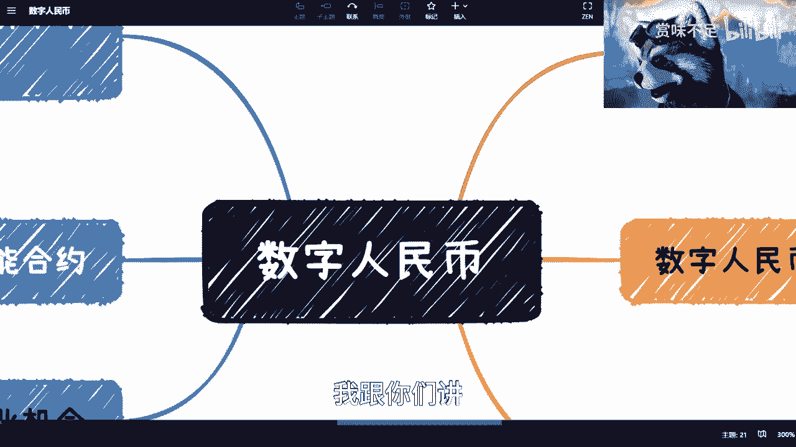

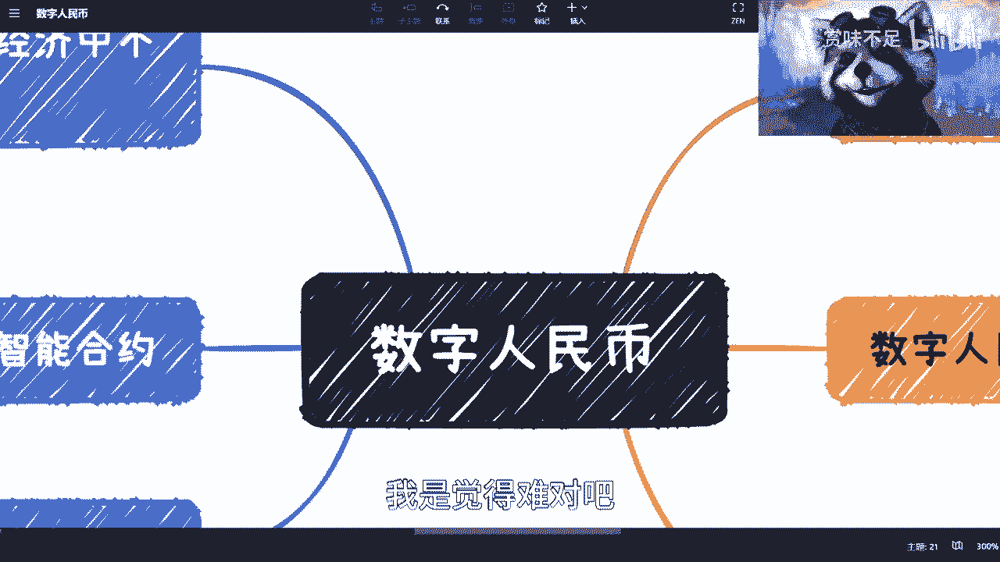

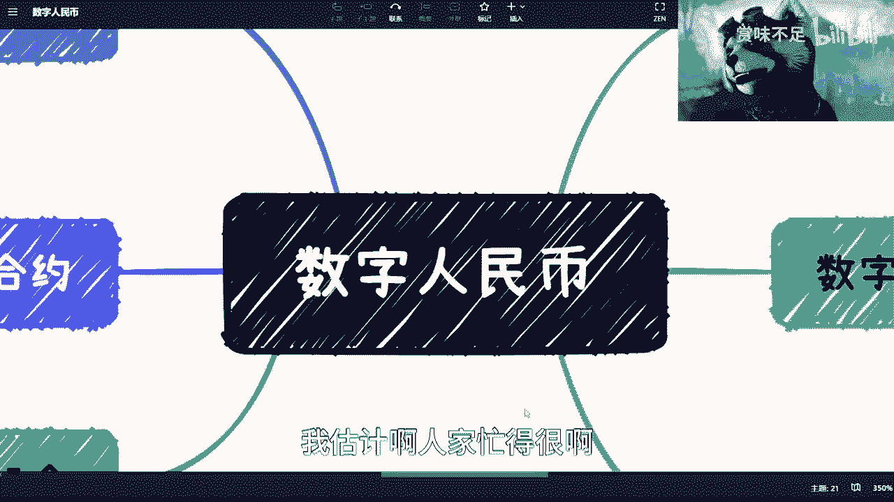

在本节课中，我们将要学习数字人民币（e-CNY）的基本概念、它与数字经济的核心关系，以及它区别于现有支付工具的关键特性。我们将探讨为何数字人民币是未来数字经济不可或缺的基石。

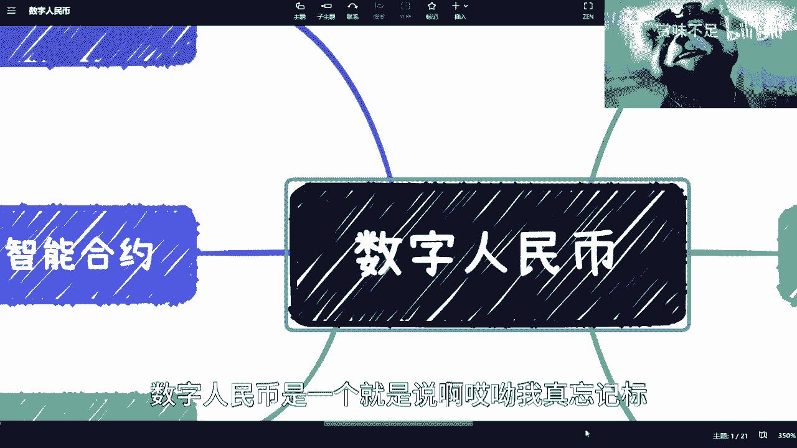

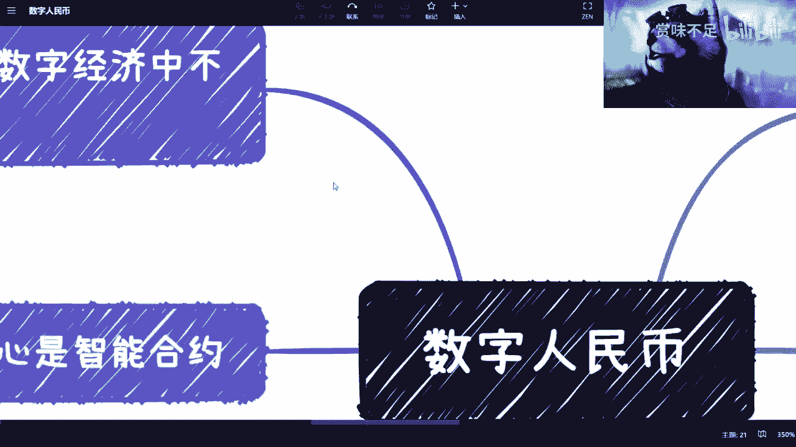

## 概述

数字人民币是中国法定货币的数字化形式，由中国人民银行发行。它并非简单的纸币数字化，而是未来数字经济体系中最关键的底层基础设施之一。本节课程将解析其核心价值与设计思想。

## 数字人民币的必要性

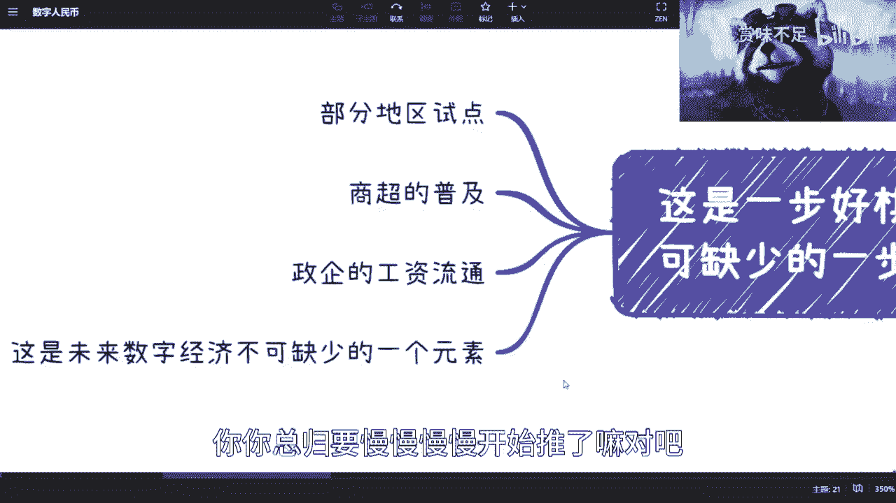

很多人认为，微信和支付宝等第三方支付工具已经实现了人民币的数字化，因此数字人民币似乎是多余的。这种观点忽略了数字经济的一个核心前提：**可控性**。

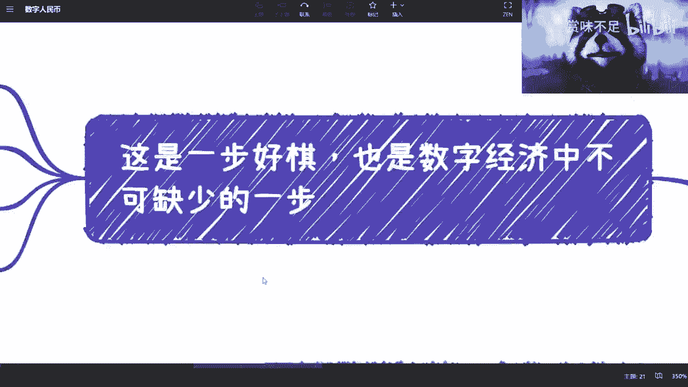

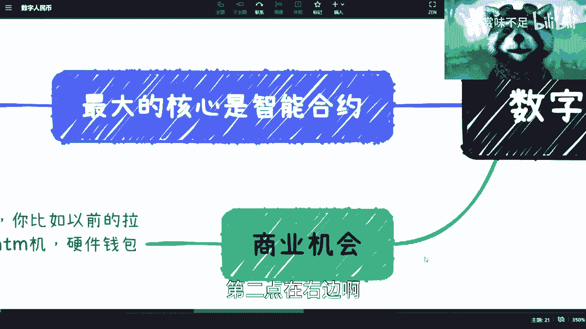

人民币是主权国家的法定货币，其发行和管理方是中国人民银行。然而，当前的移动支付体系完全由商业公司构建和运营。将一个国家的数字经济命脉完全寄托于企业之上，是不现实且不可控的。因此，由国家主导构建数字法币体系是必不可少的。

此外，数字人民币支持一些现有支付体系无法实现的关键功能，缺少这些功能，数字经济将难以深入发展。

## 发展现状与误解澄清

数字人民币目前已在部分城市和场景进行试点，例如商超支付和政企单位的工资发放。这是一个循序渐进的推广过程。

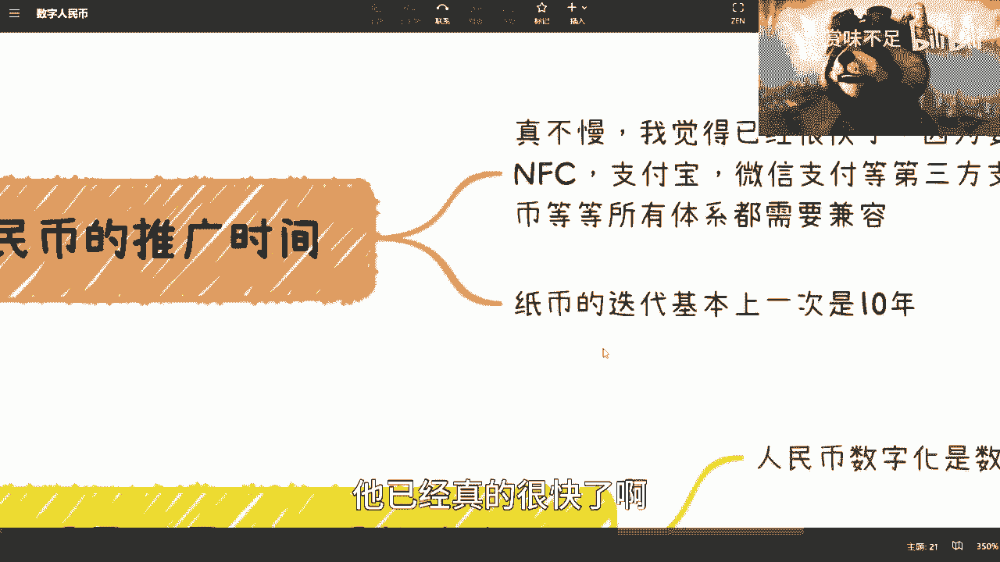

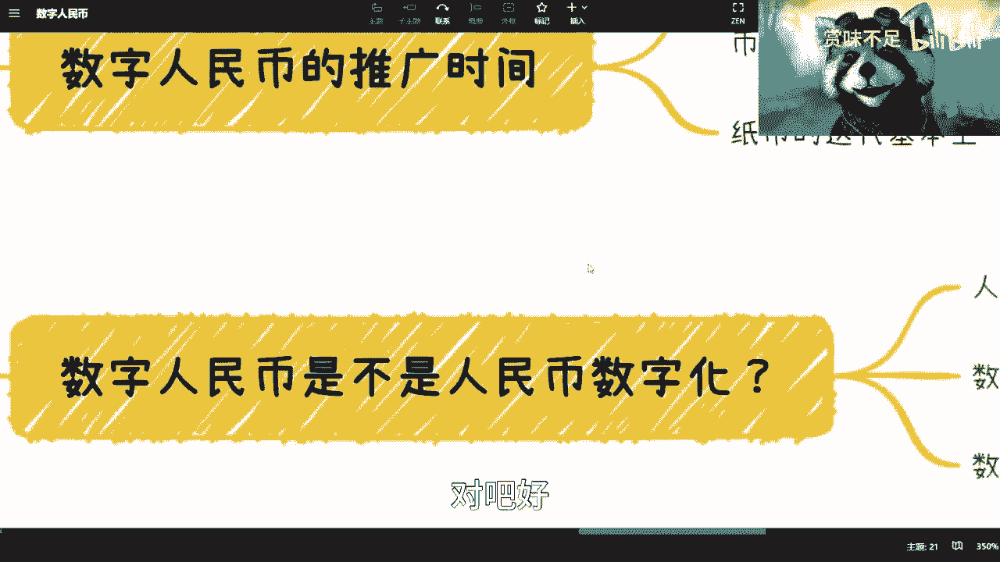

关于数字人民币，存在几个常见的误解需要澄清：

*   **与区块链的关系**：数字人民币**并非**基于区块链技术。它与区块链没有直接关系，但借鉴了其链式结构和一些设计思想。一个关键点是，数字人民币白皮书中明确指出它支持**智能合约**，这是其核心功能之一。
*   **推广速度**：有人认为数字人民币推广缓慢。但从历史角度看，中国纸币版本的迭代周期通常长达十年。考虑到数字人民币需要兼容现有支付体系（如NFC、银行卡、第三方支付），其目前的推进速度已经相当快。

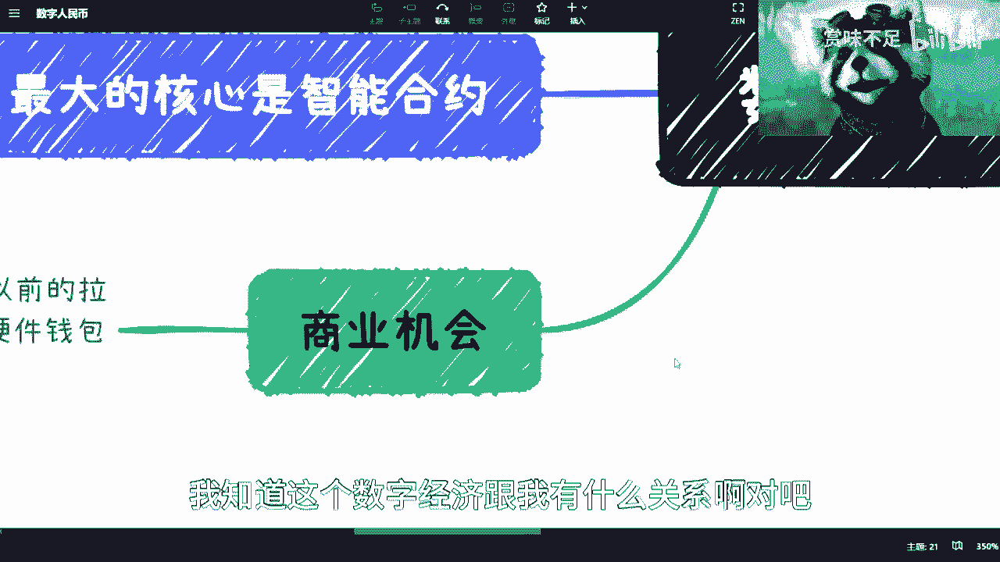

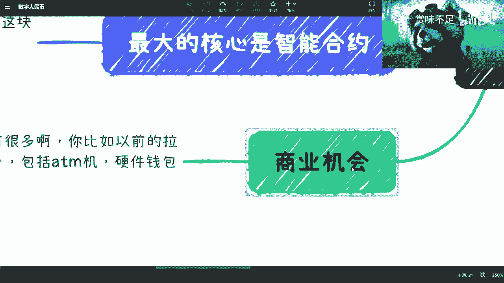

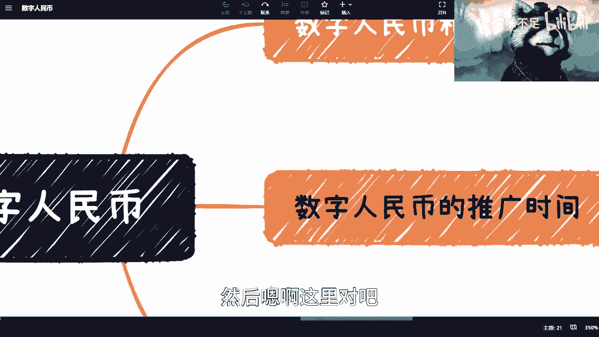

## 核心特点与价值

数字人民币不仅仅是纸币的数字化，其体系包含更深层的设计目标。以下是几个关键特点：

1.  **数据隐私保护下的可溯源**：在现行体系下，除了最终的清算数据，央行对货币流通过程中的许多细节数据并不完全掌握。数字人民币能在保护用户数据隐私的前提下，实现更精准的资金流向追踪与管理，将部分外泄的权利收回。
2.  **账户穿透与数字身份**：这是数字身份体系的重要组成部分。其目标是实现**所有能代表你身份的标识（如人脸、指纹、车牌号）都可以直接关联并用于支付**。目前支付宝、微信的“刷脸付”或“车牌付”只是在其封闭体系内做的技术封装。而央行的目标是在国家层面建立统一的数字身份体系，让所有机构对用户的认知是统一的，便于管理并提升效率。
3.  **智能合约的支持**：这是未来数字经济闭环中最重要的拼图。智能合约的核心价值在于：**通过代码技术，最大限度地减少人为因素在交易流程中的介入**。

## 智能合约：数字经济的保障

上一节我们提到了智能合约是关键拼图，本节中我们来详细看看它如何保障数字经济。

在传统交易中，付款依赖人为操作（如财务转账、个人转账），这带来了拖欠、违约等风险。目前的解决方案是“风险后置”，即事后通过诉讼等手段解决，耗时耗力。

智能合约旨在改变这一模式。例如，约定咨询费500元或劳动节支付项目款1万元，双方可以在合作之初就将条款写入一个部署在国家系统上的智能合约。到约定时间，当所有前提条件满足时，**资金将自动执行划转**。

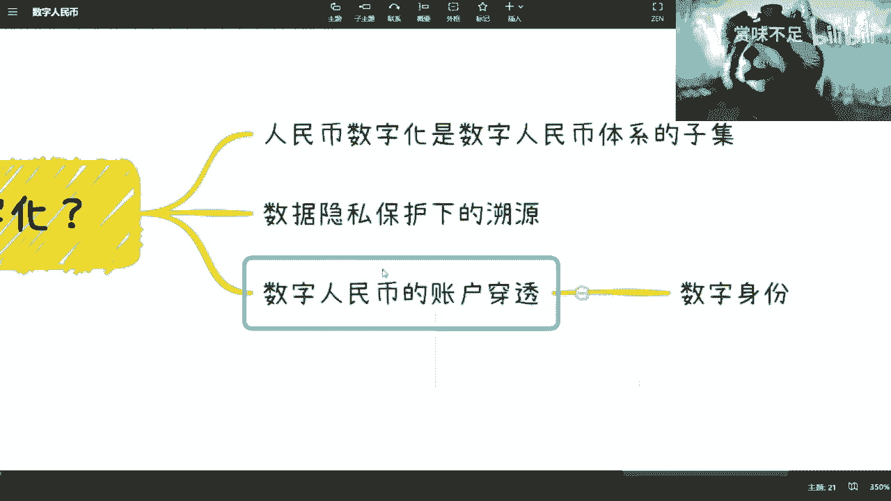

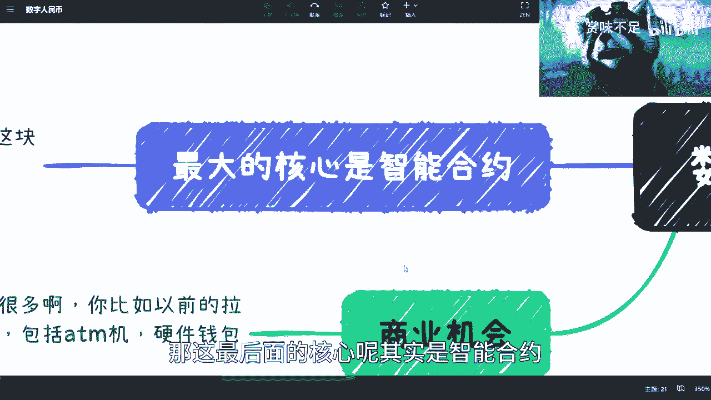

其核心公式可简化为：
**如果（条件 A 与 B 满足）在（时间 T），则（执行支付 X 元给 Y 账户）**

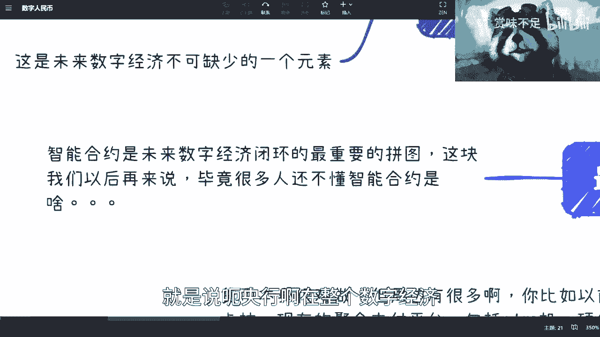

没有智能合约和数字人民币，数字经济越发展，可能产生的纠纷就越多，因为人性经不起考验。智能合约提供了自动、可信的交易执行保障，是数字经济深入发展的基石。

## 商业机会

对于普通人和企业而言，发行货币本身是央行的职责，但周边存在大量商业机会。例如：
*   参考过去的拉卡拉、现在的聚合支付平台。
*   数字人民币硬钱包（类似香港八达通卡）的制造与发行。
*   各类支付工具和受理设备的研发与升级。

整个产业链都等待着开发与完善。

## 总结

本节课我们一起学习了数字人民币（e-CNY）的基础知识。我们明确了它并非简单的支付工具数字化，而是国家为构建可控数字经济而打造的底层金融设施。它具备数据可控溯源、统一数字身份穿透支付，以及最重要的**智能合约**支持等核心特点。智能合约通过代码实现交易条件的自动执行，为未来的数字经济提供了关键的信任与效率保障。理解数字人民币，是理解中国数字经济发展方向的重要一步。