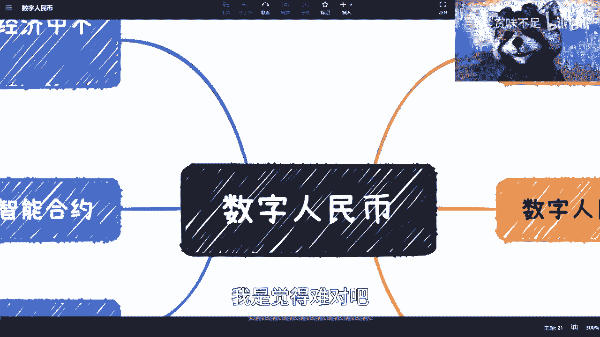
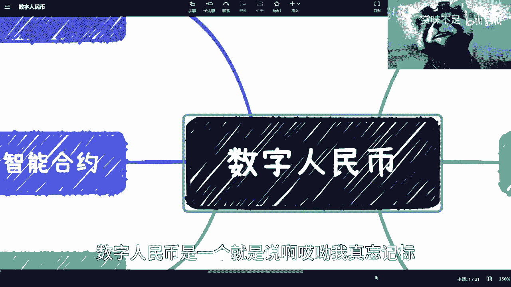
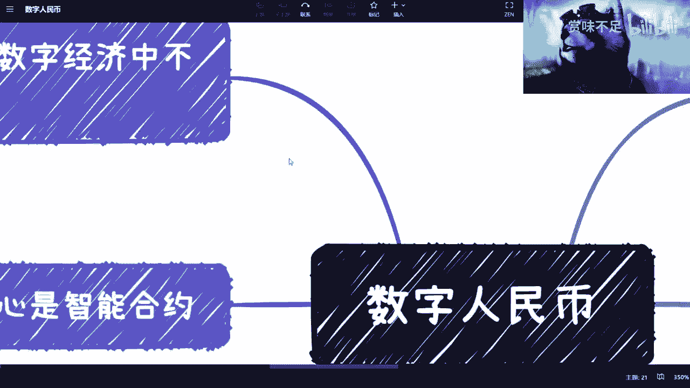
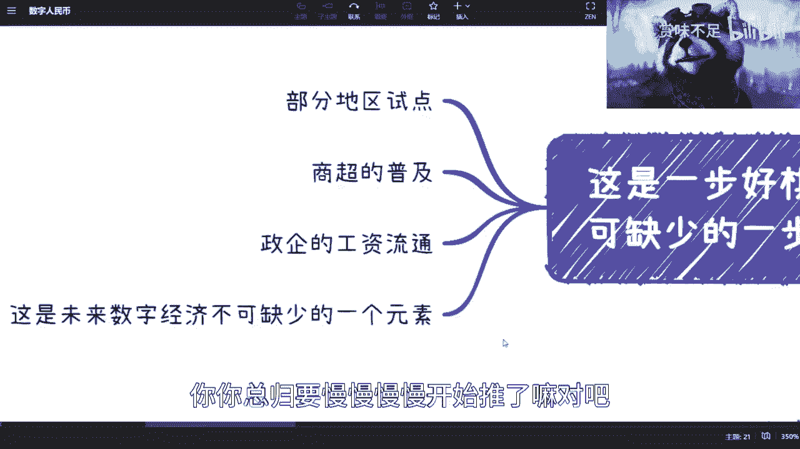
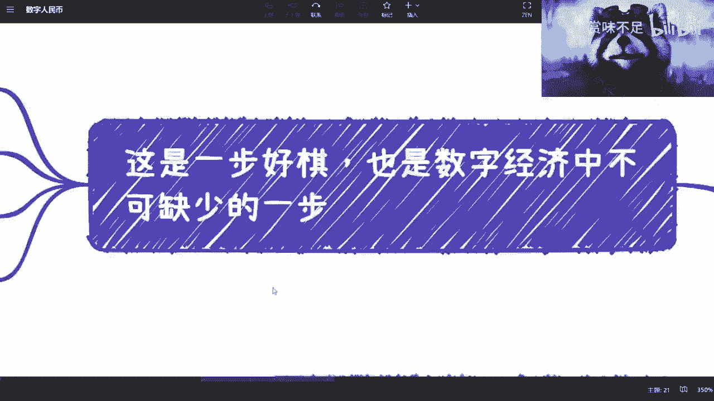
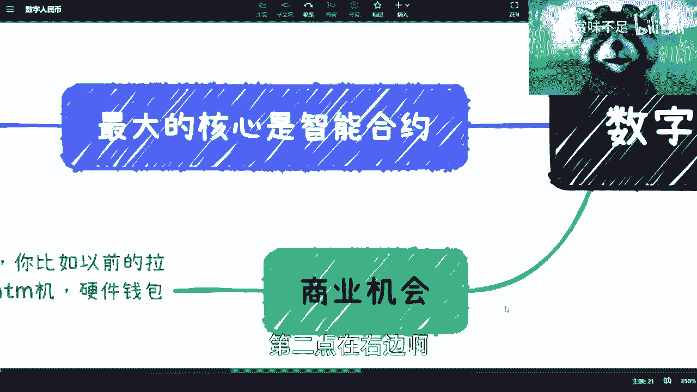
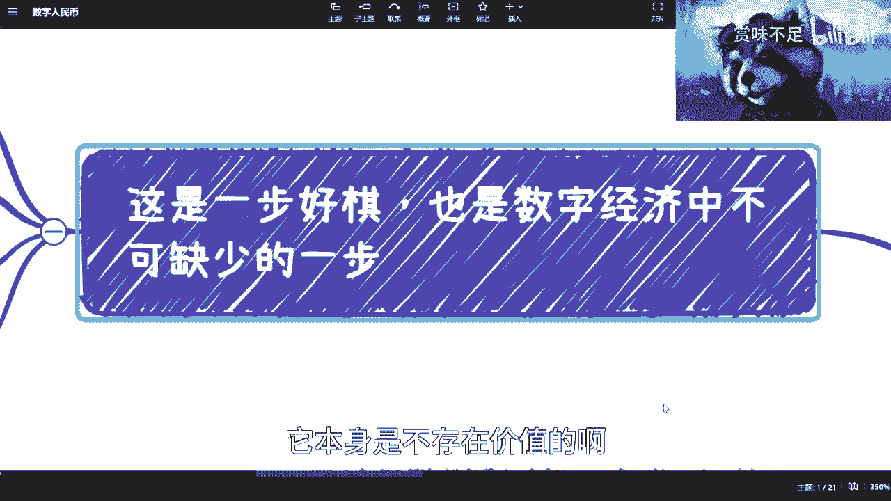
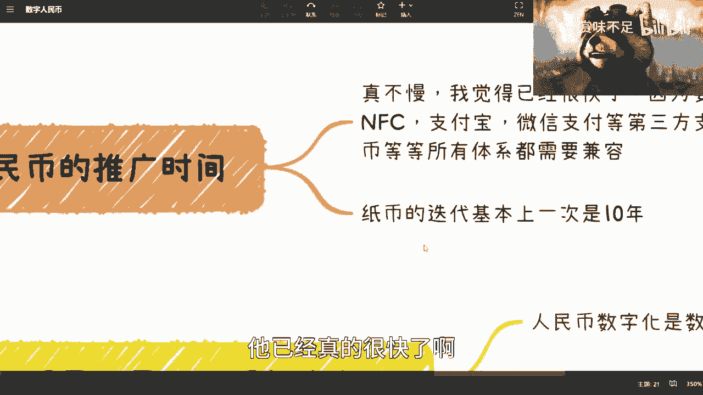
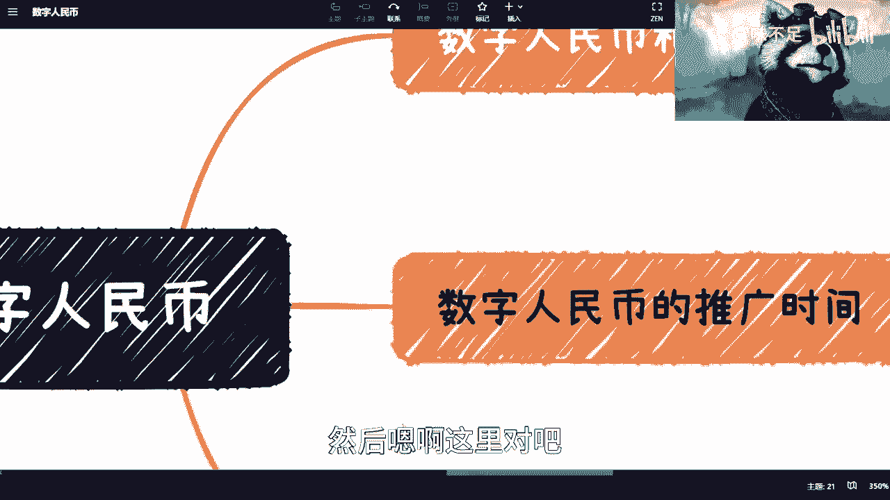
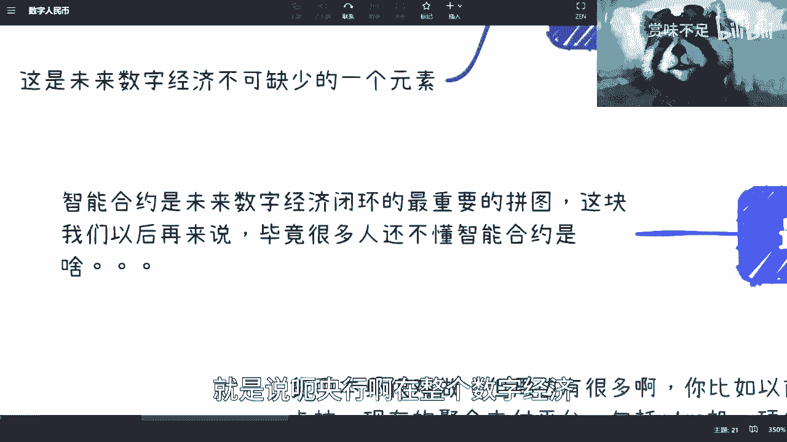

# 数字经济最重要的底层建设——数字人民币e-cny - P1 - 赏味不足 - BV1oM411u7hN

好，大家好啊呃，我是你们的吕老师。😊，对我跟你们讲，以后要是要是有人问我，你是不是姓吕，我跟你们讲，你们每一个人都有责任啊。😊。

哎呀，我真的觉得啊。😊，我我跟你们说啊，我在B站看了这么多视频啊，我在全网看了这么多视频，我是觉得难，对吧？这个拼地位啊，拼关系，我可能这个拼不过人家啊。但是这个说实在的内容啊。

以及像我这么这个为大众着想啊，要这个想想着大家未来怎么结合数字经济，我估计也就我这个人啊，那个剩下什么教授啊，学院士啊，我估计啊人家忙得很啊，忙得很。😊。

忙他干嘛我就不管啊。

啊，那么我不知道啊这一期来讲这个数字人民币啊，数字人民币是一个就是说。

啊，哎呀，我真忘记标忘记标顺序了。嗯啊对，这里。

首先啊这是一波好棋啊，也是未来数字经济当中呢不可缺少的一步啊，就这个东西呢就是早做晚早做晚做都得做啊，做了呢才会有数字经济，不做呢。😊，呵。😊，🤧嗯。我跟你们讲啊，为什么不做没有数字经济啊？

有很多人说啊，他说他说呃这个。😊，数字人民币对吧？不就是把人民币数字化嘛啊，这微信支付宝早就做了，对吧？然后第三方支付也都做了，对吧？这个不就数字化了嘛，跟互联网接轨了嘛，对吧？

有什么怎么就不是数字经济嘛？对吧？他说我们现在中国作为全球的这个领先的移动支付国家，早就数字经济了，是吧？对啊，我跟你讲啊，你这个说的也没有错啊，但是从本质上来讲啊，什么叫数字经济啊，数字经济。😊。

是一个对吧？就是说这个要要数字化，将经将这个钱啊，将这个经济要去做流通的。但是有一个大的前提是什么？这个前提是你得可控。对吧那么我们说你央行就是这个人民币是什么？人民币是一个主权化国家的法币，对吧？

那法币本身的发行方和著作不是注错了，注币应该是谁，对吧？央行对吧？好。那你们现在所看到这些东西跟央行有什么关系啊，没有关系，对吧？那这种情况下面。😊，你把整个啊一个country对吧？一个。

数字经济压在企业身上，你觉得可能吗？对吧？不现实啊。😊，啊，所以说呢这个是必不可少的。而且呢这里面还有一点，这个后面我们再来说啊，有一个现在也不支持的。所以说如果这个东西不支持呢。

数字经济很难往下去走啊。😊。

呃，从以前到现在呢，做了这个部分试点。做了部分试点。然后商超呢我也都看到了，像这个一线一二线城市的一些全家啦，对吧？各种超市也都有了啊。然后目前在做一些政企的这个工资流通，对吧？就是工资发放啊。

使用数字人民币做发放，你们可以理解为这是一个政治任务啊，这个反正就是试试点嘛，试用嘛，对吧？你你总归要慢慢慢慢开始推的嘛，对吧？那么这是一个未来数字化不可缺少的一个因素啊，呃，我看我第二点啊。

对第二点第二我第二第二点呢。😊。

啊，第点点右边啊，就是在这个地方我补充一点啊，就是说呃你们要明白啊，就是所所谓的金融价值跟经济价值是什么，金融价值跟经济价值，就是说这个钱啊，就是说这个金融本身它是需要流通的。就如果来说它不流通。

其实本质上是没有价值的。就是说你今天100块钱，这100块钱，比如说转了一大圈，对吧？到你手上，这是100块钱虽然还是你的，但是它已经产生它的价值，但如果他不出来流转啊，它本身是不存在价值的啊。

你你一定要明白这一点啊。

那么呃然后就很多人我觉得有这个误会啊，我以前其实说过很多次。数字人民币跟区块链对吧？就前两天还有评论跟我说，这个央妈做了联盟链，央妈没有做联盟链啊，央妈没有做联盟链，央央妈也没有做区块链啊。

跟区块链没有半毛钱关系啊，没有半毛钱关系，但是它有关系是什么呢？是引引用了它的整个链势结构跟区块链相关的一些设计思想，这个是引用了。

但是如果你硬要说央行跟区块链本质上就或者说那个那个呃数字人民币跟区块链有什么关系，没有关系好吗？就本质上没有关系。但是呢在数字人民币的白皮书里面写的很清楚，它是支持智能合约的，这个是重中之重啊。

这个是未来数字经济的命脉。😊，啊，这个是命脉。好，然后呢那还有人会说，他说啊，这个推了好长时间了是吧嗯。😊，感觉没推起来啊呃这个事情呢我之前这个很多次也说过啊，我这边再提一下。首先呢呃有没有推起来。

不是靠你们觉得的，也不是靠我觉得的啊，我们觉得都没用啊，我们这个。😊，对吧？就觉得太过表面啊，首先呢本质上已经很快了。因为它要兼容太多东西啊，就是比如说NFC进场支付啊，支付宝、微信等第三方支付啊。

对吧？银行卡啊、纸币啊，对吧？包括现在的很多这种支付体系，它都要兼容。😊，对吧你不能说啊，我因为要推数字人民币了，我以前东西都不管了，那不可能的呀，对不了？那当然了。

这个说那些说我感觉数字人民币没有推起来人，你们嘴皮子上下翻翻，反正很快啊，那从国家来讲，它不可能啊，对不对啊，要做的真太多了，我跟你们说太多了啊，然后呢那个从历史来讲呢，也一样啊。

就是说历史上中国的所有纸币的迭代周期基本上就是一次制10年，你们想想看啊，纸币的迭代都要十年。那数字人民币啊，是吧？你现在说它慢慢在哪里啊，它已经真的很快了。😊。

啊，真的很快啦。对吧。

好，那么接下来呢还有这个对吧？就有很多人又说了啊，我知道这个数字经济跟我有什么关系啊，对吧？我要商业机会对吧？好商业机会啊，我来说一下啊，商业机会啊，你看啊货币本身对吧？

比如说这个猪币或者币税对或者相关的这个跟我们没半毛钱关系，这是央行的事情对不对？但是呢周边很多对吧？你比如说我们参考以前的比如说拉卡拉对吧？现在的聚合支付平台对吧？包括一些ATM机当然了。

也有很多人说了，你数字人民币有毛ATM机是吧？好，没有那没有的话，你硬钱包总可以吧，对吧？你硬金钱包没有，那你弄个什么像那个香港那种一卡通总可以吧，对吧？八大通总可以吧，是吧？有很多了，能做的太多了。

对吧？就我们说核心啊这个普通老百姓做不了，那你这个这个这个什么子总可以做吧，工具都可以做吧，啊，能做的太多了，这都不是机会吗？是吧？整个中国都等着你去做呢，是吧？😊。

哎，真的我不跟你们开玩笑啊，真的。😊，啊，然后嗯啊这里对吧？那还有人说啊，他说啊数字人民币是不是人民币数字化，对吧？这个我之前在讲facebook那一期的时候，我也说过了，对吧？

数字人民币立项是2014年就立的项。😊。

对吧14年就立得项。所以说呢如果来说咱还是这么说啊，以央行的水平。啊，以央行的水平，以央行这么一个在中国。14亿人口这么一个基础上的金融水平，他要做一个东西的数字化。😊，用得着14年就立项嘛，对吧？

或者来说我们换句话说，他要做一件东西，数字化，他用至到14年立项18年才推出来嘛，对吧？都没必要啊，我数字化怎么了？数字化做不来吗？😡，是吧数字化很难吗？啊，那本质上不在这个地方，本质上要考虑的是什么？

本专要考就我跟你讲，这就像什么，你知道吗？这就像很多人在跟我说，他说我要换换行业，我要换赛道，对吧？我要考研，对吧？还是那句话，你们换赛道换行业去找个岗位很难吗？也不难，你们考个研很难吗？也不见得很难。

但是难在哪里，难在是你们换完赛道考完研对吧？这个找好岗位跳完槽，你之后干什么，你知道吧？因为你不能老是做一件事情，就是解决当下的问题，然后过了三年又碰到同样的问题。然后怎么办？你不停跳槽。

不停考研考一辈子研是吧？对吧？你你你你要你要想好后面的事情，对吧？当然你说我现在想不好，没问题，但是你要去考虑，你不能说好，我不管对吧？我选择最终奥意不管对吧？人三年后再去考虑，那。😊，哎，就这样吧啊。

就就只能说就这样吧啊，你就就就这种情况就就以后就别来问我了，我我也无奈了是吧？😊，啊，然后呢我们来说啊，首先这个人民币数字化呢是数字人民币体系里面的一个子集，就是它肯定是要数字化的对吧？这毫无疑问啊。

第二呢，我来我我就不说完整的特点，完整点说起来就很很多很多的好吧，就我先说简单的特点啊，重中之重的。第一个是那个数据隐私保护下的一个溯源，这个是央行必须要去做的，对吧？就是说就是说因为现在整个的清算啊。

包括纸币啊，很多东西，它是就是除了最终清算在央行这边，其实包括纸币的流通啊，包括支付宝这个第三方支付的这边账单，其实它它相当于是个数据整就是数据的一个核对，最终只示央行本身其实对很多数据他是不知道的。

你知道吧？它只是最终做了一个核对，啊，那么这件事情其实对于这个跟踪啊，溯源啊，其实包括数据隐私保护非常不利。😊，啊，就是相当于有一部分的权利在外泄，对吧？这是一方面。第二方面是什么呢？

就是数字数字人民币的这个账户的穿透。这个就是我在一开始跟你们在数字经济里面说的数字身份的一部分啊一部分因为你数字身份这个东西是一个非常广义的东西。但是在数字身份里面。

你一定会有一个东西叫做数字人民币的一个账户的穿透解释一下是什么意思啊，简单来讲就是说所有代表你身份的东西都可以代表你身份去直接做支付啊，那么当然这个从业务上面你们可能理解起来比较好理解。

就比如说你刷个脸啦，吧？刷个刷个刷个指纹啦，或者刷个呃这个车牌了，对吧？那你可以直接支付啊，这件事情呢，be啊，也许就是说微信跟支付宝现在也已经帮你们做啊，就是说你刷刷刷刷脸啦。

刷刷这个他知道你的这个车牌，它就能支付了，对吧？但是你从整个技术架构来讲还是很不一样的。因为你从技术架构来讲呢，就是说支付宝在这个当中只不过是帮你做了装。😊，啊，什么叫封装呢？

就是在你没有感知的情况下面，帮你把你的车牌跟你的支付这个账号做了绑定啊，然后呢他帮你做自动的免密支付，对吧？这个是他做的但是本质上这件事情跟你的账户跟你的这个数字身份有关系吗？没有半毛钱关系。

因为你的数字身份仅仅在阿里的体系里面，而不在全国的体系里面，你知道吗？那央行要做的是什么？央行就要做的是在国家的范围内，你的数字身份是统一的那这样的话，未来不管是支付宝还是微信还是任何一家企业。

他对于你的这个人的认知是统一化的，而不会说哦我对于你这个人认知，不知道对吧？我还得自己给你建立一套什么账户体系啊，然后呢，我自己再要去映射一下，就是去一一对应一下，说哎这个人到底是谁，对吧？

跟我的账户里面的这个账这个账户名又是谁，对吧？是怎么对应的，很烦啊，而且对于央行来讲不好管理。😊，对吧这个是核心。哎呦，我靠刚刚怎么回事？这个是核心啊。😊。

那最最后面的核心呢，其实是智能合约。

啊，智能合约。那么智能合约呢其实是未来数字经济闭环当中最重要的一个拼图啊，那么这块东西呢，我觉得等我后面再来说，因为我会先把智能合约这个东西讲一下，因为很多人可能还不知道智能合约是什么。😊。

不要先讲一下啊，那么还是那句话，合约本身它的这个smart contract的出处呢，可能是从区块链出来的。但是呢本质上用也不见得说只有区块链可以用，对吧？那么。那么我们现在就这么说啊。

就是说呃央行啊在整个数字经济，就或者说数字人民币，在整个数字经济里面，它的核心在哪呢？

它的核心并不在于支付。😊，啊，他的核心是在于。通过代码或者通过技术的方式。来避免或者尽可能多的避免人为在交易当中的介入。啊，什么意思呢？很简单，就比如说今天啊我问你们做个咨询，对吧？

我说我一个小时收500块钱啊，然后呢，你们跟别人合作啊，比如说别人答应你们啊，明今年的比如说5月1号劳动节啊，给你们这个转账转1万块钱，对吧？好，那么这个时候就有问题，什么问题呢？

就是我问你们要500块钱的时候是怎么，你们是怎么给我的，你们是通过你们的人肉的方式打给我的，对不对？好。😊，那么那些企业劳动节给你打1万块钱，怎么打的呢？也是通过财务转账的方式打给你的，对不对？好。

那么在这种所有的金融的转移的过程当中啊，我们说所有的这些操作，他都是人为操作的，那么人为操作这个当中就会避免不了有个问题是什么？就是万一他不操作怎么办，对吧？万一他这个给你拖延怎么办？

万一他给你拖款怎么办，对吧？就各种各样的问题，你都是意料不到的，那么按现有的整个逻辑是什么？就是我只能就是叫做风险后置，什么叫风险后置呢？就是说你不给我钱，对吧？他不给你钱好，没关系。

我到网上网报你对吧？我我我我我起诉对吧？人民事诉讼啊，我说这个人欠我钱不还啊，这个答应给我500块不给啊，对吧？然后你们也说好，那个人那个企业劳动节答应给我们1万块钱没给对吧？好家打官司对吧？

但是你们想想看啊，首先打官司本身他的时间。😊，期很长。第二呢，他费时费力。对吧也就是说，从整个当下的解决方案来讲，它并不是一个最优解，对吧？那当然了，咱们也不说数字人民币就一定是个最优解。

但是从某种角度来讲，智能合约和数字人民币在未来要做到的就是同样的，你给我500块钱和那些企业给你们1万块钱。但是这件事情呢在一早。😊，的时候，在我们做约定的时候，就不仅仅只是合同上的约定。

而是我们会部署一个智能合约这么一个东西。在央行也好，或者来说网信办也好，就是国家的某一套系统上面。然后那么各自就会去放心的去做对应的这个这个合作的业务。而到约定的时间。

根据约定的条件以及约定的时间以及约定的这个数这个金额数目，它会在时间到的时候自动的做转账。啊，自动做交易啊，当然也可能不交易，因为你可能前提条件没有满足，对吧？好，那么这个时候呢。

这个本质上其实就是数字经济在未来的一个最大的保障啊，有为否则的话，没有智能合约，没有数字人民币。按照当下情况，其实数字经济在往后发展，只会出现无数无数无数多的纠纷。😊，为什么？因为没办法。

人性是经不起考验的。😡，对吧。😊，行，那就先这么着啊，这个这个东西的模块啊，这个拼图我在这个地方先给你拼上来啊，拼上了这个东西是重中之重。好吧，后面再讲所有的数字经济时候，都会跟这个东西有关系。😊。

好了，你们吕老师结束了，好吧，就这么着吧。😊，呃，我去对我跟你们讲，我这个双十日在干嘛？我跟你呃打星期二对吧？打暗黑4，打生化危机。😊，嗯，啊反正是打游戏。我我跟你们说，我下了很多恐怖游戏，对吧？

毕竟我以前是个恐怖游戏F主，但是我我现在下了这些游戏我都不敢打啊。😊，好了，就这么着吧，好吧，谢谢大家。😊。

