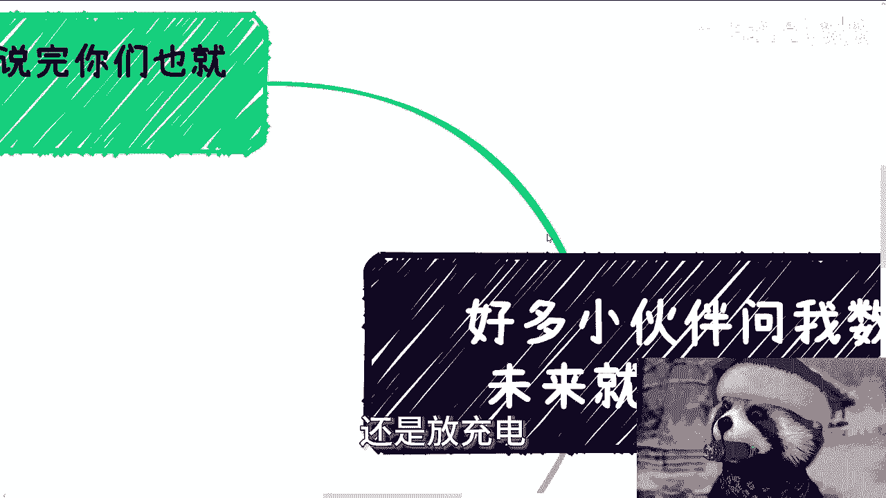

# 课程一：数字经济的未来就业与商业机会分析 🧐

在本节课中，我们将深入探讨数字经济领域，特别是区块链等新兴技术方向的未来就业前景与商业机会。我们将分析当前行业现状、教育体系的问题以及个人应如何正确看待和准备进入这一领域。

---

上一节我们概述了课程主题，本节中我们来具体看看区块链专业的现状与困境。

许多伙伴询问数字经济未来的就业与机会。经过深思熟虑，我认为需要坦诚讨论。以区块链为例，今天一位咨询者提到，目前进入区块链领域就业似乎很困难，社会上机会也不多。

实际情况是，不了解行业内部动态，不代表相关事件没有发生。行业内具备一定认知的人都清楚，当中国第一所高校——成都信息工程大学成立区块链专业时，其发展路径就已注定。

**核心问题在于市场结构**：区块链技术缺乏面向消费者（C端）的大规模业务，也缺乏能够广泛承接业务的企业。其主要应用场景集中于大型企业（B端）和政府（G端）。既然没有大面积的企业需求，自然无法产生大面积的就业岗位。这种状况在过去和现在都是如此，这是由其技术特性和国家战略定位决定的。

当时无法直言，因为无人相信。学生、家长不信，企业可能认为是在断其财路，高校也可能认为观点不正确。事实需要时间验证。如今再看，市场上真正招聘的岗位和落地的项目数量足以说明问题。

讨论这类技术或战略方向时，应关注**政治导向**和**KPI（关键绩效指标）导向**，而非空谈价值。在现阶段，远未到广泛实现商业价值的程度。AI等新兴风口的发展逻辑同样如此。回顾历史，大部分技术的发展无法直接触及C端应用，最终只能服务于B端、G端以及KPI与政治目标。因此，单纯讨论就业机会意义不大。

---

上一节我们分析了区块链就业的根本矛盾，本节中我们来看看数字经济就业市场的具体表现。

数字经济领域存在就业机会吗？答案是肯定的，但其规模几乎可以忽略不计。

以下是存在的几种岗位类型：
*   **咨询公司**：提供行业分析与建议。
*   **培训公司**：进行相关技能与知识培训。
*   **行业协会**：负责行业协调与标准制定。
*   **国有企业与央企**：因政策要求设立的相关部门。

这些岗位的产生，主要是为了满足**政治正确**和**KPI导向**的需求，而非因为这些业务本身能创造显著利润。对于整个行业或庞大的求职者群体而言，这类岗位的开设与否几乎没有区别。

因此，近年来高校开设的数字化相关专业毕业生前景如何？可以明确地说，作用非常有限。问题不在于数字经济本身，而在于其机会主要存在于大B端、大G端或为高端服务业提供支持。缺乏C端市场和创业土壤，个人难以切入。而要进入B端、G端或高端服务领域，又需要深厚的沉淀与积累，这恰恰是毕业生所缺乏的。

更现实的问题是，当前许多高校的数字化或区块链相关专业课程设置如同“缝合怪”，从不同专业东拼西凑几门课程，学生难以掌握扎实、可用的技能。市场上真正急需的是能合作的技术伙伴、能落地的项目讲师，但这类人才极其稀缺。

---

上一节我们指出了市场机会稀少，本节中我们将审视当前高校教育存在的脱节问题。

第三点涉及高校师资。必须指出，我并非鄙视高校教师，但根据近年来的接触经验，尤其是长三角地区一些知名院校的教师，其教学内容的实用性令人担忧。

以元宇宙、数字资产、区块链等话题为例，许多头衔光鲜的教授、院长，其授课内容却如同“木乃伊”——仅仅是照搬维基百科或百度百科的资料。他们通常将网上搜集的资料复制粘贴到PPT中，然后照本宣科。一旦被追问技术细节或实际案例，往往无法回答。

一个典型的例子是讲解**POW（工作量证明）**。全球最典型的案例就是**比特币**。然而，当要求教师用比特币详解POW的流程和技术细节时，他们大多一无所知。大部分学校的教学停留在概念介绍层面，例如知道**UTXO（未花费交易输出）** 不是完整的账户系统，但对其具体运作逻辑和实现方式却不甚了了。

说句不客气的话，有多少教师真正使用过中心化/去中心化交易所或冷钱包？有多少教师拥有真实的项目落地经验？这现状近乎一个笑话。

---

上一节我们揭示了教育与实践的脱节，本节中我们来总结问题的核心与个人的正确应对之道。

问题的关键不在于是否要关注未来方向，也不在于是否要为未来方向去攻读一个专业。

核心矛盾在于：即便你获得了数字经济方向的本科或硕士学位，你能做什么？就业市场上连对应的岗位（Headcount）都很少。你的专业技能是拼凑的，教师也大多缺乏实操经验。你具备什么特殊技能？

真正的赚钱机会存在于社会实践中，存在于B端、G端和高端服务领域，并且**前提是拥有相关的资源沉淀、人脉积累和项目经验**。如果这些都没有，那么除了被高校收取学费，这个专业还能带来什么？

许多人听到AI或数字经济是方向，便认为报读相关专业或硕士就能把握机会。这是错误的认知。一个方向存在增量市场和赚钱机会是事实，但**准备方式绝不是简单地“读个专业”**。

这种误解源于成长环境和社会观念的长期影响，让人们认为出路只有读书和专业这一条路。然而，许多有增量的、能赚钱的领域，与你在学校读什么专业**没有直接关系**。

财富的创造需要具体的出口和名目，不会因为你把名校学历或顶会论文贴在脑门上就从天而降。进入好学校、好专业，绝不等于拥有了未来机会。

---

**本节课总结**

本节课我们一起学习了数字经济与区块链领域的就业现状：
1.  **市场结构局限**：机会主要集中于B端/G端，受KPI和政治导向驱动，C端应用和普适性岗位稀缺。
2.  **就业市场狭窄**：存在的少量岗位多为政策衍生品，对解决大规模就业问题帮助甚微。
3.  **教育与实践脱节**：高校专业设置常为“缝合怪”，师资缺乏实战经验，教学停留在概念层面。
4.  **个人准备误区**：把握未来机会的关键在于积累**实践技能、行业人脉和项目案例**，而非盲目追求高学历或热门专业头衔。真正的切入点在社会实践中。

---

（注：关于商业规划、分红分润、商业计划书、合同咨询等具体服务，如有需要，可整理好具体问题通过私信进一步沟通。）