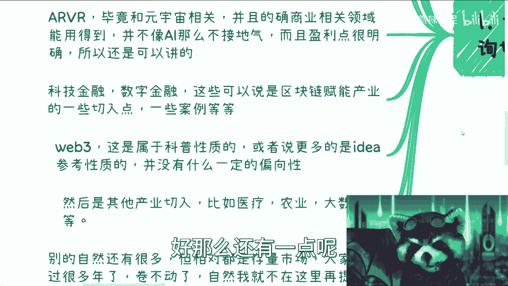
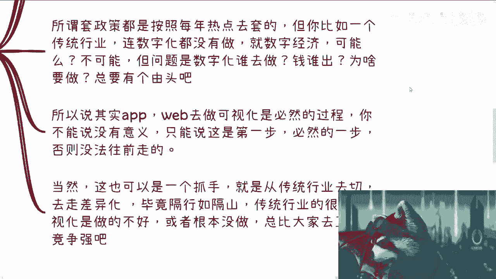
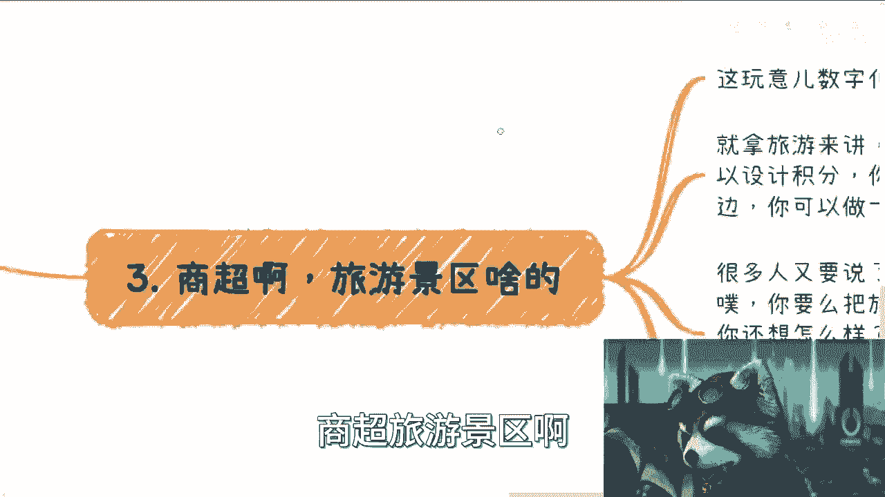
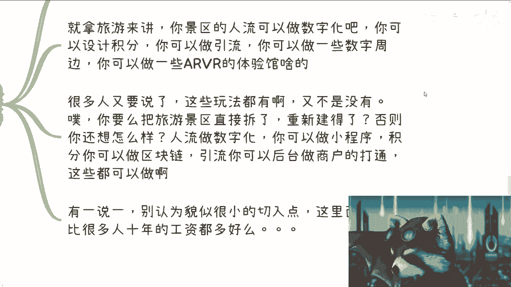
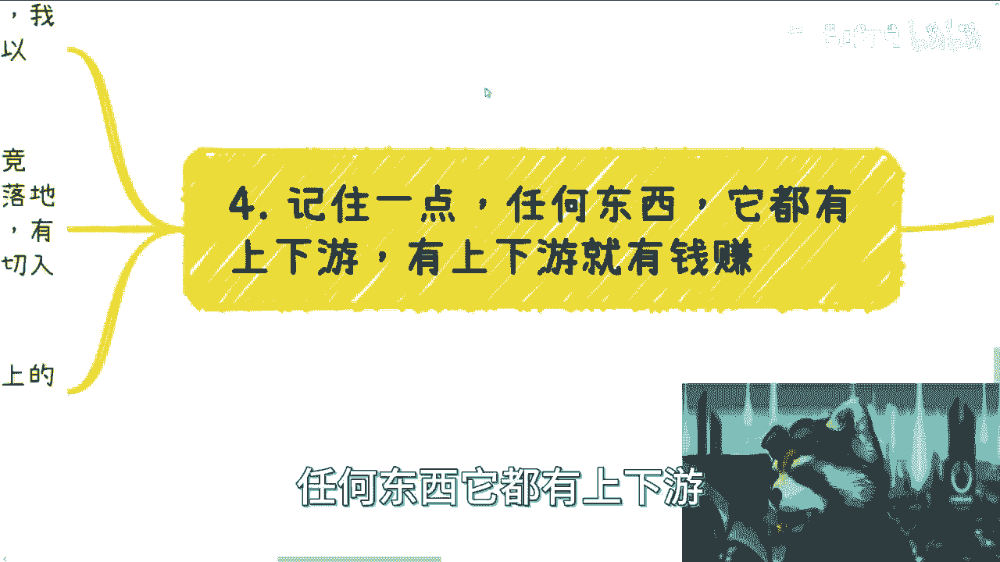
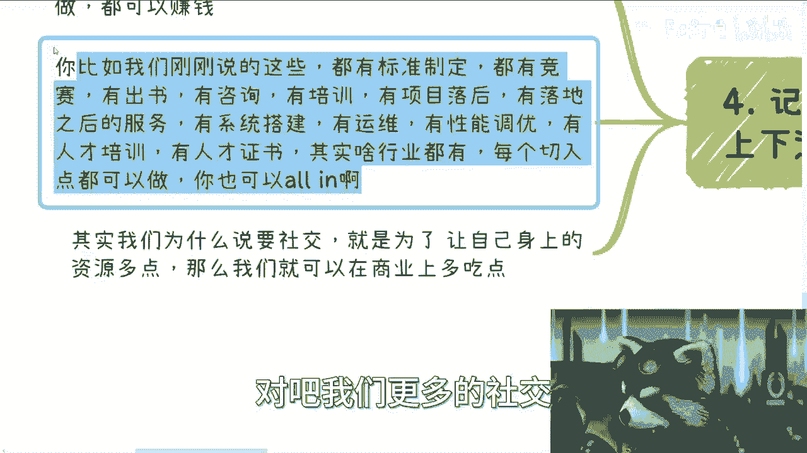

# 数字经济篇1-全局从各个角度梳理下现在数字经济的切入点---P1---赏味不足---BV1Hw411

在本节课中，我们将从多个角度系统梳理当前数字经济的核心切入点。课程将涵盖元宇宙、区块链、AIGC等热门领域，并分析如何在实际商业场景中寻找机会，避免常见的认知误区。

---

## 1. 核心切入点分析

上一节我们介绍了课程概述，本节中我们来看看数字经济领域有哪些具体的切入点。以下是当前值得关注的主要方向：

*   **元宇宙**：政府高度关注，是数字经济的重要方向。其商业应用和具体内容将在后续课程中展开。
*   **区块链**：作为全球联动的底层技术，是重要的数字基础设施。关注国内的政策导向和应用场景是关键。
*   **AIGC（人工智能生成内容）**：当前热点，但其技术核心（如大语言模型、深度学习、算力）具有垄断性或国家主权属性，对大多数小微企业和个人而言，直接参与门槛较高。其商业模式可能更多是“`利用开源技术进行包装和融资`”。
*   **AR/VR**：与元宇宙相关，但已形成独立的商业应用线。在**旅游景区、商超**等场景有接地气的落地需求，相比AIGC更贴近实际商业。
*   **金融科技/数字金融**：高校、企业持续关注的领域。可以看作是“`区块链技术赋能传统金融产业`”的具体案例，与市场周期关系不大。
*   **Web3**：尽管存在监管讨论，但其概念科普、新理念引进等领域仍有需求。不应因外界噪音而完全忽视。
*   **产业数字化**：如**数字经济赋能医疗、农业、大数据**等，是国家和地方政府重点推动的方向。

对于已经非常成熟、成为“存量市场”的领域（如某些传统数字化服务），由于竞争激烈且先发优势明显，对于资源有限的新进入者而言，建议谨慎选择。

---

## 2. 实体产业的数字化逻辑

上一节我们梳理了宏观切入点，本节中我们来看看实体产业数字化的具体逻辑。很多人认为，为已有数据的传统行业做一个展示用的网站或APP（可视化）没有实际意义。

这种从纯技术或逻辑角度的质疑有一定道理。然而，从商业和社会发展的角度看：

1.  **数字化是基础**：一个传统行业若没有数字化的“0到1”，就无法谈论更高级的“数字经济”。可视化应用是迈出第一步的必要抓手。
2.  **政策与由头**：产业升级需要符合政策导向的由头。数字化改造正是这样一个符合发展潮流、能获得支持的切入点。
3.  **差异化机会**：传统行业的数字化水平往往较低，这为互联网从业者提供了“`利用信息差和技术优势进行差异化竞争`”的机会，比在纯互联网红海市场竞争更容易。

因此，帮助传统企业完成基础的数据可视化和互联网化，本身就是一个巨大的市场，也是切入更深度数字经济的必经之路。

---

## 3. 具体场景应用举例

理解了实体数字化的必要性后，我们来看看更具体的应用场景。以下是几个可以快速切入的领域：

*   **商超与旅游景区**：这些场景的数字化、元宇宙化潜力巨大且易于落地。
    *   **人流数字化与可视化**：通过小程序等工具实现。
    *   **积分体系**：可以结合区块链技术，增加可信度与趣味性。
    *   **引流模型与数字周边**：为商家提供通用型后台管理系统，开发虚拟商品。
    *   **AR/VR体验**：为腿脚不便或无法亲临的游客提供沉浸式游览体验，兼具商业价值与社会价值。

关键在于**举一反三**。不要追求创造一个完全不存在的东西，而是在现有业态上进行增值加工和模式创新。一个很小的垂直切入点，其商业价值可能远超想象。

---

## 4. 产业链思维与资源整合

任何一个切入点都不是孤立的。我们必须记住：**任何商业领域都存在上下游产业链，有产业链就有赚钱的机会**。

我们提供的产品或服务，只是整个产业链中的一个节点。以数字化项目为例，其完整的产业链包括：

> 标准制定 → 竞赛/出书（出版物） → 咨询 → 培训 → 项目落地 → 系统搭建 → 运维/性能调优 → 人才培训/证书 …

这其中的每一个环节都可能产生高额利润。没有人或公司能独立覆盖所有环节，因此**社交与资源整合**变得至关重要。通过合作，我们可以从自己擅长的节点出发，逐步向上下游扩展，从而在商业蛋糕中分得更大的一块。

切勿因为听到“某个领域凉了”的传言就放弃机会。很多时候，机会就在那里，只是被噪音掩盖了。

---

## 课程总结

本节课中，我们一起学习了数字经济的多个核心切入点，包括元宇宙、区块链、AIGC等。我们分析了实体产业数字化的内在逻辑与商业必要性，并探讨了在商超、旅游等具体场景的应用。最后，我们强调了用产业链思维看待机会，并通过资源整合来扩大商业版图的重要性。记住，在数字经济浪潮中，保持独立思考，深入理解行业本质，才能发现并抓住真正的机遇。

*（注：本课程将持续更新，后续将针对各切入点进行详细展开。）*