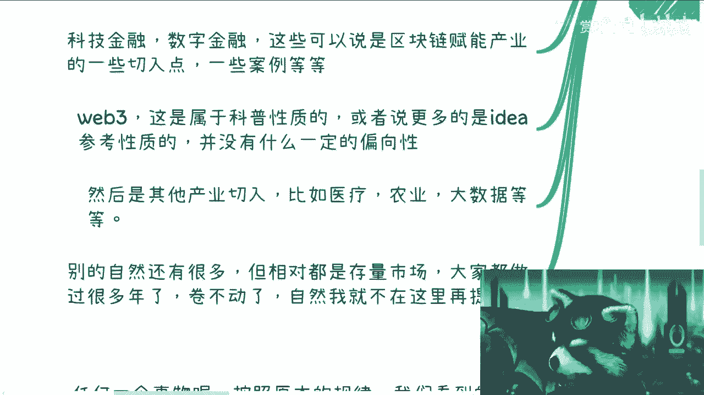
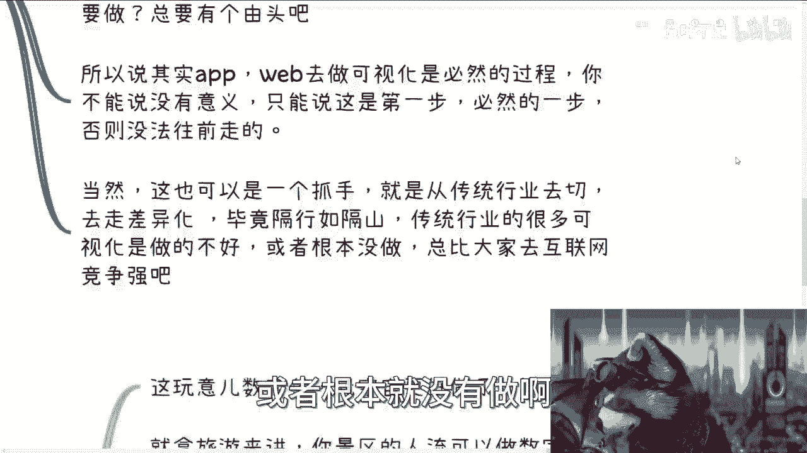
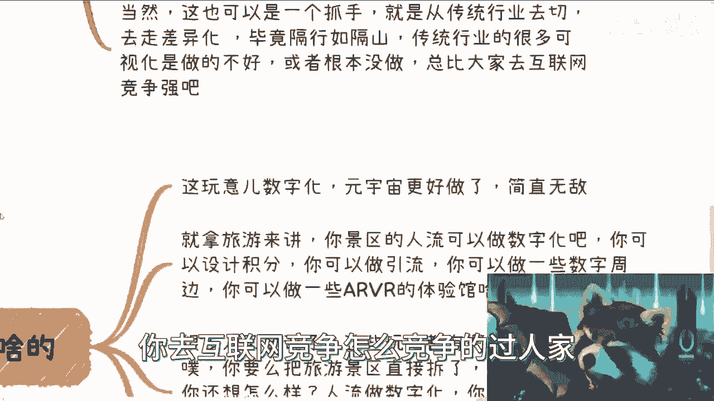
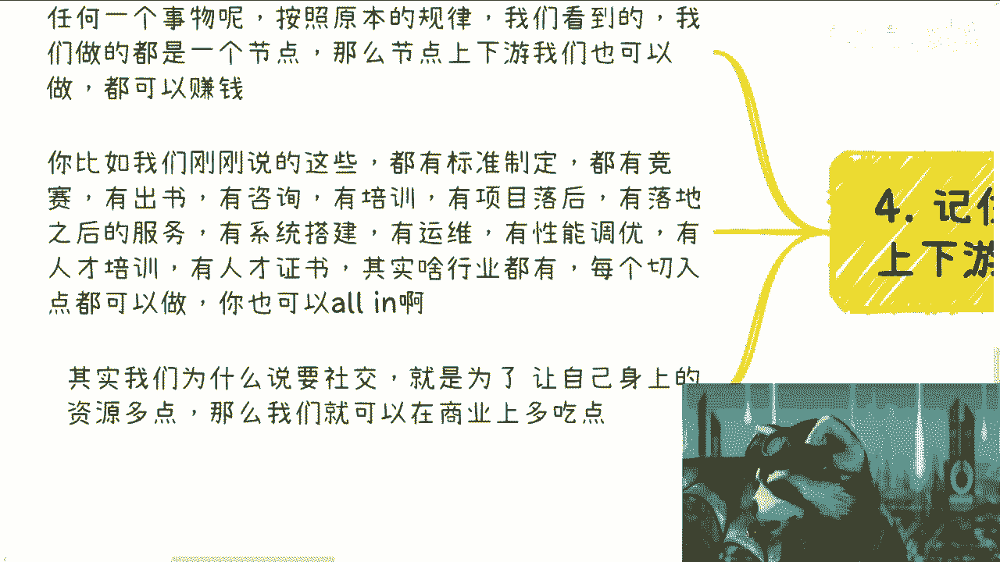
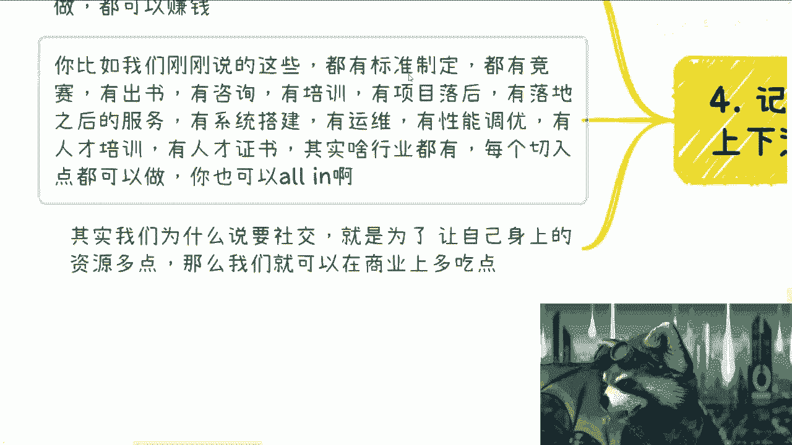
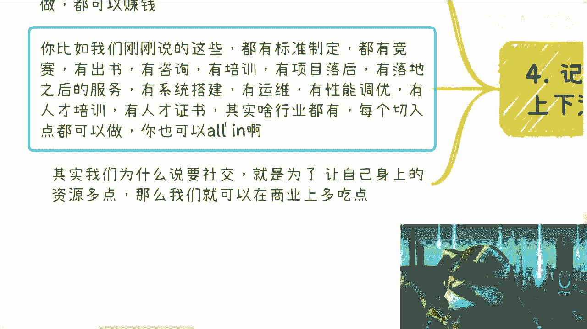

# 数字经济篇1：全局从各个角度梳理下现在数字经济的切入点 - P1 - 赏味不足 - BV1Hw411F7RV

啊这个我来给大家开一张新的片啊，数字经济数字经济，数字经济呢我打算后面可能就一直开下去吧，好吧，因为这个东西能讲的东西太多呃，我先给大家捋一下，然后后面如果有必要的话，我把每个点都给你们说一下。

因为哎呀我觉得真的就是嗯没事讲了再说吧，好吧耶，怎么又啊，可以可以可以啊，这个这个东西的嗯稍等啊，好了好了好了好，那么首先一般来讲目前数字经济的切入点啊，首先元宇宙对吧，那么元宇宙呢我跟你们说啊。

因为政府关注，所以说呢元宇宙肯定是在列的，而且我把它放在第一位，你要说元宇宙说点什么呢，这个我后面我再给你们展开好吧，因为这个东西就是说我不会再去开一个什么，什么元宇宙篇，这个没必要的。

就全部归属在数字经济篇里面啊，呃而且呢我跟你们讲啊，别就是说以讹传讹，道听途说对吧，就是就别所有人都在说啊，这个元宇宙凉了对吧，或者说就说什么matter对吧，呃什么什么市值跌了300亿对吧。

或者怎么样没有意义的呀，你说去谈这种东西干嘛呢，对不对，我们只要关注对吧，就是我们自己有哪些切入点可以赚钱对吧，而且说这种话的都是不懂的，你我这么说啊，我去给别人讲元宇宙一讲肯定都是讲一天的哦。

我他妈跑过去跟人家说，哎这这这玩意儿凉了啊，或者就是这个matter，我他妈讲一天怎么讲啊，你面对政府领导面，面对人家的企业，就这么讲，人家不把你轰出去是吧，我跟你讲，真的就讲这种话的都是不懂的。

哎是吧，然后是区块链，区块链作为基础建设，而且还是全球都在联动的技术啊，必须是这个大家包括我国关心的当然也一样的，不要去以讹传讹，觉得比如说我的牛市熊市对吧，我告诉你中国有中国的国情，你要想赚钱。

你只要关注中国关注的东西就可以了，你别别只老是关注这些，有的没的，我就发现大家都喜欢关注，有的没的，你问他跟你有关系吗，没有跟你赚钱有关系吗，也没有，那你关注他他妈的有用啊对啊，然后AIGC啊。

这也是必然的火嘛对吧，但是AIGC呢我告诉你们，他只能我大概率啊，他未来只能成为一种历史回顾，就有热点还是蹭热点，这没毛病啊，嗯那个那个为什么呢，因为AIGC毕竟没有什么很多可以说的。

而且对于G和B来讲呢，它并不是那么接地气，为什么，因为你想嘛大数据语言模型深度学习啊，包括这个这个叫什么这个GBT对吧，包括算力，它本来就是个垄断式的东西，或者说是一个是一个政府主权化国家。

他需要去掌控的东西，这不是一个就是说阿猫阿狗对吧，什么小微企业就能做的东西啊，那当然了，你要说哎，我们就是这个从开源的东西上面拿过来对吧，抄抄补补啊，包装包装，然后假装有一个什么什么什么AI的东西对吧。

然后我去拿一些融资怎么样子，这个无所谓啊，但是我就说就说我们单纯从咨询角度来讲，如果要跟别人讲明白这个东西，那这个东西其实没什么很多好讲的，而且就是说从需求点角度来讲，他没这么大的需求点啊。

那么还有就是ARVR啊，毕竟跟原宇宙相关啊，ARVR会独立成一条线啊，并且ARVI也的确有其商业相关的领域，用得到啊，它不像AIGC这么不接地气啊，你比如说ARVR对吧，那无论是一些旅游景区啊对吧。

还是说是一些商超啊，他都用得到，那你告诉我他妈的AI用些什么玩意啊，又怎么怎么用对吧，动不动你问人家来我采购个东西多少钱，1000万，2000万，他妈脑子有病啊，谁他妈来采购对吧，你们但凡出去做做商业。

你们就明白了，10万20万，人家都是要跟的在那盘半天呢，对吧好。

那么还有一点呢，就是金融科技，数字金融这些东西呢是相当于是什么呢，就是说嗯高校啊或者企业啊，各个地方都关注的，而且呢这个东西跟市场好和坏没有关系，大家都要关注的，因为你不进则退嘛，你总要往前走嘛对吧。

那么这些呢，他可以说是区块链赋能金融产业的一些切入点，一些案例啊，那么还有一点就是web3啊，那么web3呢还是那句话，就是说不是说大家啊这个又又又很多人啊，说到web3，我web3国家也不关心了。

对不对啊，对不对，怎么样子，你管他打不打压呢，卧槽他妈的，我告诉你，web3也有科普的需求，你做不做嘛，对不啦，他妈打不打呀，跟我们有什么关系啊，啊或者说他会有更多的这个新的id。

也是从web3这边去引进的，去借鉴的对吧，没有什么偏向性啊，然后就是其他的产业切入，比如说啊比如说这个数字经济赋能医疗，数字经济赋能农业，数字经济赋能大数据啊，这些东西都是国家在做的。

而且各地方政府关心的东西，我就明确跟你们讲啊，然后别的呢自然也有很多，但是相对我为什么不去提，就是因为它还有很多，比如说数字化或者很多东西，它它是存量市场，所谓存量市场就是说已经在你们去接触之前。

已经会有非常多的人去接触了，或者是在我接触之前，就已经被非常多的人这块蛋糕去翻过来，那我们就没必要再去动了对吧，那你说我们为什么要去动这些东西，是因为我们比如说在互联网领域，我们再去这些领域。

我们相对来讲是嗯有信息差对吧，有一定优势的对吧，但是如果说这个是一个存量市场，那对于我们来讲啊，你说大部分人对商业商业没有经验，互联网互联网本身这个技术能力也不是特别强，那你跑过去干什么呢对吧。

所以说卷不动啊，我就不在这个地方提了啊，那么第二点呢就是关于一些实体产业啊，那么最近呢咨询我实体产业的人其实蛮多的啊，我跟你们在这个地方总体说一下啊，呃其实任何东西无论是怎么样啊。

他就说他无论套什么壳子，它其实都是有0~1的，之前杭州线下就上周嘛，杭州线下活动呢也有小伙伴提出这样一个问题，他的意思就是说很多产业数据都是有的对吧，你比如说像像像像那个做做挖挖油对吧。

呃这个是煤矿对吧，或者说像现在有非常多的这种呃铁啊铜啊对吧，二次加工对吧，那么他认为很多数据都是有的，只不过是存储形式不一样啊，但所谓现在做数字化，比如说几百万几千万对吧。

这种数字化他可能就是做一个application，或者来说一个website去显示出来没有意义好，那么这件事情是这样子的，我为什么一直跟你们说，你们要去完完全全的打消你们以前9年制。

义务教育加高等教育所受到的东西，以及所学到的东西，以及就是说你们要完全打破你们的工程师思维，因为如果你从一个逻辑角度来讲，他的确没有意义哦，你说他妈的数据都有了，甚至啊我们就说这个app的数据。

website数据它都不是传感器出来的，他他妈是他妈人工他妈的输入的对吧，你说哦你你现在做一个application对吧，做一个做一个网站，做一个app哦，背后的数据人工输入的，他妈的说的对不对。

你都不知道，那他妈的就是傻玩意，有什么好做的，对这句话没有错没有错好，但是我想问什么，我想问的是，你们是想去跟我或者跟政府battle这个东西，对还是不对，还是说你们想去赚这笔钱，你想明白吗。

你管他对不对呢，对不对，这跟我们有关系吧啦哎我真的我跟你说真的，我有时候就觉得叫什么啊，这叫什么卖着什么什么的事儿，对吧呃，操着什么什么的心，对不对啊，你所谓套政策他每一年都有热点。

你不可能2023年套一个2015年的东西，对不对好，那么你比如说一个传统行业，他他妈的连数字化都没有对吧，就他妈的你要套数字经济可能吗，我就问你可能吗对吧，哦你说整个社会发展哦。

自行车没有蒸汽蒸汽火车没有，对吧，你你你各种各样的东西都没有，就跟我说，来造航母，你可能忘了怎么造了。

你很多都需要基础的呀，对不对，那我问我就问你嘛，那么问题来了，就说你说这些东西要做数字经济的好，没问题，那么做数字经济0~1要做吧，那数字化谁去做呢，钱谁出呢，为什么要做呢，他总归有个由头吧。

哦你跑过去跟人家练炼钢的，炼铁的说来我要做数字化，卧槽人家他妈觉得你，我为什么要做，有毛病啊，对不啦，就就我就说啊，我为什么一直跟大家说，大家要去了解这个社会的运作规则，就是因为不要自己异想天开啊。

你觉得没有意义是没有意义，但是对于社会发展，对于社会进步，在整个整个国家这个局面它就有意义啊，你没有意义，那是你的事情对吧，所以说其实application website去做可视化。

它是一个必然的过程，你不能说没有意义，你只能说这是第一步，而且是必然的一步，他否则没法往前走啊，怎么走啊啊当然这也可以是一个抓手，就是说比如说我们我们啊，比如说有很多人说唉我想做的东西对吧，好。

你可以从传统行业去切去走差异化对吧，毕竟隔行如隔山，就说传统行业呢他很多数字化和互联网化呢，他做的的确很垃圾啊，很拉垮啊，嗯而且呢他数数据可视化做的很不好，或者根本就没有做啊。

那么我们就可以帮他做对吧，那总比我们在互联网去竞争强吧，你去互联网竞争怎么竞争得过人家对吧。

好，那么第三点，比如说商超，我随便给你们举例子啊，啊商超旅游景区啊。

我跟你讲这玩意的数字化，这玩意的元宇宙化，这玩意的数字经济化，我更好做了，简直无敌，你知道吗啊，你就拿旅游来讲，你景区的人流可以做数字化吗，啊可以做可视化吗对吧，你可以设计积分吧，你可以做引流模型吧。

你可以做一些数字周边吧对吧，你可以做一些ARVI的体验馆对吧，你说有很多人年纪大了，腿脚不方便的，他也想看看景区，那怎么办呢，你做一套VR的东西让他看看不开心吗对吧，而且你高度能拔得很高啊。

绝对高德高道德制高点啊，对不对。

怎么不能做呢对吧，开发你们的想象力啊啊那么很多人又要说了，他说哎呀，刘老师，你这说法就不对，他说这些玩法都有了，也不是没有了，那我就这么告诉你啊，任何一个东西在人类社会上。

你除非把他妈的旅游区这块地移平了，重新建啊，否则哪个东西没有啊，对吧，我我们不都是在原本的东西上面，往往上做加工吗，哦你非要说我要弄一个完全没有的，这他妈你何必自己跟自己过不去呢，对吧。

这就好像我以前一直跟咨询的时候，我一直跟他们说，你一年能赚1000万，你为什么一定要去融资，做一个什么几万人工资再去赚1000万呢，尼玛脑子有病吗，这不是对不对对吧，你你人流做数字化可视化。

你可以做小程序吧，积分你可以做区块链吧，引流你可以给商嗯，那个商家做通用型的这个cm的后台吧，这你都可以做啊，怎么了呢，对吧啊，我跟你们讲啊，很多地方就是你们要举一反三了，因为我不可能涵盖到所有点。

对不对，就是说很多地方你不要觉得这个切入点很小，我告诉你，这他妈的一个很小的切入点。

比你10年工资都多好吗，真的啊。

记住一点啊，第四记住一点，任何东西它都有上下游。

有上下游就有钱赚，什么意思啊，就是说你今天切入一个东西，任何一个东西它都有原本的运作规律，而我们做的一定都是个节点，就是你的思维里面你可能不知道，但是你得有这个意识，就是说我们做的是一个节点。

这个节点上下游它一定是存在的啊，而且一定可以赚钱，我们没有赚钱，只是因为我们不知道你明白这个道理吧啊好。

那么你比如说我们刚刚说的这些啊，都有标准制定，都有竞赛，都有出书啊，也都都有纸质出版物，都有电子出版物，有咨询，有培训，有项目落地，有落地后的服务，有系统搭建，有运维，有些人调车呃，性能调优。

有人才培训，有人才证书，什么都有，对不对，好，然后我可以告诉你，这每一个每一个逗号当中，每一个点里面的利润都可以很高很高，很高很高很高很高很高对吧，其实各行各业都可以用，每个切入点都可以做。

你也可以选择你all in对吧，所以说我们为什么说啊，我们一定要去社交，我们的目的是为了让自己身上资源更多，因为你想想看，我不管你今天有任何的能力，多么的出类拔萃。

你这上面能全部做得到吗，你有这个能力吗，不能，但是你有你有没有可能全部做到，可能那就是你得通过资源，通过你身边的合作方把它涵盖进去，而不是说你这家公司或者你这个人涵盖进去，你没这个能力的呀。

谁他妈有这个能力呀对吧，我们更多的社交。

就是为了让我们的资源更多一点，就是为了让我们在商业上能够能够，更多的吃一点，你明白吧，就比如说我们今天所有的人做的，只是这里面的很小一个很小一个点，对不对好，那么我们也希望就是说比如说我本来做运维的。

我希望往外扩扩到做培训，扩到做咨询，但是就像我们说的，虽然在同一个行业里面，但是隔行如隔山，你要去做培训，做咨询，你也要明白里面的道道对吧，那你要去明白可能很难，那你可以找人合作啊，对不对。

那这样的话就就算啊，你在这里面能赚10%，20%，那他妈也比你一点不赚好吧对啊。

就是我跟你们讲啊，就是说我们做任何东西啊，嗯切记不要以讹传讹啊，你就像你就像其实啊我们我们就这么说，任何一个东西它其实都会有很大的商机，都会有很多赚钱的可能性啊，但是你们不是我跟你们说。

你们不是说很多时候抓不到现金，而是当你们抓到献祭的时候，你们就听别人说这个东西不行了，哎这个东西他妈的经没人没人搞了，好了，对不对，他们懂个屁呀，唉真他妈离谱，你知道吗，好吧行啊，那就先这样啊。

然后有什么你们反正那个跟我说好吧，然后有什么详细的问题或者商业的问题，你们就整理好，然后走咨询，数字经济这个东西呢我打算一直往下讲啊，我估计少的话能讲个三四十七，多的话我就一直往下讲好吧。

