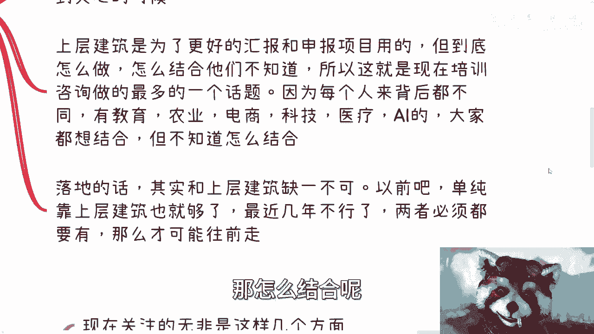
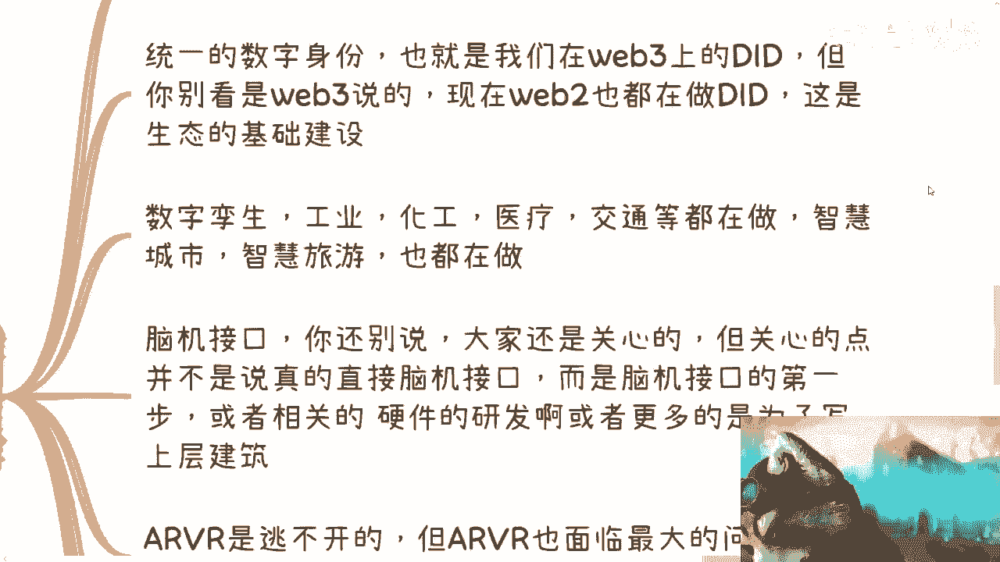

# 数字经济篇2：从政企角度来说下元宇宙当下关心什么 - P1 - 赏味不足 - BV1gH4y1z7Fe

哈喽大家好，嗯言归正传啊，这个好久没有往下面讲啊，我们今天继续来讲数字经济篇，第二个啊，就是说在咨询培训中啊，目前整个全国啊，元宇宙在政企这边到底在讲些什么东西啊，呃很多小伙伴很疑惑啊。

都觉得元宇宙凉了对吧，我之前呢就上个月吧，我去中关村刚刚讲的元宇宙是吧，呃反正我就这么说吧，啊对于大部分那些好高骛远对吧，就是呃自以为自己自己感觉很良好啊，然后自以为好像很懂的人，就会觉得。

去讲元宇宙文吗，就是欺骗了是吧啊。

好还是那句话啊，C端的感受并不重要啊，我们只要关注企业端跟政府端的感受就好了，毕竟他们付钱啊对吧，你这个碰到什么网上这边说什么不好，那边说什么不好啊，线下说这不好那不好的。

那你要就是你们但凡愿意随波逐流，那你们就随波逐流对吧，就不要一边随波逐流泪，一边还说我的，怎么怎么没有机会对吧，怎么怎么好像现在机会都没有，我告诉你们满地都是机会，但有几个人抓得住呢，对啊。

其实这种培训蛮好的，因为线下来呢基本上也都是一些政府领导，然后也都是一些企业家呃，线下呢也跟我有非常多的交流啊，大家属于教学相长啊，我讲的东西呢跟别人其实可能也不一样，因为大部分的人呢。

他其实都是照搬网上的内容呃，我不一样，我一般来讲东西是这样子的，就是我会先去讲其官方的定义，就比如说国际的标准，或者国内的这个这个政府的这个定义啊，然后结合自己线下，比如说在呃呃高校啊。

或者企业家这边所沟通，交流出来的很多的落地的方案。

综合结论来做我的这么一个课件啊。

那我们先说第一个，就政企现在关系越语中到底是什么东西。

你虽然说我啊我这次主题就两个，一个是元宇宙在web2和web3的发展。

另外一个是元宇宙当中的数字经济发展对吧，两个东西一共讲了三个小时，呃我们从这个主题当中呢，其实可以扩展出来的就是一个是web2是什么，一个是web3是什么，以及元宇宙又是什么，数字经济是什么，对不对。

那你想嘛我三我三个小时除以四对吧，呃嗯我看看180分钟对吧，除以四，那差不多40分钟一个内容啊，以及如何最好的落地场景，呃说难听点就是就是说的直白一点，就是上层最上面的10%，跟最下面的10%。

他们是最想知道的，中间的这些就是模棱两可的啊，上不上下不下的内容，其实无所谓啊，这就像很多人呃日常哎，就是我首先希望你们能明白一个道理啊，就是呃其实真正的我们我们说技术也好，别的东西也好。

我们不是都有所谓的民用技术跟工业使用嘛，对吧，或者军用嘛对吧，那其实我觉得这个知识点是一样的，就是很多时候你会发现，就是说弊端跟极端所关心的知识点，跟民间所关心的知识点它不是一个东西啊。

你就像民间这边很多人啊，就说啊这个东西牛逼啊对吧，这个东西大家好像很新鲜啊，或者很怎么样子，你真的放到G跟B这边，他们不关心的，因为既跟B关心的东西，要么就是更凌驾于民间的内容，要么就是更接地气。

为什么呢，因为没有办法，他们他们要要么就是那我在这边写的，汇报和申报项目所使用的，那么你的高度一定要高，那么这个东西一般都是会比民间的，这些内容来得高的啊，那么你比如说到底怎么做，怎么结合，他们不知道。

所以说呢这也是现在就是说啊，培训咨询当中最多的一个话题，因为每个人来呢，他背后代表的这个这个产业都是不一样的啊，有的是教育，有的是农业，有的是电商，有的是科技，有的是医疗，有的是AI等等等等等等等。

对吧，你就说啊我要结合元宇宙，那怎么结合呢对吧。

你你得有个solution啊，那这个东西是大家最关心的，那么我们刚刚说的下面10%也就最落地的，那么同样的落地这个东西呢，也会比民间的知识点更落地，为什么，因为民间的非常多的人去讲东西，他比较夸大啊。

他因为个人嘛对吧，口无遮拦，而且这另外一方面他也喜欢炫耀，但是你放到政府跟企业这边，你没有办法炫耀啊，因为你的目标是要告诉他我能做，或者说我要完成我的KPI，你不是为了去炫耀的。

你在那边口无遮拦没有用啊对啊，已经口无遮拦了，放到民间这边，我觉得很多人高度又答不上，这就是目前所面临的上不上，下不下的这么一个境界啊，那么落地的话呢，呃最近几年不太行，因为最近几年不是经济啊。

包括各大家说白了也没有那么好骗了，那么两者必须都要有。

那么才能往前走啊，那么我们说到这个核心啊。

就是说我们说元宇宙到底哪些方面啊，呃首先呢关注点无非这么几个方面啊，第一个也是最最那个那个叫什么，叫做基础建设的，就是呃DD啊。

统一的数字身份，也就是我们在web3web3上面所说的DID，但是呢你别看web3上面说的，现在web2也在做dd啊，因为什么，因为这是一个生态的基础建设，但是当然啊这一点又要说了，就是说你想想看。

说到数字身份，它每一个地方都要有啊，因为你无论是我们刚刚说的什么什么什么呃，教育啊，医疗啊，农业啊等各个地方，你要往下面做数字化改造，你要往下面做数字生呃，那个数字这样吧。

数字经济你要往下面往下面做元宇宙，你没有数字身份，你怎么做对吧，因为你在这当中不管你针对的是政府企业个人，你都得有数字身份吧，啊你没有数字身份，你做个屁，你在整个的一个生态里面，最小单位最小一个叫什么。

就是与这个业务相关的挂钩的，这么一个身份都没有，那你做个屁啊，啊那么这第一个第二个数字孪生对吧。

我们以前也讲过，就工业化工，医疗交通这些用的比较多啊，然后智慧城市智慧旅游这种做的也比较多。

那么这种东西呢，呃就前两年我们做项目，基本上都是2000到2000万左右，这么一个项目报价吧，呃呃脑机接口你还别说啊，就是可能很多人就觉得哎呀，马斯克在做这个东西是吧，要怎么样怎么样，那国内还早是吧。

呃呃还是那句话，早嘛归早，但是大家关心的而且关心的点呢，不是说现在你就要落地对吧，大家也不是关心这个东西，大家关心的是脑机接口的第一步他怎么做，或者说相关的这些硬件啊，芯片的研发啊。

亦或者来说就是说呃就像我们刚刚说的。

我们得结合脑机接口去写上层的这个方案啊，那么另外一点呢就是A2B2，A2B2呢本质上是逃不开的跟元宇宙嘛，但是A2V2现在面临最大的问题在哪里呢，还是在于民用化，就是呃目前你们也看到了，就A2比亚。

比如说商用啊对吧，或者说有实验室啊对吧，或者说旅游啊，嗯包括什么博物馆啊，这些可能有用，但是他并没有普及，到目前为止，最大的问题还是在于民用化，如果什么时候民用化能普及。

那基本上这个浪潮就就就可以起飞了啊，但是A2比亚你们自己往前看啊，但凡看过历史的，你们就会明白，ARVR在以前跟AI是一样的，就是他已经有几波风口了，但是这几波风口都没有起来啊。

当然AI我也是一个道理啊，我告诉你们，我我现在的认知一样的，就是AI一样的，也就是个风口，也就是一个抓手，而不是说什么哎呀这个产业要起飞了，而这个产业未来怎么样，我没有看出来这产业未来怎么样。

我看到的只不过就是呃资本家和投资投资人啊，这个上层很多人拿来做圈钱的工具没了，就这么简单啊，那么另外一点就是虚拟空间，虚拟空间呢包括虚拟展厅啊等等等，那么这些呢也是现在元宇宙教育，说的最多的一个切入点。

当然了，为什么教育会说的比较多，这跟疫情也有一定的关系啊，当然这个教育本身它的场景的契合度，契合度也是比较有关的啊，那么还有一个就是现在说数字人和数字化改造，当然这个东西在我看来呢可能有点勉强啊。

但是问题不大，因为什么呢，因为我也跟你们说过，就是所有的每一年的汇报，他很多时候都是换汤不换药的，但是呃换汤不换药呢，呃他也得把这个汤换掉啊，所以说这个汤呢每一次每一年都要切合呃，新的一些东西。

所以说呃他现在也也也肯定得往远处上面靠，哎这就像什么呢。

这就像我现在就算过去讲元宇宙过，就算过去讲区块链，我也是往数字经济上靠是一个道理。

因为没有办法嘛对吧，你做G跟B你就是要这么做的啊。

好那么说到这我也知道啊，你们在想些啥啊，你们就会说啊，这些东西跟老百姓关系不大啊，首先呢我觉得这样子啊，在我看来关系还是蛮大的啊，因为基本上呢记跟B都不懂啊，但是但是呢还是那句话啊。

因为很多小伙伴呢他觉得自己很懂啊，但是你们要明白你们的知识面，你们的知识点想要给G跟B去咨询，真的当中还差很大一截哦，很大一点，同时呢你还要帮助他们落地或者写方案啊，那么这种能做的人就特别少了。

倒不是说啊，当然在这个地方我也说，倒不是说跟老百姓关系不大，而且很多这个知识点呢老百姓太零散，他没有体系化啊，而且就是说很多民间的这种内容啊，他你放到B跟G的时候，你会显得格局不够大，你知道吧。

就这个东西真的叫做捉襟见肘啊，说白了啊，嗯就这种新鲜的玩意儿啊，并不是说我们没有关系就做不了，有很多时候我们说啊，老百姓唯一的切入点就是走走这种新兴玩意儿，但是问题是我们做不了，不是因为我们没有关系。

而是因为很多人的知识面，他的切入点如果从纵向角度来讲呢，又太low，它不仅不体系化呃，B跟G看不上，我以前接触过很多人，就是那种面试时候说自己很强对吧。

自己很懂啊，然后说自己在那个比如说web3这边的什么，当时我们叫什么叫通证模型对吧，通知模型说很懂对吧，然后我就随便问点问题，我说为什么要这样设计啊对吧，或者你怎么设计呢对吧，或者说你可能觉得怎么样呢。

他就不知道了，就是他说不出个所以然来，他会跟你讲，哎大家都这么设计的，但问题是你们要想啊，你们当给极端和弊端讲东西的时候，或者跟别人沟通的时候，别人问你啊，为什么这么做，你跟他说，的都这么讲呢。

都这么做的，那那我就说要你何用啊，啊我他妈找个GPT来，他也说这句话对吧，就是说所有的我跟你讲，就大部分我碰到的人都是属于那种，就是水面上那一层，他觉得很懂，然后呢你但凡问出往下的一层的一个问题。

他就不知道了，那你怎么做对吧，而且你跟他讲吧，很多人还不服气啊，这就是我现在就是说根本找不到人干活的，原因之一，找没法找啊，怎么找啊，你找出去摊牌啊。

你知道吗啊。

好吧，所以说呢还是那句话，就是说呃我们的认知，我们日常所接收到的信息，我们的圈子，真的会决定你们每一个人的这个这个定位啊，呃所以说呢就像我一开始说的，我觉得呢这块东西一直满地都是机会啊，我我我这么说吧。

不求大富大贵，但是赚钱的机会满地都是，但问题是大家做不了啊对吧，而且你别说数字经济做不了啊，我就算大数据，云计算云计算对吧，你们说的前后端你们也做不了啊对吧，因为就像我说的，就是要去赚企业跟政府的钱。

跟你们在打工，跟你们在日常的过程当中，你们所双方所关注的关注点完全不一样啊，他完全就是两条平行线啊，好吧行，那这个就这么着啊，好吧呃，其他的反正大家自己看吧，有任何的问题，有有一些可以总结的。

或者说啊希望我能够帮助帮到大家的，反正你们总结好，我们在做咨询嘛。