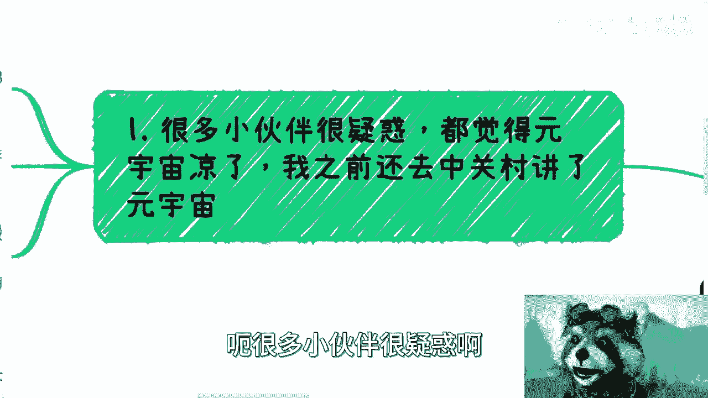

# 数字经济篇2：政企视角下的元宇宙核心关切 🔍

在本节课中，我们将从政府和企业（政企）的视角，探讨当前元宇宙领域最受关注的核心议题。我们将分析政企关心的具体方向，并与大众认知进行对比，帮助初学者理解其中的差异与机会。

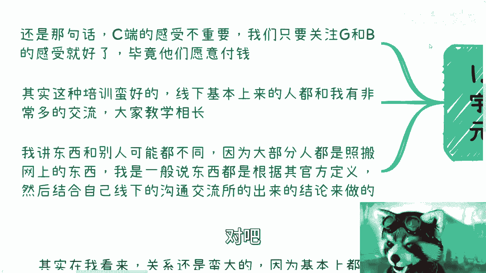

---

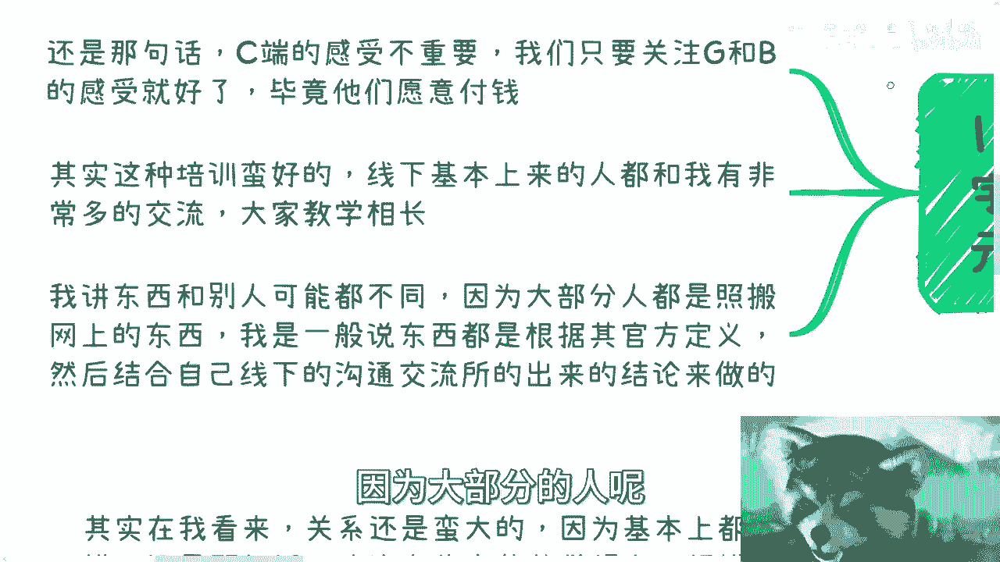

## 课程概述

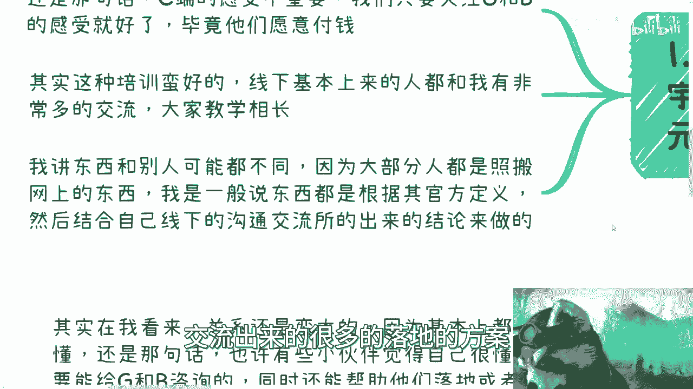

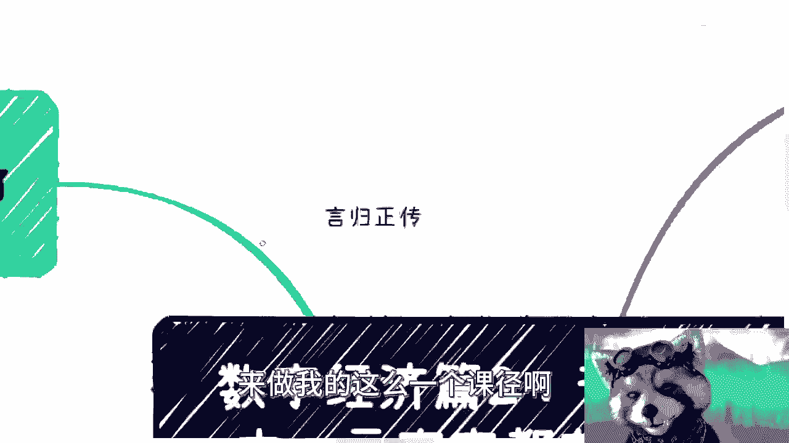

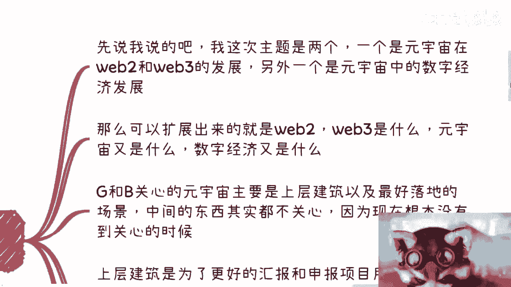

上一节我们介绍了数字经济的基础概念，本节中我们来看看元宇宙在政企层面的实际关切点。与大众感知不同，政企端对元宇宙的关注点更为务实和具体，主要集中在如何结合自身业务进行落地与创新。

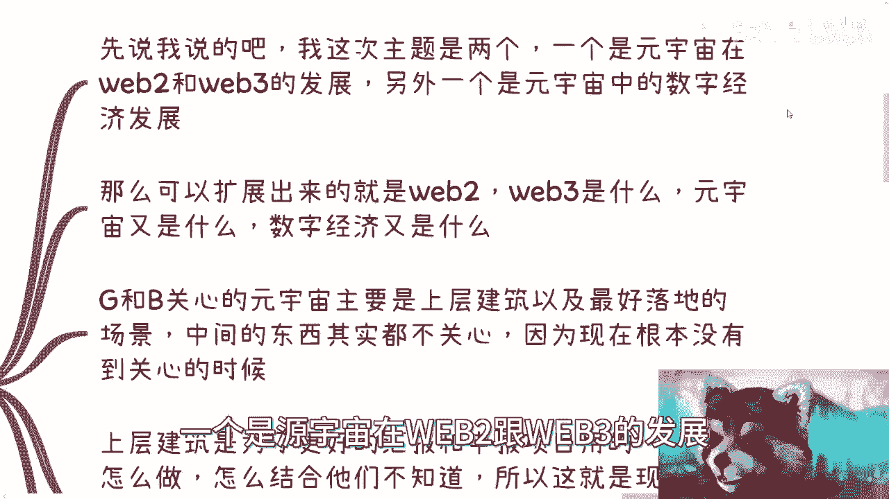

## 政企的核心关切点

政企目前对元宇宙的关注，主要围绕如何将其与现有产业结合，并产生实际价值。以下是他们最关心的几个方面：

### 1. 数字身份（DID）

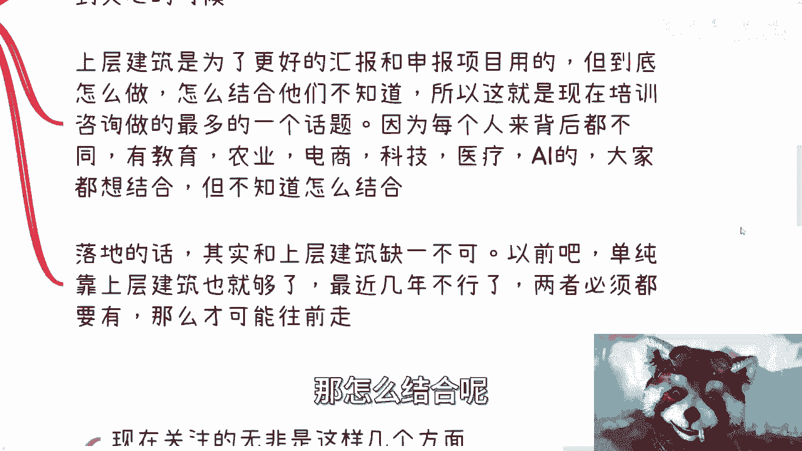

统一的数字身份是构建任何数字生态的基础。无论是在Web2还是Web3语境下，**DID**都是关键。对于教育、医疗、农业等各行各业而言，要进行数字化改造或发展数字经济，都必须有与之挂钩的数字身份。这是业务运行的最小单元。

**核心概念**：`DID (Decentralized Identifier)` 是去中心化的数字身份标识符。

### 2. 数字孪生

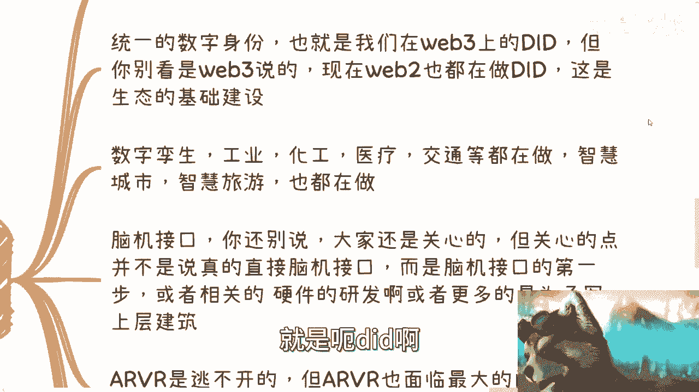

数字孪生技术在工业、化工、医疗、交通等领域应用广泛，同时也是智慧城市、智慧旅游等项目的重要组成部分。这类项目通常规模较大，是政企进行数字化转型的重要抓手。

### 3. 脑机接口

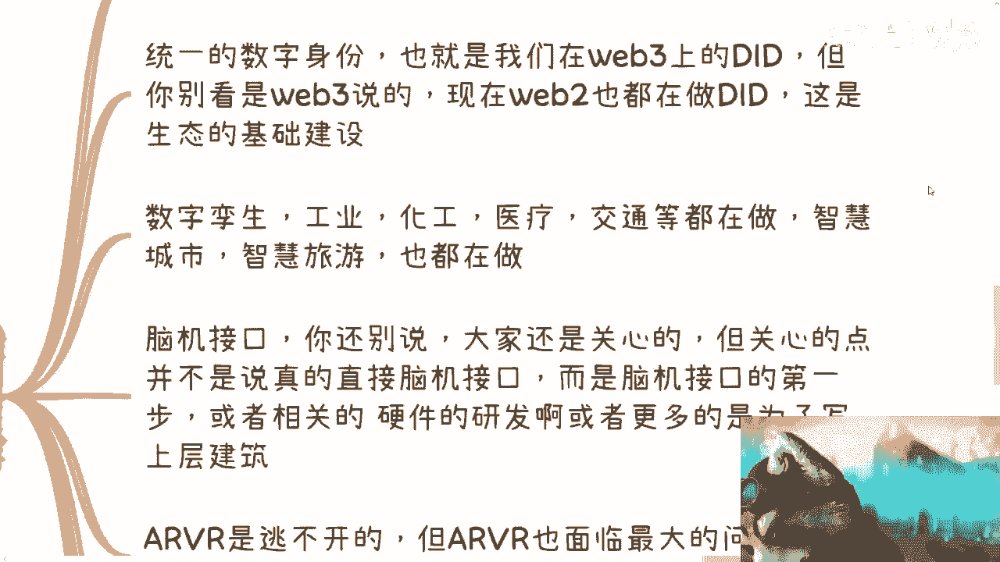

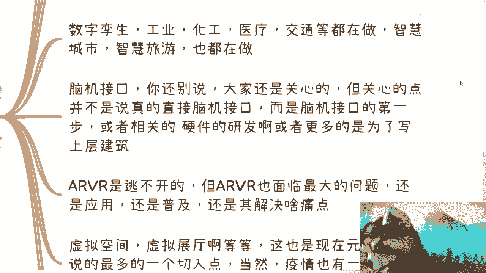

尽管脑机接口技术的成熟应用尚需时日，但政企关心的是其初步的实现路径、相关硬件与芯片的研发进展，以及如何将其纳入上层的战略方案中。关注点在于技术前瞻性与方案结合，而非立即落地。

### 4. AR/VR技术

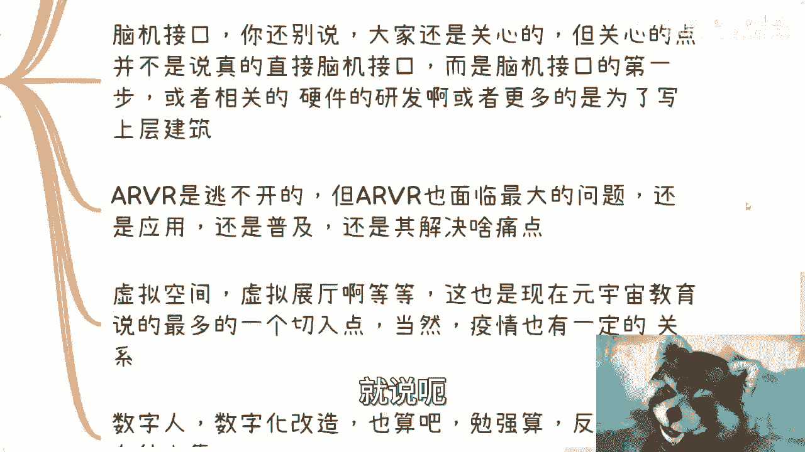

AR/VR技术目前面临的最大挑战在于民用化普及。虽然在商业展示、实验室、博物馆、旅游等领域已有应用，但尚未形成大规模民用浪潮。政企关注其何时能突破普及瓶颈，从而带动产业起飞。

### 5. 虚拟空间

虚拟空间，如虚拟展厅，是目前元宇宙与教育、文化等领域结合最紧密的切入点之一。疫情等因素加速了其发展，因其场景契合度高，成为了当前汇报和项目中的热门方向。

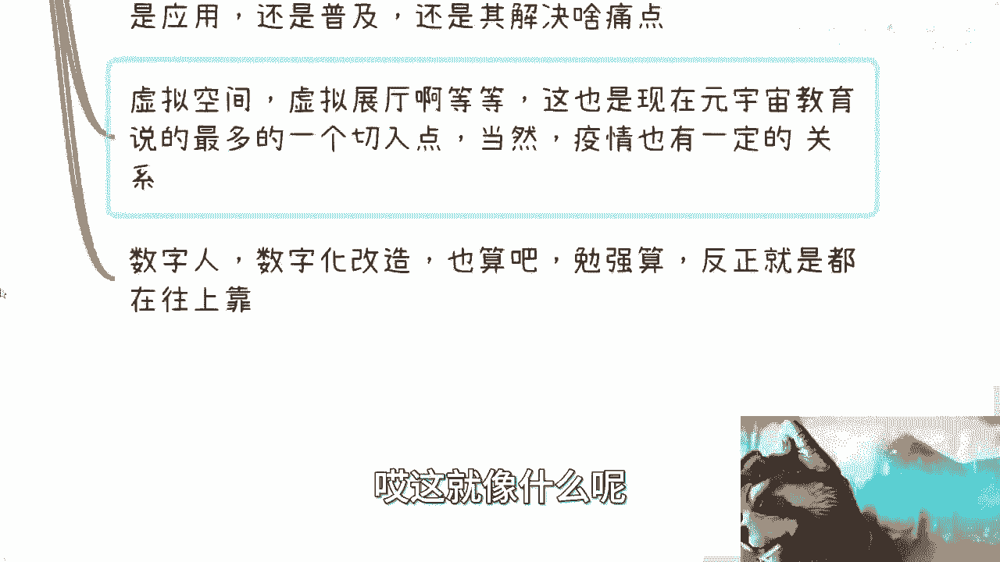

### 6. 数字人与数字化改造

数字人及全面的数字化改造也是政企关注的方向。这常常是每年工作报告中“换汤不换药”的“新汤”，需要结合最新的技术概念（如元宇宙）进行包装和汇报，以满足持续创新和项目申报的要求。

## 政企视角与大众认知的差异

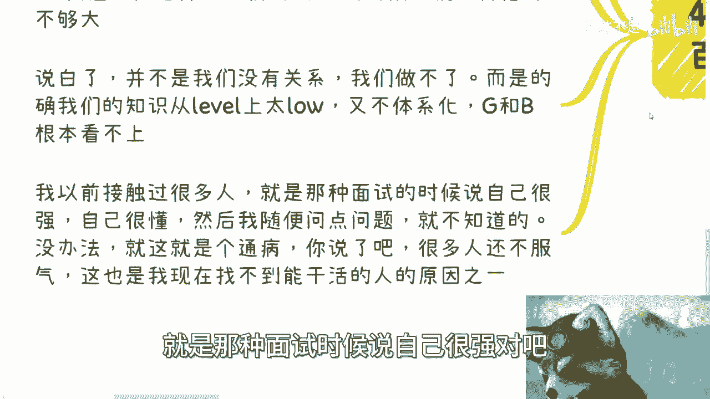

政企端与大众（C端）对元宇宙的关切点存在本质不同：

*   **关注层面不同**：政企要么关心更高层面的战略定义和标准，要么关心最底层的具体落地解决方案。中间层那些“看起来酷”但对业务无直接帮助的概念，他们并不关心。
*   **需求驱动不同**：政企的需求源于**完成KPI、汇报工作、申报项目、实现产业升级**。他们需要的是能证明可行性、带来实际价值的解决方案，而非炫技或空谈。
*   **知识体系要求不同**：为政企提供咨询或服务，需要体系化、有深度、能落地的知识。仅仅了解网络上的碎片化概念，无法应对“为什么这么做”、“具体如何结合我的产业”等深层问题。

## 总结

本节课中我们一起学习了从政企角度如何看待元宇宙。关键在于理解，政企关注的是**基础建设、与产业的结合点以及具体的落地解决方案**，如数字身份、数字孪生等。这与大众追求新奇体验的视角截然不同。

这种差异也意味着巨大的机会。能够体系化地理解这些技术，并能为特定行业设计出可行结合方案的人才非常稀缺。对于学习者而言，构建深入、务实且能与产业对话的知识体系，是抓住政企端数字经济机遇的关键。