# 数字经济篇3-从政企角度说下区块链2024年的发展---P1---赏味不足---BV1vN411M7

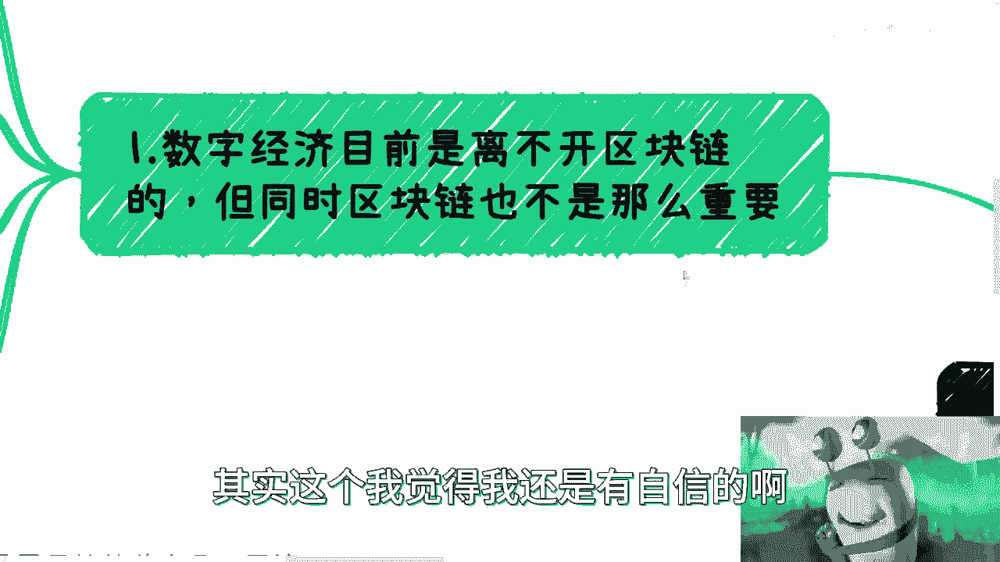

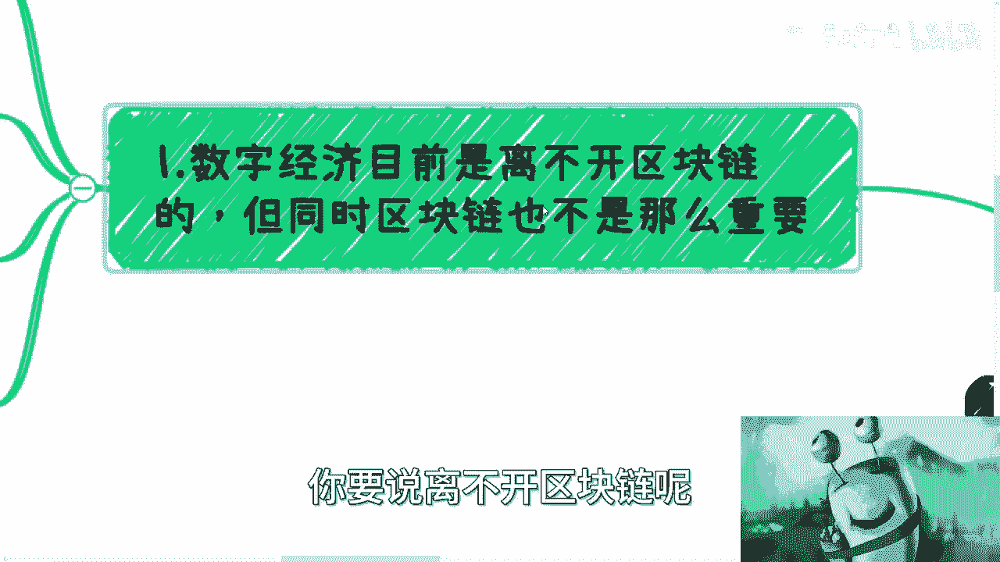

在本节课中，我们将从政府和企业（政企）的角度，探讨区块链技术在2024年的发展趋势。我们将分析区块链在数字经济中的实际定位、应用场景以及未来的主要发展方向。

---

## 概述

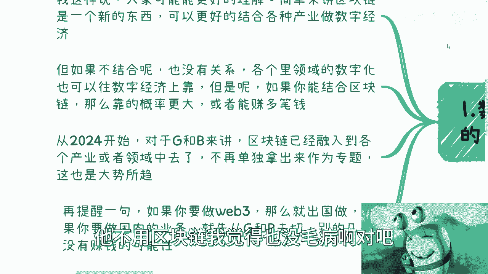

区块链技术是数字经济的重要组成部分，但其重要性并非绝对。对于政企而言，区块链是一个可以结合产业、提升价值的工具，但并非所有数字化改造都必须依赖它。从2024年开始，区块链将更深入地融入各产业领域，而不再作为一个独立的专题被频繁讨论。

---

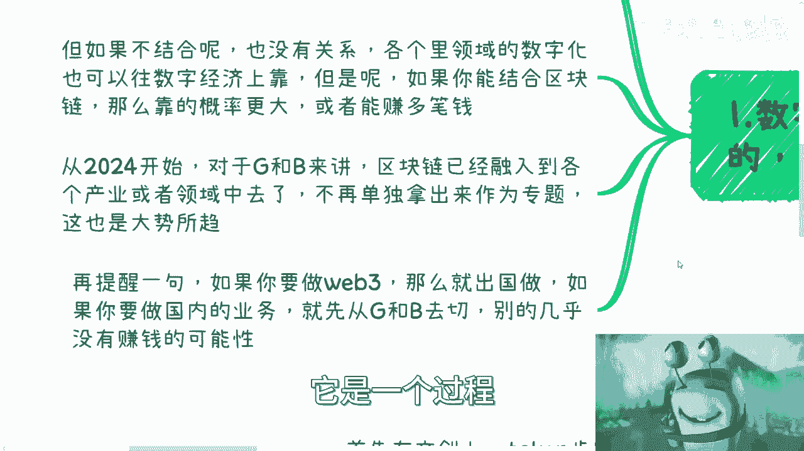

## 区块链在数字经济中的定位

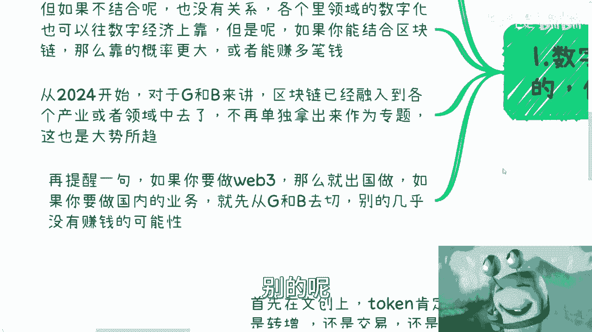

上一节我们概述了课程内容，本节中我们来看看区块链在当下数字经济中的具体定位。

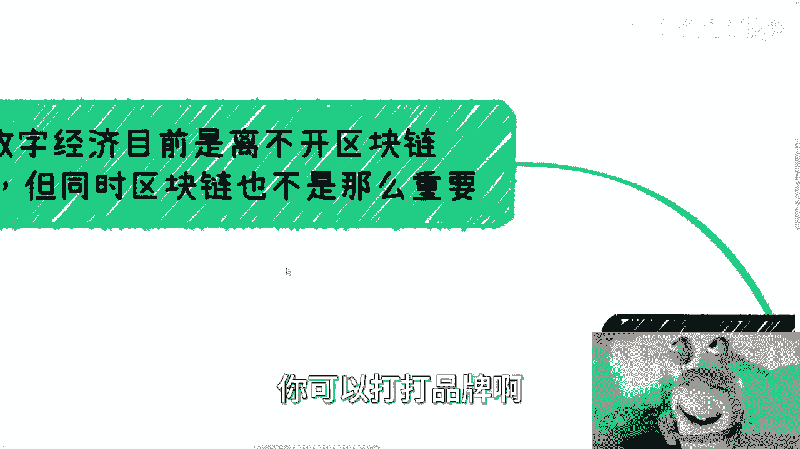

区块链对于政企而言仍算是一个较新的技术。它可以更好地结合各种产业来发展数字经济，但如果不结合，也并非不可行。因为许多领域的数字化或产业数字化进程，都可以向数字信息方向靠拢，并不强制要求使用区块链。从成本等多个角度考虑，不使用区块链也完全合理。

数字经济并不一定要与区块链挂钩。但需要明白的是，如果能结合区块链，向数字化靠拢的概率会更大，或者能带来额外的价值提升。例如，原本能赚100万的业务，结合区块链后可能赚到120万，就是这种感觉。

从2024年开始，对于政府（G）和企业（B）而言，区块链基本上会融入到各个产业和领域中去，不会再被单独拿出来作为一个专题。当然，完全单独讨论的情况还会有，但会慢慢减少。业务的发展是一个过程，不是一刀切的事情，这是一个大势所趋。

需要提醒的一点是：如果要做Web3业务，那么建议出国做；如果要做国内业务，基本上需要从政府和企业端切入。其他途径基本上没有赚钱的可能性。你可以做品牌，可以做其他事情，但要赚钱就很难。

---

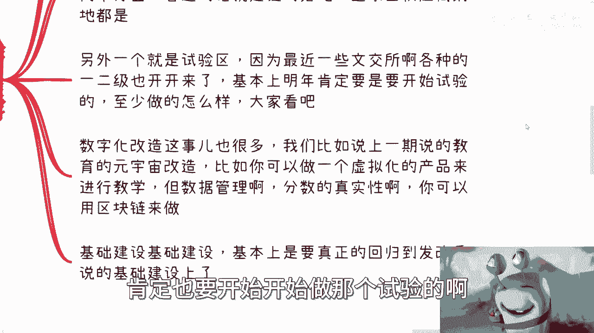

## 2024年区块链发展的主要方向

接下来，我们逐一分析2024年区块链发展的几个主要方向。

### 1. 大面积建设与改造铺开

按照理解，明年肯定会有大面积的铺垫和建设。这可以理解为几种形式：

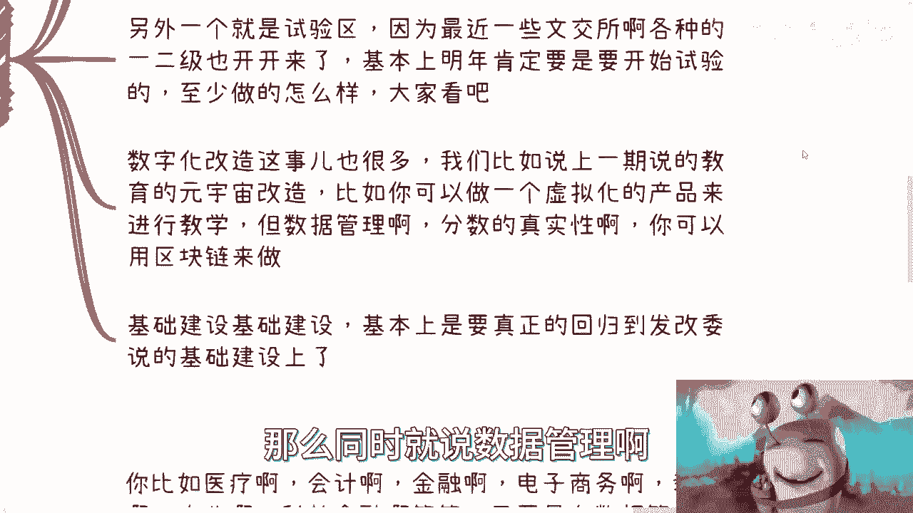

*   **直接以区块链改造为主的项目**：例如专门的区块链改造项目。
*   **数字化改造中附带区块链**：项目主体是数字化改造，但底层使用了区块链技术。
*   **以其他名义包含区块链**：例如叫元宇宙改造、科技创新、科技金融等项目，其底层也可以搭载区块链。区块链未必会在明面上出现。

之所以得出这个结论，是因为今年相关项目基本处于停摆状态，真正落地实施的很少。明年肯定会增多。区块链的落地主要有两个层面：
*   **普通层面是“链”的落地**：即部署一条区块链。目前提供链服务的供应商非常多。
*   **另一个层面是“试验区”**：最近各级部门都在蓄势待发，明年肯定也要开始做各种实验田。至于效果如何，需要走一步看一步。

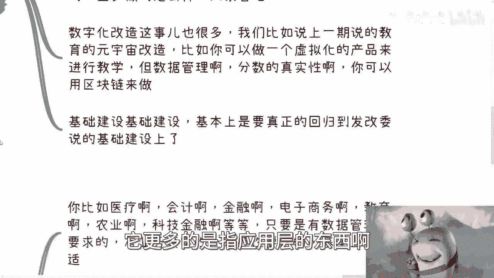

数字化改造的事情也很多。例如之前提到的教育元宇宙改造，可以做一个虚拟化产品进行教学。但需要注意的是，元宇宙教学更适合需要**具象化、身临其境或节约成本**的场景（如器械维修培训、历史场景重现），而不是简单地用数字人教语文、数学。同时，在**数据管理、学分真实性**等方面，可以使用区块链技术。

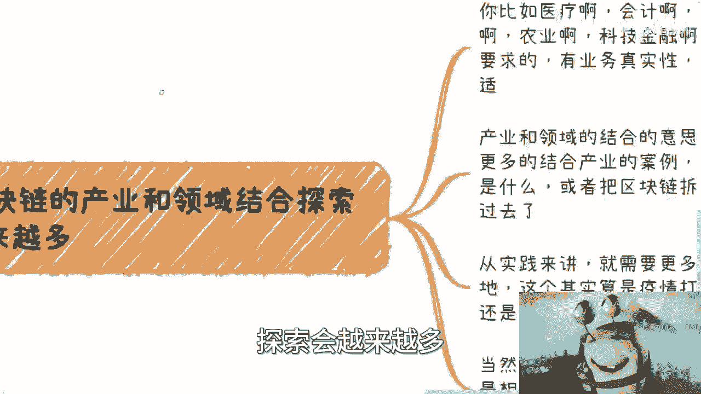

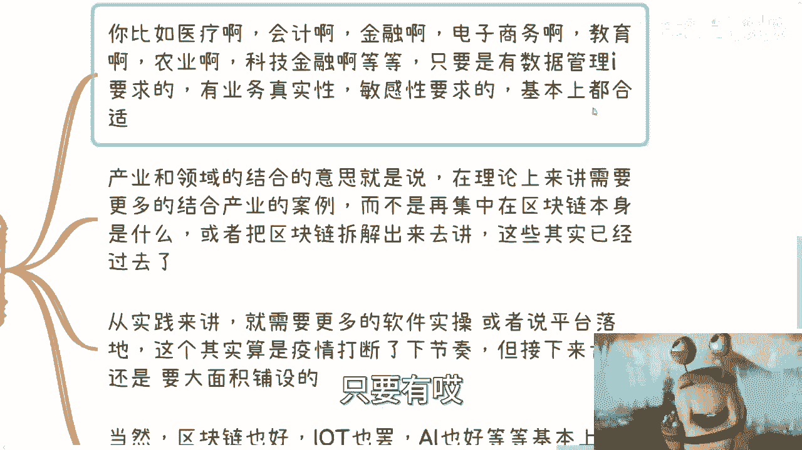

所谓基础建设，从明年开始要真正回归其本质。基础建设就像软件产业链中的中间件或底层建筑，是一个慢慢构建和完善的过程。真正的改造更多指的是应用层的东西。

### 2. 与产业和领域的结合探索增多

区块链与产业和领域的结合探索会越来越多。

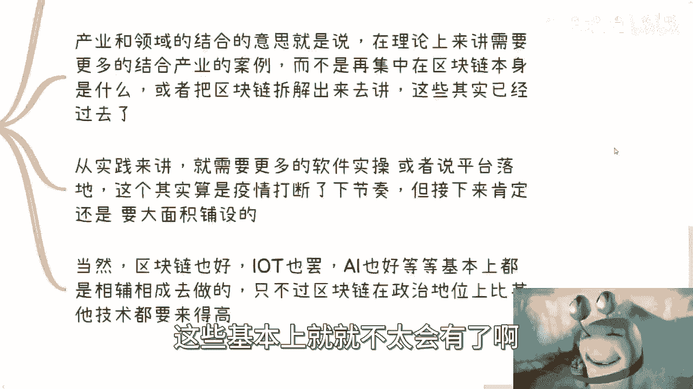

以下是适合结合的领域示例：
*   医疗
*   会计
*   金融
*   电子商务
*   教育
*   农业
*   金融科技
*   数字科技

基本上，**只要有数据管理要求、业务真实性要求或敏感性要求的领域都合适**，没有太多条条框框。

“产业和领域结合”的意思是，理论上需要更多结合具体产业的案例，而不是像前两年那样集中在区块链技术本身（如讨论共识机制、节点是什么）。到2024年，这些基础概念已经非常成熟，不太会再成为讨论焦点。

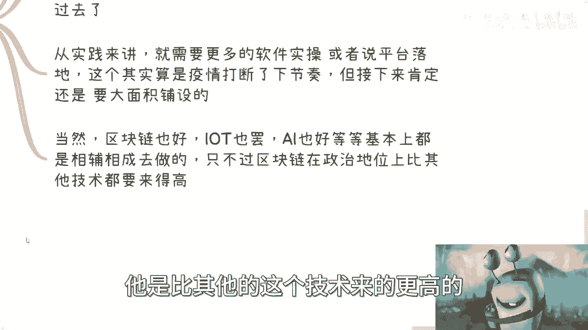

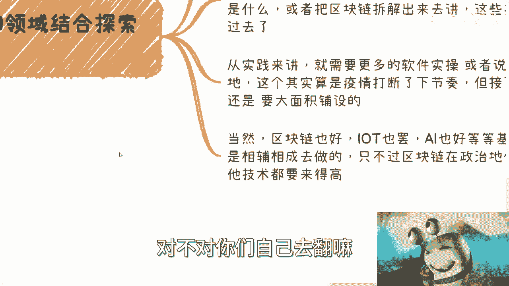

从实践角度来讲，我们需要更多的软件和实操案例，就像刚才说的元宇宙教育、数字人、电商等，需要的是在具体场景或平台上的落地。其实之前就已经开始做，但疫情打断了一下节奏，接下来肯定还要大面积铺开。不铺开哪来的基础建设？区块链、物联网（IoT）、人工智能等技术基本上是相辅相成的，属于同一层级，共同服务于数字化改造。

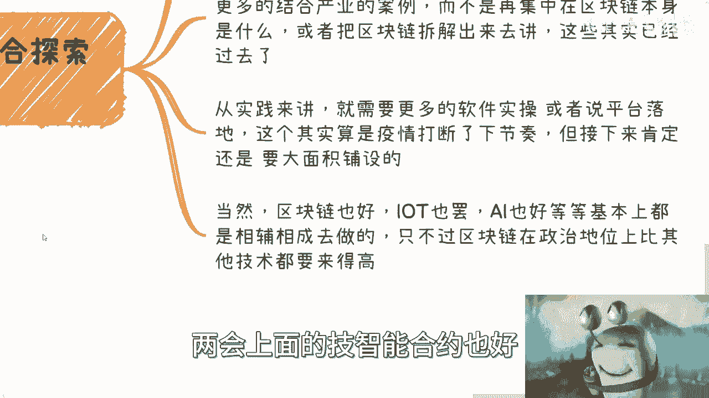

不过有一点不得不提：**区块链在政治地位上，是比其他技术（如物联网、人工智能）更高的**。这不是个人观点，而是基于中央和各地政策的公开表述。

### 3. 通证（Token）的相关发展

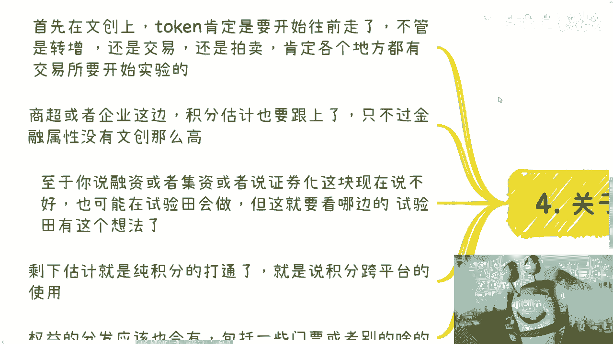

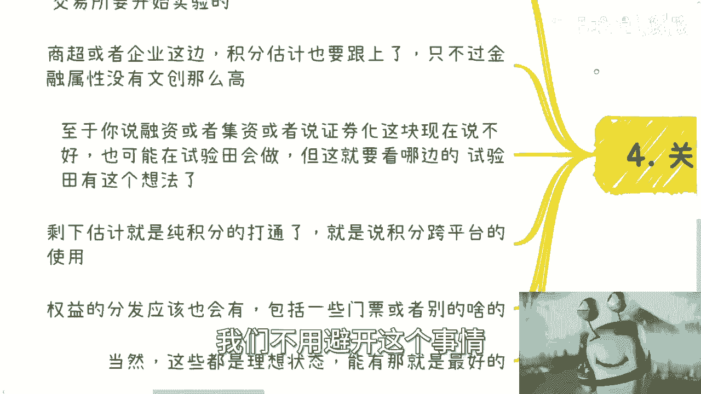

关于通证（Token），这个东西避不开，需要讲一下。

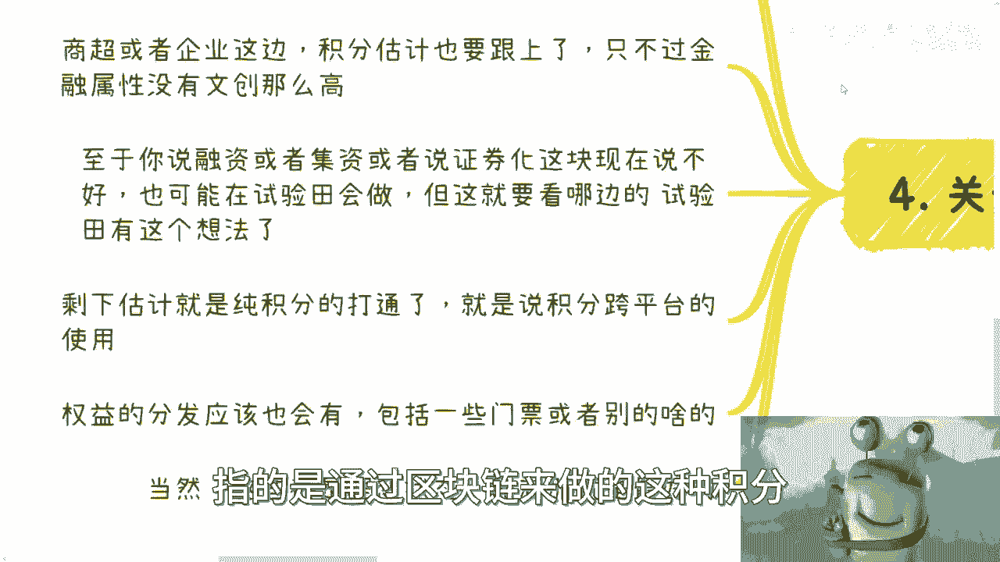

首先在**文创领域**，通证肯定会开始向前推进。从目前零散的消息来看，不管是转增、交易还是拍卖，各地方的交易所都要开始做实验了。这是毫无疑问的事情，文交所等很多地方都已经公开提及。

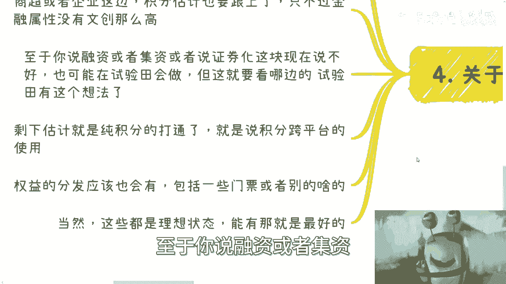

其次在**商超或企业端**，基于区块链的积分基本上要跟上。只不过它的金融属性可能没有文创领域那么高。

至于**融资、集资或证券化**这块，目前不好说。2024年试验田可能会做，如果要做，基本上也是按5年规划来做（2024年提交方案）。这要看哪个试验田有这种想法，但会不会做还不知道，目前只是猜想。

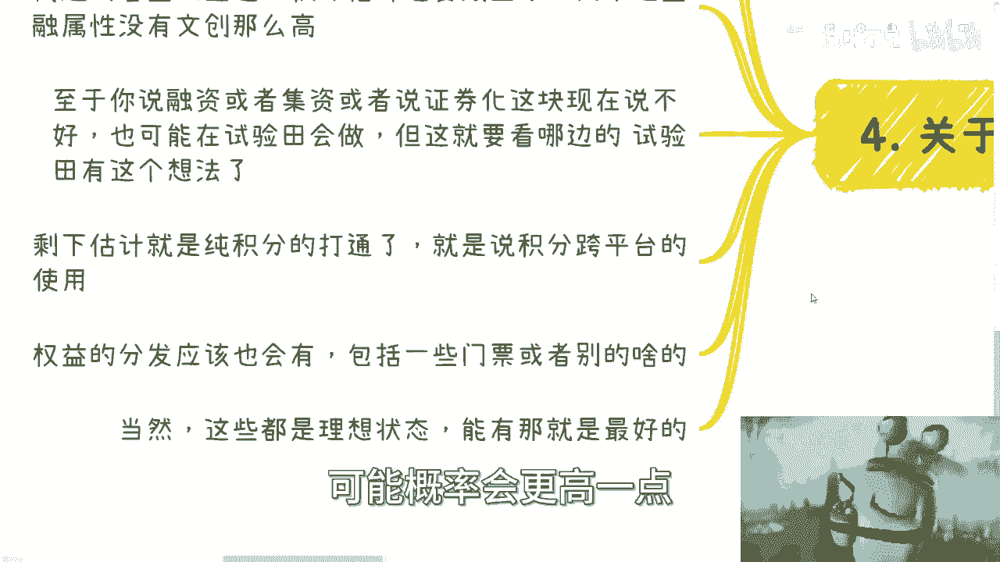

剩下的就是一些**纯积分的打通**，例如积分跨平台使用等。这种东西概率可能更高一点，因为它相对来讲金融属性没有这么强。

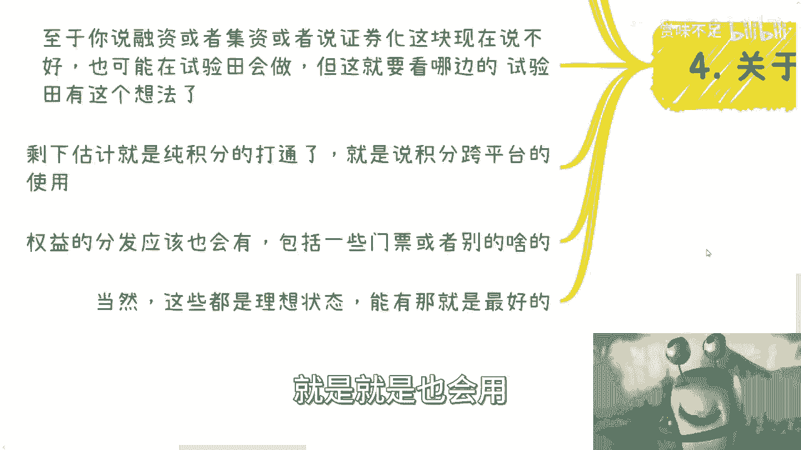

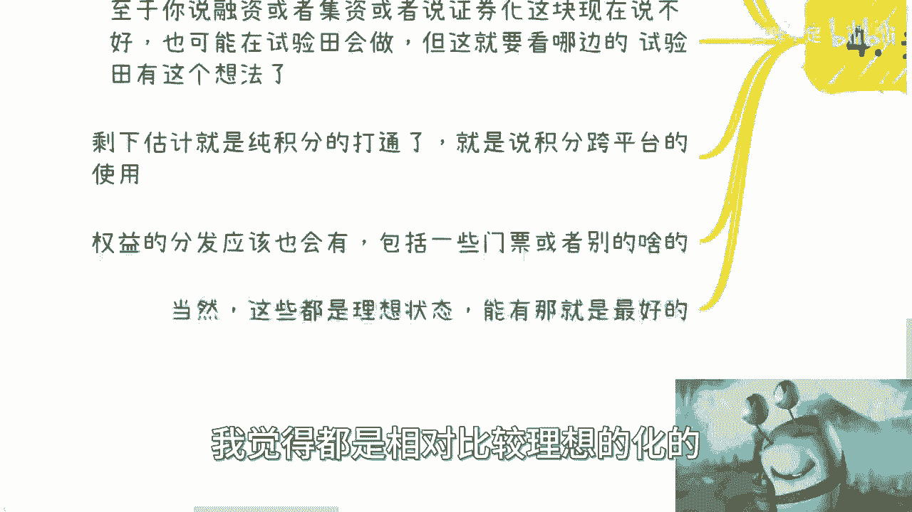

**权益的分发**应该也会有应用，包括一些门票、大闸蟹券等类似权益，也会使用区块链技术。

以上这些设想都相对比较理想化。因为当下整个国际形势和国内情况的重心还不在这个东西上面。但是，如果通证能在金融或业务层面有一定的试验田，那么就意味着会有一波新的趋势或业务，能够刺激经济流通。这对大家来讲肯定有好处。

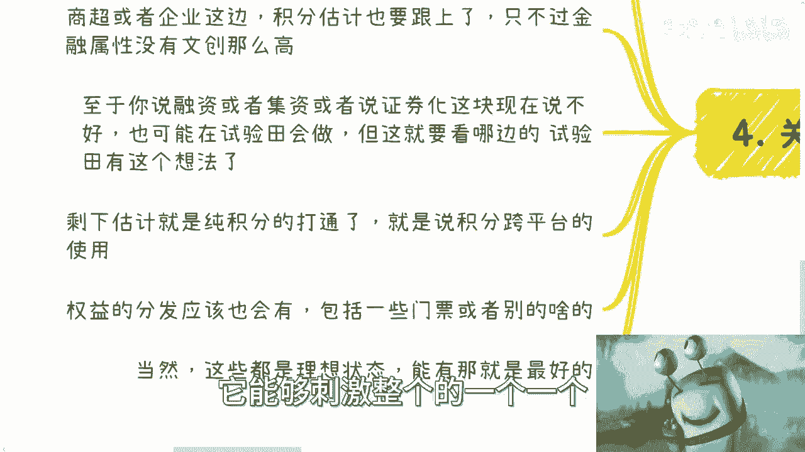

---

## 总结与展望

从一整年来看，一年时间其实做不了太多事情。2024年大致就是以上这些计划。至于2025年怎么样，需要走一步看一步，目前没人能看得更远。但从趋势来看，基本上已经很清楚了：各地方、各领域、各城市、各地方政府、各企业往下落实就结束了。

之前几篇内容已经把细分的切入点说清楚了。之所以不说其他东西，是因为在我看来，其他东西没有这么大的比重，也可能不会有这么多资金支持。例如，做一个传统行业的数字化改造没有问题，但不见得政府有那么多补贴或那么多人愿意做。但如果从元宇宙或区块链切入，则是有可能的，毕竟政策上是扶持的。我们不必自欺欺人，应该关注政策上已有的方向。

本节课中，我们一起学习了从政企角度看待2024年区块链的发展。核心内容包括：区块链在数字经济中的辅助性定位、其发展将深入融合而非孤立存在、以及未来在基础建设、产业结合和通证应用三个主要方向上的趋势。对于从业者而言，关注政策导向、聚焦政府与企业端需求、并探索技术与实体产业的结合点，是把握未来机会的关键。