# 数字经济篇3：从政企角度说下区块链2024年的发展 - P1 - 赏味不足 - BV1vN411M7Bp

嗯好大家好啊，那我们继续啊，这个说正经的东西啊，额数字经济篇三啊，从这个政企的角度来说一下区块链，我觉得明年的整个的情况，其实这个我觉得我还是有自信的啊。

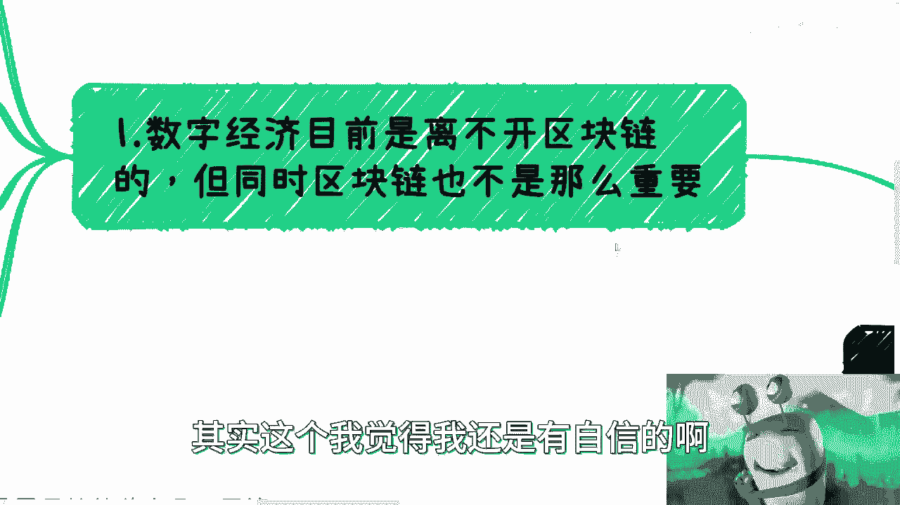

看的应该还是蛮清楚的，额数字经济，目前呢你要说离不开区块链啊。

我觉得有啊，但是呢区块链也不是那么重要，呃为什么，因为首先是这样子的，就是说呃国内数字经济它去做呢，你要这么想，他其实无非就是几种做法嘛，啊等一下我看一下吧，然后那个首先这么说，大家可以更好的理解。

简单来讲呢，区块链在目前当下，对于政企来讲还算是一个新的东西，嗯他呢也可以更好的结合各种产业做数字经济，但是如果不结合呢，其实也没有关系，因为你会发现各个领域做数字经济的。

或者你说数字化产数字化产业就数字化产业，产业数字化对吧，这些东西你都是可以往数字信息上靠的，不是说他一定要有区块链啊，而且呢很多东西呢就是大家真的从做的时候，你会发现，如果从这个成本角度对吧。

从各个方面角度来讲，他不用取块链，我觉得也没毛病对吧。

没有说数字经济，数字经济一定要跟区块链挂钩嘛，但是呢就是你要明白啊，你要你要能结合呢，你往数字上靠，数字上靠的概率更大，或者说你本来能赚100万对吧，那你加了之后，你可能能赚120万。

他可能就是这种感觉啊，那么从2024年开始呢，我觉得对于G跟B来讲呢，区块链基本上就是融入到各个产业，各领域当中去了啊，不会再单独拿出来作为一个专题啊，当然你要说会不会会啊，就会很少了，慢慢慢慢减少。

那你明白吧，就是业务的发展它是一个过程。

它不不是一个一刀切的一件事情，所以说呢这个是一个大势所趋，那么再提醒一点呢，就是说如果你要做web3，那么你就出国做啊，如果你要做国内的业务，那么基本上就是从G，也就是从政府跟企业去切啊。

别的呢唉基本上没有赚钱的可能性。

就是你可以做，你可以打打品牌啊。

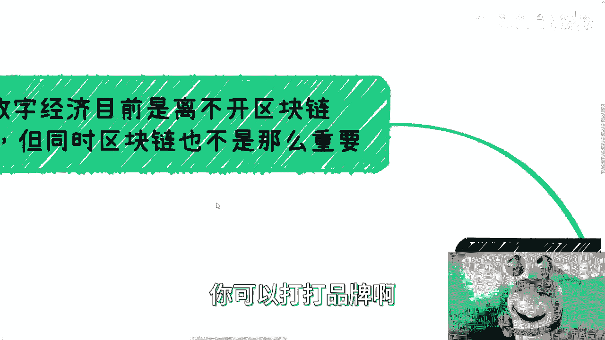

你可以做些别的东西，但是你要赚钱就很难啊，那么我们一个个来说。

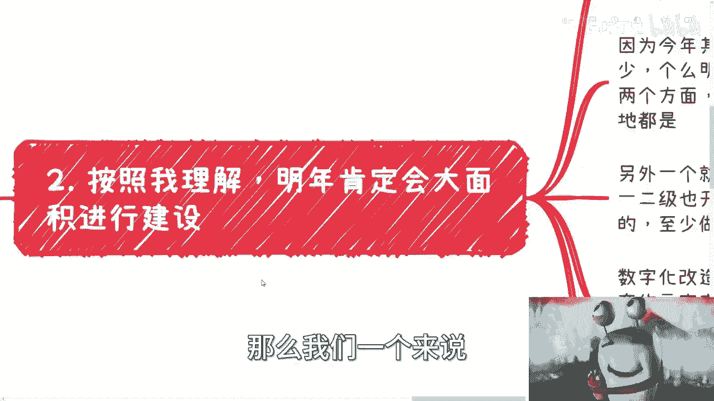

按照我的理解呢，明年肯定会有大面积的这个铺铺垫跟建设呃，这个其实大家可以这么理解，就是有的呢他直接以区块链改造为主，比如说有的项目对吧，就区块链改造，有的呢它就是数字化改造。

但数字化改造里面呢带区块链啊，有的呢可能比如说叫元宇宙改造啊，你别管它叫什么改造无所谓啊，就有的呢可能是别的一些项目对吧，它可以它也可以叫什么呃创新对吧，叫叫叫什么什么科技金融对吧，叫什么东西无所谓啊。

就是呃但是它在底层可以带区块链啊，区块链未必是在明面上所出现的，那么呃之所以得出这么这么一个结论呢，是因为今年基本上都是停摆的，呃真正做的其实很少。

就落地的就更少了对吧，那么明年呢肯定要多，因为区块链从落地呃，上面的基本上就两个层面，普通的话那就是链的落地，就是我落根链这个东西呢，供应商我跟你讲，现在做链的供应商哎呀满地都是，遍地都是。

那么另外一个呢就试验区，因为最近你们也可以去看各个门角色，各个一二级也都在蓄势待发啊，属于八仙过海，各显神通呃，基本上明年呢肯定也要开始，开始做那个实验的啊。

试验田，那至于做的怎么样呢，我觉得这个不知道啊，反正大家走一步看一步，这个鬼妈鬼能知道做的什么样，对不对啊，那么数字化改造这个事儿呢也很多，我们比如说上一次说的教育的元宇宙改造对吧。

比如说你可以做一个虚拟化的产品，来进行教学啊，你说我帮助大家学一学这种，因为你要这么想啊，你你要是教语数外，教数理化吧，教什么雅思这种东西呢，其实还好，元宇宙教学它更多的是要那种具象化的东西。

就是就是我们打个比方，比如说什么什么什么新能源，电动车的这种维修对吧，或者说是历史的见证对吧，或者说一些怎么样，就是它是需要你更身临其境，或者更就是嗯就是那种节约成本化的东西，方便去做。

而不是说大家说我做一个虚拟化的教育，就是啊弄个元宇宙啊，弄个元宇宙，弄个数字人对吧，在这个地方教语文，教数学，教英文，这个没有用，就是你要说能不能靠得上，你这个叫硬靠对吧，但你要说这个东西有什么意义。

我觉得意义不大啊，但是你说哎我做一个器械维修对吧，做个别的东西哎，那你说有没有意义啊，那我觉得意义很大，对不对啊，那么同时就说数据管理啊。

分数的真实性啊，对吧等等等，那这些你可以用区块链来做，那么所谓基础建设，基础建设基本上就是说呃从明年开始，他就要真正回归到2020年当年4月20号，因为所谓基础建设嘛对吧。

你没有看到过哪个地方的产业改造，说哦我为了基础建设去做一个改造，没有的呀，就是基础建设为什么叫基础建设，这就跟我们在呃，软件或者在整个产业链当中说的，这个中间件对吧，或者说底层建筑是一样的。

就是它是一个慢慢慢慢构建，慢慢慢慢完善的一个过程，你要说真正的改造，它更多的是指应用层的东西啊。

那么第二点呢，就区块链产业跟领域的结合探索会越来越多。

那你比如说啊医疗啊，会计啊，金融啊，电子商务啊，教育啊，农业啊，金融科技对吧啊啊数字科技啊，那其实你会发现只要有诶。

我怎么多了一个字母的对吧，就是你只要有数据管理要求的，只要有业务真实性要求的，只要有这种敏感性要求的，基本上都合适啊，就没有这么多的这个这个条条框框在这个地方，嗯对吧。

然后这个是一个那么产业和领域的结合的，意思呢，就是说在理论上来讲啊，它需要更多的这种结合产业的案例啊，而不是说在而不是说在像前两年一样，集中在区块链本身对吧，你说现在2024年了啊，你往区块链说啊。

这是什么东西，共识是什么，节点是什么，这个其实已经很成熟了啊，这些基本上就就不太会有了啊。

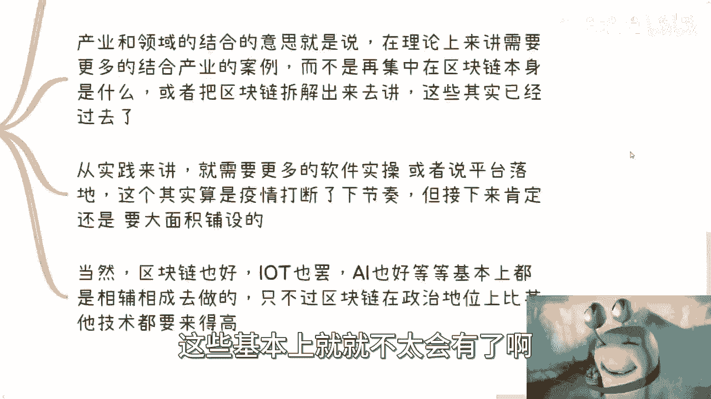

那么从实践角度来讲呢，就是我们需要更多的软件做实操，就像我们刚刚说的，比如说啊你做一个元宇宙的教育啊对吧，做一些数字人啊，做一些电商啊，我们需要的是他在场景上的落地，或者说平台的落地。

这个其实就是说呃之前就开始做了，但是疫情呢其实打断了一下节奏啊，但是接下来你肯定还是要大面积铺的，你不扑哪来的基础建设嘛对吧，你肯定要铺的嘛啊那当然区块链也好啊对吧，这个物联网也好，叫IOT对吧。

智能人工智能也好，我觉得基本上都是相辅相成的，就属于同一个level，然后是呃就是就是1+1加一对吧，或者说1+1或者四个一加在一起，或者两个一加在一起，然后来做这种数字化改造呃。

只不过就是说有一点要不得不提的呢，就是区块链在政治地位上面，他是比其他的这个技术来的更高的。

哎你这个就不要问我为什么更高了，因为这不是我说的，这个是中央说的，对不对。

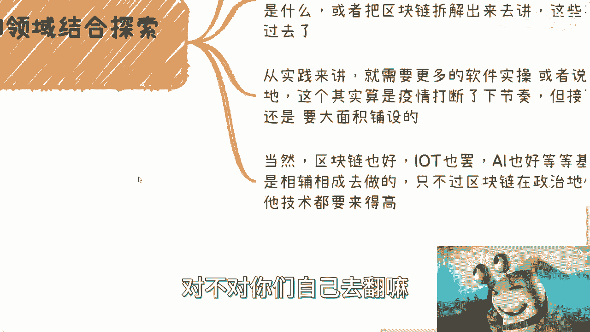

你们自己去翻嘛对吧。

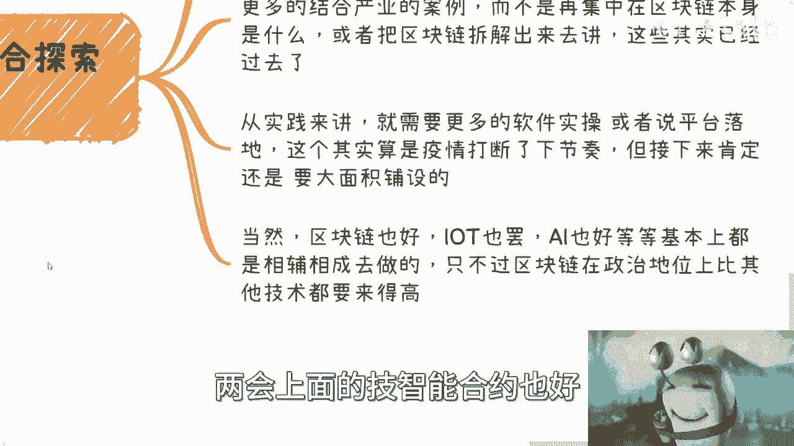

包括各个地方的政策也好，这个东西就是公开的呀，怎么了啊啊。

然后第四点就是关于token，我想了一想呢，这个东西讲还是要讲一下的啊，因为你避不开，那首先在文创上面啊，token肯定是开始往前走的，因为从目前的零零散散的消息来看，不管是转增还是交易还是拍卖。

肯定各地方的交易所都要开始做实验的啊。

这个是毫无疑问的事情啊，我们不用避开这个事情。

因为就文交所等等等，其他很多地方都已经公开的去说了，我们有什么好避开的呢，对不对，那这第一个第二个呢就是商超或者企业这边呃，我觉得积分基本上就要就是要跟上啊，我们说的指的是通过区块链来做的这种积分。

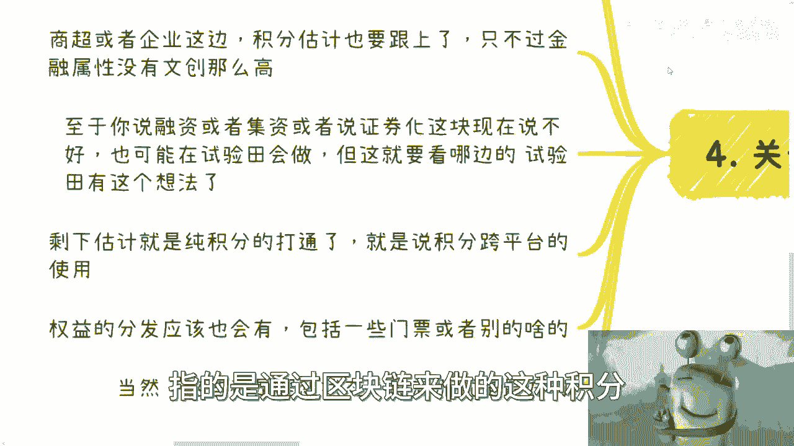

只不过呢它的金融属性可能没有文创这么高啊，至于你说融资或者集资或者证券化这块东西呢。

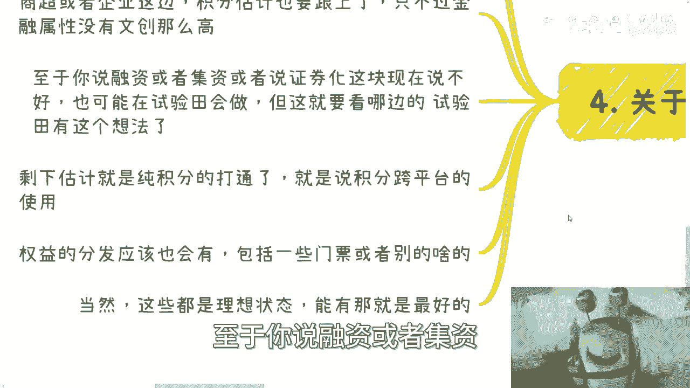

我觉得不好说，因为有可能啊，你说24年试验田会做啊，如果要做呢，基本上也是按5年开始做，因为24年你肯定要提交方案嘛对吧，那么这个就要看哪边的试验田有这个想法啊，当然你要说会不会做，这不知道啊。

这都是猜想，那么剩下的就是一些纯积分的打通，比如说积分跨平台啊，对吧等等等啊，那我觉得这种东西呢可能概率会更高一点。

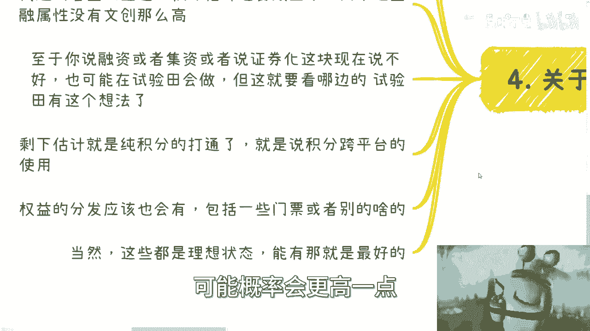

因为它相对来讲金融属性没有这么强啊，那么权力的分发应该也会有包括一些门票啊，或者什么大闸蟹券啊，或者怎么样就类似的啊，就是就是也会用。

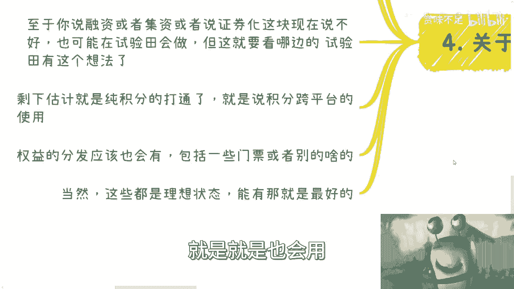

那么以上这些呢我觉得都是相对比较理想化的。

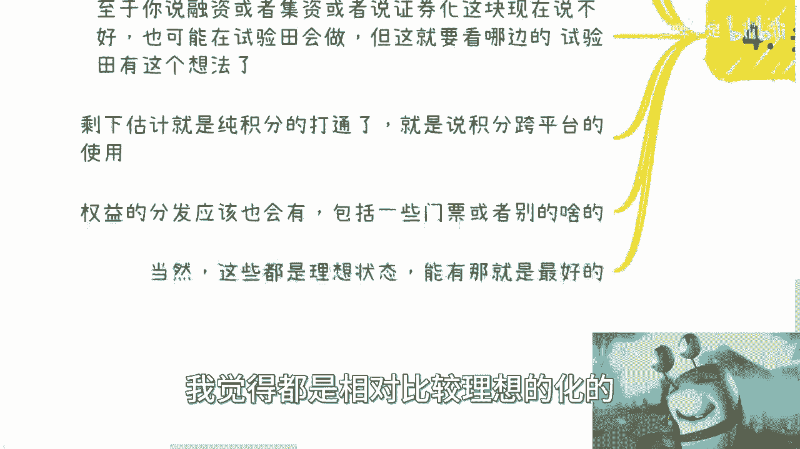

为什么啊，因为当下整个的一个国际形势跟中国的情况，它的重心还不在这个东西上面啊，但是如果来说啊，我们说啊token能有一定的试验体验对吧，包括金融层面的实验，还是说业务层面的实验，他但凡能试验。

那么也就意味着会有新的一波的趋势，或者新的一波的这种业务，它能够刺激整个的一个一个一个经济流通啊。

那么我觉得这个东西对大家来讲，是肯定有好处的啊，那么我觉得从整个一年来讲啊，你们不要觉得一年很长，其实一年做不了什么事情啊，从整个一年来讲，我觉得20年差不多就是这么一个计划了啊，至于你说25年怎么样。

我觉得就看你走一步看一步了，没人能往再往后看了，但是从目前趋势来看，基本上就这么一些东西已经很清楚了啊，各地方各领域啊，各各各城市，各地方政府啊，各企业对吧，就往下落就就就结束了啊，呃行啊。

那就这么着吧，好吧嗯，我前面几篇，我已经跟你们，把整个这个细分的切入点说清楚了啊，你说为什么别这种东西不说啊，是因为在我看来，别的东西没有这么大的比重啊，啊而且可能也不会有这么多钱，什么意思啊。

就是说你比如说你说，我现在要做一个传统行业的数字化对吧，怎么样，这个没有毛病，但是不见得说政府有这么多的补贴，或者有这么多的人愿意做这个东西对吧，但是你如果单纯说我从元宇宙切，我从区块链切。

我觉得是有可能的，因为毕竟政策上面是扶持的对吧，我们不要就是自欺欺人嘛对吧，你说政策上有的我们不看啊，我们非要去YY1些政策上没有的，那就没必要，对不对啊，行那就先这么着吧，然后大家反正有什么东西。

啊有什么问题，反正你们可以总结啊，有什么牌，有什么要咨询的对吧，或者有什么业务要做的啊，有什么更多东西想了解的。

