# 数字经济篇4：人工智能AIGC的商业逻辑分析 🧠

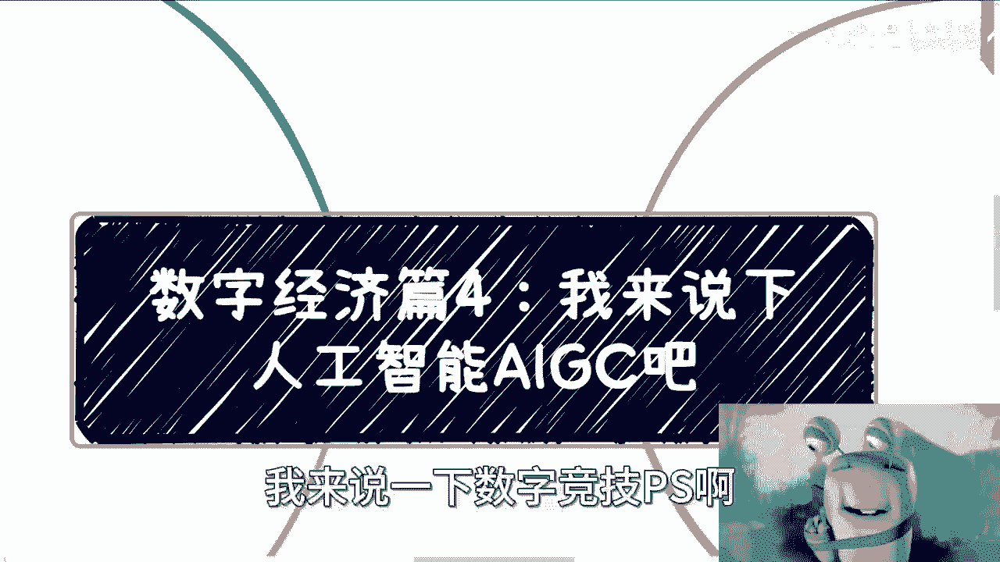

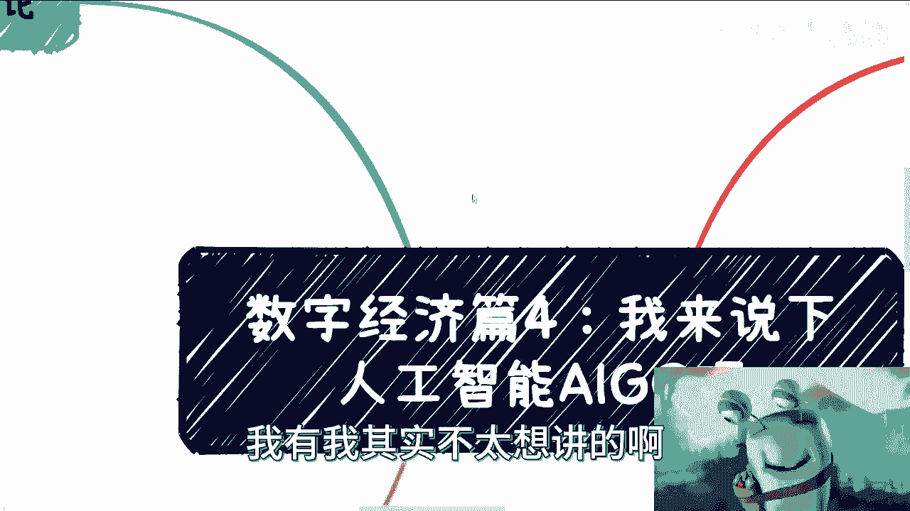

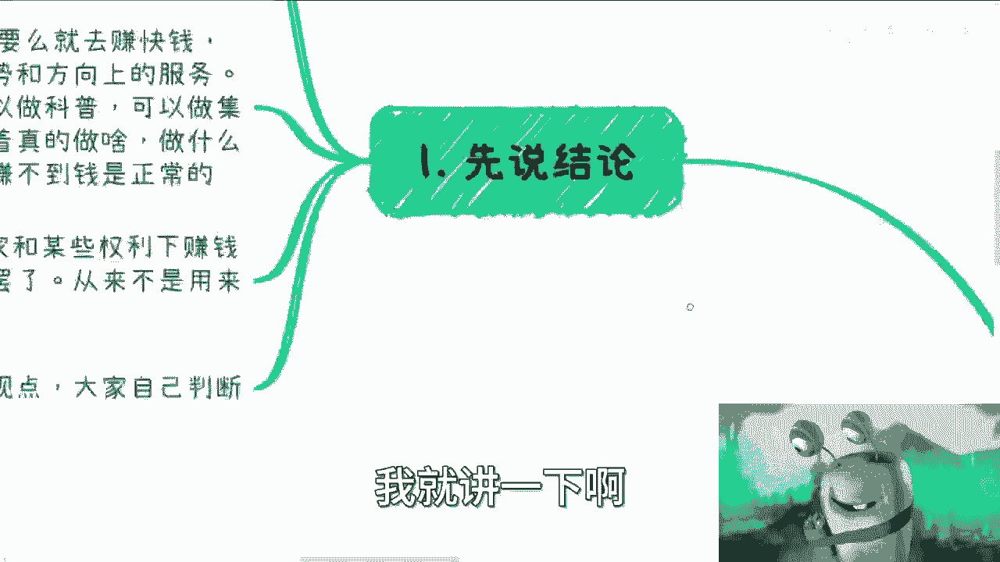

在本节课中，我们将探讨人工智能AIGC领域的商业机会与陷阱。我们将分析个人或小微企业如何在这一浪潮中定位自己，并理解其背后的核心商业逻辑。

## 核心观点：顺应趋势，而非创造产品

上一节我们介绍了数字经济的大背景，本节中我们来看看人工智能AIGC的具体情况。首先需要明确一个核心观点：个体是渺小的，想赚钱必须顺应大环境的趋势。只有跟随大趋势，才能赚到性价比高的钱。

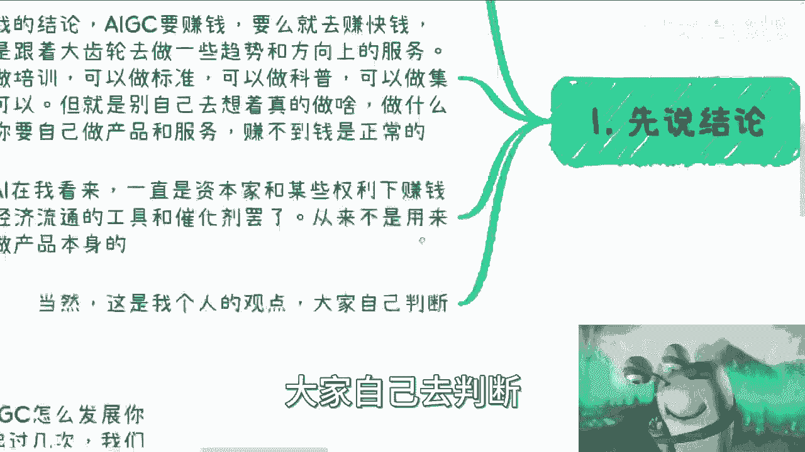

我的结论是，通过AIGC赚钱主要有两条路径：
*   **赚快钱**。
*   **为市场或大方向提供服务**。

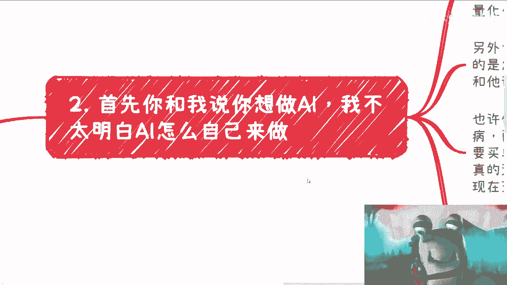

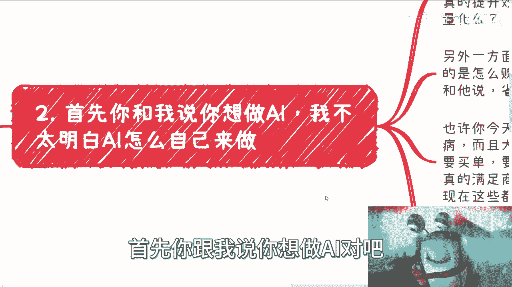

以下是具体的可行方向：
*   做培训。
*   制定所谓的标准。
*   做科普。
*   做业务集成。

唯独不建议的是，自己想着去做产品或服务，并试图做长线。近期有伙伴反馈自己做AI产品赚不到钱，这很正常。在我看来，AI一直是资本和权力用来赚钱、促进经济流通的**工具**和**催化剂**，其目的从来不是发展产业或产品本身。

## 需求分析：客户真的需要AI吗？

理解了宏观定位后，我们进一步分析微观需求。对于小微企业或个人而言，首先要问：客户真的需要AI吗？

客户需要AI是为了噱头，还是真的为了提高效率？如果是为了提高效率，这个提升能否量化？例如，AIGC可以帮助设计图片或杂志封面，逻辑上确实能提升效率。但**效率提升**与**商业化批量运作**以及**客户愿意付费**是两码事。

你可以向客户展示一个很棒的产品，但一旦报价，例如一年20万，客户就会犹豫。另一方面，企业常提“降本增效”，但大家真正关注的是**如何赚钱**，而非如何省钱。省钱带来的感知很弱，告诉企业一年能省200万，远不如告诉它能多赚200万有吸引力。

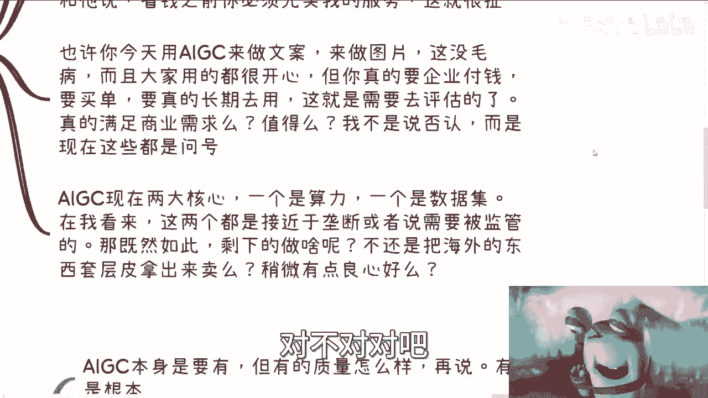

更何况，在帮企业省钱之前，你需要先让它为你的服务付费，这更是难上加难。因此，虽然用AIGC做文案、图片很普遍，但要让企业为此长期付费并实现商业变现，他们一定会严格评估。企业会考虑是否有开源方案，或自己组建团队的成本是否更低。这是普遍的商业思维。

## 现实约束：算力与数据的垄断

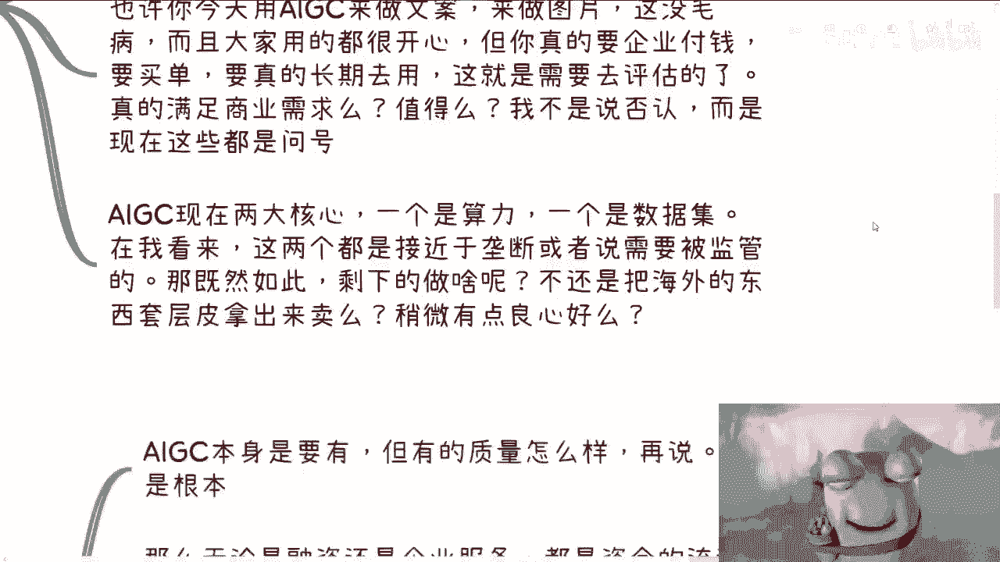

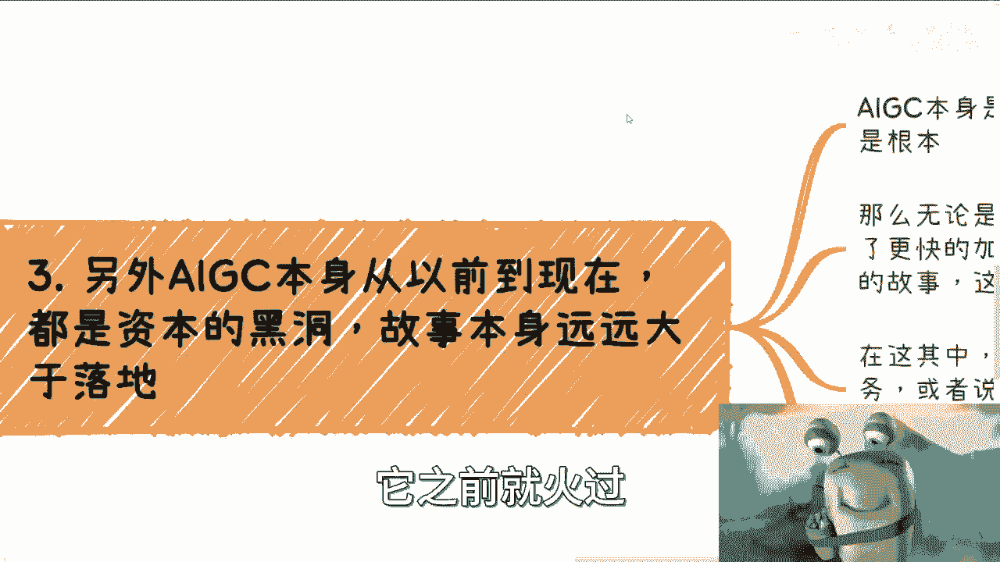

除了需求问题，AIGC的实现还有两大核心约束：**算力**和**数据集**。至少在中国，这两者都接近垄断或受到严格监管。

既然如此，个人或小企业还能做什么？数据可能是买来的，算力可能是租借的。很多情况下，所谓的创新只是将海外产品套层皮来销售。从历史来看，AI（包括AIGC）并非第一次火热，它一直是资本的故事，其**叙事价值**往往大于**落地价值**。

AI的发展是从0到1（解决有无问题），再从1到100（提升质量）。无论是融资还是企业服务，目的都是加速资金流动，这就需要更大的AIGC故事来支撑。在这种本质下，考虑做长线产品、服务，甚至为此去攻读专业进行深耕，无异于一场没有筹码的长期赌局。能够通过AIGC赚钱并推动资金流动的，始终是**大玩家**。

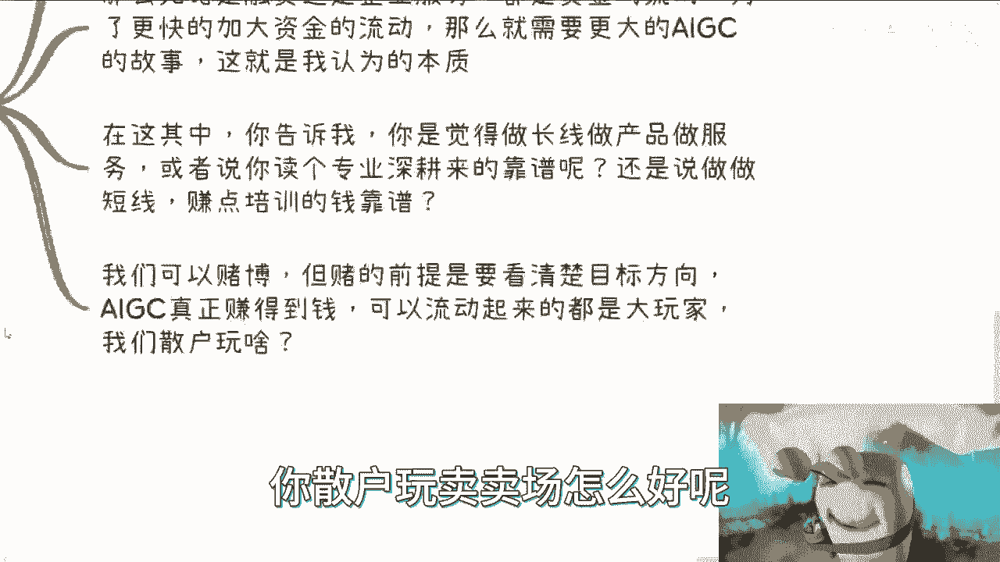

## 可行路径：成为“卖水人”与赋能者

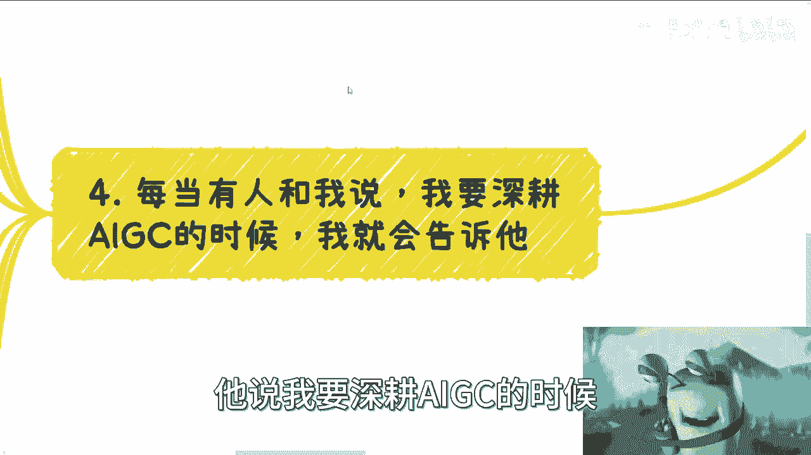

既然直接做产品困难重重，那么可行的路径是什么？每当有人表示要深耕AIGC时，我都会提出几个问题：你怎么赚钱？AIGC未来如何发展？历史上AI多次兴起，每次都宣称要替代人类，但现实呢？

例如，一个能熟练使用Office软件的员工，会在短期内被AI大规模替代吗？从软件工程角度看，真正的AI要替代人类并创造商业价值，中间需要的过程极其复杂，远不止数据和算力问题。

目前市场上能通过AIGC赚钱的，说得直接些，很多已是“收割”状态。如果真想进入这个领域，最务实的做法是成为“卖水人”或赋能者。

以下是具体建议：
*   **老老实实做“卖水卖铲子”的活**：提供基础工具或服务。
*   **帮助企业做AI赋能**：将AI技术集成到企业现有流程中。
*   **帮产业做赋能**：为整个行业提供AI解决方案。
*   **做人才培养**：开展培训和教育。

因为这些东西是**资本和政府**所需要的。不要总想着搞创新产品，在缺乏算力和自有数据（且数据受监管）的情况下，这非常困难。有伙伴会说“未来总要发展”，这话没错。但关键问题是：这个未来需要多久？以及，当未来到来时，如何确保与我们有关？

我的思考方式是：如果上述问题都不确定，为什么不去做一些更接地气、更能确定赚到钱的事情呢？你需要明白，“做AI产品”和“卖铲子”这两条赛道，无论是竞争激烈程度还是参与者的基数，都完全不在一个量级上。如果连卖水卖铲子都做不好、赚不到钱，那么做产品和服务赚钱的勇气又从何而来？

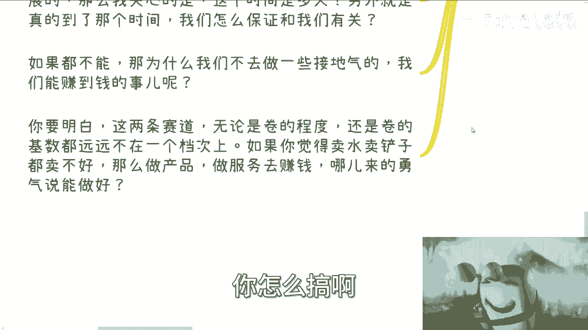

## 核心逻辑总结：助力政策与产业

本节课中我们一起学习了AIGC领域的商业逻辑。最后总结其核心逻辑：我们赚钱的关键，不再是简单地“卖东西”。在当下，我们要做的是**帮助企业、帮助产业去完成国家的任务和目标**。只有真正在政策与产业的KPI上提供助力，才有可能赚到钱。

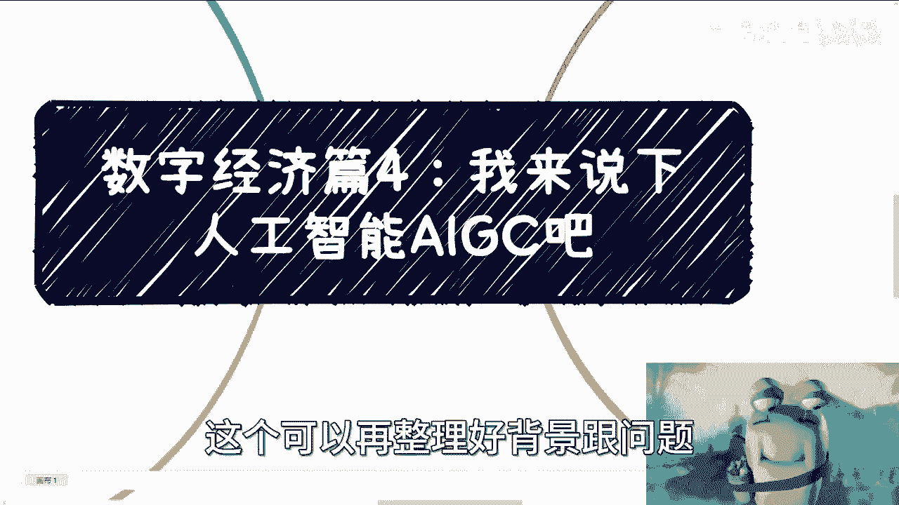

这个逻辑背后的思想是：个体应成为大趋势中的服务者与赋能者，而非挑战者或独立的创新产品开发者。希望本节能帮助你更清晰地看待AIGC领域的商业机会。