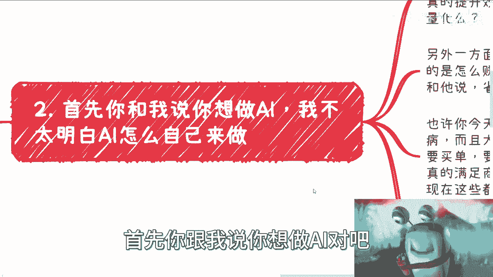
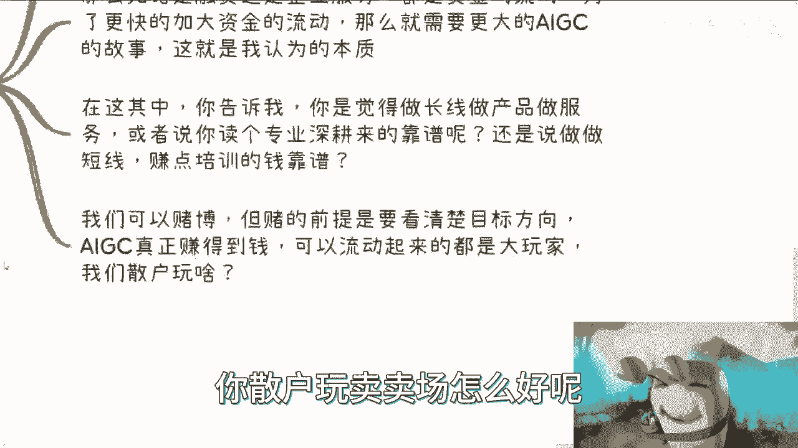
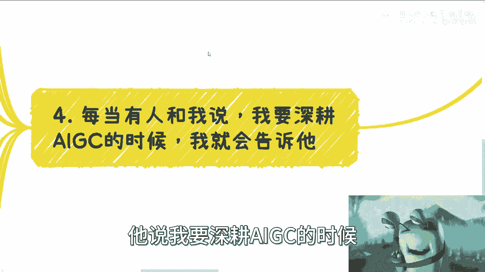
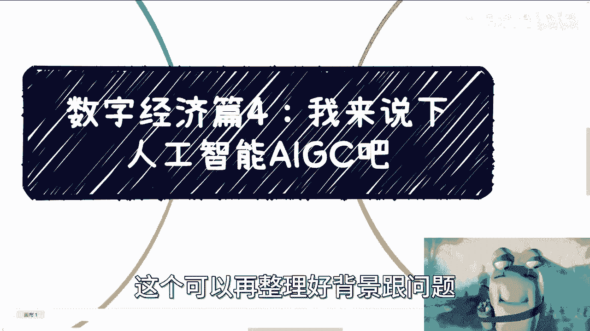

# 数字经济篇4：我来说下人工智能AIGC吧 - P1 - 赏味不足 - BV1xu4y1j7vz

好大家好，我来说一下数字经济PS4啊。

关于这个人工智能的嗯，这个东西呢我有我其实不太想讲的。

但是因为最近沟通下来，这个问题太多，我讲一下啊。

先说结论啊，首先呢我觉得我们每个人都是个体都是渺小的，我们想做点事情呢，赚点钱呢，那么必须符合大环境的齿轮，你只要跟着大环境去转才有可能对吧，你说当然啊，不是说你今天不跟着赚就赚不到钱。

而是说你只跟着他赚，你才能赚到性价比高的钱啊，不要去抠这些细小的细节，首先这是第一点，第二点呢我说一下我的结论啊，AIGC要赚钱，要么就是去赚快钱，要么就是跟着大齿轮去做一些，去市场或者方向上的服务。

也就是说你可以做培训，你可以做所谓的标准，你可以做科普，你可以做一些业务的集成啊都可以，但是你唯独就是不要去做一些，自己想着说我自己做一些产品或服务，做什么长线，我跟你讲，就是最近有些小伙伴就跟我说啊。

我为什么做这种产品，做这种东西赚不到钱，你赚不到钱是正常的哦，所以说AI这个东西在我看来啊，我先说结论对吧，就是一直都是资本家跟某些权利下呃，呃这个用来赚钱和增加经济流通的工具跟，催化剂而已啊。

从来不是说要用来拿做产业或产品本身的，那当然这个就像我说的，这个是我的观点啊，我的理解大家自己去判断。

你们要觉得想做的那就想做啊，你要觉得是这么回事的对吧，想去赚点钱，你就赚点钱啊，这个无所谓，哎等一下啊。

然后呢首先你跟我说第一第二点，首先你和我说，你想做AI吧。

我不太明白AI怎么怎么地啊，就说小微企业或者个人怎么去做，因为这是从需求来讲啊，你看啊你从下面来讲，用户客户需要AI吗，就是用户客户需要AI来干什么，他是为了噱头呢，还是说为了真的能提高提高效率。

就如果能真的提高效率，但它能提高多少，能不能量化对吧，你就像昨天有个小伙伴跟我提的，他说AIGC能够帮助大家去做这个，做这个服务，不是做这个做这个图片的设计，能够做什么杂志的封面，怎么样。

我说的是这样子的，我们从逻辑上来讲，AI能提升很多效率没有错，但是你今天能提升很多效率，跟他真的能不能在商业上批量化的运作，以及客户愿不愿意付你钱，这是两码事，你懂吗，也就是说你今天跟他说这东西好嗯。

好好好，这个东西牛逼啊，牛逼牛逼牛逼，你把这个东西一旦包装产品跟他说来，你一年付个20万哦，我考虑考虑就这样子的对吧，那么同样的在资本家啊，另外一方面我们一直说降本增效，降本增效。

其实你会发现大家关注的还是怎么赚钱，就是而不是说怎么更好的省钱，你知道吗，因为省钱这个东西他没有感知的，你跟他说，你一年省200万，他你觉得他心动吗，我我不心动的，我跟你说，你一年十两百万，心动不来。

你心动不来，对不对，你自身处地想想，你心动吗，你不心动对不对，你跟他说，你多赚200万，你不要太心动啊，对不对啊，所以说呢你更何况你跟他说，省钱之前你要省钱，对不对，你要先把我的服务啊。

这他妈更是BUSHIT，对不对啊，所以呢你你看啊，也许今天你要用AIGC来做文案，做图片，这没毛病啊，而且大家用的都很开心，但是呢你想说真的企业付钱，真的商业变现要去买单，真的长期去使用这个东西。

我跟你说，企业不是，资本家不是对吧，你他们都是会去评估的，而且大概率就是说比如说我，你说我花20万用你这个东西，对不对，那我肯定会去看啊，我有没有开源的东西啊，有没有自己做啊，我是不是自己做。

只要10万啊，这这正常吗，都这样想的呀，对不对对吧。

我不是说否认这件事情的价值，而是说你们真正的AIGC的落地，他有很多的问号，很多的这个不确定的东西，在这个地方对吧，而且你还在想看AIGC现在两大核心，一个是算力，一个是数据集对吧，在我看来。

这两个东西至少在中国啊，它基本上都是接近于垄断，或者说要被监管的，对不对哦，那么既然如此，那剩下你告诉我做什么呢，哦你数据怎么也是买来的哦，算力嘛也是借来的，你告诉我你做什么东西啊，你做啥嘞。

你更多的如果真的做，你还你还不是把海外的东西，拿套层皮拿出来卖嘛对吧，那要我说你稍微有点良心啊，有点有点底线好不好。

对不对啊，那么这是第一个第二个AIGC本身，从以前到现在，因为AI从历史上到现在，他不是第一次火的，他之前就火过对吧。

从以前到现在来看，它就是资本的黑洞，就故事本身远远大于落地，因为你看啊你看啊AI及其本身是要有，但有的质量怎么样再说，首先是有，也就是说现0~11到100再说啊，那么无论是融资还是企业服务。

都是资金的流动，都是为了推动加快资金的流动，对不对，那么就需要更大的AIGC的故事啊，那么这个是我认为中国的这个AI的本质，那么在这其中你告诉我啊，你觉得做长线，做产品，做服务，或者说你甚至会跟我说。

爱我要去读个专业来深耕，你觉得呢你自己想想看对吧，你就好像跟我说，我要赌个，我要做个5年的赌局，10年赌局，而且你还没有任何筹码，是不是就是你要明白啊，我不是说我们不能赌博。

你有很多事情的确是走了第一步，才能知道后面的，但是你赌的前提是你能够看清楚方向啊对吧，AIG7能挣的，赚到钱，可以流动起来的都是大玩家，我们散户玩什么，你你散户玩卖卖产这么好呢。

对不对，所以说你看啊，每当有人跟我说，他说我要深耕AI机器的时候。

我就会这么跟他讲，我说你看啊，你怎么赚钱，你自己都没想好，就AIGC未来怎么发展，你也不知道，而且AIGC在历史上也雄起过几次，我们就说，然后呢你自己去看看历史，然后呢对吧，而且每次都说I替替换人类了。

然后呢啊我现在就这么说，今天一个M对吧，它能够很好的运用office啊，比如说word，比如说excel或者怎么样，我就问嘛，它能够大大批真正的大批量，从明天开始，明年开始，后年开始。

企业里面大批量这种人，office人不要了，会不去看看，会不会，对不对，就是就是软件这个东西，我跟你们讲，但凡做过软件工程都知道，所谓的所谓所谓就是说真正的AI，所谓的真正的就是能够去赚钱的。

或者替代人类的，这当中过程多太多了，需要的过程，它不是单单数据跟算力的问题啊对吧，那么现在和我说AI机器人去做市场上面，咱说好听点就是能赚到钱的对吧，说的不好听点就是收割了都已经好直播了对吧。

那你们现在转什么东西，你告诉我对吧，要真的想做的老老实实去做卖水卖铲子的活，要么就是帮助企业去做AI的赋能，要么就是帮帮产业做赋能，要么就做人才培养，为什么，因为这些东西是资本跟政府要的，对不对啊。

别别去管那些有的没的搞，搞那些有的没的干嘛呢，还想着说创新啥玩意，你告诉我要算算要数据没数据，你数据还是被监控的啊，你什么东西啊，对吧啊，还有小伙伴说未来总要发展的，对没毛病，这句话我也认同的。

未来是要发展的，任何事情未来总要发展的，但问题是我关心的是什么，这个时间是多久对吧，另外就是说真的到了那个时间，我们怎么保证跟我们有关系，当然啊我只是说我的思考方式，我不是说你们一定要这么思考。

我只是share一下我的思考方式，对啊，那么如果来说都不能，那为什么我们要不去做一些接地气的事情，而不去这些我们能能赚到钱的事情呢，对不对，所以说你要明白，这两条赛道无论是卷的程度还是卷的基数。

它永远都不在一个档次上面，就是一个是你想做出个AI的产品，一个是你去卖铲子啊，如果来说我是觉得，如果你觉得卖水卖铲子都卖不好，你都赚不到钱，那么你做产品，做服务区赚钱，哪来的勇气啊。

这两边无论是赚钱或者说无论是卷，它档次完全不在一个level上面，你怎么搞。

所以啊所以啊就是我不知道你们能不能get到，就这个视频背后的核心逻辑啊，核心逻辑就是说我们是要帮助政策，我们要帮助国家，我们要帮助产业去做一些东西哦，而你只有真正帮助到他们。

或者说在在在KPI上面帮助到他们，你才有可能赚到钱，而不是说你今天说我要做一个什么创新项目，做一个创新产品，然后这个产品卖给别人，我跟你们说，大部分人还是没有明白我说的核心逻辑，你知道吗。

我们要赚钱已经不是在卖这件事情了，卖已经不可能了，我们要做的就是要帮助企业，帮助产业去完成国家的任务，懂啊啊好，那么这个我觉得就已经讲的很透彻了好吧，你们就只能自己悟了啊，剩下行吧好吧，那其他的。

你们要是有什么可以再整理好背景跟问题。

