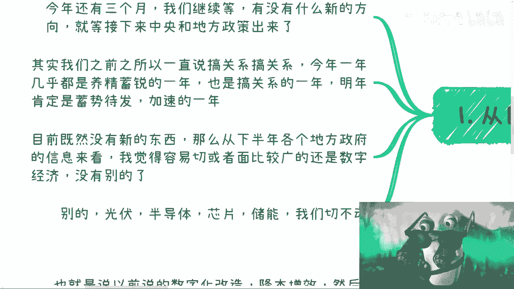
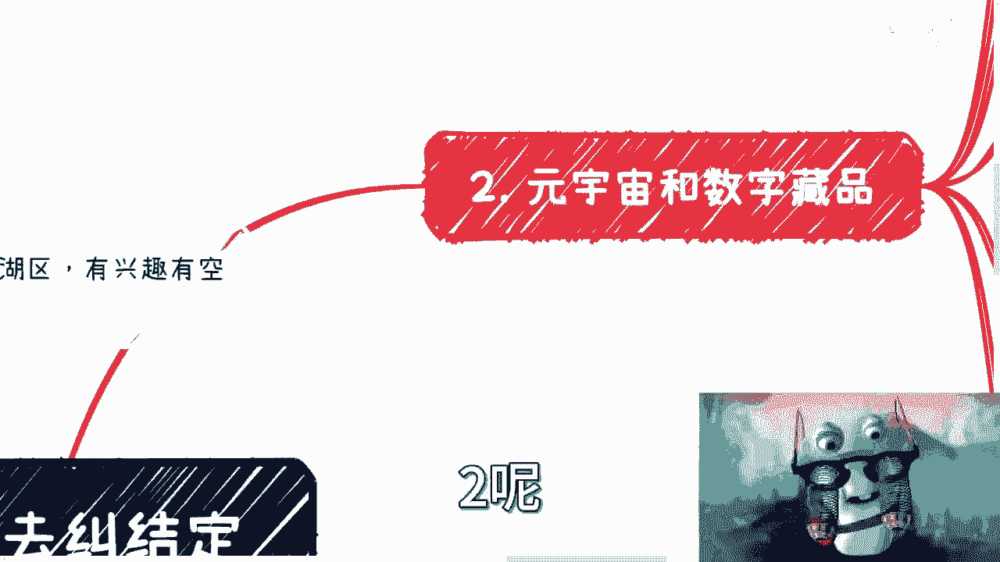
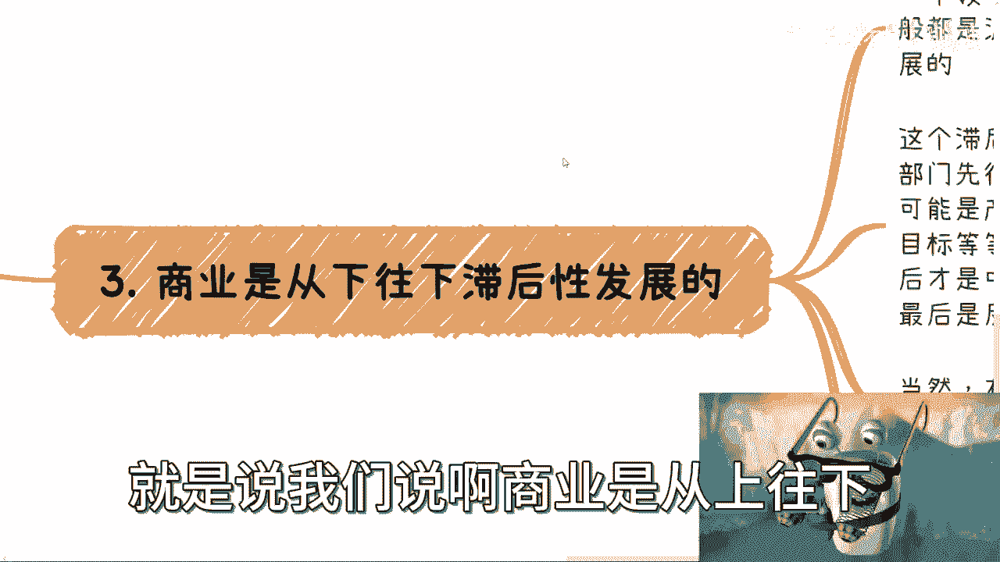

# 数字经济：别去纠结定义，我们还是来看怎么搞钱比较重要 - P1 - 赏味不足 - BV1CH4y1d7P9

大家好，这个很久没来更新数字经济了，呃这一期主要是给大家更新一下啊，就是这个主题虽然我是这么定的啊，但是我觉得我主要是跟大家更新一下，最近得到了一些信息，update一下，然后杭州的活动已经定了啊。

10月14号在杭州西湖区啊，有兴趣的呢有空的呢可以私信我来报名。

呃，现在还行吧，还行吧，这个因为场地还是蛮大的，所以都OK啦，嗯呃现在是10月国庆之后嘛对吧。

从目前来看呢，还是要继续等政策，因为我大概也都问了一下呃，等啊，就是反正结论就是等呃，有可能11月12月会出，也有可能明年再出啊，没人知道，但他一定会出啊，那么今年还有三个月继续等啊。

你说有没有什么新的方向呢，这个不知道啊，只能等这个中央啊，你看我这个眼睛甩的多开心是吧啊，中央跟地方出政策，那么呃其实呢我们之前一直说搞关系搞关系，今年这一年呢你说是说停摆啊，今年这一年。

那么其实你也可以理解为，就是说大家这个水下都在搞事情啊，都在你可以理解为拉帮结派对吧，养精蓄锐也是搞关系的一年，明年呢肯定就是蓄势待发了，呃当然了，因为每个行业不一样嘛对吧，大家每个呃进出口贸易啊对吧。

各个方面其实每个方向不一样，那么但是不管怎么样呢，就是说明年肯定是这个加速的啊，不管是你说美国大选也好，还是说因为今年停摆了一年也好，就肯定会加速，那加速就意味着这个机会肯定会多啊。

那么目前呢呃我也的确没看到什么新的东西，然后从下半年各个地方政府的信息来看呢，我觉得可能啊就是说大众比较容易切的呢，应该还是在这个数字经济方面，因为你别的光伏半导体啊对吧，芯片啊，储能啊，这个切不动啊。

你怎么切啊，你要么就是需要一些很高大上的开头，要么就是需要一些很硬的背景，你切不动啊对吧。

啊那么这个是一啊二呢。

就这个说一下元宇宙和数字藏品对吧，我看到很多人呢其实关心啊，就之前我也发过嘛对吧，数字藏品啊，与元宇宙相关的啊，然后大家就关心凉不凉对吧，哎呀这个东西怎么还有人做对吧，呃有没有人提是吧。

是不是没法做了啊，这个东西做了不赚钱，我还是那句话啊，我以前在直播的时候，我就说的很清楚，就是啊这个东西凉不凉，不是我们说了算的啊，根本就不重要对吧，就这个东西就是说呃一切跟着政策走。

你只要政策有他就有钱赚，而且呢有政策，有它就是一个自上往下走的一个流程啊。

那么那个又又到上海话教学对吧，觉得用上海话来讲，这种业务叫什么叫PV啊，什么叫批字，本质就是有总比没有好对吧。

我们我们做业务讲究一个从上往下，从上往下才有余地，从下往上，你一旦走死了，就真的就是走死了。

你懂啊啊那这个我来给你解释一下啊，所谓从上往下走呢，就是说例如你上海对吧，已经在城市建设上面，今年又出来，他说有元宇宙的相关政策，然后还有什么区块链，这边有什么浦江链对吧，11加11X什么东西对吧。

你们可以仔细去看对吧，那就说明什么，那就说明就说他政策上有这个东西，那就说明一定各个方面啊，咱不管什么什么企业啊对吧，政府啊，什么高校啊，什么什么园区啊，什么生态园啊，什么乱七八糟的，我不管他什么地方。

他就一定会有申报啊，一定会有对应的竞赛，也就一定会往有网上蹭的培训咨询，为什么，因为你他最终我们要说，就说我们要明白做事情的目的嘛对吧，但最终目的是什么，为了汇报汇报要什么，汇报就是要往新的东西上蹭了。

对啊，你说有城市规划了啊，你汇报不往上面蹭，这不吗，是吧啊，你说最后实在有些走不通啊，也没事，因为市场是个波浪式的，什么叫波浪式的，待会我会给你们解释，就说上面的政策和行为，他一定会影响到下面对吧。

那政府一定会影响到国企，央企。

政府一定会影响到国企央企，然后呢国企央企业也影响到大企业，大企业，然后影响到中小型企业，然后是C端的散户，就它的整个影响是一个一浪接一浪的，这么一个模式，那么数字藏品呢也是一个道理。

其实数字藏品我跟你们说啊，就是不要去在乎啊，它叫什么啊，因为国家一天到晚来给你改称呼，他吃饱了撑的，是不是啊，我一会儿叫数字藏品了，一会就数字新闻创了，一会叫什么数字资产了，我不重要啊。

叫什么无所谓啊对吧，但是如果你看之前的市场，我也觉得对吧，可能是没什么发展，但是他叫这个称呼，他可以不改啊，但是未必这个称呼就是这个市场对吧，你国内完全可以结合数字化，结合数字化改造。

去走一条不同于以前的一个新的路，那么数字藏品它依然会有一大片的增量市场，它只不过玩法跟以前不一样罢了，你管它叫什么呢，对不对。

那么这个是二三呢，就是说我们说商业是从上往下。

有一个滞后性发展，什么意思啊，就任何一个领域，它但凡是政策驱动的或者是大趋势驱动的，那么它一般都是波浪形，一波一波发展的，只不过是滞后性发展，这个滞后性来体现在两个层面，一个是政府相关的。

比如说政府相关部门先行，可能是培训咨询，可能是创新项目的申报，可能是产业园的构建，可能是国标团标的这个编写，也有可能是人才培养的一些这个制定你知道吧，但是这些东西一定是先有的。

然后呢才会影响到大企业去做咨询培训啊，然后才会影响到中小企业，可能说哎我要做数字化转型对吧，数字化改造，然后才是项目一轮轮落地啊，最后他才是会反映到这个招聘端，就企业的这个这个这个这个招聘需求上面。

你知道吧，所以说我们就说啊就说打工人这件事情啊，做电池这件事情，它不单单是一个嗯就是说没有赚不到钱，没有太大前景的这么一个呃，你从整个社会的发展，或者说整个商业的这个金字塔发展来讲。

它也是处在一个非常末端的这么一个阶段啊，那么当然有时候呢这些事情发生呢，他可能是同一时间发生，只不过他出结果会有个先后顺序对吧，因为很多时候做事情不一样的，你比如说今年我们项目申报都现现在申报对吧。

成员也现在申报团标，国标也现在做对人才培养也现在做，然后大小企业这种项目也是现在做，但问题是最终出结果，最终出公式他可能是有的嘛，是明年上半年就出结果了，有的明年下半年才出结果。

有的要到后年上半年出结果，那么它其实还是波浪式的一个一个结果啊，那么第二个滞后性呢，就是城市就是1~5线城市的玩法对吧，包括大家的关注度啊，大家接受度啊对吧，大家的这个这个感兴趣程度啊。

这种之后一般有一到两年甚至更长啊。

这个不知道的啊，但是不管怎么样，一定是中国发展，原本就是说各个城市就是这么一个这个。

这个这个发展规律啊，那么第四点呢，就目前看来数字经济是个大概念啊，就是说呃没有什么东西不能做，你都能做。

就看你这故事怎么讲啊，你别去想着说啊，吕老师啊，这个东西到底跟什么什么东西结合，怎么发展，这个没有定论的呀，对不对，就这个东西不是应试教育，你知道吧，就这个东西能怎么做，取决于你的故事怎么讲啊。

也就是说比如说我们说的数字，之前的数字化改造啊，降本增效啊，然后我们所说的元宇宙数字藏品啊，数字人民币啊，数字资产啊，包括数字化之后的所有的这些产业啊，其实他都可以跟数字经济挂钩对吧，这看你怎么说啊。

啊走项目申报，基本上今年下半年呢都开始运作完了啊，走项目制的kiss by kiss的合作，基本上就是下半年都包装好了，比如说产品包装好了，产品包也包装好了，介绍也包装好了，故事也知道怎么讲了对吧。

那么明年一开年就开始跑销售跟商务了对吧，或者说今年就已经开始做一些铺垫了啊，其实各行各业呃，我觉得都是能结合的呃，除了非常就是说这个难以结合的对吧，就是大部分都能结合什么农业啦，金融啦，游戏啦。

都能结合啊，毕竟什么呢，毕竟就是说数字化里面，比如说降本增效啊，数字化改造啊，这个东西本来就是个万金油啊，它是这个至少这两年是不变的这个主题啊，所以说我们做什么其实并不重要啊。

找到自己的这个熟悉的关系链，然后去切后宏观的这个包装上面，一定要往数字经济，数字科技啊，数字叉叉上面去靠，那这个事情才是靠谱的啊，那么所以说你看嘛，就是说不管是你说我想做培训对吧。

还还是做做做这种弊端to b的生意啊，还是做to c的生意，还是做to g的生意，还是做出高效的生意，无所谓啊对吧，这都能做，真的都能做，就是呃因为毕竟方向已经确定了，那怎么做还不知道。

那怎么做还不知道，这不才是机会吗，对吧好吧嗯反正嗯对，反正就是说呢我觉得大家看很多问题的时候呢，不要太去纠结于说啊这个东西好或者东西不好，这个东西怎么样，这个不是我们去关心的，我们只要关心政策扶不扶持。

有没有对应的文件，有那就干对吧，就就这么简单对吧，因为你有你才有机会高高举高打，你有机会高举高打，你才有后路对吧，你说你没有机会高举高打，你也没有后轮，那你怎么搞没法搞啊，好吧行我靠，我他妈跳出来。

怎么C端没有空间了好吧，那先这样吧，先这样吧，OK那我反正时时在跟大家更新好吧，有一些什么新的这个信息，我会再出视频跟大家讲呃，今年反正就等好吧行吧，然后大家有什么就是职业规划，有什么副业对吧。

有什么赚钱的，有什么其他的，反正要咨询的啊，要要要不知道手上牌怎么打的，反正你们就是整理好问题好吧。