# 数字资产在当下框架下可以尝试的金融切入点 - P1 - 赏味不足 - BV1ov4y1H7hb

好啊大家好，那个生产队的驴已经死了，生产队的驴已经被我卷死了，好吧，不要惦记驴了，驴已经不存在了。

那个啊，然后我们这一次就是继续数字经济啊，讲的是这个数字资产在法律上呃，我这个名字我真的想了半天啊，我最后就觉得就是就是找这么一个，大家可以理解吧，就是呃以现有的法律来套。

就是数字资产可以从哪方面去套啊，和合法合规的，有很多人就要说了，他说这个陈老师，你你讲互联网也就算了对吧，你现在来讲法律你就扯淡了，我跟你们说，那不是我，我想懂啊啊，你们去创个业，你就知道了。

你被逼无奈啊啊同学们是吧。

是这样子的，首先啊如果我后面会就最后的时候呢。

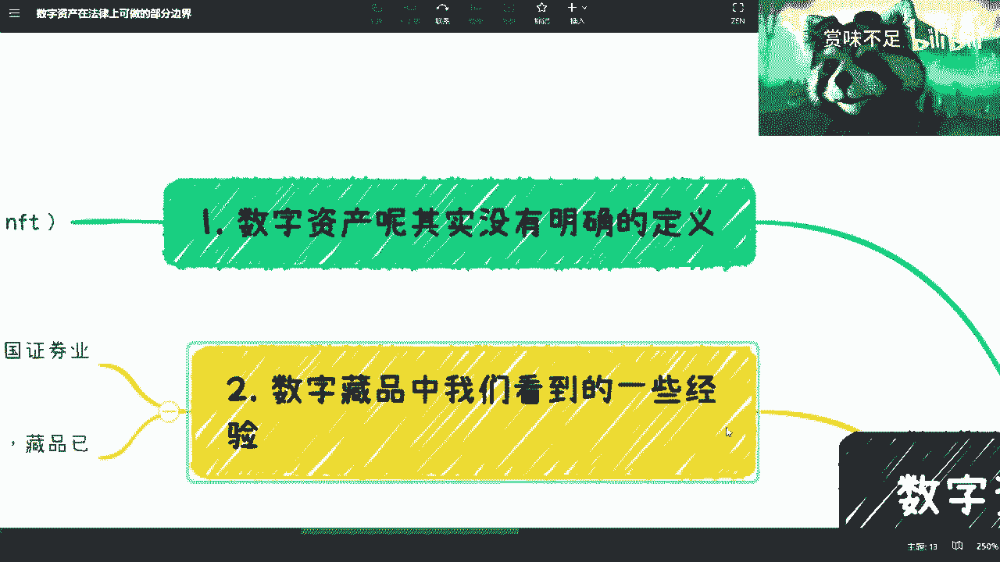

我会举个例子，哎呀我跟你们讲，我真的我就怕我忘记了，我等一下啊。

我加一个例子，那我最后举个例子。

我一开始会把一些背景啊，一些东西讲一下，你们但凡如果了解的呢，你们就跳过好吧。

跳过，啊首先第一点啊，就是这个数字资产呢其实目前没有明确定义，因为你在这个国内做事情嘛。

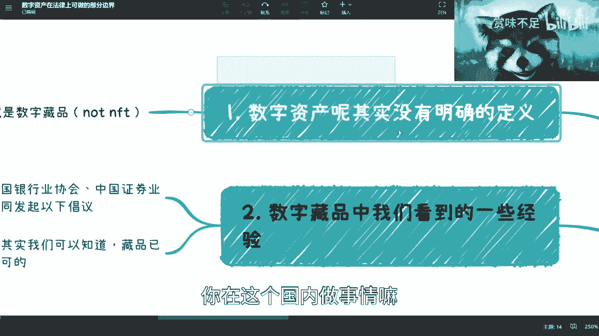

你也知道啊，就是很多时候呢首先你得定义清楚对吧，这就好像大家去辩论一些问题的时候啊，你得大家对于某些东西得有一定的定义对吧。

否则你说鸡同鸭讲，鸭讲对吧，有什么用呢，是没有意义。

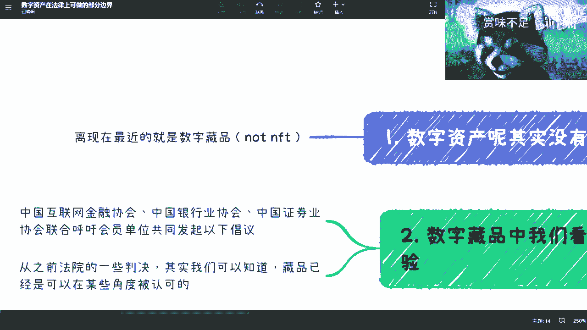

你看啊离现在最近的这个数字资产是什么呢，就是数字藏品对吧，这个东西呢我觉得呃可能很多人都知道，但是嗯也觉得可能跟骗局啊，或者有什么相关啊对吧。

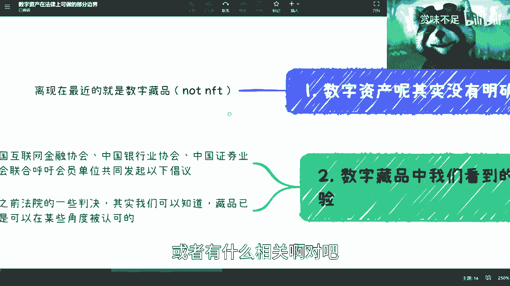

这个我觉得问题不大啊，问题不大，但是呃从数字资产上面呢，从目前看呢。

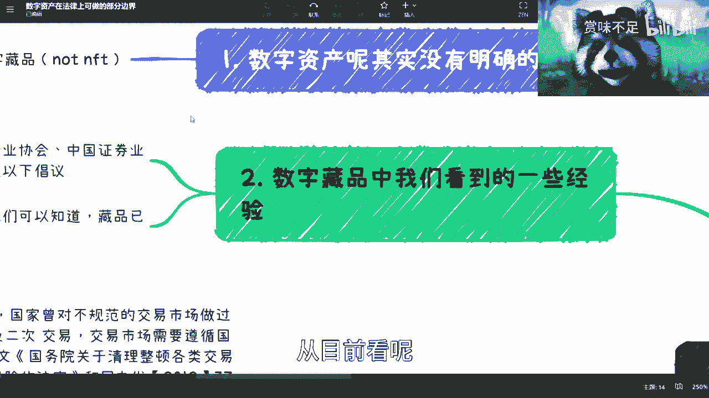

藏品是目前最接近数字资产资产的一个东西，就整个国内现在在做大数据这边的，这个跟区块链的结合啊，这个东西我也可以跟你们讲啊，但是呃你说是不是解那个跟数字资产。

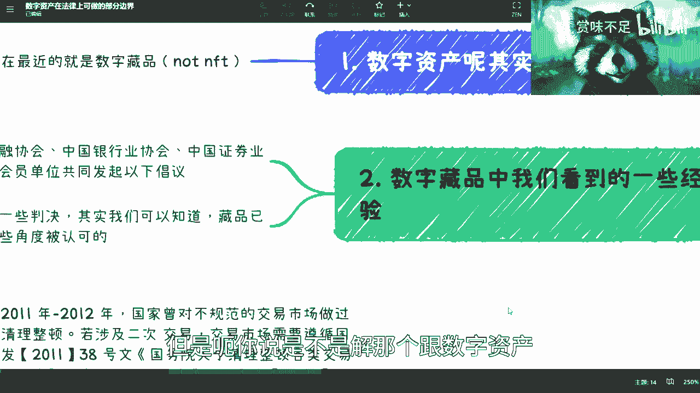

属于一个东西呢，咱现在还说不好啊。

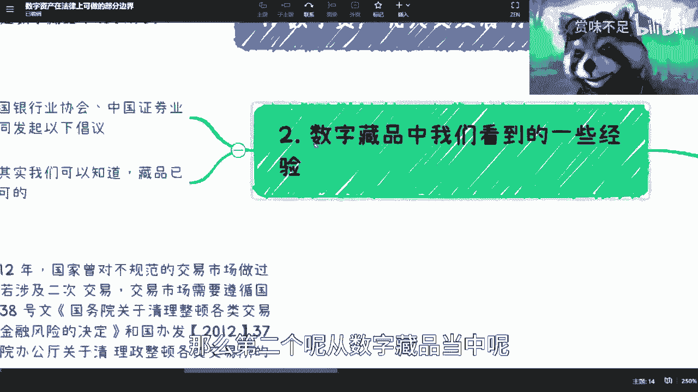

那第二个呢从数字藏品当中呢，我们可以看到一些经验，什么经验呢，你比如说啊这个之前啊，互联网金融协会，银行协会，中国证券协会。

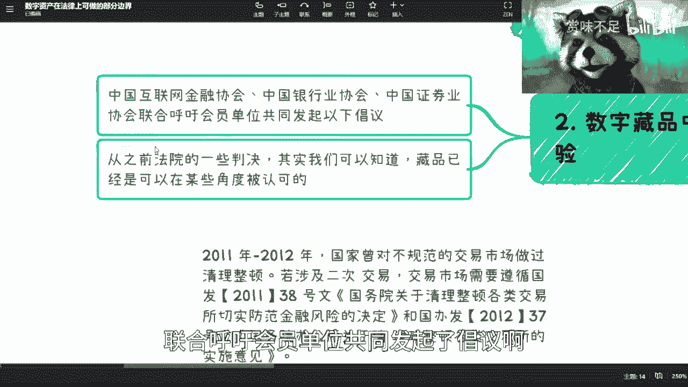

联合呼吁会员单位共同发起了倡议啊，那么这个倡议呢你们可以理解为是什么呢。

就是说呃很多时候并不是呃今天出一个行业，明天法律就跟进对吧，他没这么快的，那么呃从这些对应的协会来讲呢，这些协会还是比较有叫什么官方背景的，或者说有一定的这种呃这个行业地位啊，那么他发起的写倡议呢。

你们可以理解为像更多的像一些法律的，就是说啊他没有法律这么的严谨啊，但是它更它也具有一定的指导意义啊，你可以这么理解，可以的，对吧，然后呢你看啊之前杭州还是哪边。

就是说呃有些法院的判决，他从判决里面呢。

就是说判了额数字藏品相关的一些不是诈骗啊，就是数字藏品相关的一些交易的一些判决。

从这个判决当中呢我们可以知道啊，就是藏品现在从某些角度来其实已经是被认可，就是说啊他至少打个比方，它虽然不具有二级交易权，它也不具有啊，它不具有二级交易的这种金融的属性，但是呢他可能就要有拥有那种。

比如说物品的属性对吧，收藏的属性，就比如说今天呃你卖一个藏品给我对吧，那我付钱了，你没有给我，那这个东西呢我去告到法院对吧，那么很多时候呢就是我们说啊，因为在整个法律的体制下面。

很多时候会因为这个东西没有被定义，所以他很难去判断说，这件事情到底是怎么一个判罚啊，但是现再就是近两个月吧，就是有一些法院做了判断判决之后呢。

我们也知道，就是他们也觉得哎就是非金融属性以外，至少这个东西是拥有一定的这个物品权，或者来说这个交易权的对吧，就是说啊你我我你可以来售卖，然后呢我购买了这个你东西都要给我对吧。

那么在这上面呢就是说他默认了，至少就是说啊是不是数字资产咱不知道，但是它至少有拥有同等的这种物品的属性啊。

那么在这个是二对吧，三在哪三啊。

那个我们来看一下这个倡议，三协会倡议这个地方呢我们来看一下啊，就这里就是全文了啊，我没有精简啊，这里就是全文了啊，第一个呢我们能够看到啊，这个呢我觉得也很简单，就是说了就他一大堆对吧，说了半天。

说了半天，意思就是说你得我们不是不允许做啊，你得做对应的有价值的东西啊，就这就这么简单啊，那么呃你不就是这个也很正常啊，因为你比如说疫情之后啊，就是你很多的这个呃相关的东西。

那么我觉得这个是一个第二个呢，就是这个坚守底线啊，防范金融风险，那这个也很简单对吧，就是告诉大家啊，你们哪些能做，哪些不能做对吧，呃你比如说啊你要去发行的藏品，没有关系，可以发。

但是呢你底层不能去包含相关的，比如说什么证券啊，保险啊对吧，相关的这种变相的金融交易品产品对吧，这个就字面理解对吧，很好理解啊，第二个呢，就是说你不能通过分割所有权，或批量创投等方式削弱这个同质化。

那这是什么意思呢，意思就是说你要去发行，你得有独特性对吧，比如说一个东西就一个对吧，就是就比如说你今天发一个奥特曼对吧，你你你说啊，我在有授权的情况下面，我把100个奥特曼发发100份对吧。

100个奥特曼100份，每个奥特曼一份，这可不可以可以啊，但是你要说你今天就发一个奥特曼，这个奥特曼1万粉对吧，那么你说他行不行呢，也不是不行啊，但是呢他其实有削弱，叫做这种同质化特征。

同时呢有这种变相开展融资，哎其实就是非法集资嘛对吧，开开展这种集资的这种这种可能性啊，那么就第二点啊，那么第三点呢就是说啊补位啊，就是你你说我不发行不行也行啊对吧，有很多人说我不发对吧。

那我给他提供集中交易啊对吧，比如说这个这个电子撮合啊对吧，匿名交易啊，做事啊对吧，哎这都不允许啊，因为这都是金融属性啊，包括持续挂牌对吧，标准化合约对吧，都不行，反正就不行啊，就是有很多人觉得我不发哎。

但是呢我来提供这个场所啊，不好意思，不行啊，第四呢就是不得以虚拟货币相关的去做机架，那这个其实跟收藏没有关系啊，它更多的是说跟以前虚拟货币相关的，这个政策保持一致啊，呃第五呢就是对这个发行啊。

售卖购买主体实名认证啊，简单来讲就是要溯源嘛啊就溯源可可跟踪，可跟踪，最后一个呢就是不直接或者间接投资n p对吧，那那那我觉得这个也没没什么好说的啊对吧，这个是三啊，三对吧，他大框架已经帮你框好了啊。

那四呢我们看啊，就是说来说啊，就当下可以依据的法律依据是什么呢。

就是2011年到2012年啊，国家曾对这个交易市场做过清炖啊，那么清炖呢，在这里面我们能够看到就是38号文，201年38号文，关于清理整顿各类交易所，切实啊防范金融风险的决定对吧。

在37号文当中提到了这么一个东西啊。

一个呢是一个呢是交易所，审理啊，这就这已经是非常确定的事情了对吧，你们我跟你们讲啊，别在这个行业里面就动不动什么啊，我们有这个交易资质啊，有什么东西啊，是不是相关设立审批对吧，以法律为准对吧。

二除了证券交易所跟其他批准通过的交易所，场外不得有任何权益等额拆分公开发行对吧，你看啊不得将任何权益等额拆分公开发行，权益持有了不得超过200人对吧，就是说你会发现什么呢，就是说这个东西啊，你说啊。

在有证券交易所或者其他相关交易场所，合作的情况下面啊，其实是可以的，但是呢在这种场所之下，你可以进行拆封吗。

可以，但是权益持有人不得超过200人，就是说什么意思呢，你最多最多就是200人，也就是说你今天啊就是要做一个数字资产的，一个一个叫什么分割啊，然后呢你能不能做能做。

但是能做的前提是你必须找到对应的合作伙伴，同时它能不能超过200人，同时它的交易周期不能至少为t加五对吧，t加五，所以说如果啊如果当下这个数字资产啊，我不管这个东西叫不叫n f t。

这不重要啊，就如果大家想要往数字资产的这个交易呀对吧，或者说这个呃二级市场上面去做文章啊，你们想去创业或者做各种各样的东西。

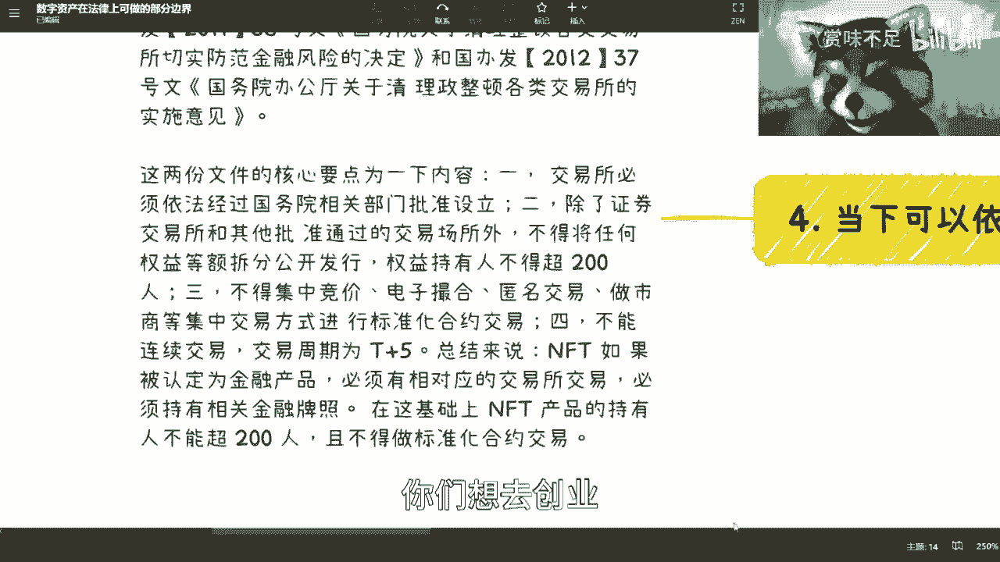

因为你们一定要明白就是数字资产这个东西啊。

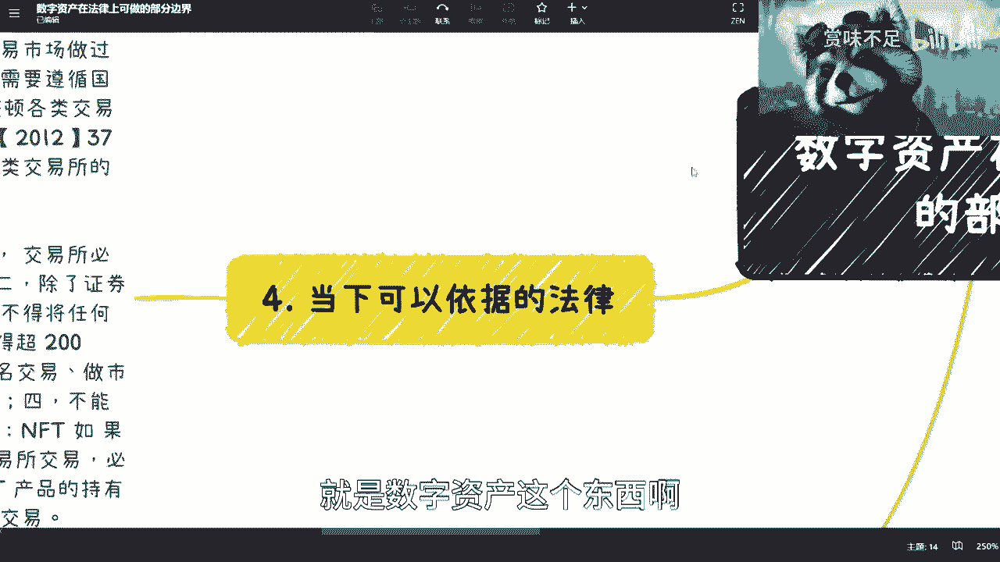

所有东西在未来都叫数字资产啊。

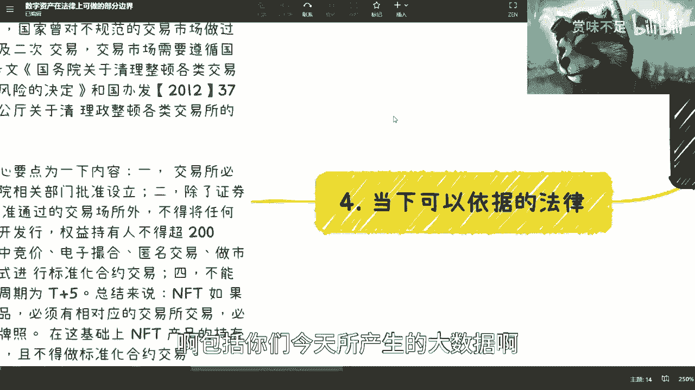

包括你们今天所产生的大数据啊，包括实体的一些一瓶水啊，对吧或者别的东西其实未在未来，所有东西都是数字资产，所以说啊这个东西你说有没有价值有啊啊，你说他有没有风口有对吧，你说他有没有机会有啊。

他什么东西都有，但是问题是你们得要先去理解啊，你们你们不知道这是个什么东西，那自然跟你们没有关系对吧，那同样的啊，我们来举个例子，就比如说啊我们之前提到过一个案例，这个案例是什么呢，叫做啊高效的。

这个怎么说呢，就是导师啊，研究生项目吧，也装修研究研研究生项目众筹啊，众丑对吧好，那这个案例是什么意思呢，是这样子的，就是啊之前呢有一些跟这种交易所合作的，然后呢他说我们做一个什么呢，做一个这个网站。

这网站呢是一个聚合平台啊，这句话平台什么意思呢，就比如说哎那你比如说啊，比如说诶这个是负担的对吧啊这个是交大的啊，这统计的啊，这个清华的对吧，或者是某某某学校的，我呢就把它列在这边啊。

然后呢这导师是谁对吧，参与方是谁等等等等等，对不对，好，那么高校的学生啊，高校的项目缺的什么呢，缺的是资金是不是好，那么现在对于很多散户呢，他要早期投资呢也很难，对不对，那么这两者两者都是痛点嘛是吧。

那么很简单，就就是根据每个项目来发行啊，比如说200份或100份token数字资产，然后呢由c端散户来自由的认领啊，认领的东西意味着什么呢，就是在里面会写清楚，认领的东西呢，可能占这个项目的这个股权的。

比如说10%或20%啊，这个都可以啊，这个看就这个项目，因为你看这个项目自己定义嘛对吧，但是呢其实这个数字资产呢，就是它的权益的分割对，就相当于如果100份，那就是10%里面的这个10%。

里面的1%对吧，每一个人啊，那么分割，但是呢就是这个分割呢，也是一定要按照这个标准去的，也就是说你一个是需要有交易所的这种合作，第二个呢就是说你是不能超过200份，第三呢就是说这个权益。

比如说我今天买了这个同济大学的对吧，这个这个这个项目的10%，10%股份里面的1%，那么你说我能不能交易，可以啊，你去交易的话就必须t加五以上啊，t加十或t加20对吧，那么好，那么整个这个东西呢。

其实是一个类似于像众筹的模式，但是它跟众筹还不一样，在哪里呢，就是它的权益是有数字资产来代表的，比如说你发行100个数字资产，每个数字资产就代表着这个项目的10%，里面的1%对吧，就千1‰吧。

相当于因为是万分哦，不对不对不对，10%是1/10，然后啊对就1‰嘛对吧，那么1‰的权益，那么这个时候呢你就会发现啊，你就会发现就是说原本的1‰的权益，你怎么做呢，你必须要跟他们签署合同对吧。

你必须要跟他们走很复杂的流程对吧，包括认证，但如果在数字资产的这种链上的话，那么其实就可以节省很多的这种中间过程，包括你也可以更可信的去拿到你手上的资产，对吧，就是因为你拿到了这个token啊。

拿到这个token就是我们从官方的角度来讲，我拿到了这个token，那么我就是拥有这1‰的分润权对吧，那么如果这个项目以后融资了或者赚钱了，我其实是可以拿到对应的呃分红和利益的啊。

那么所以说呢这个逻辑呢我觉得倒是ok的啊，但是这个当中说是这么说啊，但是这当中可能比如说法律啊，包括其他方面，依然还是有很多东西可能是要去呃，你要说规避也好，或者说合规也好，其实有很多地方还是要做的。

但是呢从大框架上来讲呢，这是一个可行的路啊，就是说它是一个可以去，就是说啊往上套的这么一个方式，因为这个如果没有，就这个如果套不上去呢，就当下整个的这个呃，这个法里面就没有东西可套了啊。

没有东西可套了，那么只有等到说未来啊，比如说专门为数字资产出一套，只有规范啊，但是还是那句话，你但凡未来到时候出来呢，可能大家要说了啊，这个这个没有机会了对吧，怎么样啦，巴拉巴拉巴拉对吧。

那我现在反正先跟你们讲啊，啊就是就是这么个情况，而且这是唯一一个我跟你们讲可行的路数啊，你们反正自己自己想吧，好吧。

