# 课程一：数字资产在现有法律框架下的金融切入点 📚

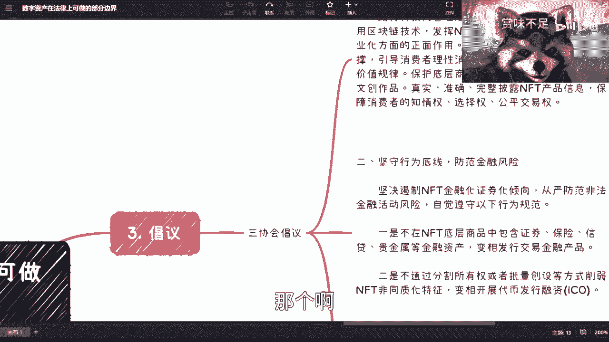

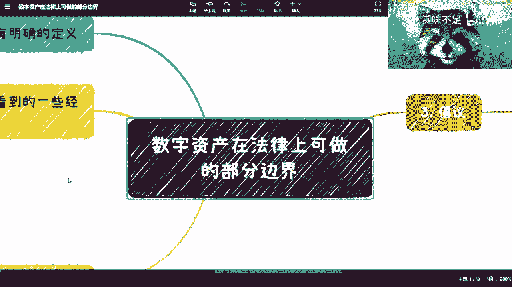


在本节课中，我们将探讨数字资产在当前法律环境下，可以尝试哪些合法合规的金融切入点。我们将从定义、行业现状、监管倡议和具体法律依据入手，最后通过一个案例来理解如何将理论应用于实践。


---

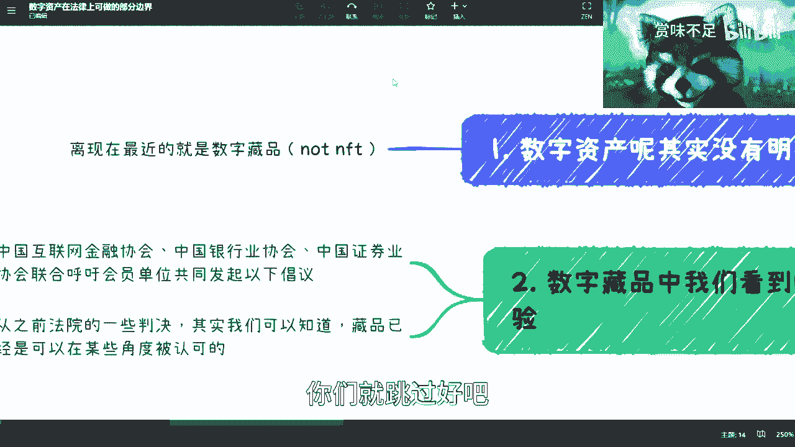


## 数字资产的定义与现状

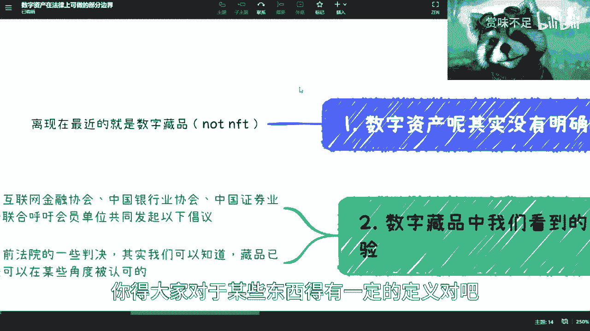


数字资产目前在国内没有明确的官方定义。这就像辩论时需要先统一概念，否则讨论将失去意义。


目前，数字藏品是距离“数字资产”概念最近的事物。虽然很多人将其与骗局关联，但从行业实践看，它是国内大数据与区块链结合领域最接近资产形态的产品。不过，数字藏品是否完全等同于数字资产，目前尚无定论。


## 从数字藏品中汲取的经验

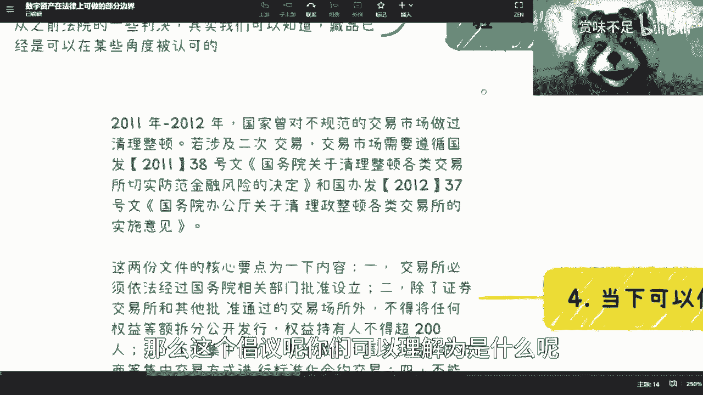

上一节我们了解了数字资产的模糊定义，本节我们来看看从已有的数字藏品实践中能学到什么。


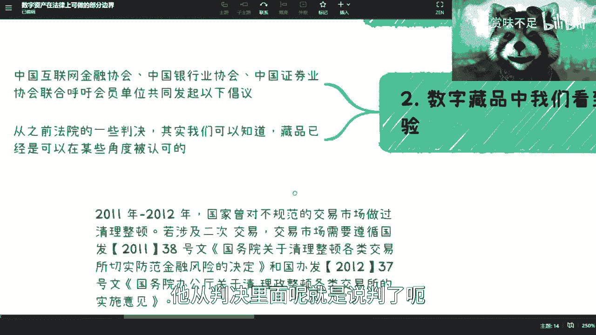

以下是数字藏品领域为我们提供的两点重要经验：

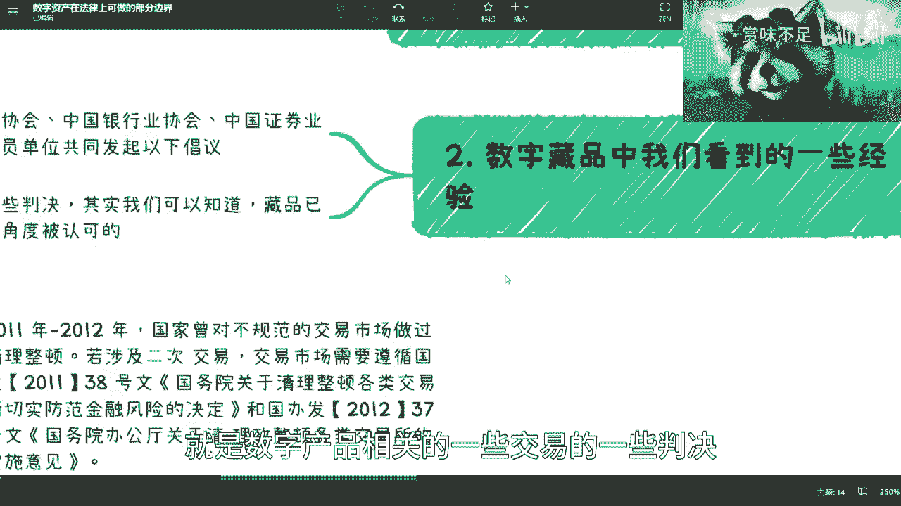

1.  **行业倡议的指导作用**：中国互联网金融协会、银行业协会、证券业协会曾联合发布关于防范NFT相关金融风险的倡议。法律跟进新行业的速度往往较慢，这类由具有官方背景或行业地位的协会发出的倡议，虽不具备法律强制力，但具有重要的行业指导意义。
2.  **司法判决的认可倾向**：近期，杭州等地法院对涉及数字藏品的交易纠纷做出了判决。这些判决表明，在非金融属性的前提下，数字藏品至少已被司法实践认可其具有“物品权”或“交易权”。例如，购买藏品后卖方不交付，买方可以依据合同关系寻求法律保护。这默认了数字藏品拥有与传统物品类似的法律属性。

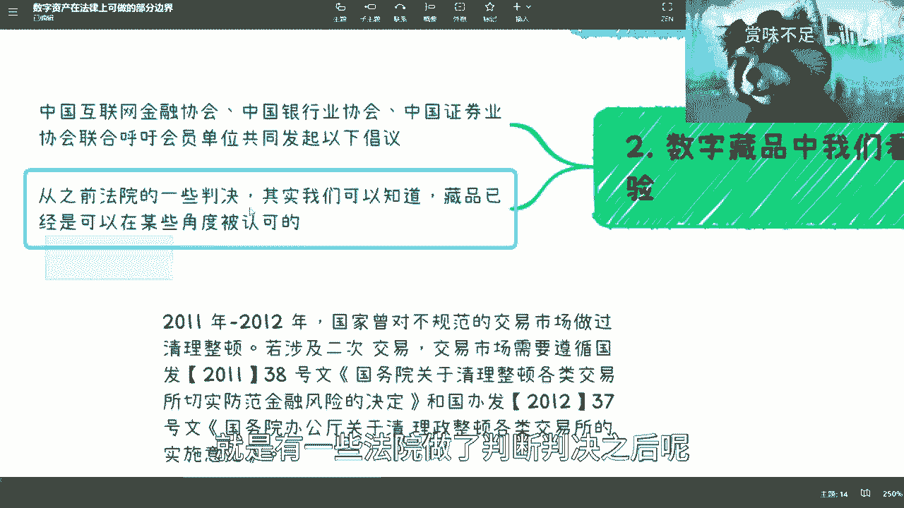

## 理解“三协会倡议”的核心要点


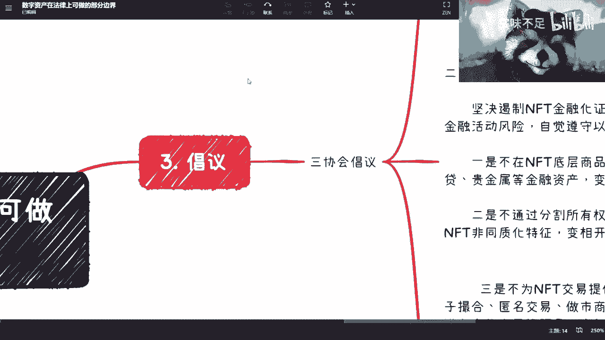

了解了行业现状后，我们需要明确监管的底线在哪里。“三协会倡议”为我们划定了基本框架。

以下是该倡议的六个核心要点：

1.  **确保底层资产价值**：发行数字藏品需与实体经济结合，确保其具有真实价值，不能炒作无实际价值的空气项目。
2.  **严防金融化风险**：不得将数字藏品底层资产证券化、保险化，变相发行金融产品。同时，不能通过分割所有权或批量创设等方式削弱其非同质化特征，避免变相开展融资活动（如非法集资）。
3.  **禁止提供集中交易场所**：不为数字藏品提供集中交易、持续挂牌、标准化合约交易、电子撮合、匿名交易或做市商等服务。这些均属于金融活动，被明确禁止。
4.  **不以虚拟货币计价结算**：数字藏品的计价和结算不得使用比特币、以太坊等虚拟货币，这与我国对虚拟货币的监管政策保持一致。
5.  **实行实名认证管理**：对数字藏品的发行、售卖、购买主体进行实名认证，确保交易可溯源、可追踪。
6.  **不直接或间接投资NFT**：相关机构不得直接或间接投资NFT，防止风险传导。

## 寻找明确的法律依据

明确了行业倡议后，我们需要寻找更坚实的法律基础。我国对于“权益拆分交易”有明确的历史法规。

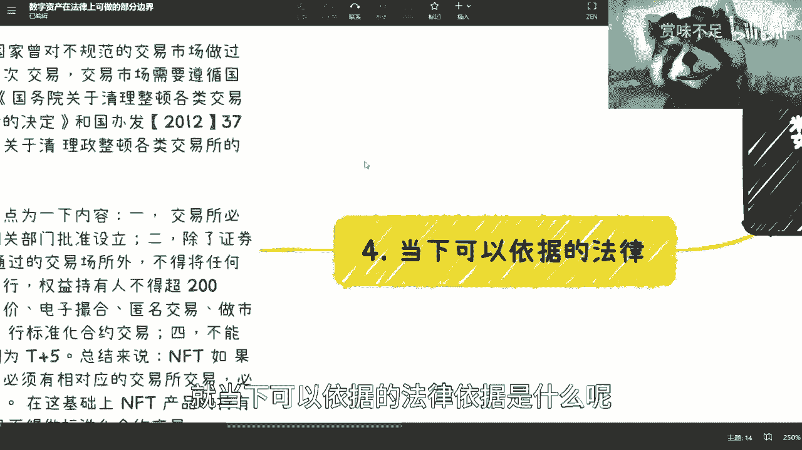

关键依据是2011年国务院发布的 **38号文**（《关于清理整顿各类交易场所切实防范金融风险的决定》）及其后续的37号文补充。其中两条规定至关重要：

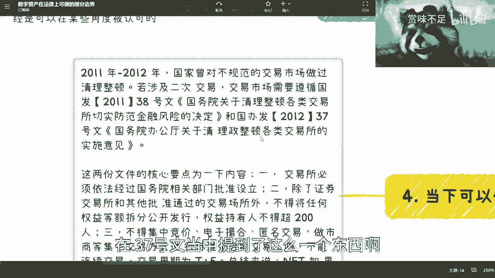

1.  **交易所设立需审批**：除依法设立的证券交易所或国务院批准的交易场所外，任何单位不得设立权益类交易场所。
2.  **权益拆分发行受限**：任何权益在其存续期间，无论在何种场所交易，均不得采取等额拆分、公开发行的方式。同时，权益持有人累计不得超过200人，且交易周期不得低于 **T+5** 日。

这意味着，如果希望进行数字资产的权益拆分和交易，**必须**与拥有相关资质的交易所合作，并严格遵守 **200人上限** 和 **T+5** 交易周期的规定。

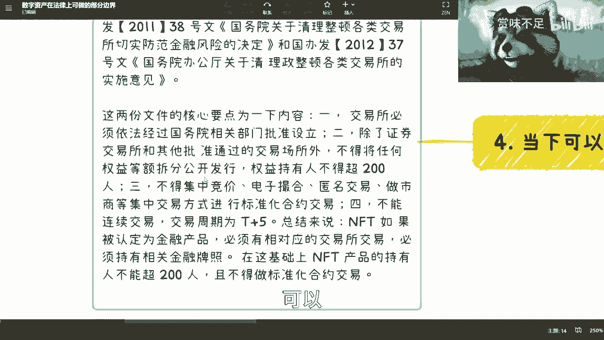

## 实践案例：高校科研项目众筹

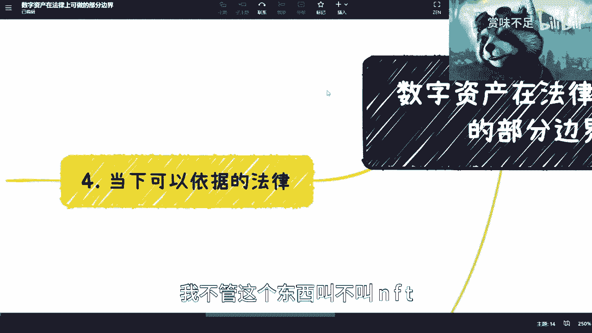


理论需要结合实践。基于以上法律框架，我们来看一个可行的创新案例：高校科研项目众筹平台。


该平台与合规交易所合作，作为一个聚合网站，展示各高校（如复旦、交大、清华）的科研项目及导师信息。

**运作模式如下：**
1.  高校科研项目缺乏启动资金，而普通投资者缺乏早期投资优质项目的渠道。
2.  平台为每个项目发行代表其部分未来收益权的数字资产（Token）。例如，一个项目出让10%的未来收益权，并将其拆分为100份Token，每份Token代表 **0.1%** 的收益权。
3.  普通投资者可以认购这些Token。认购后，投资者即合法拥有了对应比例的项目收益权。
4.  这些Token可以在合作的交易所进行转让，但必须遵守 **T+5** 及更长的交易周期规定。

**代码示例：一个简化的权益Token结构**
```solidity
// 这是一个极度简化的概念示例，非实际可运行代码
contract ResearchProjectToken {
    string public projectName; // 项目名称
    address public issuer; // 发行方（高校或平台）
    uint256 public totalSupply; // 总发行量，例如 100
    mapping(address => uint256) public balanceOf; // 持有人余额

    // 构造函数：初始化项目
    constructor(string memory _name, uint256 _supply) {
        projectName = _name;
        totalSupply = _supply;
        issuer = msg.sender;
    }

    // 购买Token的函数（需结合KYC和交易所规则）
    function purchaseTokens(uint256 amount) external payable {
        // 此处应包含复杂的合规检查：购买者是否实名？是否超过200人限制？
        // 以及支付逻辑...
        balanceOf[msg.sender] += amount;
    }

    // 未来项目盈利时，按Token比例分红的逻辑（此处省略）
}
```

这个模式的优点在于，它利用区块链和数字资产技术，将原本繁琐的股权/收益权合同签署、登记流程简化。投资者持有的Token本身就是权益凭证，便于确权和后续流转。当然，在实际操作中，仍需在律师指导下完成大量的合规工作。

---

## 课程总结

本节课我们一起学习了数字资产在当前法律环境下的合规路径。

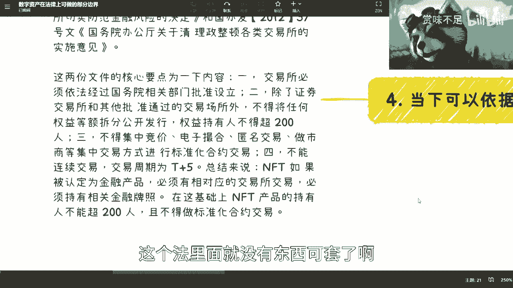

我们首先认识到数字资产定义尚不明确，但可以从数字藏品的行业实践和司法判决中寻找参考。随后，我们深入解读了“三协会倡议”划定的六条监管红线。接着，我们找到了更根本的法律依据——**38号文**，它明确了权益拆分交易必须与持牌交易所合作，且需遵守 **200人上限** 和 **T+5** 交易周期。


最后，通过“高校科研项目众筹”的案例，我们看到了如何将上述框架应用于一个具体的、有社会价值的商业模式中。这几乎是当前框架下，进行数字资产金融化创新的唯一可行路径。未来或许会有专门的法律法规出台，但在此之前，理解并运用现有规则是探索数字资产领域的关键。