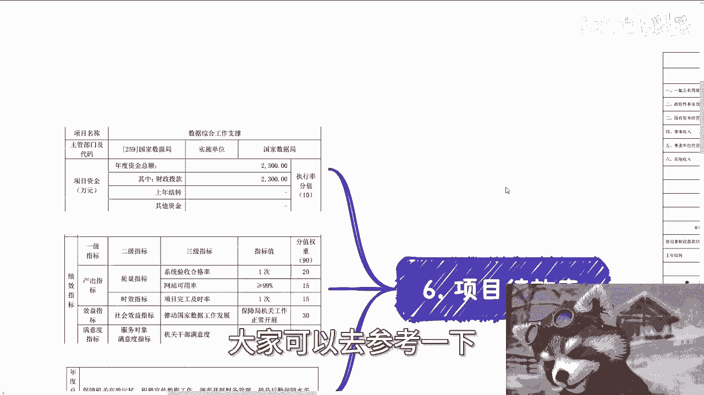
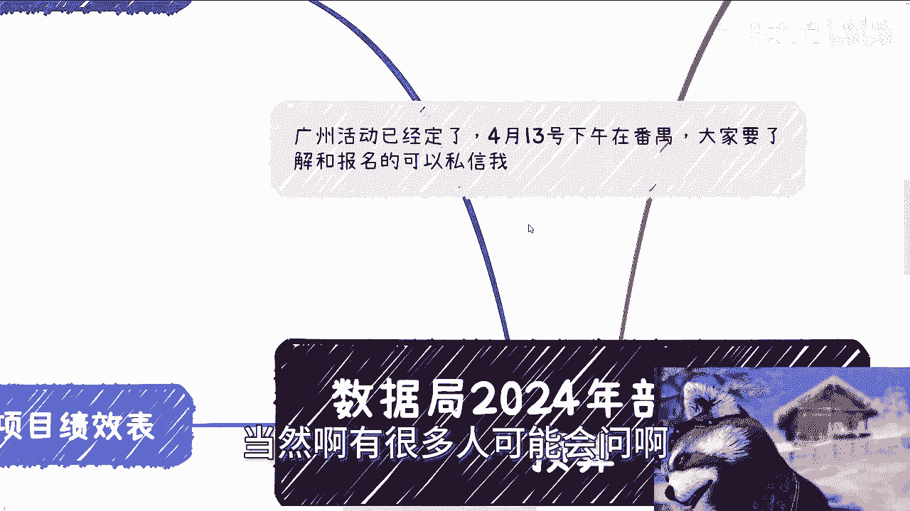
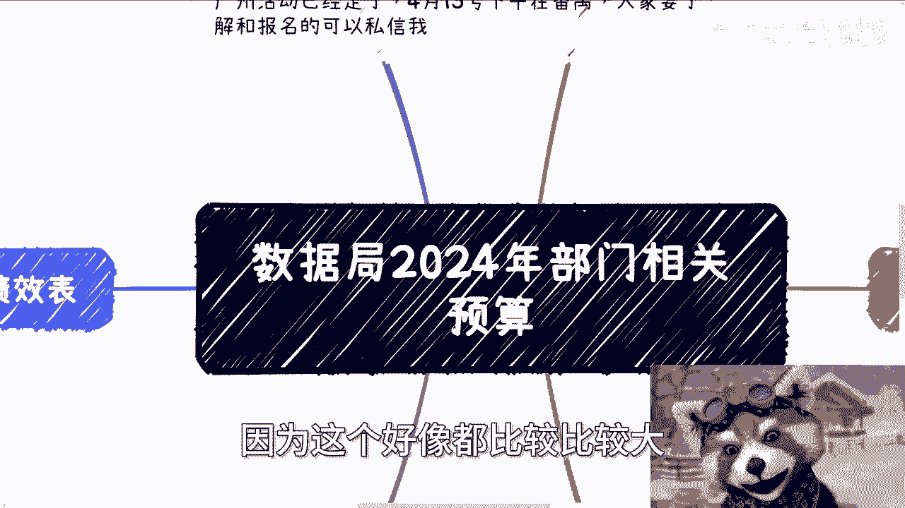

# 数据局2024年部门相关预算 - P1 - 赏味不足 - BV1Dt421n71N

哈喽大家好，我今天无意中翻到了这么一个东西啊。

我看了一下是3月26号发的啊，这个还是有参考性的。

我觉得大家看了之后是这样子的啊，就是唉反正我待会给你们解释好吧。

首先那个广州活动再说一下啊，已经定了4月13号下午在番禺好吧。

然后大家要了解或报名的，可以私信我啊，呃然后我们就直接来说。

今天这个内容有点多，等一下啊，综合司政策和规划师，数据资源思啊，数字经济师，数字科技和基础设施建设司啊，然后国家税局共有一个行政单位，就是本机关啊，本机关，那么我觉得这个东西呢。

首先是大家得要就我们就我一直说的嘛，就是说啊大家对一些东西得要有认知，那所谓认知哪里来，就是你们得要去看国家的一些东西对啊，你不要说哦，你不知道什么东西，然后内有五个机构，比如说我跟你说综合司对吧。

或者数据经济，数字经济师，或者我以前其实也有提到过，像文旅啊，或者其他的，就你们不要就你们听到这个东西，你得你得要从架构上明白，这到底是个什么样的东西，对比如说它的属性是什么东西啊。

就比如说他的上级是哪里，然后它的整个组织架构是怎么样子的，你不要到时候跟你说啊，我们综合思对吧，做个东西，然后你一听哎这什么玩意儿对吧，怎么样怎么样，那其实它是在数据集下面的，那其实还是很牛逼的对吧。

那么该文件呢是3月26号发，3月份发的啊，然后数据局2024年的年度部门预算呃，我们一个个来看啊，首先就是它有非常多的项目绩效表啊，项目绩效表，因为别的东西我就不说了，别的东西没啥好说的。

首先项目绩效表这里面啊，第一个是叫做立法规定与政策研究对吧，那么你们能看到啊，数据局，项目资金是800万啊，800万，那么它作用是什么，叫推进数据领域技术攻关论证。

那这个东西我也这个最近一直在跟大家说嘛，就是说整体的政策都在做数据合规，数据库表，数据入库，那么强化那个数据基础设施布局研究，推动数字经济人才培养和学科建设研究，拟定数据资源分类分级管理相关制度。

统筹推动数据资源开展利用研究，制定相关政策文件，在这里面其实你们也能看到，简单来讲，就是说OK我们先要做理论上的这个这个沉淀啊，然后要做人才培养，然后要做学学科建设啊，然后在这里面。

就是要推动整个数据资源的开发啊，然后研究同时要制定一些相关的政策文件，那就是说这个东西啊，你说年度总目标，我就这么跟你们讲，政府年度总目标呢写在这啊，那写在这呢并不代表他一定会完成啊。

呃同时呢你们看到这个目标，你们可能也会觉得这个东西比较笼统对吧，那也正常啊，正常就政府文件都这样子，但是整个方向我觉得已经给你们定的很清楚了，对啊，800万800万，那么我们来看啊，整体的产出指标啊。

就是刚刚那800万的产出指标，你看啊，指标数量调研对吧，大于等于十次，举办经验相关交流会，座谈会大于等于三次啊，然后制定战略相关规划，政策性文件一篇完成专题报告大于等于十啊，然后就是政策建议啊。

那么怎么样，那么从这九那个权重里面，最大的权重就是所谓的效益对吧，就是以以这个推动数据，科技跟金和基础设施更好发展为主啊，那个叫那个那个叫什么，就是效益指标啊，那么你会发现一个什么点啊。

就是呃调研次数就是你会看到啊，比如说产出第一个是什么，就是调研啊，举办这个相关的交流会啊，战略目标文件啊，政策建议啊，所以说就是说本质上啊，你会发现调研和这种各种会议他是最多的。

而且权重权重呢其实跟别的东西差不多啊，那么同时呢它的指标是大于等于大于等于，到底多少，咱不知道啊，但是它最小值已经写在这个地方对吧，那么接下来就看这800万怎么用啊，那么在这个地方呢。

我觉得要得要跟你们提一点啊，就是说呃这仅仅是数据集的预算，数据局什么方向，意味着各地方省市区的政府是什么方向，数据局会做哪些东西，你们也可以，基本上呃就是平推出来，就是其他的可能会有什么东西。

这也是为什么我一直跟你们讲的，就是说比如说啊这个咨询培训啊，对吧，咳咳活动会议啊对吧，包括那个国标啊对吧，包括人才培养啊，因为这个政府能做的也就是这些东西，他能做什么呢对吧，那你到最后。

你到最后无非就是一个那个项目落地，项目落地，这个是后的话吗，你现在从整个数据集，或者从整个那个数据合规数据入库角度来讲，是没有这么早的啊，那么那么第二个是什么叫，数据资源管理和开发利用啊。

那么800万对吧，那么这个800万呢，你看啊组织试点示范呃，政策建议，然后开展调研，举办座谈会，就举办座谈会，这里就多了，大于等于15次啊，那么同样的这个权重比较多的，还是在于整个社会效益指标啊。

这也没毛病啊，那么其他的东西我觉得啊大家就看过，拉倒了对吧，反正就是得要知道在在比如说那个啊，这我没说啊，他的这个年纪总目标叫做，有力推进国家的数据战略有关相关工作和任务。

制定数据资源分类及分级管理相关制度，推动数据资源开发利用，推动信息化资源跨行业部门互联互联互通，那你会看到其实整个这个逻辑很简单，就是说OK我们要制定规范，我们要把它划分类型，划分等级。

我们最终要把它整个数据要利用起来啊，当然在这里面到底怎么个利用对吧，怎么跟你说啊，有没有跟金融有关啊，这个东西都没说啊，也就是说其实本质上你们得要明白，就很多东西就是不说呢，说明他的这个操控空间很大。

那说了呢，还是那句话，你要放在现在这情况下面，谁说的清楚呢，对吧，他帮你写的很细，不可能的啊，那么第三点是什么呢，叫做那个数字经济发展，数字经济发展300万啊，300万，那么是什么呢，你看啊。

完成课题研究报告三篇啊，上报政务信息五篇，课题验收验收率百分之百啊，呃然后他的权重就比较比较一致啊，都比较一样，那主要是因为什么呢，主要是因为就是数字经济发展这边呢。

它的整个年度总目标呢叫做推动数字经济发展，梳理分析重大问题及提出有效的那个举措，建议形成对数字经济领域的决策支持，那这个东西因为都是一些理论和书面上的啊，基本上全程都是一样的，然后钱也不会特别多。

整个整个这个资金300万对吧，我觉得这也OK啊，然后第五个对第五个啊，第五个叫做数字科技跟基础设施建设200万啊，他的目标是通过开展数据基础建设等，数字科技跟数据设施领域示范啊。

带动数字科技跟基础设施产业生态培育，筹办全国数字科技跟基础设施建设工作会建呃，增加系统联动，提升干部业务水平对吧，那这个上面大家也能看得到嘛，就是这个东西就是说要弄一个示范啊，然后呢要做一些相关的培育。

然后最终呢就提升大家这个知识面啊，那么这个东西本身也也不会说涉及太多的东西，所以他基本上就200万这个预算，那么你会看到是什么呢，举办相关经验交流会，研究会论坛大于等于三次啊，然后啊其实也没什么啊。

其实也没什么，所以说就是不会有太大的这个叫什么预算啊，嗯我正好把这个东西发给那个谁看一眼，哎呀真的最近这种哎呀不是不是最近这种，怎么说呢，这种文件啊相关的其实很多的，大家也要多看看啊。

然后发给我们一个合伙合伙人，合伙伴合作伙伴，然后第六个呢就是那个叫做数据综合工作支撑，这个就多了2300万啊，2300万数据综合工作支撑，我们来看一下啊，嗯诶这个数据工作支撑没有那个的，没有明细的。

等一下我看一眼啊，额数据啊，有的有的说我没截啊啊啊算了，我截过来吧，给你们看一下，看一下我我怎么刚刚截的时候漏掉了，增加在这里吧，好好我们来看一下啊，它是保障机关高效运作，积极宣传数据工作规划。

开展财务管理，提升后勤保障水平，组织好重大会议的这个呃和活动，然后监测评估数据数字，中国的那个建设成效，那这个里面呢我觉得因为它涉及到一些，肯定是涉及到落地的，否则的话他不可能说啊，保障你。

你通过理论去保障高效运转对吧，然后怎么样怎么样，这个很难的，所以他那个费用还是比较高的，2300万啊，那我们来看一下啊，他这个里面指标也很简单嘛，就是说他有这个系统质量对吧。

他就是说系统应收合格率一次啊，然后就说网站可用率大于99%是吧，然后权重最多的呢，还是这个社会化效益啊等等等，那这个东西就是说他不可能就像我刚刚说的，他不可能分的很细，他就告诉你。

就说我们需要有这么个东西，至于怎么分，大家至于这个任务怎么去划分，大家根据这么一个绩效表可以再往下细分啊，然后我看看啊。

没了没了，到这就全部结束了啊，到这就全部结束了，然后我们来我们能看到啊，我给你们看一眼啊，嗯在哪里呀，啊总支出啊，总表我们来看一下啊，嗯我这个图能不能截的全一点，哎可以可以这样可以嗯好我给你们看一眼啊。

整个数据集放哪放这吧，自由出去诶，这样啊我们可以来看一下啊，就是一般公共预算拨款收入，和一般公共服务支出对吧，呃我们能看到就是最终的数额是1万03，1万354万，1万354万。

应该就是我看看9000多一个亿呃，1亿1亿354万啊，因为他单位单位是万嘛，对吧嗯，嗯整个数据集啊就是年度的，然后它下面其实会有很多就是细分，这个我就不再列出来了，好吧啊，我就不再列出来了。

所以说就是大家可以通过什么呢，通过他的各项这个项目绩效表可以去看一下，就大概啊，再比如说每一个项目上面，比如说立法啦对吧，比如说数据资源啊，啊比如说这个数据经济发展啊，啊比如说数据科技基础建设啊。

包括数据综合工工作建设啊，大家可以去参考一下。

然后也可以去了解一下，各地方省市区的一个发展，因为一样的吧，就上面怎么做，下面怎么做对吧，那总归是有一定的方向性，当然啊有很多人可能会问啊。

就是说啊因为这个好像都比较比较大。

或者比较宏观，我跟你们讲啊，政府做生意就是这样子的啊，你你要指望他能给你一些细的东西，这就是你的叫什么，就是学生思维啊和叫什么，就我们说的这个这个电池思维哦，你指望他做，或者你指望他给你目标。

那么问题来了，他给你，他为什么要给你目标，他他给了目标，为什么你来做，其实都是这样子的，所以说我们要做的是什么呢，我们要做的是看清楚整个大方向，然后我们根据就是自己的已有资源，或者我们朋友已有资源。

看看有哪些东西能够往里面去，就是套的对吧啊，行好好好，那就这么着，大家反正详细的文件你们网上都搜得到好吧，你就不要从我这边拿，OK然后剩下的好吧，其他的就是说数据数据相关的，或者数字经济相关的。

或者说这个呃职业规划，商业规划对吧，包括其他的各个方面啊，你们觉得有需求的，你们可以整理好问题。

