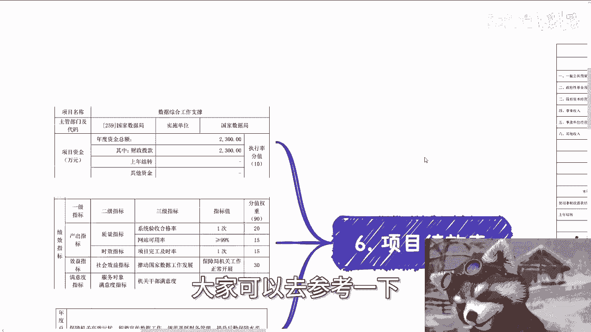
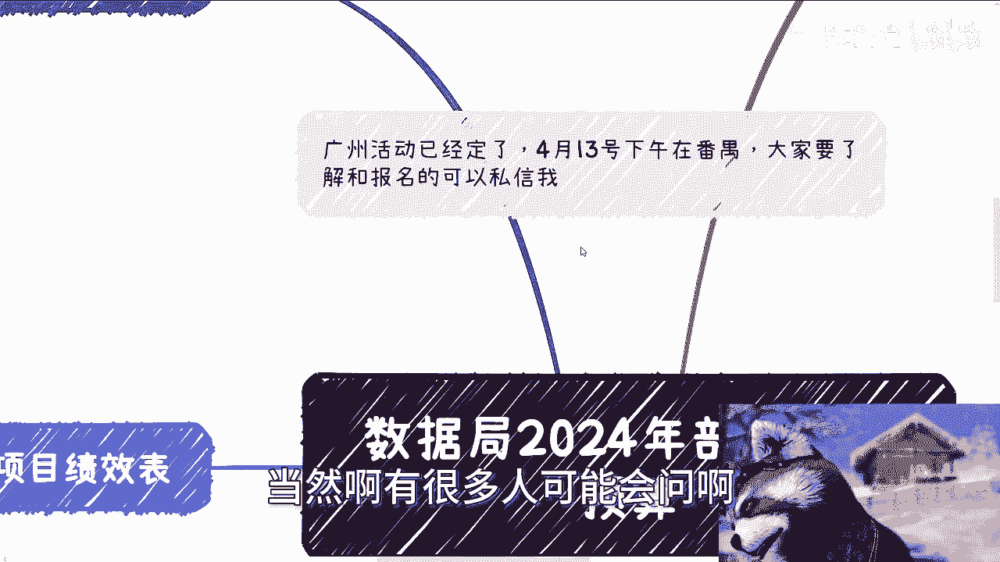

# 数据局2024年部门相关预算---P1---赏味不足---BV1Dt421n71N

在本节课中，我们将要学习如何解读一份重要的政府文件——《国家数据局2024年部门预算》。我们将通过分析这份预算文件，了解国家在数据领域的重点工作方向、资金分配逻辑以及其中蕴含的商业与职业机会。这对于理解国家政策导向和规划个人发展至关重要。

## 概述与文件背景

首先，我们来了解一下这份文件的背景。该文件由国家数据局于2024年3月26日发布，是一份年度部门预算公开文件。这类文件具有很高的参考价值，能帮助我们理解政府机构在新财年的工作重点和资源配置。

上一节我们介绍了文件的背景，本节中我们来看看数据局的组织架构，以便更好地理解其职能。

## 数据局的组织架构认知

理解一个机构的组织架构是认知其职能的第一步。国家数据局下设多个司局，每个司局负责不同的专业领域。

以下是数据局的主要内设机构：
*   **综合司**：负责统筹协调。
*   **政策和规划司**：负责政策研究与制定。
*   **数据资源司**：负责数据资源的管理与开发利用。
*   **数字经济司**：负责数字经济发展相关事务。
*   **数字科技和基础设施建设司**：负责技术攻关与基础设施建设。

我们需要从架构上明白每个司局的属性和上级关系。例如，当提到“综合司”时，应知道它是数据局下属的统筹协调部门。了解这些架构信息，有助于我们在听到相关概念时，能快速定位其背景和重要性。

## 核心项目绩效与预算分析

预算文件的核心部分是“项目绩效表”，它详细说明了各个项目的资金、目标和考核指标。这直接反映了政府的工作重点。我们接下来逐一分析几个关键项目。

### 1. 立法规定与政策研究项目

该项目预算为**800万元**。其年度总目标是推进数据领域顶层设计，包括技术攻关论证、数据基础设施布局研究、数字经济人才培养和学科建设，以及拟定数据资源分类分级管理制度等。

以下是该项目的核心产出指标：
*   **调研次数**：`>= 10次`
*   **举办交流会/座谈会**：`>= 3次`
*   **制定战略规划/政策文件**：`1篇`
*   **完成专题报告**：`>= 10篇`

在各项指标的权重中，“社会效益指标”（即推动数据科技和基础设施更好发展）的权重最大。这表明，政府更看重这些理论研究工作所能带来的长期和广泛影响，而不仅仅是完成了多少次会议或报告。

### 2. 数据资源管理和开发利用项目

该项目预算同样为**800万元**。其目标是制定数据资源管理制度，推动数据开发利用，并促进跨部门信息互通。

该项目的指标特点是“举办座谈会”的次数要求较高（`>= 15次`）。这再次印证了当前阶段，政府工作的重要方式之一是**通过大量的调研和会议来凝聚共识、探索路径**。预算文件中的描述往往比较宏观（例如“推动数据资源开发利用”），这恰恰为后续的具体操作留下了灵活空间。

### 3. 数字经济发展项目

该项目预算为**300万元**，相对较少。其目标主要是进行理论研究，为决策提供支持，例如完成课题研究报告、上报政务信息等。

由于工作内容以书面研究为主，不涉及大规模落地实施，因此其各项指标的权重分布比较均匀，预算金额也相应较低。

### 4. 数字科技和基础设施建设

该项目预算为**200万元**。目标是通过开展示范项目，带动相关产业生态培育，并举办工作会议以提升干部业务水平。

其核心产出包括举办相关论坛、研究会（`>= 3次`）。作为示范和培育性质的项目，其预算规模也体现了这一点。

### 5. 数据综合工作支撑项目

这是预算最高的项目，达到**2300万元**。其目标是保障机关日常高效运转，包括财务管理、后勤保障、组织重大会议活动，以及监测评估“数字中国”建设成效。

由于涉及实际运营和落地支撑工作，其费用较高。指标也更具体，例如要求“网站可用率大于99%”。这说明了维持一个机构基础运行所需的成本。

## 预算总额与方向总结

根据预算总表，国家数据局2024年度的一般公共预算拨款支出总额为 **10,354万元**（约1.035亿元）。

通过分析各项预算，我们可以总结出当前阶段数据局工作的几个核心方向：
1.  **理论先行与规则制定**：大量资金用于立法、政策研究、标准制定（分类分级）。
2.  **调研与共识构建**：频繁的调研、座谈会、交流会是主要工作形式。
3.  **人才培养与生态培育**：强调学科建设、干部培训、产业生态示范。
4.  **基础支撑与运营保障**：确保机构自身有效运行是投入最大的部分。

## 对个人与企业的启示

理解上级部门的预算方向，可以推演出地方各级政府可能跟进的重点。这对于我们的职业规划和商业判断很有帮助。

以下是我们可以关注的几个机会领域：
*   **咨询与培训**：政策解读、标准咨询、数据合规培训。
*   **会议与活动服务**：承办或协办各类研讨会、论坛、调研活动。
*   **标准与认证服务**：参与或提供与数据分类分级、数据管理相关的国标、团标服务。
*   **人才培养**：开发与数字经济、数据管理相关的课程或人才输送服务。

需要明确的是，政府预算描述通常较为宏观，不会给出非常具体的执行细节。这要求我们不能有“等靠要”的思维，指望政府给出明确指令。正确的做法是：**看清大方向，然后结合自身资源和能力，主动寻找可以对接和融入的环节。**

## 总结

本节课中我们一起学习了如何解读《数据局2024年部门预算》。我们从组织架构入手，详细分析了核心项目的资金分配、绩效目标及其指标，并总结了“理论先行、调研为主、培育生态、保障运行”的当前工作特点。最后，我们探讨了这些信息对个人和企业意味着哪些潜在的机会。记住，关键是从宏观文件中把握方向，并主动将自身发展与之结合。

> 注：本教程基于公开的预算文件进行解读分析，详细原文可通过官方渠道查询。