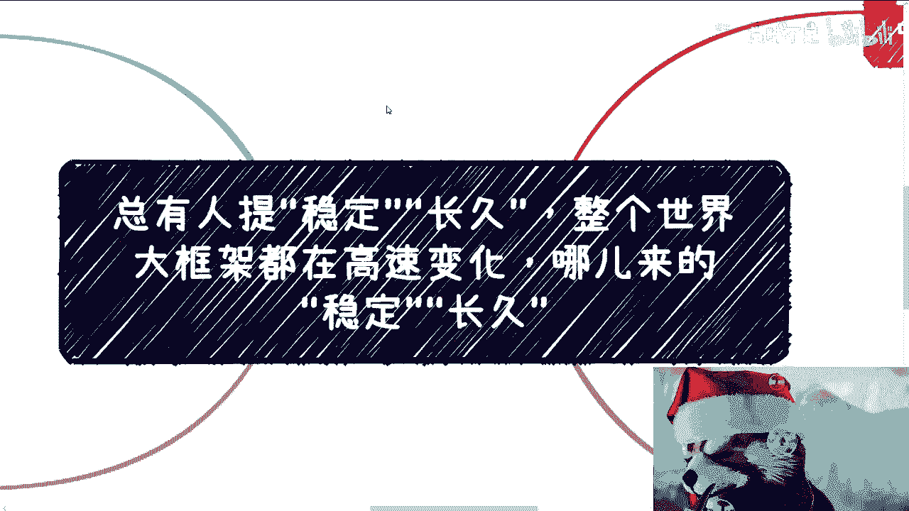
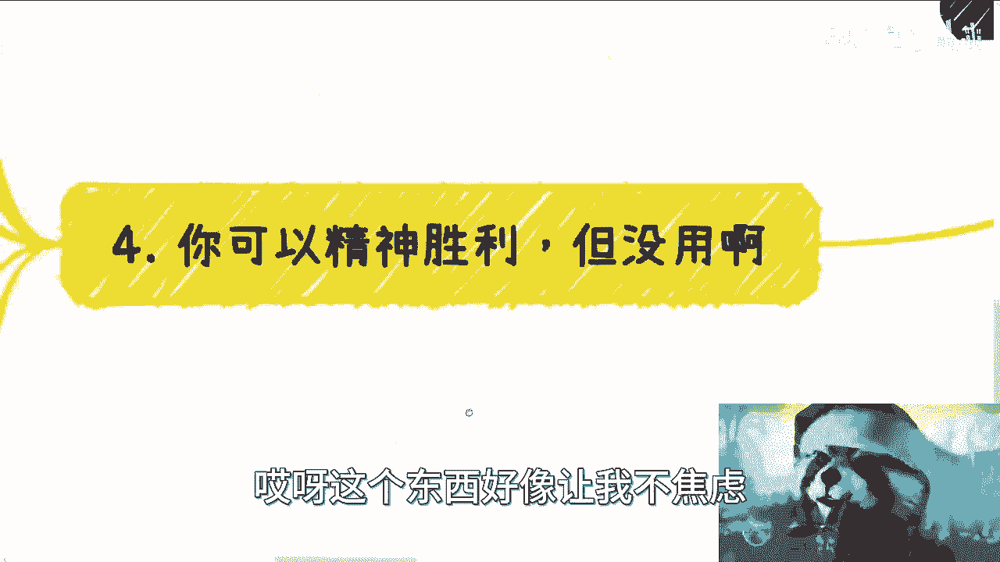
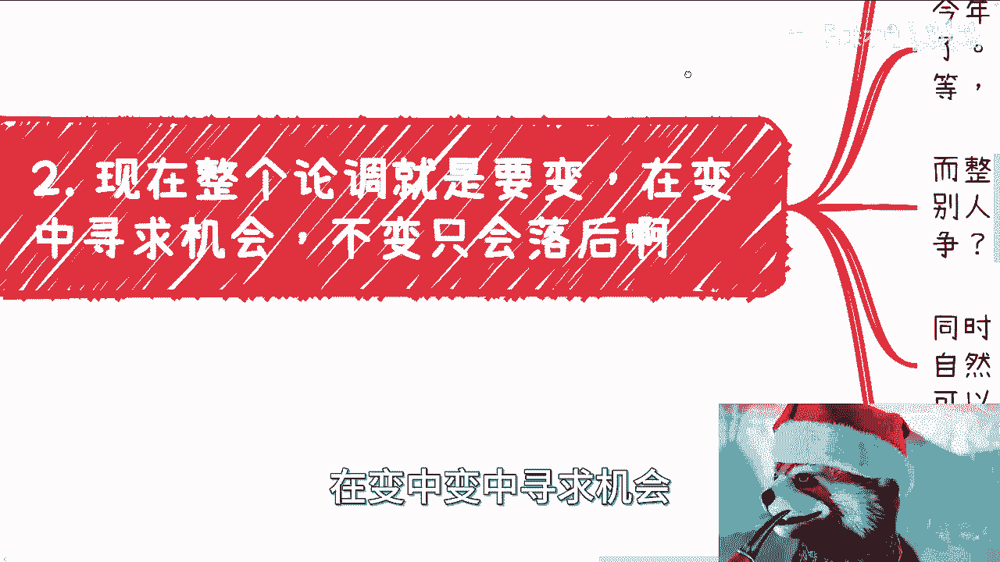
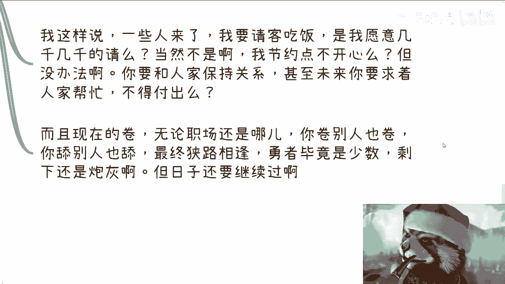
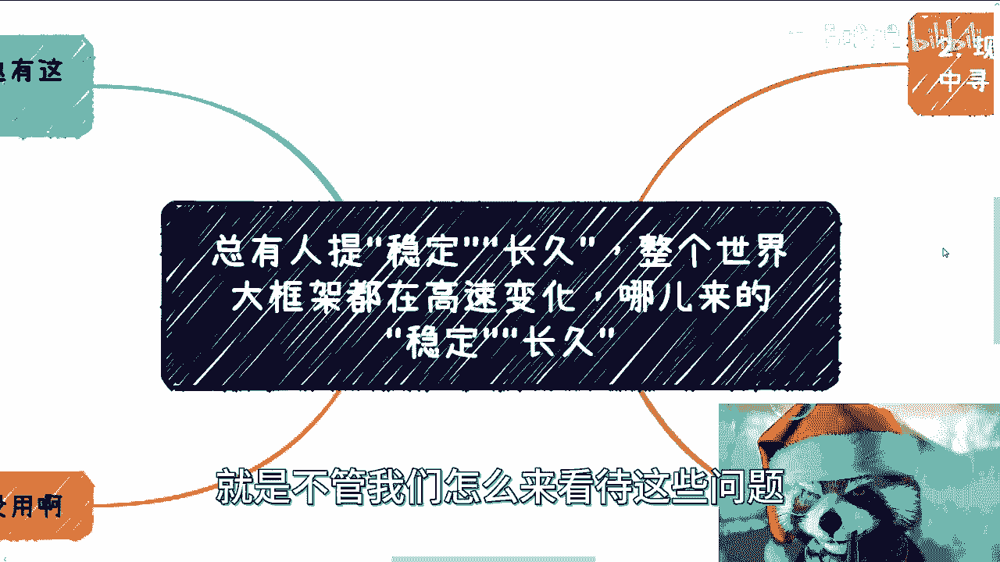

# 课程 P1：在高速变化的世界中寻找方向 🌍

在本节课中，我们将探讨一个普遍存在的困惑：在当今快速变化的世界里，是否还存在“稳定”和“长久”的工作。我们将分析个人期望与现实环境之间的差距，并讨论作为个体应如何调整心态与策略。

## 核心问题：对“稳定长久”的误解

上一节我们介绍了课程主题，本节中我们来看看问题的核心。许多人，尤其是自认处于社会底层或普通阶层的人，常常提出一个核心诉求：他们不要求高薪或高位，只希望获得一份稳定、长久、有收入的工作。

然而，这种诉求建立在一个错误的认知之上。个人相对于社会、国家乃至全球而言，都是非常渺小的个体。当我们观察国际形势、国家政策以及各行各业的动态时，会发现整个大环境都在高速变化。

**公式：个人期望 ≠ 现实环境**

在这种高速变化的背景下，追求绝对的“稳定”和“长久”本身就是一种奢望，甚至是不切实际的妄想。

## 现实剖析：为何“稳定”是奢望

理解了问题的核心后，我们来深入剖析现实。许多人认为“要求不高”，只求稳定工作，但这恰恰是要求极高的。因为“稳定”在当今世界对任何人而言都是一种奢望。

以下是全球范围内的普遍现象：
*   从美国、加拿大、英国到日本、荷兰、新西兰，没有任何一个国家能提供绝对的职业稳定。
*   即便是公务员或领导岗位，也存在轮岗、调整和不确定性。
*   整个社会的发展基调就是“变化”，在变化中寻求机会。不变则意味着落后。

这种变化并非个人意愿所能左右。个体可能受限于企业，企业受限于行业，行业受限于政策，而政策又受限于全球格局。每个层级都有其无法控制的限制因素。

## 应对心态：摒弃无效的自我安慰

认识到现实的残酷后，我们需要建立正确的应对心态。网络上充斥着各种“精神隔绝世界”、“拒绝焦虑”的言论，但这是一种无效的自我安慰。

焦虑与否，本质上无法改变两个关键事实：
1.  **无法改变个人处境**：无论你是否焦虑，如果你不采取行动提升自己，你在现实世界中的处境就不会改变。社会遵循“不进则退”的法则。
2.  **无法改变外部环境**：个人的内心平静无法让外部世界停止变化，也无法解决实际问题，如竞争、收入、发展等。

短暂的放松、嫉妒或自我感动，对于想获得尊严、想要向前发展的人来说，没有长期价值。随着年龄增长和压力增大，这些自我安慰会被证明毫无用处。

## 行动指南：在变化中主动求变

既然逃避和安慰无效，那么我们应该采取什么行动呢？核心在于：**在变化中主动求变，不断提升自身竞争力。**

我们身处的环境竞争异常激烈。无论是企业还是个人，都会发现：
*   你能做的，别人也能做。
*   你不敢做的，也有大量人敢做。
*   各个领域的预算都在缩减，曾经的“好业务”可能如今颗粒无收。

这种环境迫使每个人必须“卷”。这里的“卷”指的是，大家为了生存和发展，都在没有底线地竞争和付出。无论是职场还是社交，你“卷”别人也“卷”，最终往往是底线更低、更勇猛的人胜出。

但我们必须清醒地认识到，能“胜出”的永远是极少数。其背后是无数成为“炮灰”的个体。然而，这些“炮灰”同样有家庭和生活，日子仍需继续。

**重要比例：** 成功案例往往是“二八定律”中“二”的部分，甚至是“百分之二”的极少数。媒体展示的通常是个例中的个例，如同中彩票的概率，与大多数人无关。

## 个人策略：建立大局观与自主判断

最后，我们来探讨作为个体应有的策略。所有外界信息都只能作为参考，最终的判断必须依靠自己。而做出正确判断的前提是：**尽可能向外看，打破信息茧房（象牙塔）。**

如果你只封闭在自己的小世界里，就会陷入“公说公有理，婆说婆有理”的困境，被不同观点裹挟，无所适从。

具体到“稳定长久”的诉求，可以这样思考：即便有人告诉你某个行业非常稳定，鼓励你进入，但几年后结果的好坏，承担者是你自己，而非建议者。

因此，我们的策略应该是：
1.  **向外看**：主动了解企业、行业、政策乃至全球的变化趋势。
2.  **向内求**：关注自身成长，提升不可替代的技能和价值。
3.  **做判断**：基于更广阔的信息，为自己的人生做出负责任的决策。

---

**本节课总结：**
我们一起学习了在高速变化时代对“稳定”的重新认识。我们剖析了“稳定”是奢望的现实根源，批判了逃避焦虑的无效心态，并强调了在激烈竞争中主动求变的必要性。最终，我们得出结论：个人必须建立大局观，打破信息茧房，依据更全面的信息进行自主判断，并为自己的选择承担责任。世界的基调是变化，我们的对策应是适应与成长。