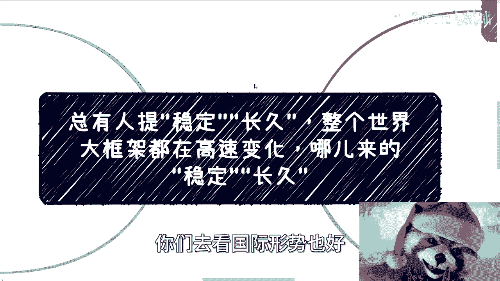
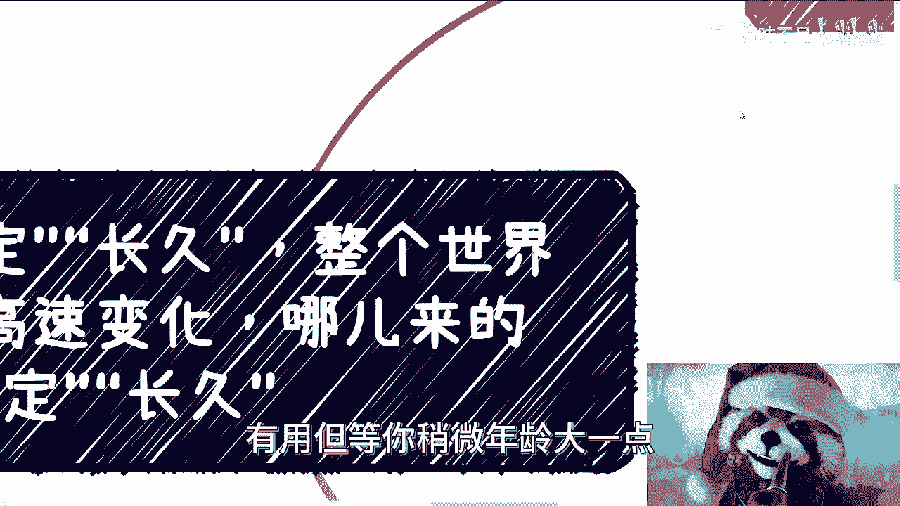
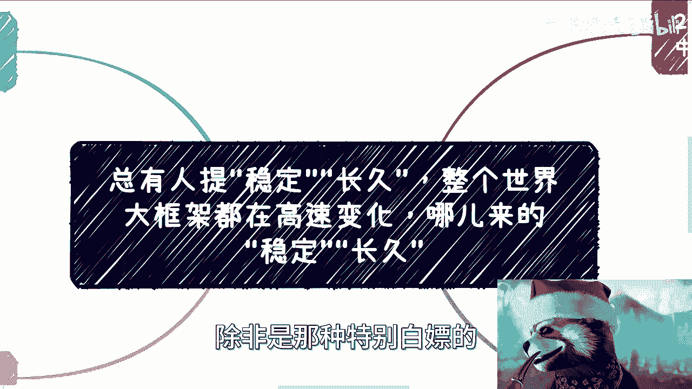

# 整个世界大框架都在高速变化，哪儿来的”稳定“和”长久“的活儿 - P1 - 赏味不足 - BV1sN4y1m7Mn

啊大家好啊，今天礼拜礼拜几，礼拜二，礼拜三礼拜三啊。

嗯嗯这个问题啊，我真的忍无可忍了，就是总会每隔一段时间，总有人在评论区私信等各个地方会跟我提，他说呃，就就他们的核心意思是什么，就是我现在是个很底层的人，我现在是个很普通的人，然后呢我没有什么要求啊。

我就是说需要一个稳定长久的东西，但是你要明白一点，我们相对社会相对全球相对国家，我们都是个体，我们都是非常渺小的，对吧好，那整个大环境你们去看国际型实业号。

包括这个国家的各个变化也好，它都在高速的变化，你对我们来讲哪来的稳定啊对吧，哪来的成就啊，就没有意义啊，就是我们不要去妄想一些不太可能的事情。

对吧啊，那我一个个来说啊，你看啊，但是我要求不高啊，我就要一个稳定的长久的工作，有收入的工作，我跟你讲，这已经是要求很高的了，谁不想啊啊谁不想啊，我也想啊，对吧啊，很多时候我跟你讲啊。

信息差这个东西是这样子的，你别看很多人是老百姓，很多人是底层，没毛病，但其实他并不接老百姓的地气啊，你知道吗，就是很多时候我觉得那句话是对的，就是可怜之人必有可恨之处啊，什么意思啊。

就是你是觉得就是比如说啊你你你他问我，比如说我是不是老百姓，我说是啊，但我告诉你不接地气啊，为什么，因为你不知道整个大环境什么样子啊，你老是提出一些非常就是逆势而为的对吧，甚至不可能的。

完全就不现实的想法啊，然后当我告诉你事实，事实或者整个大环境的时候，你看他他还要去反驳你，哎就说啊你在PUA我吧，怎么样怎么样对吧，你要明白，发展到今天，整个全球都在不停的变，你随便去找找免美国。

加拿大，英国日本，哪怕荷兰对吧，新西兰，你往后你要稳定长久，这对谁都是奢望啊，你明白吗，哎你现在上面做个做个叫什么公务员，也不是公务员吗，你做个领导，你35年还得换岗呢啊你谁不想稳定啊，对啊，我跟你讲。

没有人想折腾，大家都不想折腾对吧，哎我这边写错了对吧，不对吧，但是你主要是不折腾，没有办法吧，你不折腾早晚要淘汰，而且现在淘汰年龄越来越早是吗啊，那么你包括就是说啊，然后呢淘汰之后怎么办呢。

我们去报培训班吗，被收割吗对吧，就我们作为一个个体，我们要往外面看，就像我以前说过的，我们都在一个象牙塔里面，你外面可能还套着二三十层的象牙塔，你要尽可能往外开，你会发现企业行业大环境甚至政策。

我们身不由己，我们可能是受限于企业，企业身不由己，可能是受限于整个行业，行业身不由己，可能受限于政策，政策身不由己，可能是因为国家受制于全球，对不对，你每个东西都有都有它限制的东西啊。

谁不就是谁不想这个躺平了，谁想折腾啊，这不是没办法吗，对不对啊，那我们在先先说我，我觉得我们先说这个啊，呃我跟你讲没有用，为什么，因为有很多人就要说了对吧，就每次我说这个东西总有人会说啊。

你在贩卖焦虑好，我就告诉你们，我发现很多短视频，说精神要自我要隔绝世界，我们不要焦虑，但问题是你，你用你的这个读过大学的高高材生的脑子，思考一下，你焦不焦虑有用吗，没有用的呀，就像我最早的视频。

我就告诉你们，我卖不卖焦虑，社会卖不卖焦虑没有用啊，你明白吧，因为我们每个人只要关注自己的成长，你管外面的对吧，但是问题是你会发现一方面你焦虑或不焦虑，你改变自己，为啥不改变，你从事实来讲。

你活在这个世界上面，你就没改变啊，你能提升自己吗，还是让别人看重你呢，没有呀，对不对，你你可以听他一顿忽悠，看似很有道理，但是我们活在现实生活当中，你有改变吗，没有还是原地踏步，不进则退对吧。

另外一方面你焦虑或不焦虑，更不会去改变大环境，你搞得好像比如说我们听完一段东西啊，卧槽我牛逼对吧，我我每天我每天那个冥想对吧，或者怎么样啊，我觉得我内心特别的平静又又怎么样呢，就是外面世界停止了吗。

然后你可以称霸了吗，你可以解决你的问题了吗，没有呀，对不啦，就是这就好像我跟很多人说什么，就是你可以偶尔放松放松，你可以偶尔去嫉妒别人，你也可以偶尔的去背歌或者去割别人对吧。

但是但凡你想做一个有一定尊严的人啊，我的定位很清楚人啊，那么你就必须朝前走，你必须强大自己，在这个世界跟框架下面，你是没有办法的啊，不要去想着说哎呀，这个东西好像弄得我很焦虑。

哎呀这个东西好像让我不焦虑。

没有用的，就这些都是自我安慰，就自我感动你，你你也许年轻，你觉得这有用有用，但等你稍微年龄大一点。

你面临的压力大了，你就会发现这些都是BULSHIT啊，那么我们来说啊，现在整个基调基调就是要变的，在变中变中寻求机会。

不变的话，它就落后，你看啊，我不知道大家有没有感知，但是你越关注外面的象牙塔，你感觉就会越大，你比如说你做个企业，你就会发现你每天都在水深火热当中，为什么，因为你不知道从哪去赚钱了啊，我可以告诉你们。

今年1月份开始，就2023年1月份开始，很多小微企业，尤其是这种那个创始人，他们感觉很明显的，你们去问好了，曾经的所谓行业里的汤跟渣渣，都已经很难吃到了啊，企业家每个月要面临发工资交税，各种房租。

各种水电煤各种的压力对吧，你回啊，包括那个那个那个乙方，就是那个呃客户，他的回款还卖对吧，而整个大方向上面呢竞争太激烈，说白了我不管你们在公司里面还是在公司外面，我不管你们做什么。

你会发现你能做的别人也能做，你不敢做的，太多人也敢做，怎么竞争对吧啊，那包括同样各个线上的预算，相比之前大幅度缩减，你们去看吧，文旅教育金融农业医疗，但各个领域都是缩减的，自然曾经觉得那些可以做的。

比如说2022年，2021年甚至2020年19年能做的业务，有钱的业务今年可以说颗粒无收，那当然可能颗粒无数夸张了一点啊，我问下来，可能比如说今年到年底，对整个的量，包括整个的一些收入。

可能还不如去年的1/2对吧，或者还不如前两年的1/2，所以说很多时候他被迫在变啊，你说你作为一个打工人，你想不变，想长久想稳定，那我他妈告诉你，你领导你老板还他妈想一直白嫖你呢，谁不想啊。

对吧就是就是还是那句话，就是说我们现在外面的杂音太多，但是我们作为一个活在这个社会的这个人，这个实体的人，一个生物对吧，一个活在人类社会的下面，一个一个一个物种，很多吃的东西没有用的，没有什么用啊。

啊那么包括我跟呃一些咨询的人聊下来，他也会说他说那大环境跟我有什么关系呢，啊我也没这么高的格局对吧，那跟我屁事对吧，好你看啊，我跟你讲，你要说没关系，你好好种田，与世隔绝，我觉得是没关系啊。

但是但凡你有俗世缠缠身对吧，你你物价医疗教教孩子，教育买房父母赡养你这些东西都是连锁反应啊，你怎么可能没关系，怎么可能脱得了关系呢，对吧，我我什么意思，我意思就是说，你不是要在里面共付出一份贡献啊。

你哪怕是在里面做一个炮灰，作为一个韭菜，你也是有关系的，你愿意吗，不愿意呀，谁愿意呀对吧，你就如我上面说的，谁不想苟着，谁不想舒服过每一天，谁愿意去操这个心啊，没有办法吗，对你每个层级现在都很卷。

只不过卷的程度不一样，我就这样说好了对吧，我就实事求是，咱客观点来说，你说有些人来了到上海来，我请客吃饭，你说是我愿意几千几千几万几万去请吗，那不是啊啊我节约点，我不开心吗，那么节哦，你钱天上刮来的。

但是你没有办法啊，你要跟人家保持关系啊，甚至你未来要求着别人帮忙，不得不付出啊，对不对，那有人就要说了，那你可以请便宜一点的，那我就问题来了嘛，什么叫卷啊，卷就是大家没有底线的去搞啊。

那那那我知道他平时的整个的一个，一个请客的label，可能是这个label哦，我跑过去来，人家两千两千，我200，你怎么弄啊对吧，就是我们很多时候我们身不由己，那没有办法啊，而且现在卷的是什么呢。

就无论职场还是哪里，你卷别人也卷，你舔别人也舔，最终狭路相逢，勇者胜对吧好，那你跟我说，勇者胜了，底线低的胜对吧，但是你要明白最终胜的毕竟是少数啊，你背后还是无数的尸体，无数的炮灰啊对吧。

但是你要明白那些尸体，那些炮灰，那些所谓的没有冲出来的人，人家也有家庭，也有生活，日子还要继续过，甚至还很年轻。

对吧，就是就是我们啊看问题的时候一定要有大局观，就是不管我们怎么来看待这些问题。

我们都要明白他是一个我们称之为八二原则，但是事实当中可能九十八百%分之二的增，这种比例嘛对吧，就是你始终要明白，无论是媒体还是说是短视频，还是哪里所拿出来的案例，他一定是个例中的个例。

一定是就是那种中500万的那种那种概率，那跟我们没有关系对吧，但是我们无论是说哎跟着别人起哄也好，还是说是是是是跟随啊，还是说怎么样也好，我们最终活在这个世界啊，无论日子过得好还是过得不好。

都只有你自己的是吧，你就像你就像我们回到这个主题，你说很多人跟我提稳定长久也可以啊，我不我可以不跟你们讲这些，我就跟你们讲，卧槽现在很稳定的，你就去做那AA行业，B行业非常稳定啊，然后你就去怎么样。

我相信你们也会相信我的，对不对，但是问题是你过了两三年，过了35年，过了10年，那最终这个叫什么，最终这个结果啊，你甭管它是好的果子还是坏的果子，那还不是你们吃吗，又不是我吃。

啊所以就是说我觉得吧就是说嗯一样的，就是所有外界的信息呢，你们都可以拿来参考，但是最终判断得靠你们自己，但是这个判断前提就是说，你们得要尽可能往外看象牙塔对吧，你你你否则怎么弄呢，你否则就是婆说婆有理。

公说公有理，今天你看到的视频哦，这样子明天看到个视频哦，那样子，怎么办怎么办，你说怎么办呢，我也不知道怎么办对吧，哎行吧啊就这样吧，嗯我我也是忍无可忍的说一下啊，嗯行吧，反正大家自己有什么问题。

你们就整理好，我们在做咨询呃，走不走都可以好吧，你们我早就说过了，你们有任何问题私信了，我也都会回来啊，除非是那种特别白嫖的。

