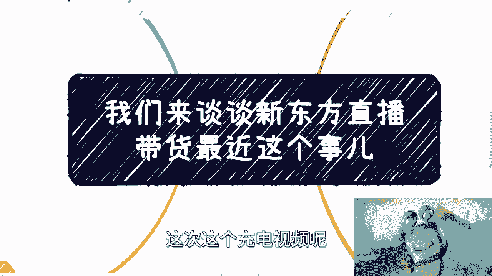
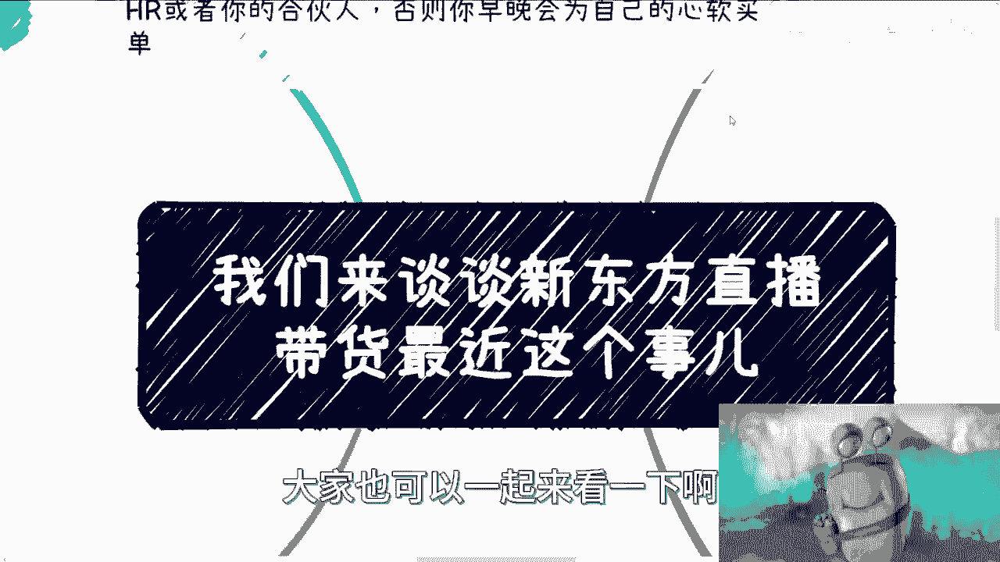
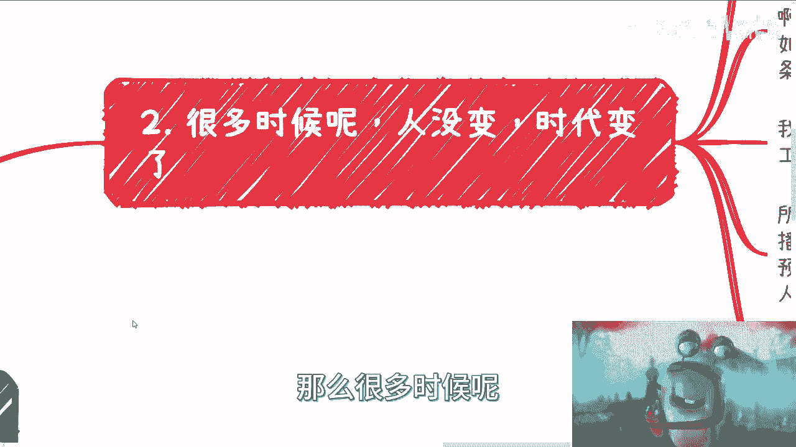
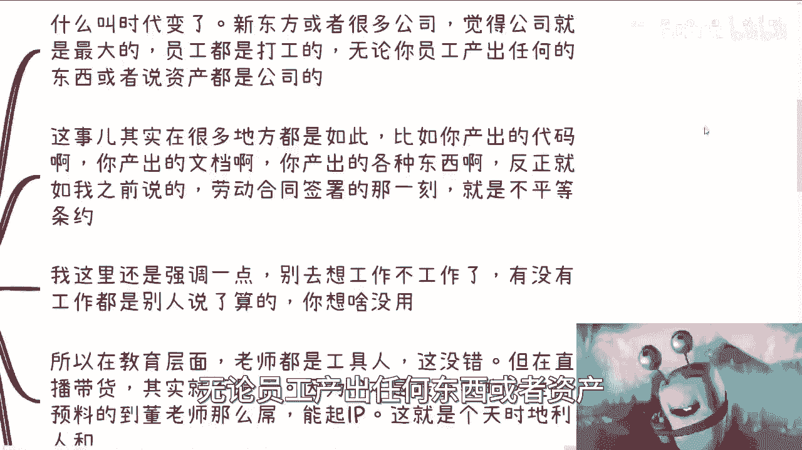
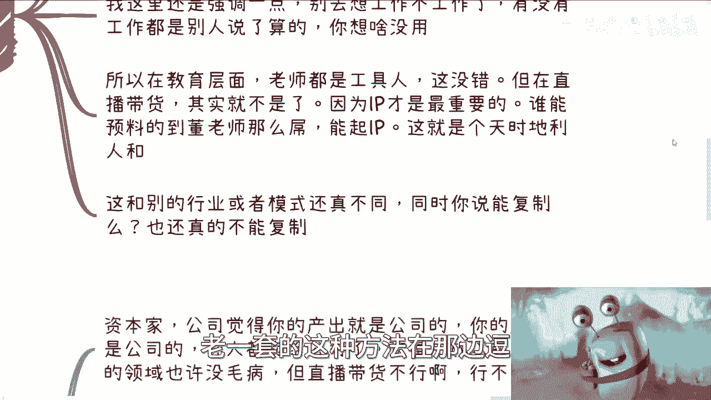
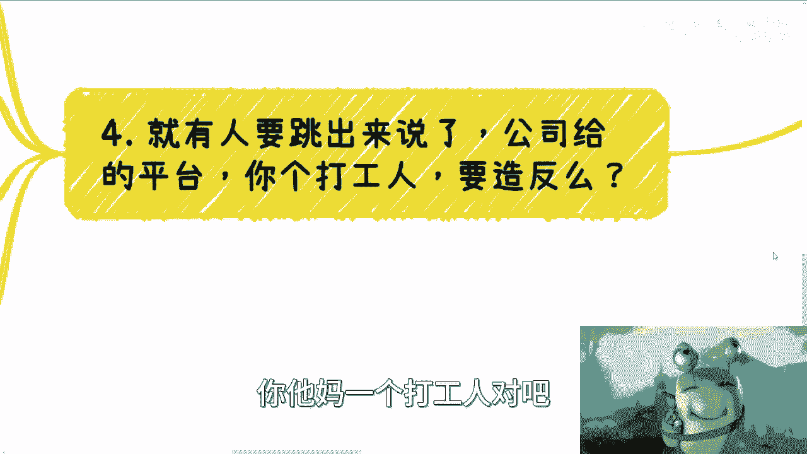
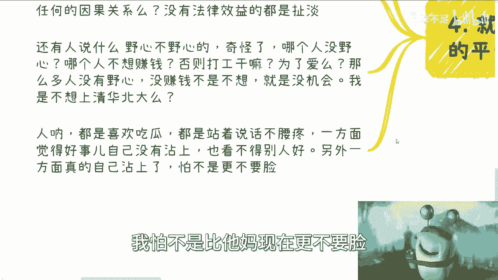

# 新东方直播带货这事儿的核心矛盾 - P1 - 赏味不足 - BV1N94y1A7zi

大家好，这次这个充电视频呢。

我想来聊一下这个新东方直播带货这个事儿。

嗯还是那句话啊，我从来不去判断什么对跟不对啊，因为商业上没有什么对跟不对的事情啊，我主要是来跟大家说一下，我可能是怎么想的啊，包括就是说大家也可以一起来看一下啊。

就是比如说哎你们怎么想的，我怎么想的，大家这个想法当中有什么区别啊，首先呢我们先从宏观角度来讲啊，如果你是个打工人，你企图去赚公司的钱，那么那一刻呢你必须转变身份啊，不是说你不能赚公司的钱，你可以赚啊。

但是你不能以一个打工人的身份证啊，否则必然有冲突，同样的，如果你是个资本家，你也别企图去为员工着想，或者从他们的角度出发，这个事儿你可以交给别人，但是你不用去想为什么，因为你但凡去想了。

你早晚会为自己的新闻买单，没办法的，这个就是市场，这就是社会，这不是说你我一个人啊，个个别的人说啊，我们要我们要坚持我们的原则对吧，怎么样，不好意思，没有用，对吧。

那么首先啊你看网络上各种视频现在满天飞啊。

本质上我觉得很简单啊，你说是不是董老师野心太大啊，内部有矛盾啊，这个我们不得而知，因为什么呢，我们只能看到网络上的事情对吧，你说CEO格局很小啊，嫉妒我们董老师啊，我也不知道啊，因为这也是网络上对吧。

你说俞敏洪什么都不知道啊，或者来说玩平衡之术啊，还有的说什么一个唱红脸，一个唱黑脸啊，还是那句话，我们依然不知道啊，因为一切只不过是网络上的，那我们知道什么呢，我们知道的是，是打不破的啊。

而且是对立面啊。

因为这个不是我们决定的，这个就是整个环境，整个世界整个生态来决定的啊，包括我还看了非常多网上的各种信息啊，就是说什么哎呀他是这个说这个小董啊，以前这个说话对吧，这个嗯怎么样怎么样啊。

然后什么我看到他们说什么支持罗翔啊，然后又说什么罗翔支持什么，什么叫这叫什么宗教对吧，哎呀我的妈的扯得老远老远了，你知道吗，就就跟那种那个警察办案是一样的，跟你扯整个网络的这个人物关系图啊。

我跟你讲红无敌啊，各种证据啊，各种怎么样啊，本质上就是为了让大家站队啊，啊你觉得你是站青龙帮还是站小董啊，还是站老余啊，还站罗翔，反正把他们各种的人拉进来，对吧好，那我就问啊，你们有没有想过一个问题。

整个这件事情里面对或不对，你站谁也好，他证据证明了谁或谁对或不对，但又怎么样呢，难道说啊今天新东方全部都错了，CEO就是个啊，然后呢，他有各种他网友通过各种证据，说他妈的老爷是啊。

各种各样的说他们打压董老师啊，打压小董对吧，怎么样怎么样怎么样又怎么样呢，啊又怎么样呢，结论又怎么样呢，他今天最多就是个道歉，他能怎么样，他能说啊，来公司来CEO不做了，让小董坐啊，老于这位置不干了。

让小董干会不了对吧，那你话又说回来，你说董老师啊，这个证据全部啊，董老师啊，董老师他妈的从头到尾在做人设啊，从头到尾收割粉丝啊，怎么样怎么样怎么样，那又怎么样呢对吧，就是这个当中对跟错。

亦或者来说会影响到他们接下来的走势吗，不会为什么，因为这本身就不是一件对跟错的事情啊。

那么很多时候呢人没有变。

时代变了什么意思呢，新东方或者很多公司呢，其实你们去了解就会知道就是很多公司啊，他们的内心啊，你不要说他们嘴上怎么说啊，内心这是什么，公司就是最大的员工，就他妈是来打工的，你们连狗都不如啊。

无论员工产出任何东西或者资产。

他妈的都是公司的，为什么，因为公司是提供给你平台的，公司是跟你有这个劳务合同的，对吧好，这事儿其实很多地方都是如此，比如说你产出代码，你产出的文档啊，你产出各种东西啊，反正就是我之前说的劳动合同。

你签署的那一刻，他就是不平等条约啊，好，那么在这个地方啊，我得提另外一件事情，就是如果你跟公司的合同当中有写明，你产出的东西是公司的对吧，或者怎么样子，我觉得这个事情没有毛病啊，A点毛病都没有。

没有问题，有问题的，在哪里，有问题的是，资本家和公司有非常多的人狐假虎威，根本就不以合同为主啊，然后不停的就是觉得的，你过来到我这家公司来，你就是我的啊，你所有都是我的，这种逻辑是最最最的对吧。

这个就像什么，这个就像很多父母觉得你是我生的，你就必须听我的，你所有东西都是必须以我为主，你不能有任何的忤逆，为什么，因为你是我生的，这逻辑站得住脚了对吧，我这里还强调一点啊，不要去想工作不工作。

为什么，因为有没有工作，你最终会发现不是你说了算的，是别人说了算的，你把你所有的这个安全和稳定放在别人手上，你还在一个劲儿的跟人家在那边说啊，我很牛逼，我很怎么样，你不觉得很可笑吗对吧，所以我们说啊。

在新东方这边啊，教育层面，老师都是工具人，这没有毛病啊，但是直播带货在当下这个时代他已经变了，因为本身就是头部IP，这个人很重要，谁能预料到董老师这么吊呢对吧，能写IP呢，对这件事情没有人能预料到。

也没有任何的方法论，这就是一个天时地利人和，你说难听点，这就是个运气啊，但是它本质上是什么呢，他跟别的行业模式还真不同，因为你说这公这个东西就直播带货，这个东西公司能一手遮天吗，不能对吧。

你说这东西能复制吗，还真不能复制，对吧，但是现在都用老一套的，老一套的这种方法在那边斗啊。

那么第三啊。

那你说这个矛盾的核心点在什么地方，就是资本家呢，公司觉得你的产出都是公司的，你所有都是公司的，你人就卖给公司了，这事放在以前，放在别的领域呢，也许的确没啥毛病，但是还是那句话，在直播带货这个领域行不通。

现在舆论说什么的，都有说新东方不行的，哎呀我打错了，说董老师不行的，说粉丝不行的，反正说啥都有啊，还有说罗翔不行的，反正什么都不行啊啊你行不行不重要，因为经济是什么，经济就是你只要有人买单。

他要整个资金资产要有流通，这就是王道，你行不行，谁关心啊啊，那你老于你像新东方以前，老于也可以说包括老罗以前锤子科技对吧，也可以说我我很行，但是怎么办怎么样呢，你得市场买单啊对吧。

所以说你之所以会有这么大的冲突，或者说能到公众视野，他还是因为直播带货这个模式所导致的，但是今天你想想看，如果不是直播带货，那么我们可能什么都看不到，但是我们看不到代表这些矛盾不在嘛，当然不代表啊。

所以归根结底什么呢，就是所有的舆论，所有的内容，它其实都是为了为了让大家更好的吃瓜啊，为了娱乐大众所存在的，但是它的核心点只是一个，啊所以我觉得我要我说啊，这事其实体量之后在商言商对吧。

我觉得这个呃董宇辉啊，他就应该去谈谈股份，谈公司，谈各种东西，谈各种各样的利益，为什么，因为他有资本谈了，成不成是后话。

为什么不谈呢，对吧好，有人就要说啊，公司这个平台，一个打工人。

忘恩负义啊，要造反是吧，好我跟你讲啊，首先奇了怪了对吧，公司给的平台怎么了呢，我觉得在商言商，你有资本就去谈，你有勇气就去谈，你有胆子大就去谈，很多事情也是一样的，你胆子大就去做。

你剩下跟我谈什么都是BULSHIT，对不对啊，公司给平台我没有劳动吗，哦然后公司给平台怎么滴了，我就一定成功吗，这两者有因果关系吗，啊包括还有很多的mantle，很多的这种这种莫名其妙的。

所谓的师傅带带进门哦，那别人带我，我做出成绩怎么滴了，带我的人必须分杯羹吗，对吧，这他妈都哪跟哪啊，有什么因果关系啊，有没有法律效益啊，没有都他妈是BULSHIT，对不对，就你你你该打感情牌的时候不打。

你妈不该打感情牌的时候乱打啊，还有人说什么野心不野心的，我跟你讲，还是那句话，人都是一样的啊，哪个人没野心啊，哪个人不想赚钱啊啊那你不想挣钱，打工干什么用，爱发电吗，那从明天开始不要发工资了。

你看谁打工，对不啦，这奇了怪了，我跟你讲，那么多人没有野心，没赚钱是是不想吗，他他妈没这个机会对吧，你就像我，我是不想上清华北大吗，这不一个道理吗，啊我跟你讲，人呐啊都是喜欢吃瓜，都是站着说话不腰疼啊。

一方面觉得好事自己没沾上啊，然后呢也看不得别人好啊，另外一方面呢就真的自己粘上了，比如说这部分人啊，跟董宇辉一样的，你别说这么多了，你占他1/10 1%的粉丝量，我怕不是比他更不要脸。

对不了，所以啊就是我觉得看问题还是那句话，表面的东西怎么样啊，就是这个故事怎么讲，背后怎么样子，我们一律都不知道啊，包括你说是不是说这些这些故事，或者这些瓜是不是有人操作的，我们也不知道。

但是这个东西核心本质在哪，不在这啊对吧，二打工人不知道应该在什么时候去介入资本家，或者让自己转换角色，变成一个资本家对吧，你自己放弃不谈，那怎么办呢，那怎么办呢，对吧，我觉得很多东西就是说透明公开。

该聊聊对吧，你你比如说你我是觉得比如说董宇辉对吧，你就直接说啊，我也不想要这么多对吧，什么我也不想要，我就想正常打个工，这事结束对吧，结束了呀，完了呀，对不对，或者说就我要没这个野心，对不对。

那我直接签签个10年，我他妈卖给新东方也行啊，你看看那些O或者其他人还会阴阳怪气吗，不会的呀，很多事情是什么，就是哎你要说他既要又要吧，也对啊，你要说他大概率呢，他不是既要又要，那么就是想不清楚啊。

就像我们这个今天还有那个视频里讲的，就是说你很多时候人得到一大笔财富的时候，他的格局，他的认知跟不上，你很难啊，你怎么办呢，怪谁呢，对啊行啊。

