# 商业分析课程 P1：新东方直播带货事件的核心矛盾解析 🔍

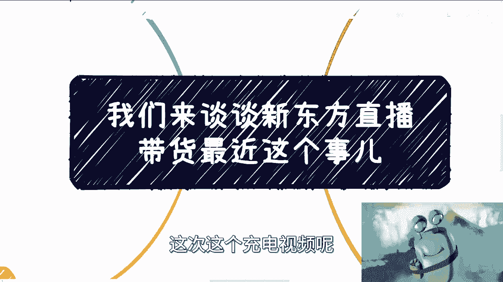

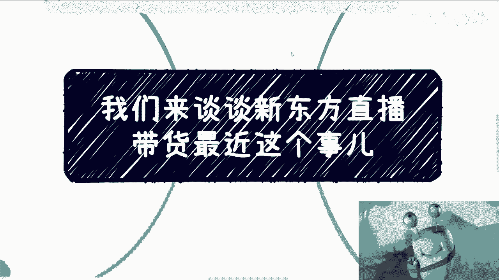

在本节课中，我们将从商业逻辑的宏观视角，解析新东方直播带货事件背后的核心矛盾。我们将探讨不同角色（打工人与资本家）的根本立场冲突，并分析在直播带货这种新兴商业模式下，传统雇佣关系为何会面临挑战。

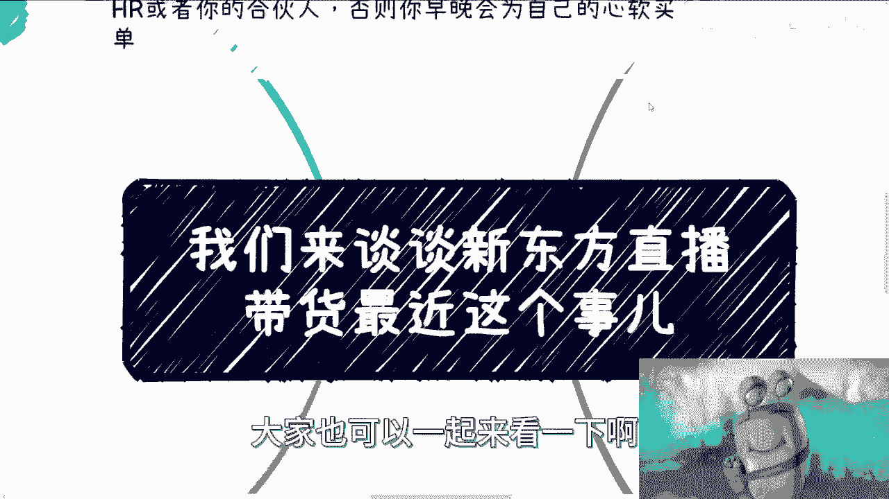

---

## 宏观视角：角色与立场的根本对立

上一节我们介绍了课程主题，本节中我们来看看商业世界中的一个基本规则：角色决定立场。

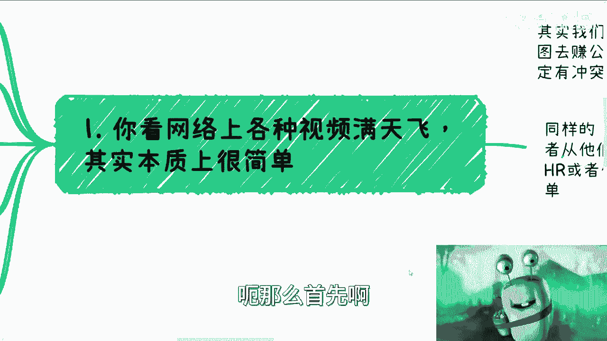

如果你是一名打工人，并企图从公司赚取超出常规劳动报酬的利益，那么你必须转变身份。你可以赚取这份利益，但不能以打工人的身份进行，否则必然会产生冲突。

同理，如果你是一名资本家，也别企图完全从员工的角度出发思考问题。这件事可以交给其他人处理，但资本家本人无需深入思考“为什么”。因为一旦开始这样思考，迟早会为自己的决策感到后悔。这是市场与社会运行的规律，并非个人意愿能够改变。

---

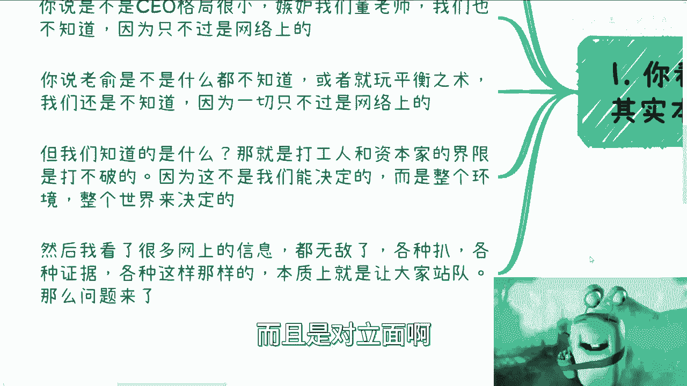

## 事件表象与核心本质

网络上关于此事件的讨论视频层出不穷。以下是几种常见的猜测：

*   **董宇辉野心过大，引发内部矛盾？** 我们不得而知，因为信息源自网络。
*   **CEO格局小，嫉妒董宇辉？** 我们同样不知道，这也源自网络。
*   **俞敏洪不知情，或是在玩平衡术？** 我们依然不知道，一切仍是网络信息。

我们唯一能确定的是，**打工人与资本家的立场是对立的，且无法打破**。这种对立并非由个人决定，而是由整个商业环境、世界和生态所决定。

网络上存在大量复杂信息，例如将董宇辉过往言论、其支持罗翔、甚至涉及宗教等遥远话题都关联起来，绘制复杂的“人物关系图”。本质上，这是为了引导公众站队。

但我们需要思考一个问题：在整个事件中，谁对谁错、你支持谁、证据指向谁，这些真的重要吗？即便今天全网认定新东方错了，CEO有问题，网友列举无数证据指责他们打压董老师，那又怎样？最多换来一个道歉。公司可能让董宇辉取代CEO或俞敏洪的位置吗？不会。

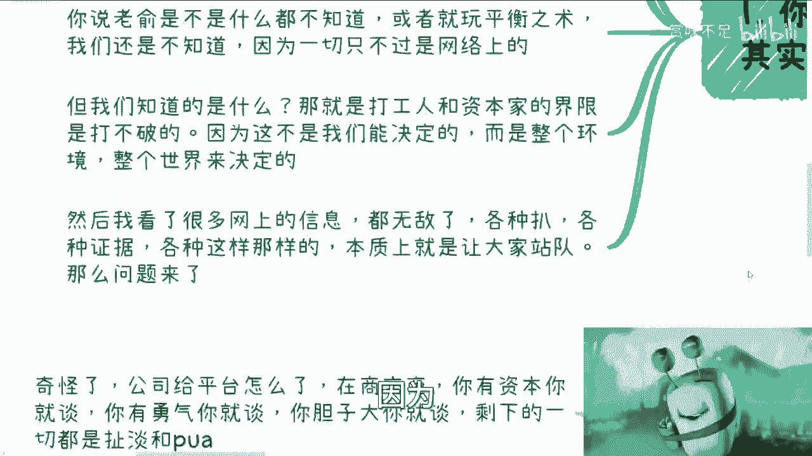

反之，如果证据显示董宇辉从头到尾都在经营人设、收割粉丝，那又怎样？这会影响他们未来的发展吗？不会。因为**这本身就不是一件关于对错的事情**。

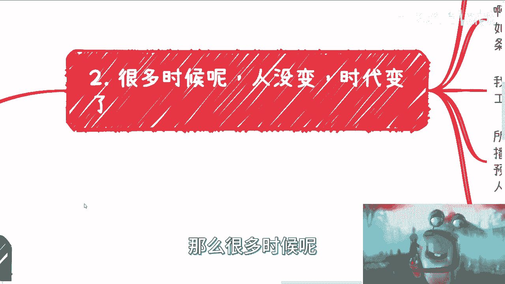

---

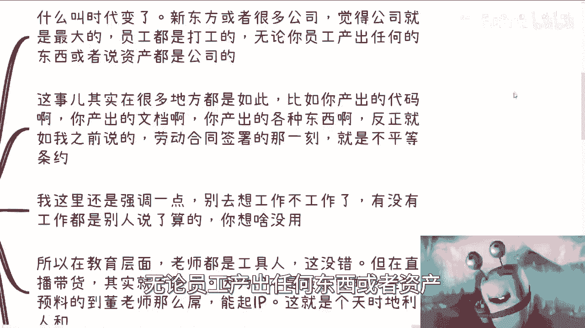

## 时代变迁与模式冲突

很多时候，人没有变，是时代变了。

包括新东方在内的许多公司，其内心深处的逻辑是：公司是最大的，员工只是来打工的。无论员工产出任何东西（代码、文档、创意等），都归属于公司。因为公司提供了平台，并签订了劳动合同。从合同角度看，如果明确约定了产出归属公司，这本身没有问题。

问题在于，许多资本家和公司管理者会“狐假虎威”，根本不严格依据合同，而是形成一种“你来到我的公司，你的一切就都是我的”的逻辑。这类似于一些父母认为“你是我生的，所以你必须听我的，你的一切都应以我为主”。

这里需要强调：不要过度纠结于“工作”本身。因为你是否有工作，最终往往不是你自己说了算，而是别人说了算。当你将自身的安全与稳定完全寄托于他人之手时，还一味强调自己很厉害，这并不可取。

在新东方的传统教育业务中，老师作为“工具人”的模式没有问题。但直播带货在当下这个时代已经改变了规则，其核心是**头部IP**，个人的独特性变得至关重要。谁能预料到董宇辉能如此成功？这无法预料，也没有固定方法论，这是天时地利人和的运气。

直播带货的模式与传统行业不同：公司无法一手遮天，成功模式也难以复制。但现在，各方却仍在用过去那套老方法进行博弈。

---

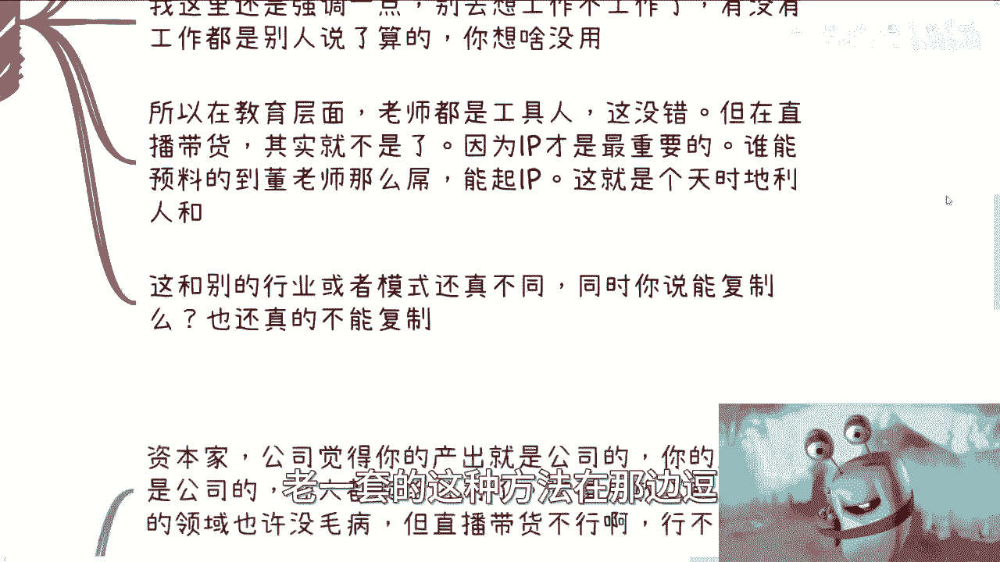

## 矛盾核心与商业现实

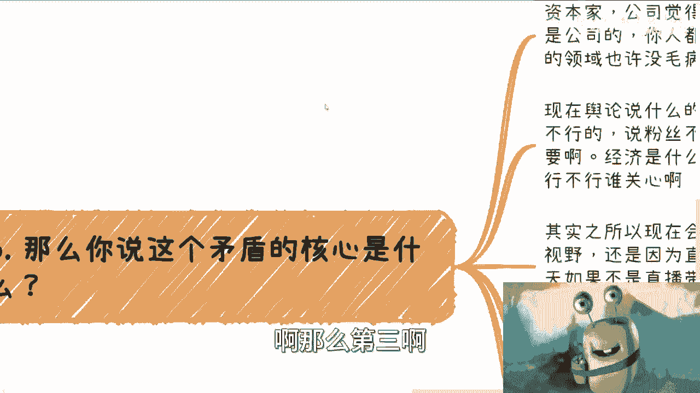

那么，矛盾的核心点究竟是什么？

核心在于，资本家或公司认为员工的全部产出都应归属于公司，员工本人也“卖”给了公司。这套逻辑在以前或其他领域或许行得通，但在**直播带货领域行不通**。

当前舆论众说纷纭，有说新东方不行的，有说董宇辉不行的，有说粉丝不行的。但这些都不重要。在商业世界，经济的王道是**有人买单，资金资产能够流通**。你个人行不行，谁关心？

冲突之所以如此巨大并进入公众视野，正是直播带货这种模式导致的。但反过来想，如果不是直播带货，我们可能根本看不到这些矛盾。然而，我们看不到，就代表这些矛盾不存在吗？当然不是。

归根结底，所有舆论和内容，大多是为了娱乐大众，让大家更好地“吃瓜”。但其核心矛盾只有一个。因此，就事论事，在商言商，我认为董宇辉现在完全有资本去谈判——谈股份、谈公司利益、谈各种合作条件。成不成是后话，但**为什么不谈呢**？

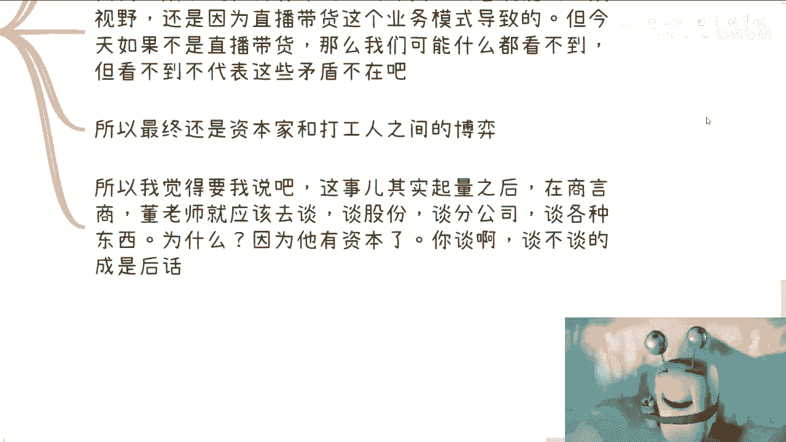

---

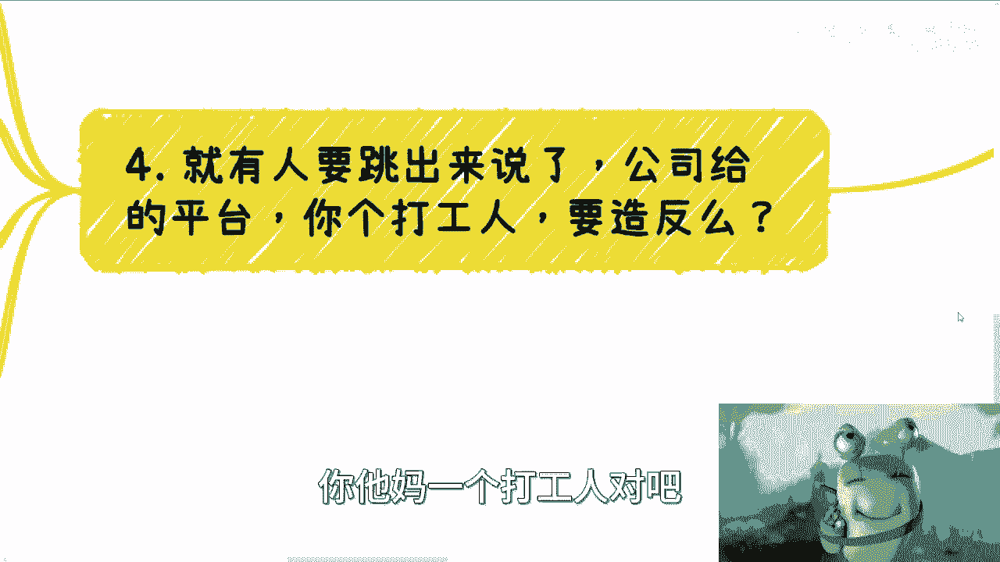

## 商业逻辑下的理性选择

有人可能会指责：公司提供了平台，一个打工人却“忘恩负义”，想要“造反”。

这种说法很奇怪。在商言商，你有资本就去谈，有勇气就去谈。除此之外，谈论其他都是无意义的。公司提供平台，难道员工没有付出劳动吗？公司提供平台，员工就一定能成功吗？这两者有必然的因果关系吗？

包括所谓的“师傅领进门”逻辑，带领你的人，就必须从你的成功中分一杯羹吗？这之间有什么法律上的因果关系吗？没有，这些都是无意义的。该讲感情的时候不讲，不该讲的时候却乱讲。

还有人谈论“野心”问题。事实上，人都是一样的，谁没有野心？谁不想赚钱？如果不想挣钱，为什么要打工？用爱发电吗？从明天开始所有人不发工资，看看还有谁打工。那么多人没有野心、没赚到钱，是他们不想吗？不，是他们没有机会。

人性常常如此：喜欢“吃瓜”，站着说话不腰疼。一方面觉得好事自己没沾上，另一方面也看不得别人好。另一方面，如果真的自己处在董宇辉的位置，拥有他十分之一或百分之一的粉丝量，恐怕行为会比他还“激进”。

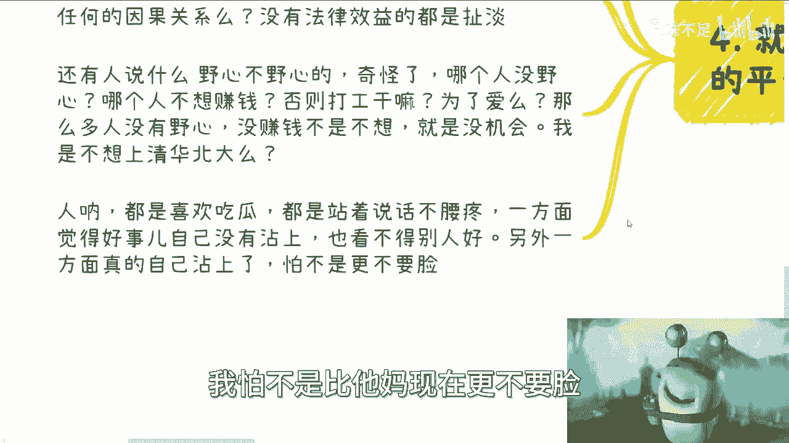

所以，看问题要抓住本质。表面的故事如何讲述，背后真相如何，我们一概不知。包括这些“瓜”是否有人幕后操作，我们也不知道。但核心本质不在这里。

核心问题在于：**打工人不知道应该在何时，以何种方式介入资本层面，或推动自身角色向资本家转换**。如果自己放弃谈判，那能怎么办呢？

很多事情需要透明公开地谈。例如，董宇辉可以直接表明态度：我不想追求更多，就想正常打个工。那么事情就结束了。或者说，我没有那么大野心，直接和新东方签一个十年的长约，把自己“卖”给公司也行。这样，其他高管或许就不会再阴阳怪气。

很多时候，问题在于“既要……又要……”。但更可能的情况是，当事人自己想不清楚。就像一个人突然获得巨大财富时，他的格局和认知可能跟不上，这很难办，但又能怪谁呢？

---

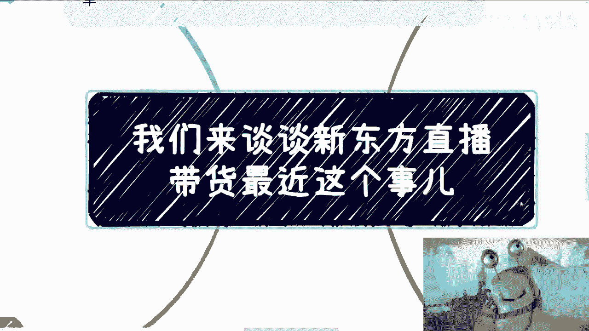

本节课中我们一起学习了如何从商业本质分析热点事件。我们剖析了打工人与资本家的根本立场对立，指出了在直播带货这种依赖个人IP的新模式下，传统雇佣关系面临的挑战。核心结论是：商业冲突往往无关对错，而在于角色、立场与时代模式的错配。在商言商，依据自身资本进行理性谈判，才是解决问题的关键。