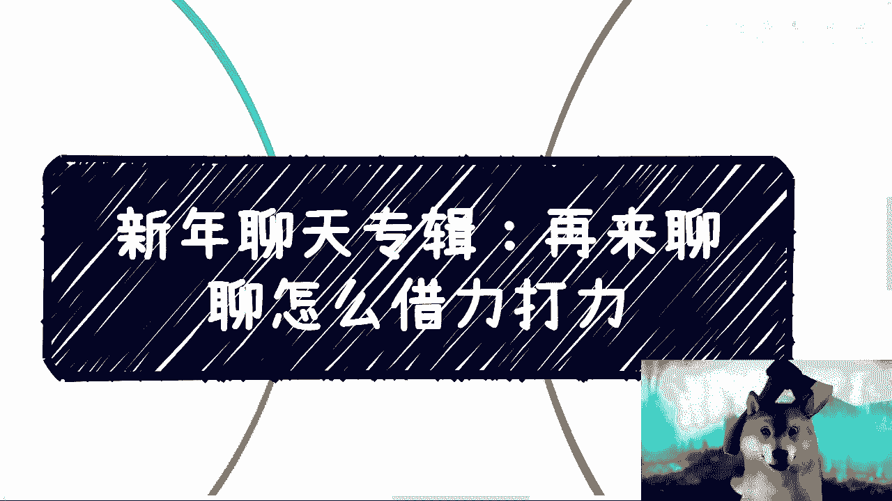
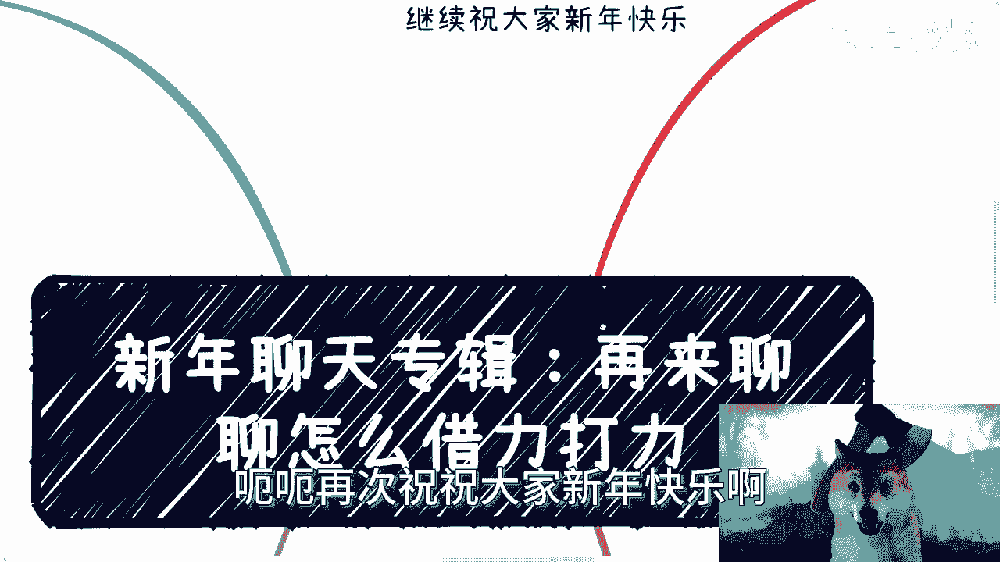
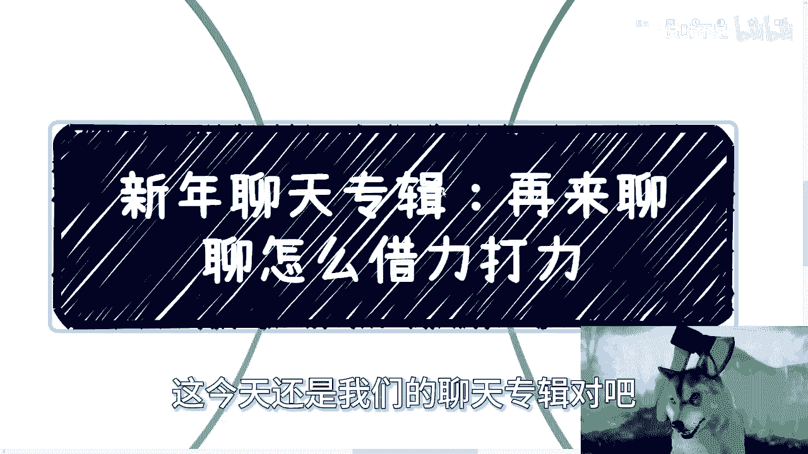
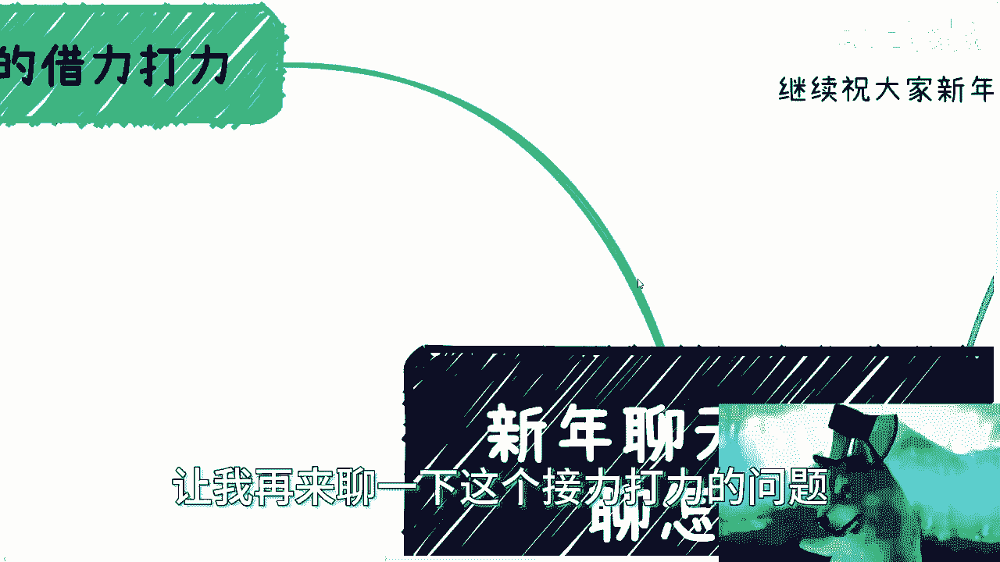
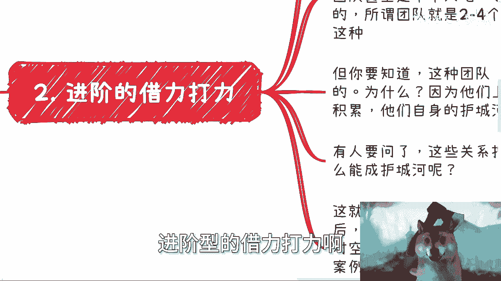
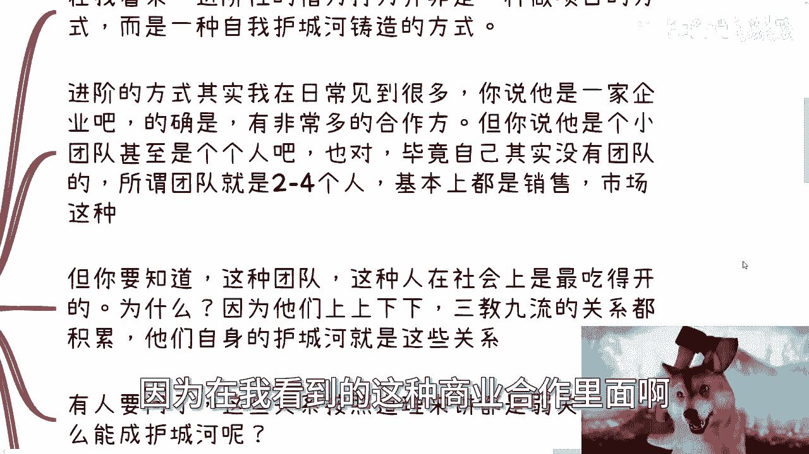
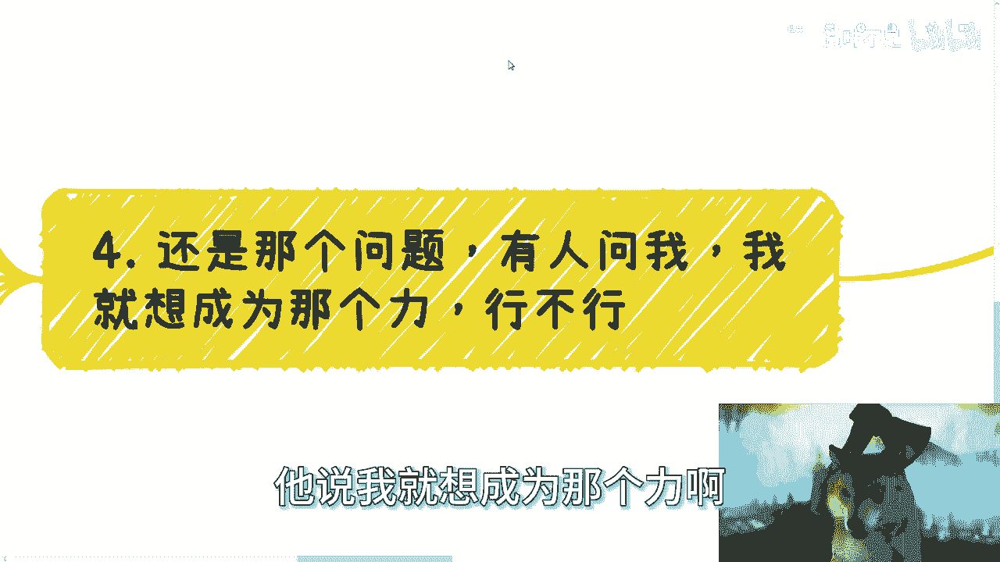
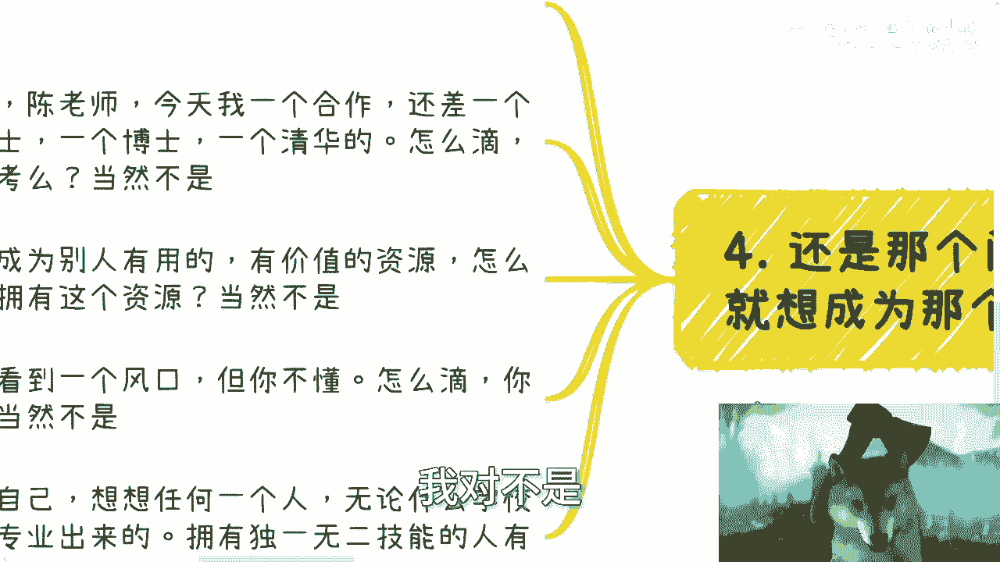
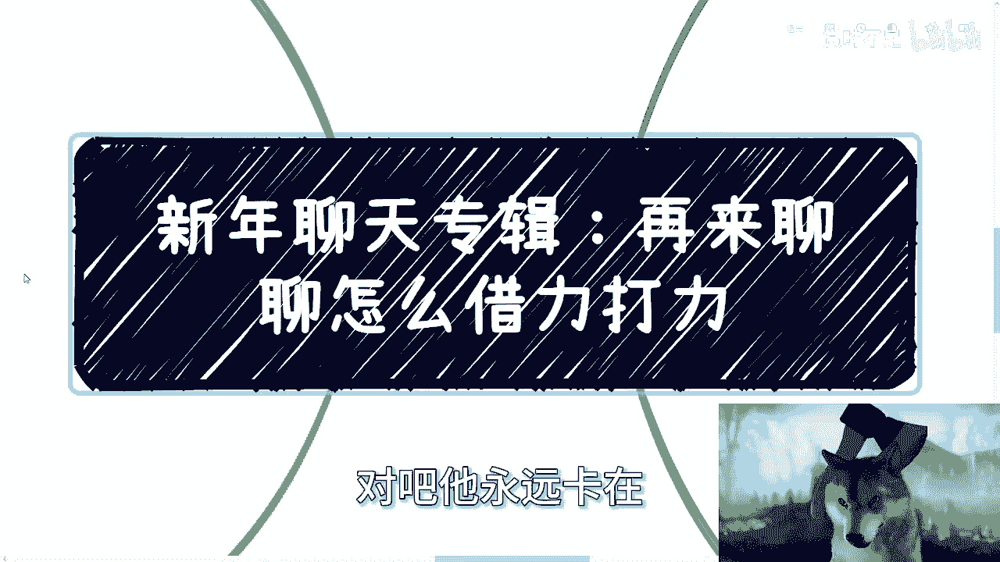
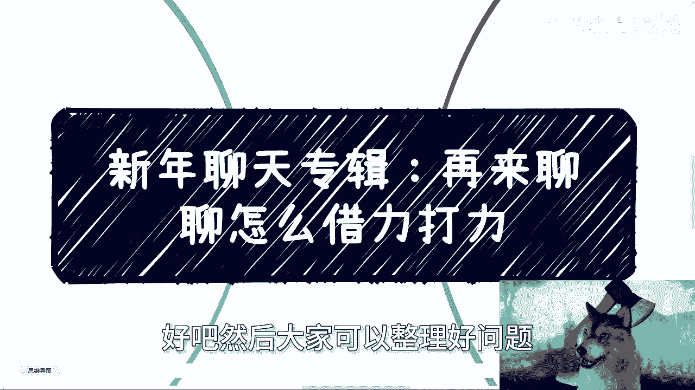

# 新年聊天专辑-再来聊借力打力---P1---赏味不足---BV1qt42187vk









在本节课中，我们将深入探讨“借力打力”这一商业与个人发展策略。我们将从初级到进阶，系统地分析其核心逻辑、应用场景与实操方法，帮助你理解如何整合资源、突破瓶颈，而非仅仅依赖个人能力。

---

## 初级借力打力：补足短板，整合资源

上一节我们概述了课程主题，本节中我们来看看最基础的借力打力模式。其核心在于：个人能力并非成事的唯一要素，关键在于识别自身缺失的资源并主动寻求补充。

**公式：成功 ≠ 个人能力，而是 个人优势 + 外部资源。**



例如，如果你擅长内容创作，但缺乏推广渠道和商务对接能力，你就需要寻找合作伙伴来补足这些短板。

以下是寻找合作伙伴的两种常见途径：

*   **“野路子”合作方（如KOL、个人渠道）**：这类合作方通常灵活、直接，属于C端或非正式商业网络。
*   **企业化运作的机构（如MCN、专业公司）**：这类机构提供体系化的支持，但其中也可能存在运作不规范的团队。



如果你认为自己“一无所有”，同样可以运用“空对空”的策略。你可以向内容创作者宣称自己拥有渠道，同时向渠道方宣称自己拥有创作者资源。这并非欺骗，而是一种商业撮合手段。其成功的关键在于你的沟通与“画饼”能力——即清晰描述合作愿景并说服对方的能力。如果失败，也并无实际损失。

---

## 进阶借力打力（一）：构建关系网络，形成背书

在理解了基础的资源置换后，我们进入更宏观的层面。进阶的借力打力更像一种商业模式或个人护城河的构建方式，其核心是积累广泛的“弱关系”网络。

这类实践者可能以公司或小团队形式存在，但核心成员很少。他们的强大之处在于积累了横跨各行业、各层级的人脉关系。这些“弱关系”本身可能不直接产生利润，但能提供宝贵的**背书和案例**。

**代码逻辑描述：**
```python
# 核心资产不是直接利润，而是关系网络带来的信用背书
core_asset = weak_relationships_network
def build_moat():
    for connection in core_asset:
        endorsement = get_endorsement(connection) # 获取背书
        case_study = generate_case_study(endorsement) # 形成案例
    return case_studies_pool # 最终积累成案例库，用于吸引真实合作
```

他们利用这些背书，在众多机会中筛选并促成真正能盈利的项目。这种方法跳出了“先有案例还是先有合作”的悖论，通过持续的关系维护和资源展示，逐步建立起真实的成功记录。

---

## 进阶借力打力（二）：巧用制衡，曲线达成目标

除了构建网络，另一种进阶策略是“制衡”或“迂回”战术。当你无法直接与目标A达成合作时，可以通过联合其他方来间接影响A。



这种策略适用于目标明确、需求具体的场景（例如需要A提供某种资质、名义或资源支持）。其原理在于：直接与强相关的目标方（A）沟通，可能因竞争关系或戒备心而受阻。

**策略公式：直接路径受阻 → 寻找BCDEFG（非直接竞争方）合作 → 利用此合作成果撬动A。**

因为与B、C、D等方的业务关联度较弱，竞争威胁小，合作门槛更低。一旦你与B、C、D等建立了合作，形成了某种势能或联盟，再回头与A沟通时，你的筹码和可信度就会大大增加。



---

## 核心反思：人人都想成为“力”，但关键在“借”

最后，我们来探讨一个常见误区。很多人希望自己成为那个被借的“力”（即核心资源方），但这对于大多数人而言并不现实。



问题的关键不在于你是否“拥有”资源，而在于你是否能“连接”并“整合”资源。举例来说：
*   需要高学历背书？不是让你去考，而是去找到拥有这些学历的人合作。
*   看到风口但不懂技术？不是让你从头学起，而是去找到懂技术的人组队。
*   认为自己学校资源不足？这并非决定性障碍，进入社会后，独特且可变现的技能才是关键。

**总结：** 在现实商业社会中，几乎没有独一无二、不可替代的个人技能。成功更依赖于**变通、灵活和整合资源的能力**。社会没有标准答案，你需要摆脱寻找“唯一解”的学生思维，主动探索多种路径，利用一切可用之力来达成目标。

---



本节课中我们一起学习了借力打力的多层次策略：从初级的资源互补，到进阶的关系网络构建与制衡战术，最后深刻理解了“整合”比“拥有”更重要的核心原则。掌握这些思维，能帮助你在复杂的商业和个人发展中找到更灵活的突破口。