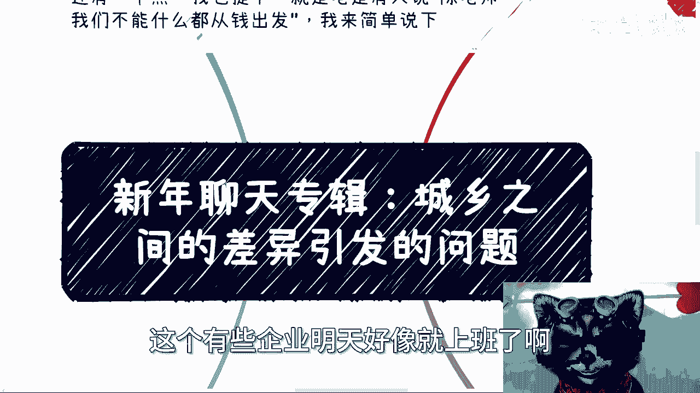
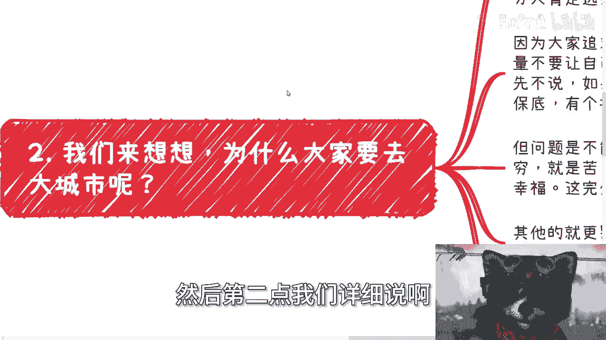
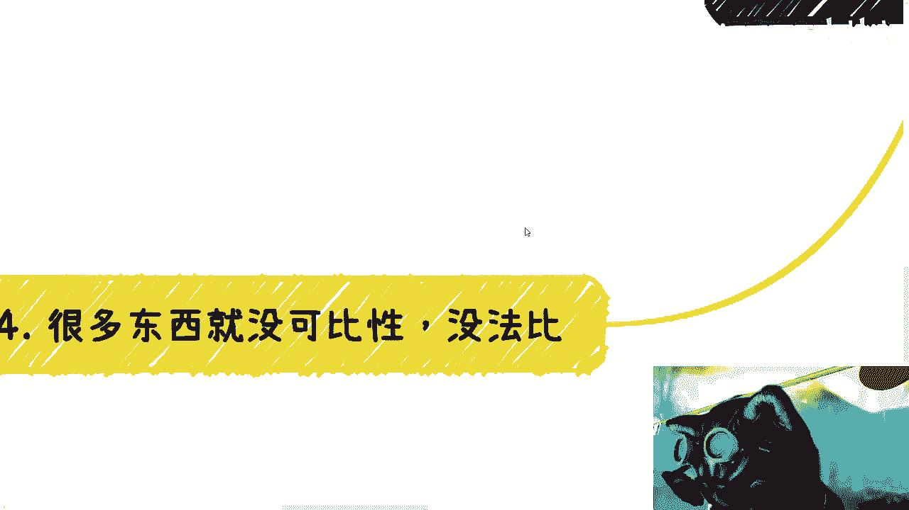
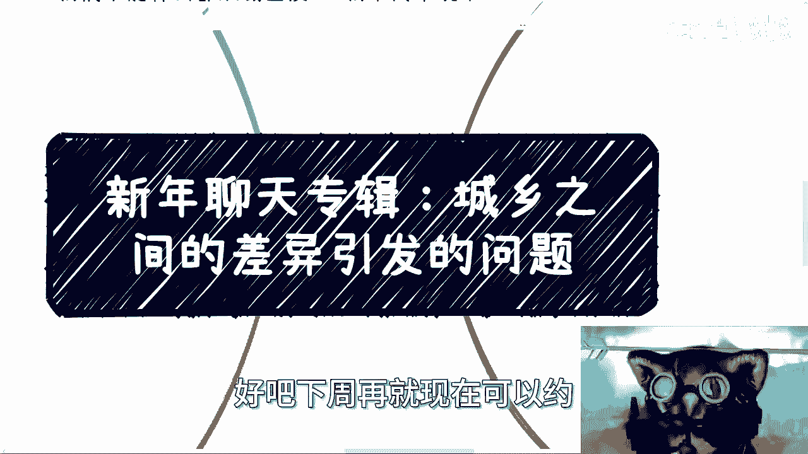

# 新年聊天专辑：城乡之间的差异引发的讨论 - P1 - 赏味不足 - BV1MA4m1V7a3

好吧，这个有些企业明天好像就上班了啊。

嗯啊对，然后那个活动再说一下。

我订好了，2月25号在杭州上城区好吧，具体的活动详情我已经发到那个那个动态上了，今天晚上发的呃，然后报名的话。

反正私信我报名好吧，然后还有个点呢，我今天正好跟别人聊的时候呢，我也提一下，就是其实很多人啊啊怎么说呢，这一年多吧对吧，就很多人其实会说这句话，就说啊，陈老师，我们不能什么事都从钱出发啊。

我来跟你们阐述一下，这件事情很简单，你说这句话对不对对啊，但是我告诉你们不好意思是什么，就是这句话对的，意思是对的，前提是什么，是我们已经脱离了，就或者说我们已经在生存，在生计上面已经是无无忧无虑了。

那你说这句话是对的，你说对于我们现在来讲，大部分老百姓来讲，我们的点就是赚钱，我们的点就是生存，你跟我讲什么，就是说啊陈老师我们不能什么都从钱出发呢，这话没有意义了，没有意义的呀，明白吧。

就这么简单一件事儿啊。

好，然后今天这个主题讲的是这个沉香啊，之间差异引发的这个问题啊，呃当然这个问题不是我想说的啊。

我也没说过这个问题啊，但是呢就是它是有原因的，呃因为前天还是昨天啊，有个视频很火，然后火到了外网上，然后我N个群都给我发了这个图片，我大概看了一下这个视频，因为这视频也不长啊，呃这事怎么说呢。

我就这么讲啊，很多事呢你说是不是事实，但是事实啊，呃但你说比例有多高啊，以及我们以及我们要持怀疑的态度，呃原因是什么啊，就是比如说你说沉香的一些差异化或者怎么样，就是关于呃各方面所提出的一些观点啊。

我们是必须持这种怀疑的态度，我们需要各方面去看啊，那么视频里的意思呢，就是我大概笼统的说一下啊，我说的就是说呃这个主人公啊在北京打工，然后回到了自己的老家啊，发现自己老家呢。

反正就是说他接触下来呢过得都很好啊，消费呃没有降级，反而升级了啊，反正详情大家自己去看啊，我就不二次描述了，但问题呢本质就不是这么简单，就是我们那个发散一下来说，你说穷和富有没有差异，有。

但就如我们以前说的，你发现别人过得好或者很有能力，这就好像呃昨天评论区有小伙伴问我，他说是不是那种十几岁开始做事情的啊，然后现在看上去很成功的，往往原因都是因为和很会折腾啊，性格很外向啊。

或者说就是说啊一开始天生就想的很明白对吧，我说你说就是我是这么回答的，我说跟折腾有没有关系，跟他想不想的明白，跟他是不是天赋异禀有没有关系，有但你说关系多大，比例多高，不好意思，不大不高，就这么简单。

为什么，因为核心就是我们就说啊，这些东西的核心区别在哪里，核心区别是在于它的上一代，核心区别是在于它的上上一代对吧，那你说完全没关系吗，有的但不好意思不大，所以说你说就像我们一开始说的。

你说沉香现在有些差别，你在乡村对吧，或者小县城，你发现哎这个大家消费不错对吧，大家生活也不错，那核心区别在哪，核心区别是辰和乡吗，那他妈不是啊对吧，核心区别是在于你接触的接触的人有幸存，幸存者偏差。

然后呢这些真正活得好的人，做得好的人，他也不会出现成到大城市去去，大城市的一定是因为觉得在县城过得不好，不就是这个原因吗，这没啥好，有啥好说的呢，对吧，就是我总不能说我见到的都是富人，然后得出来好。

全天下都是富人，我是对吧，那总不能说我身边人都是好人，那就认为全天下人都是好人，我他妈是坏人对吧，那这是你单纯的通过一两件事情。

然后从黑不是黑，非黑即白的这种情况下得出某些结论，那怎怎么个怎么聊完。

那没法聊啊啊然后第二点我们详细说啊。

比如说你说就瞎说吧啊，就为什么大家去大城市，其实你看啊，那个视频里面有一个观点说住房的事啊，我就这么说，这他妈是一回事吗，哎你别拿沉香了，你就拿上海这个这个外环，那个上海外环外啊，你你就这么想。

很多地方他都不用，小县城，基本上也是自己盖房子，无论大平层还是小别墅都是有的，你自己去看，有的呀对吧，你要觉得没有，是因为你见识的太少，你去看对，但是我就说这些地方让你住，你住吗，大部分人选择不住。

或者说大部分年轻人选择不住，为什么，因为大家追求的是圈子，他不希望说哎我跟我的朋友冷落了对吧，我不希望说我一个人居住在那，每天打打王者荣耀对吧，吃吃瓜对不对，就是为什么年轻人不愿意住。

是因为他要的是自己的圈子，自己的生活，尽量不要让自己每天去过无聊的生活，你说大家有多大追求，咱先不说，大家大部分也没啥大的追求对吧，但是你说老家有这种房子，或者说在上海外环外，比如昆山啊。

什么什么什么什么青青浦这些地方，你说有一些自盖房有有没有用有用，但是更多的是让你自己有个保底，有一个心安，有一个就是说底牌对吧，最后有个退路，就是这么个点，但你问题，但问题就是说你不能因此得出一个结论。

啊啊啊，这个大城市房子贵啊，面积小就是苦，就是穷过的不舒服啊，小县城呢都是大平层，都是独栋别墅，就他妈富啊，就幸福切，这这怎么比你告诉我这怎么比啊，这不是一件事吗，你们想想看，对不对哦，然后其他呢。

包括你就更别说其他还有别的原因了对吧，比如说大城市很多人谋求的是发展空间啊，新兴的领域，医疗资源，包括娱乐设施等等等啊，包括就是新交一些朋友对吧，就是说本质上还是什么，就是我们不能双标。

更何况是我们更不应该说你自己其实懂，看得明白，但是你故意去双标博眼球，那就没意思了对吧，你比如说选择大城市，他在大家都有都有自己的想法，但如果撇开这些想法不说，单纯的去说啊，小县城有些人过得很好对吧。

然后怎么样怎么样，然后就得出说，小县城与江与城市这边差别很大对吧，大城市现在消费降级，小城市小县城消费消费升级，这个嗯嗯对吧，我不做评论啊，我不做评价，你们自己去看对啊，你们自己去看啊。

然后第三点呢啊还是那句话，就是无论做什么，我们不能忘，我们不能忘记这个地区，什么意思呢，就是说我身边富二代很多钱，别墅也很多，可以说什么都经历过，但是呢我不能因为我经历过，我接触过，我认识过。

然后我就觉得世界都如此啊，我就不接地气，那么人家那些二代或者三代啊，有资本可以说我不关心老百姓生活，关我什么事情对吧，你跟我说穷苦，我不关心，我没经历过，那没问题，我可以理解啊，但我们不行。

因为我们就是老百姓啊，你说我们啊，因为身边有些朋友，因为我们看到过一些东西好，我们开始不接地气了是吧啊，我之前就说过，你们去看一下国家数据，2022年到2023年。

中国人一年平均的收入就在2万8到3万2，什么意思，就是就这个数据，我就说我不管你今天开法拉利，还是今天玛莎拉蒂还是还是什么东西对吧，我不管你今天到底经历过什么，我也不关心你身边的朋友是什么样子的。

你不能忘记真实的中国是什么样子的，对吧啊，我曾经在北京，我这么说，我2020年左右，我在北京做过一年的商业，我基本上啊就是说跟我当时一起合作的都知道，就是我每天都是卧铺来回的啊。

不是每周都是卧铺来回的啊，那我很辛苦，但是我看到的是真正的人民，真正的生活，人间百态，你们去看看，你们去看看，坚持一年啊，来回卧铺的，你晚上你去你去真的试试看，你就知道什么样子，大家为什么奔波。

不就是为了一个机会，为了一个未来，为了一个以后嘛，为了改善生活吗，对吧，不是说哦，因为我在小县城有大号啊，然后在小县城怎么样，我18岁开始躺平，我真的让你躺，你躺吗，你你别就是很多人就是说不是说啊。

你嘴上打嘴炮，你可以躺个一年半载，你能躺到几岁啊，对不对，你到最后人你一样的，我跟你讲，人就是贱，你知道吗，就是你看着那边好，你没有，或者你没有经历过失去了，我跟你讲，你呆个也不用吵，你待个一两个月。

待个三四个月，你无聊的很，对，未来一样的道理呀，什么叫地契，地契就是真正的生活，真正的百姓，真正的人民是什么样子的，对吧，无论我们看到再好，再优秀或者再怎么样的，都是少数，因为什么。

因为他们事实就是少数，你别你还问我为什么对你说2万8到3万2，我们有什么好说的，要说好说，为什么呢，对不对。

第四很多东西它没有可比性，没法比，你看啊，有的事情我早就说过了，你别去看表面，它往往背后核心是上一代，上上一代的事情，我们出生之前就已经有了一定的划分，我们去比啥呢，有啥可比呢。

然后有的事情他根本就不在一个维度上，就好像比如说啊之前我说什么好学校，坏学校说专业，我说了，你单纯从打工来讲可以比出高低，我觉得没问题的，你说北大清华比职校技校好，那他妈谁敢说站出来说有问题啊对吧。

但你把时间线放长了，35岁以后的发展呢，或者说他自己为了自己赚钱，没有有些人要去追求抗风险能力，要去追求自己赚钱的能力来讲，这两者有可比性吗，没有可比性啊，这完全就是不同的角度，有啥可比的。

每个人追求不一样，就所谓鸡同鸭讲，这就好像很多人私信还问我二选一的问题对吧，就比如说其中有一个选项是很稳定的，另外一个选项可能没有，另外一个就另外选项没有这个选项来得稳定好，那么我们继续往下聊。

你就会发现呢，他可能他可能也不是很想要稳定，因为他会发现什么呢，当下是要稳定的啊，但是他就怕进了稳定之后呢，他自己与社会脱节，未来就不稳定了，那你们想想看，你让我怎么说呢，就是你做什么总要有舍弃。

而且甚至对于当下很多人来讲，他根本不能叫舍弃，因为你还没得到这东西，怎么能叫舍弃呢，对吧，也就是说你选择的任何一个选项，你总有能得到，总有得不到的，然后你面对你得不到的东西，然后你说卧槽。

为啥他妈的别人得到我得不到，我这怎么聊，你告诉我怎么聊啊，这就好像这就好像你问他，你要不要结婚，我不要结婚，你对不对，我就要一个人看，然后他回头回头说，哎呀我被撒狗粮了，哎呀你们怎么能这样子呢。

哎呀人家怎么有人养老啊，我怎么没人照顾你，这怎么地啊，就是什么都是你的，什么什么都到你身上，就好事都在你身上啊，坏事都在别人身上，没这么个说法的呀，然后呢最后你看啊，还是那句话，就是看的多了，见得多了。

经历多了，不是说我们会越来越不相信一切，也不是说我们不会相信，我们越来越不相信任何人，不是这么个事儿，而是说我们越来越会明白，大部分大部分大部分大部分的人和事情，它是灰色的，什么意思。

就是永远都是表面的东西，也有背后的东西，没有这么干净，也没有这么不干净的对吧，就是你相信也好，不相信也罢，这些东西重要吗，不重要，重要的是我们自己要什么，什么对我们是有帮助的，别的你说重不重要重要。

等我们先自救了再说，就像就像我今天一开始提出来的，就是你跟我说，陈老师，我们能不能什么事情，我们不能什么事情都从钱出发，对呀，那我们现在都是泥菩萨过江，大部分人都是为了生计这个所所所在，拼命所在奔波。

那你谈这种话有有意义不了，对不对。

好吧，所以呢我觉得呢就是啊我希望啊，就是大家看问题一样的，就是非黑即白，非黑即白啊，呃这个灰色可能大家也都知道，但是不管怎么样，大家在看问题或者去考虑自己的问题的时候，也一定要去代入的。

或者说一定要去以这个东西为一个，前提条件去思考啊，因为很多事情是一个道理，就是很多时候道理都懂，但当你思考和做一件事情的时候呢，哎你就发现他没有融入到你的这个人当中，那那那那你懂这些东西有什么用是吧。

没用啊啊行好，就这么着，呃好吧，然后最近已经约满了，反正有啥呃，职业上商业上对吧，或者有什么呃这个副业或者其他的走咨询的话，反正下周吧，下周再现在可以约。

