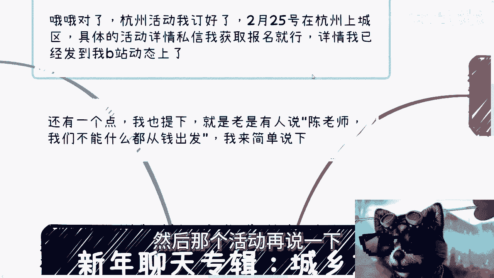
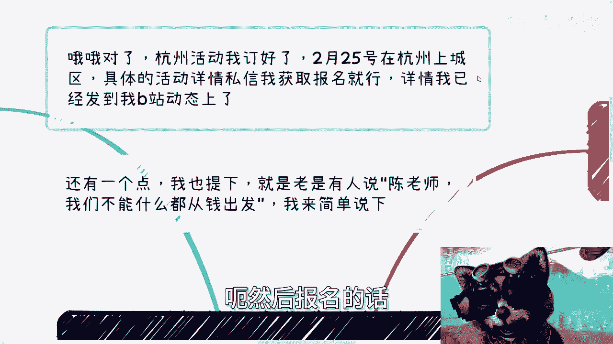
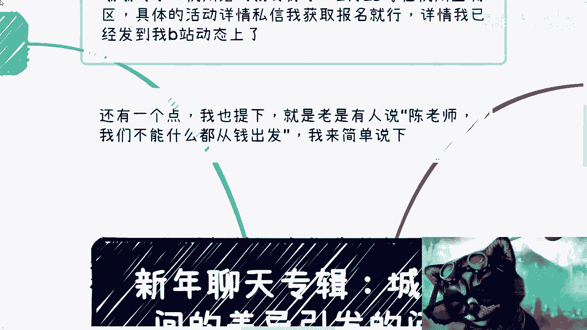
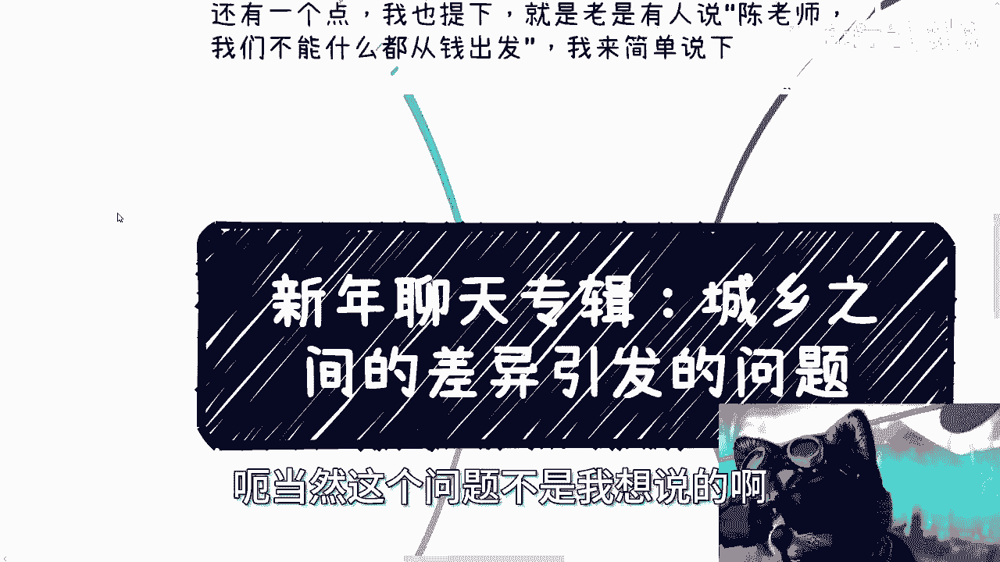
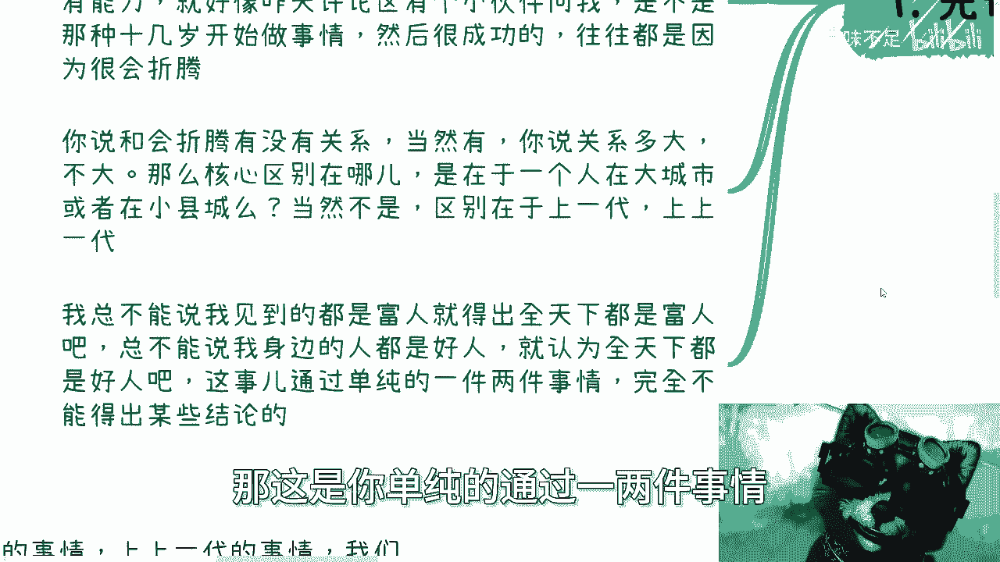
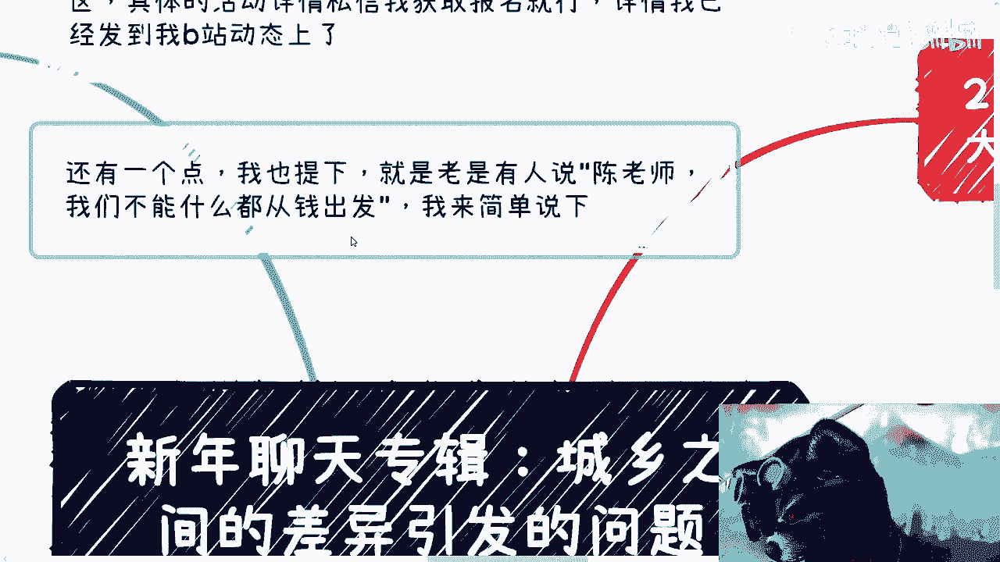
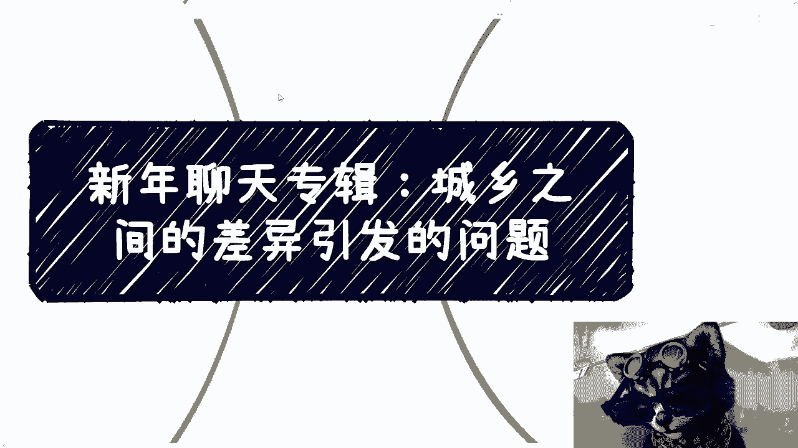

# 新年聊天专辑：城乡差异引发的讨论 - 课程01 🏙️🌾

在本节课中，我们将探讨一个近期引发热议的话题：城乡之间的差异。我们将分析一个网络视频引发的讨论，并深入思考如何正确看待这类现象，避免陷入非黑即白的思维误区。

---

## 课程概述与活动通知 📅

一些企业明天就要开始上班了。

活动信息再次通知一下。

我已经订好了场地，活动将于2月25日在杭州上城区举行。具体的活动详情我已经发布在动态中，是今晚发布的。报名请私信我。

## 关于“不能只从钱出发”的讨论 💰

今天正好和别人聊到一个观点，很多人这一年多来会说：“陈老师，我们不能什么事都从钱出发。”

我来阐述一下这件事。这句话本身是对的，但它的前提是：我们已经脱离了生存压力，在生计上已经无忧无虑了。

对于我们现在的大部分老百姓来说，核心点就是赚钱和生存。在这种情况下，谈论“不能只从钱出发”是没有意义的。

就这么简单一件事。

## 城乡差异话题的引入 🎬

今天要讲的主题是“城乡之间差异引发的问题”。当然，这个问题不是我主动想说的。

我也没说过这个问题。但它之所以被讨论是有原因的。前天或昨天，有一个视频很火，甚至火到了外网，我很多个群都转发了这个视频。我大概看了一下，视频不长。

很多事情，你说它是不是事实？它是事实。但你说它的比例有多高？以及我们为什么要持怀疑态度？原因在于，对于城乡差异这类话题提出的各种观点，我们必须持怀疑态度，需要从多方面去看。

视频的大意是，主人公在北京打工，回到老家后，发现自己接触到的老家人都过得很好，消费没有降级反而升级了。详情大家可以自己去看，我不做二次描述。

但问题的本质没那么简单。

## 核心差异在于代际积累，而非地域 ⏳

我们发散一下来说，穷和富有没有差异？有。但就像我们以前说的，你发现别人过得好或很有能力，这就像昨天评论区有小伙伴问我：是不是那些十几岁开始做事、现在看上去很成功的人，往往都是因为很会折腾、性格外向，或者一开始就想得很明白？

我是这么回答的：跟折腾、想得明白、天赋异禀有没有关系？有。但你说关系多大、比例多高？不好意思，不大、不高。就这么简单。

为什么？因为核心区别在于他们的上一代，在于他们的上上一代。你说完全没关系吗？有的，但不好意思，关系不大。

所以说，就像我们一开始说的，你发现城乡现在有些差别，在乡村或小县城，大家消费不错，生活也不错。核心区别是在于“城”和“乡”吗？不是。核心区别在于你接触的人有**幸存者偏差**。

然后，那些真正活得好、做得好的人，也不会全都涌到大城市去。去大城市的人，一定是因为觉得在县城过得不好。不就是这个原因吗？这没啥好说的。

我总不能说我见到的都是富人，就得出结论说全天下都是富人。我也不能说我身边人都是好人，就认为全天下人都是好人，而我自己是坏人。那是你单纯通过一两件事情，在非黑即白的情况下得出某些结论，那还怎么聊？

那没法聊。然后我们详细说第二点。

## 选择大城市的深层原因：圈子与生活 🏘️

比如说，为什么大家去大城市？视频里有一个观点提到住房的事。我就这么说，这是一回事吗？你别拿城乡比了，就拿上海外环外来说，很多地方，甚至小县城，也有自己盖的房子，无论大平层还是小别墅都有。你自己去看，是有的。如果你觉得没有，是因为你见识太少。

但是，我就说这些地方让你住，你住吗？大部分人选择不住，或者说大部分年轻人选择不住。为什么？因为大家追求的是**圈子**。他不希望跟朋友冷落，不希望一个人居住在那里，每天只是打打王者荣耀、吃吃瓜。

为什么年轻人不愿意住？是因为他要的是自己的圈子，自己的生活，尽量不让自己每天过无聊的生活。你说大家有多大追求？咱先不说，大部分人也没啥大追求。但是你说老家有这种房子，或者说在上海外环外比如昆山、青浦这些地方，有一些自盖房，有没有用？有用。但更多的是让你自己有个保底，有一个心安，有一个底牌，最后有个退路。

但问题在于，你不能因此得出一个结论：啊，大城市房子贵、面积小就是苦、就是穷、过得不舒服；小县城都是大平层、独栋别墅就是富、就是幸福。这怎么比？你们想想看，对不对？

然后，其他原因就更不用说了。比如，大城市很多人谋求的是发展空间、新兴领域、医疗资源、娱乐设施等等，包括结交新朋友。本质上还是那句话：我们不能双标。更何况，我们更不应该自己其实懂、看得明白，却故意去双标博眼球，那就没意思了。

你比如说选择大城市，大家都有自己的想法。但如果撇开这些想法不说，单纯地去说小县城有些人过得很好，然后就得出小县城与城市差别很大、大城市消费降级、小县城消费升级的结论……嗯，我不做评论，你们自己去看。

## 保持接地气：关注真实的大多数 📊

然后第三点，还是那句话：无论做什么，我们不能忘记“接地气”是什么意思。就是说，我身边富二代很多，别墅也很多，可以说什么都经历过。但是，我不能因为我经历过、我接触过、我认识过，就觉得世界都如此，我就不接地气。

那些二代或者三代，有资本可以说“我不关心老百姓生活，关我什么事？你跟我说穷苦，我不关心，我没经历过”。那没问题，我可以理解。但我们不行，因为我们就是老百姓。

你说我们，因为身边有些朋友，因为我们看到过一些好东西，就开始不接地气了？我之前就说过，你们去看一下国家数据：2022年到2023年，中国人年平均收入就在2.8万到3.2万之间。

什么意思？就这个数据。我不管你今天开法拉利还是玛莎拉蒂，我不管你今天到底经历过什么，我也不关心你身边的朋友是什么样子的，你不能忘记真实的中国是什么样子的。

我曾经在北京，2020年左右，我在北京做过一年的商业。基本上，跟我当时一起合作的都知道，我每周都是卧铺来回的。那我很辛苦，但我看到的是真正的人民，真正的生活，人间百态。你们去看看，坚持一年来回卧铺，晚上你真的试试看，你就知道是什么样子。大家为什么奔波？不就是为了一个机会，一个未来，一个以后，为了改善生活吗？

不是说，哦，因为我在小县城有大房子，然后在小县城怎么样，我18岁开始躺平。我真的让你躺，你躺吗？你别就是很多人，嘴上打嘴炮，你可以躺个一年半载，你能躺到几岁？你到最后，人是一样的。我跟你讲，人就是“贱”。你看着那边好，你没有，或者你没有经历过、失去了，你待个一两个月、三四个月，你无聊得很。

一样的道理。什么叫接地气？接地气就是真正的生活，真正的百姓，真正的人民是什么样子的。无论我们看到再好、再优秀或者再怎么样的，都是少数。因为他们事实就是少数。你别还问我为什么。你说2.8万到3.2万，我们有什么好说的？要说好说，为什么呢？对不对。

## 事物的不可比性与灰色地带 🌫️

第四，很多东西没有可比性，没法比。你看，有的事情我早就说过了，你别看表面，它往往背后的核心是上一代、上上一代的事情。我们出生之前就已经有了一定的划分，我们去比啥呢？有啥可比的？

然后有的事情，根本就不在一个维度上。就好像之前我说什么好学校、坏学校、说专业。我说了，你单纯从打工来讲可以比出高低，我觉得没问题。你说北大清华比职校技校好，那他妈谁敢站出来说有问题？对吧。

但你把时间线放长了，35岁以后的发展呢？或者说，他自己为了自己赚钱，有些人要去追求抗风险能力，要去追求自己赚钱的能力来讲，这两者有可比性吗？没有可比性。这完全就是不同的角度，有啥可比的？每个人追求不一样，就是所谓鸡同鸭讲。

这就好像很多人私信还问我二选一的问题。比如，其中有一个选项是很稳定的，另外一个选项可能没有这个选项来得稳定。那么我们继续往下聊，你就会发现，他可能也不是很想要稳定。因为他会发现，当下是要稳定的，但是他就怕进了稳定之后，自己与社会脱节，未来就不稳定了。

那你们想想看，你让我怎么说呢？你做什么总要有舍弃。而且，甚至对于当下很多人来讲，他根本不能叫舍弃，因为你还没得到这东西，怎么能叫舍弃呢？对吧。也就是说，你选择的任何一个选项，你总有能得到，总有得不到的。然后你面对你得不到的东西，你说：“卧槽，为啥他妈的别人得到我得不到？”我这怎么聊？你告诉我怎么聊？

这就好像你问他：“你要不要结婚？”“我不要结婚。”对不对？“我就要一个人。”然后他回头说：“哎呀我被撒狗粮了，哎呀你们怎么能这样子呢？哎呀人家怎么有人养老啊，我怎么没人照顾？”这怎么地？就是什么都是你的，什么好事都在你身上，坏事都在别人身上？没这么个说法的。

然后呢，最后你看，还是那句话：就是看得多了，见得多了，经历多了，不是说我们会越来越不相信一切，也不是说我们不会相信、我们越来越不相信任何人。不是这么个事儿。而是说，我们越来越会明白，大部分的人和事情，它是**灰色**的。

什么意思？就是永远都是表面的东西，也有背后的东西，没有这么干净，也没有这么不干净的。对吧？就是你相信也好，不相信也罢，这些东西重要吗？不重要。重要的是我们自己要什么，什么对我们是有帮助的。别的你说重不重要？重要，等我们先自救了再说。

就像我今天一开始提出来的，就是你跟我说：“陈老师，我们能不能什么事情，我们不能什么事情都从钱出发。”对呀。那我们现在都是泥菩萨过江，大部分人都是为了生计所在拼命奔波。那你谈这种话有意义吗？对不对。

## 总结与行动建议 ✅

所以呢，我觉得，就是我希望大家看问题一样，要避免非黑即白。“灰色”可能大家也都知道，但是不管怎么样，大家在看问题或者考虑自己的问题时，也一定要去代入，或者说一定要以这个东西为一个前提条件去思考。

因为很多事情是一个道理：就是很多时候道理都懂，但当你思考和做一件事情的时候，哎，你就发现它没有融入到你的这个人当中。那你懂这些东西有什么用？没用。

行，好，就这么着。然后最近咨询已经约满了。反正有职业上、商业上，或者有什么副业或者其他问题走咨询的话，反正下周吧，下周再约，现在可以预约。

---

## 本节课总结 📝

在本节课中，我们一起学习了如何理性看待城乡差异这个话题。我们分析了网络热议背后的**幸存者偏差**，探讨了选择大城市背后对**圈子**和生活的追求，强调了无论看到什么都要保持**接地气**，关注真实大多数人的生活状况（如年收入 `2.8~3.2万` 的数据）。最后，我们认识到许多事物**没有可比性**，现实往往是复杂的**灰色**地带，关键在于明确自己的需求，避免非黑即白的简单判断。希望这些思考能帮助大家更全面、更深入地看待类似的社会现象与个人选择。