# 新年聊天专辑-大家恭喜发财哈---P1---赏味不足---BV1iS421K7im

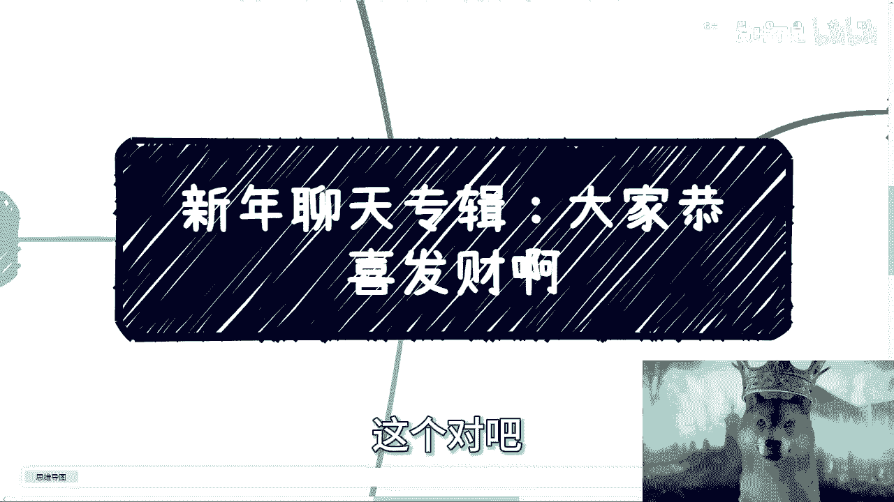

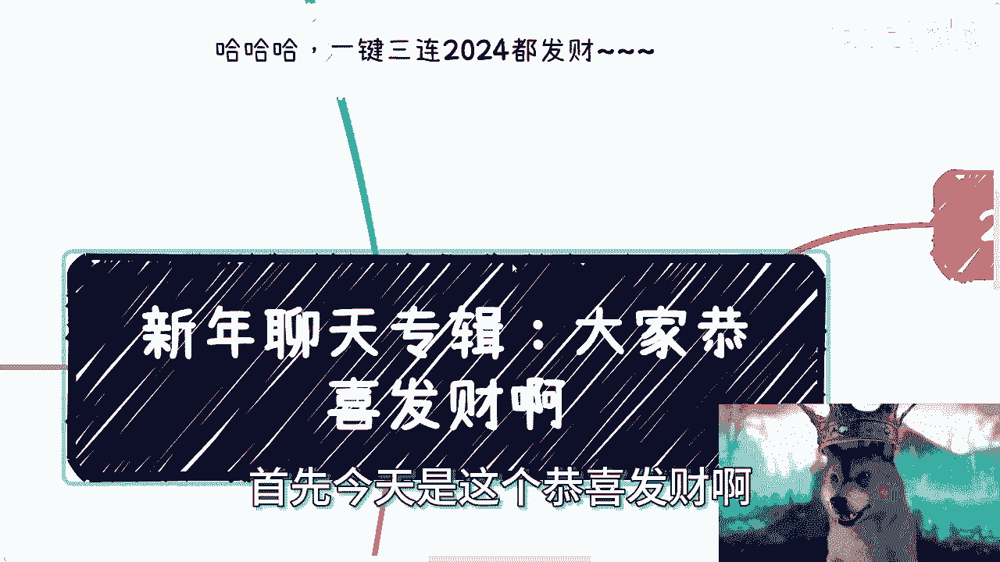

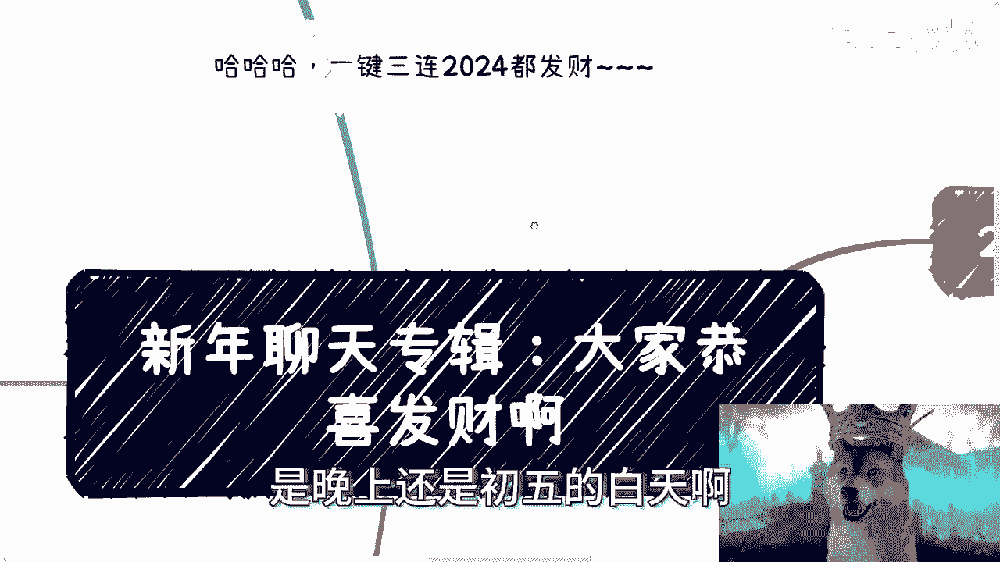

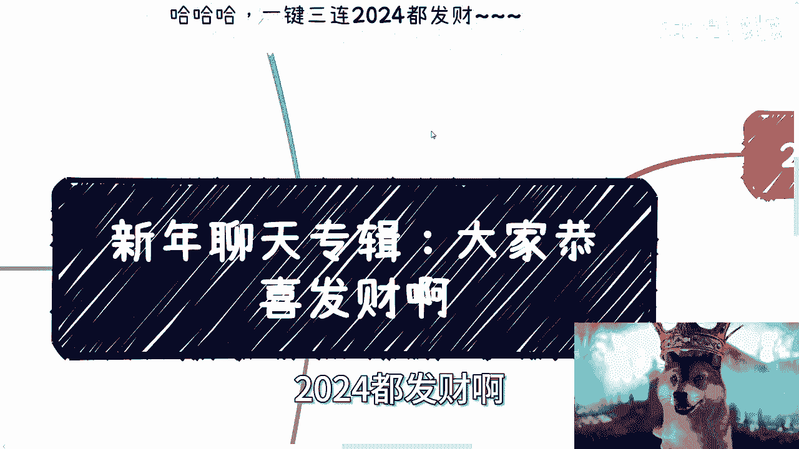

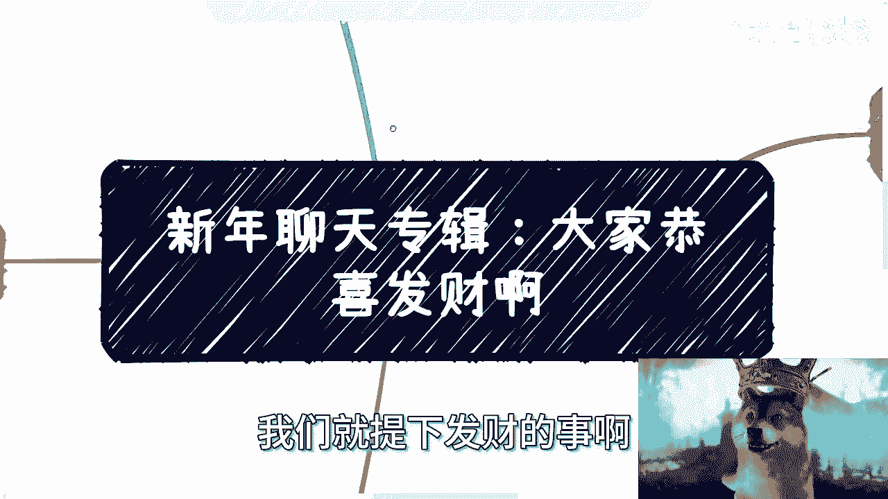

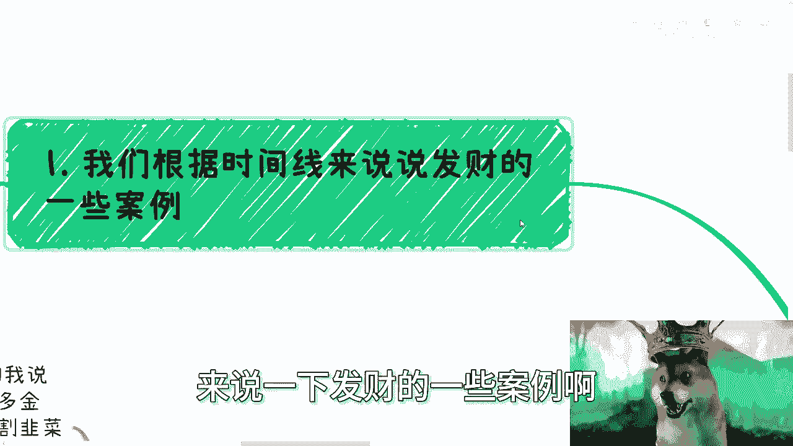

在本节课中，我们将回顾近年来几个典型的“发财”案例，分析其背后的行业风口与运作逻辑。课程将基于时间线，探讨Web3、数字藏品、AIGC等领域的机遇与特点，并总结其中的共性规律。

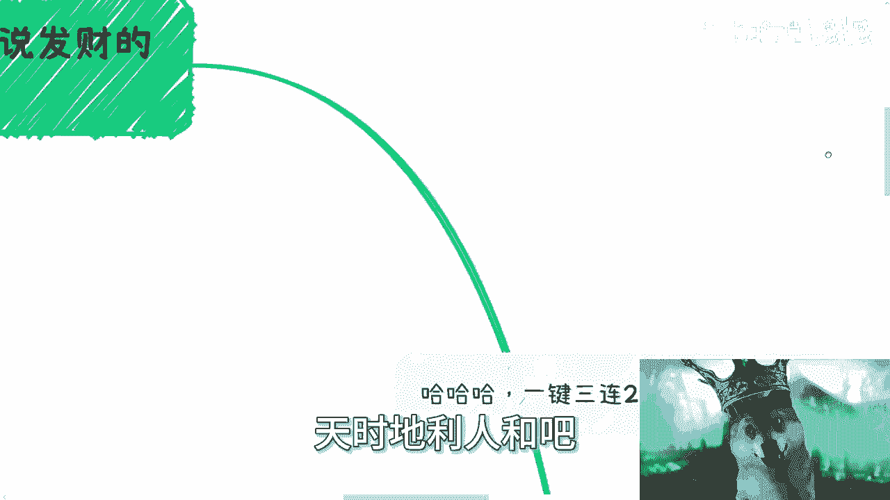

---

上一节我们提到了课程的整体安排，本节中我们来看看第一个案例：**Web3与数字藏品**。

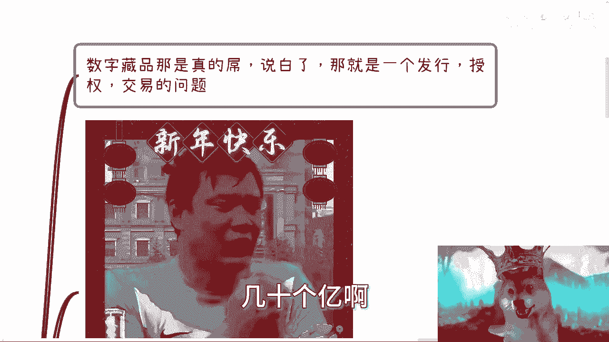

这个领域在国内曾一度非常狂热。其核心模式通常涉及三个部分：**发行方**、**授权方**和**交易平台**。然而在实际操作中，各个环节都存在大量不规范行为。

以下是当时行业的一些典型现象：
*   **发行方**：门槛极低，可能只需找一个外包团队，支付少量费用即可搭建平台发行产品。
*   **授权方**：版权和知识产权问题常常被忽视，处于无人监管的状态。
*   **交易环节**：整个交易链条，无论是一级还是二级市场，大多在打擦边球，缺乏明确的合法牌照。

但就是在这种环境下，行业的单日交易额曾达到数亿甚至数十亿的规模。例如，一张标价9.9元的图片，发行9999份，可能在几十秒内就被抢购一空，为发行方带来近百万的纯利润，而其成本几乎可以忽略不计。

Web3领域的融资在2017年左右也达到疯狂程度。融资过程极度简化，有时甚至不需要复杂的路演和背调，一个能打动人的想法在5分钟内就可能获得数千万投资。这种环境也让许多人有机会接触到顶级的投资机构，积累了相关经验。

---

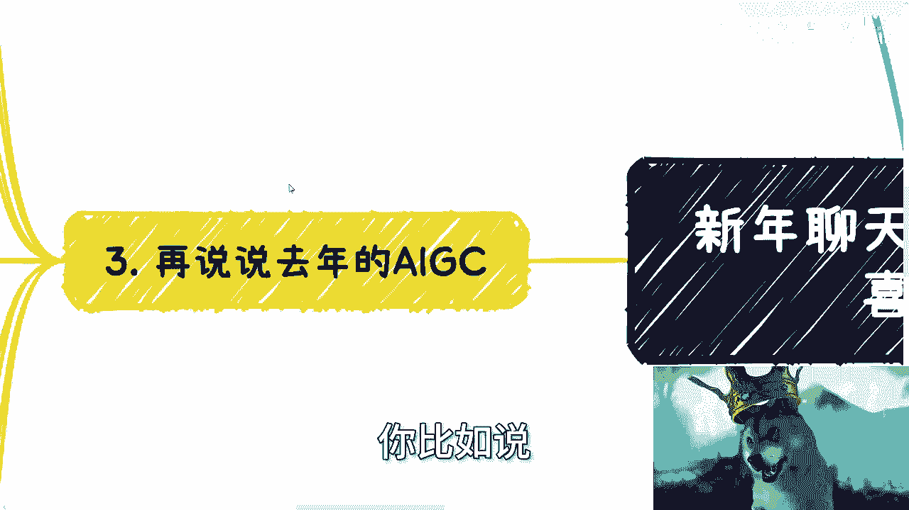

在了解了Web3的疯狂之后，我们来看看另一个近在眼前的风口：**AIGC（人工智能生成内容）**。

以2023年3月到7月为例，这是AIGC培训和相关服务需求爆发的时期。在这个阶段，行业对专业背景和经验的要求被降到极低。

以下是当时市场的一些特点：
*   **需求旺盛**：大量企业寻求AI相关的培训和咨询服务。
*   **门槛降低**：讲师或服务提供者的个人背景、案例经验变得不再重要，只要“能讲”就有人抢着要。
*   **报价飙升**：单次课程（并非全天）的报价可达数万甚至十万元以上。

然而，这种狂热通常难以持续。一个重要的观察指标是：当企业连几万元的培训预算都不愿意支付时，往往意味着该领域的“快钱”周期已经结束，其他更深度的服务更难开展。

---

除了上述“快钱”机会，市场上也存在一些相对稳定、可复制的“慢钱”模式。

“慢钱”并非指赚钱速度慢，而是相对于风口期的暴利而言，它更依赖于规则和渠道，收益相对稳定但可持续。

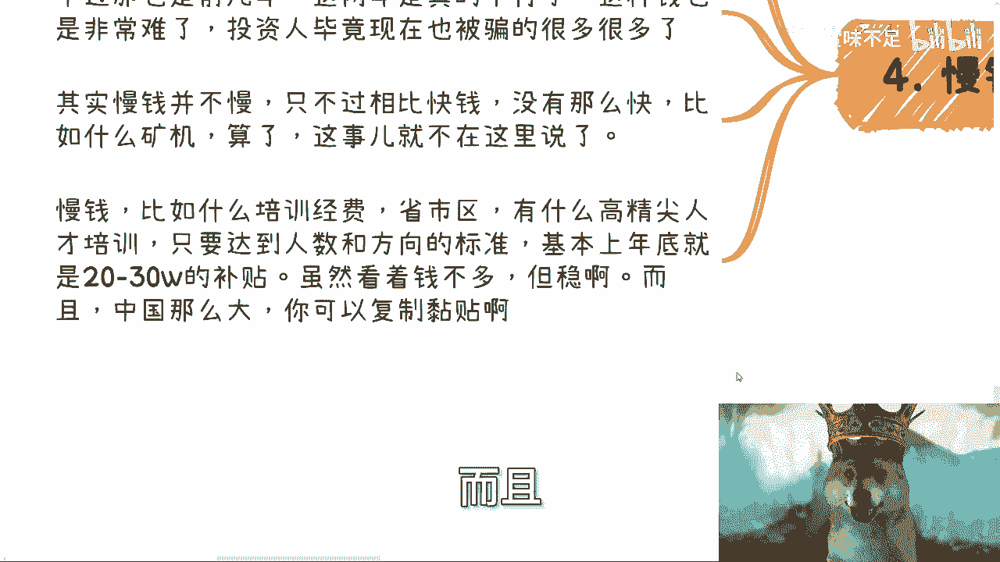

以下是几种“慢钱”模式的例子：
*   **政策补贴**：例如，协助企业或产业园申请“高精尖人才”等政策性补贴。单笔金额可能在20-40万，但因其有明文规定且可跨区域复制，整体收益可观。
*   **项目经费**：将数字藏品、区块链、元宇宙等概念与政府、学校、产业园的项目结合，获取项目落地经费。这类项目背后的经费支持通常比较充足。

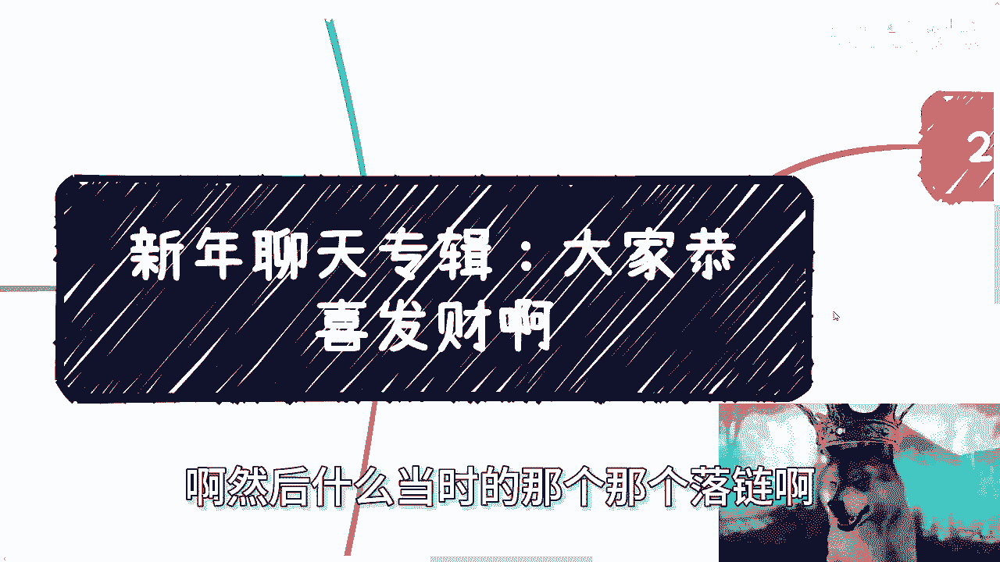

无论是快钱还是慢钱，其成功往往不绝对依赖于个人背景或学历。在风口期，市场更看重行动力和抓住机会的勇气。很多时候，成功是**天时、地利、人和**共同作用的结果。

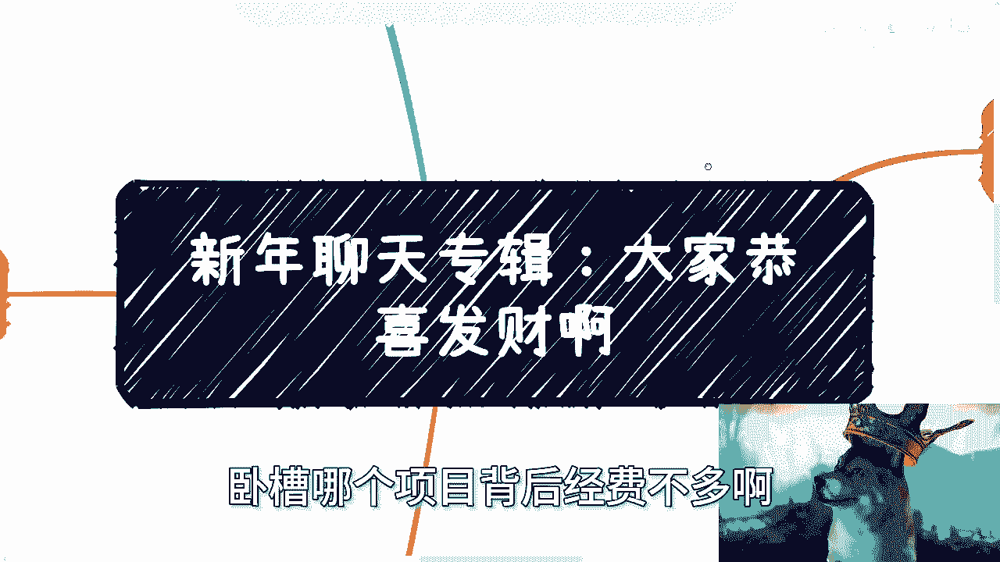

---

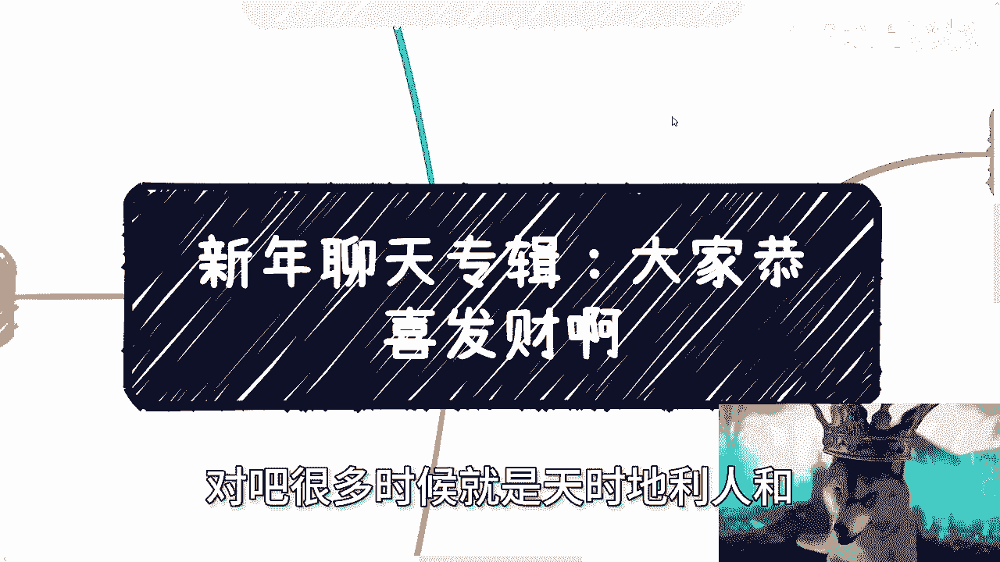

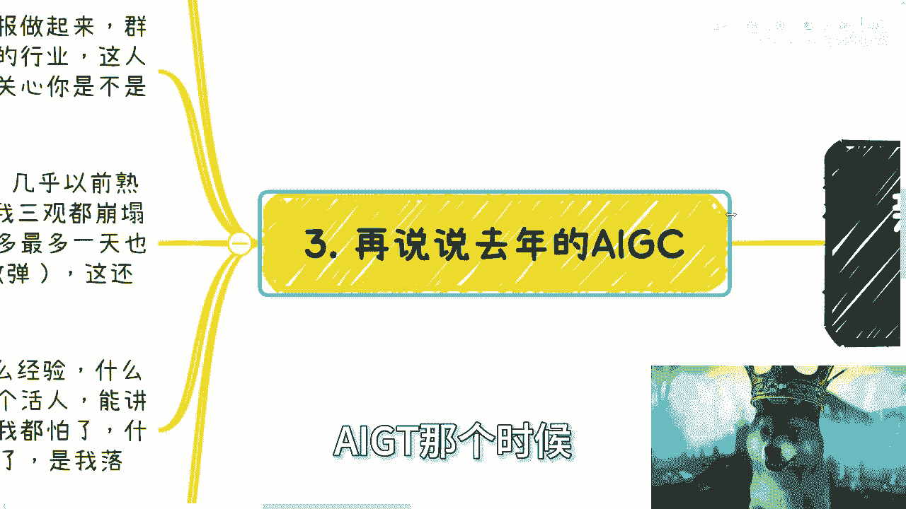

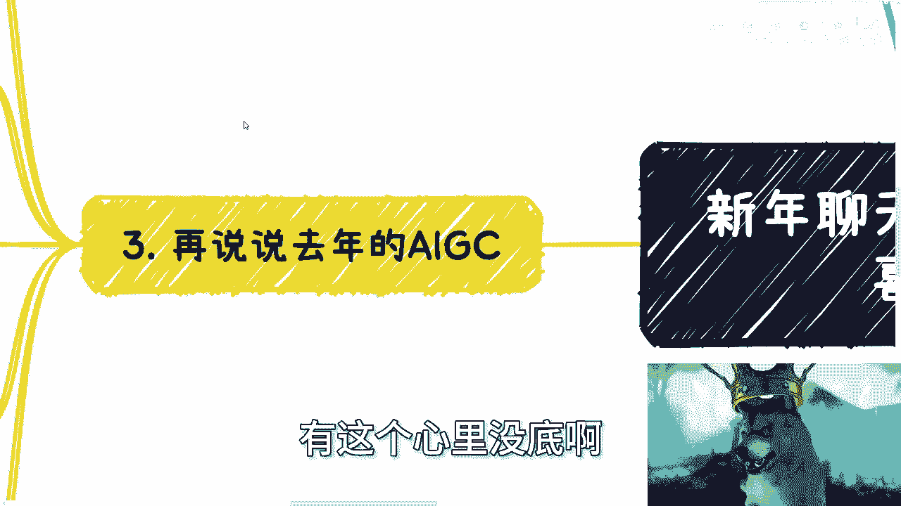

本节课中我们一起学习了近年来几个典型的行业风口案例，包括Web3数字藏品和AIGC。

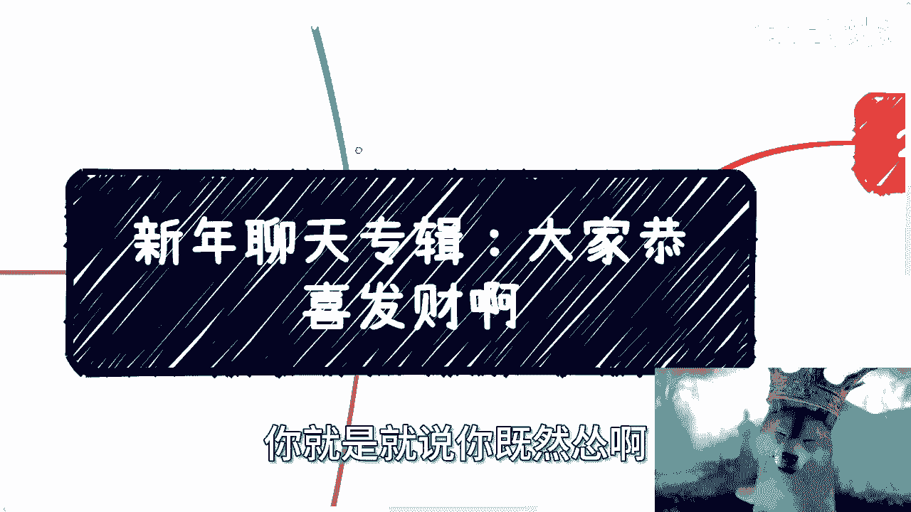

我们可以总结出以下几点核心洞察：
1.  **风口期的特征**：行业规则不完善，需求爆发式增长，对传统资质要求降低。其盈利公式可以简化为：`风口利润 = (极低的内容/服务成本) × (爆发式的市场需求)`。
2.  **机会的窗口**：“快钱”机会的窗口期很短，需要敏锐的洞察力和果断的行动力。犹豫和过度准备可能会错失良机。
3.  **模式的多样性**：除了直接面向消费者（To C）的狂热市场，还有面向政府、企业（To B/G）的、基于政策和项目的“慢钱”模式，后者更注重合规性与可复制性。
4.  **成功的要素**：在风口面前，**敢于尝试**比**准备完美**更重要。许多成功带有一定的投机性，关键在于在合规与风险间找到平衡点，并迅速执行。

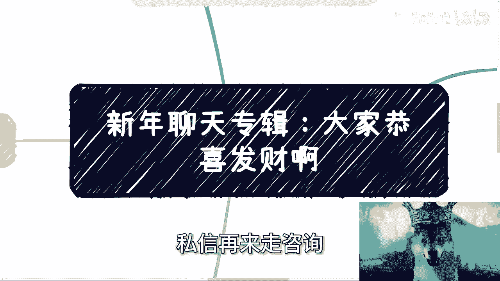

最终，能否把握住机遇，取决于个人能否在正确的时机，克服恐惧，果断采取行动。