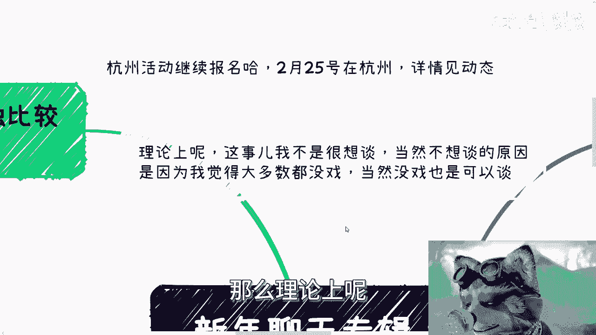
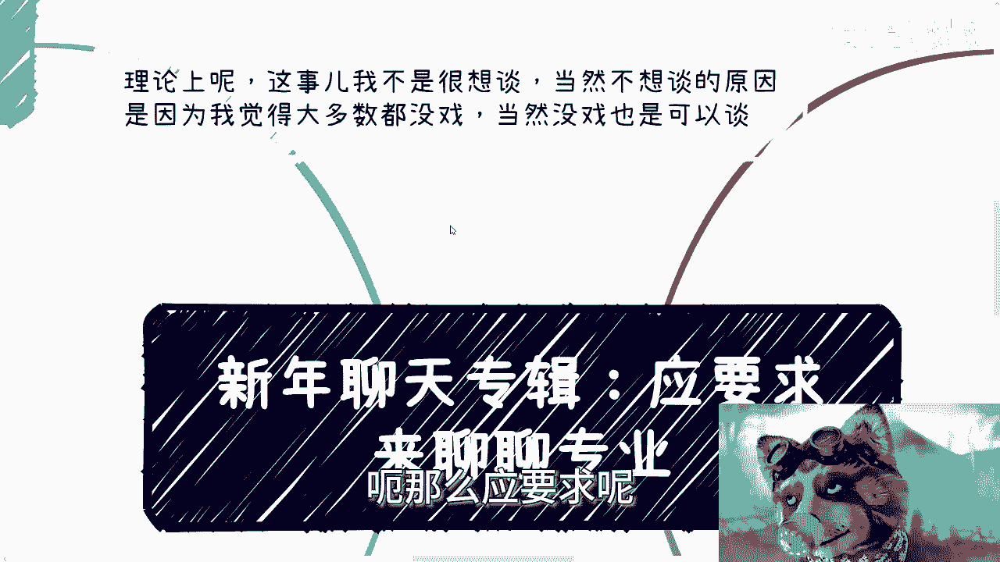
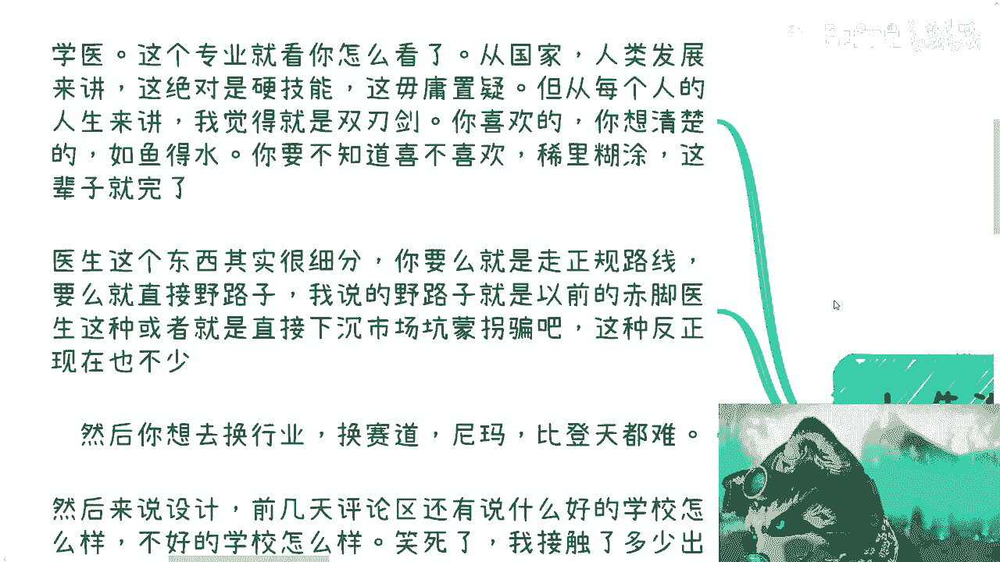
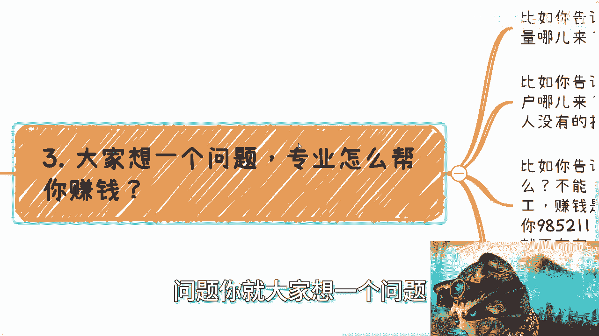
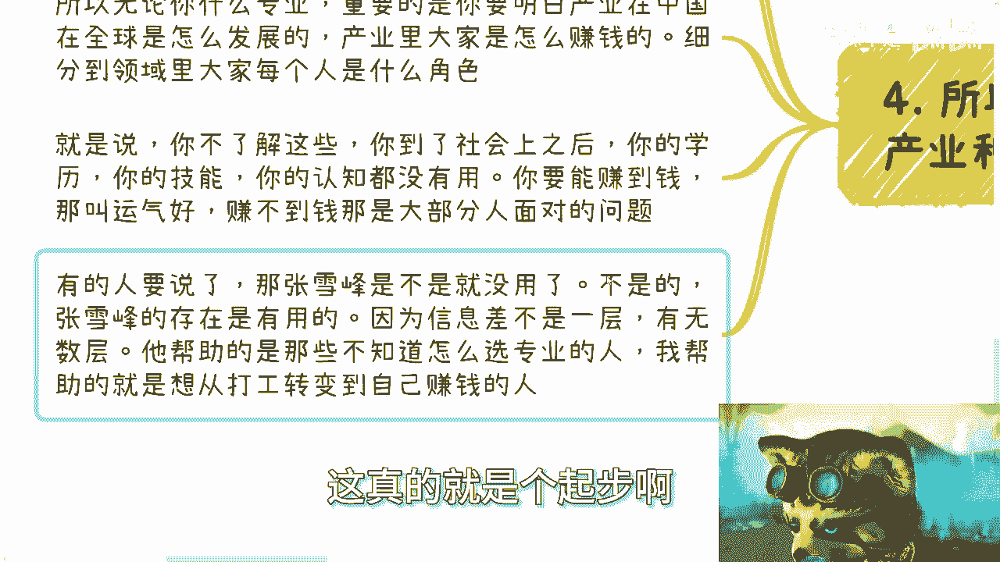

# 新年聊天专辑：应网友要求来聊聊专业 - P1 - 赏味不足 - BV1eJ4m1x7Z4

哈喽大家好，今天应该是过年最后一天了。

对吧，呃但这个聊天专辑呢我觉得蛮好的，回头我可以保留一下，就回头看看有哪些东西大家觉得可以聊的，也可以跟我讲好吧，OK好。

那么今天这期视频呢是啊，先说啊那个杭州那个活动继续报名，2月25号在杭州好吧，详情的话见动态，那么理论上呢。

今天这个专题啊我不是很想聊啊，因为本身这个专业这个东西有啥好聊的呢对吧。

他不在不在就不在，我的这个这个叫什么所讲的整个层面。

它不在一个层面上面，但是不想聊呢，也有不想来的原因，也就是说这个原因本身可以聊啊，呃那么硬要求呢。

把这个东西放在充电视频，就不用把它公开出来。

首先第一个啊，先说我几个了解的接触比较多的，你比如说学医对吧，这个专业这个专业本身就看你怎么看，因为你比如说从国家从人类发展，这绝对是个技能，这毫无疑问，但是问题是，你如果在当下这种经济形势，和整个的。

我们说各行各业的人数都是剧增的情况下，那么你从每个人的人生来讲，我觉得他就是双刃剑，就是你喜欢的，你想清楚的，那么如鱼得水，我相信你能做得好，也就是说你想做这个东西，你去做，你你不要去做的时候来跟我谈。

哎呀，陈老师，我觉得这个学医钱不多对吧，或者或者来说相比别人好，就眼红别人，比如说赚了多少钱，赚了多少钱，那你就你一开始就别做。

对不对，就是你要不知道喜不喜欢稀里糊涂的，那我跟你讲，基本上这辈子就完了，你你后面想想要有什么，你说换行也好，怎么样也好，就不太可能的呀，有一说一嘛对吧，那么医生这个东西呢其实很细分。

你要么就是走正规路线，要么就直接野路子，我说的野路子呢还不是那种，就是说你自己做诊所，因为你自己做做诊所也是需要正规资质的对吧，我说的野路子就是以前的就像赤脚医生对吧，就就就就自己做的。

或者说你就直接变成了去下下沉市场，坑蒙拐骗，那反正现在这种也不少啊，当然你说你想去换行业换赛道，我跟你讲不可能的，几乎不可能从比例概率上来讲对吧，那么这个东西跟很多那些就是，比如说你们说的教师编啊。

比如说我要做老师吧，或者我要做一些呃，比如说呃呃呃公务员电网对吧，或者你去哪里其实都一个道理，就是说你就像我昨天那期视频说的，就是你选择了国企，你要的是稳定对吧好。

你选择了电网，你选择了教师编吧，你要的又是说我要的就是稳定，那你要稳定的同时你做了一两年，你又说啊，我觉得钱太少了，那你想怎么样呢，就是说你专业这个东西，其实你说有没有说法，就像就像我第四点这边写的。

你说张雪峰有没有用有用，为什么，因为信息差，对老百姓来讲，象牙塔对老百姓来讲，它不是一层，哪里只有一层，这么容易啊对吧，你可能这个象牙塔是20层，50层啊，这么恐怖的呀，你如果一层的话，我说实话。

那今天大家也不会这样子，就整个社会也不会这样子，所以说本质上我觉得就是说专业这件事情，你要打破信息差，是在于你不知道你应该去选什么，你选了一些好的专业之后，你可能能比你现在过得好一点。

也就是说也就是说相对来讲过得好，但是同样的你从我的角度来讲，张雪峰帮助的是那些不知道怎么选专业，可能更多的是从比如说从小县城，从农村想走到城市里来的啊，当然这个只是一部对吧。

不是说你选择专业就代表一辈子，而我我的存在，我觉得我所表达的观点，其帮助的是所有的想从打工，想从被动变成主动赚钱的这些人，他两个是不冲突的，它是两层信息差。

那么然后我们再来说设计，你比如说前两天还有个评论区，说什么很搞笑的跟我说什么设计啊，差别很大的，他说好多学校出来设计怎么样，怎么样能接触到什么，海外很多好的项目诶，不好的学校怎么样怎么样，笑死了。

我觉得怎么说呢，你好的项目报好项目怎么样了呢，就是我接触过多少好的出来的，去设计院的，去什么独立工作室的，然后呢然后呢进去就9961年就那么点钱，那我就问问有什么意义吗，就是你你如果来说这么去比的话。

那我是觉得比上不足比下有余对吧，就是说你觉得二三十万是一个，你你觉得已经不错的性质了，那我只能说是比上不足，比下有余，就永远眼光往下面看，然后你觉得啊我我我做那个东西，我我赚点赚点钱可以了啊。

我就觉得运气我也认了，然后我觉得我好，作为好的学校，我就比差的学校好，那还有什么好比的呢，有什么可比的呢，你天花板就设就设在一年30万，那你来我们没什么好谈的，真的就是你要么别关注我，关注我就拉黑了。

对不对，我觉得就这么个情况，但你同样的设计这个岗位本身也非常尴尬，为什么，因为比如说你互联网设计也好，平面设计好，建筑的那种装饰设计也好，他目前都已经很泛滥了，而且最重要的问题还不在这在于设计本身。

他就是个很主观的岗位，就是很多的设计师他会觉得自己很专业，但是他的mental就是他的嗯领导或者老板，他可能不专业，或者说就就看就是他的领导和老板，可能看不出来他专业或者根本就看不懂，那我就问嘛。

你再专业也有卵用啊，啊你在创业，你再好的学校出来有卵用啊，诶我就不不明白了对吧。

首先这是第一点，第二点继续说我熟悉的，比如说计算机跟金融，我就放在一块来说了，这两个专业呢属于数学骆驼比马大啊，这个我承认啊，没问题啊，一般如果来说一般你不知道走什么专业，比如说什么二硕啊。

或者说你现在就是就是就直接是考大学选专业，或者说NBA没有什么方向，我就会推荐计算机和金融。

为什么，因为至少在你未来没有方向的时候，因为你要明白，不管你选什么专业，你30岁到35岁，你终终究会没有方向的，你们等着总早晚的事啊，那么至少到那个时候，你会发现计算机和金融。

它与别的领域的交叉性是最强的，你医疗怎么个交叉对吧，你你你你告诉我，你那个叫什么，就是呃呃呃那个建筑土木怎么交叉，交叉个屁啊，你无论什么情况都比别的专业，我只能说相对啊，只能说相对好找一些别的出路。

当然也包括一些移民啊对吧。

海外工作等等等的可能性啊，但是专业是专业工作室工作就有好多人很好，很多人跟我讲的就是说啊，这个陈老师啊，计算机跟专业跟金融行业，是不是需要很高的学历跟技能，这事儿还是那句话，你要说工作。

那我回答是yes，你要说赚钱，那我跟你说，who care对了，就这句话呀，who care鬼他妈关心，这个东西就是思维定势，我这么说啊，我接触下来非常多优秀的人，他们但凡能摸到方向的。

能有一些很好的团队合作的，绝对是你们，如果是这样的人，你们绝对能比现在好几倍甚至十几倍，但可惜的人，可惜的是，现在整个社会是没有人来告诉你们信息差，也没有人会帮助你们去戳破这层窗户纸，就这么简单啊。

那难道你跟我说，你说我98521出来，我多么多么强，我学的好，我学的这么好用的，搞笑了，有用了，你打工有用的呀。

承认的呀，你能赚钱吗，那不能啊啊那第三点就是这个问题。

你就想一个问题，专业怎么帮你赚钱，比如你告诉我，你得你会治病的好，我就问你能赚钱吗，不能为什么你会治病，谁来治啊，流量怎么来啊，凭什么相信你啊，流量怎么稳定啊，你有正规的那个那个行医执照吗，对不对。

比如你会告你告诉我你会写代码，那我请问回去会写代码，能直接赚钱吗，不能啊，你客户哪来，甲方哪来啊，人家为什么找你啊，你有什么特殊能力啊，人家为什么不去找更便宜的，比如你告诉我，你是98521出来的。

能直接赚钱吗，不能啊，哎奇怪了，怎么赚钱啊，拿这张文凭出去，怎么他妈每个月换钱来吗，哎呃你你你把这个文凭拿出去，他妈钱从天上掉下来吗，没用的呀，你去打工，打工是打工，赚钱是赚钱，我就问怎么让客户认可你。

因为难道难道因为你是9821，客户就认可你吗，因为你是北大清华就认可你吗，他妈笑死了，这逻辑从来就不存在的对吧，我还是那句话，大学生好骗，那就去骗，对不对，你们现在是大学生。

你们要是觉得你们这么一个认知就被骗了，是价值交换，价值交换背后的运作规则是什么，是金融规则，金融规则是什么，就是赚钱，你能不能给自己带来钱，你能不能给对方带来钱，就这两点没了，你看看上面这些。

这他妈都什么什么鸟毛玩意儿啊，啊这些都是虚的呀，有什么用啊，就像就像就像我就这么跟你讲，就像我们碰到一些合作方对吧，什么意思啊，哦我们聊半天，你跟我说，哎陈老师，我985211的，哎。

我这个以前什么什么国奖，拿了什么一等奖，关我吊事，我就问你能不能赚钱，怎么赚，凭什么你赚你不能赚，滚。

奇了怪了，真的是对吧，呃第四，所以重要的不在专业。

而在于产业和赚钱的方式，就是说专业是什么，是技能，技能是什么，是赚钱吗，不能技能，只能打工，所以无论你是什么专业，重要的你要明白产业，比如计算机，互联网，土木建筑啊，或者房地产啊，这么说。

那么包括就是说当然不仅不仅仅房地产啊，包括什么什么什么什么细分的话，比如说什么产业园啊，什么什么商超啊，对吧什么呃，什么别墅啊对吧，这种各个地方都算的那么重要的是，你要明白你专业所处的产业。

在中国和全球是怎么发展的，产业里大家是怎么赚钱的，你别去管专业专业他妈的有什么卵卵用啊对吧，就是说细分到领域，大家每个人是什么角色，凭什么你是能这个角色，也就是说你不了解我们上面说的这些。

你到了社会之后，你的学历，你的进了你的认知没有用啊，因为你要能赚到钱，那叫运气好，赚不到赚不到，这就叫这就叫普通人，这就叫大部分人面对的问题，因为你不懂啊，你怎么转啊，然后就像我刚刚说的。

张雪峰不是没有用，张雪峰有它存在的价值，因为对于所有的人来讲，外面的向阳台有很多层，我们需要有人来打破，我们需要有人真正的想去打破的人去打破，但是很可惜的是，就算专业，你们选好了，这就是个起步啊。

这真的就是个起步啊。

好吧，我还是那句话，你们现在可能还年轻啊，可能还年轻，你们但凡能记住我跟你们讲的，你们30岁到35岁，这个阶段一定会明白我所说的东西，但是如果你要等那个时间明白的话，你基本上就已经没救了。

我就这么就就只能这么说了，怎么办呢，好吧那这个问题我们就聊到这儿，要参加活动的，反正过来参加活动，要咨询和那个商业咨询规划或者其他的，反正你们在整理好。

