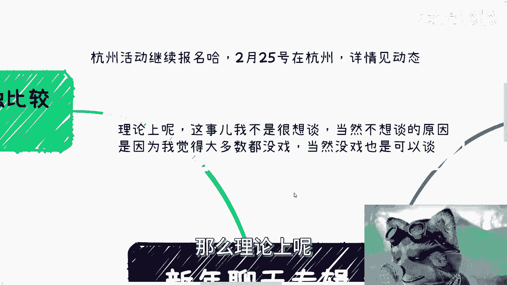
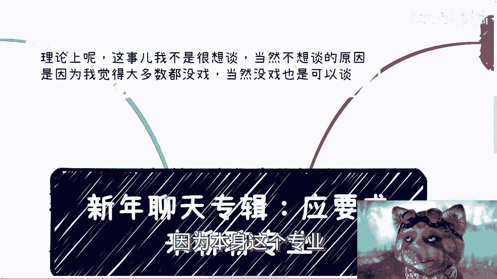
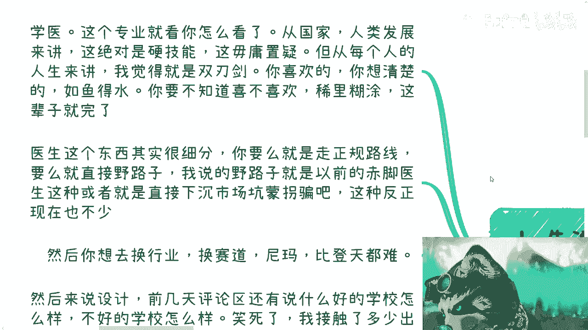
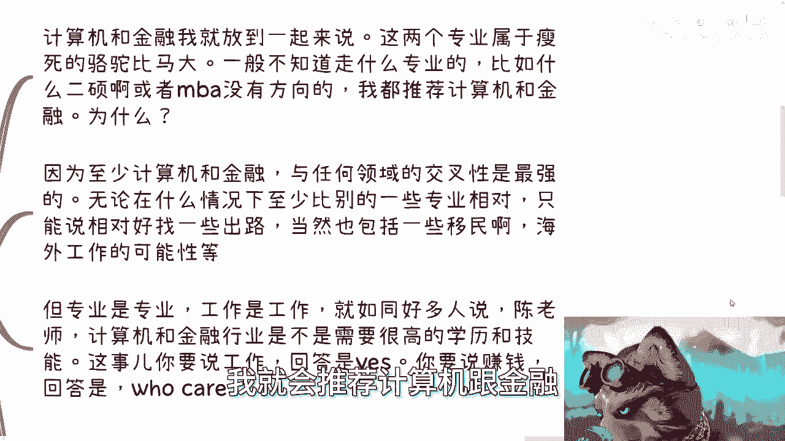
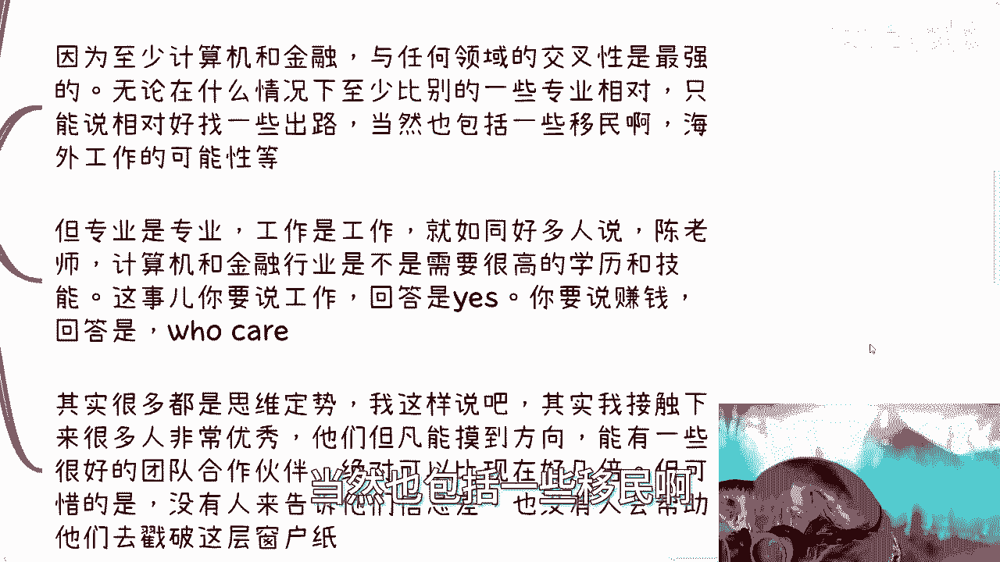
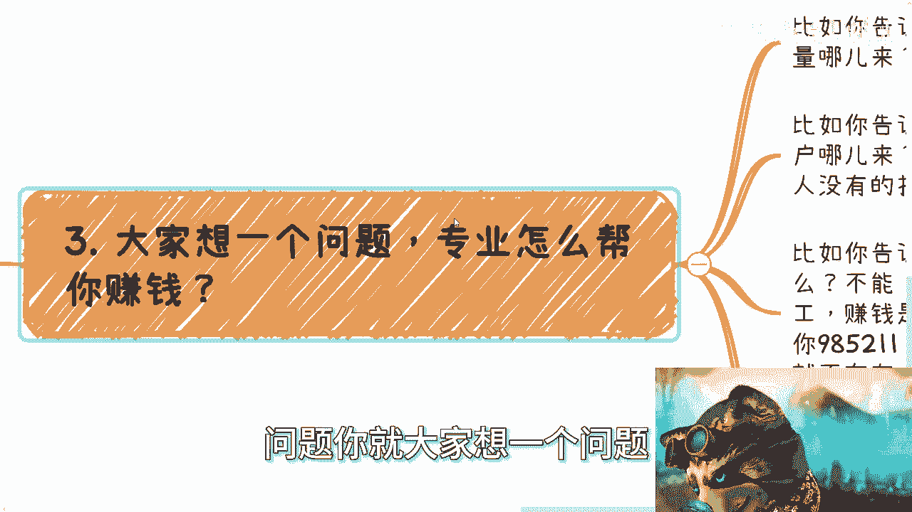
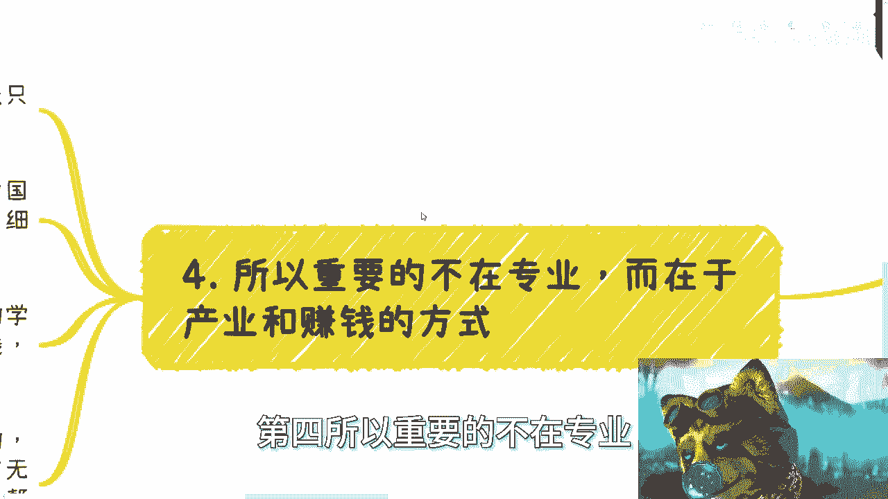
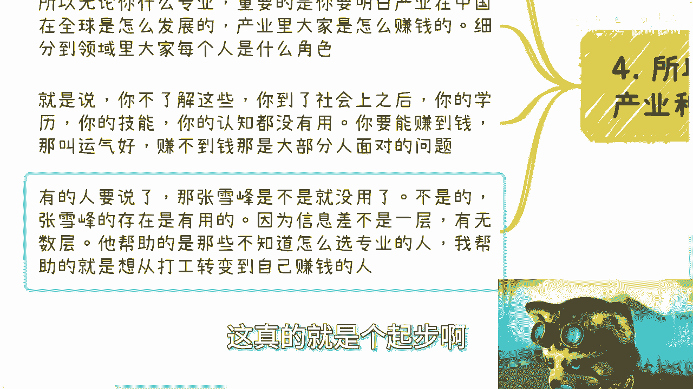

# 新年聊天专辑-应网友要求来聊聊专业---P1---赏味不足---BV1eJ4m1x7Z4

在本节课中，我们将探讨一个常见但容易被误解的话题：大学专业选择与个人职业发展的关系。我们将分析几个热门专业的现状，并揭示专业、技能与赚钱能力之间的本质区别。

---

## 概述：专业选择的迷思

许多人认为选择了一个“好”专业，就等于拥有了光明的未来和赚钱的能力。然而，这种看法忽略了更重要的因素。专业本质上是**技能**的集合，而技能本身并不直接等同于**赚钱**。赚钱的核心在于理解产业运作、市场需求和价值交换的规则。

上一节我们概述了核心观点，本节中我们来看看几个具体专业的案例分析。

## 案例分析：医学与“稳定”类专业

首先，我们讨论几个接触较多的专业，例如医学。

医学专业本身是一项重要技能，对人类发展至关重要。但在当前经济形势和行业竞争加剧的背景下，它对个人而言是一把双刃剑。

以下是选择此类专业需要考虑的关键点：

*   **兴趣与决心**：如果真正热爱并想清楚，可以如鱼得水。如果只是稀里糊涂选择，未来想转行或改变会非常困难。
*   **职业路径**：路径基本固定，要么走正规医院路线，要么尝试其他方式（如开设诊所，但需资质）。彻底转换赛道（如跨行业）的概率极低。
*   **“稳定”的代价**：这与选择教师编制、公务员、电网等岗位是同一逻辑。选择这些专业或岗位，核心诉求往往是**稳定**。但选择稳定后，又抱怨收入不高，这本身是矛盾的。

## 案例分析：设计类专业

接下来，我们看看设计类专业面临的困境。

设计岗位目前已经非常泛滥。更关键的问题在于，设计工作具有极强的主观性。一个设计师可能觉得自己很专业，但他的上级或客户可能无法识别或根本不在意这种专业性。

在这种情况下，专业技能的价值大打折扣。此外，设计行业的收入天花板往往较低，如果从业者将自己的比较对象设定为更差的学校或同行，从而感到满足，那么其发展潜力将非常有限。

## 核心推荐：计算机与金融

对于许多不知如何选择专业的人，我通常会推荐计算机和金融。

**推荐逻辑**：`计算机` 与 `金融` 这两个领域，与其它产业的**交叉性**最强。无论未来形势如何变化，当你到30-35岁可能面临职业迷茫时，这两个专业背景能为你提供更多元的出路可能性（包括跨界发展、海外机会等），相对而言比其它专业更有灵活性。

然而，这里必须区分两个概念：
*   **找工作**：在这些领域找到一份工作，通常需要不错的学历和技能。
*   **赚钱**：能否赚钱，与学历和技能没有必然联系。赚钱关乎商业思维、发现机会和创造价值的能力。

## 核心矛盾：专业、技能与赚钱

现在，我们来思考一个根本问题：专业如何帮你赚钱？

无论是会治病、会写代码，还是拥有名校文凭，这些**技能**或**凭证**本身都不能直接产生金钱。

**赚钱的核心公式**可以简化为：
`价值创造` + `价值交换` = `赚钱`
而驱动这个公式的规则是**金融规则**，即：你能否为自己和他人带来经济利益。

客户不会因为你是名校毕业就认可你。社会认可的是你解决实际问题的能力，以及你带来的经济价值。学历和技能是入场券，但不是赚钱的保证。

## 结论：比专业更重要的事

因此，重要的不在于你选择了什么**专业**，而在于你理解了什么**产业**以及其中的**赚钱方式**。

专业是技能，技能主要用于打工。无论什么专业，你必须明白：
1.  你专业所属的产业（如互联网、房地产、医疗）在中国乃至全球是如何发展的。
2.  该产业中，各个参与者是通过什么方式赚钱的。
3.  你在这个产业中能扮演什么角色，以及凭什么你能扮演这个角色。

不了解这些，进入社会后，你的学历和认知可能无法有效转化为经济收益。这时，赚钱更多靠运气，这也是大部分普通人面临的困境。

像张雪峰老师提供的服务有价值，因为它帮助很多人打破了第一层“象牙塔”的**信息差**，在专业选择上做出了更优决策。但这仅仅是**起步**。真正的挑战在于踏入社会后，如何突破更深层的信息差，掌握产业和赚钱的逻辑。

---

## 总结

本节课中我们一起学习了：
1.  专业（技能）与赚钱能力是两回事。
2.  选择医学、师范等“稳定”类专业，需明确其代价与个人志向是否匹配。
3.  设计等主观性强的专业，面临市场泛滥和价值认可度的挑战。
4.  计算机和金融因其强交叉性，在提供职业灵活性方面具有相对优势。
5.  赚钱的核心是理解价值创造与交换的金融规则，而非单纯拥有技能或文凭。
6.  比选择专业更重要的，是理解产业运作模式和其中的盈利方式。

希望今天的讨论能帮助你以更现实的视角看待专业选择与职业发展。记住，选择专业只是一个起点，持续学习产业知识和商业思维，才能更好地驾驭未来的职业生涯。