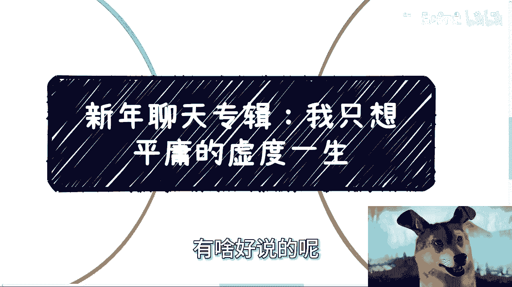
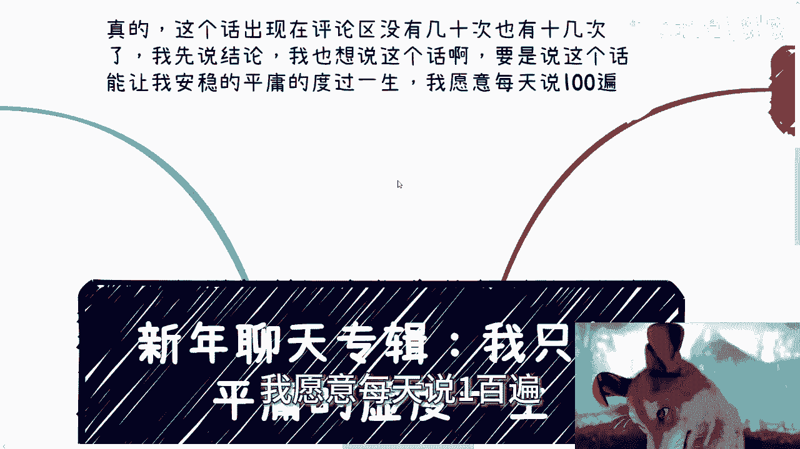
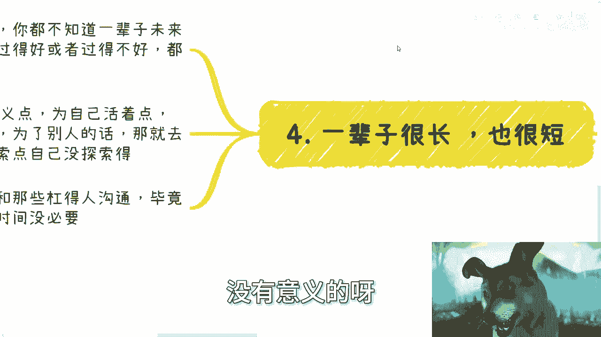
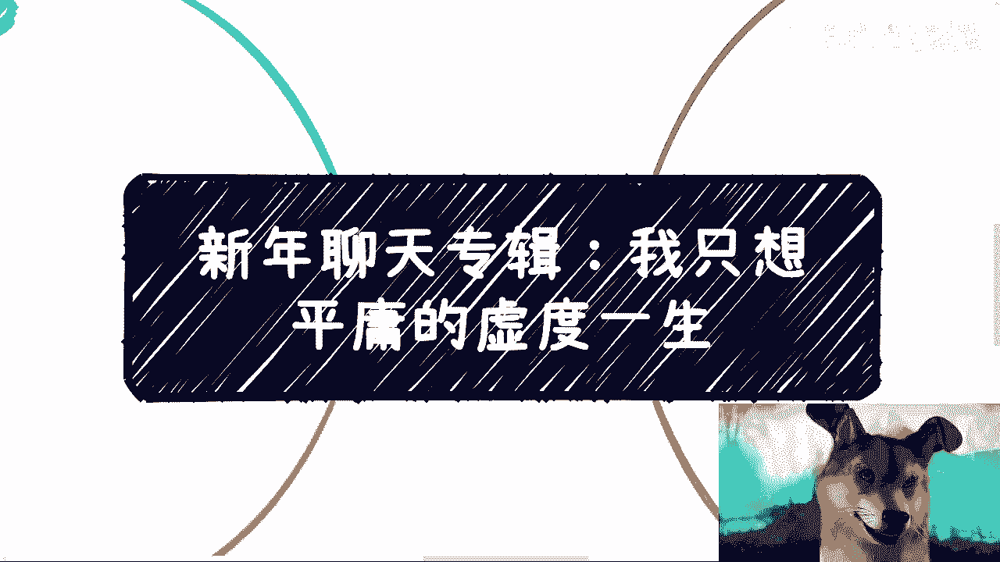

# 新年聊天专辑：我只想平庸的虚度一生 - P1 - 赏味不足 - BV1ZH4y1h7R9

啊大家好啊，恭喜发财，恭喜发财。

嗯嗯然后今天我们这个聊天专辑啊，这个还好有新年聊天专辑要没有聊天专辑，这主题我都不想讲，有啥好说的呢。

是吧啊，首先啊我跟你讲啊，就这个话，这句话出现在评论区，他妈没有几十次，也有十几次，我说结论啊，我先说结论就是咳咳妈这话我也想讲啊对吧。

你要说这话能让我安稳的平庸的度过这一生，我愿意每天说100遍。

对不了，那他妈有用吗，那没有用的呀。

哎你看啊，第一点谁不想，我也想，那么这一切他妈是我想的吗，那么我们想的有用吗，对吧，哎你首先你看啊，没人是先知，谁谁不平庸啊，我早说了，能平庸的度过一辈子，对大部分人来讲，他叫奢望。

你能一辈子能这么安稳的度过吗，你没钱，你怎么过啊，我就问，你就拿我来讲吧，我从小外婆外公带大的，我从小基本上晚上没睡什么觉，基本上忙着就晚上摆摊，就每天就是下午啊，就是上完学摆摊卖报纸卖书，摆摊经济。

我跟你讲，摆摊这个事难点不在于摆摊本身，难点是在于他要准备，他要比如说摆摊啊，摆摆这个布局啊对吧，然后早上去去这个啊进货啊啊，基本上双休日早上五点钟进去进货，进那种报纸啊，进那种书啊，每天都要来回一次。

你你报纸当天的啊，比如说在以前那个以前的那种新闻，晚报什么的啊，呃你看我我以前做活动啊，包括这个，我最早的时候在那个超市里面做实事员，他是我想吗，那我不想躺平吗，我也想啊，那我家里没钱，没有人。

你让我怎么在上海生存，那不得赚钱呢，那你问我怎么赚，我又不会，那怎么办呢，不得去打工啊，我制作活动是我想的吗，不还是因为早年找不到工作，没有变，没有办法，也不能一直闲着，这不是为了找出路吗。

哎你你你你你你说我不想平庸的度过这一生吧，那我怎么度呢，这话谁都可以讲，你真的能安稳的度过一生吗，能吗，你前面20年30年，你后面怎么读啊，你但凡我跟你讲啊，你但凡不走极端，你是个普通人，你怎么安稳。

别跟我说什么回老家，他妈的过得很好，他妈像我这种没有老家的，没有房的，没有钱的，的，你告诉我回哪，你不靠自己，怎么你就跟我每天在那边路上就写一句话，我他妈竖个牌子写句话，我想平稳的平庸的。

安稳的度过这一生，然后呢他妈的旁边放个碗，有用了，没有用啊，主要是，第二点啊，我曾经就说过很多遍是什么，我说我真的也想好好打工打一辈子啊，为什么，因为打工不折腾啊，打工不累啊，我还能摸鱼啊。

哪这么多逼事啊，你们但凡去折腾着，你们就会知道了，这里面B事多了去了，哪这么多这样那样的问题，哪这么多啊，你现在看对吧，因为我性格心态都改过来了，也就没这么难过了，但过程中这改变很难啊。

你面对的问题很多啊，你你你你面对的痛苦，面对的纠结也很多啊，我也说啊，我说我也没有说要求什么大富大贵啊，租房也租房也行啊，我写错了对吧，租房也行啊啊也可以不买房啊，也也可以不谈结啊，不谈对象。

不结婚无所谓啊，那你每个月要赚点钱吧，你要让自己心里有点底吧，你要让你要让你这个比如说父母啊，或者养你的这些老人未来有点保障吧，你但是问题是，这太太平平安稳的日子是我们说了算的吗，那不是啊。

你别跟我讲那些有的没的案例，就像我现在跟很多人沟通的时候，要永远他妈跟我讲虚的，你虚的有什么好讲的呢，你跟我讲那些有的没的案例，我们是普通人，普通人就是被丢来丢去的，这叫普通人呀，哦很多人现在我就说啊。

我说很多人现在还年轻，可能还没有经历到，但事实是什么呢，事实就是说所谓的普通人，你想安稳的打工打一辈子，这他妈叫奢望，哪这么这么容易啊，我以前其实跟很多人在很多场合说过很多遍，能他妈安稳打工。

谁愿意去折腾啊，我吃饱了撑的折腾啊，哎你你你折腾了也不代表你大富大贵，你折腾了还得又得又得伤感情，又伤钱，又伤很多东西，你谁愿意折腾啊，我从小梦想就是下班直接打各种游戏对吧，那买个买个PS4。

买个PS5，那他妈不爽吗，不香吗，我现在买个买个游戏机，他妈放在旁边，每天打打，不开心吗，所以说啊我觉得就是你看啊，这个我第3年写的叫什么，写他妈说这么多有卵用，你看啊，其实网络上说的都有屁用啊。

来杠的来说的，包括你们身边来杠你们的，我可以说基本上都是靠父母靠，靠家里，为什么你一个十几岁20几岁的，你靠什么，你就告诉我靠啥，但凡能够靠自己的说话不会这么轻飘飘的，就这么简单。

这个经受过社会毒打的谁这么轻飘飘啊，所以没法沟通，人各有命，你说投胎是不是门学问，我说可以是你没有办法，所以说为什么这么多事会有争论，因为我对于那些讲，就是那你比如说对我这种从小面临就是生存。

我每走一步考虑的都是生存问题，这种人对很多人压根从小到大，不不存在这个问题，当然社会也有进步嘛对吧，对于很多人不存在这个问题的，这些人其实都有退路，这些人那大家有什么好沟通的，没法沟通。

这就像我一直以来希望大家能活得明白对吧，难得活的难得活一次，你多出去闯闯，但很多人其实没什么压力，你没有压力，自然也就没这么多动力，然后说啊超20，你说的根本跟这我们这种普通人无关。

是啊那是和一般普通人无关啊，那些一般普通人哪有我这种生存压力呀，但我还是那句话，你去看看中国的中国的人均收入，中国人均一年的人均收入，你自己去看看啊，谁是普通人，谁到底是普通人。

你20222年到2023年，人均收入2万8，最多就3万2，一年，你们再看看你们自己，再看看你们身边，然后第四点对吧，一辈子很长也很短，你我我我还是那句话，动不动就跟我说，一辈子一辈子。

你不知道一辈子未来发生什么事，无论你现在过得好或过得不好，都是暂时的，总一辈子一辈子挂在嘴边没有意义的啊，就动不动跟我说啊，陈老师，我就想安稳的平庸的，能安稳能平庸吗，你如果真的能安慰你的平庸。

也是因为你家庭造成的，也是你父母的功劳，跟蛋关系啊对吧，而且我说句不好听的，我们也会老，父母也会老，等父母百年的那一天以后呢，你不活了不活了，你后面怎么安我，你要觉得这辈子活的有点意义对吧，为自己活的。

而不是为家庭，为了父母，也不是为了别人，那就去多做点自己没做过的，多探索点自己没探索的，而不是一味的去杠，或者说去跟那些杠你的人去沟通，那你毕竟你要这么想啊，你一辈子时间是固定的。

浪费时间去跟这种人沟通干嘛呢，没有意义的呀。

你你你你说这么多这种特有的没的这种话，我实在是也没想明白，这种讲完就除了喝鸡汤，你包括包括那个呃昨天还是今天啊，我在微博上看到有个有个鸡汤，说什么呢，说什么哦咳咳说什么啊。

这个从小啊什么什么有些成功的人，然后他们讲出来了一些话，或者是怎么样子没有用的呀，所有都是虚的，你包括今天中午，今天中午吃饭也是的啊，跟我提那个场地场地，然后说啊多少多少钱对吧，就问我这个钱啊。

觉得这个值不值得，我说是这样子的，我出钱要场地的吧，可以的，要么你这个场地能让我赚到钱，要么就这场地能让我赚到B对哦，你既不能让我赚到钱，也不能赚到B，那你给我开个价，你问我这个场地值不值得，那不值得。

有什么好说的，就不值得，剩下的都是虚的，然后比如说你跟我说，你能帮我宣传怎么了，我缺你宣传啊，你你帮我，你帮我拉到点人，我怎么了，我劝你拉到点，这些人啊，说到底都是虚的对吧。

所以就是哎呀何必呢，嗯真的，我觉得之前有一个小姑娘在短视频上面，她讲的很有道理，就是现在大部分人因为就这个思想啊，这脑子啊，这都是被这种短视频啊，被这种网络上的这种虚的东西，就是说，哎呦就是习惯了吧。

习惯了，就是就是大众听那种虚的话，听的习惯了，然后自己讲出来也是那种虚的话，但讲出来没有用，好吧行吧，那这个聊天反正就随便扯扯啊，呃有啥，反正我们明天开始约咨询好吧，大家有啥整理好好吧。

