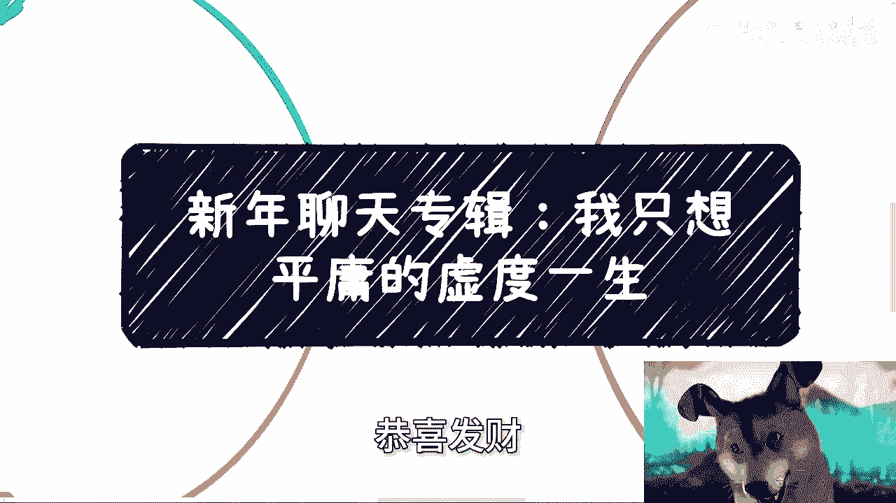
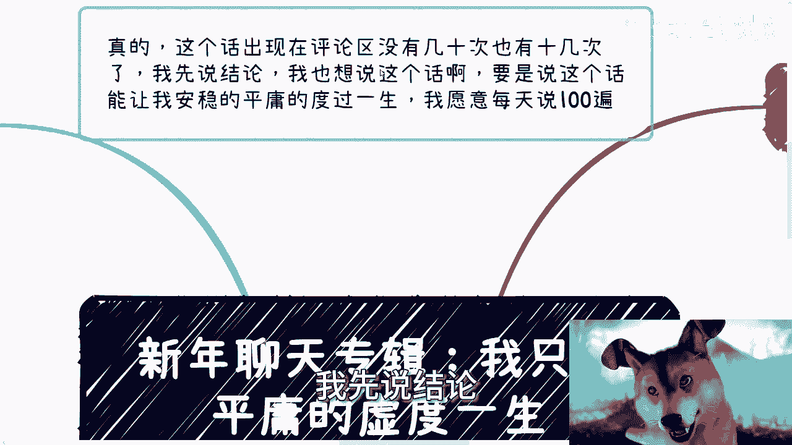
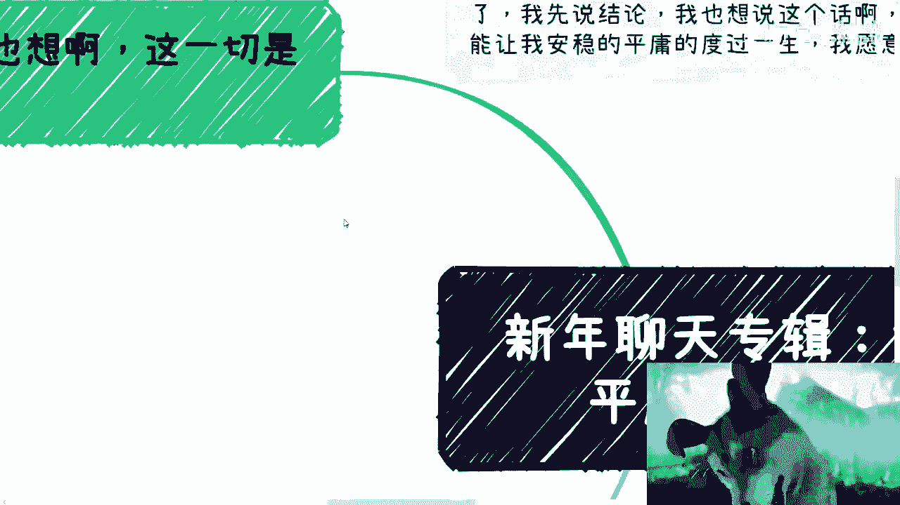
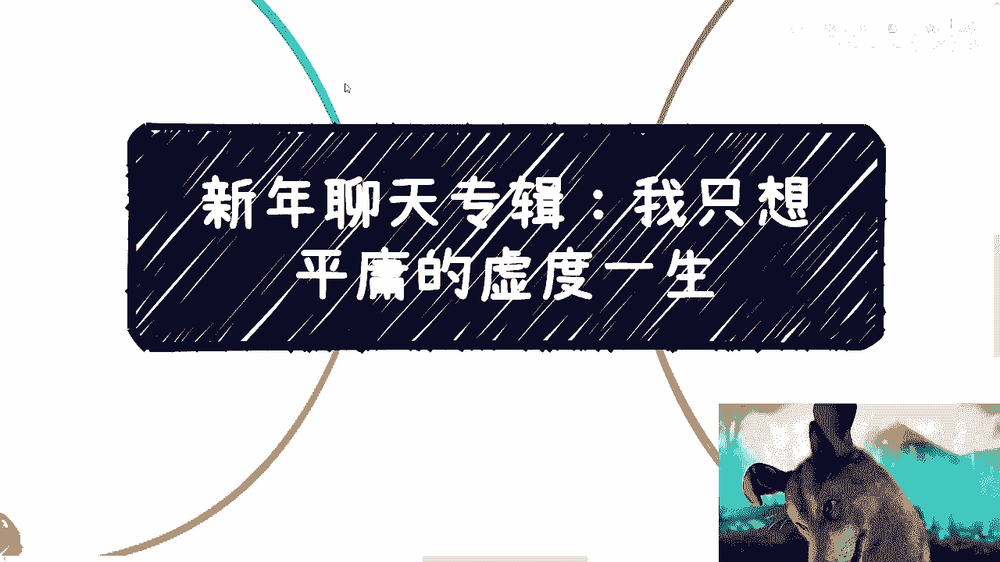

# 新年聊天专辑：我只想平庸的虚度一生 - P1 - 赏味不足 - BV1ZH4y1h7R9

## 📝 课程概述

在本节课中，我们将探讨一个在网络上频繁出现的话题：“我只想平庸地虚度一生”。我们将分析这句话背后的现实困境，并讨论个人选择、生存压力与社会现实之间的关系。课程将帮助你理解，对于大多数人而言，“安稳平庸”并非一个简单的选择，而可能是一种奢望。

---

## 🧐 核心观点：愿望与现实的鸿沟

这句话频繁出现在评论区。结论是：如果这句话能让我安稳平庸地度过一生，我愿意每天说一百遍。

但这是没有用的。

---

## 🔍 第一点：谁不想安稳？但现实允许吗？

上一节我们提到了愿望与现实的差距，本节中我们来看看现实的具体挑战。

谁不想安稳平庸？我也想。但这一切是我能决定的吗？我们的想法有用吗？没有人是先知，谁又真正平庸？我曾说过，对大部分人而言，能平庸安稳地度过一辈子是一种奢望。

没有钱，如何安稳度过？以我为例，我从小由外公外婆带大，晚上基本没怎么睡觉，因为要帮忙晚上摆摊。每天下午放学后就去摆摊卖报纸、卖书。摆摊的难点不在于摆摊本身，而在于准备工作：规划摊位、早上进货。双休日早上五点就要去进报纸和书，每天如此。

以下是早年为了生存而从事的工作：
*   在超市做理货员。
*   参与制作活动，因为早年找不到工作，不能闲着，必须找出路。

你问我是否想平庸度过一生？那我该如何度过？谁都可以说这句话，但你真的能安稳度过一生吗？前面二三十年或许可以，后面呢？只要不走极端，作为一个普通人，你很难安稳。

别跟我说回老家过得很好。像我这样没有老家、没有房、没有钱的人，能回哪里？不靠自己怎么办？难道每天在路上举个牌子写“我想平稳平庸地度过一生”，旁边放个碗就有用了吗？没有用。

---

## 💼 第二点：打工的幻想与折腾的现实

上一节我们讨论了生存的基本压力，本节中我们来看看另一种看似简单的选择：打工。

我曾多次说过，我也想好好打一辈子工。因为打工不折腾、不累，还能摸鱼。哪有这么多麻烦事？但凡自己折腾过的人就会知道，这里面麻烦事多了去了，会遇到各种各样的问题。

现在我的性格和心态已经调整过来，感觉没那么难了，但改变的过程本身就很艰难。你面对的问题、痛苦和纠结非常多。

我也没有要求大富大贵。租房也行，可以不买房，可以不谈恋爱、不结婚。但你每个月总得赚点钱，让自己心里有底，让父母或抚养你的老人未来有点保障。

问题是，这种太平安稳的日子是我们说了算的吗？不是。

别跟我讲那些虚的案例。我现在跟很多人沟通，他们总爱讲虚的。虚的有什么好讲？我们是普通人，普通人就是被社会洪流裹挟、丢来丢去的，这才叫普通人。

很多人现在还年轻，可能还没经历到。但事实是，所谓的普通人，想安稳打一辈子工，这叫奢望。哪有那么容易？我以前在很多场合说过很多遍：**能安稳打工，谁愿意去折腾？**

折腾不代表就能大富大贵，折腾还会伤感情、伤钱、伤很多东西。谁愿意折腾？我从小梦想就是下班打各种游戏，买个PS4、PS5，不开心吗？我现在买台游戏机放旁边，每天打打，不香吗？

---

## 🌐 第三点：网络争论与现实根基

上一节我们剖析了打工与创业的困境，本节中我们来看看这些观点争论的根源。

我第三年时写道：说这么多有卵用？其实网络上说的都是屁用。来抬杠的、来说教的，包括你们身边来抬杠的人，我可以说基本上都靠父母、靠家里。

为什么？一个十几二十岁的人，靠什么？但凡真正靠自己的人，说话不会这么轻飘飘。就这么简单。经受过社会毒打的人，谁会说话这么轻飘飘？所以没法沟通。

人各有命。投胎是不是一门学问？可以说是，但你没办法。这就是为什么会有这么多争论。对我这种从小每一步都考虑生存问题的人，和那些从小到大根本不存在生存问题、都有退路的人，有什么好沟通的？没法沟通。

我一直希望大家能活得明白。难得活一次，多出去闯闯。但很多人其实没什么压力，没有压力，自然就没有动力。然后他们说：“你说的跟我们这种普通人无关。”

是啊，是和一般“普通人”无关。那些“一般普通人”哪有我这种生存压力？但我还是那句话，去看看中国人均收入。2022年到2023年，人均年收入大约在2万8到3万2之间。再看看你自己，再看看你身边。谁是普通人？谁到底是普通人？

---

## ⏳ 第四点：一生的长度与意义

上一节我们讨论了不同人群的生存现实，本节中我们最后来思考“一生”这个概念。

一辈子很长，也很短。我还是那句话，不要动不动就把“一辈子”挂在嘴边。你不知道未来会发生什么，无论现在过得好不好，都是暂时的。总把“一辈子”挂在嘴边没有意义。

动不动就跟我说：“老师，我就想安稳平庸。”能安稳能平庸吗？如果你真的能安稳平庸，那也是你家庭的功劳，是你父母的功劳，跟你有什么关系？

而且说句不好听的，我们也会老，父母也会老。等父母百年之后呢？你不活了吗？后面怎么安排？如果你觉得这辈子要为自己活，而不是为家庭、为父母、为别人，那就去做点自己没做过的，多探索没探索过的。而不是一味地抬杠，或者去跟那些抬杠你的人沟通。

你要这么想：你一辈子的时间是固定的。浪费时间去跟这种人沟通干嘛？没有意义。

---

## 🧠 总结：拒绝空谈，关注实际

本节课中我们一起学习了“我只想平庸地虚度一生”这个话题背后的多层含义。

我们分析了四个核心点：
1.  **愿望与现实的冲突**：安稳平庸对多数人而言是奢望，受经济基础制约。
2.  **选择的困境**：看似简单的“打工”路径也充满不确定性，主动“折腾”往往源于生存压力。
3.  **认知的差异**：网络争论常源于不同人群（如“有退路者”与“生存压力者”）现实根基的根本不同。
4.  **时间的意义**：“一生”是动态的，与其空谈或争论，不如将时间用于有价值的探索和自我实现。

讲这么多虚头巴脑的话，除了喝鸡汤有什么用？包括昨天或今天在微博上看到的鸡汤，讲什么成功人士的故事或话语，都没有用。所有都是虚的。

比如今天中午吃饭，有人跟我提一个场地，问我觉得花多少钱值得。我说：我出钱要场地，要么这个场地能让我赚到钱，要么能让我赚到名声（B）。如果两者都不能，那你问我值不值得？不值得。剩下的都是虚的。你说能帮我宣传？我缺你宣传吗？说到底都是虚的。

所以，何必呢？之前有个小姑娘在短视频里讲得很有道理：现在大部分人的思想、脑子，都被短视频、网络上这些虚的东西惯坏了。大众听惯了虚话，自己讲出来的也是虚话，但讲出来没有用。

---

**行吧，这次聊天就随便聊聊。有什么问题，我们明天开始可以预约咨询，大家好好整理思路。**