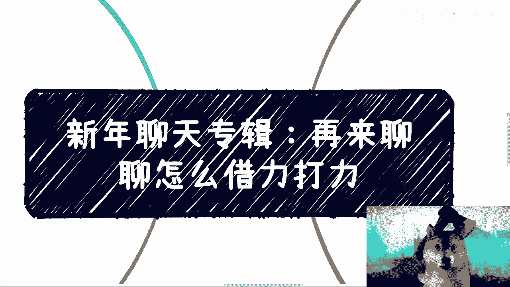
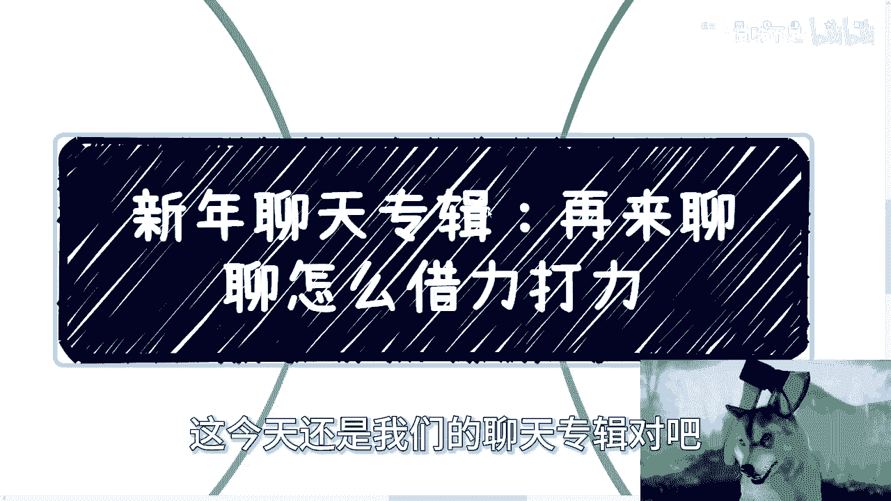
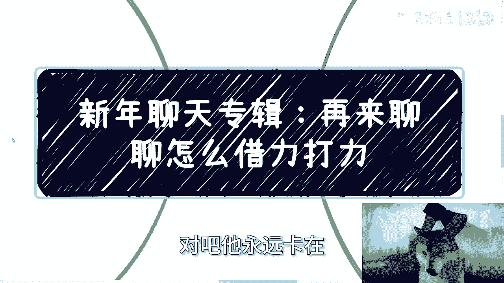

# 新年聊天专辑：再来聊借力打力 - P1 - 赏味不足 - BV1qt42187vk

大家好啊。

嗯再次祝祝大家新年快乐啊，今天还是我们的聊天专辑对吧。

这个之前有好多小伙伴让我再来聊一下，这个借力打力的问题啊。

呃我再给我，我就重新给大家做一下整理，从另外一个角度啊，呃首先今天啊我是狗哥是吧，我是狗哥啊，呃第一啊叫初级的借力打力啊，初级借力打力呢其实说白了啊，就是呃我到我最后会说的，就是我们自己大部分人呢。

嗯有没有能力去做一件事情并不重要，因为在我看来，你有能力也好，没有能力也罢，你一个人其实是成不了事的啊，就是你今天不管是你你你读书读的很好也好，或者你商业很牛逼也好，没有用啊，你一个人永远成不了事啊。

所以你说你是不是有能力去做一件事情，这个是个伪命题啊，呃所以初级的借力打力呢就是看你缺什么，然后去补什么，比如说啊你说你有产出内容的能力，那么你缺什么呢，缺渠道，缺市场，缺商务对吧，好，那么你去找啊。

你可以找野路子的那种，比如说kl对吧，你也可以找那种企业化运作的，MCN或者别的机构啊，你看我这边的这个分类啊，也就是说呃QL啊是那种C端啊，所以说在企业端或者在这种商业层面，其实统称为这种野路子啊。

但是你要说企业化运作的MC或者别的机构呢，哎这个地方也也不代表他不野路子啊，所以说就是你们看一下这个描述啊，只不过是这个区分上有问题啊，有些区别啊，那么有的人说呢，这个我什么都没有啊，能一样，我跟你讲。

你去找你和产出内容的人说你有很多渠道，你和渠道说你有很多产出内容的人，这不就是我们一直常用的空对空吗，对吧，这也是商业商惯用的手段，哎呀你别说什么，我跟你讲，你在这个上面你就别跟我说骗不骗人，为什么。

因为第一你也没骗人钱财，第二你也没杀人放火，你要最终能成，那就不叫骗，你要不能成，那又怎么滴呢对吧，那怎么地呢啊最多就是人家说被你白嫖是吧啊，呃如果你还觉得就是要问了，别人为啥要跟你合作或者相信你啊。

我觉得本质上的问题在于你不行，呃就是同样是空对空，那为什么有的人性你不行呢对吧，那我觉得呃可能你的口才不行，你的描述不行的，画饼不行，那去锻炼对吧，这是第一啊，第二咳咳进阶型的借力打力啊。

我们继续来看，那在我看来呢，进阶型的借力打力并非是一种做项目的方式，也就是说呃，我就不从那种什么项目当中来给大家做案例，我觉得进阶实行的这种借力打力，更像一种呃商业模式。

或者说更像一种比较宏观的自我护城河，铸造的铸造的一种方式，进阶的方式呢其实其实在日常也进了很多，就是你说它是一家企业吧，它的确是啊有很多的合作方啊，但是你说他是个小团队吧，甚至是个人吧，也对啊。

这毕竟除了他，他看上去是家企业，但是其实可能他就一个人啊，或者说他也没什么团队，就所谓的团队也就2~4个人，基本上都是销售市场啊，商务这种，那你说他到底是算一个企业的，或者算算这种杂牌军的对吧。

就有很多人可能会觉得这是草台班子啊，呃但这个并不重要，因为在我看到的这种商业合作里面啊。

这种属性的人或团队，其实他们的价值是非常高的，而且他们很赚钱啊，说实话他们很赚钱，他们比你们所看到的那种什么全明星阵容，什么什么清华北大出来的哎呀赚钱的多，什么都是垃圾啊，但你要知道这种团队呢。

这种人在社会上对吃得开，为什么，因为他们上上下下，三教九流关系都积累，他们自身的护城河，就是这种关系，那么有人就要问了，他说这种关系呢按照道理来讲都是弱关系对吧，怎么能成为护城河，对我跟你讲。

这个就是他们巧妙的地方，因为这些弱关系一旦多了之后，就会变成他们的背书和案例，也就是说他们并没有，他们也不会从这些弱关系升上去赚到钱，说不好听点，这些弱关系可能也不会让他们赚到钱。

但是大家碍于嗯就中国这种做视频方式，或者说呃碍于做商业的这种方式，大家还是就像我们以前说的嘛，就表面上你好我好，大家好嘛，就不会说什么撕逼啊或者怎么样的啊，呃所以说呢其实本质上这也是一种空对空。

就是他们用的是这些东西的背书跟案例，在过程当中寻找对应的能赚钱的项目，或者说来积累他们真正的案例，所以说当你们碰到他们的时候啊，你说他们有没有真正案例呢，有的啊，也就是说呃他们这个时候已经是。

这往往是已经积累出了一定的，他们自己做的案例，但你说在这样有真正的案例之前，为什么别人运营合作呢，就是因为这些弱关系所能够打动对方，所以说其实本质上就是就是在一个过程当中，他们不会像很多人一样去纠结。

先有鸡先有蛋，他们但凡纠结先有鸡先有蛋，那这个事就别做了，好那么第三个叫做进阶的另外一种模式啊，呃当然一切呢我觉得只能说进阶，不能说高阶对吧，毕竟这个没人能敢说高级啊。

这个我也不可能像那些啊这个做传销的，或者说这个画饼的跟你们说什么叫高阶的吧，在我看来，我们应该都没有能力接触到什么叫高阶啊，那么另外一种呢其实就是所谓的制衡，那比如说你想找A机构。

你其实可以不去不去找A，或者说你觉得你去找A的成功率很低，那么你就去找同等级的这个行业，或者别的行业的BCDEFFG，然后去撬动A啊，当然具体问题具体分析，就这种模式并不适合于那种初级选手。

或者说啊就是目标不明确的合作，就是往往我们并不是要跟A去达成什么了不起，或者说很很很很好像深度的合作，而是说我们很清楚的需要，就是说我们需要A给我们提供什么资源，或者说提供这样的名啊。

或者说就是就很简单的，比如说我们需要他在指导单位上啊，或者在在什么在赞助上面啊，得要有啊，那么一切都是为了这个来做局的，这种其实在日常也很常见，只不过就说你不知道对方到底是有意为之呢，还是说是无意插柳。

柳成荫这种这种事情说不好，但不得不说呢，就是说这种平衡的方式在商业上也很常见，嗯然后很多人也会想啊，他说既然我不去，不直接去找A，那就意味着A可能不吊我对吧，那如果A不吊我。

那为什么别的领域或者同等领域的，同等级别的BCDEFG就可能吊我呢对吧，我给你们想想看，你们自己想想看一个问题啊，你之所以想去直接找A，是因为A可能跟你今天做的这个kiss是强挂钩的，对不对好。

那么强挂钩的意味着，你找它的难度是一定是很高，因为对方不知道啊，你跟他到底是竞争关系还是说怎么样子，但是你仔细想想看，你同行业的或者说甚至不同行业的，你跟他之间不会有什么竞争关系，他对你来讲也不对。

或者说你对他来讲没有什么威胁，他对你来讲就不会产生非常大的这种，叫什么防备心理，那么你想想看，你同样的就是我们叫什么，我们叫做我们在同领域里面卷卷不动，但是我们跨个领域卷。

不管是因为跨就是隔行如隔山也好，还是说因为别的原因也好，你去找BCEFG咳咳，成功的概率远远比你早A来的高啊对吧，但是当A看到BCEFG，他愿意跟你合作的时候，哎说不定A就有突破口，就你你要换个思路想。

对吧好，那么最后一点就是还是那个问题啊，有人问我，他说我就想成为那个利啊。

就是我们不是说借力打力嘛对吧，他说我就想成为那个力行不行啊，我跟你讲，这不是洗不清的问题，我觉得大部分人包括我，我们不行，你知道吗，不是说你成为这个力不行，是我们本来就不行，因为你想想看啊。

你要成为那个例很简单，但你别真的去死，成为那个利什么意思，比如说你告诉我陈老师，今天我要我我我我有一个合作，我还差一个本科，一个硕士，一个博士，一个清华的，怎么滴，你现在去考吗，当然不是啦，你去找啊。

对吧，然后比如说你说我想成为对别人有用的，有价值的资源，怎么滴，你先逼你自己拥有这些资源吗，当然不是了，你去找别人有这种资源的不就好了吗，你做了个二传手啊对吧，再比如说你今天看到个风口，但你不懂怎么滴。

你先全部学会，然后到处问我爱超老师，这个东西哪里有的学的吧，淘宝上还输，哪里有的学，等他妈你学会了，人家韭菜根都被割完了对吧，其实你自己别你自己别问你自己，你去想想看，任何一个人，无论什么学校出来。

什么专业出来的，拥有独一无二的技能的人有多少对吧，这些技能能变现的又有多少，你去想想看，不是说记住啊，不是说我觉得你们成不了这个力啊，不是说我我对，不是说你们成不了这个历史。

我觉得我们大部分人没这个能力好吗，就就想明白你有啥你会啥，你告诉我啊，你会啥你就成为这个力量，你会你有啥会的，别人不会的，对不对，你就像这两天妈的还还是那么多，评论区下面在跟我说什么。

今天还有个很搞笑的跟我说什么什么哦，设计学院哦，说什么我缺一个差的学院啊，没有什么资源啊，老师也不牛逼，我缺个好的学院啊，老师也很牛逼，能够给我带来很多项目，有然后呢有卵用啊，你出来去哪呢，你告诉我。

你出来不还是个打工的吗，你出来不还是他妈的996007的吗，然后过了过了一段时间，年龄大了不被裁了吗，你管的什么学院出来的，那么搞笑呢，对不对，你有啥会的，别人不会的，就现在的就大部分的人，我跟你讲。

要就是我们不要目光短浅，我们得客观的去评价自己，不要拗拗没有用的，你再傲，我不相信任何一个再傲的人对吧，你说你你你你现在会什么东西，别人不会的，独一无二的，有吗，没有啊，你有什么不可替代的啦，对不对。

对吧，所以说很多时候是这样子的，就是做事情要灵活哦，你你你你说你说借力讲的这个问题，为什么这么多人呃，讲了这么长时间还会觉得有问题，就是因为什么，就是因为不灵活对吧。

就是因为不够野啊啊就是因为不够变通啊对吧，他永远卡在就是我们说的这个初级的这个地方。

就是说哎我没有啊，我怎么变成蛹呢，卧槽你永远永远停留在我没有，我怎么变成勇啊，然后我就跟你说啊，你有呢就应该去用用你原本的资源去撬动，那我没有啊哈你永远就停留在那个地方，那怎么往前走啊，好吧真的。

我希望你们跟身边的人多传达传达啊，你们只要毕了业，只要到了社会上，我不管你们是打工还是别的方式，咳咳因为你们不可能打一辈子工的，早晚是要做些别的东西的，但凡做任何一件别的事情，你们不会再是应试教育的啊。

你们不会再有任何的人来告诉你们怎么做，也不会说只有一个唯一答案，千万不要脑子里面再这样想了啊，因为我现在看出来了，就是大家的那个问题的模式，所有核心的原因还集中在那个地方，就是我想寻找一个答案。

没他妈的答案，你知道吗，只有说肯定有做事的方式或者商业的方式，或者赚钱的方式，你说这是不是唯一解哪他妈来我家，好吧，行那我们就这么着，然后呃后面反正商业上或者，职业规划或者其他的好吧。

然后大家可以整理好问题。

