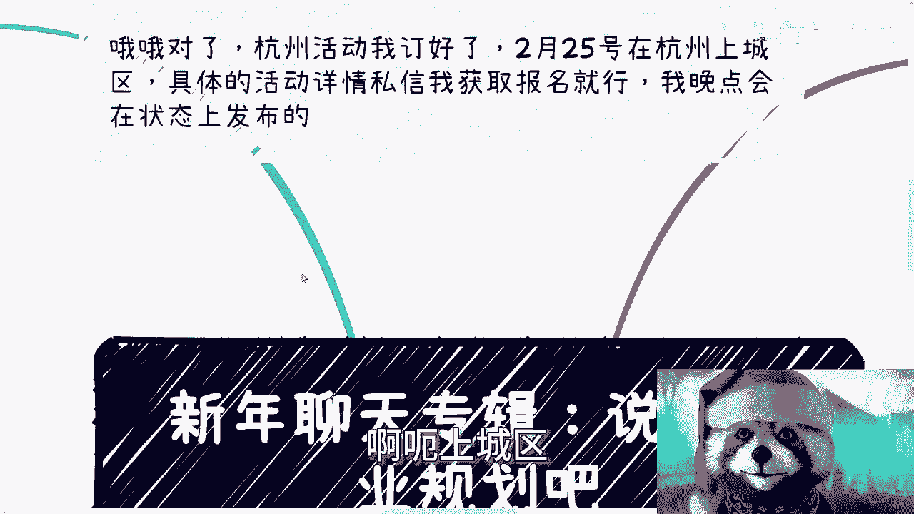

# 新年聊天专辑：说说职业规划吧 - P1 - 赏味不足 - BV1QW421P7iM

啊大家好，这个今天忙的比较晚是吧。

现在已经凌晨了，但是并不妨碍我卷一个视频出来是吧，因为反正也没什么很大成本啊。

首先是这样子的啊，杭州活动我已经订好了，2月25号在杭州上城区好吧，然后具体活动时间你们可以私信我，来获取这个详细信息，然后报名就可以了，我今天晚上来不及发了，我明天早上这个B站的状态上来发好吧。

2月25号下午啊，呃上城区。

然后今天我们讲的这个内容呢，是这个职业规划啊，呃首先啊其实以前的职业规划很火啊，这个有一说一啊，因为我觉得怎么第一种，我得跟大家把历史说清楚呃，你看啊，就我毕业那会儿呢，我觉得大家都在讲职业规划。

而且呢非常多的脑图啊，海报啊啊，也有那种知识变现，反正很多很多，然后大家都在说这个不同的岗位往上晋升，到底做什么对吧，然后以及怎么做呃，有一说一啊，我觉得最早的时候呢，我刚毕业的那段时间。

比如说对CTO创始人啊啊，那种什么这个企业高管啊，还是非常憧憬的，就觉得呢这个就是我以后的目标呃，虽然可能就我当时还觉得，可能比如说我以后也达不到这种高度啊，然后怎么样怎么样，那么然后呢在现在来看呢。

其实这些东西就已经变成了时代的工具人，就是一方面这些已经不再是我追求的东西，而且也就我，我甚至觉得他们已经比我现在追求的东西，也不知道低很多，低也低很多，应该说就不在一个一个不在一个层面层面，上面实现。

第二呢就是说这些东西，或者这些我以前可能觉得不错的东西，或者看重的东西，可能也已经变成了这个时代的一种弃子，那么我记得我刚毕业没有几年呢，我就是嗯因为我是本职也在做兼职也在做嘛，所以说啊我最早赚钱的呢。

就是做那个政企咨询赚的钱呃，我也因为这些事情来认识了很多的，企业家和政府的人，或者说或者来说，就是我认识了很多年纪比我大的人啊，那么最初呢我对于一个年薪百万左右的需求呢，我当时也问了一些问题。

我意思就是说啊，我意思就是说我也很羡慕你们啊，我应该怎么做成你们这样子呢，对吧，我以后应该怎么规划呢，啊他就跟我说，他说首先啊你看啊去掉税其实也没有多少钱，那当然了，你们肯定也觉得100万去掉税。

比如说70几万也很多了，但是呢你要想啊，他要在上海买房呃，其次呢他作为这个CTO对吧，然后企业给他年薪百万，基本上就是按照他的说法啊，就基本上就是24小时扣的，也就是说你你不要说以前什么没有。

996007，有没有996007根本就不重要，因为有没有它只是一个层面上的事情，重要的是你表面上就是重要的是你这个人呃，在什么岗位拿多少钱，它本质上差别不大的啊，也就是比如说凌晨三四点。

三四点要要你起来修bug就修修bug，要你起来干嘛就干嘛，那否则怎么对得起那么多钱呢，啊你还不能有任何怨言，为什么，因为CTO啊，就像我们说的就是工具人，你别管你叫什么，我管你什么CCCXO也无所谓啊。

遍地都是老板，而且大部分呢其实当年的互联网，老板的钱也都不是自己的钱，老板的钱都是投资人的啊，那也就是说我用投资人的钱，我只要用得当都可以用，那你不行，换人就行了，你今天比如说态度不好对吧，或者怎么样。

那换人啊，换人啊啊然后他就问我，他说他说你是不是想要用命，用时间去换这个钱呢，而且可能你想换呢，人家也不见得给你机会换对吧，就像现在很多人说啊，我要换对吧，我我我我就卖这两年时间，你给我年薪百万。

那不好意思，那不是你换，你想换就换啊，而且你还没有自由，所以说他当时问我，他说你到底是想追求的是什么东西啊，因为你但凡走这条路，其实就是不稳定的，从当时来讲就是不稳定的，虽然很多人很多人他是向往的。

但是他不稳定，而且他没有自由，就像我之前的视频里面。

有一次跟大家说过，我说我之前比如说做那个呃政府咨询啊。

我说我一一我差不多做了一年左右，我一天的报酬差不多在1万到1万5，然后我就跟很多人说，我说很多人呢可能听上去觉得啊很爽是吧，或者怎么样，但我跟你说，人就是这样子的，你但凡做了一段时间。

你会不满足于1万到1万5的，你就会觉得你想要更多的自由，没有办法的人，就这样一个生物，你怎么办呢，因为你总是要往上走的嘛，那么第二点第二点我看是什么，就是当初那个职业规划也的确是有用的啊。

任何一件事情讲究的是一个天时地利人和啊，在天时地利人和面前，我们的所有行为都是渺小的，我们做任何一件事情，不要跟大局势去做而去做，对啊，你不跟着大趋势去做，做得再好也没用，这个没有办法的啊。

那么职业规划呢是因为当时真的有用的，它是因为有职业成长，比如说上下级的年龄层比较大对吧，比如说你说我们当时出来发现哦，上面可能六零后七零后对吧，那么你就觉得啊，我我我跟我往上走是有希望的啊。

那你说现在一个比如说九零后九二后啊，这个一看上上上集是啊，比如说九五后对吧，一看上集是个九二后九零后，那你自己想想看吧，是吧啊，同时很多企业呢其实也在我打错了，也在那个高速发展期，产业呢也在高速发展期。

也就是也就是说你就好像是那种在机场走路，你就走在那个那个那个那个同一个方向的，那个那个电梯带上面啊，那么你就速度会变快，你比如说你说我毕业所在的移动互联网啊，我要一毕业不做安卓IOS。

那我估计啊直接规划再好也没用，就是我职业规划做的再好啊，别人跟我说做的再好也没用，因为毕竟啊你说做的不是一个增量市场，那当然啊也有很多人说他他说你做几年了，你可以去转行的吧，或者是怎么样子。

那一样的道理啊，我做一个东西，你让我去转行，我得我也会拖啊，我也没有勇气去转啊，那真的当我转过去之后，你会发现我终究还是就，说白了，你你终究还是没有赶上这所谓的红利期啊。

啊然后呢企业呢其实也有很多明确的晋升规则，那么所谓的规划跟方向跟积累，它是有因果关系的啊，也就是说你知道你要往哪个方向走，你自然也就知道你应该积累什么东西，但是你放到现在他没有。

因为当年企业领导也都关心的成长，但现在关心个屁啊，现在都他妈是标品啊，那么第三点就是本质上，就是如果我们客观的来说，职业规划呢它是有断档的，因为就像我们刚刚说的，就是我就这么说，就咱退1万步来讲。

就算大趋势再好，顺风再顺水，那么大部分人的本身职业规划，他跟以前很多培训机构的这个逻辑是一样的，就是听上去很有道理，但其实是断档的，什么意思呢，这就好像你选专业的时候，学校跟你说A专业很好啊。

未来有很大的发展啊，然后呢你你当然你也不知道，你只能听学校一面一面之词嘛，对吧，你不懂啊啊然后培训的时候呢，你别人很多人跟你说，哎某某技术某某某技术的这个行业很热啊，然后你也不知道啊。

那么职业规划呢也是的，你说就是你说咱们按照一个junior到senior management对吧，然后到一个什么什么什么总监对吧，怎么样怎么样，那你也不知道，你就基本上就按照这个方向走了啊。

但问题是问题是，然后呢对吧，就是我们假设我们假设上面说的这些都是真的，那么这但是所谓的热啊，所谓的红那个红利期也无非都是几年的事儿，你职业发展可能是一个时间段的问题，这没有错，但是你职业发展后面呢。

你比如说45年发展完，你后面呢你不发展了，不赚钱了，还是怎么说，那后面直接发展怎么发展，再再找人，再再再给钱，再被割韭菜啊，你我我是觉得咱不能说咱不能说职业发展，职业规划这件事情本身有问题。

而是说有可能真正所谓的职业发展也不，职业规划也无非就是几年里面给个方向而已，而不是说很多人觉就理解当中，就是说哎我们做过职业规划啊，我好像这辈子就这个规划就这么走了，不是这样子的啊，更何况啊。

更何况你看啊，现在大趋势它也不是顺风顺水，就好像我们刚刚说你在一个飞机场，你不是走在顺的方向的啊，同一个方向那个电梯带上面，你走在逆方向电梯电梯带上面，大部分人现在是这样子的，那么职业规划更像一个什么。

它更像一个职游戏角色，我们现在在一个游戏里面，你呢是一个游戏角色，然而呢你对整个游戏的全局样貌，构造规则什么都不知道啊，就是你的理解率就是0%啊，然后呢你说好，我做一个游戏规则，我现在就在那边想你。

包括就是说你说我我会去参加很多的NBA对吧，我参加很多的课，我去报很多的名对吧，我就怎么样怎么样，你我说不好听点啊，对整个游戏框架规则，整个的布局什么都不了解，你说我我就一个人在那边瞎他妈的啊。

学习一些东西，然后然后然后说我要做一个职业规划，你你不是那不就是瞎绘画吗，就说白了你的源头就不对，你能规划的出来个屁啊，对不对，啊那么第四点是什么，就本质上呢我觉得规划没有用的。

因为就是你你你你能够解决的了，一时解决不了一世啊，本质上还是要自己掌握这个规划的这个技能呃，其实所谓的这个规划的技能啊，我觉得就是有前提条件，就是你需要有依据的去规划。

但这个依据绝对不能是短视频或者网络信息，因为还是那句话嘛，短视频和网络信息都是二次加工，或者甚至是错误的，拿来做依据，源头也是错误的，那我我为什么说，我为什么说是，咱们一直用客观的这个出发点来说。

就是我也会告诉你们，我所讲的也不见得一定是真的啊，也不见得都是客观的，或者也不见得就一定跟当下这个社会，就一定非常的接轨，但是一样的道理就是你们可以去海纳百川，接收所有人的信息。

但是你们一定要明白一个道理，就是这些信息你们当做一个参考对吧，就比如说陈老师讲10%对吧，哎哎你看那些别人讲鸡汤的，你也占10%，你都把它先收纳进来，然后你要通过你的实践去做判断。

而不是说我今天听到什么就做什么啊，这是第一点，第二点，人在不同的阶段，你想想看，你20岁到30岁，30岁到40岁，40岁到50岁，你的规划会一样吗，啊唉你你你你比如说我们说啊，从一个初级到中级。

到从中级到高级，高级到管理啊，难道你现在如果是个40岁的人，然后你跟我说，安老师我要做个规划，我要先从初级到中级，你觉得他妈的可能吗对吧，就像我说的，你觉得可不可能不重要，社会就会让你知道，你不可能。

所以说我们规划本身出发点是不一样的，比如说你毕业几年之后，你规划是在职场上晋升对吧，比如说两三年，3535年后，那么若干年后你想你肯定想的是说唉，我想自己能有些自己的东西。

我想自己能够拥有更多的这种抗风险能力，我想自己赚更多的钱，那怎么办呢，你说哎我想去社会上打拼，那么你打拼的时候，你规划的其实是商业上的规划，你就不会说哦，我去社会上打拼，我要从初级到中级，中级做到高级。

高级做到管理要命了，哪里有这种东西是给你做规划的，哪里有这样做规划的，然后等你到了30多，40多的时候，你可能想的是哎我索性不干活了啊，我想单纯通过一些关系或者一些技术的辅助，就能轻松赚钱。

那么这种规则又又像另外一种就是说关系路线，或者说就我们以前说的那种，税后的收入的规划一样，那么也就是说你在人的不同阶段，不同的认知层面，你的规划是不一样的。

而不是说我一概而论说哎我要做个规划啊，所以说你像这两天有人。

因为我是今天开始营业了嘛，今天开始咨询的嘛，你要跟我咨询的小伙伴，就是的，就是聊的时候就跟我说，我要做规划啊，我做了一个5年规划，10年规划，我说大哥大姐，你对整个社会的理解就是0%，然后你做个规划。

你你就像你明显在一个网游里面，你开了个单机游戏，有屁用啊，对吧啊，你活在社会里面，你活在国家里面，你活在这个政府的这个主主主权政府下面，你活在人类社会，你说我不管，我根本就不管这些东西。

我要自己造一条规则出来，怎么可能啊是吧，那当然啊，你你做个5年规划，10年规划也不是说你就浪费了5年十年，而是说你因为这个原错误的源头，你会走很多弯路，何必呢对吧，我今天跟他讲的时候。

说的最多一句话就是何必呢，你想的所有的东西都是YY，都是意淫，都是自己的这个想象当中，那你说我要做职业规划，那你为什么要做，你说我我在我看来你不用说，我知道你就跟风，反正别人说要做你就做啊。

然后你今天看到一个人啊，好像说做了职业规划，然后什么顺风顺水对吧，人生呃这个走上人生巅峰，只娶白富美，你也觉得我要去做，这个压根你压根就不知道为什么要做啊，所以说就是我们就说啊就随便聊聊嘛，就说啊。

就是说这个事很多时候你得知道你为什么要做，然后怎么做啊，你别去跟风，你你你跟了风，回头呢，就是你一方面跟了风，然后另外一方面又说我想特立独行，我想我想什么独树一帜对吧，我想我想鹤立鸡群，这不可能的呀。

你一开始就选择了，大家都是火鸡，你你你你你怎么个立立法是吧啊行啊，就聊这么多，反正我开始营业了啊，对对对，然后那个杭州啊，大家记得要报名的话过来好吧，我明天的话早上吧我会把那个详细信息列一下。

反正跟之前差不多吧，反正你们要是有兴趣的话，可以先咨询我啊，我会把详细给你们讲好。

就这么说。