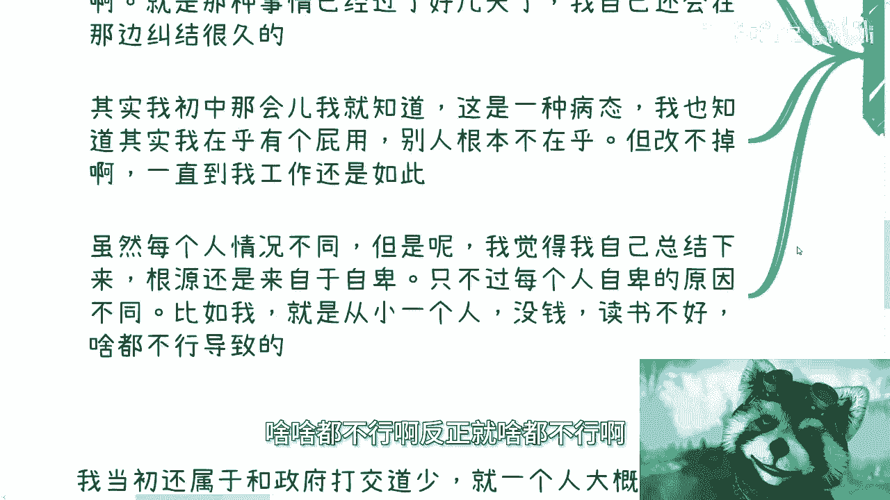

# 新年聊天特辑-曾几何时-我也是很单纯的讨好型人格---P1---赏味不足---BV1uz421d79

在本节课中，我们将一起回顾一段个人成长经历，探讨从过度讨好他人、单纯相信世界，到逐步认清现实、建立边界的过程。这段经历揭示了人际交往和商业合作中的常见陷阱，并强调了实践与自我改变的重要性。

## 概述：曾经的讨好与单纯

相比很多人，我曾经更为讨好他人，也更为单纯，对世界抱有更美好的认知。若论“讨好”、“单纯”甚至“蠢”，我或许能名列前茅。

## 第一节：病态的自卑与纠结

上一节我们提到了曾经的单纯，本节中我们来看看这种性格的根源。我认为其根源主要来自于自卑。

以下是具体表现：
*   我从小羡慕学习好的同学。
*   我非常在意与他人相处，常常过度反思。例如，与他人外出后，会长时间纠结自己是否说错话、做错事。
*   即使事情过去多日，我仍会反复纠结。
*   我初中时就意识到这是病态，知道别人可能根本不在乎，但直到工作后仍难以改变。

我个人自卑的原因可能在于：从小父母不在身边、经济条件不好、学习成绩不佳等。我从不相信仅靠“心灵鸡汤”就能改变一个人，因为所有成长都必须脚踏实地经历，无论好坏。

## 第二节：对所有人的信任与幻灭

上一节我们探讨了内在的自卑，本节中我们来看看这种心态在外部关系中的体现。我曾经对所有人都很好，毫无戒心。

以下是我曾经的认知和行为：
*   我将工作中认识的每一个人都当作很好的朋友相处。
*   我真心相信大家可以一起合作，把事情做好、做大，共同赚钱。
*   我认为大家能玩到一起、一起做事，本质都是一样的。

然而，现实并非如此。人性并不可信。
以下是逐渐暴露的问题：
*   有人私下拉帮结派。
*   有人出于嫉妒而行动。
*   出现问题不愿沟通，都憋在心里。

我记得与每个人的争吵，也记得人生低谷时所谓“朋友”的嘴脸。因此，请记住：可能只有**1%** 的人真正关心你，剩下**99%** 的人中，一半会落井下石，另一半在看笑话。这是人性，与时代无关。

## 第三节：常识的缺失与现实的荒诞

上一节我们看到了信任的崩塌，本节中我们来看看另一个关键问题：我曾认为人人都有常识，但事实并非如此。

以下是我遇到的一些缺乏常识或违背常理的情况：
*   **成本认知错位**：在商业合作中，成本仅100元的东西，被合伙人以500元甚至1000元的价格报账。对方以“我不懂”为借口，实则有拿回扣之嫌。
*   **公章滥用**：合伙人未经沟通，私自挪用公章去签合同。更令人惊讶的是，竟有人认为公章可以随意私刻。
*   **欺诈视为常态**：曾有合伙人用完全虚假的信息骗我做项目，并声称“中国人做项目不都是靠骗吗？”。
*   **虚假头衔**：有人擅自夸大合作方的职位头衔（例如将普通工程师改为“阿里合伙人”），这会带来巨大风险，且难以自证清白。

最可怕的不是有人对你使坏，而是有人觉得使坏是家常便饭甚至令人兴奋。这种人随处可见。

## 第四节：来自“权威”的欺骗与反思

上一节我们列举了缺乏常识的行为，本节中我们来看一个更特殊的案例：我曾被冒充政府人员的人欺骗。

事件经过如下：
*   一个人以各种培训、会议名义，前后骗了我约半年时间。
*   我曾因不信而去北京核实，对方有办公室，看起来有模有样（可能是个野鸡机构）。
*   虽然直接骗取的金钱不多（主要是差旅活动费用），但浪费了大量时间和精力。
*   事后调查发现，对方所说的头衔和事情大多属实，但都与他本人无关。

## 总结：改变源于实践，而非空想

本节课中我们一起学习了从讨好型人格到认清现实的转变历程。

我若天生拥有现在的处事方式和性格，可能早已成功。我最大的优势或许在于曾比大多数人更缺乏资源，而早期的市场环境容错空间稍大，允许我经历这些欺骗。

我很羡慕那些天生就懂得如何正确经商、待人处事的人。后天强行改变是痛苦的，但凡有类似经历的人都会明白。我再次强调：**我不相信任何理论、视频或外力能直接改变一个人的核心特质**。

改变只能通过**实践**来实现。公式可以概括为：
**改变 = 实践 × 时间**
有人天赋高，领悟快；有人（如我）则需要更多时间和案例去积累。如果不改变，你将永远无法前进或提升，因为这个世界就是如此。你只能选择适应与成长。

---
**课程名称**：新年聊天特辑：从讨好型人格到现实认知的转变
**课程编号**：P1