# 新年聊天特辑：曾几何时，我也是很单纯的讨好型人格 - P1 - 赏味不足 - BV1uz421d79R

啊大家好，今年初二初二啊，这个新年快乐，继续来唠唠是吧，只不过这一期不一样的是，我把它放到充电视频呃，也没为什么啊。

这个看我心情是吧，哦首先要是这样子的，就是我觉得今天讲的呢就是我要告诉你们，就是我觉得呢相比你们而言呢，我要比你们很多人啊要讨好得多啊，而且呢也要单纯的多。

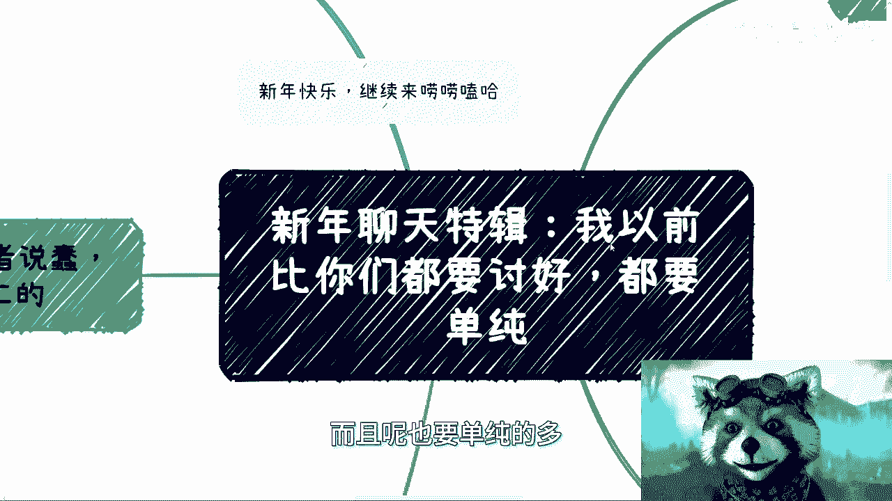

或者说呢对这个世界的这种美好的认知呢，也会高很多，那没有办法啊，要说讨好和单纯或者说蠢啊。

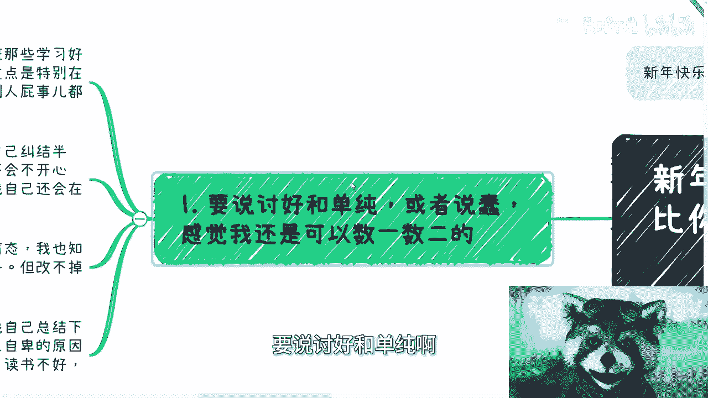

感觉我还是可以数一数二的排的上名的，哎我这个放大一点啊，首先啊我觉得从小就是对吧，就是说小学初中呃，我首先看见我们班那些学习好的，哎尼玛特别羡慕啊，而且呢这还不是重点。

重点在于那种就是说特别呢比较在乎自己，跟别人相处，就是说我我往往就属于就是说啊，对方呢觉得P社都没有的啊，他可能就没往心里去，然后呢我会在那里想半天啊，就比如说我以前跟他们去什么图书馆啊对吧，出去玩啊。

就我会自己纠结半天啊，是不是我刚刚哪里说错话了对吧，是不是我刚刚哪边做的不对呀对吧，对方会不会不开心啊啊就是那种，而且呢就是那种事情过了很多天了，然后我还会那种自己纠结很久啊。

你说这个事吧，其实我觉得我初中的时候就知道这是一种病态，但是呢我知道啊，我也知道，就是说我招呼有个屁用啊，别人根本就不在乎，但改不掉，其实一直到我工作还是这样子的，虽然每个人情况不一样啊。

但是我觉得我总结一下，我个人根源可能还是来自于自卑啊，只不过就是说每个人自卑的原因不一样嘛，就比如说比如说我是吧啊，这个从小一个人对父母也不在我身边，然后没钱对吧，然后读书也不好对吧，啥啥都不行啊。

反正就啥都不行啊，所以啊我这边再强调一下啊，就是说嗯无论怎么样，我是从来不相信说啊，你喝鸡汤能够把你喝改变的啊，绝对不行，因为因为什么，因为还是那句话，就是说我所有一路走过来的。

这个过程全部都是啊踏着这个就是脚踏实地，踏着这个路过来的啊，不管这个路是好的还是不好的啊，但是呢就是说不管怎么样，我只认识的东西，我从来不会去这个相信那种虚头巴脑的，因为事实告诉我们没有用啊。

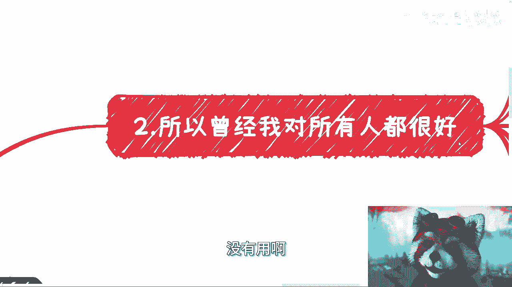

我第二点，所以说呢曾经我对所有人都很好。

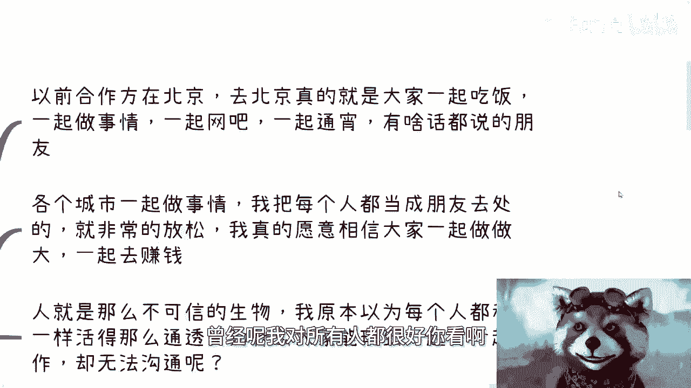

你看啊，我们以前有个合作方在北京啊，去北京呢，其实都很开心啊，大家一起吃饭，一起做事情啊，一起去网吧，一起通宵。

有啥话都说的啊，各个城市呢一起做事情呃，我把我认识的每一个人啊，都当成朋友去相处，而且是当做那种很好的朋友去相处啊，而且呃就从我角度来讲，我是非常的就是没有任何的呃，这种这种戒心或者这种就是分类啊。

我觉得就是就是在我的思想当中，我就觉得就是说啊大家都很好对吧，大家就是可以一起合作的对吧，我是真的愿意相信大家一起可以把事情做做好。

做做大，一起去赚钱呢，但是呢人呢就是这么个不可信的生物啊，我原本以为呃每个人和我都一样，哎呀不要活得那么通透吧，就跟我一样这么单纯啊，呃为什么大家能玩到一起，为什么大家能够一起去做事情。

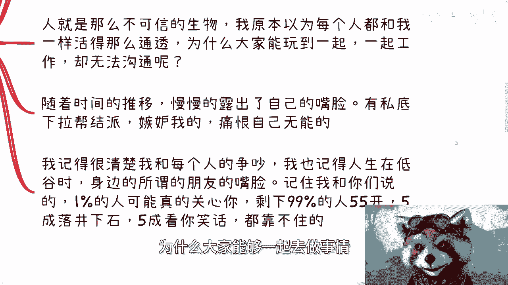

但是在一些事情上面却没法沟通呢对吧，你比如说随着时间推移，慢慢的露出了自己的嘴脸对吧，有私底下拉帮结派的，有嫉妒我的啊，有啊嫉妒我同时都同时也痛恨自己无能的对吧，比如说痛恨他自己不能跟我一样的对吧。

等等等等等很多很多对吧，就是我是觉得是什是什么呢，就是大家做事情沟通对吧，你有问题你跟我讲啊，你要想去做，你去做对吧，我我一方面我也拦不住你，我也不会拦你，然后第二方面呢就是说你有什么问题，你倒是说啊。

不说的啊，都憋着啊，所以我记得之前呢我就跟大家说的很清楚，就是呃一方面呢就是说我很清楚的记得，我以前跟这些，因为怎么说呢，我从以前变成现在总归有个过程嘛对吧，我很清楚我跟每个人的争吵。

我也很清楚的记得啊，就是每次的这种有的没的矛盾，就是就我跟你们说的那种过家家啊，我也记得人生在低谷时，身边的我所谓的那些朋友的嘴脸啊，所以说记住我跟你们讲的1%的人，可能啊可能记住是可能他真的关心你。

剩下99%的人呢，五五开哦，五城落井下石，五成看的笑话都是靠不住的。

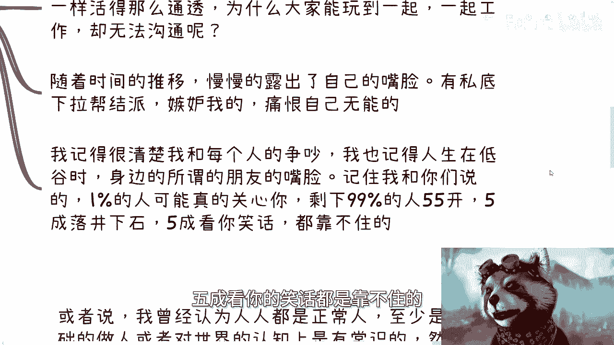

我跟你讲这个事情不会变的，因为这个事情是人性，这个事情跟时代没有关系好，然后第三我也曾经认为人人都是有常识的。

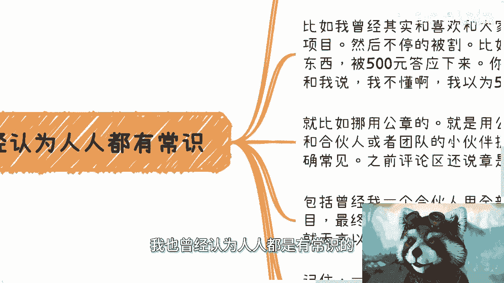

这件事情就非常奥妙了啊，或者说我们说常识我们叫做common sense嘛对吧，或者说我曾经认为人人都是正常人，至少是在做人的这种基础上面，或者对世界的认知上面是有常识的，然而其实并不是啊。

这就跟现在很多人认为公务员是铁饭碗，一样对吧，就跟这个最近叫什么贾玲那个电影是吧。

就很多人觉得啊他减肥是是为了营销，就毫无常识对吧，就不看本质，就就我甚至觉得我甚至觉得不像个人啊，比如我曾经呃，其实很喜欢和那个大家伙一起去做商业，一起去做项目，然后不停的被割啊。

就比如说一个成本明明100元的东西，就是就是就是你你你你会认为啊，拿出去问一个小学生，问一个初中生，他都会觉得100元贵的那种东西会被我们的呃，所谓的曾经的合伙人，或者说这个一起做商业的一些小朋友啊。

呃500元打印下来，甚至1000万打印下来，你还不能骂，你还不能说说了吧，对方会跟我说，哎那我不懂啊对吧，我以为这500块钱你能说他什么呢对吧，就是你明明有种感觉，就是哦你就是想要捞外快。

你就是想拿回扣，但是你还不老实说的这种感觉，但是你又不好说他为什么，因为我以前没有现在这么刚啊对吧，你要我现在我他妈早就抽他了，对不对，而且这种事情也不可能再发生在我身上。

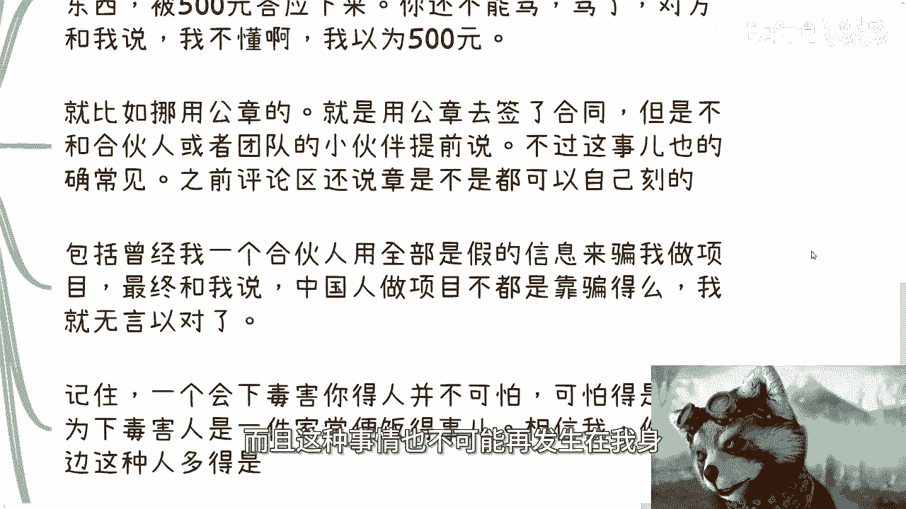

但以前不会啊，以前就是那种就是说把那种哎呀，大家的这种感性类的东西，把大家的这种关系看得最重要对吧。

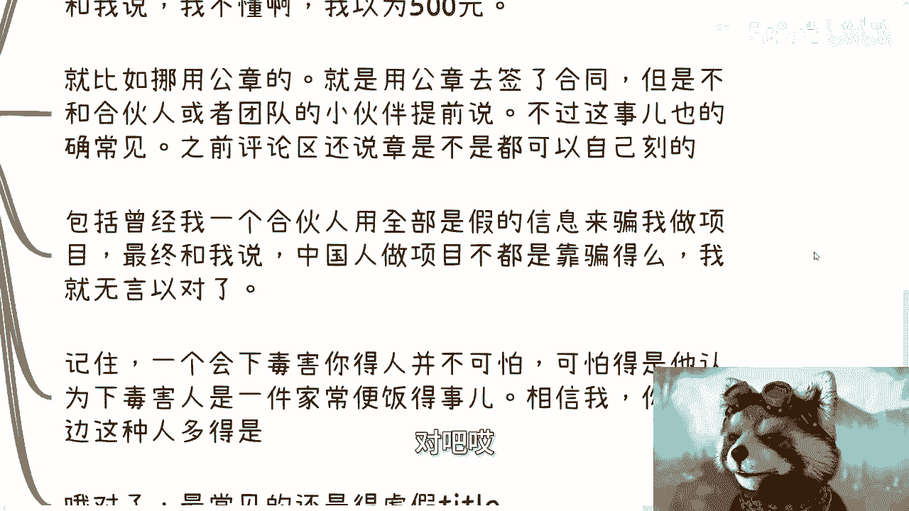

唉算了算了吧，就这种感觉这种这种情况你们做不好的，我跟你们讲啊，然后还比如说挪用公章，就那种拿着公章去签合同了，但是不和合伙人或者团队小伙伴提前说的，我跟你讲这事也的确常见，为什么。

因为之前我在讲公章的时候，之前评论区竟然还有人还不止一个人啊，说公章是不是都可以自己刻的。

怎么办呢，你说怎么办呢，就是就中国就这个样子，因为大家在整个教育当中，那我这不是说这应试教育不好啊，我只是在说整个教育当中是没有任何一块的，这个教育会跟大家说这个东西，这部分教育是缺失的，你知道吗。

就这个样子就是怪谁呢，对吧，我也不知道怪谁啊，我们再比如说啊，再比如说曾经我有个合伙人啊，用全部的这种假的信息来骗我做项目，然后呢你骗完我对吧，还跟我说就是中国人做项目不都是靠骗吗对吧。

我我我我就不知道怎么去去去去回复是吧，我跟你讲啊，你们在日常过程当中碰到的人呃，一个会下毒害你的人其实并不可怕，可怕的是，他认为下毒害人是一件家常便饭的事情，或者说他认为是一件非常令他兴奋的事情。

我跟你讲，相信我对你们身边这种人多的是啊，这种人这种人到处都是，然后还有个事情是什么呢，就是那种虚假态度，哎呀虚假态度这个事真的是我跟你讲绝了，就是那种怎么说呢，就是啊比如说我今天邀请你啊，邀请你过来。

你跟我说，你说啊我是什么什么公司的这个工程师啊，比如说初级工程师，高级工程师啊，然后我邀请你来了之后，我直接把你态度改了，就直接改成，比如说啊你们跟我说，你是阿里阿里的P6P7对吧。

我直接帮你改改成阿里合伙人啊，真的我跟你讲这种东西市场上很多的啊，就是就是你没有办法去评估对方这个人，就是他今天虚假你的title，可能会给你带来非常多的麻烦。

但是但是问题是你跟别人说，别人没人相信你啊对吧，比如说我今天把你的态度就改成了，某公司创始人，你老板到时候去找你，你怎么说呢，你说是陈老陈老师做的，你老板是姓，会信吗对吧，会信吗。

你到时候就是跳进黄浦江都洗不清啊对吧，好，然后第四点就是你还别说。

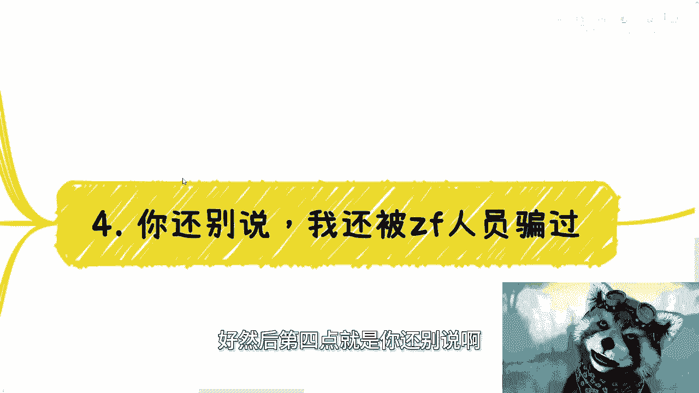

我还被那种政府人员骗过呃，就我当初还属于跟政府打交道，打的少啊，就一个人大概前前后后骗了我半年啊。

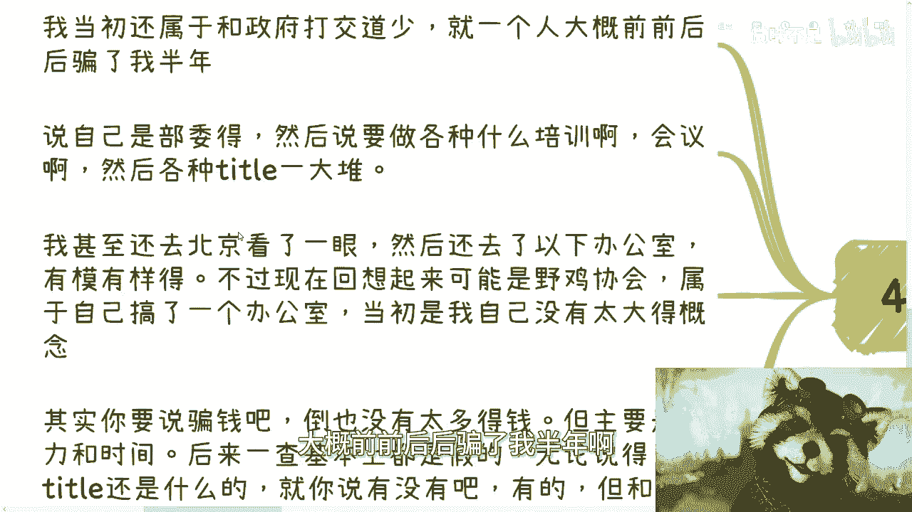

然后说各种什么啊，培训啊，会议啊，各种开头一大堆啊，我甚至那个时候呢我的确不信，我还去北京看了一眼哦，还去下有办公室，有模有样啊，不过现在回想起来了，可能应该就是个野鸡机构，属于自己搞了个办公室。

当然了，因为我当时也没有太大的概念，所以说基本上就是唉觉得哦好像像那么回事啊。

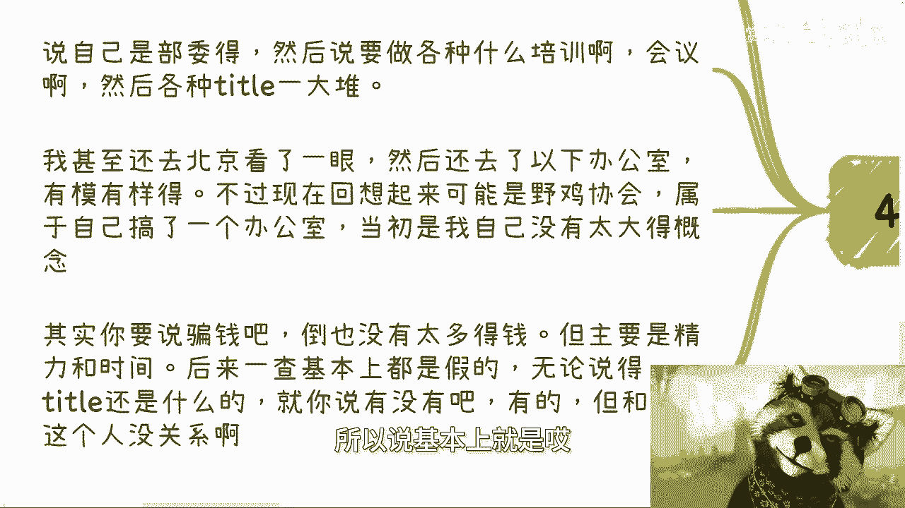

其实你要说骗钱吧，倒也没有骗骗多少钱啊，最多就是搞点活动啊，什么东西来来回车旅差旅费吧对吧，但主要是经历跟时间，而且后来呢我也去查过，就一查吧，基本上的确都是假的，无论说的title还是什么。

就是你说他说的东西没有吧，有的啊，但是跟他这个人没什么关系，就说白了就是说他讲的东西是一些，就是说事实上是存在。

但是跟他没什么关系的这么一些情况。

呃所以呢我觉得啊就是说真的就是呃，我要是天生就跟现在的这个做事情方式啊，性格一样，那我觉得我早成功了。

不管什么领域，我肯定早成功了，我觉得相比大家呢，我觉得我最大的优势在于我比大家缺钱，真的你们别说啊，大部分人都是比我有钱的啊，大部分都是比我有钱的，你们毕业的时候有有的东西很多。

我毕业的时候什么都没有啊，真的是什么都没有，然后以前的市场没有现在这么差啊，还有些时间容许我被骗骗，那么其实呢我也很羡慕那些天生就是能够跟我，或者说能够呃能够能能够潜移默化去懂得，做商业啊。

或者说如何正确的去待人处事，去去做生意的这种人，而不是像我这样后天强行变过来的。

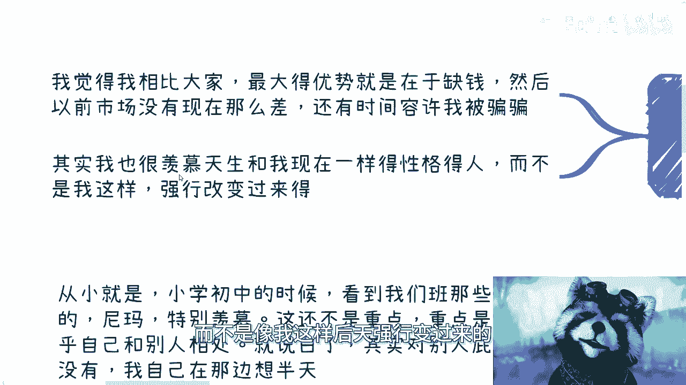

这种变得还是很痛苦的，就是我觉得，但凡嗯就是有些小伙伴感受跟我差不多的，他们自己知道，真的我只能说他们自己知道，就他们他们也想改，或者很多人都想改，但没这么容易，啊所以说我我在这里再次跟你们说一遍。

就是说我从来不信有任何的理论啊，或者任何的视频或者任何的外力啊，然后你说能够改变，把我们的很多东西改成我们自己的特质，这是不可能的，你只能通过实践，只不过就像我说的，就是说有的人天赋高啊。

他比如说时间很短，就能领悟到很多东西，那有的人天赋不高对吧，像我这样子的，那么只能靠时间，靠case去积累去改变，你不改变的话，不可能为什么，因为你不改变，你永远不可能往前走，也不可能往上走。

因为你永远都会被骗，没有办法的，这个世界是这个样子，你能怎么办呢，好吧好吧，那就这么着，然后反正有啥我们在做咨询，基本上现在初四之后再开始。

