# 新年聊天特辑-模糊的问题-模糊的发展-模糊的结论---P1---赏味不足---BV1mZ421B7r

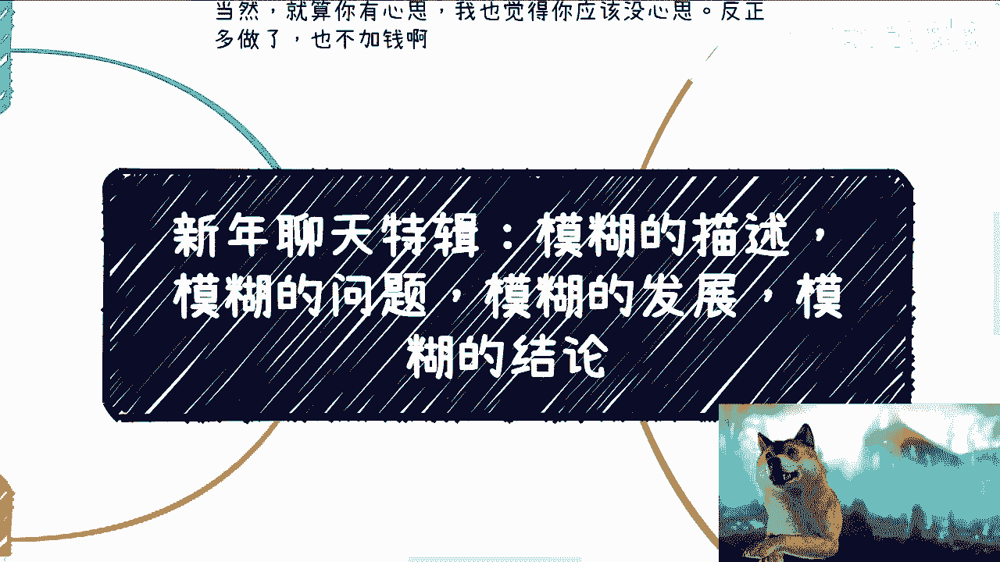

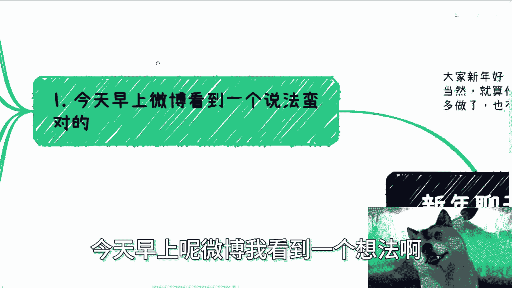

## 概述
在本节课中，我们将探讨一个普遍存在的沟通现象：模糊性。我们将分析模糊描述在日常交流、职业规划和信息获取中的具体表现，并讨论其背后的原因与潜在问题。通过理解模糊性，我们可以学习如何更清晰、更具体地思考和表达。

---

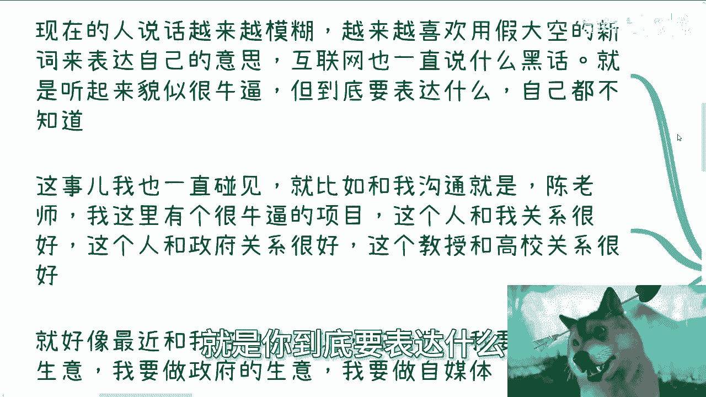

## 模糊描述的现象与问题

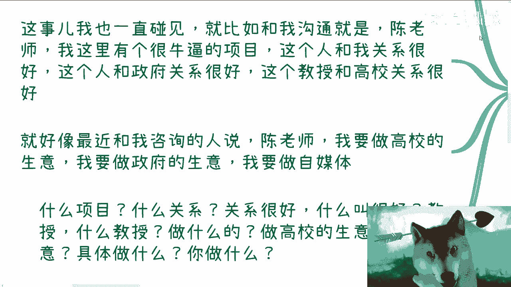

上一节我们介绍了课程的主题。本节中，我们来看看模糊描述的具体表现。

互联网上充斥着各种“假大空”的新词和行业黑话。这些词汇听起来很专业，但往往缺乏明确的定义和实质内容。例如，人们热衷于谈论“区块链”等概念，却可能并不关心其背后的核心技术。这种换汤不换药的造词运动，使得沟通变得低效。

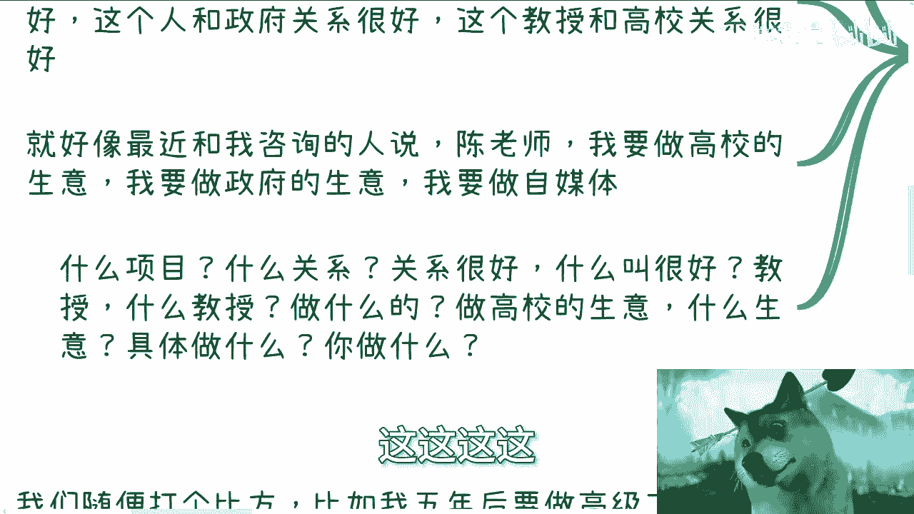

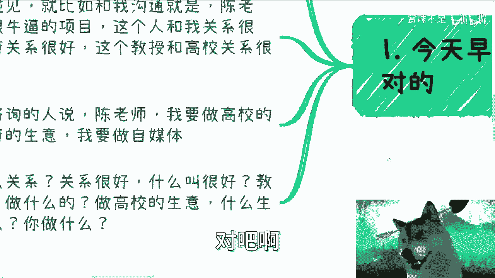

在具体的人际沟通和项目描述中，模糊性同样普遍。

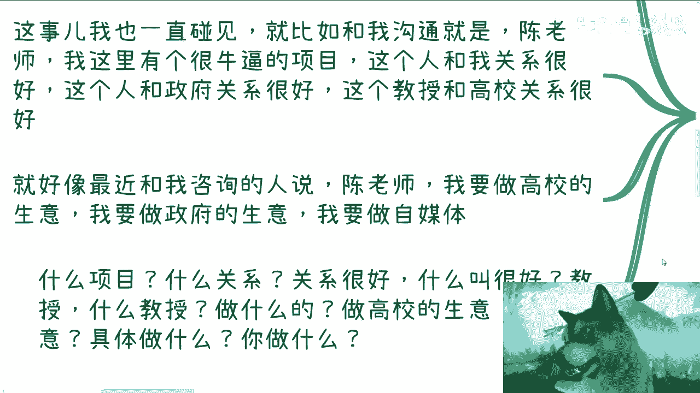

以下是几个典型的模糊描述例子：
*   **“我有一个很牛的项目”**：项目具体是什么？目标、内容、可行性均未说明。
*   **“我关系很硬”**：具体是什么关系？对方是什么身份、职级？关系如何发挥作用？
*   **“我要做高校/政府的生意”**：高校或政府涉及领域极广，具体是哪种生意？提供什么产品或服务？
*   **“他是前央视的/知名教授”**：具体是谁？有什么过往成功案例可供查证？

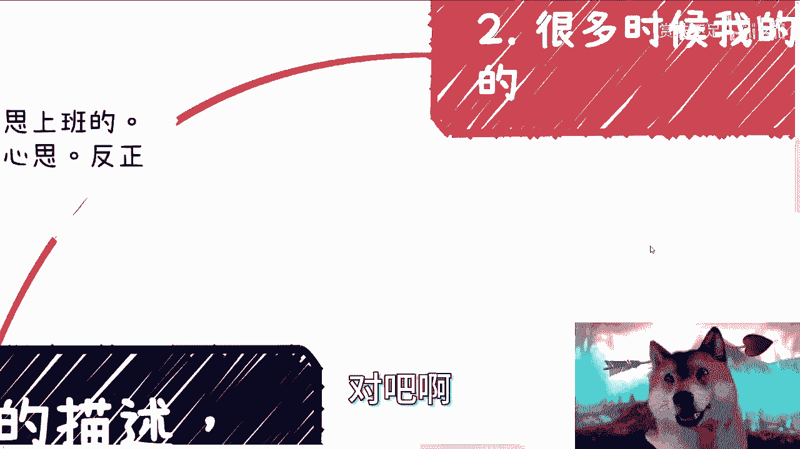

这些描述听起来充满潜力，但一旦追问细节，常常会发现描述者自己也无法给出清晰答案，最终导致“一问三不知”的局面。

---

## 模糊的职业规划与发展

上一节我们看到了模糊描述在具体事务上的体现。本节中，我们来看看它在个人职业规划上的影响。

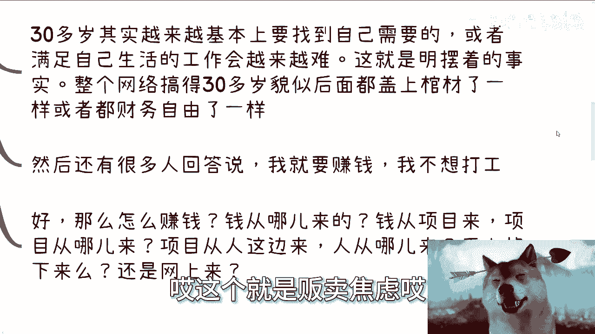

许多人在进行职业咨询时，目标本身就很模糊。例如，“想做职业规划”或“想更好地打工”。然而，在当前的经济与就业环境下，单纯在“打工人”层面进行规划意义有限。因为个人的职业发展受公司、市场等外部因素影响极大，并非个人能完全掌控。

一个核心的认知误区在于，许多人认为现状会线性延续，缺乏风险意识。例如，设定“五年后成为公司专家或创立自己的公司”这类长期目标时，往往没有考虑过程中的变量：五年后你是否还在这家公司？市场环境变成怎样？所谓的“专家”标准由谁定义？

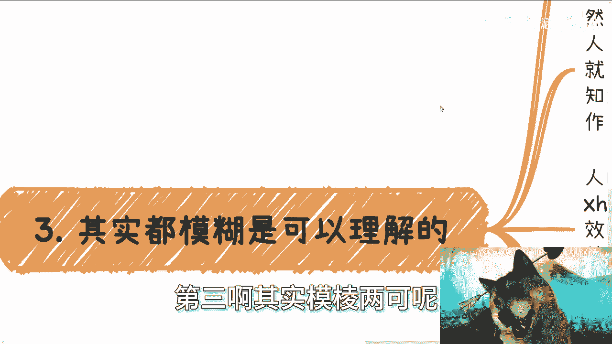

更常见的情况是，目标与行动脱节。一个人可能定下了创业的目标，但五年间仍在按部就班地打工，最后只是注册了一家公司，没有客户、没有项目、没有团队。这更像是在自己的“私服”里游戏，而非真正实现了创业目标。

---

## 模糊信息的来源与沟通断层

上一节我们讨论了模糊规划的问题。本节中，我们来分析这些模糊信息从何而来。

年轻人获取信息和沟通的渠道存在断层。有效沟通匮乏，信息来源多是父母或社交媒体平台，如小红书、B站、微博等。而这些网络信息本身也常常是模棱两可的。

以下是网络上常见的不清晰信息类型：
*   **过时或“爹味”说教**：灌输陈旧的职场观念，教导如何更好地“内卷”，成为更合格的工具人，而非探讨如何开辟新路径或避免无效竞争。
*   **片面成功的“鸡汤”**：只展示极少数成功的案例（如辞职创业年入百万），却不提背后大量的失败者，营造不切实际的幻想。
*   **缺乏细节的“段子”式分享**：许多采访或自述停留在讲励志故事和段子，回避具体的操作细节、遇到的真实困难和关键的决策点，对观众缺乏实际帮助。

这些模糊的信息最终导致人们得出模糊的结论和规划，远离了社会的真实运作细节。

---

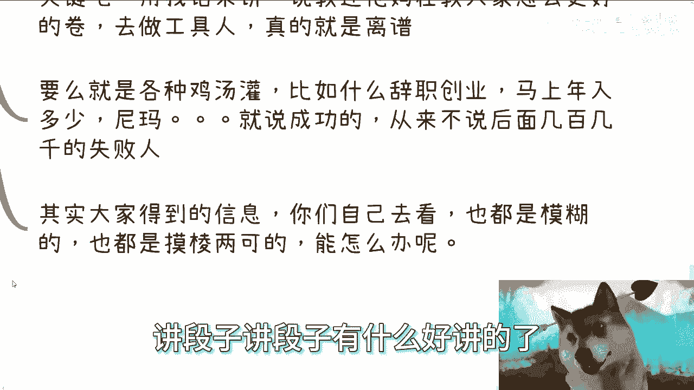

## 何为“接地气”的清晰认知

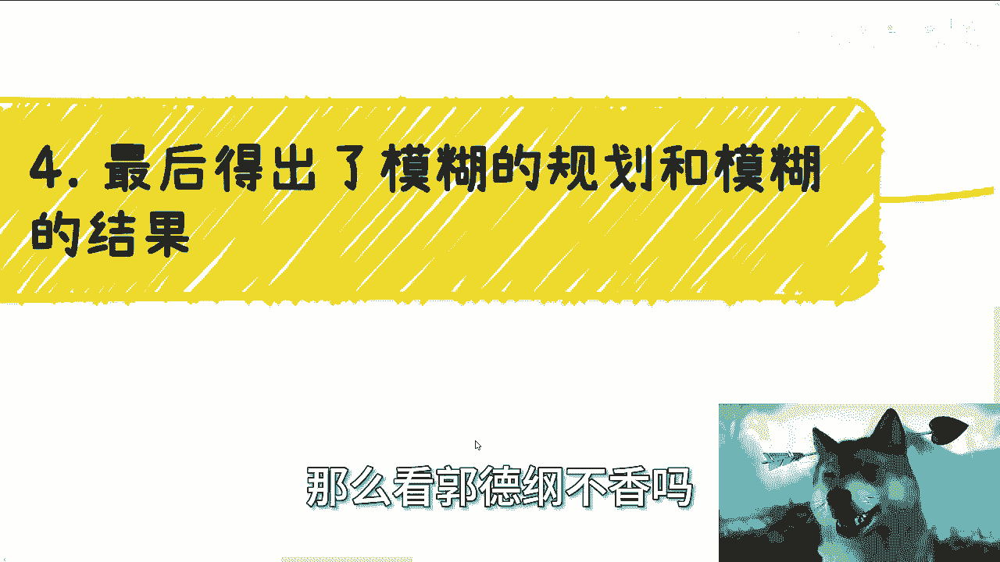

上一节我们指出了模糊信息的泛滥。本节中，我们来看看清晰认知的对立面——“接地气”意味着什么。

“接地气”的核心是追求清晰和具体，而非模糊。它要求深入了解社会各个组成部分的真实运作细节。

社会由多个部分构成，可以用一个简单的集合表示其核心组成部分：
`社会组成部分 = {政府， 高校， 企业， 资本， 行业协会， ...}`

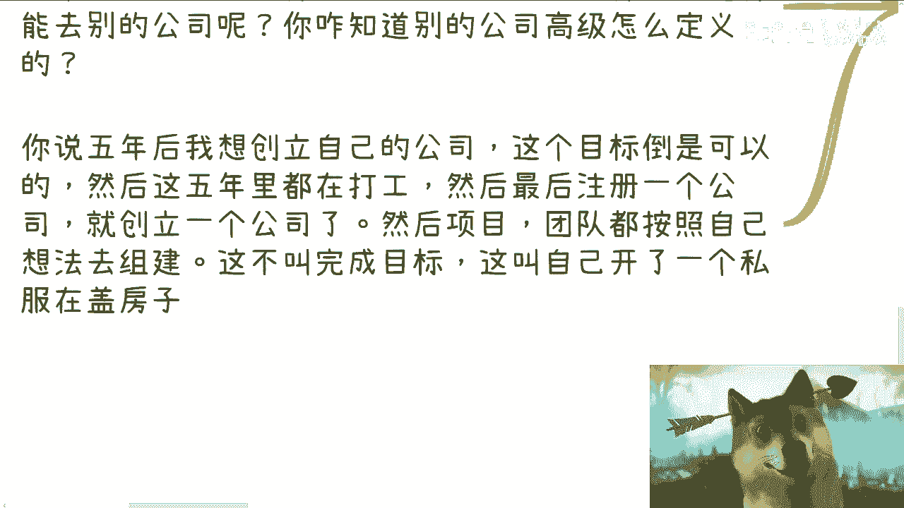

“接地气”就是要去了解这个集合中每一个元素的具体规则、流程和人际关系网络，例如：
*   政府的红头文件如何发布与执行？
*   各类补贴、人才政策的申请条件与流程是什么？
*   企业不同部门的实际权责与协作方式如何？
*   一个项目从构想到落地，需要经历哪些具体的环节和关键人？

遗憾的是，大多数人对这些细节的认知都是模糊的。获得清晰认知没有捷径，它需要主动、深入地去接触和实践，而不是满足于网络上泛泛而谈的信息。

---

## 总结
本节课中，我们一起学习了“模糊性”这一沟通与认知中的普遍问题。我们从模糊的描述现象出发，分析了其在职业规划、信息获取中的具体体现，并探讨了其根源在于有效沟通的缺失和对细节的忽视。最后，我们明确了“接地气”的本质是追求清晰、具体的认知，需要深入了解社会运作的真实细节。避免模糊，追求清晰，是做出有效决策和规划的第一步。