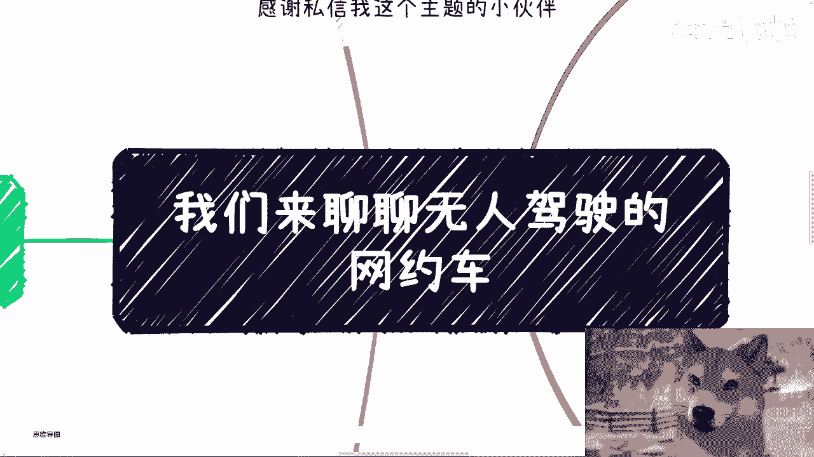
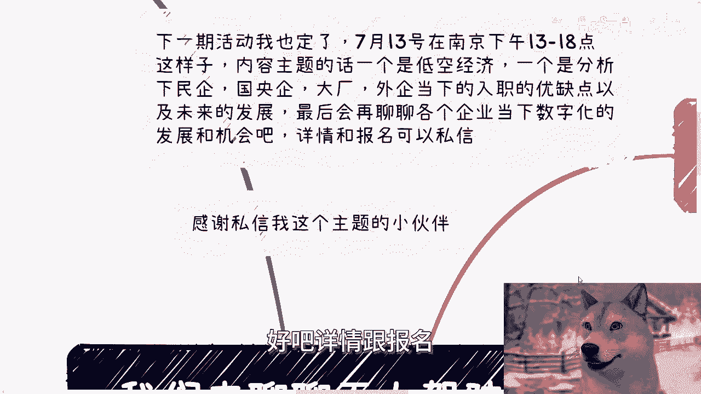
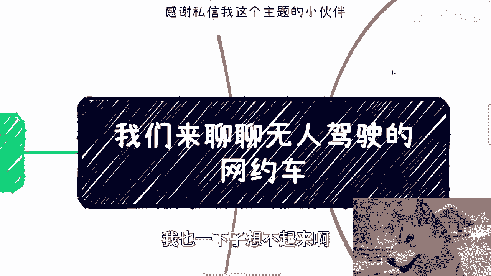
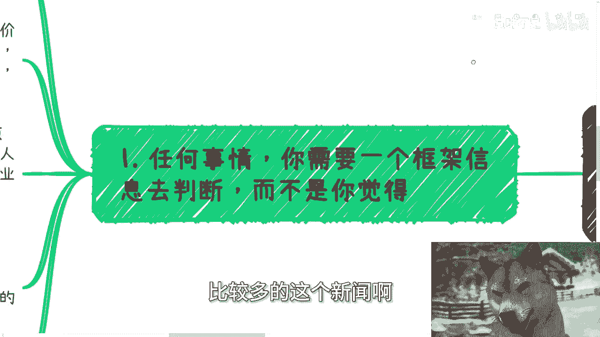
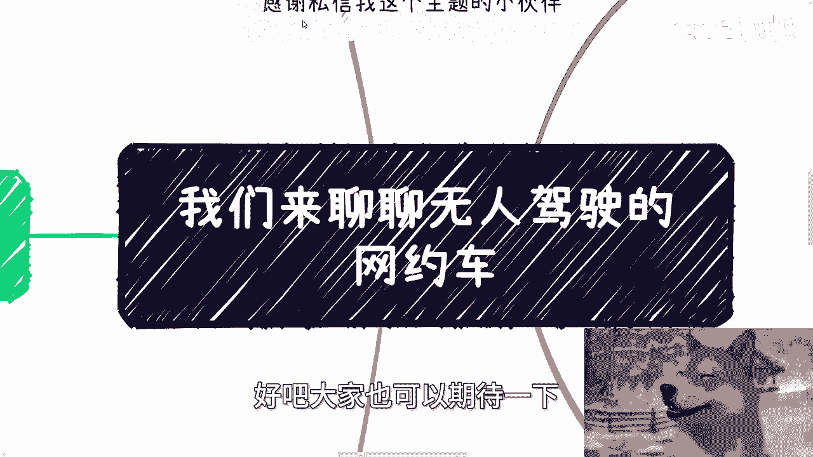
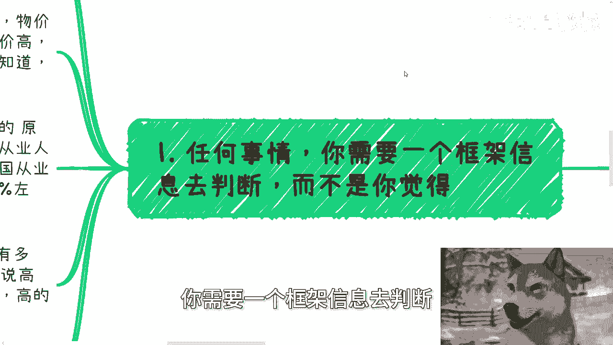
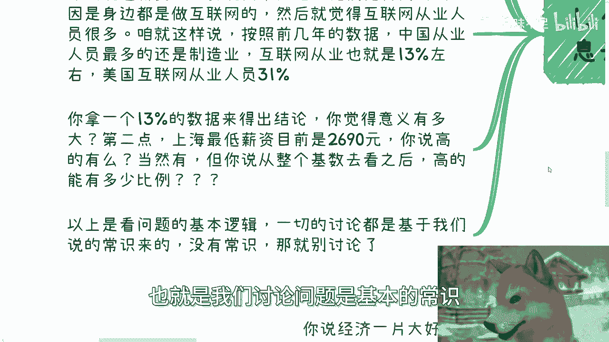
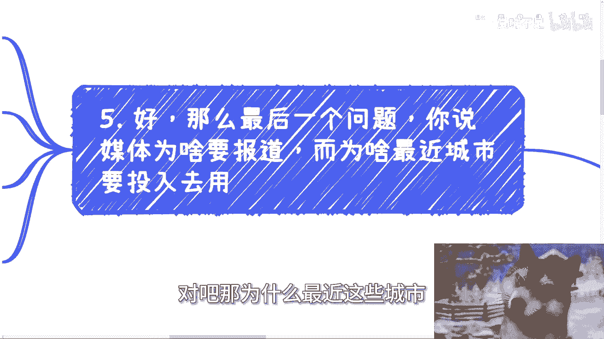
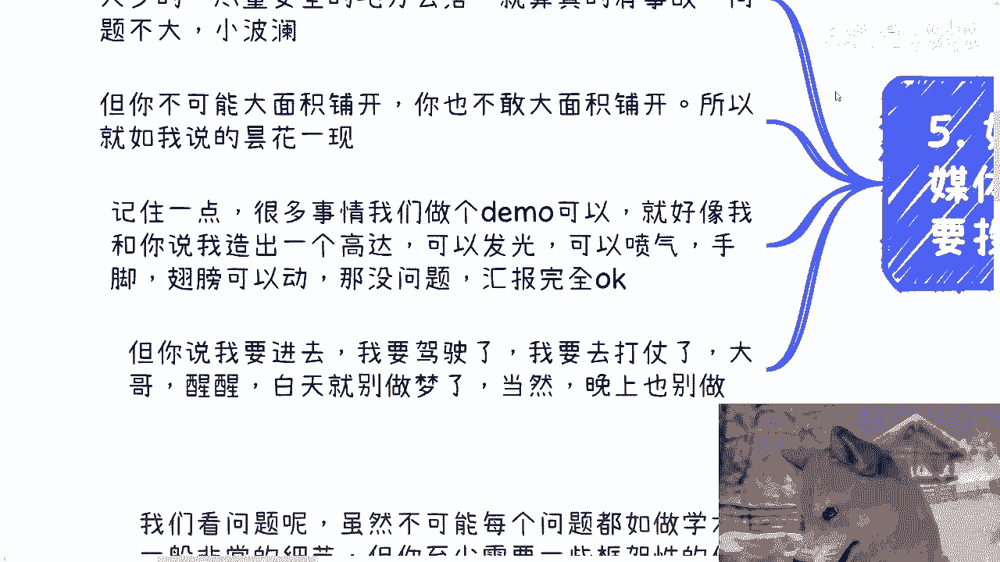
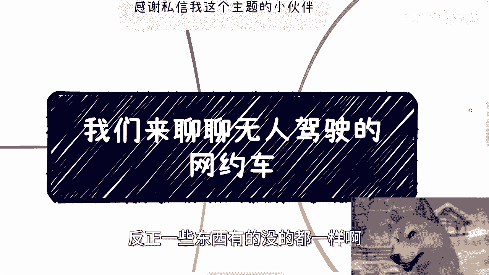

# 课程：如何理性看待科技热点与风口 🚗💨 - P1

在本节课中，我们将学习如何运用框架性思维，理性分析像“无人驾驶网约车”这样的科技热点。我们将通过一个具体案例，探讨如何避免被媒体宣传和“狼来了”的故事所误导，从而做出更符合现实逻辑的判断。

---

## 概述与背景

首先，需要说明两件事。第一，昨天录制了两个视频，另一个关于充电的视频将在今天稍后发布。第二，下期线下活动已定于本周六在南京举行，主题将涵盖低空经济、不同性质企业的就业分析以及企业数字化发展机会。详情可通过私信报名。

今天讨论的主题是“无人驾驶网约车”，灵感来源于一位观众的私信。近期，关于此话题的新闻报道确实较多。

此外，我正在上海筹划下一次大型会议，目前已联合了律师事务所、证券交易所、区政府，并正在与B站、蚂蚁金服等机构接洽，相关资源已基本就绪。

---

## 第一节：建立分析问题的基本框架 🧠

在深入讨论任何具体话题前，我们需要建立一个分析问题的基本框架。这意味着不能仅凭感觉或片面信息下结论，而应依赖框架性信息进行大致判断。

例如，很多人对上海的薪资与物价存在错觉。常见的错误逻辑是：“因为物价高、房租高，所以薪资高。” 这种因果关系并不成立。

关于薪资认知偏差，主要有两点原因：
1.  **幸存者偏差**：人们常以身边互联网从业者的薪资为标准。但根据数据，互联网从业人员仅占中国总就业人口的约13%。用一个少数群体的数据来代表整体，结论是片面的。任何行业都遵循**八二原则**，即少数人获得高薪，多数人薪资普通。
2.  **忽略基数**：上海法定的最低月薪为 **2690元**。在约2200万的总人口中，高薪人群的比例究竟有多大？用少数“幸存者”的例子来概括整体，缺乏意义。

**以上是讨论问题的基本常识和逻辑起点。不具备这些常识，讨论将失去基础。**

---

## 第二节：警惕“狼来了”的效应 🐺

上一节我们建立了理性分析的框架，本节中我们来看看一个常见的现象：“狼来了”效应。任何概念被过度宣传后，其公信力就会下降。这正是我们今天将“无人驾驶网约车”主题置于此背景下讨论的原因。

我从事政企相关业务约十年，参与过无数所谓“风口行业”的会议、专家评审和政府培训。以下是一些历史案例：
*   **智能家居/物联网**：曾被描述为永不落幕的大方向，预言两三年内进入纯智能化时代。
*   **VR/AR**：曾被预言将取代电脑、电视，成为未来唯一的交互方式。
*   **元宇宙/数字藏品**：曾被鼓吹将彻底取代实体文旅、文创产业。

这些概念在当时都被媒体大肆宣传，描绘出宏伟蓝图，但最终大多未能实现其承诺的普及与变革。去年的AIGC（人工智能生成内容）热潮也遵循了类似的逻辑。

**历史经验表明，许多科技热点如同昙花一现，本质是“钱从左口袋换到右口袋”，媒体制造舆论高潮后便迅速消退。**

---

## 第三节：理性分析无人驾驶网约车 🚦

结合前两节的框架和历史视角，我们开始正题。我不否认无人驾驶技术的价值，例如在园区物流、快递配送等特定封闭或简单场景中已有应用。**但“存在”不等于“拥有美好的未来”**。

近期，武汉、上海等地出现无人驾驶网约车的新闻，引发了关注和焦虑。但结合第二节的“狼来了”效应，这更像是一种“日常操作”和年度周期性热点，无需过度焦虑。它与历史上的诸多热点一样，很可能仍是昙花一现。

那么，我们应该如何看待这种现象？我一直建议大家去摸索社会运行和国内做事的规则，原因就在于：尽管这些热潮多是短暂的，但其中确实能产生**既得利益者**和赚钱机会。关键在于，你是否能摸索出规则，在这些热潮中抓住机会。如果只是被各种信息左右而不去理解底层逻辑，将难以有所作为。

---

## 第四节：深入剖析核心挑战 🔍

上一节我们指出了热潮中的机会主义视角，本节我们来深入剖析无人驾驶网约车面临的核心现实挑战。我们可以从几个关键问题入手：

1.  **经济性与规模化问题**：
    *   **问题**：在供小于求的经济繁荣期，推广新技术阻力较小。但即使在那种情况下，大规模铺开也需巨额投入（数十亿甚至上百亿），并可能造成类似共享单车初期的资源浪费。
    *   **现状**：当前市场环境下，政府、高校、企业、资本都预算紧张。谁会充当“冤大头”出这笔钱？资本游戏经过多年，参与者都已非常谨慎。

2.  **法律与安全问题**：
    *   **核心公式**：`可行的商业应用 = 技术成熟度 + 法律框架完善 + 安全责任明确`
    *   **现状**：目前，关于无人驾驶的法律法规和权责框架远未完善，安全性也未经大规模实践充分验证。在当前“少做少错、少折腾少亏”的普遍心态下，没有主体会愿意在法律和安全责任不明的情况下冒险。这是刻在企业和资本DNA里的基本考量。

---

## 第五节：为何仍有宣传与试点？ 📰

既然有这么多挑战，为什么媒体还要报道，为什么还有程序投入试点呢？原因其实很直接：**为了业绩汇报**。

人工智能（AI）被鼓吹了很长时间，总需要有一些看似“落地”的成果来展示。国内许多所谓的大语言模型，如果不能产生实际经济利益，很难称为真正的落地（`落地 ≠ 烧钱训练模型`）。

因此，选择在**人流量相对较少、路况相对简单安全的区域**进行无人驾驶网约车试点，就成了一个可行的“汇报素材”。即使发生事故，影响也相对可控，属于“小场面”。但这与大规模商业化推广有本质区别，因为既**缺钱**也**不敢**。

这就像制作一个高达（Gundam）模型：
*   `Demo（演示版）`：可以发光、喷气、活动关节，用于汇报和展示，非常酷炫。
*   `实战部署`：要求其投入战争、拯救世界，这完全是天方夜谭。

许多科技方向都停留在`MVP（最小可行产品）`或`Demo`阶段，距离真正投入实战、产生规模效益还非常遥远。这也是为什么我不建议个人轻易根据这些“昙花一现”的热点去选择深造或研究方向——很可能等你学成，风口早已改变。

---

## 总结与行动建议 📝

本节课中，我们一起学习了如何理性看待科技热点：
1.  **建立分析框架**：拒绝片面和情绪化判断，用数据和逻辑思考。
2.  **警惕“狼来了”**：认识到许多热点是周期性、宣传性的，本质是资源再分配。
3.  **理性评估现状**：区分“技术存在”和“商业可行”，关注法律、安全、经济性等核心约束。
4.  **理解背后动机**：识别某些试点项目的“业绩汇报”属性，而非真正的产业革命信号。

对于个人而言，关键在于**摸索规则**，而非被信息左右。如果你希望在职业规划、商业规划（股权期权、商业计划书）、合同拟定（分红、分润）等方面获得更接地气、符合现状的建议，可以整理好详细的个人背景与具体问题，通过咨询进行深入沟通。

本周六的南京线下活动仍在报名中，欢迎参与。

---