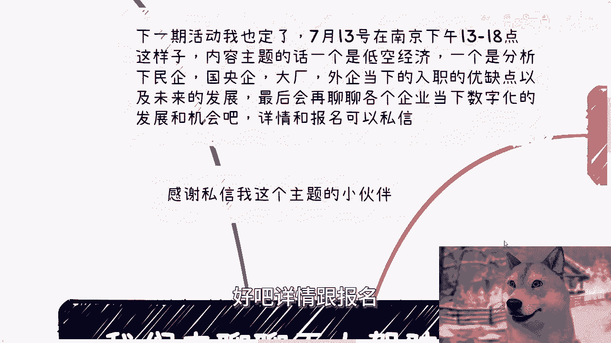
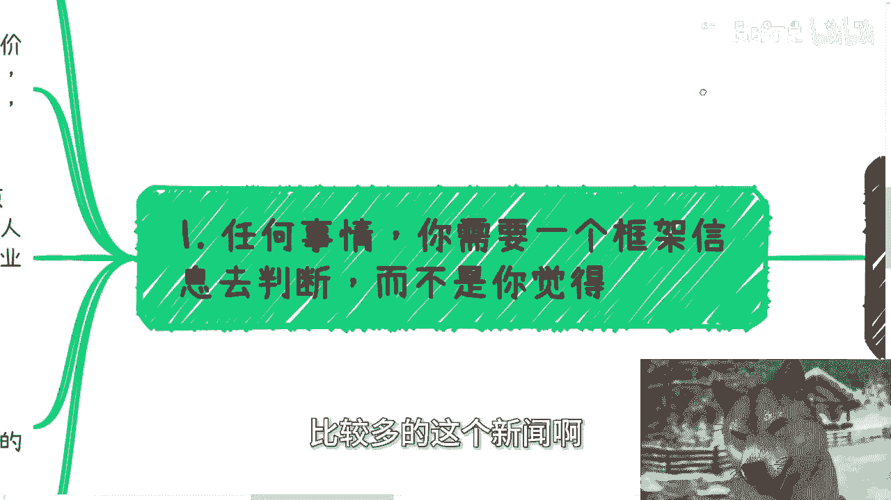
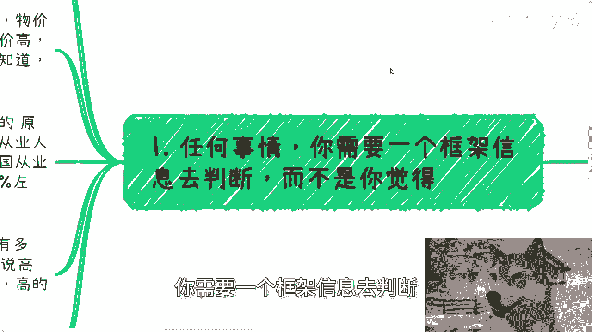
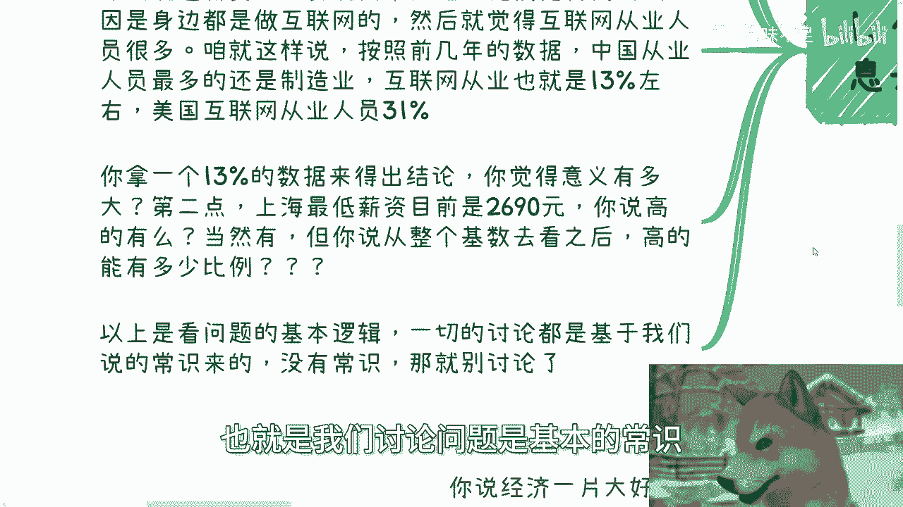
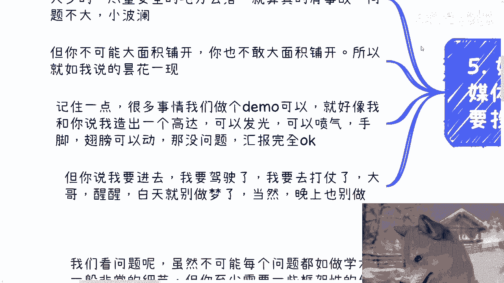

# 无人驾驶的网约车，左口袋换右口袋的事儿罢了 - P1 - 赏味不足 - BV12T421r7pf

好大家好呃，首先我先跟你们说个事啊。

就是额昨天其实我录了两个视频啊，但是因为太晚了。

所以另外一个就今天待会发，你们今天听到的那个充电视频，其实是昨天录的啊。

人这第一个啊，然后第二个呢就是那个呃，下期活动我也定了对吧，就本周六啊，在南京好吧，13呃就下午一点到六点左右，然后内容主题的话，一个是低空经济，一个是我会给你们分析一下民企国央企大厂啊，外企啊。

然后等当下这个入职的这个优缺点，以及未来的一些发展，然后最后的话再聊一聊，各个就企业当下数字化的发展跟机会好吧，详情跟报名你们可以继续私信我。

然后呢，今天这个主题呢是无人驾驶的这个网约车啊，然后也很感谢私信我主题的这位小伙伴呃，你要不私信呢，我也一下子想不起来啊。

但是最近我的确也看到了比较多的这个新闻啊。

呃然后我顺便跟你们提个事啊，就是我在上海这边在筹划下一次的那个大会，然后现在的话是已经啊找了两家律所，然后是输交所啊，然后是那个某区呃，然后我也陆续找了B站跟那个蚂蚁金服啊，反正就是我最近凑凑这些牌。

反正凑的差不多了好吧。

大家也可以期待一下，然后第一啊任何事情啊，你需要一个框架信息去判断。

而不是说你觉得啊，我给你打个比方啊，我们看问题啊，虽然不可能每个问题都做到啊，像学术研究一样那么严谨啊，或者说非常的细节，但你至少需要一些框架性的信息，去做出个大概的判断啊，我们举个例子啊。

比如说很多人对上海的薪资物价就有错觉对吧，我我我我比如说我只要问啊，他们就会说啊，因为物价高啊，因为房租高啊对吧，然后所以薪资高啊对吧好哎，看看我这智慧的眼神哎，啧对吧啊。

就是你你你只要有脑子的人就会知道吗，哦因为物价高，因为房租高，所以这他妈有你妈哪个，给我看看，哪个国家有这个那个因果关系的对吧，那这么说到，那么说到薪资啊，我跟你讲又要说两个问题，就他们觉得高的原因呢。

是因为身边都是做互联网的，我问了一圈啊，然后呢就觉得好像互联网从业人员很多对吧，怎么样啊，我就咱就这么说啊，按照2022年我如果记得没错的话，不是2021年，就2022年的数据。

中国从业人员最多的还是制造业对吧，整个互联网从业人员在中国，就占13%左右，美国互联网从业人员人员差不多在30%，到31%左右对吧，你拿一个14亿人里面，13%的数据来得出结论，你觉得意义有多大。

而且更何况，你认为互联网里面从业者薪资都很高，那他妈的低的也有啊对吧，你你看到过哪个行业，我们说八二原则，八二原则，你看到哪个行业过八80%是薪资高的，没有的呀，这这不符合正常的这个社会逻辑啊，对不对。

那么第二点啊，上海最低薪最低的这个薪资额叫什么，就是法律规定啊，目前是2690块钱哦，然后你说高有吗，有的当然有，但是你从你从整个基数，差不多两两千一百多万吧，2200万人口吧对吧。

那你但你说整个基数去看高的能有多大比例呢，对吧，你老是拿那些幸存者偏差拿出来说话，有什么用呢，啊那么以上看问题是我们的基本逻辑，也就是我们讨论问题是基本的常识。

如果没有以上那些常识，那我们就不要讨论了，对不对啊，好那么第二啊，任何事情狼来了，喊多了自然就没人信了啊，这也是为什么我们要今天放在这个。

网约车的这个主题里面啊，我就这样说啊，我做政企相关的业务，是从2012年左右开始兼职做做的啊，全职差不多是2018年左右开始做的，至少到现在加起来10年左右肯定是有的对吧。

那这个时间里面我就这么跟你们讲，我参加过无数次所谓的风口行业的活动，和所谓的专家评审会和所谓的厅局，给厅局领导坐姿做培训，做咨询，我做了非常多啊，包括这种两三千人的论坛活动也做了很多对吧。

我还记得当年智能家居的会议上面，领导跟创业者啊给我描述美好的未来，说智能家居，物联网就是未来的大方向，永远的大方向，老百姓跟企业都是离不开的啊，两三年后就是纯智能化的时代对吧。

我还记得当年VRAI的会议，上面跟我描述美好的未来，说所有人出行都离不开啊，以后电脑啊，电视啊都没有了对吧，每个人商超里面只有ARVR啊，我还记得元宇宙跟数字藏品，给我描述的美好的未来对吧。

说大家可以啊，一级市场二级市场赚钱以后，他妈的什么博物馆，海洋馆，什么文旅对吧，什么智智慧旅游，智慧城市，什么都不要对吧，纯粹元宇宙对吧，文创都要数字化，实体都他妈垃圾，巴拉巴拉，然后呢搜搜有吗。

我就跟你们这么讲，哪次给我描述这种这个这个饼的时候，哪次媒体不大肆宣传啊，啊你们没有看到，只是因为你们当时还年轻，只是因为当时可能没有这么多短视频给你们，来做舆论的这种这种这种感受，对对对。

妈每一年都这样子啊啊啊，去年GPT出来之后，AIGC也是这个逻辑啊，所以我才跟你们讲他妈的一样的呀，昙花一现啊，对吧好三，我们开始说正题啊，我不否认无人驾驶的价值啊，你我还是那句话。

你跟我讨论任何一个一个东西的未来，我都会告诉你一个未来，你就你就像你问我爱陈老师啊，人类能不能永生能啊，但是你问我什么时候我不知道啊，对不对，有意义了没有意义啊，这英文对吧。

你毕毕竟啊我们就说毕竟一些园区的物流，或者现在的快递派送已经的确用了无人驾驶，那我们就不能完全否认它，但存在并不代表美好的未来啊，对不对啊，这就好像我们说上海有高新，上海物价高没有错，然后你说哦。

因为我知道上海有高新，上海的物价高，然后得出一个结论，就上海所有的从业人员，所有的老百姓薪资都有美好的未来一样，可能吗啦，可能么啦，对不对啊，最近因为那个新闻当中也写了嘛对吧，一些地方啊，这个武汉啊。

上海啊对吧，无人这个自动驾驶的无人网约车啊，新闻比较多，我也看到了啊，可能大家又开始啊觉得媒体大肆宣传啊，或者开始开始焦虑，开始思考了对吧，但其实你们结合我刚刚说的第二点，你们就会明白这叫什么。

这叫日常操作对吧，这叫每一年的高潮，没啥可焦虑的，狼来了太多次了，有啥可焦虑的呢，对不对，就是这玩意，就跟以前历史历史上，二里面所说的那些东西一样，和中国的AIGC是一样，都是昙花一现，还是那句话。

钱从这个口袋到了那个口袋啊，然后媒体让老百姓高潮一下没有了，nothing对不对，当然你你要是问我怎么看，我就会告诉你，我为什么一直让你们去摸索这个社会的规则，摸索国内的做事情规则。

就是因为虽然这些东西都是高潮，但是他一样能够带来非常就很多的既得利益者，的确是能赚到钱的，那么你们要去摸索的就是，如何在这种高潮里面对吧，去赚到钱，那你们要是哦又不摸索这些规则。

然后一天到晚的就被这种有的没的，这种信息所左右，那你们还能干嘛呢，对不对啊，然后第三最后一点我们简单来分析一下对吧，就说这个问题啊，为什么，首先你说经济一片大好的时候，或者说供小于求的时候啊。

这件事情没有问题，一点问题都没有啊，而且当然就算，而且而且啊就是就算是经济一片繁荣，供小于求，你能不能大面积铺开，我还是两说的对吧，你们再想想以前OOO的浪费，想想各种各样那个以前共享单车。

包括包括当年那个那个叫什么，就是呃互联网打车啊，整个的资金投入浪费有多少多的浪费啊，不不仅仅是资金投入，还有资源投入，资源的浪费对吧，但现在你看啊，你从我角度来讲，我就问了几个问题。

第一如果你说这个东西有未来去，我就问你谁钱谁出钱，又从哪儿赚对吧，你我们先几个一个个来啊，第一老百姓会买单吗，你要让老百姓买单可能吗，可能的，你得成规模，你成规某没有个几十个亿，上百个亿投下去可能吗。

市场会答应吗，你去看看啊，没有可能性的呀对吧，那么我们再回到这个问题上面，钱谁来出对吧啊，然后第二就算钱出了，谁来买单，现在政府高校企业资本只要接触过的都知道，都没有预算，谁出啊。

哪个冤大头出啊啊资本游戏，资本游戏大家过了这么多年，谁看看不懂啊，谁他妈都不是啊对吧，你最重要的还有一点啊，最重要的是法律更安全，你你无人驾驶前跟我谈谈，看，有法律吗，有法律和有法律的框架吗。

有安全性吗，有吗对吧，连测试都没有，安全性个屁啊啊，现在整个市场跟社会情况，无论是民企还是国央企，大家都懂得一个道理，就是叫做少做少错对吧，少折腾少那个少亏对吧。

那么谁会在法律没有完善情况下面跟安全问题，责任不明确的情况下面去冒险啊，这不有毛病吗，对不对，那我还是那句话，既得利益者跟资本家都不是啊，这些东西都是他们默认刻在他们DNA里面。

会去考虑的问题，对吧好，那么说到这啊，最后一个问题就有，那那那说到这就有人肯定要说，他说那按照你这么说法，那媒体为什么要报道呢，对吧，那为什么最近这些程序要投入去使用呢。

那他妈很简单嘛，因为要业绩汇报啊，AI吹了这么长时间，他妈的总归有个东西要落地吧，你告诉我他妈现在哪个东西弱点，你别别跟我讲，他妈的，国内那些大那个大数据语言模型叫落地啊，那他妈叫个屁落地啊。

你不能你不能产生利益颤，这他妈叫个屁落地对吧，告诉我哦，我一年要烧掉几个亿，来来训练妈脑子有毛病啊啊那怎么办呢，那只能往人少的尽量安全的地方去落对吧，那就算有事故了，问题也不大对吧，都是都是小场面啊。

小场面，但你不可能大面积铺开，为什么，因为你也不敢大面积铺开，谁敢啊啊，一是你没钱，二是你不敢，所以就如我说的，就这就是昙花一现啊，记住一点啊，很多事情我们能做个demo是可以的，什么意思啊。

这就好像我跟你说，我他妈造个高达，我找高大呀，刚大木，对不对，可以发光，可以喷气，手脚翅膀可以动，没问题啊，给你汇报呀，完全牛逼呀，对不对，但是你跟我说，陈老师我要驾驶啊，你跟我给我投入战争啊。

我要去打仗来啊，我要我要去拯拯救啊，大哥醒醒啊，白天别做梦，当然晚上也别做梦，你你明白了吗。

就是说很多东西我们在软件层面叫MVP对吧，包括叫demo，就是你试用版是试用版，它离真正投入实战投入使用还早得远远得很呐，对不对哦，你说妈的很多老百姓啊，包括你们对吧，很多人来问我。

哎陈老师这个方向怎么样，那个方向怎么样，你想想看，我为什么不愿意跟你们去聊这个东西，是因为那些方向都是昙花一现的，你们反而会因为这种东西说爱陈老师，我去读个本，读个硕对吧，我再去读个什么方向研究。

大哥等你读出来，他妈方向早就变了，你懂吗啊，唉哟我他妈服了，真的是对不对啊，所以说就是说这个东西啊，就跟以前的我们说的什么3D打印啊。

什么什么什么乱七八糟啊，反正一些东西有的没的都一样啊。

就那么回事嘶，好吧行啊，然后本周六啊活动继续报名。

然后剩下的话就是说职业规划，商业规划，股权期权，商业计划书白皮书啊，分红分润合同啊，包括你们手上有什么牌，你们没有什么牌，你们希望通过跟我的沟通啊，能够让我给你们一些更接地气的，更实际的。

符合当下情况的一些建议的话，你们可以在整理好详细的背景跟详细的问题，好吧，我们再来走咨询。

啧好了。