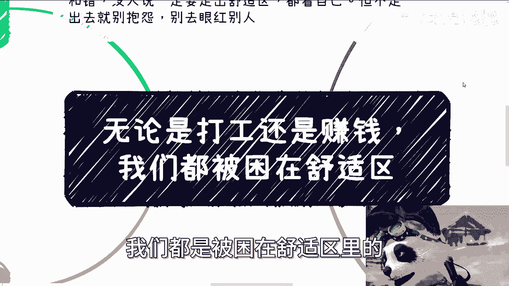

# 课程名称：突破舒适区，实现个人发展 🚀 - P1

在本节课中，我们将要学习“舒适区”这一概念如何影响我们的职业选择、赚钱思维和个人发展。我们将通过分析几个常见的思维误区，来理解为何我们常常被困在原地，以及如何从心态和行动上寻求突破。

---

## 概述：舒适区的自我选择与责任

舒适与否是一种个人选择，没有绝对的对错。没有人强迫你必须走出舒适区。但关键在于，如果你选择不走出去，就不要抱怨现状，也不要眼红他人的成就。这是一个简单的逻辑。

---

## 第一节：地域束缚与机会成本

上一节我们提到了选择的责任，本节中我们来看看最常见的束缚之一：地域。

许多人会问，选择哪个城市发展更好？例如，居住在A城市，但想去B城市工作，又担心影响其他发展或赚钱机会。

世界运行的规律是：**发展和赚钱不会围着你转，而是你需要围着机会转**。观察那些事业有成的人，没有一个是被局限在单一城市的。当你有“地域限制”的想法时，本质上仍是舒适区在作祟。你不愿舍弃已有的安稳，既想保住手中的“鸡蛋”，又想去拿外面的“蛋糕”。

真正的行动逻辑是：**哪里有机会，就往哪里去**。赚钱的人不会守株待兔。他们的模式是：尝试 -> 赚钱则继续/扩大 -> 不赚钱则及时止损并转向新方向。

除非有不可抗力的家庭紧急情况（如家人重病），否则束缚你的只有你自己。成年人拥有选择的自由，所谓的“束缚”常常是自我设限或逃避责任的借口。

---

## 第二节：赚钱欲望与动力来源

理解了地域的束缚后，我们再来剖析内在动力的来源。

不少人表示自己没有赚钱的欲望，或者当下并不缺钱，不知如何提升动力。

以下是两个核心观点：

1.  **欲望是内生的**：赚钱欲望是个人内在的驱动力，外界很难强行赋予。无论是上课还是体验生活，都无法从根本上改变一个人的欲望水平。
2.  **动力源于对未来的不安**：真正能赚到钱的人，大部分并非当下极度缺钱的人。他们的动力更多来自于**对未来的不确定性、恐惧以及为自己建立保障的需求**。等到真正缺钱时再行动，往往为时已晚。

---

## 第三节：规避风险的“周全”思维陷阱

在讨论了动力问题后，我们来看一种更隐蔽的舒适区表现：追求“万全之策”。

以下是一个典型的咨询案例，展示了这种思维：

*   **工作**：喜欢且稳定（如公务员），但薪资不高。
*   **副业**：**如果做得好**收入可观，但不稳定。
*   **买房**：买了怕跌，不买怕以后买不起。

这种思维模式希望规避所有风险，占尽所有好处，本质上是一种停留在“思考周全”假象中的舒适区。它导致行动瘫痪，因为现实中不存在毫无风险的完美路径。

---

## 第四节：目标模糊与“等待时机”的误区

上一节我们看到了“求全”的陷阱，本节我们来看看“等待”的误区。

一种常见的错误逻辑是：“我先工作一段时间，等时机成熟了，再去积累关系、赚钱。”

这个逻辑从源头就是错的。原因在于：

*   **积累需要时间**：关系、经验、能力的积累，以及需要踩的“坑”，都需要时间成本。你不提前开始，机会来临时凭什么轮到你？
*   **时机不等人**：市场不会为你预留“入场券”。幻想“时机成熟”再行动，往往意味着永远无法开始。

这种“等待”的潜台词是“让我再舒适一下”，结果通常是“一直舒适下去”。从22岁到35岁，借口可以一直不变。

当下的环境或许建议“苟着”（求稳），但“苟着”不等于停滞。**苟着的目的是为了生存，以便朝着明确的目标积蓄力量**。如果你的目标就是“苟着”，那么当环境变化、无法再“苟”时，你将束手无策。

---

## 第五节：自救者天助之

最后，我们必须明确一个原则：发展源于自救。

最近的一些咨询案例显示，有些人会“两手一摊”地提问，自己没有任何方向、思考和初步想法。

这违背了寻求帮助的基本原则。**自救，意味着你必须先有自己的思考**。你可以提出不成熟的问题，但不能完全没有问题。你自己才是个人发展的第一责任人。无论是咨询他人还是自我探索，主动思考是第一步。

---

## 总结

本节课中我们一起学习了“舒适区”如何以多种形式影响我们：

1.  **地域束缚**：本质是不愿为机会付出迁移成本。
2.  **动力不足**：将原因归于外界，而非审视内在驱动和对未来的规划。
3.  **追求万全**：用看似周全的思考掩盖对风险的恐惧，导致无法行动。
4.  **等待时机**：用模糊的目标为拖延提供借口，错失积累的黄金时间。
5.  **放弃思考**：指望他人直接给出答案，缺乏自救的主动性。

突破舒适区，并非盲目冒险，而是认清自我设限的根源，并为自己的选择承担全部责任。从明确一个具体目标开始，哪怕很小，并为之付出行动，才是走出困局的第一步。