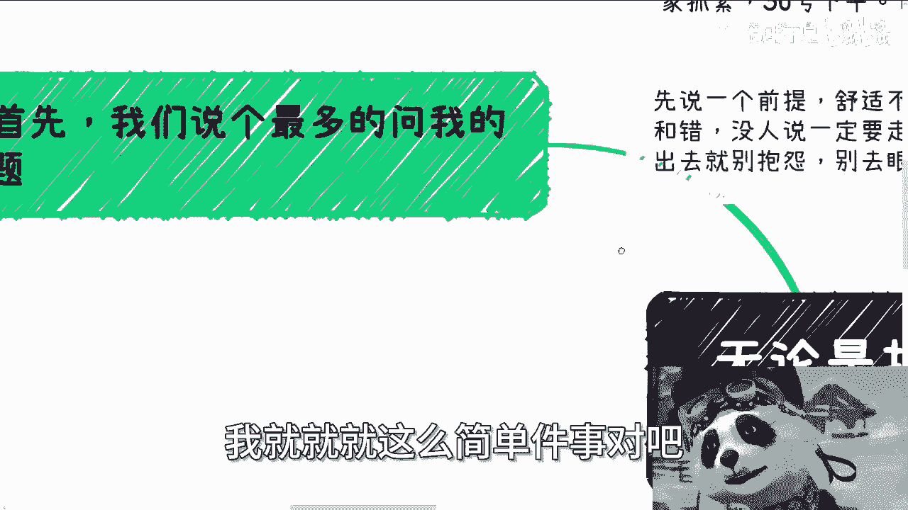
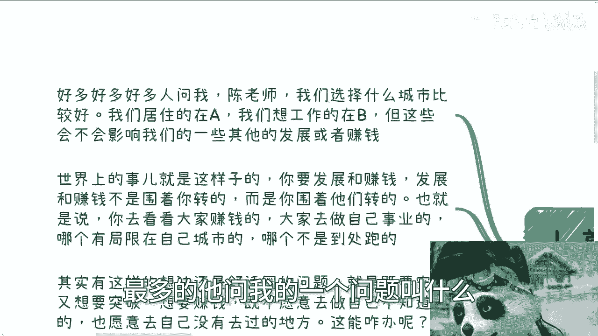
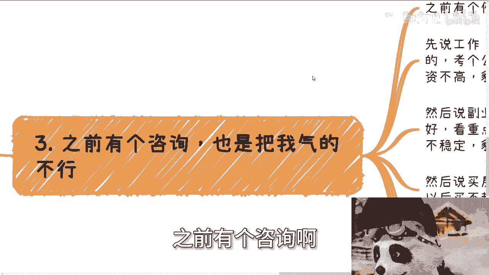
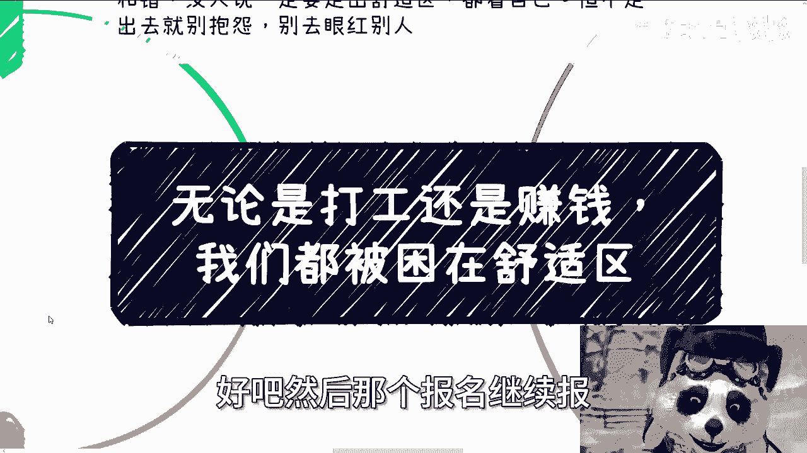
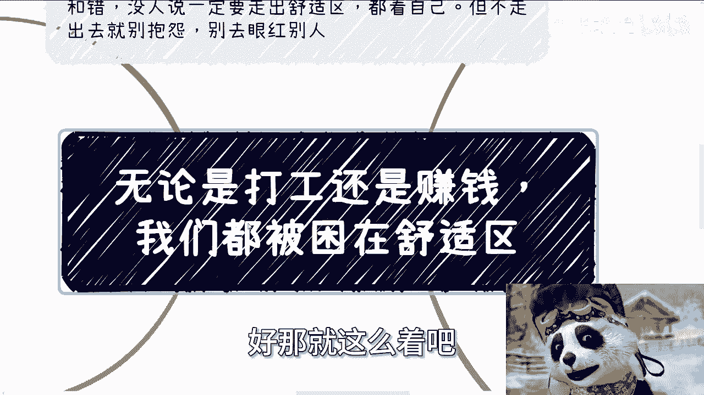

# 无论打工还是赚钱，我们都被困在舒适区里 - P1 - 赏味不足 - BV1mt421G75a

好大家好啊，今天又到礼拜五了啊，这最近这个时间过得有点快啊。

呃首先上海跟北京活动继续报名，上海是后天下午啊，场地比较大，反正都还行，北京场地比较小啊，限制人数，大家反正抓紧，30号下午好啊，详情跟报名都可以私信我啊，然后今天这个主题呢叫做无论打工还是赚钱啊。

我们都是被困在舒适区里的。

嗯所以啊再说一个前提啊，这个舒适不舒适都是自己选的，没有对跟错啊，不要到时候人家搞得说啊，说我这个要叫人家出处是区是吧啊，没人要一定要说走出书就是虚啊，多看自己啊，走不走，但是呢你不走出去，别抱怨啊。

也别去眼红别人，我就就就这么简单一件事。

对吧啊，首先啊我们说啊，最多的他问我一个问题叫什么。

就他说好多好多小伙伴问我，他说陈老师我们选择城市，选择什么城市比较好，比如说我们居住在A啊，我们想呃呃我们想工作的地方是在B啊，呃但是呢，这些会不会影响我们在其他的一些发展，或者赚钱啊，我跟你讲啊。

世界上的事情是这样子的，你要发展跟赚钱，发展也好，赚钱也罢，发展跟赚钱，它不是围着你转的，是你围着发展跟赚钱赚的对吧，也就是说啊，也就是说你去看看大家赚钱，大家去做自己事业的哪一个。

它局限在自己城市的哪一个，他不是到处跑的，有吗，没有的啊，就是说其实你有这个想法的时候，就还是你在舒适圈的问题，或者说你不愿意放开你自己，或者说你不愿意舍弃你已有的一些东西，那么你既要安稳。

既想要有手上的鸡蛋，又想要外面的东西对吧，那么你既想安稳，又要突破，又要赚钱，既不愿意去做自己不知道的，也呃不愿意，也不愿意去，自己没有去过地方，那你说能咋办对吧，能咋办啊，真正你要想赚钱能赚钱的人。

他哪儿哪儿有机会直接往哪儿跑，你看到过赚钱的人是属于那种坐以待毙的，守株待兔的吗，没有的啊，他干了赚到钱了就换啊，赚不到钱及时及时止损，再往别的方向干对吧，你要我说只要不是你老婆或者你自己怀孕了啊。

要生了啊，只要不是说你家里面有什么呃呃老弱病残对吧，有任何急事的，我不觉得有什么东西束缚你，能有什么束缚你的束缚你的是你自己。

你你最多就是甩锅给你父母或者甩锅给谁，但最后人家也没绑住你，你是个成年人，你想怎么定呢对吧，你想怎么滴哦，你就像很多人跟我聊的时候，我就跟他说，我说大哥你是成年人，怎么滴了，锁住你了。

绑住你了还是怎么滴了对吧，没有啊，就是你有放不开的东西，我尊重你，但是你放不开的东西，然后你就比如说很多人跟我说，哎陈老师，你看我女朋友在这个地方对吧，我我我可能我父母在这个地方或者怎么样子。

那我说现在有什么问题吗，没有，那你为什么不出去，或者为什么不去看更多的东西，不愿意去付出更多的时间呢，对吧哦你又不愿意，就是说呃就是说你把这个锅甩到你女朋友。

甩到你父母头上，那你说人家认不认嘛，然后第二我跟你讲赚钱也是的，就有不少人跟我说，他说陈老师我现在没有钱，没有赚钱的欲望啊，我怎么提升这个欲望啊，然后包括就跟我说，其实我现在也不怎么缺钱。

我给你讲两方面，第一方面你没有赚钱的欲望，这个是看个人的，你说外界怎么干涉呢，对吧，你说你今天花几万，花几10万，甚至花几百万去做一个心理咨询，或者给你个课有用吗，哦你上完一个课，你就有赚钱的欲望了啊。

还是说把你扔到深山野林里面啊，看一下看一下穷苦老百姓对吧，你不可能的呀，就是说白了这个什么叫什么有没有欲望，这个东西就是跟你个人有关的，你靠谁都解决不了的啊，然后另外一方面呢，我说现在不怎么缺钱。

但有一说一你你你仔细去看啊，真正能赚钱的大概率啊，大部分并不是当下很缺钱的人啊对吧，我之前在谈商业的时候，我就说到过，就是我们合作当中有一类人是不合作，哪一类人，哪一类人就是当下缺钱的人是不合作的。

为什么，因为真正当下缺钱的人，他视野是很狭隘的啊，你不要指望你也不要强迫他有全局观，人家生存都有问题，哪来的全局观对吧，你跟我扯什么什么全局观对吧，那么但是这种情况就很难赚钱，所以真正能赚到钱的。

往往并不是现在那么缺的人，他们的动力来自于是对未来的不稳定，对未来的恐惧以及对于自己的一种保障，而不是说当下缺不缺钱。

你真的到缺钱了，你来得及不了，来不及了呀对吧，而且这种事情是我说了听的吗，没用的，你们父母说了，你们都不听，有什么用呢，没有用的，然后第三就我给你们举个例子，之前有个咨询也是一塌糊涂。

他是跟我这么讲的，他说陈老师，我先说工作啊，这工作呢我还是蛮喜欢的啊，我想考公务员啊，蛮稳定的，但有个问题薪资不高啊，貌似满足不了我这一年的需求，好，我听他继续说啊，然后说副业，对方说成了啥。

这个副业呢如果做得好啊，你看划重点，就是他有个前提叫如果做的好，他如果做的好呢，其他人蛮多的，但是不稳定啊，貌似有一单没一单啊，嗯啊我姑且听之啊，然后呢说买房子啊，这买吧，他说买了万一跌了怎么办。

不买吧，以后万一买不起怎么办，啧你们能理解吗，你知道吗，就我跟你们这么说，我有时候跟我朋友说，我咨询他们说了，他说你这个赚的不是咨询费啊，赚的是精神损失费啊，对吧啊，我当时心里只想说，好好好，对对对。

是是是遥遥领先对吧，我他妈可去你妈的，是吧，哎那你想怎么样，那世界上所有的好处你都占了，对不对啊，那我跟你们讲啊，其实很多人他有类似的想法，他只不过就是没有这个人这么离谱啊，这种呢本质上也是一种舒适区。

而且他还会觉得自己思考的很周全，你怎么解释呢，你怎么沟通，你告诉我对吧，那本质上你就是一坨，你沟通啥是吧啊，然后第四点我跟你讲啊，目标就是要明确的，什么意思呢，就是说很多人想法就是这样子。

他说我先工作一段时间，等时机合适了，成熟了啊，我想办法去积累关系去赚钱，它看似逻辑很通，但其实从源头就是错的，为什么，因为你积累也好，赚钱也好，你的要踩的坑也好，你终究要花这些时间去踩的哦。

你说我先工作一段时间，等时机合适了，那我就这么跟你讲，等时机合适了，你去积累，我，那凭什么轮得到你积累啊，这他妈中国这么多人这么卷，你去几类，你去赚钱，那凭什么你去转哦，你前面不积累，不铺垫。

等时机合适，我去转，那奇了怪了，时机等你来的是吧，哦所有人让开啊，时机到了好来请你入场，会不拉对吧，就是就是你们的父母，你们的老师或者谁给予你们这种想法，我觉得他们因为没有跟。

根本没有接触过整个市场的一线，或者说他们的版本可能是60年代，70年代跟现在也没没有任何的关联性，但那那人，我觉得我们不能把这个锅甩到父母头上，也不能甩到老师头上，那你作为你们作为年轻人。

你们要去接地气的对吧，哦永远只听上一代的，永远只听那些腐朽的东西，怎么进步，社会怎么进步，你们怎么进步对吧，你就像谁给我发啊，你就像这个舒适区，有很多人就说他的潜台词是什么，潜台词就是让我再舒适一下。

你让你再舒适一下，结果就是一直舒适下去，我就跟你说啊，就这么简单，你就拿你，你就拿你工作，你说时机成熟了，出来积累关系，什么叫实际成熟了，怎么算成熟了，你每次都跟自己说，哎呀我来不行对吧。

我出去了就没工作了，哎呀我出去积累不到东西，哎呀我自己什么都不会，是的呀，你22岁怎么讲，24岁怎么讲，26岁怎么讲，30岁也这么讲，35岁也这么讲，那什么时候100岁出去啊，到哪去啊，外星对吧。

你包括什么，包括就是说呃你们现在选择大方向也是，这就好像我一直说的，当下这个情况的确应该苟着没有错对吧，这是为什么要苟着，这是因为大部分人翅膀不够硬，你不苟着它生存不下去，但是你不能指狗子对吧。

你到时候说来说要苟着就苟着，苟着干嘛，每天划水，划完水回家继续打王者荣耀对吧，一样的呀，你要苟着，你现在就要朝着目标前进，那你的目标是什么，你得想好，如果你跟我说，你的目标就是苟着。

那你永远只能苟下去的呀，而且你到时候不久之后总有苟不住的时候，那怎么办呢，到时候就要说了，哎呀我们要赚钱，有用不啦，没用的呀。

是不是啊，而且最近啊我跟你们讲啊，这咨询也是的，有好多人他就是真的是两手一摊来问我，哎我真的跟你们讲啊，所谓要发展要救自己得要先自救，什么叫先自救，就是你自己不能两手一摊的，你得先思考一下。

你觉得你能做什么，或者你觉得往哪些方面做，有什么问题，你可以是虚的问题，但是你不能什么都没有，两手一摊，你来问我啊，我怎么知道呢，你知道吗，就就他们有很多，有些最近有些咨询的很神奇的，就是两手一摊。

我问他什么都没有，就真的是什么都没有，然后他也没有方向，也没有想法，然后就什么都没有，那你什么都没有，你你来问我干嘛呢对吧，那你咱画摊开来说，你如果只是来咨询，那你什么都没有，你就不要来对吧。

你要是想要我来带你的，那我就告诉你，这不是700块钱的问题，你你给我70万可以考虑一下对吧，这有一码归一码吗，哦你说大家来讨论问题，你不管出去到社会上去找任何人，你总归是要思考好点哦，你是不思考好。

去问别人，你只有你自己为你自己负责啊，我又不为你负责的了对吧，我而且我也跟你们说，就有一些呢我就是700块钱直接退掉的，我也不想赚他这个钱对吧，有一些比如说只聊了聊了一段时间的。

我觉得可能也聊不出什么东西来的，我基本上就会退他一半的钱，我也我也不是很想去赚这个钱对吧，就是你有问题，我能帮到你，那最好你没问题，我跟你瞎扯淡，那我去扯他干嘛是吧，啊好那就先这么着吧好吧。

然后那个报名继续报好吧。

这个活动报名继续报呃，我顺便说一句啊，就下个月我计划就是广州深圳好吧，5月份的话我计划是成都跟武汉，但是我只是计划啊，嗯到时候我不知道人多不多，好吧行，那就这么着啊，然后那个职业规划啊，商业规划。

股权融资啊对吧，商业计划书啊啊，或者你们现在有一些自己想法的，但是不知道在全局的这种环境下，应该怎么做判断的，或者不知道该怎么往前走的，或者不知道应该怎么往哪个方向去积累的，那么你们可以整理好好吧。

然后我们再做咨询好。

