# 课程 P1：职场与商业中如何避免成为“纯工具人” 🧠


在本节课中，我们将探讨一个在职场和商业中普遍存在的现象：成为“工具人”。我们将分析为何不应只停留在工具人层面，并提供具体方法，帮助你在执行任务的同时获得真正的成长与全局视野。

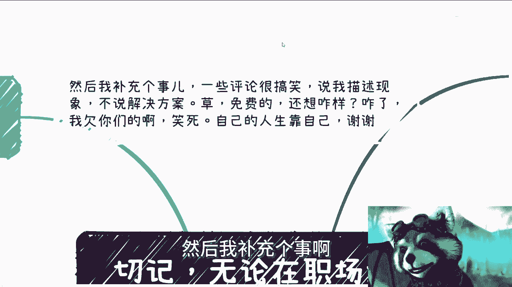

---


## 概述

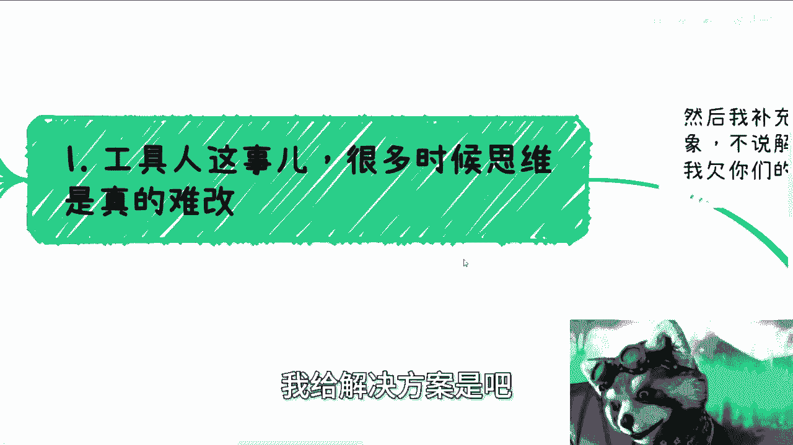

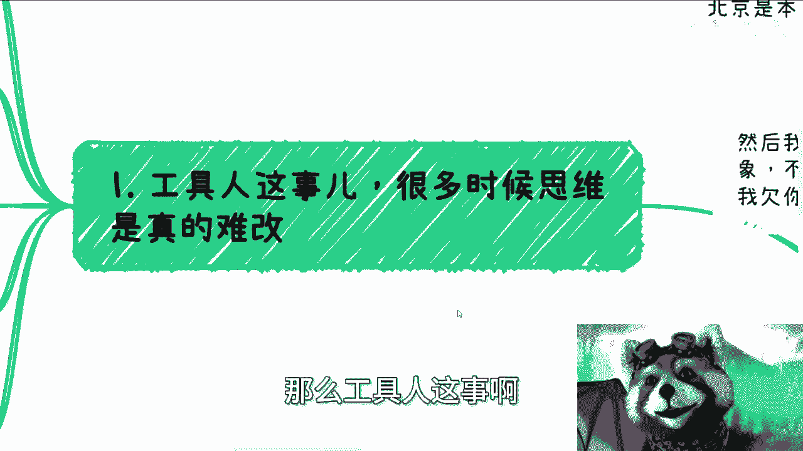

无论职场还是商业活动，许多人发现自己处于“工具人”的境地——即只负责执行具体任务，而不了解业务全貌。本节课将解释为何需要超越这一角色，以及如何通过改变思维和行动，从单纯执行者转变为具有大局观的参与者。


---

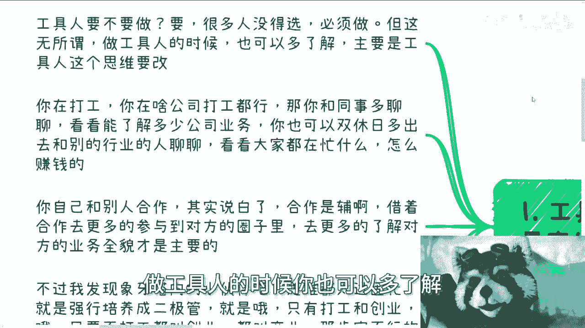

## 1. 工具人现象与思维困境

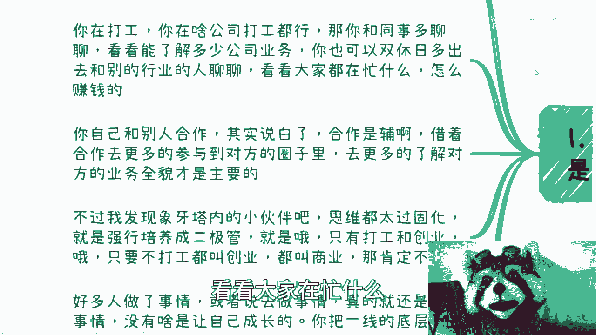

上一节我们概述了课程主题，本节中我们来看看“工具人”现象及其背后的思维困境。

很多人觉得自己无法避免成为工具人，因为现实条件限制。这种思维很难改变，但必须调整。工具人本身并非问题，问题在于固化的工具人思维。

**核心公式**：
```
工具人状态 = 仅执行任务 + 不了解业务全貌
```


## 2. 改变思维：从执行到洞察

上一节我们认识了工具人思维，本节中我们来看看如何改变这种思维。

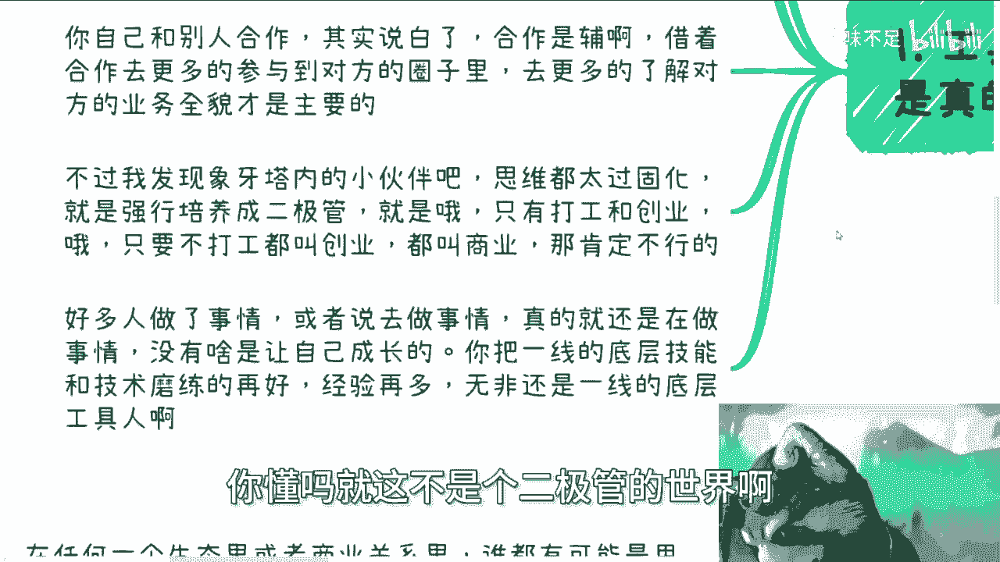

关键在于，即使在执行工具人任务时，也要主动了解更广泛的业务信息。例如，在工作中，不要只关注自己的任务，而应与不同部门的同事交流。

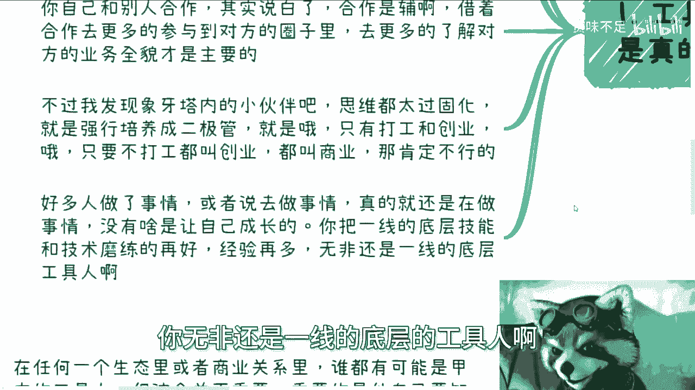

以下是具体行动建议：

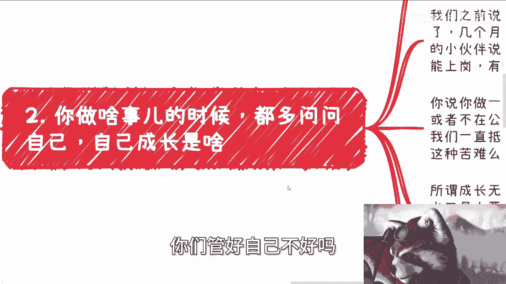

*   与同事交流：主动与商务、销售、市场、运营等部门的同事沟通，了解公司业务运作。
*   拓展社交圈：在业余时间与其他行业的人交流，了解不同的赚钱模式和商业实践。
*   改变对话焦点：与他人交流时，避免只谈论技术、工具等执行层话题，应多探讨商业逻辑和盈利模式。

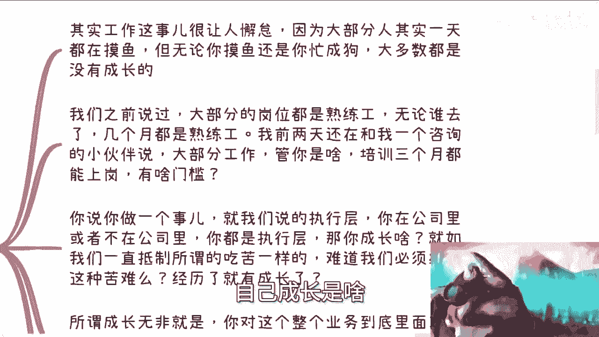

## 3. 合作的真谛：辅助与学习


上一节我们讨论了如何通过交流改变思维，本节中我们来看看如何通过“合作”实现成长。

很多人误解了合作的目的。合作不应是你全部投入的主线任务，而应是一个辅助过程。


**核心概念**：
```python
# 合作的正确目的
def 合作(我方, 对方):
    主要目标 = 通过合作深入了解对方的业务圈与全貌
    次要目标 = 完成合作项目本身
    return 主要目标, 次要目标
```


合作是手段，不是目的。真正的目标是借助合作机会，深入参与对方的业务圈子，了解其运作的全貌。这才是你的“主线任务”。

## 4. 打破二元对立：打工、创业与商业


上一节我们明确了合作的目的，本节中我们来看看需要破除的另一个思维误区。


许多人的思维非此即彼，形成了“打工”与“创业/商业”的二元对立。这种想法是错误的。


*   不打工 ≠ 就是在创业或经商。
*   很多人即使不打工，仍然在做着工具人的工作。
*   真正的区别在于是否具备**全局观**和对业务的**深度理解**。

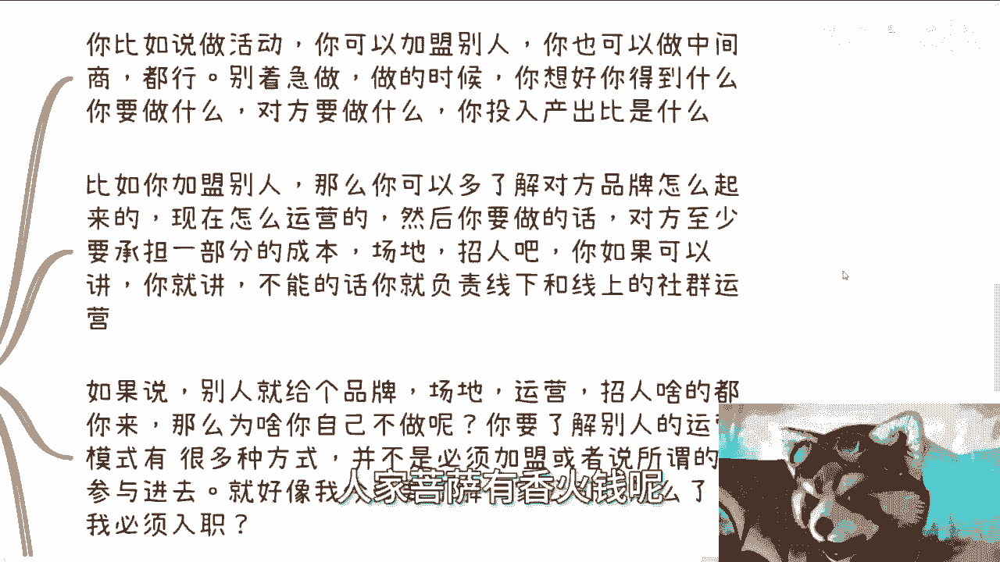

成长的关键，在于你是否能从全局视角理解业务，了解其中需要多少“工具人”，明确自己的位置，并掌握业务从0到1的全流程、上下游和运行模式。这被称为**大局观**或**格局**。


## 5. 聚焦核心：成长与收获


上一节我们打破了非黑即白的思维，本节中我们来看看在任何行动中应聚焦的核心。


无论打工还是参与外部业务，最高优先级永远是考虑自己的**成长**与**收获**。你需要不断问自己：做这件事，我能得到什么？

以下是评估行动价值的框架：


*   **明确目标**：你想通过这次行动获得什么？（金钱、经验、人脉、认知？）
*   **分析角色**：你需要做什么？对方需要提供什么？
*   **计算投资回报率**：你的投入（时间、精力、金钱）与预期收获是否匹配？
*   **审视必要性**：为了了解某个业务，是否必须亲身参与？是否有更低成本的方式（如通过人脉结识关键人物）？


**核心提醒**：如果一项行动只带来了金钱，而没有带来认知、经验或关系的提升，那么它对你未来的发展助益有限。你需要了解业务全局，才能规划未来、整合资源、甚至为他人“画饼”（描绘愿景）。

## 6. 识别与利用：人人皆可为“工具”


上一节我们学会了聚焦自身成长，本节中我们来看看如何识别并利用身边的“工具人”资源。


你需要明白一个现实：在商业生态中，很多人（包括你的领导、一些创业者和管理层）本质上也是更高层面的“工具人”。商业关系是一层吃一层的。

因此，不要盲目崇拜头衔。判断一个人的价值，要看他是否具备**全局思想**和**突破现状的认知**。如果一个人思想僵化，固守陈旧套路，即使经验丰富，你能从他身上学到的东西也有限。


反过来，中国遍地都是“工具人”，各行各业都不缺执行者。你要思考的是如何**利用**这些资源。

**核心前提**：要想有效整合和利用他人（工具人），你自己必须首先对业务全局有清晰的认知。否则，你无法知道需要整合哪些资源，以及如何将它们组合起来。

例如，组织一场活动，不必事事亲力亲为。可以寻找擅长海报设计、文案撰写、渠道宣发的人合作，大家各司其职，共享成果。**懂得用人**是个体成就事业的关键。

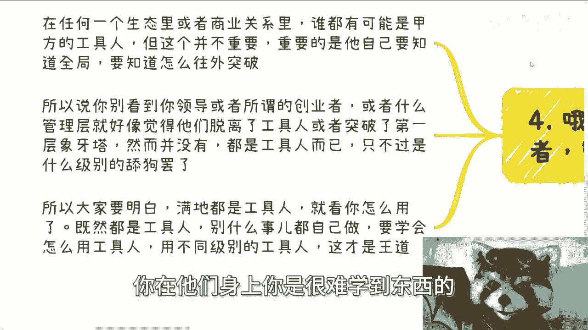

## 7. 行动准则：有选择地做“工具人”

上一节我们讨论了利用资源，本节也是最后一节，我们来总结作为个体应遵循的行动准则。

给别人当“工具人”并非绝对不好，但必须有选择、有原则。

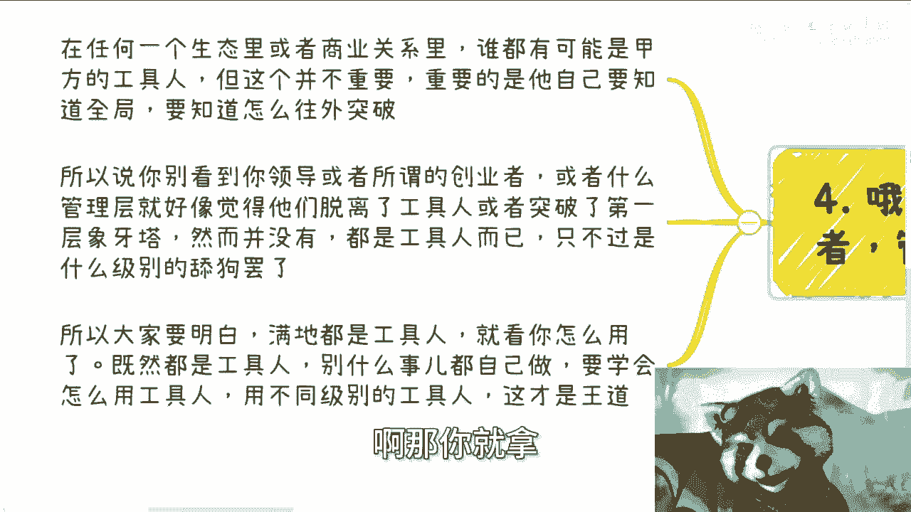

**决策模型**：
```
是否接受一个任务 = f(金钱报酬， 认知收获， 关系拓展， 其他资源)
```
如果对方提供的价值（尤其是金钱）足够高，可以接受。如果价值低，且无法让你了解业务、拓展关系，那就应该拒绝。你的时间和精力是宝贵的，应当投入到能带来复合增长的事情上。

在做任何事之前，都要用上述模型评估：做了之后，除了可能赚到钱，我有成长吗？如果答案是否定的，就需要慎重考虑其必要性。

---

## 总结

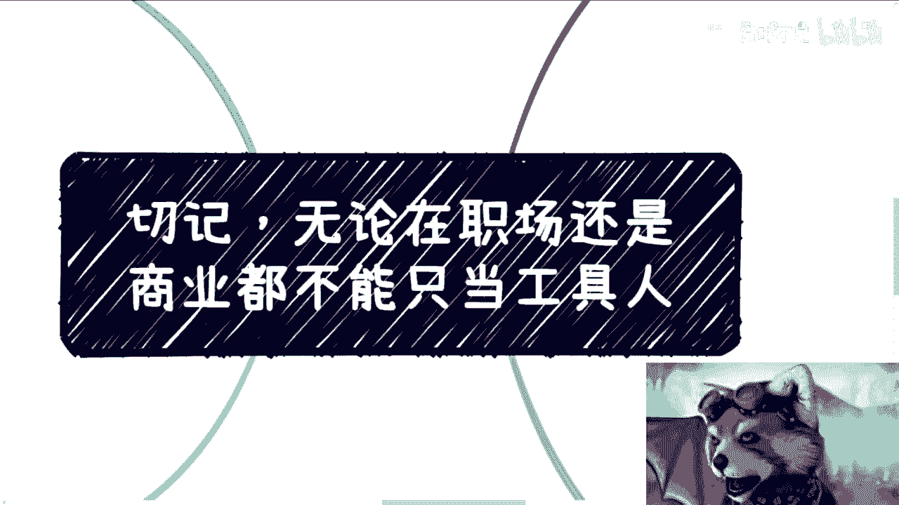

本节课中，我们一起学习了如何在职场和商业中避免成为“纯工具人”。


我们首先认识了工具人思维及其局限，然后学习了通过主动交流、改变对话焦点来拓宽视野。我们明确了合作是辅助学习的手段，而非终极目标，并打破了“打工与创业”的二元对立思维。我们强调在任何行动中都要聚焦于自身的成长与收获，学会识别并利用身边的“工具人”资源，但前提是自己要具备全局观。最后，我们建立了有选择地接受任务的决策准则。


记住，核心在于思维的转变：从被动执行到主动洞察，从关注任务本身到关注业务全局与个人成长。