# 无论职场和商业避免不了当工具人，但不能只当工具人 - P1 - 赏味不足 - BV1GJ4m1a7wo

大家好，我最近在打那个碧蓝幻想。

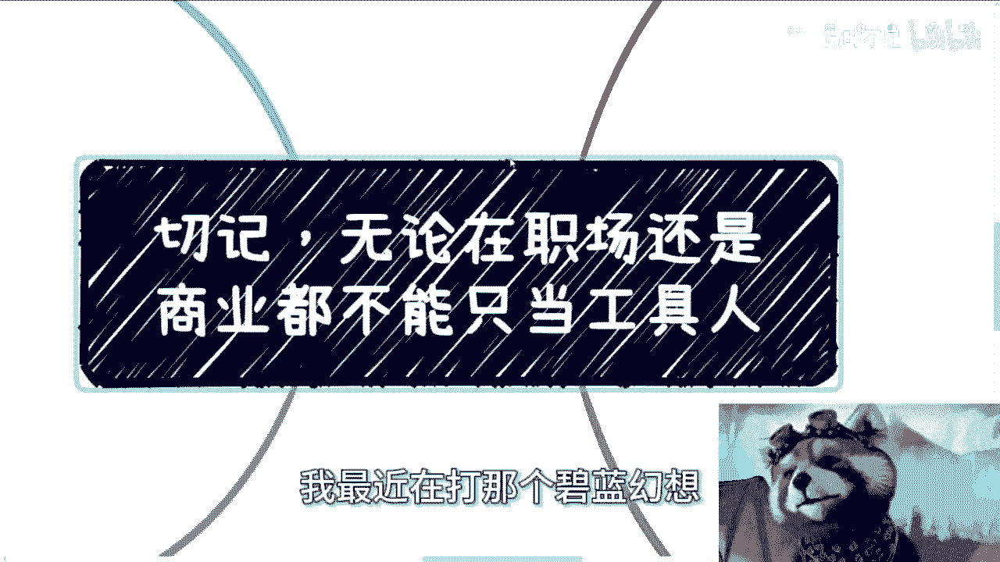

我觉得还蛮好玩的，蛮好玩的，不是广告，蛮好玩的，虽然感觉是个缝合怪，我的，我感觉到了怪物猎人，我感觉到了最终幻想，我还感觉到了什么北欧女神是吧。

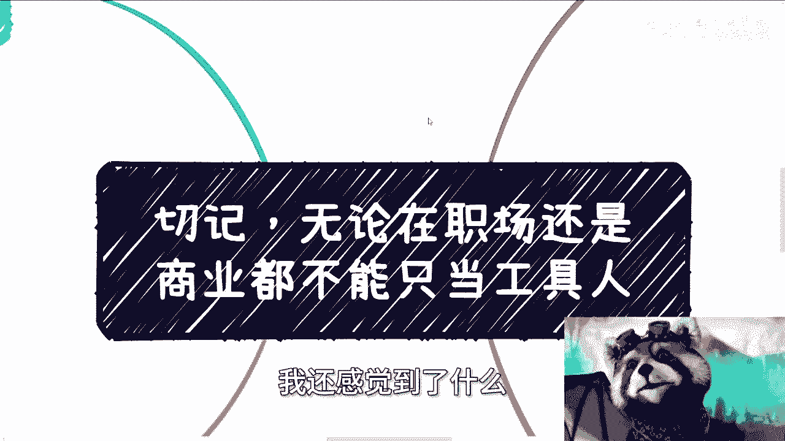

但爽就完事了是吧，呃首先是这样子的啊，上海北京活动都定了啊，上海是本月24号礼拜天啊，北京是本月30号礼拜六啊。

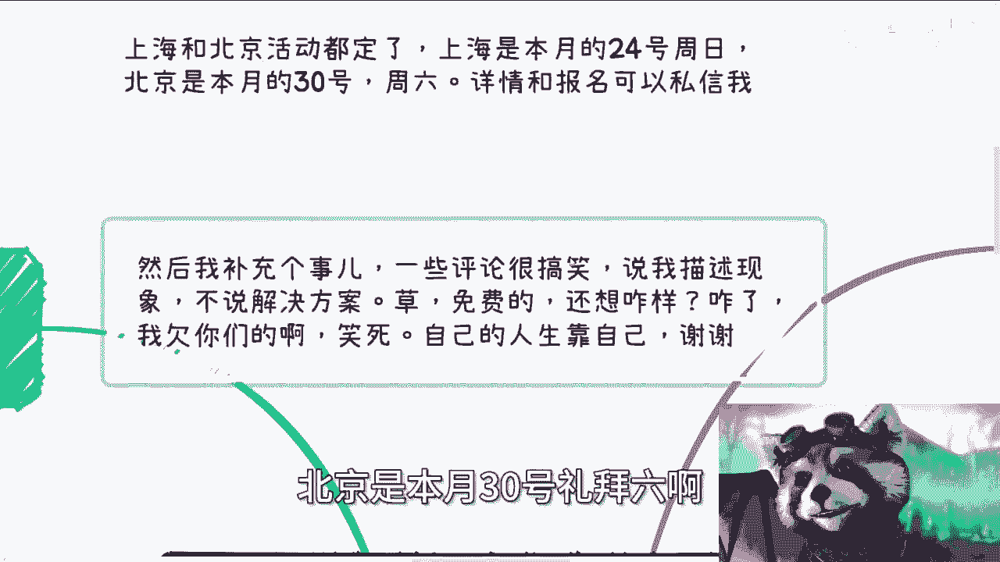

详情详情跟报名都可以私信我好吧，然后我补充个事啊。

就我想到了之前有些评论很搞笑啊，说我这个描述现象不说解决方案啊，我首先想说的是，我说过解决方案，你们没听到对吧，然后另外一方面就是啊操啊，免费的，他妈你想怎么样啊，我也搞笑了啊，怎么滴了。

我不说解决方案就不说怎么了，我欠你们的啊，搞笑了，妈自己人生靠自己好吗，我的还到我这边说解决方案哇。

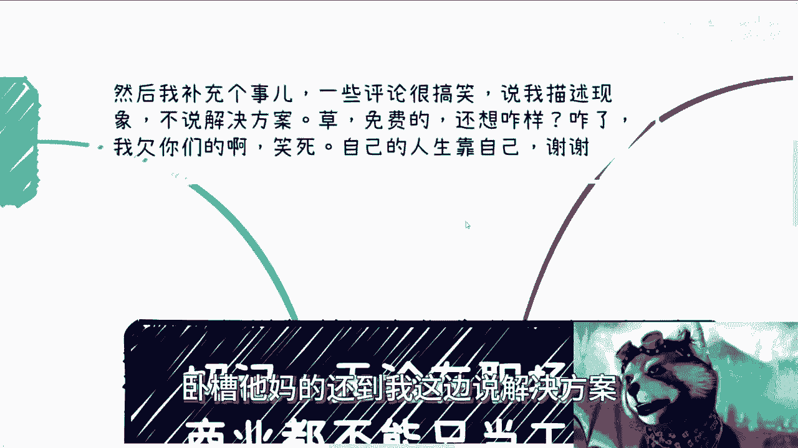

你爸妈都没解决方案，我给解决方案是吧。

你咋不叫呢啊快喊喊爹喊妈是吧，那么工具人这事啊。

很多时候思维我觉得是很难改的，就因为我咨询到现在我已经知道了。

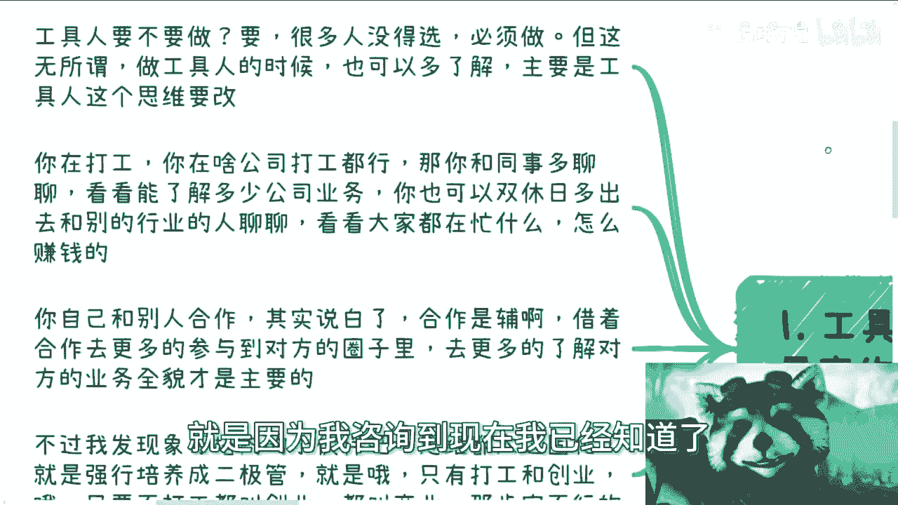

就我我觉得我现在我现在非常接地气啊，就工具人要不要做要啊，为什么，因为很多人没得选，他必须做对，很多人就说嘛，他说那我也没法不做工具人，对不对啊，但我跟你讲，这无所谓，因为你做工具的时候。

做工具人的时候你也可以多了解。

主要是工具人的这个思维啊，要改就说你在打工，你在啥公司打工都行，那你跟你同事多聊聊对吧，都跟你们的商务啊，销售啊对吧，这个市场啊运营啊，你多聊聊，看看能了解多少公司业务，你也可以双休日多出去。

跟别的行业的人聊聊对吧，社交社交，看来大家在忙什么怎么赚钱呢。

这也是一种那个脱离工具的方式对吧，你自己跟别人合作，那就说白了你说我很多开发对吧，我就跟他们说，我说你们跟别人合作啊，跟别人交流，你别老是交流，说哎我们用什么框架，我们用什么架构对吧。

你包括这个这个画画绘画也是的，你说哎你们现在用什么技术对吧，你说我这个呃呃绘画版对吧，怎么样子，你不要去聊工具人的东西，你懂吗，就是你真的跟别人聊，你就去了解别人怎么赚钱呢是吧，别人商业上怎么做的。

你说你出去聊了，你还在聊工具上的东西，那你还真没救了对啊，那么你自己跟别人合作，就说白了合作是你记住啊，合作是负的，就我发现很多人真的做事情，他妈的做着做着把自己就是怎么说呢，就把自己骗进去了。

或者说就是他没脱离工具人的这个思维，就是我我我一直说我说跟别人合作对吧，跟别人商业合作，你记住啊，合作是辅的，你别真的去说合作了，你什么all in在合作上它不是这回事啊，你合作是辅着辅着。

借着合作去更多地参与到对方的圈子里，去，更多的了解对方的业务全貌。

才是你主线任务，你懂吗，这不合作不是你的主线任务啊，就是说我跟你讲啊，我发现湘湘潭内的小伙伴思维太过固化，就每一步都得我说你发，我发现就我不说他前面那部是对的，后面那步就不对了啊。

就是说他强行培养成了二极管，你懂吗，就是说比如说对他来讲只有打工和创业哦，只要不打工就叫创业，只要不创业就要打工啊，然后只要不打工的就叫创业，要么叫商业，那不行的呀，对吧，你要明白，就算很多人不打工。

他其实还是工具人，他也不能称之为创业，他也不能称之为商业，你懂吗。

这不是个二极管的事件，那么很多人做事情或者说去做事情，真的就是还是做事情，就像我刚刚说的，他还真的就去做事情，我有时候就是哭笑不得，我都不知道怎么说法哦，就是说你你你要时时刻刻要让自己有成长。

你说你把一线的底层的技能跟技术磨练的再好，你一线技能跟技术磨练的经验再多，你无非还是一线的底层的工具人啊。

你有啥用呢，你明白吗，哦那么我跟你们讲啊，千万不要被别人，也不要自己用那句话在PUA就是说哎呀，陈老师按照你这个说法，大家都去磨练，难道他们还有谁做工具人，那他妈关你吊事，关我吊事啊。

怎么管好自己不好吗。

对吧啊，然后第二你做啥事的时候呢，我就多问问自己自己成长是啥。

你比如说工作这个事，其实很很久之前，我觉得在我毕业的时候就有人说了，就工作这个事很让人懈怠，为什么，因为大部分人其实一天都在摸鱼，但是你想想看。

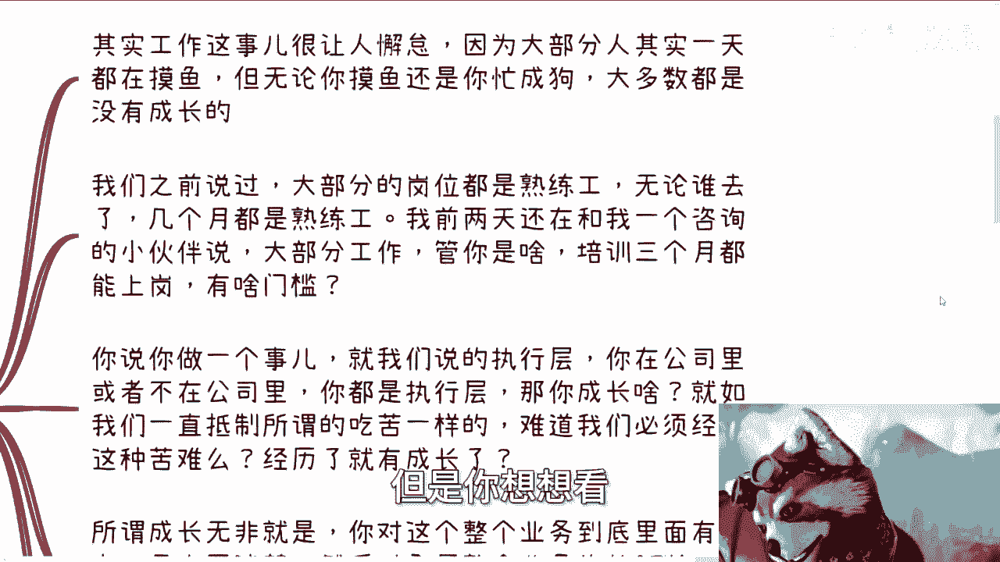

无论你摸鱼还是你忙成狗，大多数你无论是鱼还是狗。

大多数情况你都没有成长对吧，因为我们之前说过，大部分的岗位都是熟练工，无论谁去了几个月都是熟练工，我前两天我还在跟我一个咨询的小伙伴说，我说我说大部分工作你想想看啊，你仔细想想看，你只要不是top的。

就不是前1%的，我管你是做什么岗位，什么开发设计，什么什么什么产品经理，什么什么解决方案工程师，我管你是什么培训，三个月都能上岗，有什么门槛啊，你告诉我哪个岗位有他妈门槛的。

所以说听听看是吧，医疗是的，医院我觉得有的没毛病啊，那那那那这个是你不要拿个例来讲嘛对吧，它普遍的行业它没有啊是吧，那你说你说你做一个事，就我们来说的执行层，你在公司里面或者不在公司里面。

你都是自信执行层的话，那么你成长个屁啊，就如我们一直抵制所谓的吃苦一样的，你有很多人很搞笑的，他觉得吃苦的确是不需要的对吧，但是你会发现他去做业务的时候，他还是在让自己吃苦，就是我就问吧。

难道我们是必须经历这种苦难，有了所谓的苦难才有成长吗。

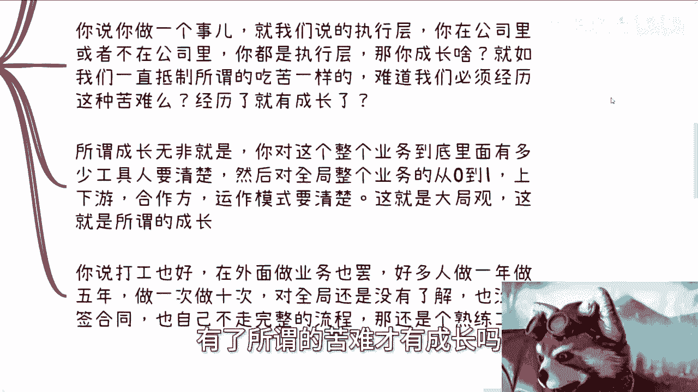

不是啊，你你人家早就说了，你要说你要说勤劳能致富，那驴跟猪早驴早就致富了对吧，比如我早就致富了对吧，你不是啊啊，所谓成长，无非就是你对整个的业务里面到底有多少，工具人，你得明白，就是你得站在我不说。

你开上帝视角，就是你得站在全局的眼光，你去看对吧，然后你不但对全局要多少工具人要明白，你得知道自己在什么样的位置，然后对全局整个业务从0~1，他如何从0~1的上下游合作方运行模式，都要知道，这叫大局观。

这叫格局，这叫所谓的成长啊。

你明白吧，你说打工也好，在外面做业务也好，多少人做一年打工人，做5年打工人做一次业务，做十次业务，对全局还是没有了解，就是我上面说的这些对全职还是没有了解，也没有签过合同，也没有自己走过完整的流程。

除了是个熟练工，还是个啥，你你但是问题你想想看啊，你想想看啊，我们活在世界上面最高优先子弹，难道不是考虑自己得到什么吗。

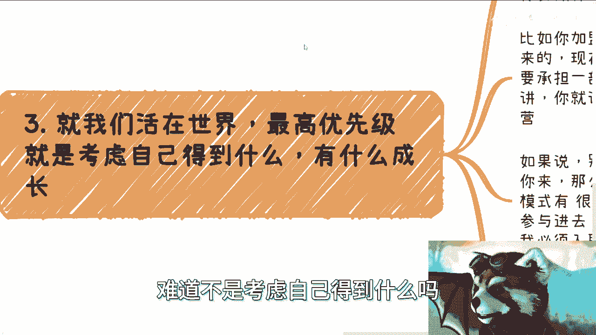

难道不是考虑自己有什么成长吗，对吧，那你说我回来是想考虑什么，考虑别人，就像我前两天回复的，我难道是菩萨吗，关我事，妈人家菩萨还有香火钱呢是吧。

你们知道吗，真的，前两天那个评论区，你们有你们那个有朋友，有我朋友圈，你们就会看到，前两天有个人私信我，他说陈老师，你觉得百事可乐好还是可口可乐好，为什么很多人都觉得可口可乐比百事可乐好喝。

卧槽他妈当我人肉GBT呢，我就回答。

我说也许他比较可口，那我还能怎么回答，是啊。

你比如说你做活动，你可以加盟加盟别人，你也可以做中间商都行，但是你别着急做，你做的时候，你或者做之前真正落地之前。

你想好你能得到什么，你要做什么，对方要做什么，投资产出率是什么，比如说你加盟别人对吧，你想想啊，你多你是可以多了解对方品牌怎么起来的，怎么运营的，还是怎么说啊，还是说你最后要做的话。

对方是承担一部分成本，还是说对方承担场地，对方承担招人对吧，你如果说你如果说啊。

别人就给你个品牌啊，场地运营招人啥的，都是你来，那我就问嘛，那他妈你自己为什么不做呢，对吧，你要了解别人的运营和模式有千万种方式，但是并不是必须加盟或者所谓参与进去，你才能了解的，你明白吗，你想明白吗。

就是说有些东西是我们参与进去才能了解，但有些东西不是啊，你除了一些很深层次的东西以外，你说哦他他这个东西大概怎么怎么个0~1的，他大概现在因为你要看业务啊，你说这种C端的业务。

或者你们现在大部分接触C端业务，他有什么深度吗，没有啊对吧，你跟他说难听点，你跟他就是合作赚钱啊，你说它里面有什么很很很深的东西需要摸吗，那只有在政企层面才会有的东西啊是吧。

你就好像我今天要去了解一下一家公司怎么了，我他妈必须入职吗，你入职也没用啊对吧，你真的要去了解这家公司怎么运作，你难道不是应该去想办法，通过人脉关系去认识他的创始人吗，去认识他的股东吗对吧。

你这样才能了解你。

否则我了解一家公司，我他妈去入职，这他妈什么操作啊，啊对吧，你包括做中介做介绍，你介绍了促成单子，然后呢我就问，然后呢你了解了啥对吧，就是说你不能只看钱，为什么，不赚钱，你做都没做对吧。

但是如果只赚了钱，你学到了啥呢，你得明白你学到了啥，因为如果今天只赚到了钱，你什么都没学到，你未来怎么增加自己的这种做这种单子数量，怎么又去增加客单价，你怎么把这条路往前走啊。

你不了解两边更多的业务逻辑，你怎么去更深入的去做对吧，然后或者说你不了解这些业务。

不了解整个全局，你怎么未来给别人画饼，你饼都画不来啊。

你明白吧啊好，那么还有一点我得我我顺便提一点啊，就是说你要记住你领导，你外面的，你碰到的创业者，包括一些管理层哦。

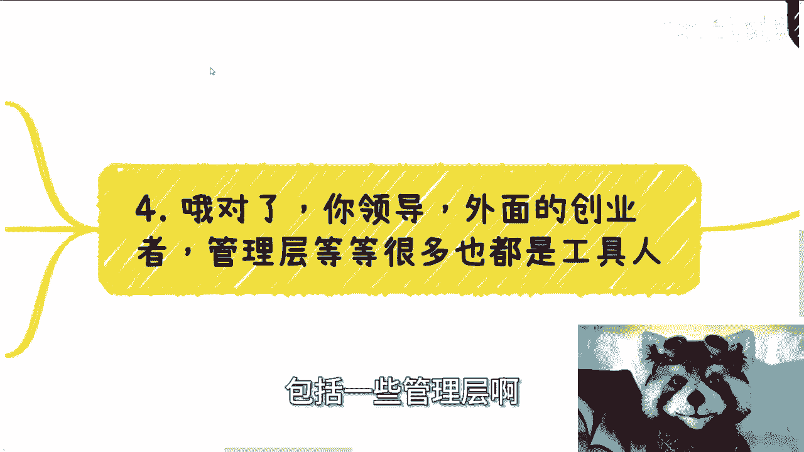

很多其实也是工具人，你要明白，在任何一个生态里面或者商业关系里面，他谁都有可能是甲方的工具人，都是一层是一层一层吃一层的，你知道吗，他都有甲乙方关系的，只不过可能合同上不是明确的，明确的甲乙方关系啊。

但这个并不重要，重要的是他自己得要知道全局，要怎么知道往外突破哦。

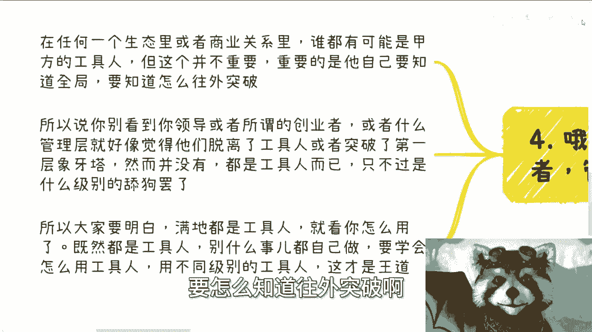

也就是说你跟一个人聊的时候也是一样的，他无论有多高的title，有多牛逼的经验，他如果永远被他自己的东西，就是你跟他沟通下来，你觉得他永远是被他自己的东西所束缚住的话，没有用的，你懂吗。

就是我不点名了啊，就是就是比如说老老是用一些腐朽的思想，老套的套路对吧，跟你说什么什么开个药店啊对吧，干嘛啦，没有用的，就是他可以不进步，你知道吗，他也可以没有经历过，但是他必须要有全局的思想。

人一辈子生命是有限的，我们不可能什么都经历过，对吧，但是你得有有有有更大的格局啊，否则你怎么怎怎怎么去聊啊对吧，你说白了还是工具人，所以说你别看到你领导或者所谓的创业者，或者什么样的管理层。

你好像就觉得卧槽他们牛逼啊，他们却脱离了工具人或者突破了第一层象牙塔，并没有，因为大部分都只是工具人，只不过用你用我的话来讲，就只不过就是什么级别的舔狗，就低级舔狗，还有高级舔狗而已，有什么区别。

没有区别的，也就是说什么意思，也就是说你在他们身上，你是很难学到东西的。

你说能从他们身上赚到钱吗，有可能的，但是你说能不能有所成长难几乎没有，所以你要明白，就是你反过来，你要想中国满地都是工具人，中国不缺的就是工具人，各行各业不缺的都是工具人，你就看你怎么用。

有的工具人给你提供劳力，有的工具人给你提供学历，有的工具人给你提供关系，谁都是谁的工具人，没有关系的，最终就是利益绑定，你懂吗，但是问题在于，你想想看，你如果要有一个权，你想更好地利用这些工具人。

你想更好的大家利益绑定有一个巨大的前提，就是你得有全局的思想，就同时你还得拥有这个这个足够的领导力对吧，就足够的亲和力把大家聚集起来，但是不管怎么样，你得先对全局有一个认知，你对全局没有认知。

你怎么聚合起来呢对吧，你就像今天我你们跟我聊，你说爱唱的时候，我想做个呃这个这跨境电商业务对吧，那你连跨境电商整个业务从从0~1，到底需要哪些方，哪些参与方进来，你都不知道到底流程怎么样。

你也不知道到底这当中可能花多少成本，你都不知道，那你怎么拉这个台子怎么拉，怎么拉，整个整个团队拉不起来的呀，也许你手上有很多资源，但你知道怎么整合吗，不知道，因为你对全局不了解，你对0~1不了解。

那怎么办对吧，所以说你要记住一点，你别任何事情都自己去做，你要学会用工具人啊。

那你就拿现在很多人在做活动，我还是那句话，你们想想看啊，你们活动有人做海报，有人写文案，有人对外宣发，你为什么要一个人做呢，你为什么不能找一些就是专门有些人特长，就是写做海报的特长，就是写文案的特长。

就是宣发的，你多找些小伙伴来，大家分点钱不好吗，是不是，你各司其实要懂得用人啊，你不懂得用人，你你也好我也好，我们都是个体，我们在这个社会，我们都是尘埃，我们能做出什么来啊，很难的，不可能的，你懂吗啊。

包括就是说我之前在视频里面也提到过，就是我们给别人做工具人也没有什么不好，但是给别人做工具人也一样的呀，你给我什么东西对吧，你要是只给我钱，你钱给的足够多，OK没问题，你要是给我少。

我同事对业务又没了解，那我凭什么做这个工具，你爱谁做谁做，对不对，反正工具人做，你让别人做，反正我不做一样的呀，我跟政府合作也不是一个道理吗，如果他钱给我少，他又不给我挂名，他又不给我关系。

他也不给我了解他未来有什么业务，那他他跟我说，爱车的时候，我们最近没预算，那我给你做个屁啊，你爱谁就找谁找谁，这不拉，每个我跟你讲都一样的，没区别的，但是你的思想要改变啊，因为我最近聊天。

我就发现很多人做事情在做吧，在做的，但是你一听哦，你就会发现诶，你这事情做了好像就是在做，你做了之后有钱吗，也不知道你做了之后有成长吗，好像也没有，那那那我就不明白你做他干嘛啊。

对吧啊行，那就这么着吧啊那个活动好吧。

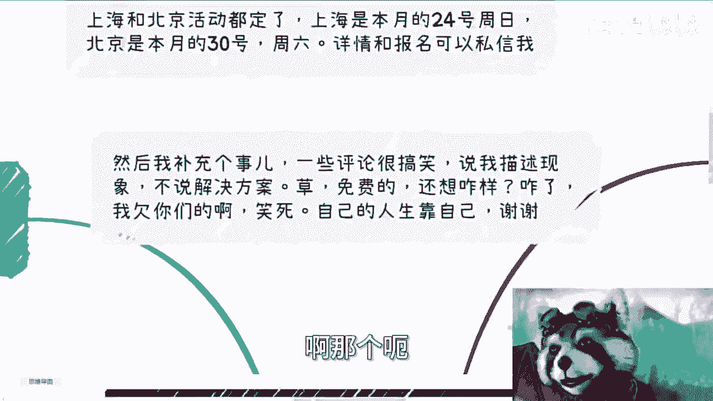

要来的来，然后要详情和报名的都可以私信我，然后就是职业规划，商业规划啊，合同啊什么嗯，融资啊，包括就是结合现在这些情况，结合我的认知啊，能够给你们这个做那些职业规划的。

或者说符合你们这个现状来做职业规划的，你们如果需要的话，你们可以整理好个人的问题，整理好背景好吧，然后再私信我。

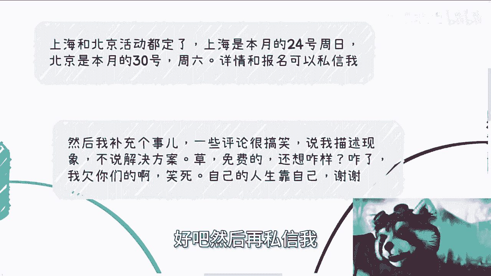