# 早就想吐槽了-区块链-非web3-行业为什么赚不到钱---P1---赏味不足---BV1qG411f

在本节课中，我们将深入探讨一个核心问题：为什么专注于底层技术的区块链行业（区别于Web3）普遍难以实现盈利。我们将从商业模式、创业环境、高校教育等多个维度进行分析，帮助你理解这个行业的现实困境。

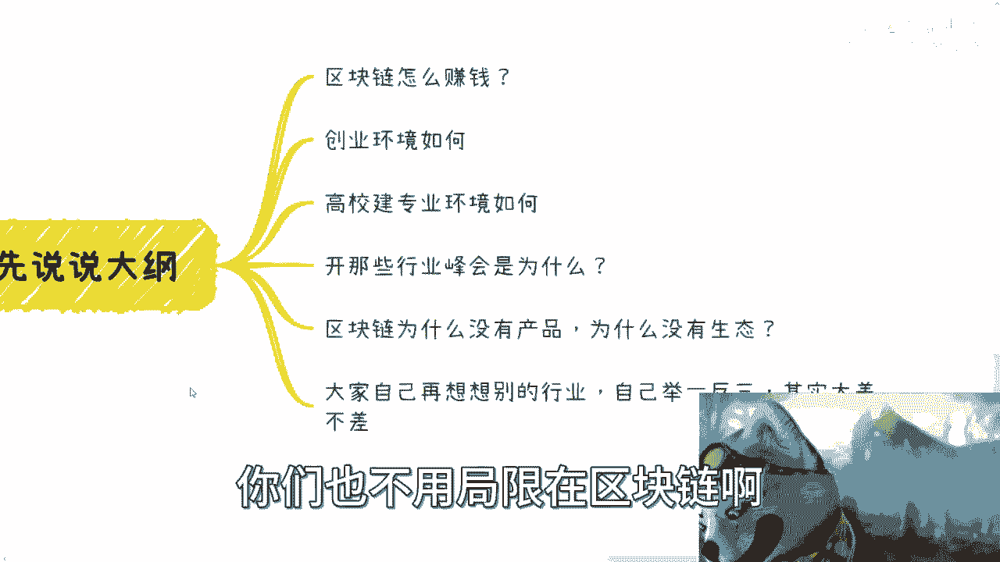

---

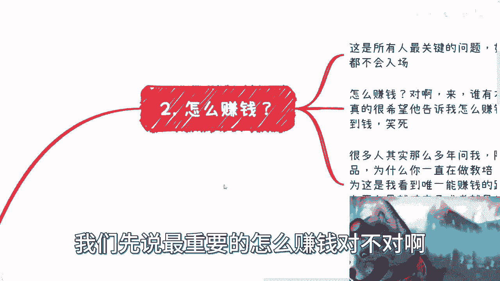

## 1. 如何赚钱？💰

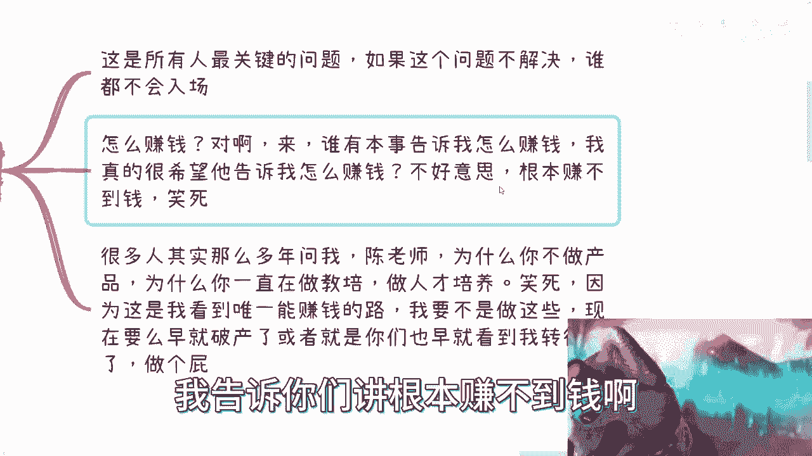

首先，我们来分析最核心的问题：区块链行业如何赚钱。这是所有人最关心的问题。

以下是分析赚钱逻辑的几个方向：

*   **C端（用户）**：用户为何付钱？原因可能包括民生刚需、炒作空间（如过去的数字藏品、月饼券）、精神寄托（如祈福）、破财免灾或冲动消费（如彩票、知识付费）。
*   **B端（企业）**：企业使用区块链的目的是什么？资本家考虑的是投入`X`与产出`Y`的关系，要求`Y > X`，或至少感觉上`Y > X`。区块链技术如何实现这一点？
*   **G端（政府）**：从政府项目中赚钱是否可行？例如申报政府项目、申请创新基金等。

上一节我们介绍了赚钱的几个潜在方向，本节中我们来看看区块链在这些方向上面临的具体挑战。

---

## 2. 为什么赚不到钱？🚫

综合来看，区块链在以上几个方向都难以形成有效的盈利模式。

以下是具体原因分析：

*   **C端无感知，无付费动力**：区块链是底层技术，对终端用户没有直接感知。例如，某城市一卡通宣称使用了区块链，但用户扫码支付体验并无不同。用户不会因为技术底层是区块链而额外付费。所谓的数字藏品、NFT等，更多是短期炒作而非可持续的商业模式。
*   **B端投入产出比不明确**：企业采用新技术需要明确的回报。目前，区块链难以证明其能带来显著高于成本的收益（即 `Y >> X` 不成立）。“赋能产业”的口号响亮，但最终为“赋能”买单的主体不明确。
*   **G端项目非可持续商业模式**：政府项目可以申报，但这类机会凤毛麟角，且普遍存在回款慢、回款率低的问题。项目拨款`X`往往低于实际成本`Y`（`Y > X`），导致企业做则亏本，不做则失去机会，陷入两难。

因此，在C端、B端、G端都难以获得稳定收入的情况下，正规的区块链创业项目举步维艰。

---

## 3. 创业环境如何？🌪️

创业环境非常艰难。这种艰难不仅在于表面，更在于本质上的“孤立无援”。

以下是创业环境艰难的具体体现：

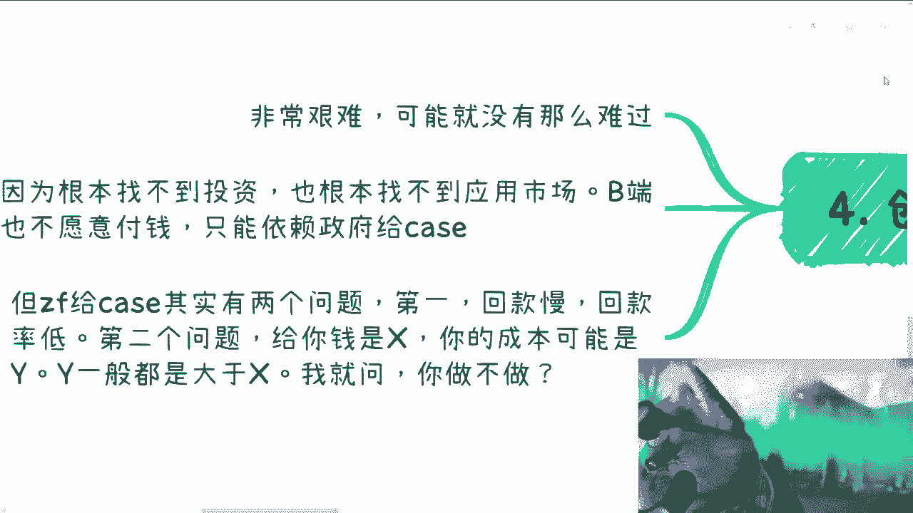

*   **资本不青睐**：资本很清楚，一个没有清晰盈利模式的领域风险极高。没有用户市场，企业不愿付费，仅靠政府项目难以支撑可持续的商业模式。
*   **依赖政府项目的困境**：正如前文所述，政府项目存在回款和成本倒挂的问题，使得创业公司难以健康发展。

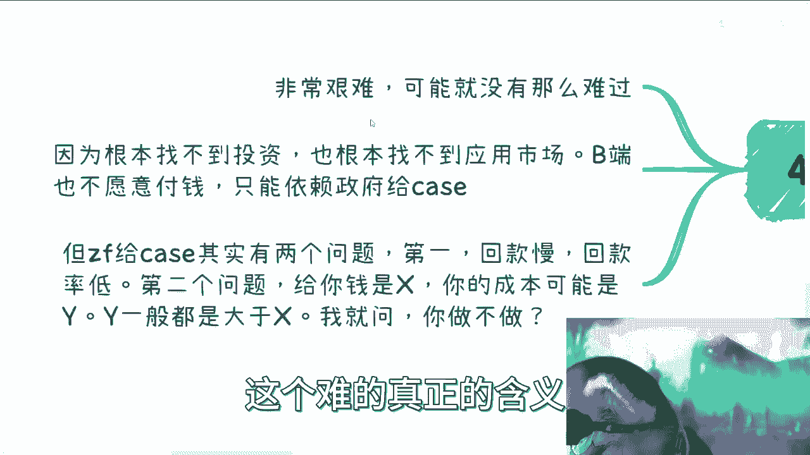

---

## 4. 高校专业环境如何？🏫

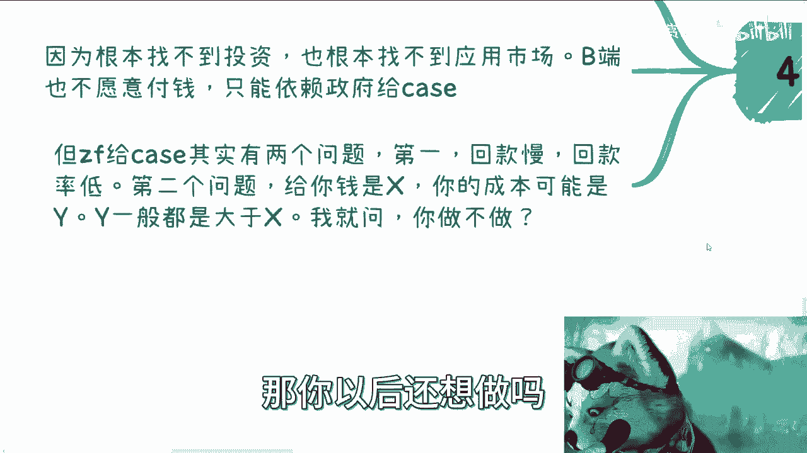

高校的区块链专业建设面临巨大挑战。

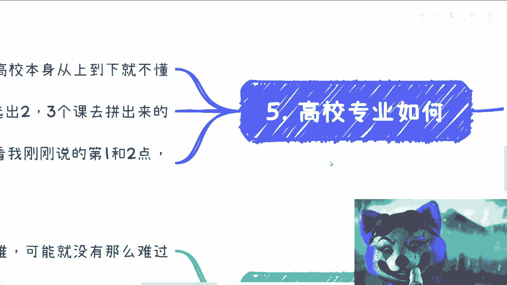

以下是高校专业面临的问题：

*   **课程拼凑，师资匮乏**：许多高校的区块链专业是从金融、通信、计算机等现有专业中挑选2-3门课程拼凑而成。真正懂区块链全局和产业应用的人才极少。
*   **缺乏对口就业岗位**：专业设立需要对应的就业岗位支撑。然而，根据前文对盈利模式和创业环境的分析，市场上能提供的纯粹区块链技术岗位非常有限。没有盈利的行业，就很难产生稳定的岗位需求。

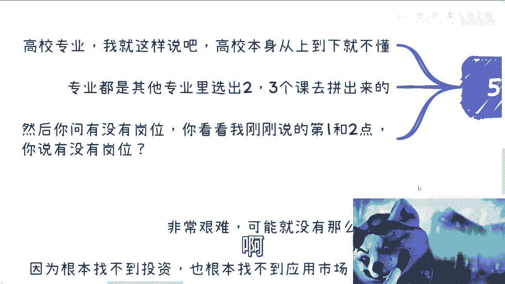

---

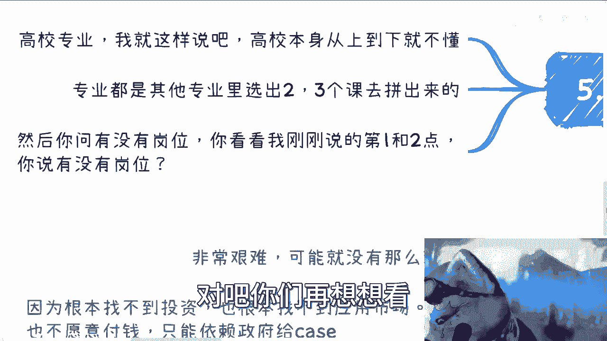

## 5. 行业峰会的目的是什么？🎤

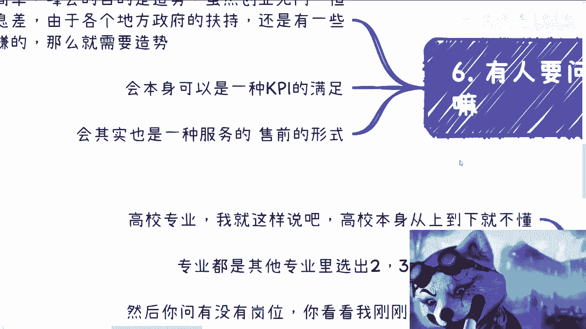

既然行业不赚钱，为什么还有那么多峰会？

以下是行业峰会的主要目的：

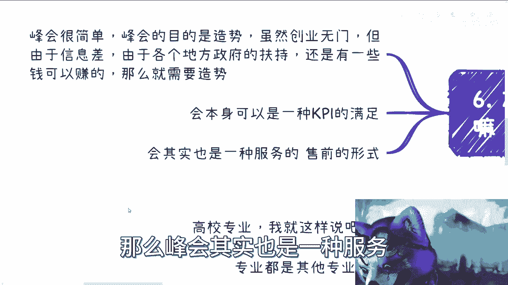

*   **造势与获取资源**：通过造势，可以向信息存在差异的地方政府申请补贴或项目。虽然创业艰难，但利用信息差和政策扶持，仍有机会赚取“快钱”。
*   **完成KPI与间接盈利**：举办峰会是相关政府单位、协会完成其KPI的一种方式。峰会本身也是一种服务、销售或授权形式，其背后的利益链可能远超表面所见。
*   **醉翁之意不在酒**：许多行业行为，其表面目的与真实目的并不一致。看到的不赚钱，背后的利润可能超乎想象。

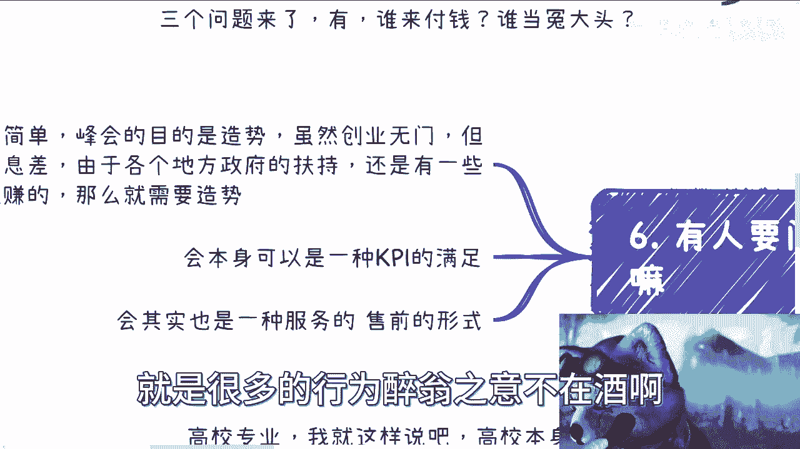

---

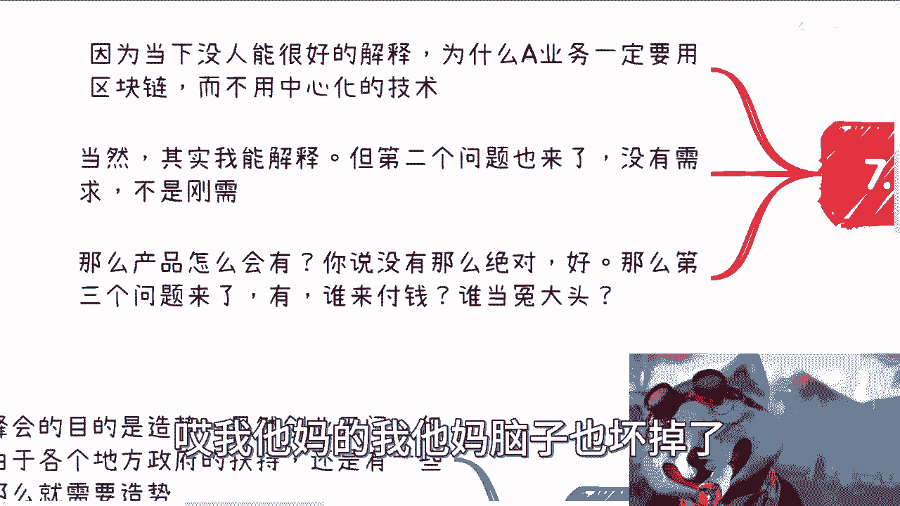

## 6. 为什么没有成熟产品？🤔

区块链领域缺乏成熟的、被广泛使用的产品。

以下是缺乏产品的几个关键原因：

*   **必要性无法证明**：目前很少有人能清晰解释，为什么某个应用**必须**使用区块链，而不能用更成熟、成本更低的中心化技术实现。两者最终的用户体验可能没有区别。
*   **真实需求缺失**：即使技术必要性可以解释，但市场没有对应的真实需求。没有需求，就没有人为产品开发买单。
*   **付费主体缺位**：任何产品都需要投入。回到根本问题：用户、企业、资本、政府，这四方谁愿意为区块链产品持续付费？答案往往是不明确或否定的。

---

## 7. 总结与建议💡

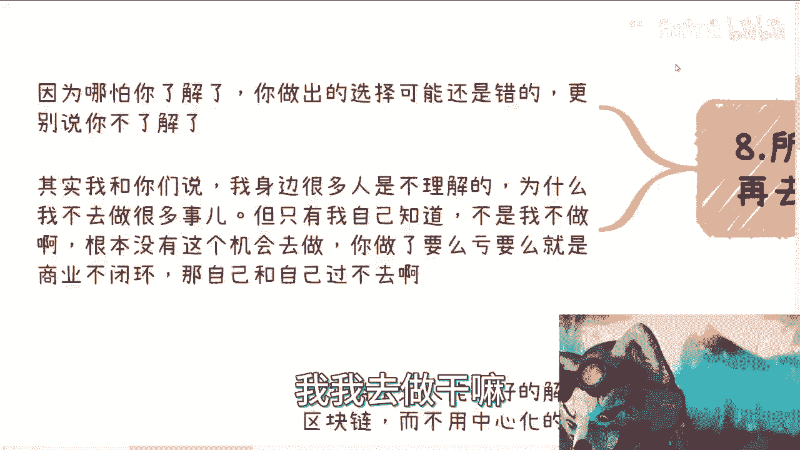

本节课中我们一起学习了区块链行业（非Web3）面临的盈利困境。

通篇来看，从事商业活动，无论逻辑多复杂，最终接触的对象无非是**用户(C端)、企业(B端)、资本和政府(G端)**。在当前阶段，区块链技术在这四方面前都难以建立起稳固、可持续的付费模式，这是行业难以赚钱的根本原因。

因此，**在做出职业或创业选择前，务必了解行业全局**。即使了解了，选择仍可能出错，更不用说在不了解的情况下盲目进入。很多时候，不是从业者不想做更多事，而是市场根本没有提供可行的、能形成商业闭环的机会。做一件既不积累优势又要倒贴钱的事情，是违背商业逻辑的。

最后，认识人脉也需要理性。并非所有“院士”、“上市老板”都必然精通商业或能带来直接价值。保持基本的认知，理性评估所有机会。

---
**下期预告**：我们将探讨区块链创业与融资的真实情况，从实操层面分析如何在这个行业中寻找生存与发展空间。