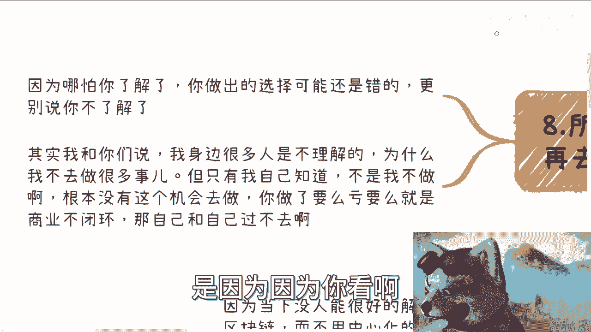

# 早就想吐槽了，区块链（非web3）行业为什么赚不到钱 - P1 - 赏味不足 - BV1qG411f7Aj

好大家好啊，就像你们看到的对吧，说真的我他妈很早就想吐槽了啊，这他妈终于有机会了是吧，有一说一啊，我真觉得30块钱这个吐槽这个还有点便宜啊，以后我要涨价啊，我跟你讲啊啊这个区块链对吧，大家也都知道啊。

web3呢跟区块链呢咱们分开的啊，这个我来跟你们说一下啊，整体的一个情况啊，呃诶妈怎么乱了呀。

卧槽一在哪啊啊啊这嗯先说大纲啊。

首先对吧，这个区块链怎么赚钱，区块链创业环境怎么样对吧，高校建专业环境如何对吧，开的那些行业峰会是为了什么对吧，那区块链为什么没有产品啊，为什么没有没有生态，然后呢。

我觉得这些东西呢你们也不用局限在区块链啊。

就所有的别的领域都一样啊，你们举一反三，那大差不差啊。

首先啊我们先说最重要的怎么赚钱。

对不对啊，那么这也是所有人最关心的问题啊，那么我们分析一下嘛对吧。

你说怎么赚钱，对我就跟你们讲，你们想想看啊，谁有本事告诉我怎么赚钱啊，我也很希望他告诉我怎么赚钱对吧，不好意思，我告诉你根本赚不到钱啊。

真的是笑死是吧，很多人呢其实这么多年问我，他说陈老师啊，为什么你不做产品啊，为什么不做，就各种各样的，因为呃其实能做的很多对吧，大家放眼望去了，什么做产品做服务啊对吧，做做什么项目落地啊对吧。

就各种各种啊，他说为什么你一直在做教培相关的东西，我跟你讲也是笑死，为什么，因为这是我能想到唯一的一条能赚钱的路啊，当然不是说别的路不能赚钱啊，或者我这么打比方啊，这这是我能想到唯一一条我能赚钱。

同时我还能苟活着的人对吧，我跟你讲，我要不做这些啊，现在早就他妈的破产了啊，或者就是你们就早就看到我就转行了啊。

做个屁啊啊还做是吧啊，好这个东西我后面会跟你们讲。

慢慢来聊啊，慢慢来聊，第三个，那么问题来了，哎我写的啥玩意儿啊，哎呀不用不用拘泥细节。

问题来了，那为什么赚不到钱对吧好，我们一个来看哦，首先赚钱逻辑很简单对吧，我们一个来分析，首先C端对吧，用户啊，用户为啥付钱对吧，你比如说我们在这个地方列了，比如说民生刚需对吧。

要么就是C端有炒作空间对吧，像以前的那个叫什么，我不知道大家知不知道啊，就是前两天我们不是说那个数字藏品吗，他以前叫以前就有个前身啊，模式差不多的叫叫叫叫什么来着，UB卡啊，哎这个东西老了，我跟你讲啊。

你比如说要么有炒作空间对吧，你像什么月饼券也可以啊，呃要么什么菩萨保佑对吧，要么破财免灾，要么头脑发热没了，这C段你要让C端付钱，支持东西没了呀，你随便怎么弄，什么什么彩票啦对吧。

知识付费了都是这些里面的呃，就这么些东西对吧好，那么问题来了，区块链这个东西它根本就没有to用户的产品，为什么，因为区块链本身他就是个底层技术，它C端没有感知啊对吧，你今天跟用户说来。

我今天做了个产品对吧，我就跟跟这这么跟你们讲吧，就是某个某地方政府啊，做了一个什么什么城市一卡通是吧，他就说他说啊，你看啊我们这个城市一卡通底层用区块链，我他妈怎么知道啊，你跟我用区块链就区块链了。

那他妈的我就跟跟我有什么关系啊，我这不还是打开二维码扫一下吗，你用区块链，你用啥链都跟我没关系，你说对不对啊，那他妈你从用户角度来讲，用户鬼他妈知道你用不用区块链，对不对啊，你用不用对用户也没有区别。

那用户会因为你用区块链多付你一笔钱吗，那也不可能对不对，那你用你告诉我这区块链怎么赚到，C赚的钱赚不到对吧，那有小伙伴要说了啊，这个小伙伴表示不服对吧啊，他说不可能啊，他说吕老师。

你上次说的这个藏品对吧，还有什么NFT对吧，还有什么什么什么什么B对吧，token啊，他那不就是都是都是to c的吗，不都是to用户的吗，哦我这个地方写了对吧，大哥大姐对吧，爷爷姥姥是吧，我跟你讲。

这叫哥啊，这不叫正常的转啊，这他妈叫骗啊，就是说这个有没有商业闭环，有但是它是快钱的，商业闭环，不存在任何可持续发展，你我就问你们，你看到过藏品今天还能割吗，那么割谁去啊，对不对。

说白了它就不是就two不了C，你知道吧，那那那我们换句话来讲啊，你今天要是跟我说，哎这个东西也算能two three一点，那那照你这么个说法，就别别区块链了，我随便拿个石头都可以去吸烟，对不了。

就往里往里面灌概念，谁不会灌，那他妈钻石不就这么惯出来的嘛，对不对，你要可持续发展啊，你不可持续发展，这叫啥赚嘛，对吧好，那么接下来弊端啊，企业端，那你就想啊，企业专用区块链干嘛，我们先问啊。

企业端用车用来干嘛，企业端都是资本家，资本家去考虑一件事情，就是我投入X我要产出Y而且Y必须大于X，而且Y甚至要远远大于X对吧，那么或者来说以Y可能不大于X，但是你要让他感觉到Y大于X对吧。

那么我就问你问题来了对吧，那区块链怎么让Y大于X呢，你跟我想想看怎么个大法，它大不动了，对不了，那有的人又要不服了，他说能打怎么打，唉我这个赋能嘛对吧，什么区块链赋能产业对吧，赋能企业对吧。

那赋能产业赋能企业谁付钱呢，好你跟我讲，政府好好往下最后一点对吧。

就是政府好了，别说了，我跟你讲啊，你想从政府身上赚到钱赚到钱，那现在还是白天你做啥梦呢，对不对啊，当然了，也不是赚不到对吧，你看政府项目也可以申报，哎我今天这个雪茄没掉是吧，等下等下让我让我叼根烟。

调根音，是吧，就是就是政府项目可以申报啊。

也可以去做一些项目，创新项目也可以拿基金，但是这个就算就算放在中国各地省，这个省市区政府，它基本上就是凤毛麟角，你知道吗，你要靠这玩意，那整个行业早就没了啊，而且这玩意不能称之为商业模式啊。

这玩意儿其实也只不过是你的这个叫什么，就是负增增值价值当中的一部分，你不能把这个东西称之为商业模式啊。

那么综合来讲我们来看啊，你综合来讲这边你怎么转啊对吧，我就说你今天比如说正规一点的啊，我说你去创业啊，C端C端没钱，B端B端没钱，G端G端没钱，你怎么做，做个屁啊啊做慈善吗。

难道是不是啊，那么哎四呢。

那四对吧，那我们就来说创业环境如何。

创业环境呢，我跟你跟你讲难啊，两个字艰难啊，非三个字非常难啊，四个字非常艰难啊，就是可能我跟你讲就没有这么难过啊。

就是说我跟你们这么说吧，你们能够明白我说的难这个字，但是我可以告诉你们，你们绝对体会不了，这个男的真正的含义是什么啊。

因为本质上就是孤立无援，你知道吗啊。

这是你做一个东西，你从表面上看好像嗯都很支持啊，好像很很怎么样，但是就是没人给钱啊，就是资本也不会给钱，因为资本就更看得清楚了哦，我给一笔钱，你连赚钱的模式都没有，为什么给你钱，对不对。

那你你资本再想了哦，你应用市场用户也没有对吧，企业端也不愿意付钱。

那你只能依赖政府给case好，我跟你讲啊，政府给case这句话你们自己听着啊，政府给case其实就两个问题，第一回款慢，而且回款率低，你明白吧啊回款率低，你们自己做过的，你们我跟你讲。

但凡做过的都有都懂的都懂啊，DDDD对不对，第二个问题给你的钱是X，你的成本可能是YY一般都大于X，我就问你做不做嘛，你懂啊啊你可能不懂啊，我给你解释一下什么意思呢，就是说你要是做难，你就是纯亏。

你要是不做呢啊那你以后还想做吗。

对吧，你自己想想看啊，想想看掂量掂量啊。

嗯第五点高校专业如何啊，高校专业啊，我就这么说吧，第一个大学第一所大学成都工程信息大学啊，然后现在这个学生今年大四开学大啊，今年大三开学，大四已经是没方向了啊，都没方向加到我这边来了。

你们想想看能能能没方向到什么地步，你想想看啊，我就这么说啊，高校本身从上到下，他就是不懂的，你们随便去找我，我可以很自信的跟你们讲，你们随便去找，你们找不出懂区块链的人啊，那他最多跟你懂的是诶。

我我知道这当中有些凤毛麟角，有些点点滴滴，有些技能，有些这个攻这个技术他懂的，你要说整个区块链他不知道啊，你去问他不知道的，他知道个屁啊。

专业怎么出来的呢，就是其他专业里面选到2~3个课程拼出来的，就比如说金融选两个啊，通信选两个对吧，cs选两个对吧，各个别的地方本来就选两个拼，然后呢高校做专业他一定是要有岗位的，那我就问嘛。

你我就这么问啊，不用高校去问企业，也不用我来，也不用高校来问我，我问你们，你们觉得会有没有有没有岗位对吧，你们再想想看再想想看啊。

我们刚刚说的这个这个叫什么怎么赚钱对吧。

以及为什么赚不到啊，以及创业环境对吧，那你就告诉我有没有岗位有吗。

可能会有嘛对吧，有岗位的前提是什么得，但得赚到钱啊。

钱都没有，哪里来岗位呀，对不对啊，好那么第六点呢有人要问了啊。

那些峰会开了干嘛啊，首先峰会这个东西很简单，峰会所有的目的都是为了造势啊，甚至有些峰会是直接可以问当地区政府，要不要要那个申请补贴的，虽然创业无门，但是由于信息差，由于各地方政府的扶持。

或者由于各地方政府的信息差，你在中国各地方省市区还是有钱可以赚的，不是不能赚，当然记住这个钱就是快钱，不是说可持续发展的，但是并不是没有钱赚，但这个钱需要什么，需要造势对吧。

而且峰会本身就是一种KPI的满足，这种KPI的主体可能是区政府，可能是市政府，也可能省政府，也可能是协会，但是不管怎么样，一定跟他们的屁股是保持一致的啊，那么峰会其实也是一种服务。

以及峰会本身也是一种销售，一种授权的形式，你知道吗，就是我跟你们这么说，你们一定要明白一个事情，就是很多的行为，醉翁之意不在酒啊。

就是你们看到的东西并不是他的目的，你看到一件事情，它是如果是慈善。

他可能不赚钱，那么我跟你讲，它背后的利润远远大于你的想象。

那么第七啊，为什么没有产品，哎我跟你讲这个事也很搞笑的，之前微博上还有个还有个深圳的人来跟我pk，唉我他妈的我也把脑子也坏掉了。

他妈回他啊，首先呢第一因为当下没有人能够很好的解释，为什么AE一定要用区块链，而不用中心化，或者说而不用区块链以外的那种技术去实现，因为本质上，你用区块链跟不用区块链实现的东西，是差不多的。

没什么区别啊，记住啊，这是第一点，第二点是，当然我跟你讲，没有人能很好解释啊，当然我可以很好解释啊，在这点上面不好意思，我有迷之自信对吧，这毕竟中国现在像我这种角色的人，我估计一只手也就数得出来的啊。

那么但第二个问题就来了，我就算能解释，那他妈没有需求，有卵用啊，对吧啊，你在那边解释半天，人家说哎我不要的跟我有什么关系对吧，就像以前面试题，面试面试当中有道题目怎么说呢，他说面试官给你支钢笔啊。

让你就是到什么一个会议上面啊，你就要把这支钢笔卖给别人，对不对，OK那么第三个，那那你想想看，就是没有需求，那产品怎么会有呢对吧，因为你没有需求，你要做个产品，要有人投入，谁来投呢。

你总不可能不可能不可能跟我说，每次都是你自己亏钱投吧对吧，那可持续发展的不可持续发展呀，对不对，你说没有那么绝对好，那么我就问你第三个问题来了，谁付钱，我就这么问吧，不管做什么项目，不管做什么产品。

谁付钱，谁当冤大头，就这么简单，人就这么些人，对不对，用户企业资本政府，你就告诉我们这四方谁付钱吗，啊，对不对，没有呀。

对吧好你第八点，所以呢我为什么一直告诉大家。

要了解全局再去做选择，是因为因为你看啊。

哪怕你了解了，你做出的选择都有可能是错的，更别说你不了解了，你懂吗啊，其实我跟你们讲啊，我身边很多人是不理解的啊，为什么我不去做更多的事情，但是我跟你讲，很多时候我解释也没有用。

因为我在行业里面所有人都不在对吧，我身边那种看不懂我的这个选择的，或者我做事情他们都不在，我跟他们没什么好解释的对吧，就归根结底不是我不做，是根本没有这个机会去做啊对吧，你做了要么就是你做之前你就知道。

要么是亏的，要么就是没有商业闭环的，我我去做干嘛。

我就问我是哪根筋不对吗，对吧啊。

这个不是说我今天打个打个打个游戏对吧，这个game over就game over了啊不你作为一个东西，你要要么有积累，要么就是赚钱，你说我又没积累，又又要贴钱，我是哪根筋不对呢，对吧啊好吧。

然后后面呢我会再出一期跟大家说什么呢，说那个叫什么创业融资的事情啊，我我当然会跟那个就是非充电的，肯定是区分开来的啊，我这次会从真正的这个融资，后面的事情来给你们讲对吧，因为我发现真的我觉得很多人唉。

最近咨询下来啊，我就觉得这很多人啊，这就他不是不接地气，我就感觉他不适合在地球上生活，而且有非常多想法，非常我这不叫幼稚啊，就是我不知道这些想法是被谁灌输出来的，就是这些想法非常的神奇啊。

当然我觉得也有可能是被我我对吧，这个这个我国这个新闻啊，新闻联播培养出来的也有可能，所以啊就是我们通篇啊我来总结一下，通篇来讲呢就是说呃做商业对吧，呃也许他的逻辑很复杂，但是呢你背后所接触到的人啊。

如果大归零啊，无非就是企业家啊，无非就是政府，无非就是资本嗯，顺便我在这个地方，最后我再给你们提一点啊，因为这两天又有人跟我说啊，他什么接触到一些院士啊，接触到一些什么人。

但是呢就说总感觉这些人呢他利用不上，或者说总感觉这些人好像也不知道这个，懂不懂商业啊，但是呢就是说呃感觉好像是蛮有价值的，我当时跟他这么讲的啊，我说你要明白一点，并不是只有上市企业老板和院士这种人。

就或者说并不是但凡只要这种人就很牛逼，你要明白，十个人里面，不管他是谁，十个人里面总有八个人是，哪怕他是院士，哪怕他是上市公司的老板都一样啊，没什么区别的啊，这我们认识人一定要有这种基本的认知好吧。

