# 时代不同了-现在考研多数纯粹就浪费时间-----P1---赏味不足---BV1Qh4y1u7mc_n

在本节课中，我们将深入探讨当前环境下关于考研（攻读硕士研究生）决策的几个常见误区。我们将逐一分析这些观点背后的逻辑，并探讨在当今时代背景下，盲目追求研究生学历可能面临的实际问题。

---

## 概述 📖

本节课程旨在解析围绕考研的普遍迷思。许多人将读研视为解决就业困境、提升竞争力的必然选择，但实际情况可能更为复杂。我们将审视“深造”、“人脉”、“技能提升”等常见理由，并分析其在实际商业环境和社会竞争中的有效性。

---

## 误区一：我需要学历去“深造” 🔍

上一节我们概述了课程目标，本节中我们来看看第一个常见误区：认为读研是为了“深造”和深入学习。

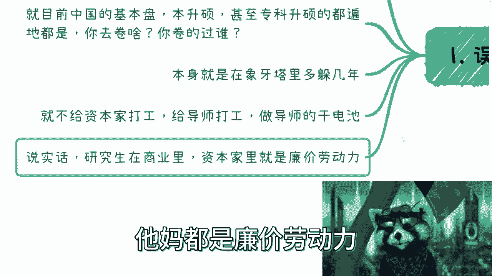

许多人认为读研能让自己在某个领域“深造”。然而，当前学校教授的技能与社会实际需求存在严重脱节。无论是文科还是理科，课程内容往往滞后于行业发展。你很难指望通过研究生阶段的学习，掌握市场真正需要的“硬技能”或商业知识。

**核心问题**：学术环境与社会需求的脱节。
> 学校技能与社会需求脱节，导致所谓的“深造”往往流于形式，无法转化为实际竞争力。

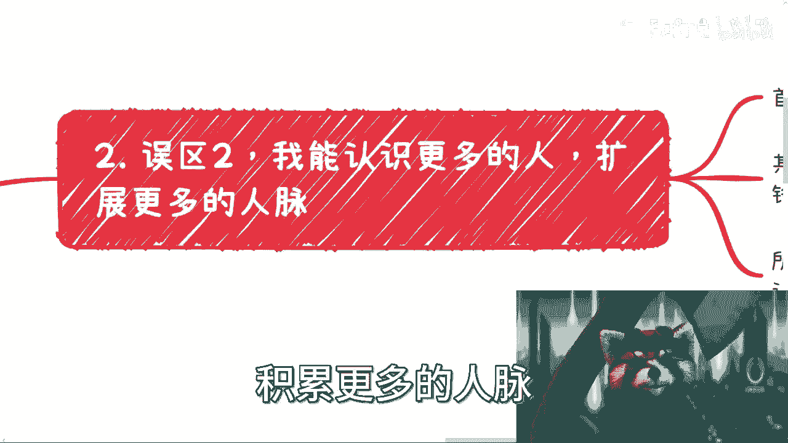

---

## 误区二：读研能积累优质“人脉” 🤝

在讨论了“深造”的误区后，我们转向另一个被广泛相信的观点：读研可以扩展人脉。

许多人希望通过读研进入更好的平台，结识更多人，以此积累“人脉”。但需要明确的是，人脉的本质是**价值交换**。在学校环境中结识的同学和老师，大多处于相似的“象牙塔”环境中，彼此难以提供实质性的商业价值或工作机会。

**核心概念**：人脉 ≠ 认识很多人。人脉 = 可持续的**价值互换**。
> 不能带来商业价值、工作机会或赚钱渠道的关系，很难称之为人脉。

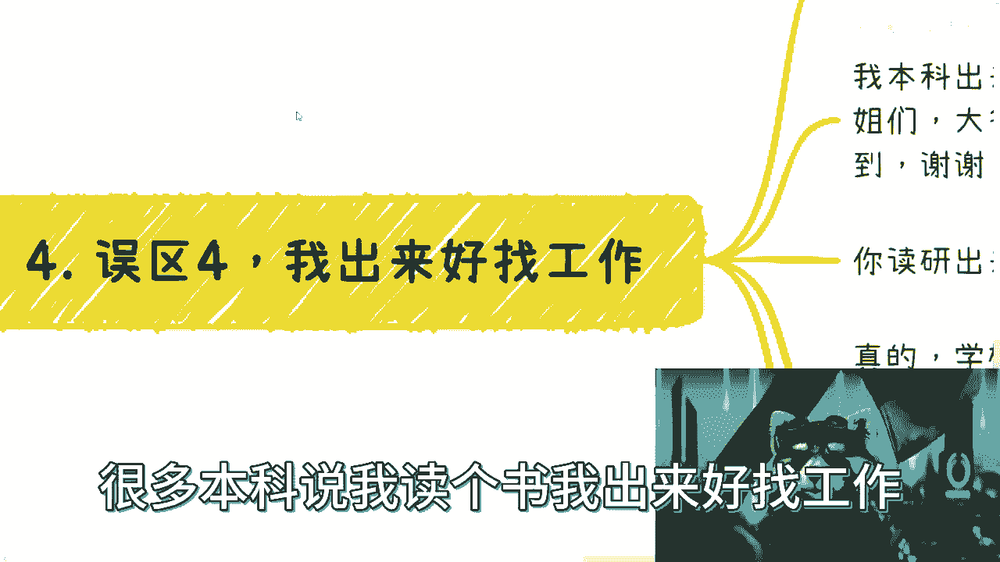

---

## 误区三：在学校能“学到更多东西” 📚

了解了人脉的误区后，我们再来审视关于“学习”的期待。

许多人期待通过研究生导师学到前沿知识或项目经验。但现实是，多数导师长期脱离一线商业战场，其知识体系可能已经过时。此外，导师的核心利益（如项目、荣誉、经费）通常不会与学生共享，学生往往沦为完成科研任务的“工具人”。

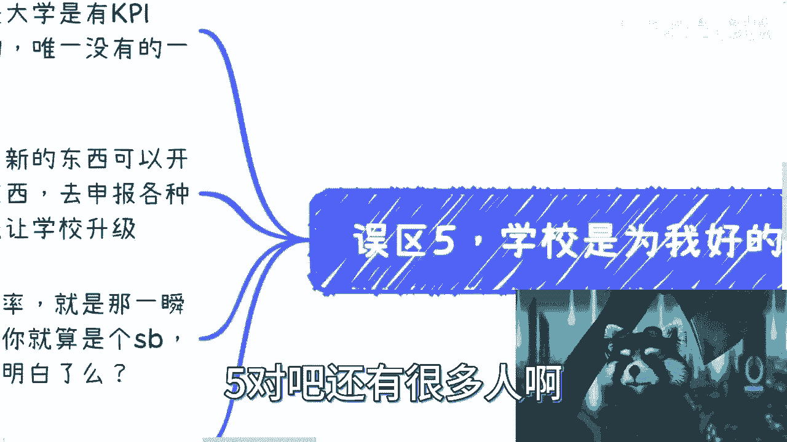

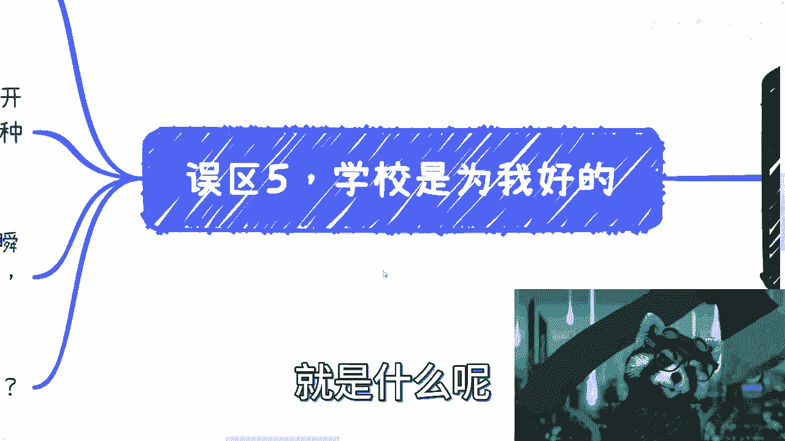

**核心现实**：导师的目标（学术KPI）与学生的目标（技能提升、就业）经常不一致。
> 如果导师不分享核心资源和经验，学生能“学到”的很可能只是如何更好地完成学术指令，而非市场所需的技能。

---

## 误区四：研究生学历“更好找工作” 💼

接下来，我们分析最普遍的考研动机：提升就业竞争力。

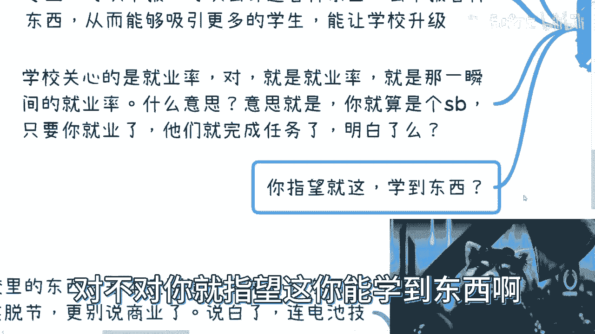

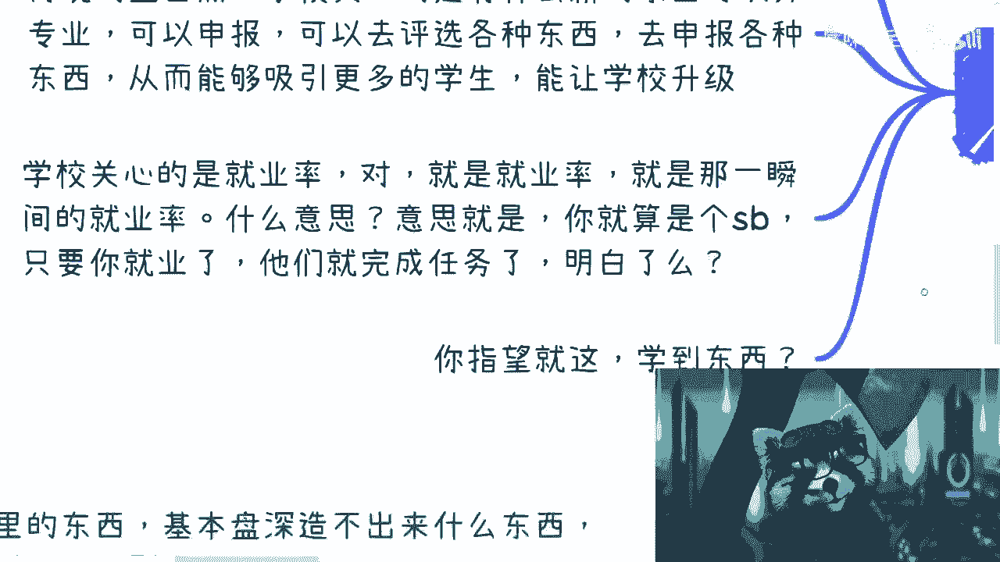

一个常见的逻辑是：“我本科找不到工作，所以去读研，这样研究生毕业就好找了。” 这在当前环境下可能是一个陷阱。经济形势和就业市场的变化速度，可能远超你读研的这两三年。当你毕业时，面临的竞争可能更加激烈，而你只是变成了一个**年龄更大、但技能并未本质提升**的求职者。

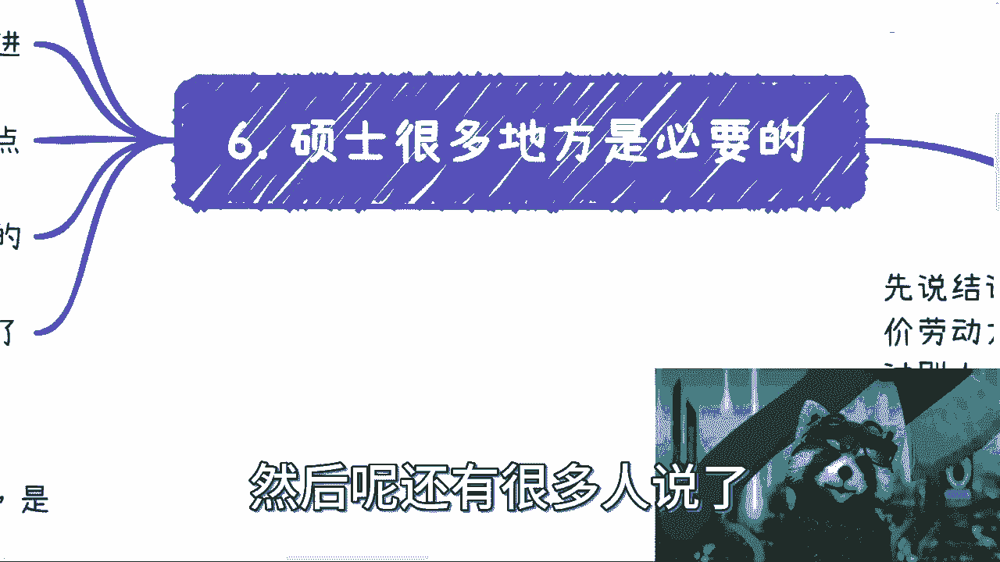

**核心公式**：求职竞争力 ≠ 学历。求职竞争力 ≈ **技能稀缺性 × 商业价值**。
> 用几年时间换取一个可能贬值的学历光环，而忽视核心技能的培养，在就业市场上是高风险的选择。

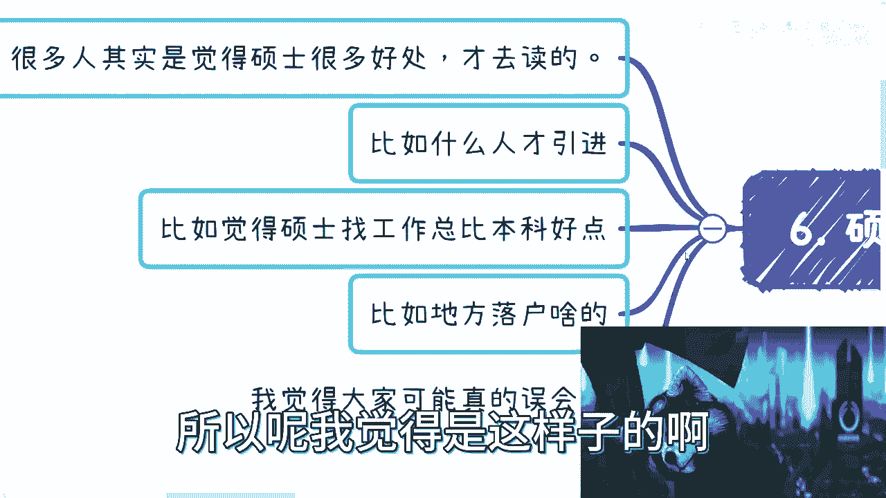

---

## 误区五：学校和老师会“为我好” 🏫

最后，我们探讨一个关于系统信任的误区。

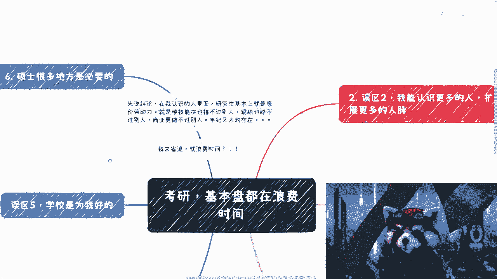

许多学生默认学校和老师的建议是从学生利益出发的。但必须认识到，大学首先是一个**商业和行政机构**，它有自身的KPI，如就业率、科研经费、学科排名等。学校的首要任务是完成这些指标，而非确保每个学生学到真本事或获得理想职业发展。

**核心认知**：学校是商业机构，学生是其运营的“资源”之一。
> 学校的“就业率”关心的是你是否在毕业时有一份工作（无论好坏），而不是你长期的职业发展和价值提升。

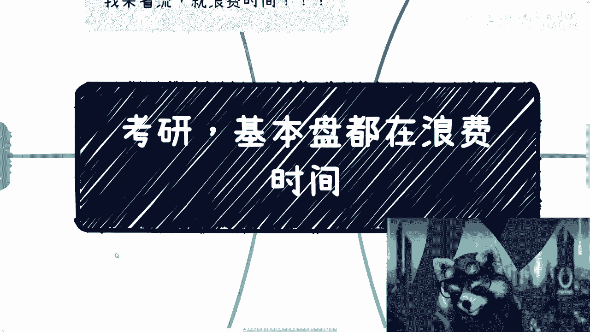

---

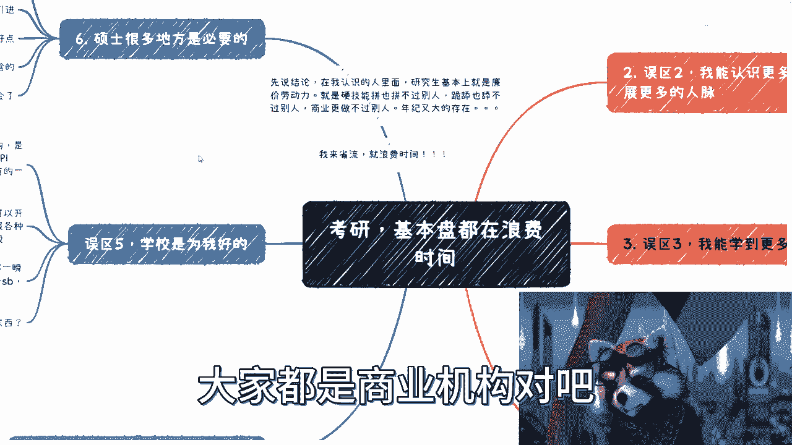

## 总结与反思 💡

本节课我们一起分析了关于考研的五个常见误区：
1.  “深造”可能学不到市场需要的技能。
2.  “人脉”积累在学校环境中效率很低。
3.  期待从导师那里“学到更多”可能不现实。
4.  研究生学历不等于“更好找工作”。
5.  学校和老师的建议不一定以你的长期利益为核心。

**核心结论**：盲目跟风考研，将其视为逃避就业或提升身价的捷径，在当今时代可能是在浪费宝贵的时间。这段时间如果用于在社会中实践、试错、培养真实的商业技能和构建个人竞争力，长期回报可能更高。

决策的关键在于想清楚自己的目标。如果你有明确的学术追求或职业规划需要学历门槛，那么考研是路径之一。但如果你只是因为迷茫、逃避或相信了上述误区，那么你需要重新评估：你的时间投资，是否能真正积累起属于自己的、不可替代的**价值壁垒**？

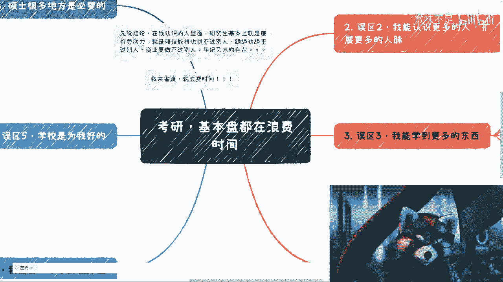

最终，没有人会为你的35岁失业负责，除了你自己。