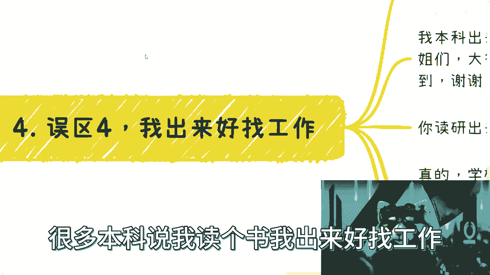
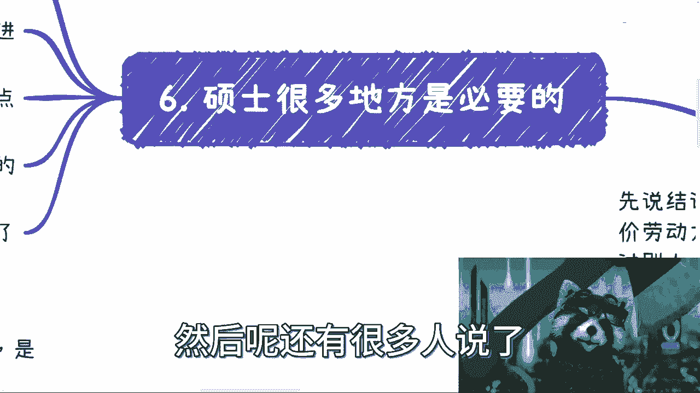
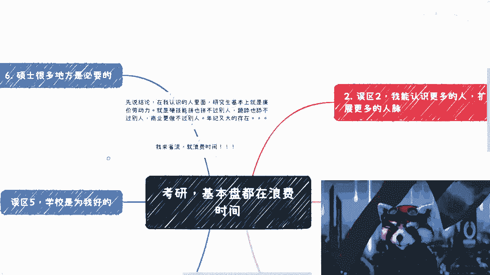
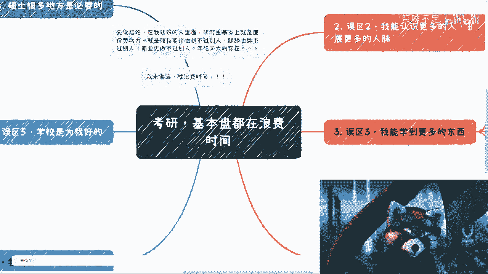

# 时代不同了！现在考研多数纯粹就浪费时间！！ - P1 - 赏味不足 - BV1Qh4y1u7mc

好啊大家好啊对吧，这个节日快乐呃，今天早上呢我们一个小伙伴啊，这个接下来马上要给我们录课的啊，就跟我一起来录制的一个小姐姐啊，就跟我给我看了个视频，我大概看了一下，我觉得没什么毛病啊。

然后我也想总结一下这个关于考研的东西，但我发现真的就是洗脑很成功啊，我只能说洗脑很成功，考研呢基本盘都在浪费时间，我跟你们讲，毫无疑问，毫无疑问，首先先说先说结论啊，在我认知里面。

研究生基本上就是廉价劳动力啊，毫无疑问就是硬技能，拼不拼难也拼不过别人，跪舔也舔不过别人啊，商业更是做不过别人，年纪又大啊，就这么个情况啊，不用你们省流，我来省流，就他妈浪费时间啊，就他妈浪费时间啊。

然后呢，我觉得我还是提前说一下啊，如果你们觉得研究生出来找工作比本科好找的，那你们去读，你们就已经被洗脑很成功了，如果你们觉得你们这个研究生读出来呢，比本本科要月薪来的高，年薪来的高。

那你们也洗脑很成功，你们就去就去就去做对吧，因为对我来讲我觉得很简单，大家主要是做电池的，你们每个月少那么几千块钱，每个月多几万块钱，每年多几万块钱，十几万，对我来讲，我觉得对电池来讲毫无意义对吧。

就这么简单，就是早晚都是要被丢弃的，早晚也都是要没有工作的，你就差这么一点东西吗，啊你就你就如果你们只看的，就是觉得哎我就应该比本科多能多找点工作，比本科能多多点这种这个生活费对吧，能多点这个叫什么啊。

这个钱，那我只能说对吧啊，洗脑很成功啊，就这么简单，哎呀啊好，那我们一个个来讲啊，首先诶这个竟然是误区五啊，一呢啊在这啊，首先误区一啊，我觉得这个有很多人会这么说，他说我需要有一个学历去。

你把这个小熊猫放大一点啊，太大了啊，他说啊我需要一个学历去深造，深造一个这种学历出来是吧，啊啊我们来看一下啊。

首先第一个就目前学校里的东西来讲，基本盘你是深造不出什么东西来的，为什么呢，因为与学校技能就是有些社会极其脱节的，你能造出什么东西来，你别说商业了，说白了你连电池技能都学不会，你还能造出什么东西来啊。

深造点啥对吧，我不管你什么文科理科都一样的，你能深造出那啥，我就问对吧，这也是奇了怪了，真的是啊，然后我跟你们说，就目前的中国的基本盘来讲对吧，本身硕士也好，甚至专升硕也好，本地都遍地都是。

你卷什么东西，你卷得过谁对吧，你是你可能在毕业那一年觉得哎，我有应届生身份对吧，我能给出去怎么样子啊，啊对啊，现在还有很多人说了，他说哎我因为本科找不到工作啊，所以我去读研，不好意思。

你读出来也找不到工作，有什么区别，搞笑也是搞笑的啊，啊本身也是在象牙塔里多躲了几年对吧，当鸵鸟多当几年对吧，然后呢，你就是就是你，给导师去打工，做导师的电池有什么区别呢，说实话，研究生在商业里面。

资本家就是呃呃对资本家来讲就是廉价劳动力，为什么，因为很简单啊，我们所有的合作当中都会说的，哎这个没人做怎么办，没关系啊，这个是实习，给点实习工资，对吧啦，就就就给点钱，让这种研究生来做。

他妈都是廉价劳动力啊。

对不对，就这么简单，啊啊在这个地方我再提一句啊，有还有很多人跟我说了，他说哎呀，现在这个你读研究生还能去点大厂是吧，还能深造一下，我搞笑是搞笑了，我跟你们讲现在大厂什么概念，现在大厂就是以前对吧。

过程当中，这个成长过程当中能经历的你也经历不了对吧，现在所有东西做的也都是螺丝钉，动中的螺丝钉，你去了，你学到什么东西啊啊别自己PUA自己，别自己骗自己。

你知道吗，就是时代不一样了，现在跟以前不一样啊，别老觉得哎呀我们能去个更好的平台，积累更多的人脉。

不好意思，你啥都没有啊，呃误区二对吧，他说我觉得我能认识更多的人，扩展更多的人脉啊，这个也是成体的概念，也不知道被谁洗脑的，首先你认识的也是一群鸵鸟，跟你一样啊，一群活在象牙塔里的人，就这么简单啊。

其次所有不能带来商业价值，不能带来工作对吧，不能带来赚钱机会的，你都不能叫人脉，那你认识一个人怎么了，我认识的人多了啊，都能叫人脉吗，那肯定不是所谓人脉呢，是相互给这个价值的啊。

很少在这些人呢我不能说找不到啊，但是在学校里面或者公司里面认识的呢，其实比较少啊，几乎很少就对普通人基本上来讲很少很少啊，我觉得这个就是最大最大的误区对吧，很多人都觉得哎我要去去找个大公司。

找个大平台对吧，干嘛干嘛啊，我就我就能够积累到人脉了，就能够有一定的积累了，不好意思，你没有啊，你所积累的只不过是做电，如何更好的去做电池啊，别的你积累不到什么东西啊。

然后你积累出来的东西最终也就是35岁，40岁被资本家丢弃，马就这么简单啊，现在跟以前不一样了，这个是二对三啊，这个说啊，他说哎我还能学到更多东西，哎呀真的是想要更多东西说啊，来我就问啊。

我请问你们老师找过工作吗，没有吧啊大概率没有吧对吧，我请问你们老师近几年找过工作吗，有经历过近几年的这种商业战场和社会战场吗，有吗，没有吧对吧，我就问你们老师有做过真正商业，商业商业项目吗，也没有吧。

我就问你们的老师除了会把你们当工具人以外，还会干嘛呢，没有吧对吧，那我就问啊，啊我就问啊，就是这个你们老师也许会去站台对吧，也许会不要脸的去拿一些项目，拿一些荣誉，我就请问嘛。

他们会把这些核心的东西来跟你们share吗对吧，所有的荣誉会跟你们共享吗，所有的钱会跟你们共享吗，没有吧对吧，那你告诉我你学到更多东西，你能学到啥，你我说白了我就觉得大家是被洗脑的，就这么简单。

就是你从小就在学如何当好一个电池，然后30多岁被人吊结束了，你告诉我你能学到啥，对吧，本质一个都没学不懂，对不对啊，这个是三四对吧，很多研究生说啊，很多本科说我读个硕。

我出来好找工作，来来来来看一下啊，首先这个呢就是我觉得最好笑的地方，为什么呢，因为就现在的经济情况，就现在的整个的情况来讲啊，中国的情况来讲，我跟你说，你本科找不到找不到工作，所以你读研我跟你们说。

哥哥们，姐姐们，爷爷们奶奶们对吧，你读研读出来也找不到工作，没什么区别的，我可以明确跟你讲，近3年近5年就这个样子有什么区别了，你躲两三年没有用的呀，对了，你可以说你月薪比人家本科来得高。

你可以说你的找该找工作的概率，比人家本科来的大，但是你只不过是个年龄大一点的地电池罢了，没有意义的呀，对不对，我跟你们讲，学校到现在教学不是不接地气的问题了，已经。

甚至连很多工具人的技能都已经都已经不交了，对吧，在我看来，你就是就读研读出来就是个年龄大一点的技能，技能，不会感情感情，不会商业，商业不会的人，我也不知道有啥用啊。

我真的我平常性的时候我不知道有什么用啊，有用的，当电池是不是啊，然后比本科好找工作，我跟你讲一样的，没区别的啊，就是我给你，我给你们解释一下啊，就是你说你出来对吧，找不到工作是啊。

然后多一些年龄是没有问题，但是你往后看呢对吧，你到了30岁，35岁呢有区别吗，没有区别，你回过头来看，你就是你就是多做了几年鸵鸟罢了呀，没有区别的呀，对吧五呢啊五对吧，还有很多人啊。

我跟你讲，真的洗脑一级棒啊，哎呀就是什么呢。

学校是为我好的啊，老师也会为我好的，我就听老师的，听学校的来行，我今天就跟你们讲啊，同志们啊，学生们啊，大学是个商业机构，你们要明白是个办政府机构，什么意思，意思就是大学是有KPI的啊。

大学是需要通过各种手段需要经费的，唯一没有的一条是什么，就是从你们角度出发，不好意思，没有的，你们还是工具，你们就是所有人利用的工具对吧，那好我再说的直白一点，学校关心的是有什么东西的东西。

可以去报专业，可以去申报，可以去评选各种的荣誉啊，可以去申报各种各样的东西，从而吸引更多的学生，把自己的这个学校的level提上去，这个是他们要做的对吧，但这个里面有哪些东西是跟真正学生有关的呢。

是关心过你们能学什么吗，还是关心过你们未来就业怎么样呢，没有人关心的，不好意思啊，学校关心的就是就业率，对，就是就业率，就是那么一瞬间的就业率，什么意思呢，就是你只要就业了，你今天就算是个SB。

你只要就业了，我不管你什么行形式，就业就业的形式很多对吧，我就不说了啊对吧，他们就算完成任务了，你们明白吗对吧，就是说白了对吧，你本科就是4年的利益价值对吧，研究生就是那么两三年的应用价值。

没了呀没了呀，你能干嘛呢，对不对，你就指望这你能学到东西啊。

你能学到啥，你告诉我。

是吧对吧，然后呢还有很多人说了。

他说那没没办法对吧，说硕士就学历，很多地方是必要的，来我来给你们列一下啊，是啊，很多人其实觉得说是好处很多才去读的，比如说啊这个叫什么啊，城各个城市对吧，有一些什么啊政策引进人才引进啊。

比如说硕士找工作比本科好找对吧，比如说地方落户对吧，我觉得大家可能误会了什么事情，什么意思呢，你们所谓的好处，你们仔细想想看，这些好处是对你们的吗，不是啊对吧，就所有的这些好处其实是为了上面为了资本家。

说到底还是电池啊，明白吧，所以呢我觉得是这样子的啊。

首先啊这个省流对吧，就是浪费时间啊，但是我并不是说你去读书读研就没有用啊，而是说你读研你得想好你到底自己要干嘛对吧，大部分就中国现在这个基本盘，大部分人就是说我就是觉得本科找不到，我就觉得就业不好。

所以我进去躲两三年，就这个简单，就这个想法，那这个想法出来你一样就是浪费时间啊，没有用的，我跟你说，未来的整个可预见的时间范围内，你只要做电池，多几万块，少几万块，多十几万，少几十几万，多几10万。

少几10万，我觉得是不影响你生活的，为什么，反正也买不起房，对不对，反正你也你也你也赚不到什么钱，而且你也不可能这么稳定对吧，你最最多就是这边跳桥，那边跳跳，跳的好一点的可能赚多一点。

跳的不好一点的就找不到工作，就这么简单，管你是什么树啊，有什么区别啊对吧，基本盘就是这个样子，然后回过头30岁被扔掉，35岁被扔掉对吧，到时候就跑出来说哎呀，我要么要么有的人就在网上。

就是开始开始这个这个做，做各种各样的这种这个骗局对吧，要么就是跑出去跑出去跑出去怎么说呢，跑出去就是觉得爱可以创业，可以怎么样子好，最终还是被割，有什么有意义的，没有意义的呀。

对不对，我是觉得啊你与其这样子就真的与其这样子，还不如本科直接出来，就你你没有找不到工作的，你总会找得到的对吧，但是就像我说的，工作是什么并不重要，重要的是，你自己想办法提升你自己的这个商业价值对吧。

想办法提升你的这个壁垒，想办法提升你自己的这个叫什么竞争力对吧，不是做电池的竞争力，你做电池没有用的呀，我觉得真的洗脑很成功，这就是很成功，包括微博上还有人跟我说了，就说就说哎呀这个给的多对吧。

这个这个研究生就给的多，给的多，怎么样了呢，你多呗，你能多多少，对不对，你就看你就看中毕业那一年，卧槽目光就这么短浅，那我只能说洗脑还是很成功，就这么简单。

对不对，就就真的我就感觉现在是什么呢，就是就是你们要想明白啊，就是说学校对吧，包括很多这种叫做培训机构，大家都是商业机构对吧。

学校作为一个商业机构，他这么想我可以理解对吧，商业然后作为人家培训机构中介跟你说，哎呀你要读研怎么样忽悠你要交钱，我也可以理解，但是我觉得洗脑很成功的点，就在于，现在的人基本上自己是已经不为自己思考了。

对吧，就是我反正过一天是一天啊，然后呢我也不去想这么多对吧，然后呢，反正反正就是就是毫无未来的这个打算啊，就就就随波逐流，哎呀就我也不知道大家为什么读研对吧，然后另外一方面读了读了呢。

浪费钱真的是浪费钱啊，然后呢自己想想吧，自己也没钱浪费他父母钱，然后到头来呢还要到网上去批判别人说什么的，自己不啃老啊，人家都啃老，自己牛逼对吧，真的我就觉得这个这个叫什么社会的价值观，越来越扭曲对吧。

各个各个这个巨婴越来越多，每一个人都有一份都有一份责任，那我只能这么讲啊，对吧，所以说呢我觉得是这样子的啊，就是总结来讲呢，你别啊老师在那边想着说啊，我觉得作为普通人，我没有别的路对吧，我就只能读研。

我还能怎么样呢对吧，没有用的对吧，你越是这么想，我只能说你越是被洗脑的很干净对吧，因为本质上从头到尾没有任何自己竞争力，没有提升任何自己的东西，真的怎么说呢，就是只能这么说吧，就是洗脑很彻底呢。

也是蛮好的啊，因为毕竟这么多的机构，这么多的学校是等着你们养活他啊，嗯但是很很可惜的是对吧，当你30岁被裁掉，35岁被裁掉，当你找不到任何工作的时候，这些培训机构跟学校是不会为你负责的对吧，就这么简单。

好吧别省流了。

