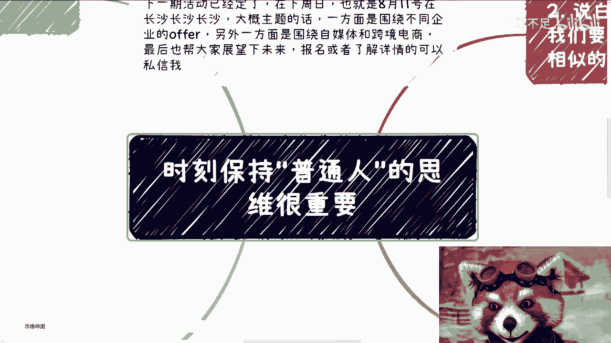
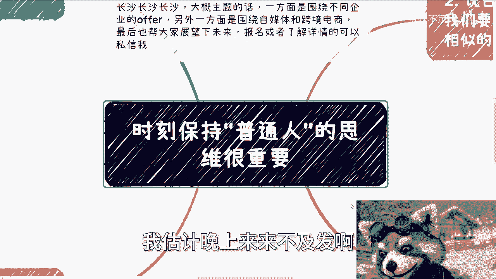
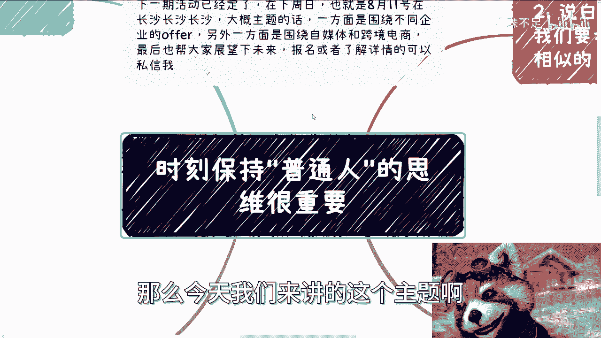
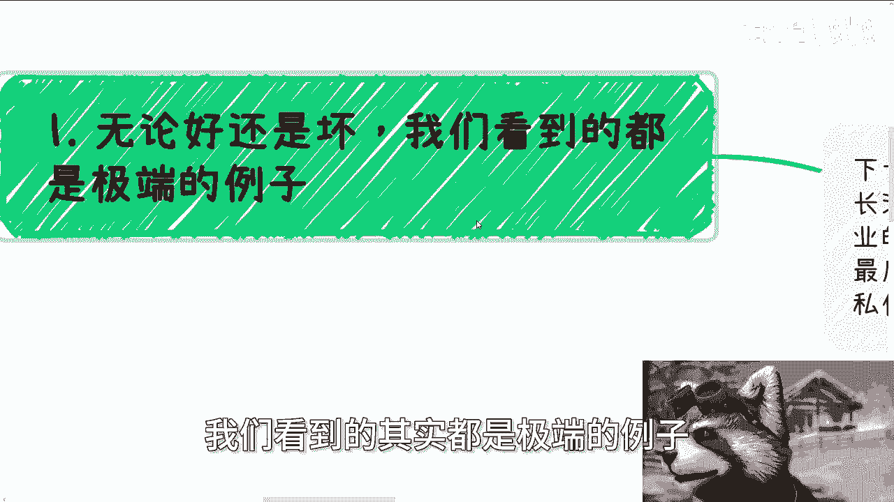
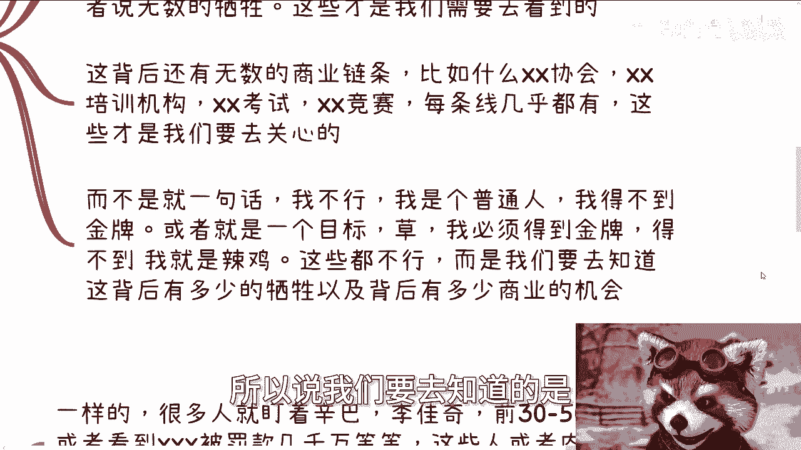
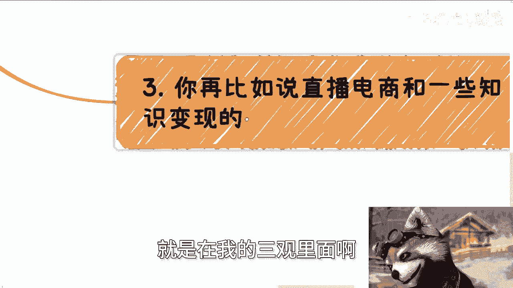
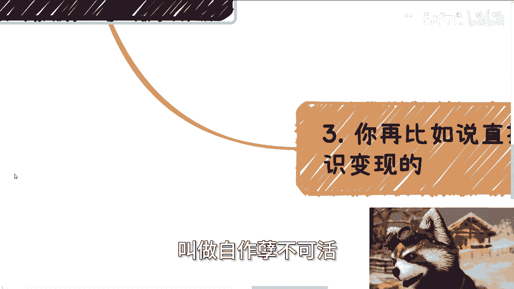
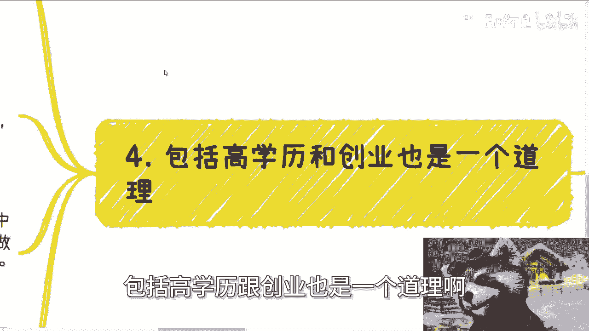
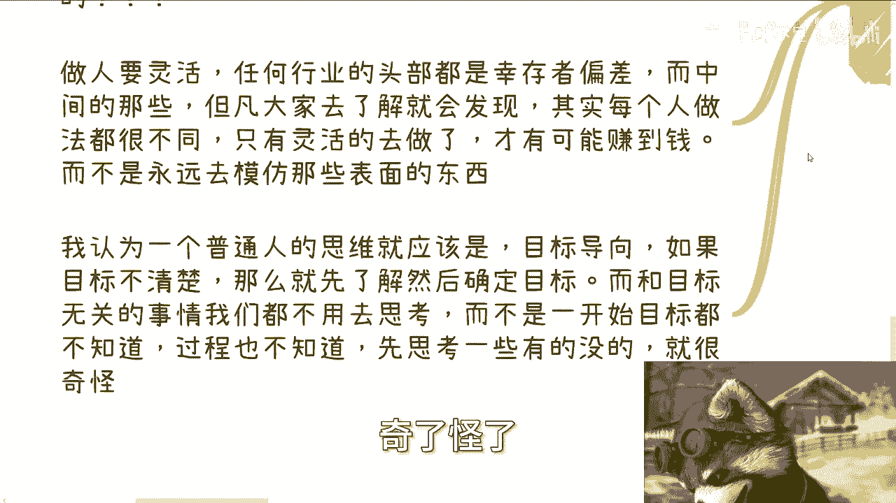
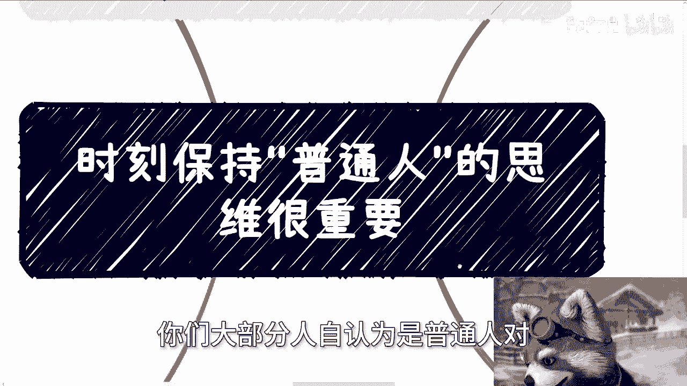

# 课程 P1：时刻保持“普通人”思维才能赚钱 💰





在本节课中，我们将要学习一个核心概念：如何通过保持“普通人”的思维来发现并抓住赚钱的机会。网络和媒体常常展示极端案例，这容易扭曲我们的认知。我们将探讨如何回归现实，关注金字塔的中间部分，并建立以目标为导向的务实思维。


## 1. 网络与媒体展示的是极端案例




上一节我们介绍了课程主题，本节中我们来看看第一个核心观点：我们日常接触的信息大多是极端案例。


网络和媒体为了吸引眼球，倾向于展示最成功或最失败的例子。这导致我们看到的商业、创业乃至个人成功的故事都偏离了常态。

以下是几个常见的领域及其被呈现的极端面貌：

*   **商业**：报道要么是登上福布斯的商业巨头，要么是因违法倒闭的企业。
*   **创业**：故事要么是顺利获得巨额融资的明星项目，要么是失败欠债、无声消失的案例。
*   **个人成就**：内容要么是“躺赚”月入数万的广告，要么是“名校毕业却失业”的焦虑贩卖。


**公式：信息环境 ≈ 极端成功案例 + 极端失败案例**


这种持续的信息轰炸，会让普通人误将极端情况当作普遍现象，从而形成不切实际的期望或产生不必要的焦虑。

## 2. 关注金字塔的“去头去尾”部分

理解了信息偏差的来源后，我们需要调整关注点。真正值得我们研究和学习的，是金字塔结构中去掉头部和尾部之后的中部。


以竞技体育为例，头部是获得金牌的极少数人，尾部是缺乏天赋或只有三分钟热度的人。而中部则是**无数默默付出、坚持训练却未必获得奖项的运动员**。他们的状态和背后的支撑体系，更贴近大多数人的真实处境。



以下是“去头去尾”思维的应用方式：


*   **关注过程而非仅看结果**：了解成功或失败背后大量的、普通的付出与牺牲。
*   **洞察背后的商业链条**：关注支撑一个行业的普遍性服务与机会，例如培训机构、行业协会、常规赛事等，而不是只盯着顶端的明星。
*   **定位自身**：认识到自己极大概率处于金字塔的中部，以此为基础设定目标和策略。


这个思维帮助我们摆脱“要么做到顶尖，要么就是失败”的二元对立观念。

## 3. 在具体行业中应用“普通人”思维

将上述理论应用到具体领域，如直播电商或知识付费，我们能更清晰地看到机会。

很多人只看到头部的李佳琦、辛巴，或者被罚款的负面典型。但这并不代表行业全貌。一个健康的行业生态拥有完整的金字塔结构。

**代码：行业生态结构**
```plaintext
头部 (Top 1%)： 全国知名，流水极高，但数量极少。
中部 (The Middle 98%)： 省市级别的从业者，流水在数十万到数百万，数量庞大。
尾部 (Bottom 1%)： 难以持续或刚入门者。
```




我们应该关注和研究的是**中部群体**。例如，中国网络主播中，年收入高于5000元的占10%。虽然比例不高，但基于庞大的从业者基数，其绝对数量非常可观。这部分人的业务模式、成本控制和生存状态，才是更贴近“普通人”、通过努力可能够得着的参考样板。



## 4. 建立目标导向的务实行动框架



最后，我们需要构建一套以目标为导向的行动逻辑，这是“普通人”思维在实践中的落脚点。

许多人的思维被不切实际的信息所束缚，产生了自我设限。例如，认为创业必须先注册公司、招募团队、投入大量资金。这偏离了“赚钱”这一根本目标。

以下是建立务实行动框架的步骤：

1.  **明确核心目标**：所有思考的起点应是“如何赚钱/变现”。如果目标不清晰，首要任务是厘清目标。
2.  **忽略无关事项**：在达成核心目标的路径清晰之前，暂时忽略诸如公司注册、资质申请等次要问题。
3.  **保持灵活性**：了解同一行业内不同个体的成功路径各不相同。不要试图机械模仿头部玩家的具体操作，而应理解其底层逻辑，并灵活适配自身条件。
4.  **从小处验证**：从低成本、小规模的方式开始验证商业逻辑，而不是幻想一步登天。



**核心原则：行动应始终服务于清晰的、可实现的商业目标，而非某种固定的形式或想象中的“标准流程”。**


## 总结




本节课中我们一起学习了如何通过保持“普通人”思维来更有效地接近财富。


我们首先指出，网络媒体塑造的极端案例世界扭曲了我们的认知。接着，我们提出应关注金字塔结构中更普遍的中部现象和商业链条。然后，我们将这一思维应用到具体行业，指出真正的机会存在于庞大的中部市场。最后，我们强调了以目标为导向的务实行动的重要性，避免被形式主义和过高预期所束缚。


请记住，真正的“普通人”思维是**清醒、务实且聚焦的**。它要求我们摆脱信息噪音的干扰，基于自身所处的现实位置，采取灵活而坚定的行动去实现切实可行的目标。