# 时刻保持”普通人“的思维才能让我们赚到钱 - P1 - 赏味不足 - BV1MU411S7ny

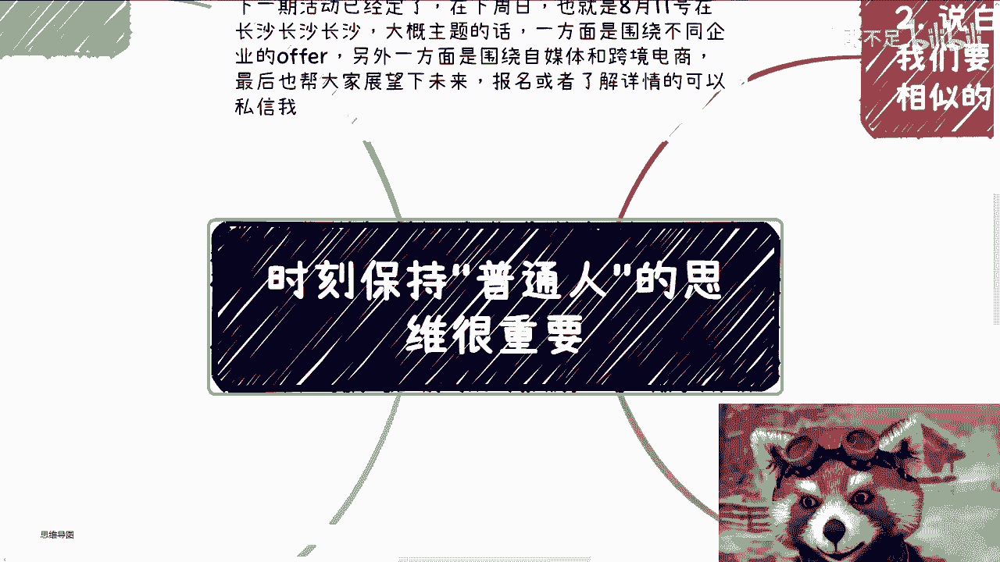

好大家好啊，这个今天我就要出发去长沙了啊，我可能晚上待会儿给你们定个时给你们发出来，我估计晚上来来不及发啊。

呃反正长沙就是明天好吧，其实呃8月11号啊，在下午，如果你们有缘呢看到这个视频呢还要报名的呢，那你们就继续私信我好吧。

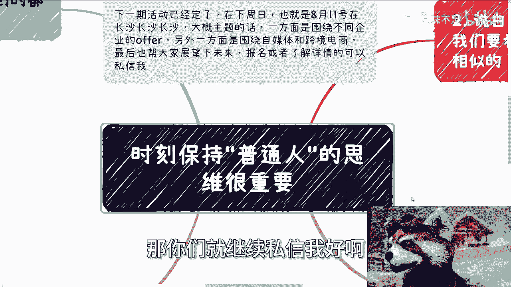

反正我就最后再打个广告啊，那么今天我们来讲的这个主题啊。

非常的重要，叫时刻保持这个普通人的这个思维啊，那你看到这个主题呢，你肯定会想妈的，我他妈就是个普通人啊。

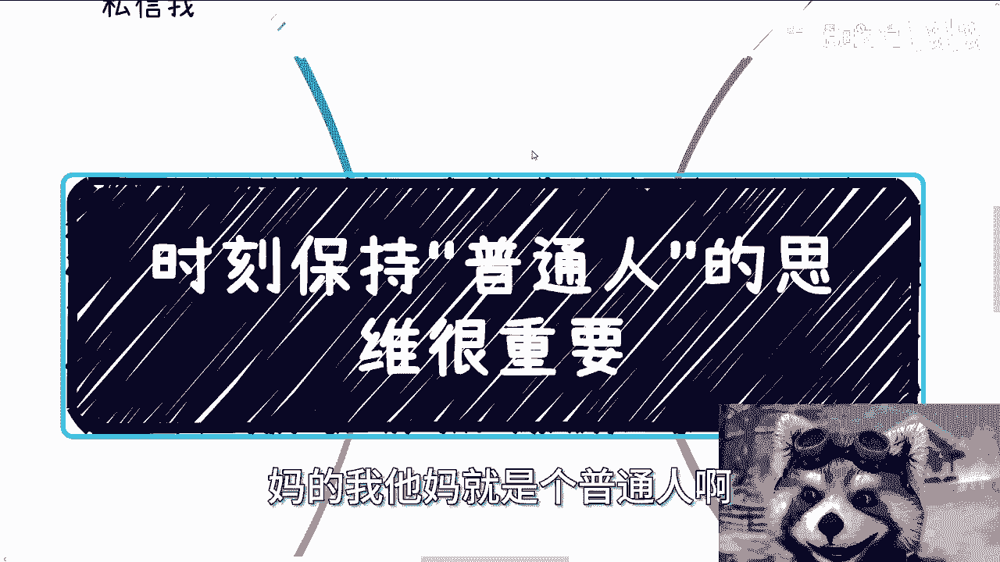

你竟然还让我保持普通人的思维啊，我跟你们这么讲啊，我觉得整个的一个大环境，包括大家的这个成长的一个环境啊，一个周期啊，其实呃已经让大家不是一个正常人了啊。

我这个地方写的是普通人，可能更多的应该是个正常人啊。

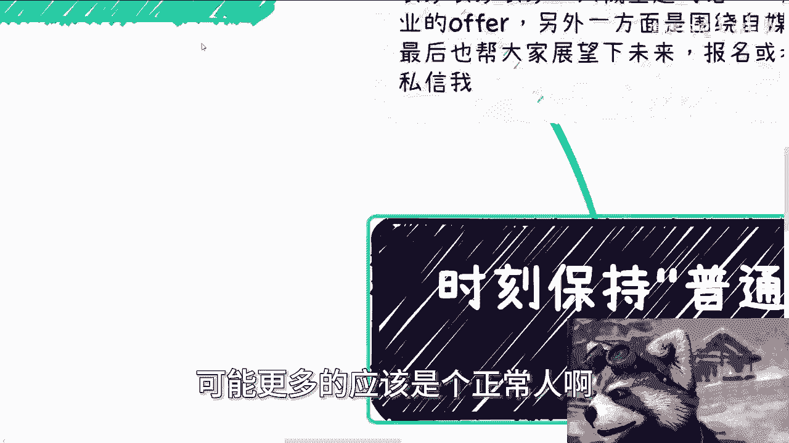

那么呃首先第一点是什么叫做无论好还是坏啊。

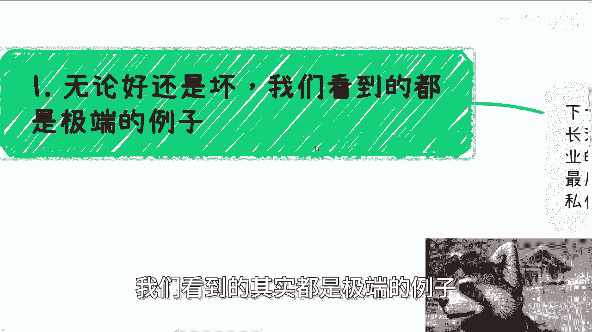

我们看到的其实都是极端的例子，你比如说商业啊，我们在网络上面看到的要么就是很成功的啊，就是那种什么商业大佬对吧，什么呃福布斯排名多少多少对吧，要么就是倒闭被判刑的啊，那么更多的呢深入老百姓心中的呢。

可能更多的就是一些呃违法犯罪的啊，那么第二呢就比如说创业啊。

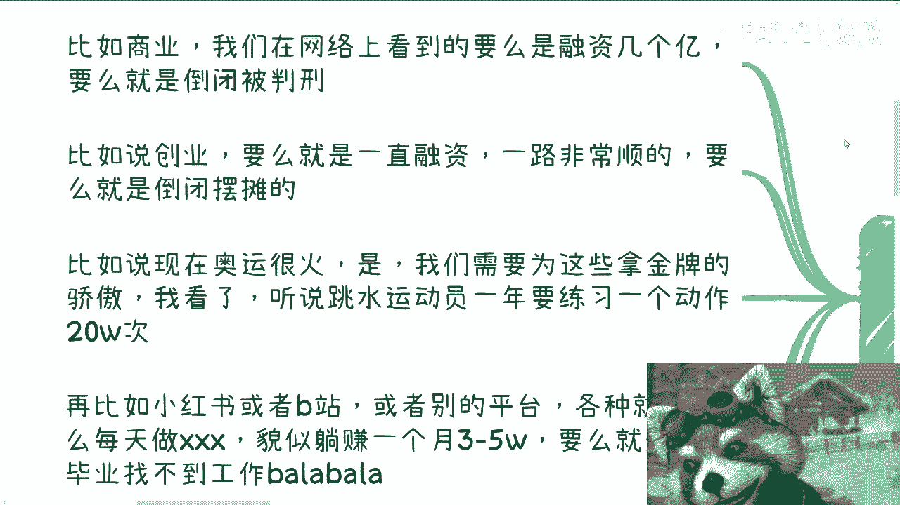

那要么一直是融资啊，比较顺的对吧，那么要么就是说就就可能没有融资。

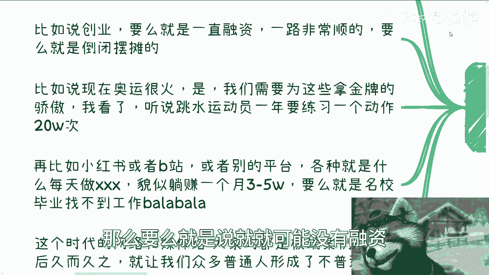

然后就是做着做着也没声音了，就摆摊对吧，或者来说就不做了啊，呃包括欠款对吧，那比如说现在奥运很火是吧，那我们需要那很多人啊，是这样子，我跟你们讲啊，现在这个普罗普罗大众什么样子。

就是你不能讲任何不一样的这种这种话题啊，或者说声音啊，你讲不一样的话题，你就是不爱国啊，那么你就像我这边说的啊，我们需要为这些拿金牌的人骄傲吗，需要没毛病啊，我昨天也看了。

我说听说这个跳水运动员一年练习，他们同一个动作得练习20万次啊，你说辛苦吧，辛苦啊，你说要要为之骄傲吧，骄傲的，你说代表国家吧，代表的没有错啊，那再比如小红书或者B站啊，或者别的平台。

各种就是什么每天啊，比如说写什么躺着作文，写文字对吧，躺着录视频，躺着干嘛，反正就是说你每天只要花什么多少多少时间，就能够躺赚3~5个月对吧，我在B站上已经看到很很长时间了，我我感觉我他妈都看了一年了。

这种广告啊，然后我点那种什么不感兴趣，没卵用啊，反正他退给你啊，要么呢，就是就是小红书上面写那种什么名校毕业啦，找不到工作啦，巴拉巴拉巴拉巴拉对吧，那那那反过来说这种可能是不好的嘛对吧，那好的话。

那就是那种什么什么名校毕业对吧，年薪百万对吧，就就像大家调侃的他妈小红书，小红书知乎上面他妈人均年薪百万对吧啊，那么你就会发现一个什么问题啊，就是你说这种广告为什么会在很简单。

广告会在的原因是因为他能赚钱，那当然他怎么赚钱，可能你不知道，我也不知道啊，但是我觉得知不知道这不重要啊，我们只要知道的是，他只要一直能投，那就说明他这一直是赚钱的对吧，如果这个东西不赚钱。

可能要过个半个月，一个月他就没有了啊，那么这个时代的网络跟媒体呢给予大家的，你会看到，包括我刚给你们举的例子，网络跟媒体给予你们的都是极端案例啊，然后久而久之呢，他就会让很多普通人形成那种。

我认为不正常或者不普通的思想。

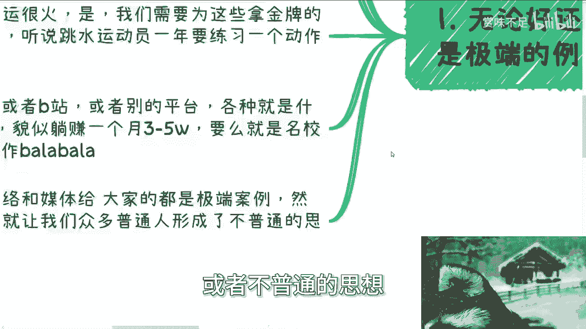

因为你们会认为的很多东西，就完全变成了幸存者偏差，完全变成了极端案例，把极端案例变成一个额，就是就是就是普遍的一个现象的时候，那么你们就会发现哎，你们的这个思维跟你们做实验方式。

就会得到一个额很大的一个改变，那么第二说白了啊。

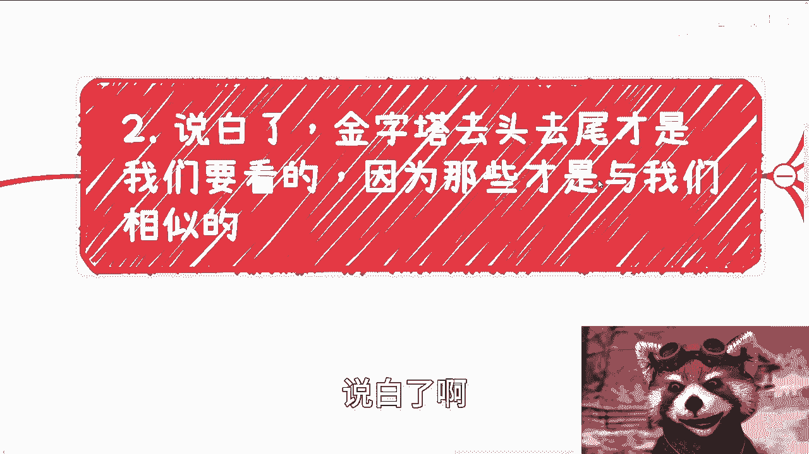

金字塔去头去尾才是我们要看的，因为那些才是我们相似的，或者说我们才是那些金字塔，去头去尾的中间部分对吧，或者说大部分人是中间部分，那么就拿竞技来讲，中国体育竞技体育项目很多啊。

头部可能就是大家所说的金牌，或者说什么什么什么什么，某某省市区的什么额这种奖项啊，对吧等等等，那么尾部的话呢，可能他就是完全没有天赋，或者家里就没有钱，或者就是说哎就学着玩玩对吧，也就3分钟热度过去了。

对吧好，那么我们去头去尾之后是什么，你们有没有想过，难道整个金字塔或者说放眼到任何一个行业，任何一个商业，整个去头去尾当当中没有啦，对不对啊，你说我只看那百分之前，1%，看最后那1%啊。

当初98%没有的可能吗，不可能，对不对，那么这些极端的或者得奖的背后是什么，是无数鲜活的生命，是无数的家庭的付出，而这些鲜活生命家庭的付出是没有得到奖项，而他们还在坚持，这才是我们要去看到的，对吧啊。

也可能是背后有无数的牺牲，这才是我们要去看到，才才是我们要去明白的，而不是盯着那前1%以及最后那1%，没有意义的，对不对，那还有什么，这背后还有无数的商业链条，因为一样的道理，你你盯着那前1%。

那你就算明白他的商业逻辑，你能做吗，你做不了，因为你无法成为那1%，你也接触不到那1%，而我们要更多的了解他背后，98%的这个这个人对吧，或者说一直没有得得奖，就默默付出，还在那边努力对吧。

或者说你你可以认为他现在是炮灰，你也可以认为他在为自己的梦想，所所所所追求对吧，无所谓啊，随便怎么说啊，但是这背后的商业链路，比如说什么某某某协会啊，某某培训机构啊，某某考试啊，某某竞赛啊。

你们去看任何一根线背后都有这些东西。

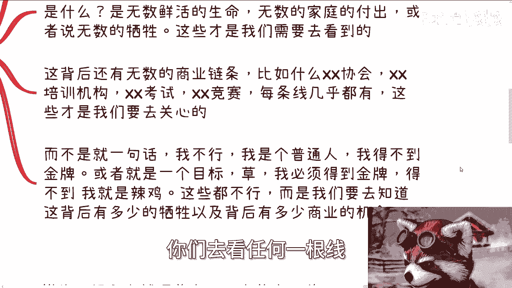

而这些才是我们要去关心的对吧，而不是说就一句话说哎我不行啊，我不是个普通人，我得不到金牌，或者来说就是一个目标，的呃，我我我必须得到金牌对吧，得不到我就是垃圾，这两者都不行的呀，对吧哦。

你一个么就是我非要顶到上面，而另外一个就是说OK我顶不到上面，我就是个，你又标榜为自己人啊，你又标榜为普通人，你又要说我要成为那1%，的自己跟自己过不去嘛，对不对啊，所以说我们要去知道的是。

这背后有多少牺牲，以及这背后有多少的商业机会，这是我们要去知道的。

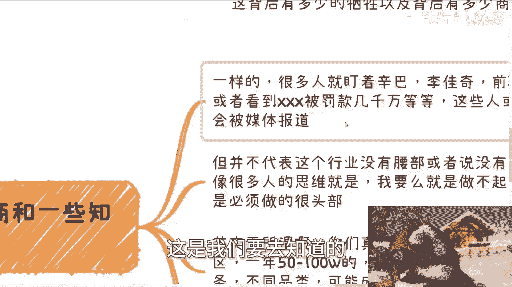

你别老盯着他妈的媒体跟跟跟那些啊，叫什么，就是网络上所给你们听出来的那1%啊。

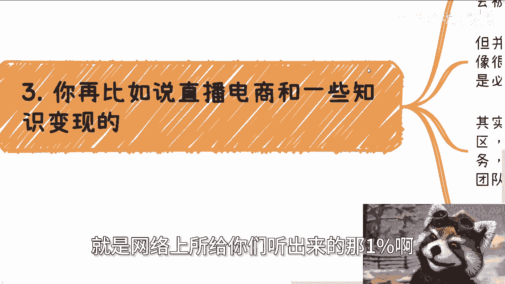

对吧，那么第三，你再比如说直播电商跟一些知识变现，一样的道理，我跟这么多人聊下来啊，很多人就是说还盯着辛巴盯着李佳琦啊，李佳琦名字打错了，李佳琦对吧，盯着什么呃，笙哥啊对吧，前30前50。

那又或者看到什么某某某被罚了几千万对吧啊，这个人怎么样怎么样，但是你们有没有想过，正因为他被罚了几千万，正因为他在全国的这个带货排名前30。

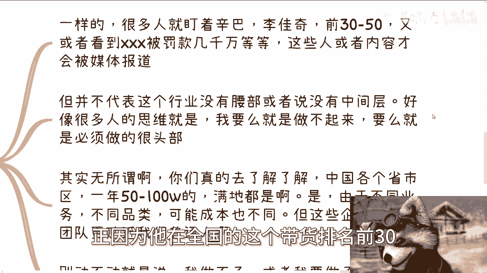

前50，他才会被报道啊，对不对，但是他妈的并不代表全国只有这30个，50个人，也不代表就就就就就真的做呃，被罚的就只有这一个几千门也不可能啊对吧，就是说我们要明白整个行业。

整个金字塔它都有一个完整的一个金字塔的，有好有坏，有中间有下沉都有的对吧，这就好像很多人思维，就是说我要么就是做不起来，要么就必须做到头部，就像我刚刚说的，我要么得到金牌，要么就得不到你妈牛吗。

这不是对吧，所以说无所谓啊，我给你们讲，真的去了解了解中国各个省市区对吧，你一年可能比如我不说赚啊，就说流水50万到100万的，做直播电商的，做知识变现的满地都是啊，真的满地都是啊啊你我们就这么说啊。

按照之前国家给出的数据，中国做媒体呃，网络主播呃，叫什么，年收入低于五千五千块钱的，是90%对吧好，那么我们就这么说，高于5000块的还有10%对吧好，那么你看上去你听上去觉得OK，10%是很少对吧。

哎好像这也是个幸存者偏差，怎么样子，但是大哥你想想看，你放到你放到整个叫什么从业人员，他从业人员有多少有1。8个亿，你1。8个亿里面有10%，卧槽不少了，你想怎么滴啊啊你你放你，你再回过头去想想。

你想想看啊，中国我们说有本硕博学历的，有大学学历的也就10%呀，卧槽你就很你你你想想看啊，你不能说，因为哦我身边都是大学生啊，因为我碰到的网上好像都是大学生啊，都是他妈的不是硕士就是博士，不是院士。

就是教授，哎呀我发现帮中国都是满地都是大学生，是吧啦，对不对嘛，这没有逻辑性的呀，而且更何况你再仔细想想，看现在的初中高中，他50%分流，他都已经给你50%分流了，你还怎么到处都是大学生啊。

你不能从你身边或者媒体整个报道，给你带来新思想偏差之后，你就在那边想哦，我的全部都是大学生，这就好像你看到卧槽，全部都他妈的一年赚几个亿，那你是做不到的呀，对不对，那我们就这么说，由于不同的业务。

不同的品类可能成本都不一样，但是这些企业或者说来说这种团队，比如说20万，30万，50万，100万的这种，他才更贴近我们普通人啊，是你够一够跳一跳能够得到的，你不是上来就他妈看人家做几个亿啊，对不对。

我跟你们讲，有很多人跟我谈直那个那个电商，不是说直播直播电商或跨境电商啊，他们跟我谈的是什么，就说哎呦我这东西很难做啊，这西成本很高，我说你怎么得出来很难做，成本很高的，然后他就说哦，我看到某某公司。

那我说这公司年流水多少啊，大概100多个亿，那我说跟的鸡儿关系啊，哎我他妈奇了怪嘞，对不对，你别动不动就说啊，我做不了，或者我去做啦，那必须投个几10万几百万。

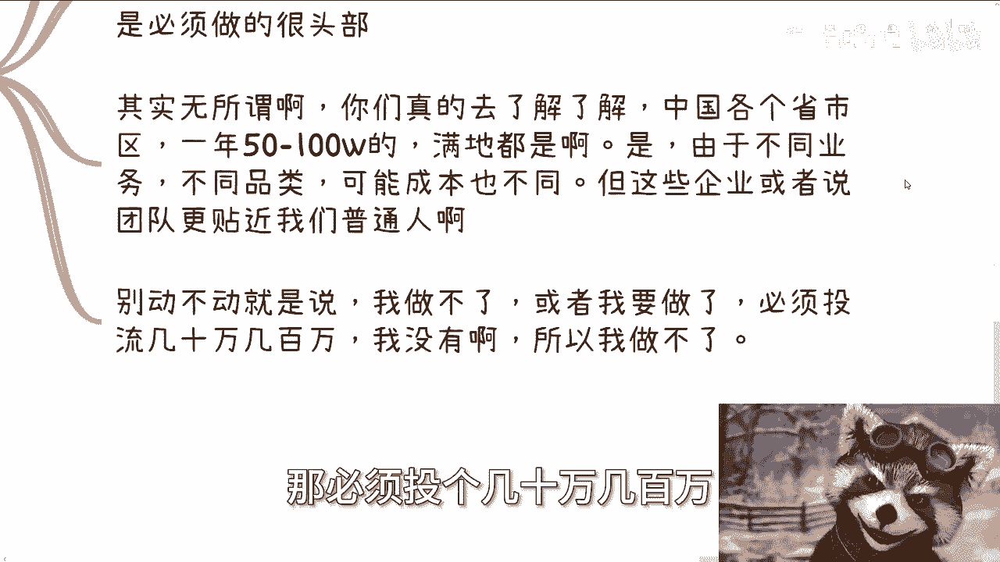

然后我没有几10万几百万，所以我做不了你，你们知道吗，就是在我的三观里面啊。

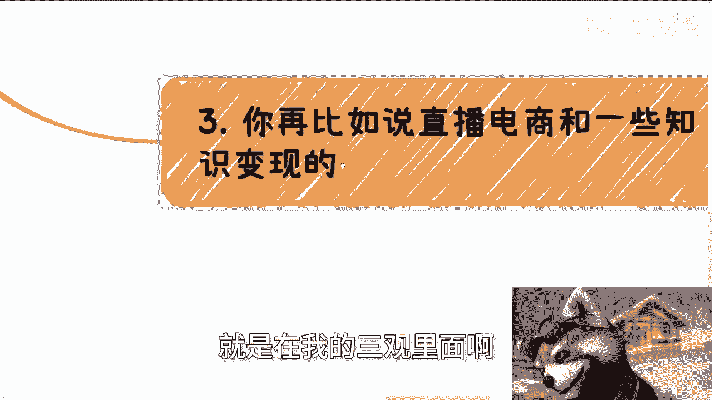

很多人我还是那句话叫做自作孽不可活。

你你们仔细去想看很多东西是什么，不是外界组织，你们是你们自己在组织，你们没有任何意义啊，他就是个他就是个莫比乌斯环，其实就是就是你会发现哦，因为我觉得我做不到，所以我就没做到。

或者因为我觉得要花这么多钱，所以我不去做，但是事实上到底你能不能做到，以及你要不要花这么多钱，你也不知道，对不对啊，第四包括高学历跟创业也是一个道理啊。

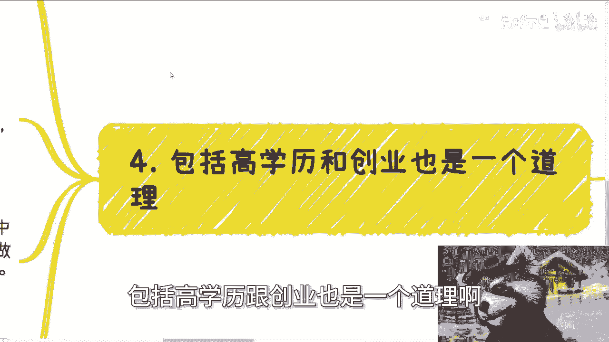

你比如说你说高学历能得到好的工作，我信的啊，能赚到相对高的年薪，我也信了，但多少比例呢，能多少比例呢，咱就说中国现在每一年1200万人，届生能稳定的啊，我我我不说都稳定吗，我比如说34年两三年能够年薪。

比如说大于七八十万100万的，能有多少人啊啊我按照2022年的数据，我就这么跟你们讲，不要来跟我讲互联网，互联网占整个中国的那个那个叫什么从业人员，就他妈占13%，有什么好说的呢，对不对，没有意义的。

一点意义都没有的啊，你你有多少比例能做多少年，你深入社会，你深入社会多去问问，多去了解了解，你别盯着媒体报道或者自媒体那些平台里面，每天给你推这些广告，有用的啦，没有用的呀，那按照这些广告呢。

我现在都会觉得哦，每天他妈的我去写写写写文章好了，写写网网网文，他妈的按照B站给我推的就是躺赚，每年每个月两三万会不啦啊，你以为他妈在打大富翁均富卡呢，啊对吧，那另外一方面做做商业。

做副业创业也是一个道理啊，我们的目标是赚钱，而不是循规蹈矩去做一件事情，我跟你们讲，很多人很搞笑的啊，他就是上来就问我，他说哎程师要不要注册公司啊，要不要招人啊，哎也不告诉我，你要干嘛。

你也不告诉我你的目的是什么，我们又不是考试，对不对，你从我的逻辑来讲，我要明白的是，你只要赚到钱，我要跟你讨论是怎么去赚钱，你赚钱这件事情不是代表你一定要注册，也不是代表你一定要招人啊。

啊这世界上赚赚到钱的，不注册的，不招人的多了去的呀，哪有规定一定要注超火者，招人的，我就搞不明白了，你知道吗啊你你做人要灵活，任何行业的头部都是幸存者偏差，而中间那些但凡大家去了解。

你就会发现其实每个人做法都不一样，就是你今天可能了解的，比如说1000个人都是做直播电商的，但是这1000个人可能做法都不一样，你只有不循规蹈矩灵呃，不循规蹈矩灵活的去做，你才有可能赚到钱。

而不是永远通过媒体，通过这种这种什么网络上面去模仿，那些有的没的，然后一开始模仿时候就在那边想哦，人家流水100 111百万啊，我我投入了30万，哎我也得先投30万，你妈有病吗，这不是对不对啊。

我跟你们讲啊，我认为一个普通人的思维就应该是什么，完全目标导向，如果目标不清楚，那么就先从了解目标，确定目标开始，而跟目标无关的事情，我们都不要去考虑，对不对，哎而不是说一开始连目标都不知道。

过程都不知道，就先去考虑一些有的没的，比如说哎我要不要注册啊，唉我我要不要我我要不要去去搞个资质啊对吧，我要不要什么招人啊对吧，我又不要融资啊，哎奇了怪了。

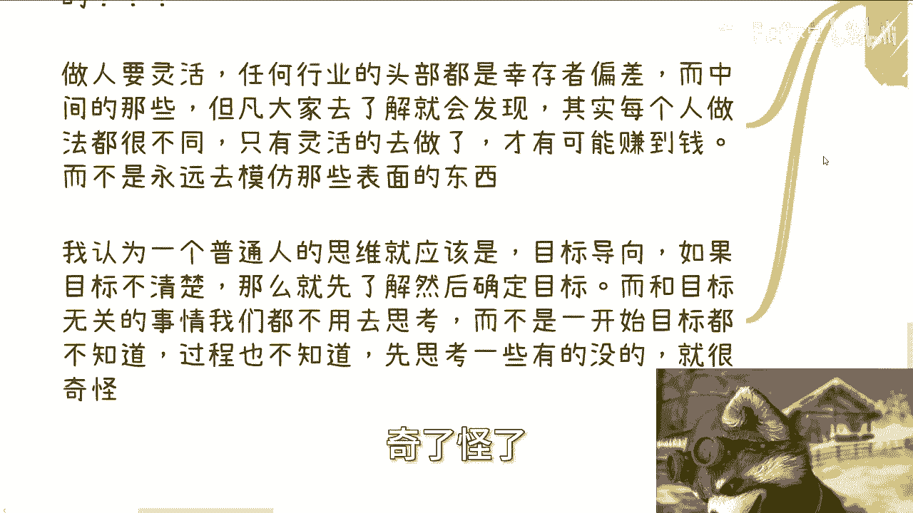

你要这些东西干嘛呢，你要是跟我说，爱尔创老师，我做这件事要变现好，那我就问你怎么变现，你知道吗，你逻辑讲出来看看对吧，就大部分人他连他连过程逻辑都不知道，他就跟我说，哎我要准备这个。

我要准备那个有什么用呢，要么就是我刚跟你说的，就是那种纯金牌思想，就是那种哎我必须要打到头部啊，我我虽然他妈的0~1还没做，我的目标就是100个亿，那你做啥。

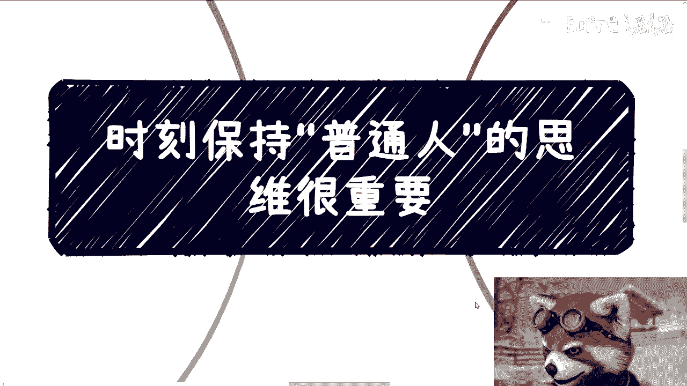

我跟你们这么说，你们大部分人自认为是普通人对。

自认为是正常人也对，但你们的思想早就不正常了，这一路尤其是年轻人现在一路过来。

你们的家庭，你们的学校网络给予你们的思维灌输是什么，就是纯思纯的那种性质的偏差，这也是我为什么说很多人可能会自卑，可能很多人会羡慕，会嫉妒会什么样子，因为他妈网络放大太大了。

就感觉我们身边所有人都他妈年薪百万，年薪千万可能吗。

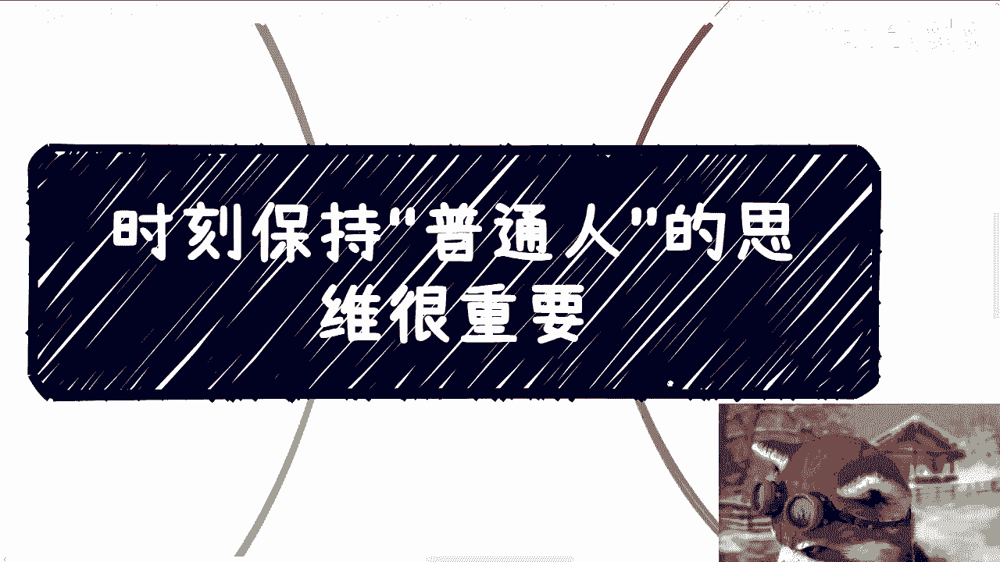

对吧好好吧，先这么着啊，然后那个长沙要报名的继续报名，然后那个你们自己工作工作上面的职业规划，你们自己比如说做些副业，或者跟别人一起呃，搞些呃商业啊，在这个上面比如说呃涉及到了合同啊，分红啊，分润啊。

呃股权啊，期权啊，商业计划书白皮书啊，包括你们希望通过我的一些视野，通过我对于当下经济情况的一些了解，结合你们个人跟一些背景，能够给你们一些更接地气的建议，或者说让你们少走点弯路的话。

那么你们可以整理好对应的问题跟个人背景，我们再来做咨询。

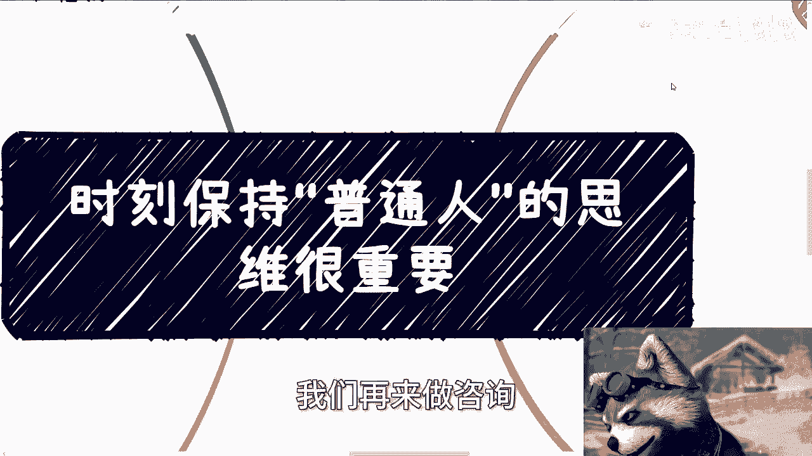