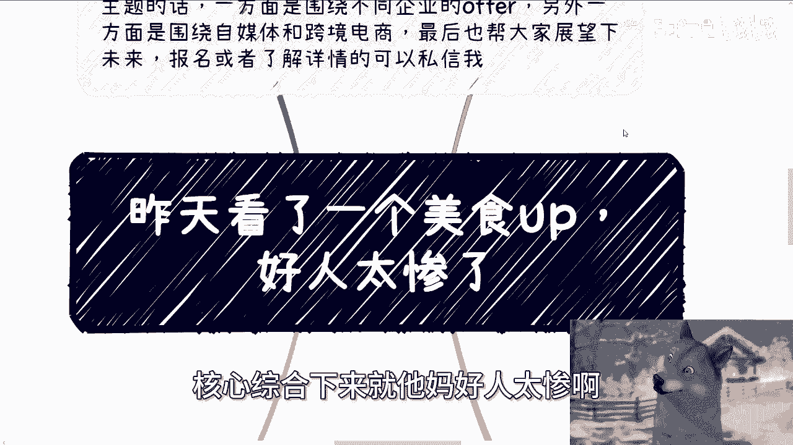
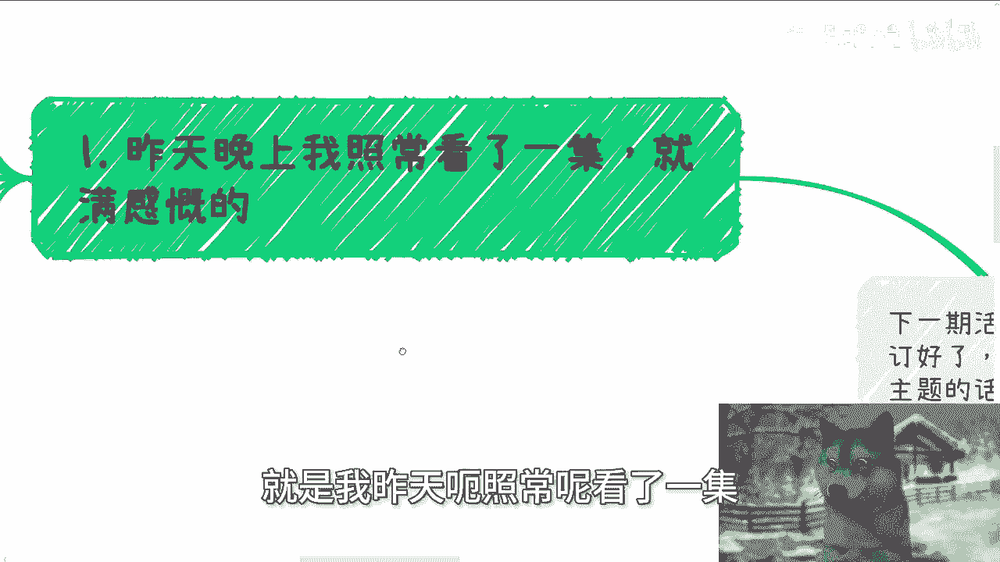
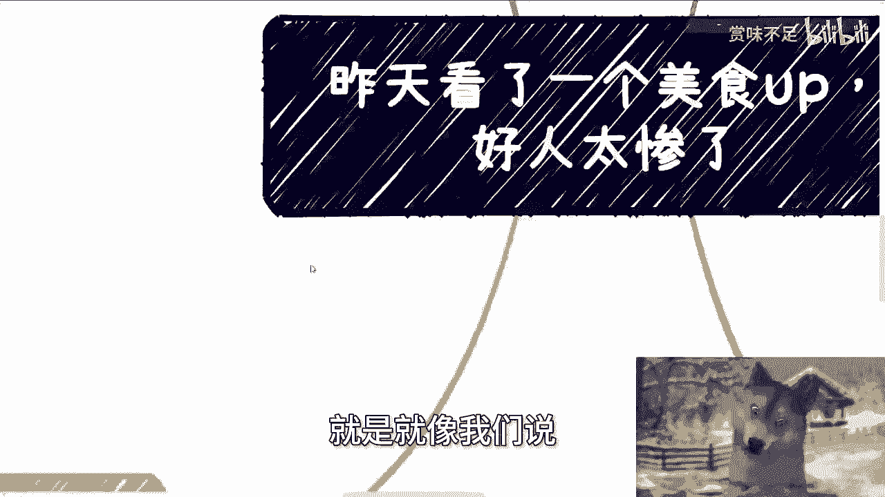

# 昨天看完一个美食博主，真的感慨好人太惨了 - P1 - 赏味不足 - BV1pE4m1d74X

好大家好啊，这个因为我今天还在外面对吧，就可能会比较吵啊，今天没找到一个安安静点的地方啊，大家尽量见谅啊，额首先呢今天我们来讲的这个内容呢，是我昨天其实看到了一个美食的一个up主啊。

然后看完了我也蛮感慨的，感慨呢核心综合下来就他妈好人太惨了啊。

呃我们先说今天这个这个前提啊，就是下期活动已经定了好吧，8月25号在西安啊，场地位已经定好了，位置在西安建筑科技大学李家村附近啊，那么大概主题的话呢，就一方面就是围绕不同企业的offer啊，国企啊。

央企啊，私企啊对吧，就这些啊，外企啊啊就是出国啊等等等啊，这些选择，那另外一方面呢，就是说围绕这个自媒体跟跨境电商啊，最后跟大家也展望一下，就是现在跟未来的一些发展呃，报名或者了解详情的呢。

你们可以私信我，好吧啊，那么OK那我们今天来继续核心来讲这个内容啊，首先第一个呢就是我昨天呃照常呢看了一集，就是也蛮感慨的啊。

就是一个呢是吃播啊，大概一年前我就开始关注了，一直到现在啊，我觉得的确人家也没有说自己是个大胃王啊，就健身博主啊，我觉得我这么一说，可能很多人都知道，因为毕竟现在这个关注量特别大嘛。

然后三个人也各有特色，然后昨天呢突然出了一集啊，其实就开始呃，我一开始啊我看的时候其实我没看懂，因为我我就是看直播的嘛对吧，那后来发现呢原来有人质疑假吃啊，那我发现就是三个人当中被质疑的那个人呢。

就单独还就是就是出了一个视频啊，吃了八包方便面对吧，你们要是知道是谁吗，你们也可以去看啊，但这个视频真的我从头看到尾呢，我感觉就很无奈啊，怎么说呢，因为你说吃吧，这他妈玩意儿也不好吃对吧，也没有。

就是说你吃一个美食的享受过程，你说不吃吧，其实我也明白，就很多人会觉得啊，比如说被质疑了肯定不舒服啊，更何况我觉得这种质疑是莫须有的，就基本上也就是被冤枉的，那我早就说过了啊，我说普罗大众是什么呢。

就是没有B数的一些群体，就以前呢有一个词叫什么叫键盘侠啊，为什么呢，因为他们在网络上面气势汹汹对吧，咄咄逼人，现实当中唯唯诺诺对吧，他妈就是个软柿子嘛，没他妈卵用的，那我昨天也也给他们留言了。

我说做自己啊，你别别别太在意对吧，就真的就是说呃你你太在意呢，你就做不了自己，而且会很累啊，当然可能他们毕竟量太大了嘛，一百一百多万了嘛，现在妈我关注的时候才10万不到吧。

哈而且也的确呢我觉得他们有这个实力啊，但是呢啊就这有一说一啊，你真的去自证，你就是你们去看那个视频嘛，就就很伤啊，真的就很伤啊，而且嗯这是第一点，第二点，今天还有个up主呢跟我提了啊。

也说下面呢说有人抱怨啊，充电很浪费啊，那今天另外一个事情呢，是一个up主在我这个我不是在开高速吗，啊在路上问了我一个问题，就是他说他说他那有一个粉丝啊，是在他的充电视频下面啊，那肯定就是充电了嘛对吧。

充电视频下面，然后呢意思就是留留了个言啊，说什么呢，他截图亏我看了啊，我大概看了一下，意思就是说他妈的这个钱浪费了啊，这个充电不值啊，怎么样怎么样怎么样，问我怎么办，嗯我停好车之后啊。

我就问我说我要是多思考一秒钟啊，就是你输直接拉黑啊，有什么好思考的呢，对不对，然后呢这个人也是个老好人啊，就跟我说啊，其实这个评论的人呢也只不过就是评论一下，对吧啊这个抱怨一下对吧，其实也没啥啊。

也还好，那等了以后真的有啥呢，就再再拉黑，我他妈就笑了，我说哼我说这就好像这个人已经踩了个雷，早晚都要引爆对吧，那你为什么要要要要现在不报，要让出现更多的受害者，或者说让你受到更多的伤害的时候。

你再去报呢，我不明白你明明有这个主动权可以去报，你为什么不报呢，对不对，没有意义啊，你留着干嘛养股啊，对不对，可能你其他的可能你其他的粉丝真正喜欢你的，觉得你有价值的人会被他私信骚扰。

就他妈因为你不拉黑，他会被他误导，值得吗，对不对，我就问他这么讲的啊，而且充电了怎么了，我说你也没有逼他充电对吧，你也没有拿刀架他脖子上怎么了呢，我说充电了就有骂你的权利吗，没有啊啊所以付钱就是大爷吗。

现在社会上很多在线下的消费者也是如此，感觉好像服务业他妈欠他们一样的对吧，就他妈的比如说付了钱，他就可以对这种啊，这个服务员对吧，呼来喝去啊，然后你妈对他们好像态度很不好，没有意义的呀，对不对。

我觉得这种就是一种内心的自卑，他妈的卑微造成的啊，就好像他妈自己付了钱，就有有权利指手画脚的，但问题他妈的谁让你付了呢，钱谁他妈逼着你付了呢，对不对，这种事情没有对错的啊。

但是我觉得好人往往都是这么想的啊，对对我，我只这么想，就是就是受害者嘛对吧，那第三啊，包括抄袭这个事也是的，其实从去年开始就有很多啊，就是这种抄袭的，你们就去年关注我的人其实也能知道啊对吧。

就这么一个情况啊，那么抄袭这个事呢也是一个逻辑啊，就是我线下活动呢，我也跟大家说，包括最近私信呢跟我举报的人也很多啊，我都安抚了一下大家，然后意思就是说你们顺手帮我举报就行了啊，不用太往心里去。

那就如去年一样的，我说一方面呢我们其实控制不了别人啊，顺手举报有用就有用，没用，那就没用，从事实来讲，我们也不能怎么样对吧，那我线下那个跟小伙伴说，去年呢我说我就想明白了，我唯一能做的对吧。

就是你做好自己，你继续做，我能做的讲，我能讲的对吧，因为为什么，因为你你去care他们，你去你去在意他们没有用啊对吧，你你表面的东西可以抄，实际的东西你抄不了对吧，我可以我我我我当时定下来的结论是什么。

就是OK我可以一天两更，我他妈甚至可以一天四更，他们行吗，他们不行对吧，而且我能跟的内容有价值，他们行吗，他们不行，对不对，我与其浪费精力，他妈的花在他们的身上，我还不如想想怎么把东西做好，是不是啊。

那我觉得我说心里话，我觉得大家可以抄商业模式，然后做出自己的东西啊，我觉得这个是个正道，因为商业模式本身也没有什么啊，这种抄不抄的，大家都是可以借鉴借鉴的，你要觉得我商业模式好，你抄对吧，我不排斥。

但是你说你不但抄的是商业模式，你把内容把表表象，把所有东西就是不想动脑子对吧，就是什么都不想动，就完全想copy，这叫什么，这叫格局小，这叫无知啊，这叫无耻，对不对对吧，我就是我一直跟你们讲的。

我们要去赚钱，但是你们要有底线，对不对，你你你你虽然说就是说啊你可以有有有，比如说啊就我我就跟你们讲了嘛，就是说有一定的啊，可能比你们原本的认知里面底线低的，但是你还是要守住，你是个人的底线吧对吧。

你是个有良心的人的底线吧，我不希望就是说所有的人啊去去赚钱，或者去做资本家，去完完全全做资本家，我就说了，我们去赚钱，做资本家的目的还是要为了老百姓处罚的，对不对，那么呃我早就说过了。

就是说良性竞争良性竞争，但是这个社会的这个本身的人就是这个样子，所以说我觉得呃心里面属于就是说啊没有逼数，就好像我之前这个杭州的一次活动对吧，我说我跟那个活动方我就说了，我说你不要去打广告对吧。

不要去打广告，他最后还是要去打折广告，那而且人来了吧，他还付不付不付钱，所以你们看啊，现在我为什么不在活动前去拉群啊，我也不再跟任何我熟悉的这种场地方去合作，就因为每次我的这个信任呢给予我的这种回报。

你们也看到了，就像我我之前说的对吧，就是你说你不打广告啊，还是要打，就是就因为就是说啊，这种先生给我这种广回报对吧，我早说过了，我可能原本也是个傻白甜，但是一次一次的事情呢。

在抹抹灭我对大众的这个信任对吧。

就是我不是很很想着说怎么样啊，然后第四你们猜猜看啊，如果你们的合伙人或者一起合作的人，哪天抹黑或者举报你，我我跟你们说最大的原因是什么。

我那天在长沙的活呃，长沙的活动上，我就说我说举报你拿，大概率就是因为你身边的人，一方面呢是因为他们掌握的材料啊，或者从你这边钓鱼的可能性最高啊，但原因呢往往就是你做了他们想做的。

或者你做了他们做不到的对吧，这个我觉得这就这个原因啊，那么你说普通人，普罗大众啊，很多人不经历很多事情之前呢，是无法控制自己的欲望跟恐惧的，就是我们之前说啊，说我们不是为了去消除欲望跟恐惧。

而是要去学会共存利用对吧，然后进步，而不是说被欲望跟恐惧去控制，就好像我们之前说我说任何事情，你只要自己不进步，你可能有无数种方式可以消除眼前的问题，但是你消除眼前的问题，然后呢然后呢对吧。

你又好像比如说你你你眼红这个直播的up对吧，就这个直播的，你可以通过各种方式说对方假吃对吧，就算这个up真的退网了，或者说被人家网暴了对吧，然后然后呢你还是会有嫉妒的人，你还会嫉妒别的人。

而且也不会因为这个人退网，你就会成为下一个百万粉丝的人，不可能啊对吧，这就这就好像我第二个说的例子，就是你也不会因为啊这个因为你充电了，你就有骂人的权利，就就算你碰到的都是一些好人的up对吧。

能容容忍你，那又怎么样呢，本质上有意义吗，你要看这个人不顺眼，总会还有千千万万个你看的不顺眼的人，然后呢，你这辈子他妈就在不顺眼里度过了对吧，是我跟你讲啊，现在这个社会可能就这个吊样子啊。

我也不明白为什么会这样，可能人类本身就是这样，但我还是希望就是说大家能多看看自己啊，多关注关注自己的成长，老盯着别人，盯着别人干嘛。

没有意思的，对不对啊，就是就像我们说的。

就是说你今天做直播，做做做做电商，做任何别的东西，包括做知识星球，你要觉得比如像像身材有数对吧，或者像其他的啊，你要觉得他们这个模式好或者怎么样子，没问题啊，你完全可以去copy啊。

但是你KY你去你去模仿，不是他妈的，让你把他的内容照搬过来，你那你的底线呢对不对，你你做这件事情有任何意义的，你损人不利己，就是你从本质上来讲，你能影响到他吗，你影响不到他。

但是你做这个事情有什么意义呢，对吧你你要是你按我说法啊，你要是真的觉得啊，你要是真的觉得就是你觉得啊，我模仿这种模式对吧，我能够赚到点钱，那你要是真的你是在乎这点钱的，我真的说难听点啊。

我说的这就难听一点，有手有脚，你到路上乞讨不香吗，你到路上他妈卖艺不香吗，对不对，我他妈我就真的真的无语了啊，所以就基本上我觉得就这么个情况好吧，我就可能跟大家感慨吧，感慨一下吧，啊然后那个行吧。

那就这么着吧啊然后那个职业规划啊，商业规划啊，股权期权，包括你们现在这个工作当中啊，包括跟别人的合作啊等等等啊，啊额在这当中啊，分红啊，丰润啊啊这个啊商业计划说白皮书啊，包括合同啊。

啊包括你们希望就是说通过我的一些认知，通过我的一些啊建议啊，能够给你们一些好的规划，或者让你们这个少走些弯路的话，那么你们可以啊，这个整理好对应的问题跟个人背景好吧，我们再来走咨询啊。

啊那么因为最近在外面啊。

可能有点吵好吧。