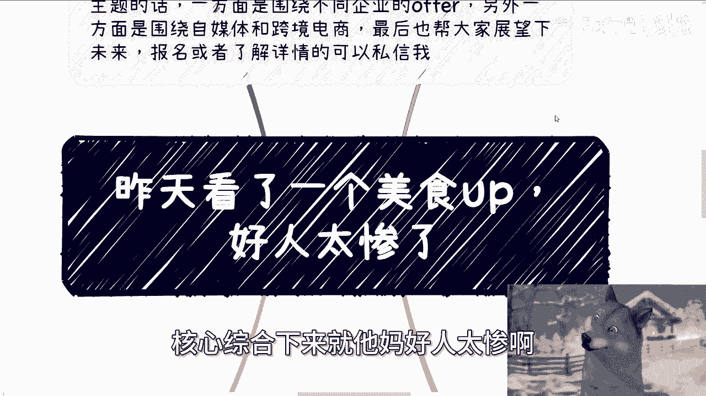
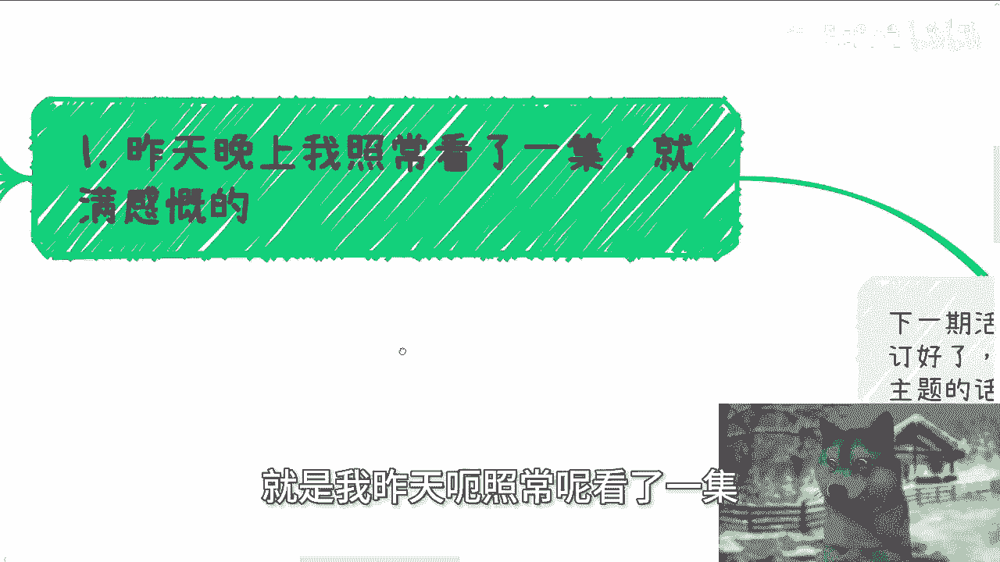
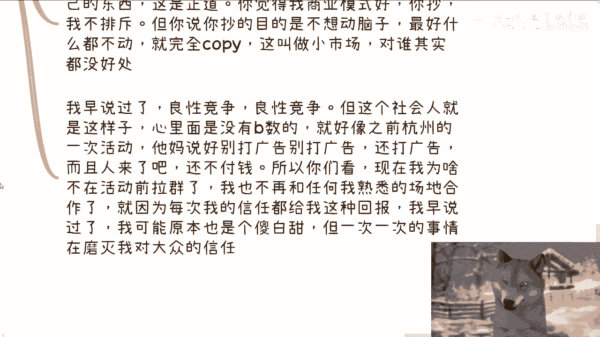
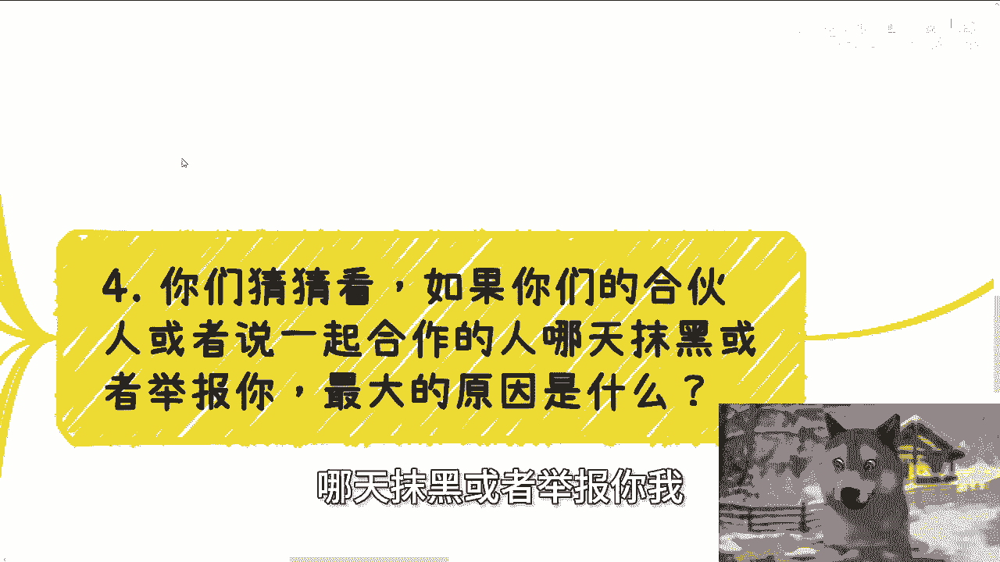
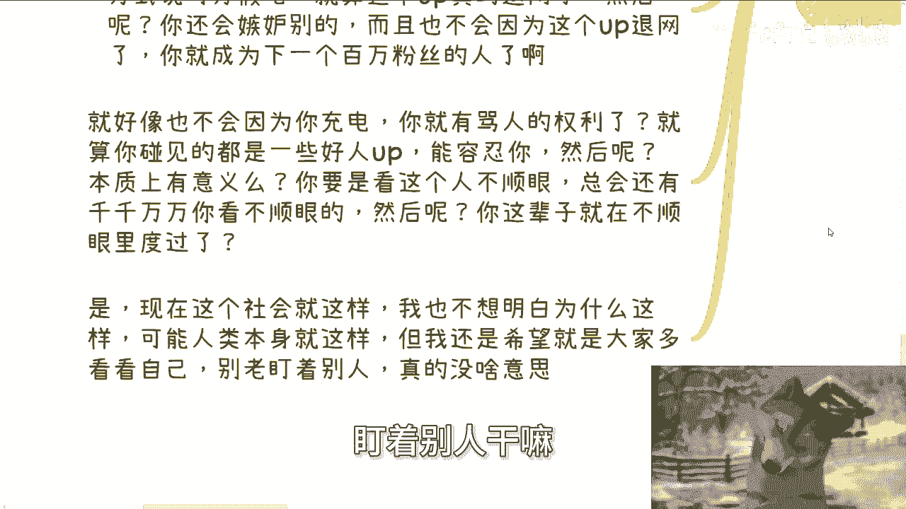
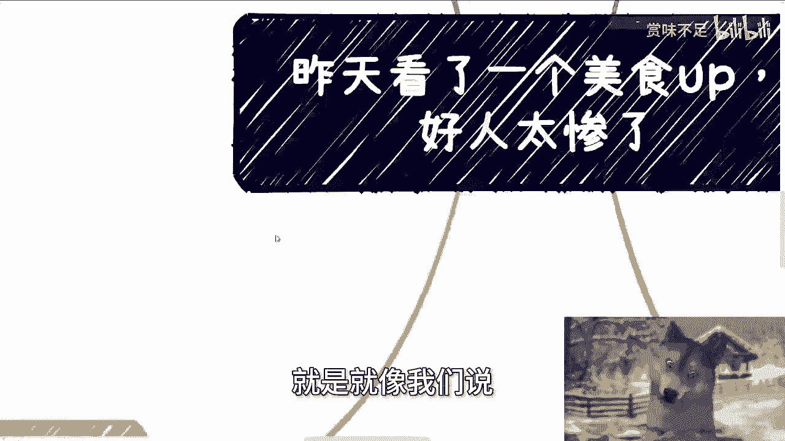
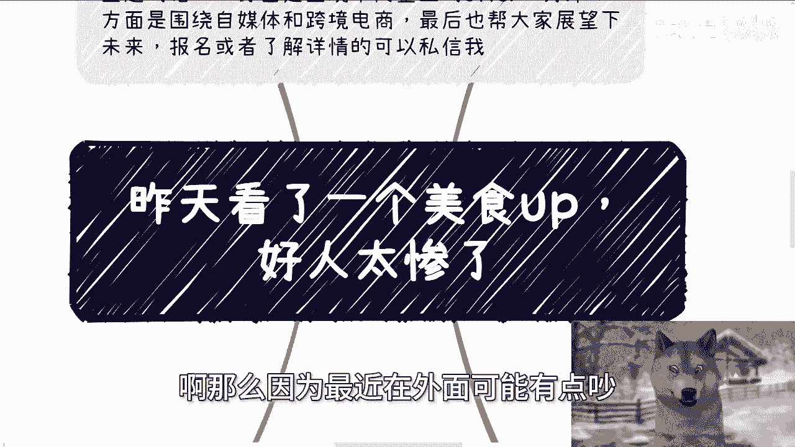

# 昨天看完一个美食博主-真的感慨好人太惨了---P1---赏味不足---BV1pE4m1d74X_no

## 概述

在本节课中，我们将通过分析几个网络上的真实案例，探讨一个普遍现象：“好人”为何常常陷入被动与困境。我们将学习如何识别并应对外界的无端质疑、恶意评论以及不良竞争，核心在于建立强大的内心并专注于自我成长。

---

## 一、 关于“自证陷阱”与无端质疑

昨天，我观看了一位美食博主的视频，内容是为了回应“假吃”的质疑而连续吃下八包方便面。整个过程毫无享受可言，只为证明清白。

这个案例揭示了“自证陷阱”：当面对莫须有的指控时，花费大量精力去证明自己，往往徒劳且消耗自身。

> **核心逻辑**：试图向“没有B数”的群体（或称键盘侠）证明自己，是一个无底洞。他们在网络上气势汹汹，现实中却可能截然不同。

**应对策略**：做自己，不必太在意。你的价值不由他人的无理质疑定义。过度在意会让自己很累，且正中下怀。

---

## 二、 关于“付费即大爷”的心态

另一位UP主遇到了粉丝的抱怨：在“充电”（一种打赏功能）后，留言指责“钱浪费了”、“不值”。

这反映了社会上一种扭曲的心态：认为付了钱就拥有了指责甚至辱骂服务者的权利。

> **核心逻辑**：`付费 != 获得无理指责的权利`。
> 没有人逼迫其付费。这种心态源于内心的自卑，试图通过“消费者”的身份获得虚幻的掌控感。

**应对策略**：对于这种充满负面能量、纯粹抱怨而非建设性批评的言论，最直接有效的方法是**拉黑**。这并非逃避，而是主动清除噪音，保护自己的创作环境和心理健康。容忍一个“早晚要引爆的雷”，可能伤害到其他真正支持你的粉丝。

---

## 三、 关于抄袭与不良竞争

从去年开始，我的内容也面临被抄袭的问题。抄袭者不仅模仿商业模式，更直接照搬内容。

> **核心区分**：
> *   **借鉴商业模式**：可以接受，是商业领域的常见学习方式。
> *   **照抄内容与表象**：这是格局小、无知且无耻的行为，属于“不想动脑子”的完全复制。

**应对策略**：
1.  **控制你能控制的**：做好自己的内容。你可以做到日更、输出高价值观点，这是抄袭者无法复制的内核。
2.  **放下你无法控制的**：顺手举报即可，不必过度耗费心力与之纠缠。你的精力应专注于如何做得更好，而非如何打击他们。
3.  **守住底线**：赚钱、竞争都应有底线。我们追求进步，但不能成为没有良心的“完全体资本家”。

---

## 四、 关于来自“身边人”的伤害

你们猜猜，如果被合伙人或合作者抹黑举报，最可能的原因是什么？

最大的可能性来自于你身边的人。一方面他们掌握你的信息最多，另一方面，原因往往在于：**你做到了他们想做却做不到的事**。

> **核心洞察**：普通人往往难以驾驭自己的欲望（嫉妒）和恐惧（被超越）。他们不是通过自我进步来消化这些情绪，而是试图通过打压他人来获得暂时的平衡。

**应对策略**：理解人性中的这一面，但不要被其困扰。专注于自身成长。即使你成功让一个你嫉妒的人消失，你还会遇到下一个，人生将永远陷在“看不顺眼”的泥潭中。真正的出路在于向内看，提升自己。

---

## 总结

本节课我们一起探讨了网络与现实交织环境中常见的几种困境：

1.  **无端质疑**：无需陷入“自证陷阱”，你的价值不由此定义。
2.  **恶意批评**：对充满负能量的非建设性言论，果断使用“拉黑”工具，保护自己的空间。
3.  **不良竞争**：区分借鉴与抄袭，专注打磨不可复制的核心能力，守住做人做事的底线。
4.  **身边隐患**：理解嫉妒的根源，坚定不移地走自我成长的道路。

社会的复杂性可能不会改变，但我们可以改变应对它的方式：**将目光从挑剔他人收回，聚焦于提升自己**。老盯着别人没有意义，损人不利己的行为更是毫无价值。真正的强大，来自于内心的笃定和持续的进步。