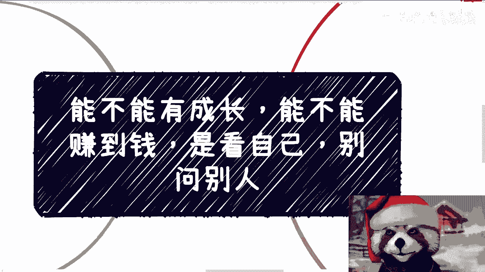
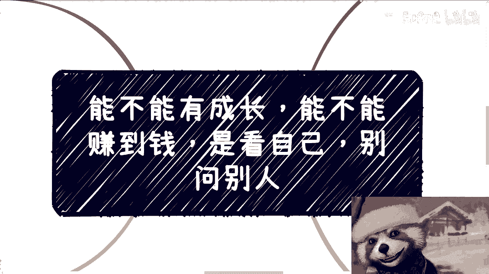
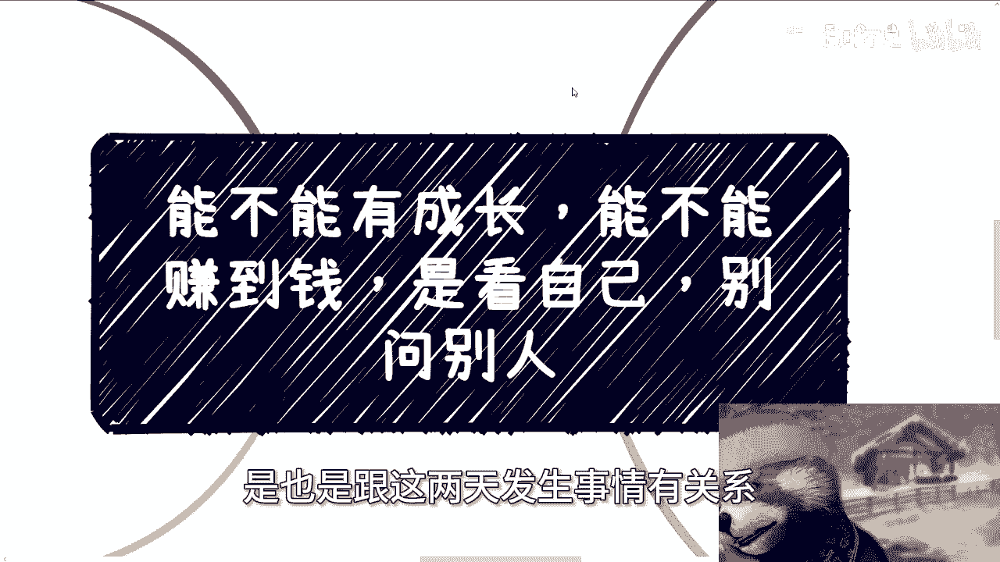
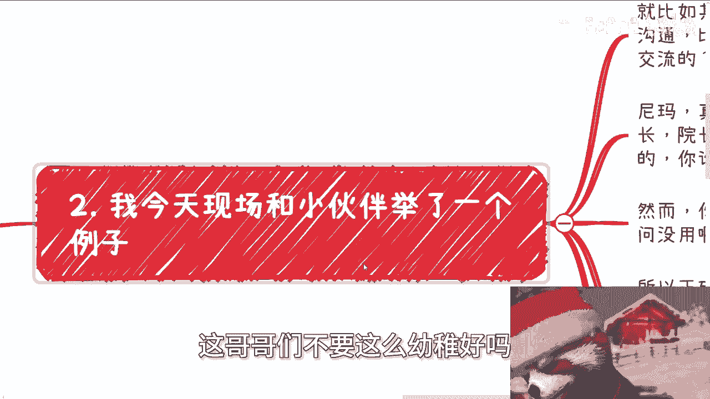
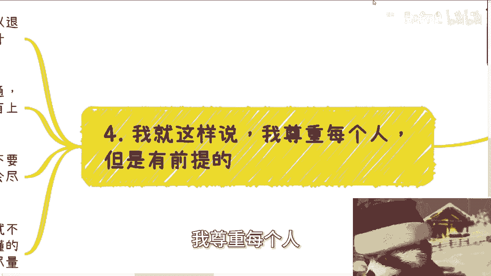
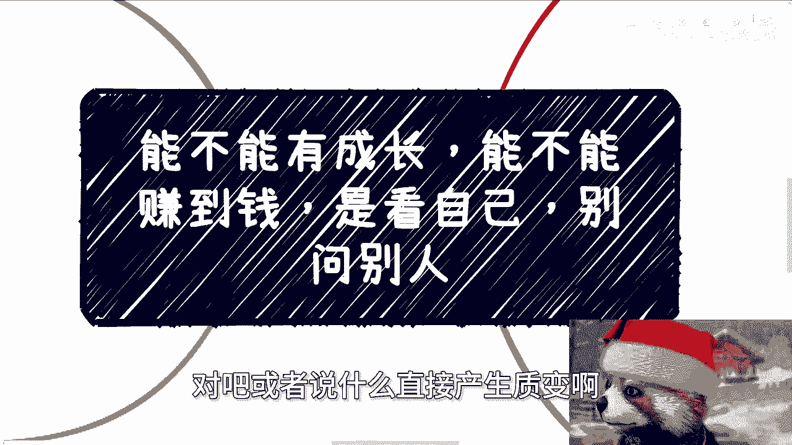

# 课程01：个人成长与商业沟通的核心原则 🎯

在本节课中，我们将探讨一个核心主题：个人的成长与商业上的成功，其根本驱动力在于自身，而非依赖他人。我们将通过分析几个常见的沟通误区，来学习如何更有效地进行自我规划与商业交流。

---

## 成都活动回顾与主题引入

成都的活动已圆满结束。本次线下交流的氛围很好，参与者提出的问题也非常有质量。

这引出了我们今天要讨论的主题：**个人的成长和赚钱能力，取决于自己，而非他人**。

---

## 常见误区分析与正确方法

我经常遇到类似的问题。下面我将通过几个具体场景，来分析其中的误区并提供正确的思路。

### 误区一：直接询问需求与商业模式

很多人会直接询问对方的需求或商业模式，这通常会导致对方反感，沟通难以进行。

**核心逻辑**：你需要去了解，而不是直接去问。直接询问会让正常人感到反感。

**正确做法**：在沟通前，应做好充分准备。不要让对方做“填空题”，而应提供“选择题”。

以下是准备沟通方案的示例思路：

*   **师资培训**
*   **软件采购**
*   **产教融合专业共建**
*   **大学生竞赛**
*   **产业学院建设**

你需要抛出几个不同切入点、涉及不同决策层面的方案。如果对方感兴趣，自然会选择其中一项与你深入探讨。如果对方不接话，则说明目前没有需求。

### 误区二：期待他人为你的成长负责

许多人会问：我在这个工作中能获得什么技能成长？

**核心逻辑**：无论是HR还是你的上级（Manager），都没有义务为你的个人成长负责。活在世上，只有你自己能对自己负责。

**正确沟通方式**：你可以询问公司或上级对你岗位的期望与规划。但最终的成长路径，需要你自己去思考和争取。就像在学校，老师教学态度不佳，你只能从道德层面评价，但无法强求，因为对方没有必须对你负责的义务。

### 误区三：询问他人自己该如何赚钱

有些人会直接问合作方：我该怎么赚钱？我应该拿多少分润？

**核心逻辑**：你能否赚钱，并非对方的责任。对方若愿意让你赚钱，是基于其道德观；若其商业模式设计本身就没考虑让你盈利，你也只能从道德层面评价。

**正确做法**：在合作前，你自己必须有一个初步的构想和了解。你需要通过市场调研形成自己的判断，而不是直接去问对方。直接询问会显得很不专业，且逻辑不通。

### 误区四：低效的沟通方式

今天早上有人通过微信问我“在吗？”，然后就没有下文了。

**核心逻辑**：这种沟通方式非常低效且不礼貌。在2024年，沟通应直接、明确。

**正确做法**：有事请直接说明，一次性将背景、问题描述清楚。尊重他人的时间，是有效沟通的基础。

---

## 项目参与中的自我定位

前两天有小伙伴问我，他参与了一个项目，想知道自己能在其中如何赚钱和提升技能。

要分析这个问题，必须明确两点信息：

1.  **角色分析**：对方在项目中是什么角色？你是什么角色？通过分析角色，才能判断你能接触到什么人、什么资源或信息。
2.  **自我驱动**：关于成长和学习，同样需要自我驱动。你需要自己想明白在这个项目中**想**成长什么、学习什么，然后主动去沟通和争取。不要指望项目或他人必须为你提供成长。

---

## 尊重是合作的前提

我尊重每一个人，但这有前提：**尊重是相互的**。

我对人的态度差异主要基于两点：

1.  **对方是否尊重我**：沟通时是否有基本的礼貌和上下文交代。例如，退款时说明理由是一种尊重；毫无缘由地要求退款，则不是。
2.  **对方是否尊重自己**：是否积极向上，而非自暴自弃。有些人能力很强但格局小，难以合作；有些人虽暂时能力不足，但懂得尊重自己与他人，具备发展的基本潜质。

---

## 核心原则总结

本节课我们一起学习了个人成长与商业沟通的核心原则：

*   **成长与赚钱的责任在于自身**：外界环境对所有人都一样，将问题归咎于外界毫无用处。
*   **沟通前做好充分准备**：将方案整理好，预判对方可能的问题，提供“选择题”而非让对方做“填空题”。
*   **自我驱动是关键**：明确自己的目标，并主动去规划和争取。
*   **尊重是双向的**：有效的合作建立在相互尊重的基础上。

如果你想在职业规划、商业规划、合同协议等方面获得更接地气的建议，需要整理好个人背景与具体问题。如果指望通过一次咨询就能一步登天或财务自由，那是不现实的。

**最终，你的道路，需要你自己一步步走出来。** 🚀