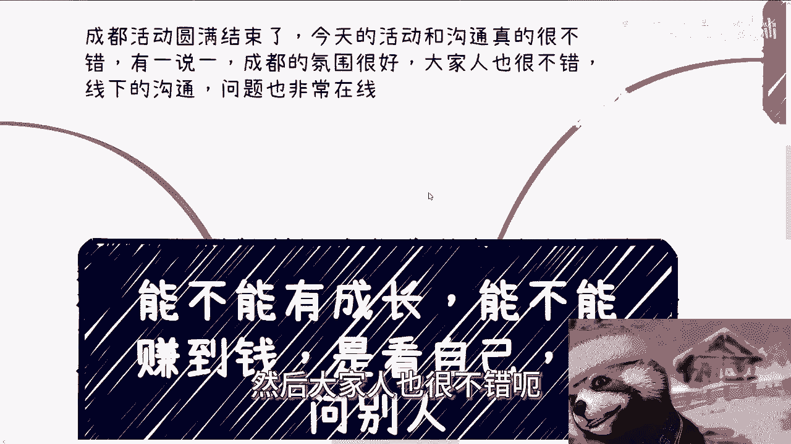
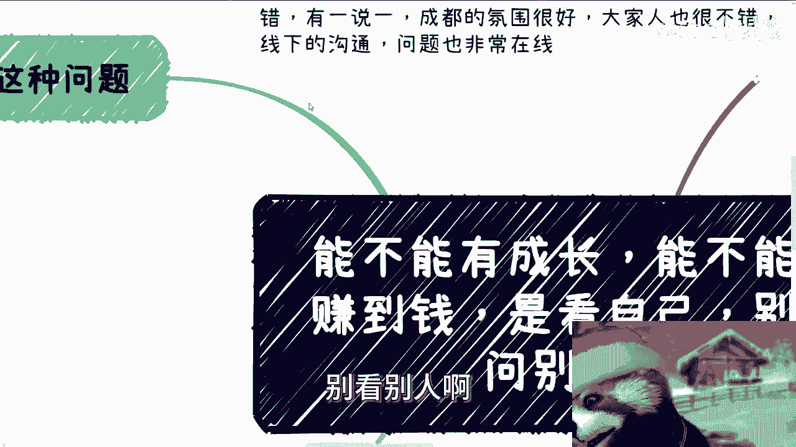
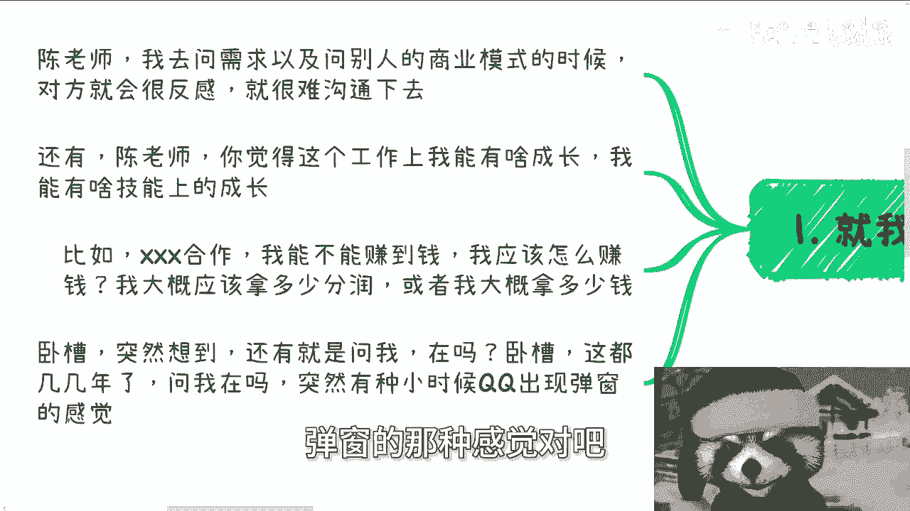
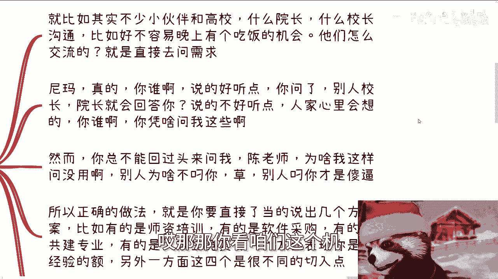

# 是否有成长，是否能赚到钱，看自己，别老问别人 - P1 - 赏味不足 - BV1f4421Q7u7

哈大家好啊，这个首先啊成都活动圆满结束了，那今天的活动跟沟通我有一说一啊，真的蛮开心的，呵呵就是有一手以成都这氛围蛮好的，就虽然之前出了一些小问题啊，但是呃我着实是没想到，其实线下氛围是真的蛮好的。

然后大家人也很不错。

呃而且问的问题也非常在线，哎呀我真的哎呀。

我真的想想妈的很快想着很快再来晨读啊，那今天我们讲的这个主题呢，是也是跟这两天发生的事情有关系。

就是呃有没有成长啊，能不能赚到钱，他是看自己的，别看别人啊。

就我跟你们这么说，我经常会碰到这种问题，就碰到就他们问我这问题，他说陈老师我去问一个需求，或者问别人这个商业模式的时候，对方会很很反感，很难沟通下去，大哥你你你用正常的逻辑想一想。

你我是跟你们说是要去了解，但不是说让你们直接去问对吧，你直接去问他妈正常人都反感的呀，对不对啊，第一第二啊，他说陈老师啊，我觉得这个工作上呢，这个我呃他说我今天做过工作啊。

他说我这工作上呢呃有啥成长啊对吧，他说我我我这个工作上能有啥技能上的成长，你想想看啊，你可以去问hr，你可以去问你的mental，问你的那个manager啊，说你说啊。

你们接下来对我这个工作或者对我这个岗位啊，有什么怎么怎么样的，一些这个这个期望或者规划，这没有错，但问题是hr也好，你的mental也好，没有人会对你的成长负责吧，对不对，就是你要明白一点啊。

就是说人活在世界上面，所有的事情只有你对你自己是负责的啊，也只有你能够对你自己负责，你包括就是说很多人说啊，他妈的我有个什么学历对吧，我我能够干嘛干嘛，你要明白一个道理，就是任何东西没有必须的对吧。

就是说如果打个比方，比如说你的mental或者你的manager对吧，甚至比如说你你你在学校里面读书，你的老师他这个对你的教育，或者对你的这个这个这个态度对吧，就是可能比如说呃该说的不说啊。

然后态度呢也吊儿郎当的，你只能从道德层面去谴责他，但是你不能说他啊，说啊你你你你可能你不能说他不好啊，你不能说他怎么样，因为什么，因为别人没有义务去对你负责，对吧啊，然后第三他说比如说某某某合作。

他说我能不能赚到钱，我应该怎么赚钱啊，我大概应该拿多少分润，或者我应该拿多少钱，我跟你讲这种东西，哎我早就跟你们讲过了，这种东西你自己得要去有一个初步的想法，你要不了解，你可以到社会上去了解。

但是你千万不要去问别人，你明白吧，就是你问别人，别人怎么跟你讲的，你你照你这么个说法，你说我能你能不能赚钱，那就从我角度来讲，你如果跟我合作，你能不能赚，你能不能赚到钱，关我吊事，对不对。

就是你跟我合作，难道你赚不赚钱是我对你的义务吗，是我对你的责任吗，你想想看这逻辑通吗，对不对，就是我但凡想让你赚钱，那是证明我的道德观比较高啊，我要是说我在整个设计逻辑里面，你就没有赚过钱。

或者我就没想让你赚钱，这也只能说你从道德层面谴责我，但是你能说我什么呢，你能说我什么呢啊怎么滴了，我他妈非要让你赚钱呢啊，对不对，那你放到别人身上也是一样的啊，还有啊，今天早上还有个事情。

妈的也是把我气笑了，突然之间你知道吗，就微信上问我，陈老师在骂，不是你在吗，你倒是说事啊，你问我在马干嘛呢啊，我们是微信啊，呵呵你你妈一句话赞了，让我感觉他妈的，这就小时候QQ那么弹窗的那种感觉对吧。

这真的啊，2024年了，这哥哥们不要这么幼稚好吗啊。

然后第二啊，我今天现场跟小伙伴举个例子，我是这么说的啊，我说就比如啊我说比如很多小伙伴啊，呃诶等一下我看一下我这个麦克风，对不对啊，啊对的对的，就就是说很多小伙伴啊，他这样子的，他去这个通过关系啊。

跟高校啊，要院院长啊，校长沟通啊，就比如说好不容易晚上吃个饭啊，机会让他们交流啊，他们交流怎么交流的，就直接去问需求，你知道吗，哎哎哎他说哎那个王王院长对吧，那个张院长对吧，哎那那你看咱们这个计。

接下接下来这个计算机学院啊，有没有这个啊师资培训啊，或者有没有相关的这个东西啊，哎我跟你讲真的，我他妈这妈气笑了，妈一口血吐出来啊，就是我跟你讲，你要我说是什么对吧，你谁啊，那说的好听点。

你问了别人校长院长就会回答你吗对吧，凭什么呢，凭什么呢，说的不好听点，你配吗啊，你简单想跟你配吗啊，人家心里会想啊，你谁啊，你凭啥问我啊，你谁啊对吧，你什么地位啊，对不对啊。

然而你你你你如果这个这个吃到闭门羹了，你总不能回过头来问我对吧，陈老师，为啥我这样问没有用，哎那那你想让我怎么回答你呢，就我回答你是我回答你怎么回答你，我只能说别人为啥不，你的，别人你才是。

不是别人为啥不，你没人会吊你的，对不对，所以正常做法是什么，我跟你们讲，正常做法就是你不要让对方去做选那个填空题，你要让对方做选择题，就是你直截了当的，要说出几个高校常见的方案啊。

比如说我们这边写的师资培训啊，软件采购啊，工业共建专业啊，大学生竞赛啊，包括产业学院啊，对吧，你先把牛逼先吹出来，而且你吹的这些切入点呢，得要完全不同的切入点，就像我这边列的是四个不同的玩具。

四个完全不同的切入点，因为你想啊师资培训是学校开始说了算的，软件采购有的是学校说了算，大学生竞赛可能就说是学校跟协会啊，或者学校跟某些这个职业院校，本身就可以去决定的，那么也就是说。

不管是切入点还是他的这个决策权，都是不同层面的，那么说白了你扔出四个切入点，你要让对方去做选选择题，而不是填空题，那么呃你不要问我为什么没有，为什么，就是我们不配，就这么简单啊。

而且人家也没有这个就像我们说的，人家没有这个义务，没有这个责任来做填空题，那么你一抛出这四个选选择题，那么对方如果感兴趣，那么他一定会选择某个东西，跟你接下来往下聊的，你明白吧。

就是你也不要就大家要懂得察言观色啊，你不要对吧，直来直往，直来直往没有用的啊，然后对方如果不接话，那就说明真的没有需求，你也没必要再往下那么瞎折腾啊，那么第三前两天有有小伙伴微信问我，他就这么说。

他说他说陈老师啊，我去蹭了个项目，然后他问我的问题是什么，他说你觉得我自己在这里面怎么赚钱，能不能提升技能，能不能学到什么，我跟你讲啊，这个东西里面有两个必须要了解的信息。

一个是对方在这个项目里面到底是什么项目，对方到底是什么角色，你在里面到底是什么角色，通过角色的分析，你才能知道你在这项目里面到底能干嘛对吧，比如说你到底是能接触什么人呢，还接触什么关系呢。

还是说是是是能碰到一些，就是说日常看不到的信息呢对吧，怎么样子啊，那么另外一方面，就是说问你自己有没有成长或者学到什么的，我跟你讲这事儿是他妈真扯，你知道吗，就哼我一开始就点题了。

就一个人成长或者学到什么，没有别人会对我们负责的对吧，谁都不会负责，你今天他妈就算在学校，学校的老师也不会负责，因为学校也好，学校老师也好，无非都是拿钱办事，卧槽他妈的一天一天这么多人。

一届一届这么多人，怎么了，他他妈给给怎么给你们每个人都负责啊，啊他妈菩萨吗对吧，所以这是你要成长什么，你要学习什么，是你自己去想啊，你到底在这里面，你想成长什么，你想学习什么，你跟对方去提呀。

你去沟通啊对吧，你自己都想不明白，你就像我刚跟你说的，你今天跟我合作怎么滴啊，我非得让你赚钱呢，啊他妈我欠你的，对不对，一样的呀，哦就是大家去想着成长，想着什么东西，千万不要去就是想着去问别人。

或者去去想着说哎，这个项目到底给我产生了什么，怎么滴了，这他妈项目必须给你成长的，又妈奇了怪了，对吧啊，第四我就这样说啊，我尊重每个人。

但是他是有前提的，什么意思呢，就是你们很多人如果相互沟通过，你们会发现我对每个人态度是很不一样的，我举个例子来讲，有的人退款我就可以很好的非常平缓的退款，有的人退款，我跟你讲，我他妈就款退给他。

我一句话不说，他妈直接拉黑，为什么两方面，一方面是首先我要看他们尊不尊重我，对不对，因为尊重是双方的，就比如说沟通对吧，你说退款，你给我说一句话，张老师，我们退款也是说话，你跟我说一下上下文。

你跟我说一下大概的理由，你跟我说一下你这个人的决心对吧，那也是一种说法，你但凡他妈的哦，说错就就就退哦，说报名就报名，也没有理由的，怎么滴了，我他妈欠你的，对不对对吧，所以说对我来讲，这种人滚吧滚啊。

然后另外一方面是什么，就是我要看他们是不是尊重自己，就说你不要自暴自弃对吧，你也不要就说碰到任何东西就跟我说，爱创说我现在不行对吧，我我怎么样怎么样，你只要积极向上，我觉得都是好的啊。

就是跟你这个人没有关系，为什么，因为有的人很强，但是眼高手低，说不到，说到底他很强，代表他能力很强，但他格局很小对吧，那么这种人是没有办法合作的，这种人也没有长远的发展，我就不会想去有更多的沟通。

我也不会去帮他，但有的人可能什么都没有，也什么都不懂，但是他懂得尊重自己，他也懂得尊重对方，我跟你讲，这种人就有很大的格局，但是并不是说他就一定有很大的这个，这个未很好的未来或者很大的发展。

但是至少他具备了最基本的能力，那么这种人其实哪怕我说不好听点，比如说以前其实出现过很多次，就是有的人他跟我沟通，我微信上可以跟他沟通很长时间，我也不会问他要钱，他给我我都不想收，因为我也知道他很困难。

但但是我觉得这种人值得，对不对对吧，所以说就说我我们就回到今天这个东西啊，就是你能不能有成长，你能不能赚到钱，你到底在社会上是怎么样子的，是得看你自己的，包括跟别人聊东西，都是你要把方案整理好。

把各种东西整理好，把对方可能要问你的问题都想在前面，卧槽这才叫一个横，怎么说呢，很完美的一个一个合作对吧，你说啊，你你跟我谈一个合作，我抛出一个三个最基本的问题，你一问三不知，你告诉我怎么合作。

我跟你这么说，我抛出问题，你问三不知的时候，我就我就已经知道你是不靠谱的了，你明白吧，你就你也不要再来跟我说爱爱创烧，我再我再去问一下或者怎么样子，你知道这说明什么，这就说明你没有，你甚至连做中介。

连做拉皮条的这么一个基础能力也没有，你还需要磨练，你懂吗，哦你不要老想着就是说哦，这个项目要给我成长哦，这个公司要给我成长哦，哦我跟陈老师合作，陈老师要给我赚钱，诶奇怪了对吧啊，嘶哎呀行好吧。

就这么着啊，那么我也希望就是说，反正大家真的就是想明白想明白，不要把这个很多东西归结于外外界，外界的问题对我们来讲都是一样的，你归结于外界没有用的哦，好吧行，那就这么着啊，然后职业规划商业规划啊。

然后股权期权分红分润合同呃，白皮书，项目计划书啊，包括你们手上有什么牌，你们没有什么牌，你们希望通过跟我的沟通，能够给你们更加接地气的一些方向跟建议的话，那么你们就呃整理好个人的问题跟背景。

然后我们来这个私信再走咨询啊，然后另外一方面就是说，如果指望着就通过我这边的这种咨询，能够什么一步登天对吧，或者说什么直接产生质变啊。

财务自由，那你们就别来找我了啊。