# 普通人在结婚这件事情要考虑的事儿 - P1 - 赏味不足 - BV1rc411u7Zn

哦大家好啊，嗯对今天不是那个主题对吧啊。

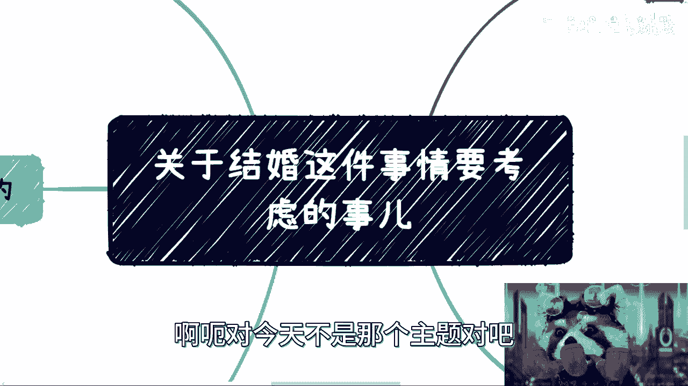

换了个主题啊，这个前两天小伙伴让我说一下结婚这个事啊，我觉得这个可能对大部分人来讲。

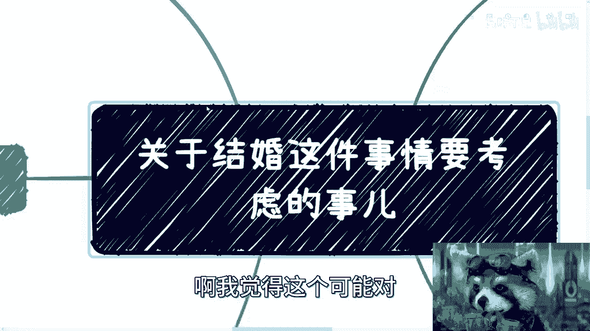

可能早了一点是吧，但是我觉得这个早一点也没什么坏处啊，呃这一方面，第二方面呢我觉得这个跟商业是一样的，就是很多东西我们别抱有幻想。

也别被PUA啊，所以我觉得嗯这个问题还是能讲一下的。

首先第一点啊，我觉得呢很多人都是这样认为的啊。

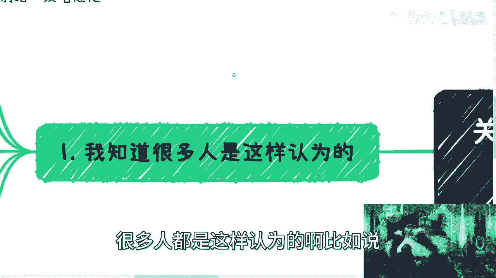

比如说说有的人呢觉得年纪到了就要结对吧，这个可能不是有的人不是，我们觉得可能是大部分父母觉得是，就是这个每年过年回去都是跟这个叫什么，叫什么考试一样的是吧，然后每年过年回去。

最不愿意提起的就是这个事情啊，我觉得我身边好多人呢，就是因为这个事情每一年都要搞得跟父母，就是哎呀很不开心是吧啊，我觉得这是第一个，第二个呢有的人觉得呢结也好，理也好也无所谓。

我个人觉得呢这个事儿就是本来就自由对吧，也不是说一定怎么样怎么样，但是呢我觉得呃这么来讲吧，你结呢你是别人咱不说啊，你也是对自己的负责，离呢嗯我觉得是对自己的不负责啊。

但是啊就是说这个事儿呢也有很多人要说对吧，你实在是过不下去，实在有问题，你肯定也得离，但是呢就是说呃，就这里这里面要考虑的事情可能很多啊。

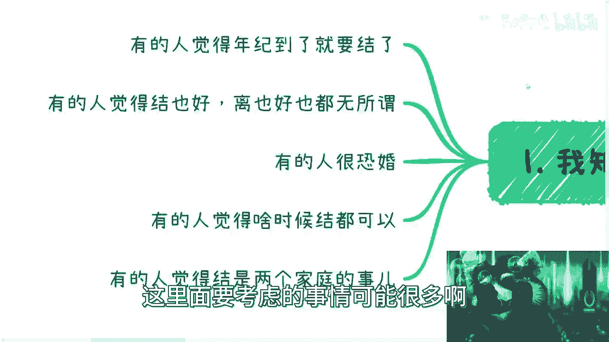

就这个事不在我们今天这个考虑范围内对吧，而且哎呀我想想吧。

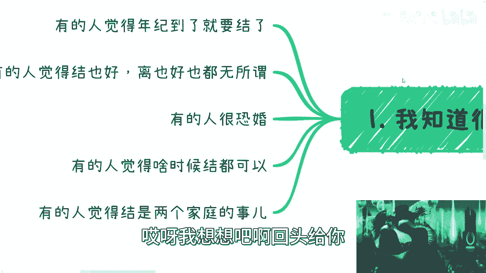

回头给你们想想看要不要讲这个东西啊，这是第二点，第三点呢有的人说我很恐婚啊，我觉得这个事业可以理解啊，因为什么呢，因为我们一直说嘛对吧，单身保平安嘛是吧，这个有多少这种意外对吧。

多少的问题其实都是你身边的人开始搞的是吧，嗯有的呢是什么财产对吧，有的呢是这种人身伤害啊，很多很多呃，我觉得也没毛病，但是恐婚啊，我觉得嗯可能更多的不是恐婚，他恐的是啊，就是是不是需要有找人去谈啊。

谈了之后是不是信任这个人，因为毕竟啊就是在我看来，当代这个社会呢这个正常人太少了啊，然后人心隔肚皮对吧，你根本看不清楚一个人怎么样，而且大部分人观念是什么，大部分人没有阅历，他他不知道怎么去看待一个人。

你知道吗，这就好像我现在就见到一个人，我会有一个，首先第一点，我会对这个人有一个主观的判断对吧，就是他的穿着啊，他的谈吐啊，他的各方面。

他的一些思维对吧，然后还有的就是我会通过一个改，我自己的感觉对吧，就见了这么多人，总归会有好也好不好也好，我总会有个感情嘛对吧，所以说基本上就是说我对一个人，感觉在见到第一眼之后，基本上就大差不差的。

八九不离十啊，但是大部分人没这个能力对吧，那那那你看不懂这个人。

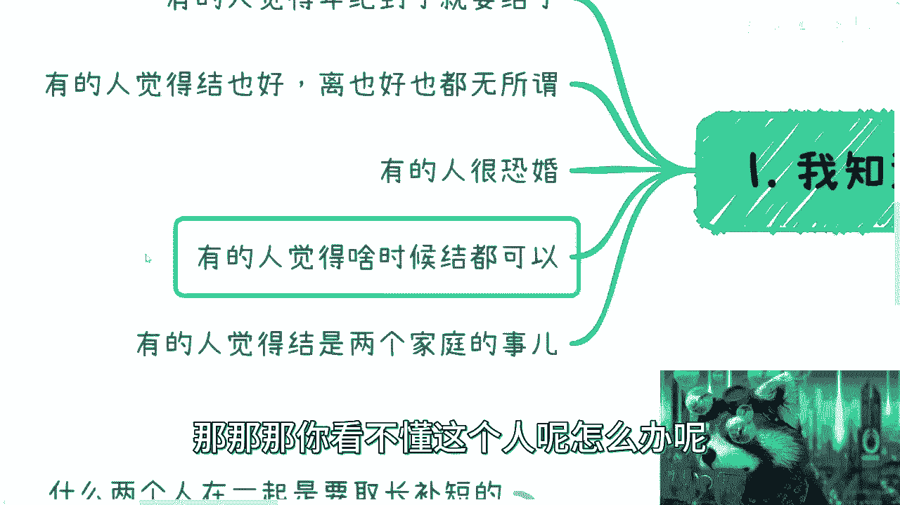

那怎么办呢对吧，那有的人觉得啥时候都结，啥时候结婚都可以啊，也有人觉得呢结是两个家庭的事，我跟你们说啊，别被太多的这种网络PUA，为什么呢，因为嗯咱上面先不去说它。

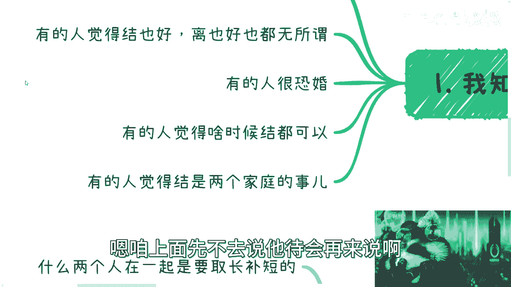

待会儿再来说啊，就你说关于两个家庭这个事呢，我觉得是这样子的，对于一般人来讲，对于普通人来讲，他的确是两个家庭事业也是两个人的事，但是没有这么重要，你知道吧，但咱不是说每个家庭有个几千万要去分手吧。

或者怎么样子，不是啊，也不是说这家里有个有个什么集团公司的吧，下面有很多的子公司要去分，也没有对吧，就我发现真的很多的这种言论啊，在网上啊，他都是那种就是说啊就跟大家讲啊，怎么严谨。

要怎么挑选对吧又怎么样子。

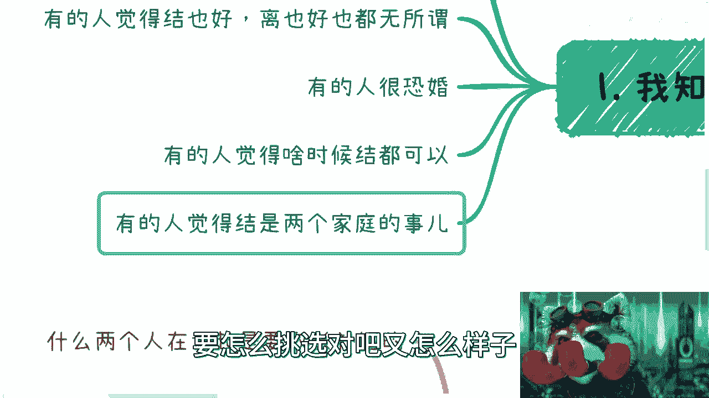

但其实我们没有啊对吧，你跟我讲这么多干嘛对吧，那我们要说我们就是个普通人是吧。

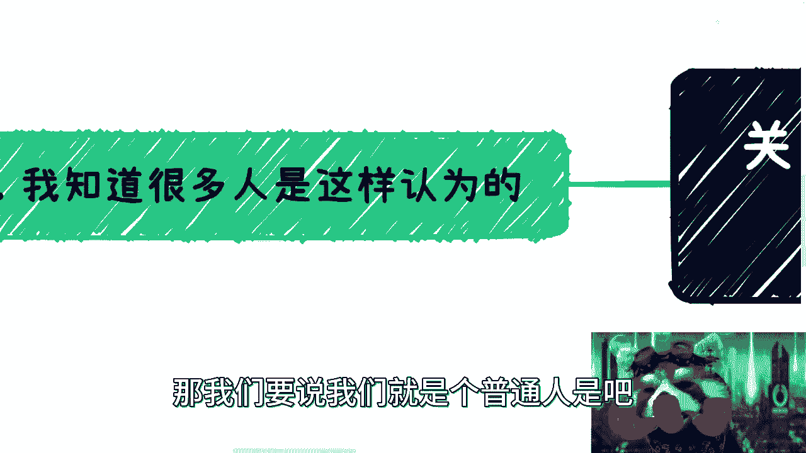

那普通人我就不用想这么多了啊，啊那我觉得这个第二呢我首先来讲个故事啊。

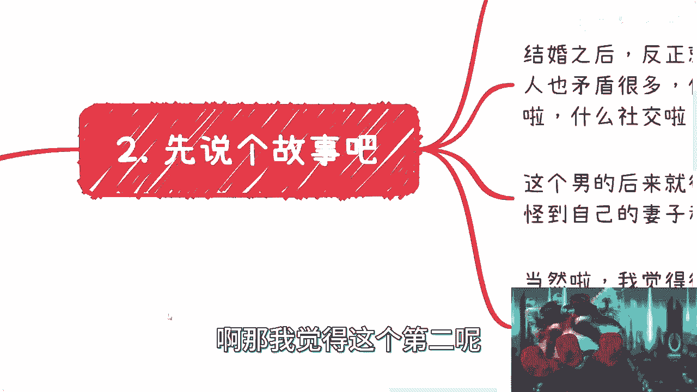

我以前有个朋友也在上海啊。

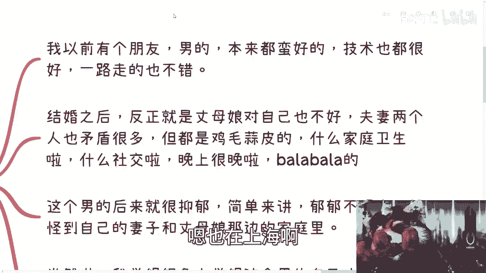

嗯是个男的啊，本来就蛮好的，我觉得技术也蛮好的，一路走的也不错啊。

但是呢他结婚应该不早，可能相对中后期吧。

中后期英雄啊，那结婚之后呢，反正就是说丈母丈母娘对自己不好啊。

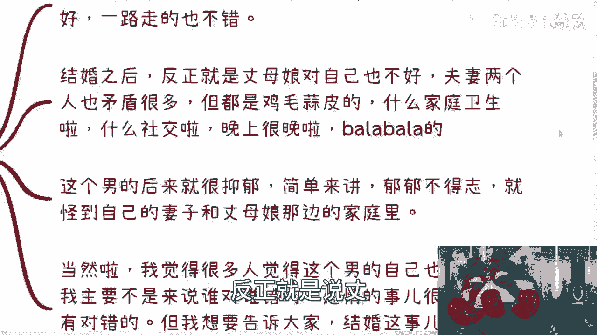

夫妻两个人矛盾比较多，但是呢我我了解过，就基本上都是鸡毛蒜皮的对吧，什么家庭卫生啊，你怎么在家里不打扫了对吧，什么社交，你怎么晚上这么晚了对吧，怎么喝酒了对吧，巴拉巴拉巴拉，网络各种各样的问题啊。

我觉得呢这种事情是这样子的啊，就是你单反一两次，我觉得问题不大，你时间长了，你想嘛，你两个人这个要走一辈子的是吧，你时间长了，这谁受得了对吧，当然啊这个地方咱不要性别对立对吧。

这个男女都一样啊，没区别啊，没区别都一样，没什么区别的啊，然后呢就是说这个男的呢后来就很抑郁对吧，简单来讲就是郁郁不得志，那郁不得志呢就是说那就怪到自己老婆，还有这个丈母娘这边啊。

就说什么家庭对她不好啦对吧，这个家里面很烦了对吧，然后束缚住他拉不拉不拉对吧，好那说到这呢，我觉得很多人也会觉得这个男的自己有问题啊，这个我觉得我也认同啊，但是呢我觉得核心点主题不是在于。

说一件事情里面谁对谁错，因为感情这个事情里面没有这么多。

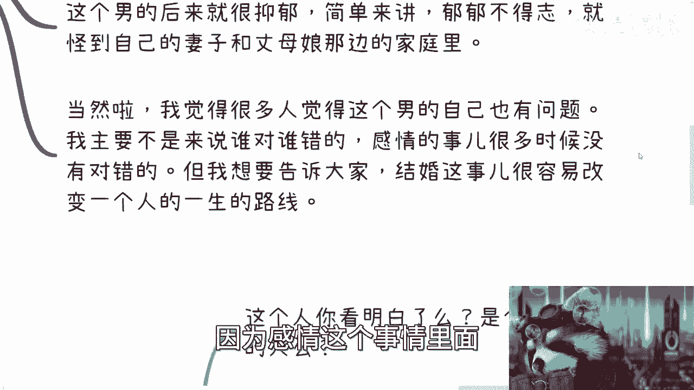

对和错的事情啊，没有绝对对和错的，这就好像我告诉你们，我看问题都是一样的，就是我给你们描述的只是我知道的，但是我也告诉你们，我知道的可能都是表面核心矛盾，我们是不知道对吧，但是不管怎么样。

我不管他核心矛盾是什么，你的结果现在放在这个地方对吧，就是就是你要么就是一个人DEBUFF，要么就两个人DEBUFF，要么就是与这个这么两败俱伤，这个有什么意义呢，对不对，所以说我跟你们讲啊。

结婚这个事儿啊，我跟你说，就是我在这地方举这个例子，是讲的，就是很容易改变一个人的一生的一个路线啊，包括就是说也很容易改变，就是说你一个人的一个一个发展，哎呀这个时候呢我又得说啊，是这样子的。

就是这个网上也有非常多的言论啊，说什么你你可以找到富婆了对吧，你可以这个就两个人一起奋斗了，怎么样子，这个我后面会来跟你们讲的啊，但是呢就是说嗯，在你们谈恋爱和结婚的过程当中啊，就是会碰到很多的什么啊。

有什么让让让有些人非要回国了，就让另另外一边另外一半回国啊，然后非要让另外一半什么什么换城市了吧，换工作了，甚至就是说可能有些对我还看到过，就说什么说什么啊，这个公司里面女生女女同事太多了。

然后什么女朋友跟她闹不开心的就好多好多，你知道吗，就还有找我咨询的，也说也有提到过这些事，知道了，就我觉得很多时候就是要断舍离，就断舍离是既对自己尊重，又对别人尊重，也是对自己负责，因为所有的这些事情。

你们但凡格局大一点，就是站的高度高一点，就会发现都是一些鸡毛蒜皮的影响自己，何必呢，对吧，你就活一辈子，为什么要，为什么因为这件事情影响自己，那莫名其妙吗，对不对。

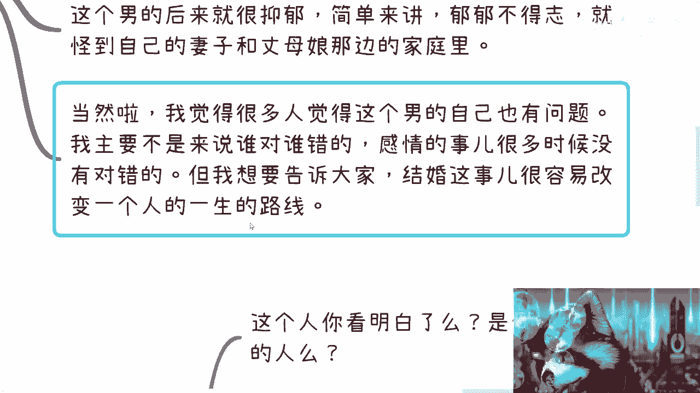

啊然后这个是二啊，三呢我觉得这个核心要考虑的事是这样子的啊。

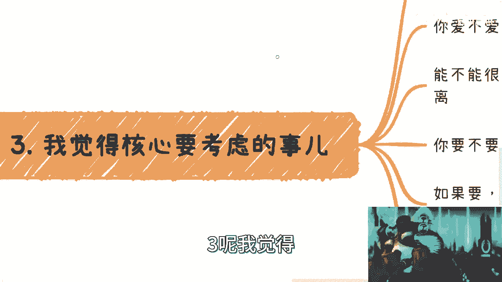

我觉得从一个普通人来讲，呃，这边应该是我按照优先级来写的啊，就是说第一呢你得问清楚，我就问自己，你看明白了没有，这个这个人是不是善良的人，这个人是不是三观正的，咱或者这么说。

就说这个人可以是一个就是很有心机，可以是一个就说啊创业的大咖，也可以是一个就是说啊怎么样的一个人无所谓，但是你得看明白他的本质对吧，也就是说他可以是一个怎么样怎么样的人，但是他的本质好不好。

你得看明白啊，你就是当然了，就这个东西真的我只跟你们讲，只能你们你们自己看明白，因为很多人是上头的，很多人是恋爱脑，他看不明白，他就跟你讲，我觉得这个人就很好，你知道吗，但是有很多时候其实就他妈的不好。

就他妈垃圾对吧，那你怎么跟他说呢，没法说对吧，但是你谈个恋爱，我觉得无所谓，你结婚这个对吧，不太一样，啊这是第一个，第二个呢就说你爱不爱这个人啊，对对这个你们自己判断啊，第三个呢就是说能不能很好的沟通。

这个呢是非常重要的，就是说所有的事情啊，就是你们要去呃买未来的，买房子也好啊，资产也好啊，或者你们要这个出国也好啊对吧，各个方面也好，你们能不能很好的沟通，因为我现在发现我大概接触十个人里面。

有六七个人都是不会好好沟通的，要么就是冷冷战啊，要么就是PUA，你知道还有PUA，不要太严重啊，现在到处就是PUA，你知道吧啊，那那能不能就说就是论事大家客观的沟通对吧，就好好的沟通啊。

就是当然我说我说这种沟通啊，指的是大家要都阐述自己的意见啊，别就说啊，我今天跟你们说什么什么，然后对另外一半跟你说，嗯好的嗯好的，随你嗯啊我没什么意见，那他妈就不叫狗头啊，这完全不叫沟通。

就是你们双方都得有想法，我跟你讲好，然后呢我跟你们讲啊，有很多人也会跟我说，他说啊这个我我的另一半就没什么想法，他就这么一个人，我就会跟他讲，我说我我我绝对不相信的啊，我绝对不相信什么。

就这么一个人这种说法的，没有的，每一个人都有他自己的想法，取决于他想不想说，你知道吧，没有什么就这么一个人的，而且我也跟你们这么说，就算他当下退1万步来讲，是这么一个人，人随着时间是会变化的哦。

她会说到她父母，她会受到她闺蜜，她会受到她，比如说同事对吧，她会受到她各种各样的一些情况，受到影响的就很多很多，哪儿哪儿哪会没有想法，不会的，我跟你讲，但凡跟你说哦，随你吧，但凡我没什么想法的。

以后都会有矛盾的，就这么简单啊，然后这个是第一个，第二个呢就是说你能够无论什么时间，要能够沟通，哎呀我这边没写全啊，无所谓啊，要能够隔离，什么叫隔离呢，就是说你双方的这个家里面的事情。

比如说你应该跟这个另外一方的家里面，去沟通的对吧，或者另外一方家里面有些什么问题，或者对你有什么意见对吧，或者怎么样啊，就这些事情都是应该隔离到就是双方自己这边，然后你们两个人去沟通。

而不是说就说挎着对吧，什么什么，你比如说对方家里，对方家里面人直接来找你啊，我们对峙啊啊啊，我对你有意见的玩玩玩玩对吧，我觉得没有必要没有必要，就是很多事情你要他们，你们双方都要学会隔离。

然后你们双方去沟通就这么简单，没有那么多复杂的事情，然后还有就是说你们要不要孩子，两个人是不是很坚定，要不要别一会要一会不要啊，别人就是说什么什么哎呀，现在好像不来了，然后回头什么迫于父母压力又要了。

我跟你们讲，还是那句话，苦的都是自己，何必呢对吧，何必呢啊，我跟你说说什么叫普通人，普通人就是苦的，不但是你们苦的还是孩子，还是父母，不是说这个是什么对吧，这天作孽犹可活，自作孽不可活。

你知道吧啊那如果要难，我跟你讲，你啥时候要对吧，你得考虑好父母双方父母的身体情况，你要考虑好你自己奋斗的时间，我不管你是男是女啊，就你得考虑好你自己事业的时间，自己要去奋斗时间，自己要去赚钱的时间。

你都得想好的啊，不是说什么脑子一热，我就就生孩，自然是吧，还有是什么呢，你得考虑好什么呢，你以后孩子的青春期的这个时间，和你自己的奋斗时间，以及你另外一半的更年期，或者你自己的更年期，对不对，什么意思。

就是说你总有一段时间社会很烦呐对吧，就不管是你事业事业到了瓶颈，还是你年纪大了，还是你父母有就是小毛小病对吧，还是说怎么样，你你要这么想的，你应该也不希望说所有的事情。

所有的很烦的时间都挤在一个时间点吧，对不对，你要自己去考虑的，不管你是男是女啊。

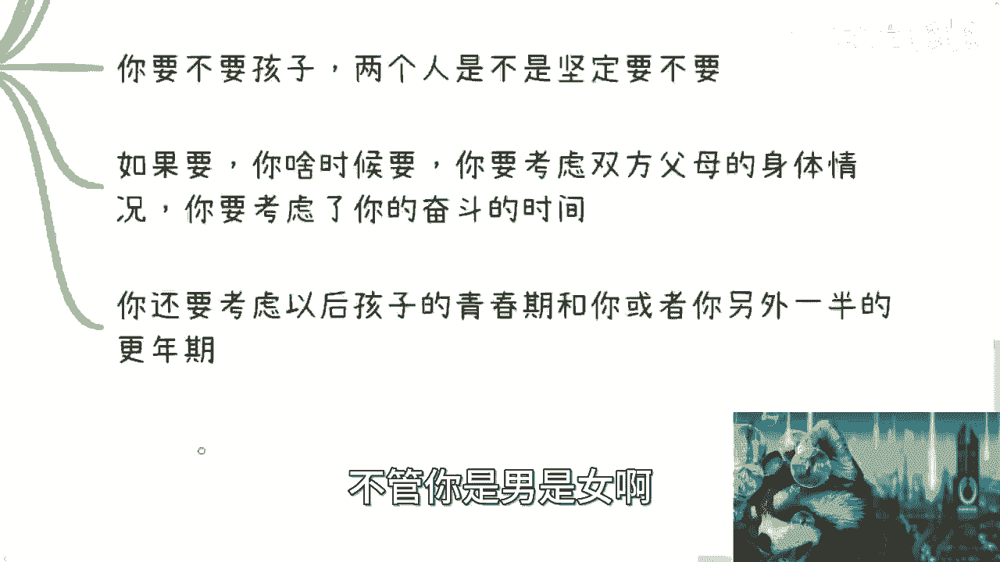

对吧啊，当然这个地方还有一点我得强调一下。

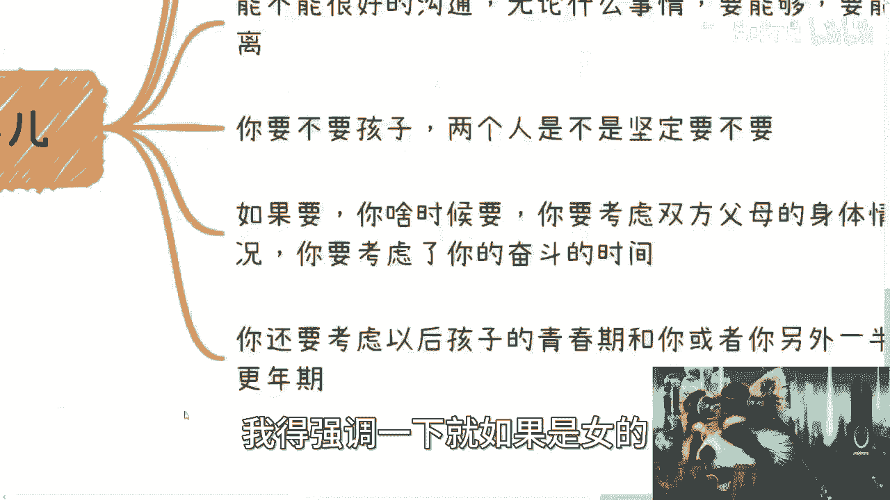

就如果是女的女孩子的话，这地方得要强调一点，就是女生孩子的年龄，你肯定是越早越好啊。

别自己跟自己过不去，好那么那个关于结婚对吧。

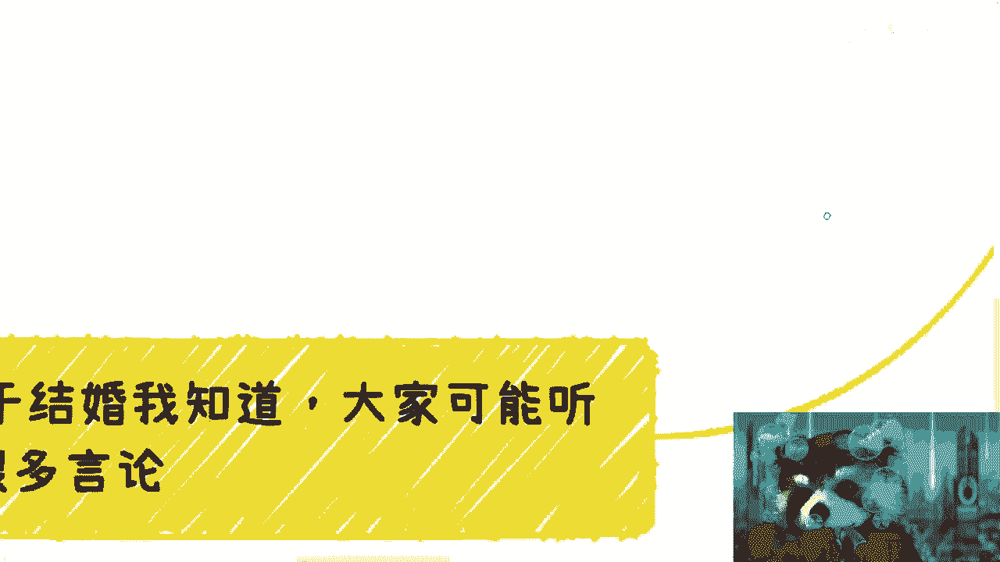

我觉得这个大家可能听到过很多言论啊，我们来看一下啊，比如说呢什么两个人在一起取长补短对吧，然后说什么就跟商业合作一样的，一定要有什么互补啊，然后呢最好要兴趣相投对吧。

然后两个人结婚嘛是两个家庭的事情对吧啊，要考虑好资产，考虑好资产分割对吧啊，考虑好这个就好的伴侣是你的如虎添翼对吧。

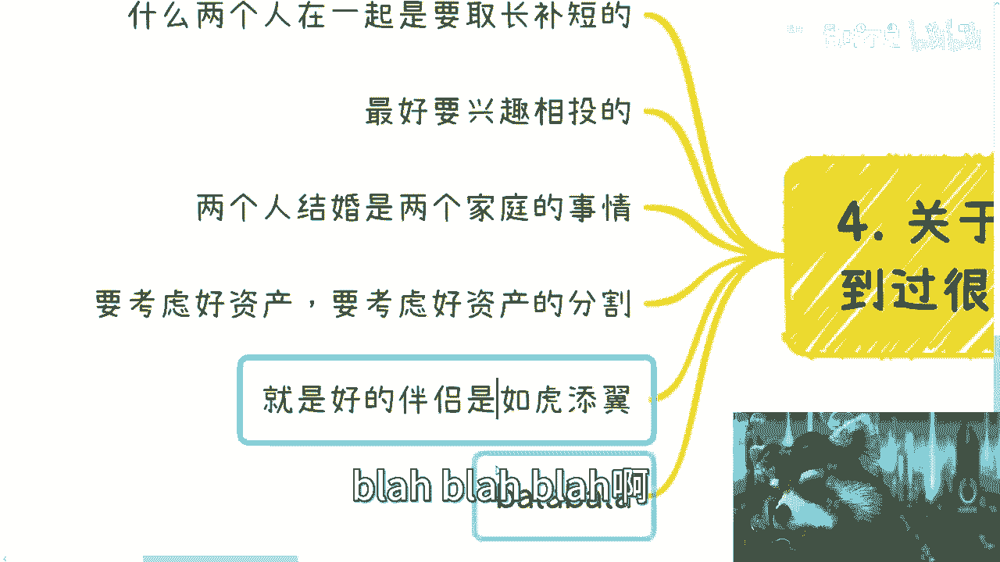

巴拉巴拉巴拉啊，我跟你这么说，我们是一个普通人。

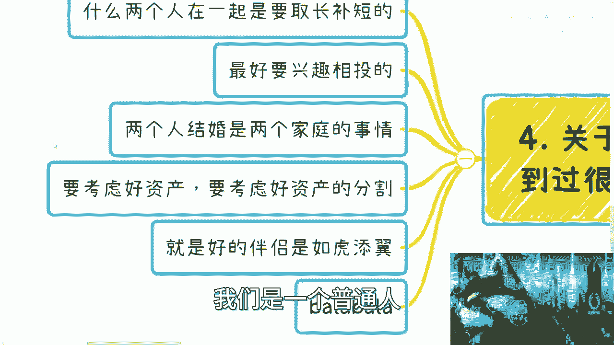

普通人什么意思呢，普通人意思就是说你碰到一个垃圾，你碰到一个就是说三观不正的，你碰到一个性格很不好的人，是大概率，你碰到我这边写的对吧，就网上给你们写的这些鸡汤的，毕竟是小概率对吧。

就是说我们不要被那些PUA的东西去占据。

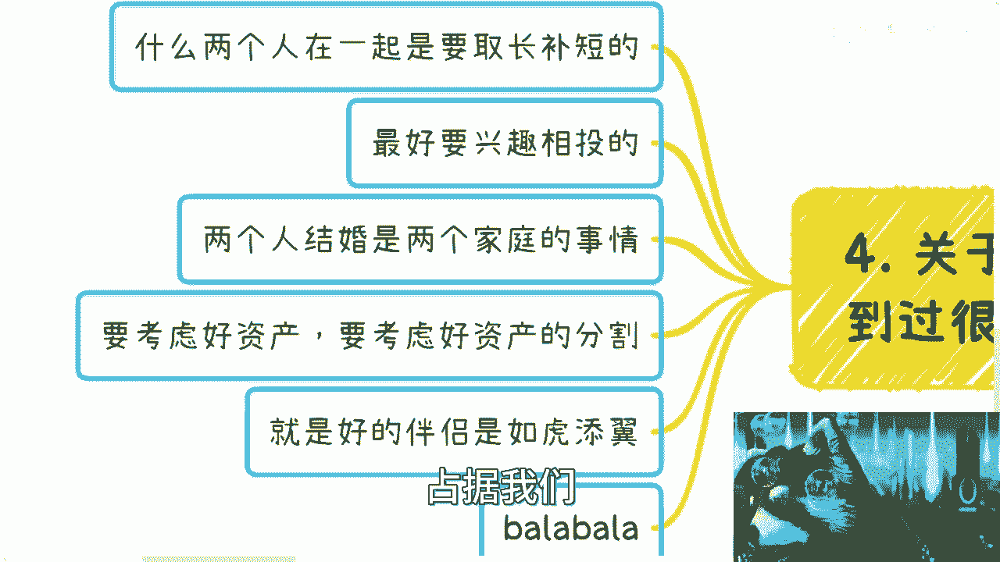

我们思考的主题，我们要考虑的是什么，我们要考虑的是普普通通的两个人。

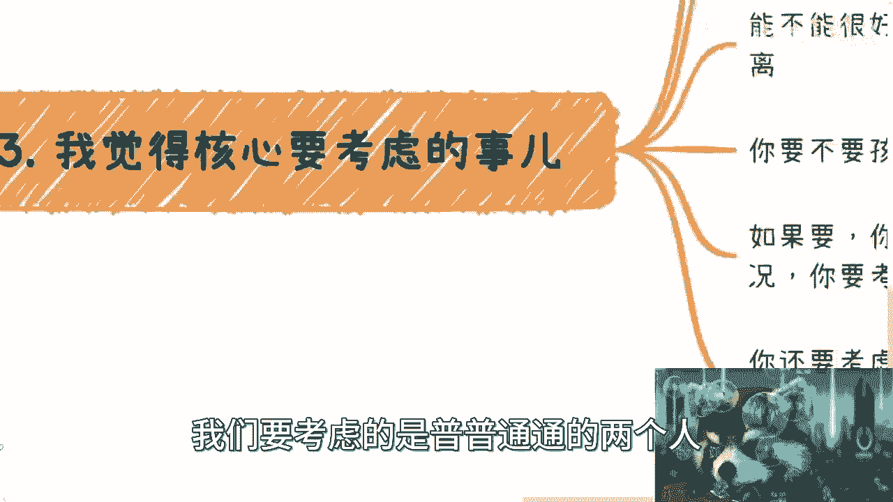

怎么去走下去，就这个地方对吧，哎别老师就是说就是说那个叫什么主，主题颠倒对吧，就是这些不去考虑，在那边想着哎呀，对方跟我是不是互补，对方跟我能不能给我事业上增加一些，就比如说很多男的对吧。

就考虑说哎呀这个我找另外一半，他能不能支持我事业怎么样子，那他妈凭什么支持你事业，莫名其妙了，你们结婚就支持你事业了啊，谁他妈规定的不是他支持你可以，你支持他也可以，这天经地义。

但他妈的是不是支持你事业，是不是支持你别的东西，这他妈凭什么谁谁说的啊对吧，包括就是说什么什么薪资保管啊，资产资产保管啊，这有什么一个人，你们两个人去考虑，你们两个人去商量，你们两个人过。

他妈的是跟网上那些大V过吗，是跟网上那些媒体过吗，对了我之所以一直跟你们说，不要被这个世界，不要被这个世界的媒体，不要被你们的父母就是灌输所谓的世界的那些，有的没的就应该怎么做的。

那些道德观和价值观没有意义的，你得自己去思考，你觉得这样子对不对，你觉得那样子对不对对吧，那别老师就是说哦活了活了20多岁，30多岁了对吧，然后就是活在别人的框架里面，我表示不理解。

对吧还有就是我自己的认知啊。

我自己认知呢，我觉得是这样子，从普通人来讲呢，我觉得要么就早点升啊，早点结早点生，如果不升，你早结晚结都可以啊，我就随意呃，不觉也可不解也可以，一个人蛮开心的对吧，就一个人很爽。

111直一个人一直爽是吧啊，然后呢我还有一点呢，就是我是非常坚定的认为啊，就当代的社会，因为毕竟这个时代不一样了，就当代的社会呢就是说你要么就是早啊，你要么就别提，我觉得没什么意思，你知道吗。

因为你就这么想嘛，所谓你要么早就是早结婚了，早生你要么别结，就是说你就别去折腾了对吧，你要是结了回头什么又又又又晚晚婚了对吧，就是那个对人家小姑娘也不好对吧，那么你要是小姑娘，你对你自己也不好对吧。

然后对自己未来，就是说也就是说整个发展也也不好，没什么意思，真没意思，你知道吗。

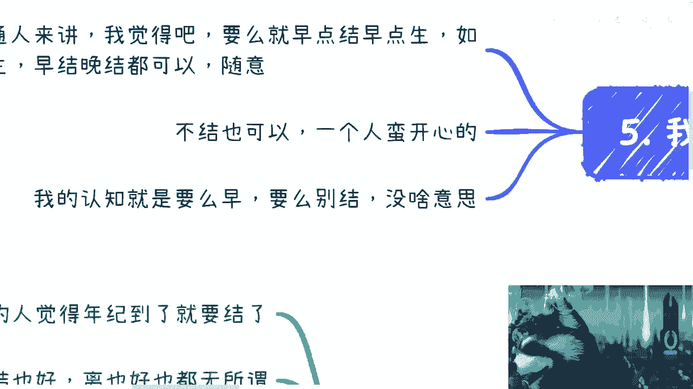

就我跟你们讲啊，就是我所有的定位，都是大家是一个普通老百姓对吧，工程那个那个基层阶级对吧，工薪阶级，那也就是说你所有的想法，就是所有的东西你得去想好的，因为你就像我现在我身边有多少人啊，啊对吧。

就是哦又要想着养孩子，又要想着还薪资，还贷款，又要想着父母身体不好了对吧，又要这边陪着那边生病，这边怎么样的，你有你有几个分手对吧，然后自己还要内耗，然后就因为这些事情自己还在那边想哎呀。

为什么我我我接下来这个事业了怎么办对吧，我到外面去去找一些工作对吧，怎么找找不到怎么办对吧，然后还要运天尤人，你怎么搞得好呢对吧，所以说啊，就是我就是，我为什么要在再而三跟你们说断舍离，这件事情呢。

就是说嗯你生活一辈子，你没必要跟自己过不去，你也没必要跟别人过不去对吧，就是大家认识也就认识了，大家不认识就不认识了对吧，没有人能左右你，你也左右不了别人，就这么简单对吧。

然后别老师因为一些有的没的事情去耗自己，对吧，尤其你你谈恋爱了对吧，然后对方PUA你了对吧，或者对方什么什么呃，这个觉得你不好了对吧，或者你们双方有很多矛盾了啊，尽快断断了之后，next怎么了呢。

妈的世界上这么多人一个个试啊，你才知道哪些人适合你啊，对不对啊，所以我觉得就是说考虑清楚哦，考虑清楚就是这件事情好吧行吧，那个其他的我也想不到了啊，反正你们有啥，你们在评论区问吧，好吧嗯。

然后那个工作工作上面，这个副业上面对吧，职业规划上面，反正你们有什么呃，私信我啊，做这个咨询好吧行。